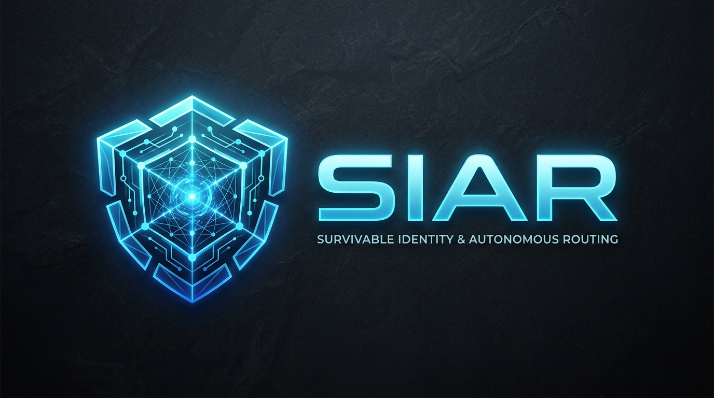
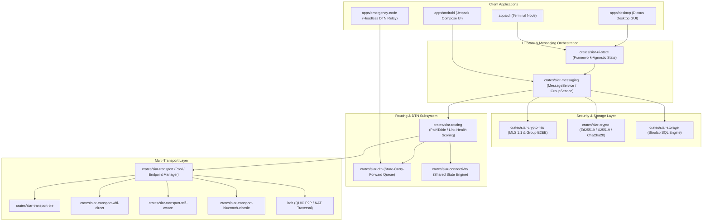

<p align="center">
  
</p>

<h1 align="center">SIAR: Survivable Identity & Autonomous Routing</h1>

<p align="center">
  <a href="https://irshadali5.github.io/siar-site/"></a>
  <a href="wiki/Home.md"></a>
  <a href="https://irshadali5.github.io/siar-site/guide.html"></a>
  <a href="https://irshadali5.github.io/siar-site/sys-arch/"></a>
  <a href="https://irshadali5.github.io/siar-site/docs.html"></a>
  <a href="https://irshadali5.github.io/siar-site/packages.html"></a>
  <a href="#license--duality-model"></a>
</p>

> **Official Showcase, Package Center & Live Architecture Documentation:**
> - 🌐 **[Official Product Presentation](https://irshadali5.github.io/siar-site/)**
> - 📚 **[Comprehensive Technical Wiki (26 Chapters)](wiki/Home.md)** (System Stack, Multi-Device Trust, Routing, DTN, Security Center, Calls, Testing & Operations)
> - 📘 **[End-to-End User & Operations Manual](https://irshadali5.github.io/siar-site/guide.html)** (Downloading, Zero-Knowledge Setup, QR/NFC Pairing, Vault Export/Import & Anti-Forensics)
> - 📑 **[System Architecture & Protocol Specs (mdBook)](https://irshadali5.github.io/siar-site/sys-arch/)**
> - 📦 **[Universal Package Center](https://irshadali5.github.io/siar-site/packages.html)** (.deb, .rpm, .apk, .dmg, brew, winget)
> - 🔬 **[Interactive WASM Mesh Simulator Lab](https://irshadali5.github.io/siar-site/simulator.html)**
> - 🛡️ **[SLSA Level 3+ Supply Chain Cryptographic Verifier](https://irshadali5.github.io/siar-site/verify.html)**

**SIAR** (*Survivable Identity & Autonomous Routing*) is a zero-infrastructure, multi-transport, offline-first decentralized messaging and delay-tolerant networking (DTN) platform.

---

## Table of Contents

- [About SIAR](#about-siar)
  - [Core Philosophy](#core-philosophy)
  - [Core Architecture & Language Hierarchy](#core-architecture--language-hierarchy)
  - [Deployment Modes: Standalone App & Headless Off-Grid Repeater/Booster](#deployment-modes-standalone-app--headless-off-grid-repeaterbooster)
  - [SIAR vs Traditional Messengers](#siar-vs-traditional-messengers)
- [System Architecture](#system-architecture)
  - [High-Level Architecture Diagram](#high-level-architecture-diagram)
  - [Workspace Crate Map (33 Crates)](#workspace-crate-map-33-crates)
- [System Architecture Topics (Specifications Index)](#system-architecture-topics-specifications-index)
  - [Core System Specifications (33 Topics)](#system-architecture--technical-specifications)
  - [UI/UX Architecture Specifications (27 Topics)](#uiux-architecture-specifications-27-topics)
- [Architectural Implementation Status & Coverage](#architectural-implementation-status--coverage)
- [Prerequisites & Environment Setup](#prerequisites--environment-setup)
  - [1. Nix Development Environment (Recommended)](#1-nix-development-environment-recommended)
  - [2. Manual Rust & Platform Setup](#2-manual-rust--platform-setup)
- [Build & Compilation Tutorial](#build--compilation-tutorial)
  - [1. Building the Rust Workspace](#1-building-the-rust-workspace)
  - [2. Cross-Compiling Android Native (.so) Libraries](#2-cross-compiling-android-native-so-libraries)
  - [3. Building the Android Application](#3-building-the-android-application)
- [Node Configuration & User Guide](#node-configuration--user-guide)
  - [1. Command-Line Interface (`siar-cli`)](#1-command-line-interface-siar-cli)
  - [2. Desktop Application (`siar-desktop`)](#2-desktop-application-siar-desktop)
  - [3. Headless Emergency Relay Node (`siar-emergency-node`)](#3-headless-emergency-relay-node-siar-emergency-node)
  - [4. Android Messenger App (`apps/android`)](#4-android-messenger-app-appsandroid)
- [Testing & Fuzzing](#testing--fuzzing)
  - [Unit & Multi-Node Integration Tests](#unit--integration-tests)
  - [Mesh Network Simulation](#mesh-network-simulation)
  - [Cargo Fuzz Protocols](#fuzzing)
- [License & Dual-Tier Model](#license--dual-tier-model)

---

## About SIAR

### Core Philosophy

1. **Rust-First Primary Core**: Complete business logic, crypto, routing, and networking are unified in pure-Rust core crates. Kotlin is used exclusively for the Android UI.
2. **Zero Central Dependencies**: Communication functions directly between devices without requiring centralized identity registries, DNS servers, or cloud relays.
3. **Multi-Transport Opportunistic Mesh**: Devices dynamically discover and switch between available physical links—local Wi-Fi Direct, Wi-Fi Aware, BLE, Bluetooth Classic, LAN, and Internet QUIC endpoints—without dropping application-level sessions.
4. **Off-Grid Store-Carry-Forward (DTN)**: Headless repeater daemons (`siar-emergency-node`) and client nodes store, carry, and boost-forward messages across disconnected physical environments during severe internet outages.
5. **Cryptographic Autonomy**: Every device self-generates its cryptographic identity (`DeviceIdentity` with Ed25519 signing keys and X25519 key exchange keys). MLS (Messaging Layer Security) provides strong forward secrecy and post-compromise security for 1:1 and group conversations.

### Core Architecture & Language Hierarchy

- **Rust is the Primary & Core Engine**: the SIAR codebase is written in pure, modern Rust. All core cryptography, binary protocol framing, DTN store-carry-forward queues, path routing, storage engines, and multi-transport socket management are implemented entirely in Rust for maximum memory safety and bare-metal performance.
- **Kotlin for Android UI Only**: Kotlin is strictly used in `apps/android` for the Jetpack Compose User Interface and native Android OS permissions/hardware bindings, interfacing directly with the Rust core engine via zero-copy C-ABI JNI bridges.

### Deployment Modes: Standalone App & Headless Off-Grid Repeater/Booster

SIAR is engineered to deploy in two distinct operating forms:
1. **Standalone User Applications**:
   - **Android App** (Jetpack Compose UI)
   - **Desktop GUI** (Dioxus Desktop UI for Linux / Windows)
   - **Terminal Messenger** (`siar-cli`)
2. **Headless Off-Grid Repeater & Signal Booster Daemon (`siar-emergency-node`)**:
   - Can be deployed as a headless daemon on **any device**—Raspberry Pi, Linux servers, embedded router hardware, solar-powered field nodes, or dedicated mobile repeater boosters.
   - Functions as an **autonomous store-carry-forward mesh repeater**, receiving, buffering, and re-transmitting encrypted messages across disconnected network partitions during **complete internet blackouts, emergency outages, and off-grid disaster scenarios**.

### SIAR vs Traditional Messengers

| Feature | SIAR | Signal / WhatsApp / Telegram |
| :--- | :--- | :--- |
| **Server Requirement** | **None** (Fully Autonomous P2P / Mesh) | Mandatory Central Cloud Servers |
| **Offline / Disaster Operation** | **Native** (BLE, Wi-Fi Direct/Aware, DTN) | Unusable without Internet |
| **Addressing & Identity** | Self-sovereign Peer Tickets / Endpoint Keys | Phone Numbers / Cloud User IDs |
| **Transport Layer** | Multi-transport adaptive path routing | HTTPS / WebSockets / TCP |
| **Group Security** | OpenMLS (Forward Secrecy + Post-Compromise) | Custom Signal Protocol / Server-managed |
| **Hardware Codec Acceleration** | Native Android `MediaCodec` + pure-Rust DSP | WebRTC / Platform C-libs |

---

## System Architecture

### High-Level Architecture Diagram



### Workspace Crate Map (33 Crates)

SIAR is structured as a modular Rust cargo workspace comprising **33 domain crates**, **4 application binaries**, Android JNI runtime bridges, and fuzz testing targets:

```text
siar/
├── apps/
│   ├── android/                          # Android Native App & JNI Bridges
│   │   ├── app/                          # Jetpack Compose UI (Chat, Groups, Settings, Radar)
│   │   ├── messaging-jni/                # Rust JNI cdylib surface (siar-android-messaging)
│   │   ├── rust-jni-glue/                # Shared JNI glue, memory safety, and JVM callbacks
│   │   └── build-native.sh               # Multi-ABI cargo-ndk build automation script
│   ├── cli/                              # Interactive Terminal Messenger & Diagnostics Node
│   ├── desktop/                          # Desktop GUI Application (Dioxus 0.7 Desktop UI)
│   └── emergency-node/                   # Headless Emergency DTN Relay & Booster Daemon
├── crates/
│   ├── [Core Domain, Identity & Cryptography]
│   │   ├── siar-domain/                  # Core entities: AccountId, DeviceId, Ticket, SafetyFingerprint
│   │   ├── siar-crypto/                  # Ed25519, X25519, ChaCha20-Poly1305, zeroize primitives
│   │   ├── siar-crypto-mls/              # IETF MLS (RFC 9420) 1:1 and group E2EE engine
│   │   └── siar-identity-multidevice/    # Multi-device authority, device certs, trust store, SAS pairing (Part 02)
│   ├── [Protocols & Extension Engine]
│   │   ├── siar-protocol/                # Wire envelopes, Postcard binary codec, frame types
│   │   ├── siar-protocol-ext/            # Extensible protocol engine (108/108 spec complete, Part 01)
│   │   └── siar-capability/              # Two-phase capability negotiation & codec matrices (Part 07)
│   ├── [Mesh Routing, Policy & Connectivity]
│   │   ├── siar-routing/                 # PathTable, link health scoring, latency metrics, classification
│   │   ├── siar-routing-policy/          # Multi-metric candidate path scoring & hysteresis (Part 03)
│   │   └── siar-connectivity/            # Cross-transport state engine & dynamic link probes
│   ├── [DTN, Emergency Priority & Scheduling]
│   │   ├── siar-dtn/                     # Opportunistic DTN store-carry-forward buffer & anti-entropy
│   │   ├── siar-dtn-bundle/              # Bundle framing & spray-and-wait forwarding strategies (Part 06)
│   │   └── siar-emergency/               # Priority class queuing (P0-P3) & battery override (Part 17)
│   ├── [Storage, Blobs & Reliability]
│   │   ├── siar-storage/                 # Pure-Rust Stoolap embedded SQL repos (Messages, Contacts, Outbox)
│   │   ├── siar-event-log/               # Append-only offline event log & causal gap detection (Part 04)
│   │   ├── siar-blob-manifest/           # Merkle DAG blob chunking (BLAKE3) & AEAD encryption (Part 05)
│   │   ├── siar-resource-limits/         # Backpressure engine, token buckets & queue drop policies (Part 08)
│   │   └── siar-crash-recovery/          # WAL recovery, transactional checkpoints & corrupt state isolation (Part 09)
│   ├── [Messaging Orchestration & UI State]
│   │   ├── siar-messaging/               # MessageService, GroupService, Ticket manager, multi-node tests
│   │   └── siar-ui-state/                # Framework-agnostic UI state machines & Security Center (Part 15)
│   ├── [Realtime Media & Hardware Codecs]
│   │   ├── siar-media-core/              # Media traits, raw video/audio buffers, sample clocks
│   │   ├── siar-media-audio/             # Desktop Opus audio codec integration & DSP filters (Part 26)
│   │   ├── siar-media-av1/               # Desktop dav1d AV1 video decoder with lookahead decoding
│   │   ├── siar-media-android/           # Android MediaCodec hardware surface zero-copy pipeline (Part 25)
│   │   ├── siar-media-image/             # Image processing, format transcoding & responsive thumbnails
│   │   └── siar-calls/                   # Realtime P2P media call session protocols & signaling (Part 29)
│   ├── [Multi-Transport Physical Sockets]
│   │   ├── siar-transport/               # Transport manager, pooled socket multiplexer & lifecycle
│   │   ├── siar-transport-ble/           # Linux/cross-platform Bluetooth Low Energy transport
│   │   ├── siar-transport-ble-android/   # Android native Bluetooth Low Energy transport driver
│   │   ├── siar-transport-bluetooth-classic/# High-throughput RFCOMM Bluetooth Classic transport
│   │   ├── siar-transport-wifi-direct/   # High-bandwidth Wi-Fi Direct P2P ad-hoc transport
│   │   └── siar-transport-wifi-aware/    # Wi-Fi Aware (NAN - Neighbor Awareness Networking) transport
│   └── [Simulation & Test Harness]
│       └── siar-testkit/                 # In-memory virtual radio mesh simulator & link impairments
├── platform/
│   └── android/                          # Android native platform bindings & permission harnesses
└── fuzz/                                 # Cargo Fuzz targets (frame & blob decoders)
```

---

## System Architecture & Technical Specifications

Comprehensive system architecture specifications (60 detailed design documents across core protocols, cryptography, and UI/UX) are hosted in the **[SIAR Official Site & Architecture Portal](https://irshadali5.github.io/siar-site/sys-arch/)** and maintained in the **[siar-site](https://github.com/irshadali5/siar-site)** repository:

| Part | Specification Document | Topic | Description |
| :---: | :--- | :--- | :--- |
| **01** | [`01-protocol-extension`](https://irshadali5.github.io/siar-site/sys-arch/01-protocol-extension-system-architecture.html) | **Protocol Extensions** | TLV frame framing, extensible wire headers, backward/forward compatibility |
| **02** | [`02-multi-device-identity`](https://irshadali5.github.io/siar-site/sys-arch/02-multi-device-identity-architecture.html) | **Multi-Device Identity** | Ed25519 master keys, subkey derivation, device provisioning, key revocation |
| **03** | [`03-transport-routing-policy`](https://irshadali5.github.io/siar-site/sys-arch/03-transport-routing-policy-engine-architecture.html) | **Routing Engine** | Cost metrics, latency/bandwidth scoring, dynamic link quality selection |
| **04** | [`04-offline-event-log`](https://irshadali5.github.io/siar-site/sys-arch/04-offline-event-log-architecture.html) | **Offline Event Log** | Append-only event log, sequence vectors, state synchronization |
| **05** | [`05-robust-file-blob`](https://irshadali5.github.io/siar-site/sys-arch/05-robust-file-blob-subsystem-architecture.html) | **Blob Subsystem** | Chunking, BLAKE3 content-addressable storage, AES-GCM streaming encryption |
| **06** | [`06-dtn-store-carry-forward`](https://irshadali5.github.io/siar-site/sys-arch/06-dtn-store-carry-forward-architecture.html) | **DTN Core** | Opportunistic epidemic routing, TTL expiry, anti-entropy sync for off-grid meshes |
| **07** | [`07-capability-negotiation`](https://irshadali5.github.io/siar-site/sys-arch/07-capability-negotiation-architecture.html) | **Capabilities** | Version handshakes, media codec capability matrix, link parameters |
| **08** | [`08-resource-limits`](https://irshadali5.github.io/siar-site/sys-arch/08-resource-limits-backpressure-architecture.html) | **Backpressure** | Flow control, memory bounds, priority queue dropping under congestion |
| **09** | [`09-crash-recovery`](https://irshadali5.github.io/siar-site/sys-arch/09-crash-recovery-architecture.html) | **Crash Safety** | WAL recovery, transactional checkpoints, corrupt state isolation |
| **10** | [`10-fuzzing-protocol`](https://irshadali5.github.io/siar-site/sys-arch/10-fuzzing-protocol-test-suite-architecture.html) | **Fuzz Testing** | AFL/libFuzzer strategies for Postcard frames, blob decoders, and fuzz targets |
| **11** | [`11-relay-infrastructure`](https://irshadali5.github.io/siar-site/sys-arch/11-relay-self-hosted-infrastructure-architecture.html) | **Relay Nodes** | Unlinkable token-mailbox relaying, DERP/STUN/TURN NAT traversal |
| **12** | [`12-multipath-networking`](https://irshadali5.github.io/siar-site/sys-arch/12-multipath-networking-architecture.html) | **Multipath** | Concurrent multi-socket striping across Wi-Fi, BLE, and cellular interfaces |
| **13** | [`13-battery-aware`](https://irshadali5.github.io/siar-site/sys-arch/13-battery-aware-scheduling-architecture.html) | **Power Management** | Battery level polling, BLE duty cycle adjustment, wake lock lifecycle control |
| **14** | [`14-proximity-abstraction`](https://irshadali5.github.io/siar-site/sys-arch/14-proximity-abstraction-architecture.html) | **Proximity** | Unified API for BLE RSSI, Wi-Fi Aware distance, and mDNS discovery |
| **15** | [`15-qr-nfc-bootstrap`](https://irshadali5.github.io/siar-site/sys-arch/15-qr-nfc-bootstrap-pairing-architecture.html) | **Out-of-Band Pairing** | QR code / NFC payload format for PeerTicket exchange |
| **16** | [`16-daemon-headless`](https://irshadali5.github.io/siar-site/sys-arch/16-daemon-headless-runtime-architecture.html) | **Headless Runtime** | UNIX domain socket IPC, systemd daemonization, and CLI control surfaces |
| **17** | [`17-emergency-priority`](https://irshadali5.github.io/siar-site/sys-arch/17-emergency-priority-classes-architecture.html) | **Emergency Priority** | High-priority SOS broadcast preemption over normal traffic |
| **18** | [`18-network-diagnostics`](https://irshadali5.github.io/siar-site/sys-arch/18-network-diagnostics-path-visualization-architecture.html) | **Path Diagnostics** | Route tracing, RTT latency measurement, graph visualization metrics |
| **19** | [`19-c-abi-ffi`](https://irshadali5.github.io/siar-site/sys-arch/19-c-abi-ffi-architecture.html) | **C/FFI Layer** | Stable C ABI header definitions for iOS/C++ integration |
| **20** | [`20-embedded-linux`](https://irshadali5.github.io/siar-site/sys-arch/20-embedded-linux-node-architecture.html) | **Embedded Linux** | Low-footprint compilation flags for Raspberry Pi, OpenWrt, and field nodes |
| **21** | [`21-third-party-protocol-extensions`](https://irshadali5.github.io/siar-site/sys-arch/21-third-party-protocol-extensions-architecture.html) | **Third-Party Extensions** | Sandboxed custom protocol handlers, frame registration, and hooks |
| **22** | [`22-wasm-compatible-components`](https://irshadali5.github.io/siar-site/sys-arch/22-wasm-compatible-components-architecture.html) | **WASM Components** | Compiling cryptographic and protocol verification filters to WebAssembly |
| **23** | [`23-external-interoperability-suite`](https://irshadali5.github.io/siar-site/sys-arch/23-external-interoperability-suite-architecture.html) | **Interoperability Suite** | Conformance testing, cross-client golden files, and compatibility test vectors |
| **24** | [`24-plugin-module-ecosystem`](https://irshadali5.github.io/siar-site/sys-arch/24-plugin-module-ecosystem-architecture.html) | **Plugin Ecosystem** | Dynamic extension modules, capability permissions, and lifecycle isolation |
| **25** | [`25-android-hardware-surface`](https://irshadali5.github.io/siar-site/sys-arch/25-android-direct-hardware-surface-zero-copy-media-architecture.html) | **Android Hardware Media** | Zero-copy `Surface` / `GraphicBuffer` pipeline into MediaCodec |
| **26** | [`26-rust-first-audio-dsp`](https://irshadali5.github.io/siar-site/sys-arch/26-rust-first-audio-dsp-resampling-aec-ns-agc-architecture.html) | **Rust Audio DSP** | Pure-Rust audio processing, acoustic echo cancellation, noise suppression, AGC |
| **27** | [`27-rust-driven-android-native-build`](https://irshadali5.github.io/siar-site/sys-arch/27-rust-driven-android-native-build-packaging-automation.html) | **Android Build Automation** | Automated `cargo-ndk` multi-ABI `.so` packaging and CI pipeline |
| **28** | [`28-production-security`](https://irshadali5.github.io/siar-site/sys-arch/28-production-security-e2ee-key-management-privacy-architecture.html) | **Security & Privacy** | Threat model, identity blinding, MLS key package rotation, abuse resistance |
| **29** | [`29-realtime-calls-media-session`](https://irshadali5.github.io/siar-site/sys-arch/29-realtime-calls-media-session-protocol-architecture.html) | **Realtime Call Sessions** | P2P audio/video call signaling, jitter buffering, and RTP session control |
| **30** | [`30-presence-availability`](https://irshadali5.github.io/siar-site/sys-arch/30-presence-availability-typing-read-receipts-ephemeral-state-architecture.html) | **Presence & Ephemeral State** | Typing indicators, read receipts, peer availability heartbeats, TTL state |
| **31** | [`31-notifications-push-lifecycle`](https://irshadali5.github.io/siar-site/sys-arch/31-notifications-push-background-delivery-lifecycle-architecture.html) | **Notifications & Lifecycle** | Unified push wake, background packet scheduling, battery-safe OS lifecycle |
| **32** | [`32-search-indexing`](https://irshadali5.github.io/siar-site/sys-arch/32-search-indexing-local-knowledge-privacy-architecture.html) | **Search & Local Knowledge** | Zero-knowledge local inverted index, encrypted text search, fast indexing |
| **33** | [`33-backup-restore`](https://irshadali5.github.io/siar-site/sys-arch/33-backup-restore-export-import-archival-portability-architecture.html) | **Backup & Portability** | Encrypted archival vaults, incremental snapshots, cross-platform export/import |

### UI/UX Architecture Specifications (27 Topics)

| # | Specification Document | Domain | Scope & Technical Implementation |
| :---: | :--- | :--- | :--- |
| **01** | [`ui-ux-01-product-foundation`](https://irshadali5.github.io/siar-site/sys-arch/ui-ux-01-product-foundation-cross-platform-interaction-architecture.html) | **Product Foundation** | Cross-platform interaction model, mental model, trust surfaces |
| **02** | [`ui-ux-02-desktop-dioxus-app-shell`](https://irshadali5.github.io/siar-site/sys-arch/ui-ux-02-desktop-dioxus-app-shell-navigation-window-architecture.html) | **Desktop Dioxus Shell** | Multi-window management, tray icon, responsive navigation rail |
| **03** | [`ui-ux-03-android-jetpack-compose`](https://irshadali5.github.io/siar-site/sys-arch/ui-ux-03-android-jetpack-compose-app-shell-navigation-lifecycle-architecture.html) | **Android Compose Shell** | Material You dynamic theming, background radio lifecycle, edge-to-edge |
| **04** | [`ui-ux-04-conversation-list-inbox`](https://irshadali5.github.io/siar-site/sys-arch/ui-ux-04-conversation-list-inbox-architecture.html) | **Inbox & Conversations** | Virtualized list, unread badges, route indicators (mesh, mule, relay) |
| **05** | [`ui-ux-05-conversation-message-timeline`](https://irshadali5.github.io/siar-site/sys-arch/ui-ux-05-conversation-message-timeline-architecture.html) | **Message Timeline** | Delivery status ticks, voice note waveforms, optimistic state bubbles |
| **06** | [`ui-ux-06-message-composer-attachments`](https://irshadali5.github.io/siar-site/sys-arch/ui-ux-06-message-composer-attachments-voice-notes-drafts-architecture.html) | **Composer & Attachments** | Live Opus voice note recorder, rich Markdown preview, draft auto-save |
| **07** | [`ui-ux-07-calls-realtime-media`](https://irshadali5.github.io/siar-site/sys-arch/ui-ux-07-calls-realtime-media-architecture.html) | **Realtime Calls UI** | P2P audio/video in-call interface, zero-copy video surfaces, audio controls |
| **08** | [`ui-ux-08-contacts-requests-verification`](https://irshadali5.github.io/siar-site/sys-arch/ui-ux-08-contacts-requests-verification-identity-architecture.html) | **Contacts & Verification** | SAS 6-digit codes, out-of-band trust levels, contact requests |
| **09** | [`ui-ux-09-groups-membership-roles`](https://irshadali5.github.io/siar-site/sys-arch/ui-ux-09-groups-membership-roles-architecture.html) | **Group Management** | MLS group roles, invite proposals, epoch ratchet indicators |
| **10** | [`ui-ux-10-files-media-gallery`](https://irshadali5.github.io/siar-site/sys-arch/ui-ux-10-files-media-gallery-transfer-architecture.html) | **Media Gallery & Transfers** | Merkle DAG swarming progress bars, chunk retry controls, media viewer |
| **11** | [`ui-ux-11-search-local-knowledge`](https://irshadali5.github.io/siar-site/sys-arch/ui-ux-11-search-local-knowledge-retrieval-architecture.html) | **Search & Knowledge** | Privacy-first offline BM25 search, vector embeddings, field manual lookup |
| **12** | [`ui-ux-12-nearby-qr-nfc-pairing`](https://irshadali5.github.io/siar-site/sys-arch/ui-ux-12-nearby-qr-nfc-pairing-device-linking-architecture.html) | **Nearby Pairing & Radar** | Dynamic fountain QR codes, NFC touch pairing, visual mesh radar UI |
| **13** | [`ui-ux-13-notifications-background`](https://irshadali5.github.io/siar-site/sys-arch/ui-ux-13-notifications-background-incoming-call-architecture.html) | **Notifications & Wakeup** | Full-screen incoming call wake, priority notification badges |
| **14** | [`ui-ux-14-presence-typing-receipts`](https://irshadali5.github.io/siar-site/sys-arch/ui-ux-14-presence-typing-receipts-status-architecture.html) | **Presence & Typing** | Debounced ephemeral typing state, ghost mode, verified-only availability |
| **15** | [`ui-ux-15-security-center-devices`](https://irshadali5.github.io/siar-site/sys-arch/ui-ux-15-security-center-devices-keys-recovery-architecture.html) | **Security Center** | Linked device manager, emergency lockdown broadcast, recovery phrases |
| **16** | [`ui-ux-16-backup-restore-export`](https://irshadali5.github.io/siar-site/sys-arch/ui-ux-16-backup-restore-export-migration-architecture.html) | **Backup & Migration** | Encrypted `.siarbackup` archive export, P2P direct device migration |
| **17** | [`ui-ux-17-emergency-sos-offline-mesh`](https://irshadali5.github.io/siar-site/sys-arch/ui-ux-17-emergency-sos-offline-mesh-architecture.html) | **Emergency SOS Hub** | Priority 0 life-safety beaconing, disaster triage, battery survival UI |
| **18** | [`ui-ux-18-settings-privacy-data`](https://irshadali5.github.io/siar-site/sys-arch/ui-ux-18-settings-privacy-notifications-data-controls-architecture.html) | **Settings & Privacy** | Radio transport toggles, telemetry controls, database encryption keys |
| **19** | [`ui-ux-19-plugin-module-ecosystem`](https://irshadali5.github.io/siar-site/sys-arch/ui-ux-19-plugin-module-ecosystem-architecture.html) | **Plugin Ecosystem UI** | WASM plugin manager, capability permission prompts, bot interfaces |
| **20** | [`ui-ux-20-diagnostics-network-paths`](https://irshadali5.github.io/siar-site/sys-arch/ui-ux-20-diagnostics-network-paths-advanced-developer-architecture.html) | **Network Diagnostics** | Multi-hop route visualizer, packet loss heatmap, live radio telemetry |
| **21** | [`ui-ux-21-accessibility-inclusive`](https://irshadali5.github.io/siar-site/sys-arch/ui-ux-21-accessibility-inclusive-interaction-architecture.html) | **Accessibility** | WCAG 2.1 AA contrast, screen reader semantics, high-DPI scaling |
| **22** | [`ui-ux-22-design-system-tokens`](https://irshadali5.github.io/siar-site/sys-arch/ui-ux-22-design-system-tokens-typography-icons-motion-architecture.html) | **Design System Tokens** | Design tokens, typography hierarchy, motion timing, dark theme palette |
| **23** | [`ui-ux-23-responsive-adaptive-layout`](https://irshadali5.github.io/siar-site/sys-arch/ui-ux-23-responsive-adaptive-desktop-tablet-foldable-phone-layout-architecture.html) | **Adaptive Layouts** | 5-tier responsive breakpoints (compact phone, tablet, foldable, desktop) |
| **24** | [`ui-ux-24-error-loading-empty-state`](https://irshadali5.github.io/siar-site/sys-arch/ui-ux-24-error-loading-empty-offline-degraded-state-architecture.html) | **State Architecture** | Skeleton loaders, empty states, offline mesh banners, error boundaries |
| **25** | [`ui-ux-25-onboarding-first-run`](https://irshadali5.github.io/siar-site/sys-arch/ui-ux-25-onboarding-first-run-permission-education-architecture.html) | **Onboarding & Education** | Zero-account creation wizard, StrongBox setup, radio permission flows |
| **26** | [`ui-ux-26-performance-virtualization`](https://irshadali5.github.io/siar-site/sys-arch/ui-ux-26-performance-virtualization-large-data-ui-architecture.html) | **UI Virtualization** | 120 FPS windowing, zero GC stutter, async texture decoding |
| **27** | [`ui-ux-27-ui-testing-quality-gates`](https://irshadali5.github.io/siar-site/sys-arch/ui-ux-27-ui-testing-screenshot-interaction-release-quality-gates-architecture.html) | **Quality Gates & Testing** | Automated screenshot regression testing, interaction fuzzing, release gates |

---

## Architectural Implementation Status & Coverage

SIAR features an honest, compile-and-test verified implementation tracking matrix (detailed in [`ROADMAP.md`](file:///home/irshad/Projects/siar/ROADMAP.md) and [`SYSTEM_ARCHITECTURE_IMPLEMENTATION_STATUS.md`](file:///home/irshad/Projects/siar/SYSTEM_ARCHITECTURE_IMPLEMENTATION_STATUS.md)):

```
┌─────────────────────────────────────────────────────────────────────────────────────────────┐
│                          SIAR IMPLEMENTATION MATURITY OVERVIEW                              │
├────────────────────────────┬─────────────────────────┬──────────────────────────────────────┤
│ Architectural Layer        │ Spec Coverage Level     │ Highlights & Verified Codebase State │
├────────────────────────────┼─────────────────────────┼──────────────────────────────────────┤
│ Part 01 (Protocol Ext)     │ ✅ 108/108 (100% Spec)  │ FairScheduler, BoundedQueue, Health, │
│                            │                         │ DoD self-audit, deprecation engine   │
│ Part 02 (Identity & Trust) │ ✅ ~140/204 (~69%)      │ Root authority, DeviceCert, Trust    │
│                            │                         │ Store, SafetyFingerprint, Revocation │
│ Part 03 (Routing Policy)   │ ✅ ~60/200 (~30%)       │ Multi-metric scoring, RoutePlan,     │
│                            │                         │ stickiness hysteresis, queue dispatch│
│ Part 06 (DTN Bundles)      │ ✅ ~50/192 (~26%)       │ Forwarding strategies, spray-wait,   │
│                            │                         │ gateway preference, bundle framing   │
│ Part 08 (Resource Limits)  │ ✅ ~56/193 (~29%)       │ Token bucket backpressure, drop rules│
│ Part 09 (Crash Recovery)   │ 🟡 ~15/186 (~8%)        │ WAL recovery, transactional isolator │
│ Part 28 (Security Core)    │ ✅ ~46/127 (~36%)       │ Ed25519/X25519, MLS ratchets, E2EE   │
│ UI/UX-15 (Security Center) │ 🟡 ~183/221 (~83%)      │ RevocationCapabilities, RecoveryScope│
│                            │                         │ guided loss, desktop Security Center │
│ Multipath & Transports     │ ✅ Production Hardened  │ Pooled connection stream multiplexer │
│                            │                         │ fix, multi-node end-to-end test suite│
└────────────────────────────┴─────────────────────────┴──────────────────────────────────────┘
```

- **Zero-Warning Rust Quality Gate**: All 33 crates pass strict `cargo check --workspace` and `cargo test --workspace`.
- **Stream Multiplexing Resilience**: Socket pooling in `siar-transport` ensures continuous bidirectional stream multiplexing over persistent peer connections without dropped payloads.
- **End-to-End Multi-Node Integration**: Comprehensive multi-node integration test harness located in [`crates/siar-messaging/tests/end_to_end.rs`](file:///home/irshad/Projects/siar/crates/siar-messaging/tests/end_to_end.rs).

---

## Prerequisites & Environment Setup

### 1. Nix Development Environment (Recommended)

SIAR provides a universal, cross-distribution Nix installer script ([`install-nix.sh`](file:///home/irshad/Projects/siar/install-nix.sh) / [`scripts/install-nix.sh`](file:///home/irshad/Projects/siar/scripts/install-nix.sh)) that automates Nix setup across **any Linux distribution** (Arch Linux, Ubuntu, Debian, Fedora, RHEL, openSUSE, Alpine, Void, etc.) and macOS, pre-configured with **Nix Flakes** and daemon optimizations:

```bash
# Automated cross-distribution Nix installer
./install-nix.sh

# Or install remotely via curl on any system:
curl --proto '=https' --tlsv1.2 -sSfL https://raw.githubusercontent.com/irshadali5/siar/develop/scripts/install-nix.sh | bash
```

> See the full [Nix Installation & Configuration Guide](docs/nix-installation-guide.md) for distro-specific options, diagnostics (`--doctor`), and uninstallation (`--uninstall`).

Once installed, SIAR's hermetic Nix Flake configuration ([`flake.nix`](flake.nix), [`shell.nix`](shell.nix)) automatically provides Rust 1.91, native GUI build dependencies (GTK3, WebKit2GTK, ALSA, OpenSSL, CMake, libxdo), and Darwin SDK frameworks:

```bash
# Enter the fully provisioned hermetic development shell
nix develop

# Or build workspace binaries directly with Nix
nix build .#siar-cli
nix build .#siar-desktop
nix build .#siar-emergency-node

# Run Nix checks and flake validation
nix flake check
```

If you use `direnv`, allow the `.envrc`:
```bash
direnv allow
```

### 2. Manual Rust & Platform Setup

If not using Nix, install the required toolchains manually:

1. **Rust Platform**:
   - Rust **1.91.0** or newer (`cargo`, `rustc`).
   - Installation:
     ```bash
     curl --proto '=https' --tlsv1.2 -sSf https://sh.rustup.rs | sh
     rustup target add x86_64-unknown-linux-gnu aarch64-linux-android armv7-linux-androideabi i686-linux-android x86_64-linux-android
     ```

2. **Android Development (for `apps/android`)**:
   - **Android SDK** (API Level 34+ build-tools, `minSdk` 26).
   - **Android NDK** (`r25b` or newer).
   - **`cargo-ndk`**:
     ```bash
     cargo install cargo-ndk
     ```
   - Set environment variables:
     ```bash
     export ANDROID_HOME=$HOME/Android/Sdk
     export ANDROID_NDK_HOME=$ANDROID_HOME/ndk/25.2.9519653 # Adjust path to your NDK version
     ```

3. **System Dependencies (Linux GUI / Build Tools)**:
   - On Debian/Ubuntu:
     ```bash
     sudo apt-get update
     sudo apt-get install -y build-essential pkg-config libssl-dev libfontconfig1-dev libx11-dev libasound2-dev
     ```

---

## Build & Compilation Tutorial

### 1. Building the Rust Workspace

To build all core crates, CLI, desktop app, and emergency node:

```bash
# Check compilation across all workspace crates
cargo check --workspace

# Build all binaries in debug mode
cargo build --workspace

# Build optimized release binaries
cargo build --workspace --release
```

The compiled binaries will be located under `target/release/`:
- `target/release/siar-cli`
- `target/release/siar-desktop`
- `target/release/siar-emergency-node`

### 2. Cross-Compiling Android Native (.so) Libraries

The Android app relies on `siar-android-messaging` JNI shared libraries compiled for 4 target ABIs (`arm64-v8a`, `armeabi-v7a`, `x86`, `x86_64`).

Run the automated script:

```bash
cd apps/android
./build-native.sh
```

This script invokes `cargo ndk` for the 7 Android-relevant workspace crates and places the output `.so` files directly in:
`apps/android/app/src/main/jniLibs/<abi>/`

### 3. Building the Android Application

With the `.so` libraries in place, assemble the APK using Gradle:

```bash
cd apps/android

# Build Debug APK
./gradlew assembleDebug

# Install directly on a connected device/emulator
./gradlew installDebug
```

---

## Node Configuration & User Guide

### 1. Command-Line Interface (`siar-cli`)

`siar-cli` provides an interactive terminal interface for managing identities, tickets, direct messaging, and anonymous token mailboxes.

#### Startup & Identity Initialization

```bash
# Start CLI node (automatically initializes persistent identity under OS data directory)
siar-cli
```

#### CLI Operations

```text
SIAR Interactive Messenger
--------------------------
1. Show My Peer Ticket
2. Add Contact Peer Ticket
3. Send 1:1 Direct Text
4. Send Anonymous Mailbox Message
5. Check Token Mailbox
6. Exit
```

1. **Show My Peer Ticket**: Displays your Base64-encoded `PeerTicket`. Share this ticket out-of-band (via QR code or text) with your contact.
2. **Add Contact**: Paste your contact's `PeerTicket`. The CLI decodes the ticket and resolves the peer's public key and endpoint address.
3. **Send Direct Text**: Type a text message. The system checks `PathTable` for active direct routes (`LocalLan`, `InternetDirect`, BLE) and sends the message.
4. **Send Anonymous Mailbox Message**: Delivers a message to a relay node using an unlinkable single-use token token mailbox path.

### 2. Desktop Application (`siar-desktop`)

The desktop app features a modern, responsive GUI built with **Dioxus** (v0.7).

```bash
cargo run --bin siar-desktop
```

#### Desktop Features:
- **Contact Roster**: Manage peer tickets, online reachability status, and link health.
- **MLS Group Conversations**: Create 1:1 and multi-member MLS groups with forward secrecy.
- **Media Attachments**: Drag-and-drop file sharing with automatic chunking and BLAKE3 content validation.

### 3. Headless Emergency Relay Node (`siar-emergency-node`)

The emergency node runs headless on Linux, Raspberry Pi, or server infrastructure to provide store-carry-forward DTN relaying during disaster scenarios.

```bash
# Launch emergency relay node
cargo run --bin siar-emergency-node
```

#### Configuration & Behavior:
- Automatically listens on all local network interfaces and available Bluetooth/BLE adapters.
- Maintains an in-memory & on-disk DTN store-carry-forward queue for offline messages.
- Periodically pings nearby nodes, updates link quality metrics (`rtt_millis`, `reliability`), and flushes pending queues when a route becomes available.

### 4. Android Messenger App (`apps/android`)

The Android application features a **Jetpack Compose UI** integrated via JNI to the Rust core engine.

#### Setup & Permissions:
1. Launch the app on your device.
2. Grant requested permissions:
   - **Bluetooth & Nearby Devices**: Required for BLE and Bluetooth Classic scanning/advertising (`BLUETOOTH_SCAN`, `BLUETOOTH_CONNECT`, `NEARBY_WIFI_DEVICES`).
   - **Location**: Mandatory on Android 12 and below for physical proximity peer discovery (`ACCESS_FINE_LOCATION`, `ACCESS_COARSE_LOCATION`).

#### Messaging Operations:
- **Chats Tab**: View 1:1 conversations, add contacts via Peer Tickets, send text, and attach media files using the system file picker.
- **Groups Tab**: Create MLS groups, send group invites, and participate in multi-device encrypted group threads.

---

## Testing & Fuzzing

### Unit & Integration Tests

Run the full workspace test suite:

```bash
cargo test --workspace
```

Run the end-to-end multi-node integration test suite (`crates/siar-messaging/tests/end_to_end.rs`):

```bash
cargo test -p siar-messaging --test end_to_end
```

### Mesh Network Simulation

Run simulated virtual radio mesh tests in `siar-testkit`:

```bash
cargo test -p siar-testkit
```

### Nix Automated Checks

Run the automated Nix flake check suite:

```bash
nix flake check
```

### Fuzzing

Fuzz targets are defined under `fuzz/` to test wire decoding and video frame parsing:

```bash
# Install cargo-fuzz
cargo install cargo-fuzz

# Fuzz frame decoder target
cargo fuzz run decode_frame

# Fuzz blob frame decoder target
cargo fuzz run decode_blob_frame
```

---

## License & Dual-Tier Model

SIAR employs a two-tier open-source licensing model designed for maximum library adoption while protecting user-facing standalone applications:

```
┌─────────────────────────────────────────────────────────────────────────────┐
│                            SIAR LICENSING MODEL                             │
├──────────────────────────────────────┬──────────────────────────────────────┤
│    Core Libraries (`crates/*`)       │    Standalone Apps (`apps/*`)        │
│    - siar-crypto / siar-crypto-mls   │    - apps/android (Jetpack Compose)  │
│    - siar-transport / siar-routing   │    - apps/desktop (Dioxus GUI)       │
│    - siar-storage / siar-messaging   │    - apps/cli (Terminal Node)        │
│    - siar-dtn / siar-protocol        │    - apps/emergency-node (Daemon)    │
│                                      │                                      │
│    📜 MIT License OR Apache-2.0      │    📜 GNU AGPLv3 / Commercial        │
│    (Permissive Open Source)          │    (Copyleft & Enterprise Exemption) │
└──────────────────────────────────────┴──────────────────────────────────────┘
```

### 1. Permissive Core Libraries (`crates/*`): MIT OR Apache-2.0
All underlying Rust crates and protocol engines are dual-licensed under **[MIT](file:///home/irshad/Projects/siar/LICENSE-MIT)** OR **[Apache-2.0](file:///home/irshad/Projects/siar/LICENSE-APACHE)**. 
- You may freely embed, link (statically or dynamically), and build proprietary or open-source applications using these crates without any commercial subscription or copyleft obligations.

### 2. Standalone Applications & Daemons (`apps/*`): GNU AGPLv3
All complete end-user client applications (`apps/android`, `apps/desktop`, `apps/cli`) and headless network daemons (`apps/emergency-node`) are licensed under the **[GNU AGPLv3](file:///home/irshad/Projects/siar/LICENSE-AGPLv3)**.
- **100% Free for Everyone**: Anyone can use, inspect, modify, and self-host these applications.
- **Copyleft on Modifications**: If you modify and distribute or run these applications over a network, you must release your application source code modifications under AGPLv3.

### 3. Commercial Exemption for Applications (`SIAR-CEEL-1.0`)
For commercial enterprises that wish to rebrand, white-label, or host modified closed-source versions of SIAR standalone applications/daemons as a proprietary SaaS without releasing their code under AGPLv3:
- Full legal terms and commercial subscription tiers are available in [`LICENSE-COMMERCIAL.md`](file:///home/irshad/Projects/siar/LICENSE-COMMERCIAL.md).
- To purchase a commercial license or enterprise support SLA, contact `licensing@siar.network`.

---

### Guidelines for Contribution:
1. Please read our **[Contributing Guidelines](file:///home/irshad/Projects/siar/CONTRIBUTING.md)** and **[Contributor License Agreement (CLA)](file:///home/irshad/Projects/siar/CLA.md)** before opening a Pull Request.
2. All contributions are governed by the CLA, granting the SIAR maintainers dual-licensing rights.
3. Maintain zero-warning clean compilation across all targets (`cargo check --workspace`).
4. Preserve strict boundary isolation: Core crates under `crates/` must remain pure-Rust without mandatory C-library linkages.
5. Ensure platform-specific hardware integration is strictly isolated in dedicated crates (`siar-media-android`, `siar-transport-ble-android`).

---
*Built with Rust, Kotlin, and OpenMLS by the SIAR Open Source Engineering Team.*
