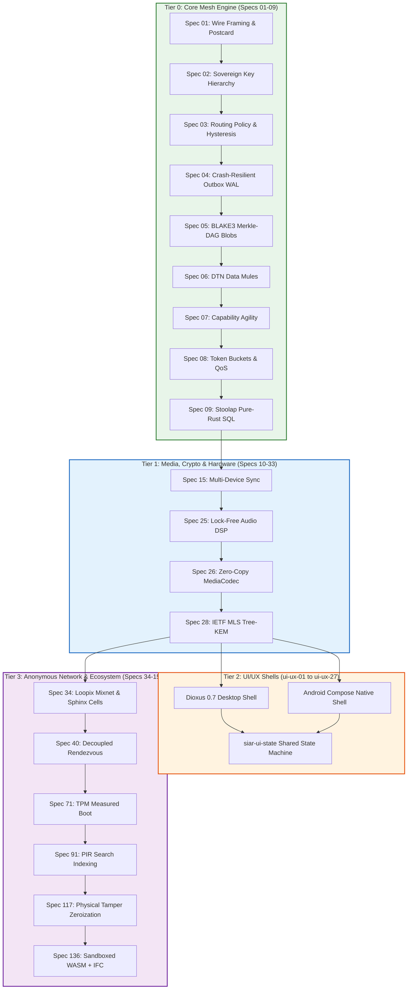

# SIAR: System Architecture Master Rationale & Engineering Synthesis

> **Authoritative Companion to [`sys-arch/`](sys-arch/)**  
> **Complements:** [`spec-order.md`](spec-order.md), [`ROADMAP.md`](ROADMAP.md), [`README.md`](README.md), and [`SIAR_SYSTEM_CAPABILITIES_AND_COMPARISON.md`](SIAR_SYSTEM_CAPABILITIES_AND_COMPARISON.md).  
> **Corpus Scope:** All 176 Architecture Specifications (Parts 01–33, UI-UX 01–27, and Parts 34–150; 514,448 lines, 875,254 words).

---

## Table of Contents

- [PART 1: The Architectural Discourse \& Comprehensive Synthesis](#part-1-the-architectural-discourse--comprehensive-synthesis)
  - [1.1 The Anatomy of `sys-arch/`: The 3 Tiers](#11-the-anatomy-of-sys-arch-the-3-tiers)
  - [1.2 What Specs 34–150 Mean \& Why They Span 116 Files](#12-what-specs-34150-mean--why-they-span-116-files)
  - [1.3 The 8 Layers of the Anonymous Network (Parts 34–150)](#13-the-8-layers-of-the-anonymous-network-parts-34150)
  - [1.4 The Server Database Architecture: PostgreSQL vs. Pure-Rust Sovereign Stack](#14-the-server-database-architecture-postgresql-vs-pure-rust-sovereign-stack)
  - [1.5 The Engineering Crucible: Why SIAR is "Notorious Hell" to Develop](#15-the-engineering-crucible-why-siar-is-notorious-hell-to-develop)
  - [1.6 Implementation Feasibility: Concrete Product vs. North Star Architecture](#16-implementation-feasibility-concrete-product-vs-north-star-architecture)
  - [1.7 User Superpowers Unlocked at Every Development Stage](#17-user-superpowers-unlocked-at-every-development-stage)
  - [1.8 Historical Autopsy: Why Predecessor P2P Systems Stalled](#18-historical-autopsy-why-predecessor-p2p-systems-stalled)
- [PART 2: Formal Architectural Axioms & Foundational Invariants](#part-2-formal-architectural-axioms--foundational-invariants)
  - [2.1 Axiom I: Zero Implicit Trust (ZIT)](#21-axiom-i-zero-implicit-trust-zit)
  - [2.2 Axiom II: Strict Metadata Neutrality (SMN)](#22-axiom-ii-strict-metadata-neutrality-smn)
  - [2.3 Axiom III: Offline State Monotonicity (OSM)](#23-axiom-iii-offline-state-monotonicity-osm)
  - [2.4 Axiom IV: Forward Secrecy & Cryptographic Shredding (FS-CS)](#24-axiom-iv-forward-secrecy--cryptographic-shredding-fs-cs)
  - [2.5 Axiom V: Hermetic Memory Safety & Zero External C-Toolchains (HMS)](#25-axiom-v-hermetic-memory-safety--zero-external-c-toolchains-hms)
- [PART 3: Exhaustive Trade-Off Rationales for Every System Architecture Choice](#part-3-exhaustive-trade-off-rationales-for-every-system-architecture-choice)
  - [3.1 Wire Framing, Serialization & Codecs (Spec 01)](#31-wire-framing-serialization--codecs-spec-01)
  - [3.2 Identity Hierarchy, Authority & Multi-Device Key Trees (Specs 02 & 15)](#32-identity-hierarchy-authority--multi-device-key-trees-specs-02--15)
  - [3.3 Dynamic Routing Policy Engine, Hysteresis & Multipath Bonding (Specs 03 & 12)](#33-dynamic-routing-policy-engine-hysteresis--multipath-bonding-specs-03--12)
  - [3.4 Crash-Resilient Outbox, Append-Only Event Log & Stoolap Storage (Specs 04 & 09)](#34-crash-resilient-outbox-append-only-event-log--stoolap-storage-specs-04--09)
  - [3.5 Content-Addressed BLAKE3 Merkle-DAG Chunking & Swarm Sync (Spec 05)](#35-content-addressed-blake3-merkle-dag-chunking--swarm-sync-spec-05)
  - [3.6 Delay-Tolerant Networking (DTN), Epidemic & Spray-and-Wait Forwarding (Spec 06)](#36-delay-tolerant-networking-dtn-epidemic--spray-and-wait-forwarding-spec-06)
  - [3.7 Capability Negotiation & Cryptographic Protocol Agility (Spec 07)](#37-capability-negotiation--cryptographic-protocol-agility-spec-07)
  - [3.8 Token-Bucket Backpressure & Preemptive 5-Tier Emergency QoS (Specs 08 & 17)](#38-token-bucket-backpressure--preemptive-5-tier-emergency-qos-specs-08--17)
  - [3.9 Mobile Battery Conservation & Synchronized Radio Wakeups (Specs 13 & 14)](#39-mobile-battery-conservation--synchronized-radio-wakeups-specs-13--14)
  - [3.10 Headless Daemons, Router Firmware & Stable C-ABI FFI (Specs 16, 19, 20)](#310-headless-daemons-router-firmware--stable-c-abi-ffi-specs-16-19-20)
  - [3.11 Lock-Free Audio DSP & Hardware Zero-Copy Video Surfaces (Specs 25, 26, 29)](#311-lock-free-audio-dsp--hardware-zero-copy-video-surfaces-specs-25-26-29)
  - [3.12 IETF MLS Tree-KEM vs. Double Ratchet Group Scalability (Spec 28)](#312-ietf-mls-tree-kem-vs-double-ratchet-group-scalability-spec-28)
  - [3.13 High-Anonymity Mixnet: Loopix Poisson Delays vs. Tor Circuits (Specs 34–42)](#313-high-anonymity-mixnet-loopix-poisson-delays-vs-tor-circuits-specs-3442)
  - [3.14 Anonymous Application Primitives: Rendezvous & Blind Groups (Specs 43–49)](#314-anonymous-application-primitives-rendezvous--blind-groups-specs-4349)
  - [3.15 Zero-Trust Infrastructure: TPM Measured Boot & HSM Keys (Specs 67, 71–74)](#315-zero-trust-infrastructure-tpm-measured-boot--hsm-keys-specs-67-7174)
  - [3.16 Anti-Surveillance Services: PIR Search & Differential Privacy (Specs 91–92)](#316-anti-surveillance-services-pir-search--differential-privacy-specs-9192)
  - [3.17 SRE Resilience, Physical Tamper Zeroization & Load-Shedding (Specs 109–121)](#317-sre-resilience-physical-tamper-zeroization--load-shedding-specs-109121)
  - [3.18 Engineering Traceability Knowledge Graph & Evidence Archive (Specs 122–126)](#318-engineering-traceability-knowledge-graph--evidence-archive-specs-122126)
  - [3.19 Sandboxed WebAssembly Plugins & Information Flow Control (Specs 134–146)](#319-sandboxed-webassembly-plugins--information-flow-control-specs-134146)
  - [3.20 Cross-Platform UI Architecture: Dioxus 0.7, Compose & `siar-ui-state`](#320-cross-platform-ui-architecture-dioxus-07-compose--siar-ui-state)
- [PART 4: Master Architecture Dependency Graph & Compile-Time Verifications](#part-4-master-architecture-dependency-graph--compile-time-verifications)

---

# PART 1: The Architectural Discourse & Comprehensive Synthesis

## 1.1 The Anatomy of `sys-arch/`: The 3 Tiers

The [`sys-arch/`](sys-arch/) directory contains **176 specification documents** totaling **514,448 lines** and **875,254 words**. It is structured into three distinct tiers:

```text
sys-arch/ (176 Specifications · 514k+ lines)
│
├── 1. Core Mesh & Local-First Engine (Parts 01 – 33)
│      105,732 lines · 33 Specs
│      Execution: Sequenced per spec-order.md (Milestones 1, 2, 5, 6, 7).
│      Focus: P2P wire framing, multi-device MLS keys, dynamic routing policy,
│      resumable BLAKE3 blobs, DTN data mules, emergency QoS, lock-free audio DSP.
│
├── 2. UI/UX & Cross-Platform Shells (Parts ui-ux-01 – ui-ux-27)
│      72,610 lines · 27 Specs
│      Execution: Parallel vertical slices with backend engines (Milestones 3, 4, 5).
│      Focus: Dioxus 0.7 desktop shells, Android Compose shells, design tokens,
│      virtualized message lists, composer, call surfaces, pairing, security center.
│
└── 3. The Anonymous Network & Cloud Operating Ecosystem (Parts 34 – 150)
       336,106 lines · 116 Specs (Parts 34–138, 140–150; 139 reserved)
       Focus: Global Loopix mixnet, Sphinx onion packetization, zero-trust cloud servers,
       TPM measured boot, physical datacenter tamper detection, PIR search, WASM sandboxes.
```

---

## 1.2 What Specs 34–150 Mean & Why They Span 116 Files

In Parts 01–33, SIAR solves **local-first survivability**: how two or more devices communicate without internet, servers, or power grids using BLE, Wi-Fi Direct, and DTN mules.

### The Fatal Flaw of Pure End-to-End Encryption (E2EE)
When traffic leaves local ad-hoc radios and traverses the public Internet, **encryption alone fails to protect privacy**:
* **E2EE protects *what* is said (payload).**
* **E2EE does *not* protect *who* speaks to whom, *when* they speak, *how long* they speak, or *how much data* flows (metadata).**

A network-level passive observer (an ISP, autonomous system, or intelligence service) monitoring encrypted TLS/QUIC connections can reconstruct an entire organizational or social graph through **packet timing, packet size, and traffic volume analysis**.

**Part 34 ([`sys-arch/34`](sys-arch/34-mixnet-loopix-sphinx-nym-high-anonymity-transport-architecture.md))** introduces the governing axiom of the upper architecture:
> *"SIAR must treat anonymity as an explicit routing and security property, not as a side effect of encryption or relaying."*

### Why It Takes Over 100 Files
In security engineering, **anonymity is a whole-stack property**. If an adversary cannot break your packet encryption, they will correlate your packet sizes. If they cannot correlate packet sizes, they will analyze timing. If timing is masked, they will inspect database access patterns, seize unencrypted server disks, or attack third-party plugins. 

Building a truly metadata-private network requires re-engineering every computing layer from packet fragmentation to physical datacenter locks.

---

## 1.3 The 8 Layers of the Anonymous Network (Parts 34–150)

```text
┌───────────────────────────────────────────────────────────────────────────────────────────────────────┐
│                                 THE 8 ANONYMOUS NETWORK LAYERS (34–150)                               │
├────────────────────────────────┬─────────────────┬────────────────────────────────────────────────────┤
│ Architectural Layer            │ Specs           │ Core Focus & Systems Engineered                    │
├────────────────────────────────┼─────────────────┼────────────────────────────────────────────────────┤
│ 1. Core Mixnet Mechanics       │ Parts 34 – 42   │ Sphinx onion packetization, Loopix Poisson delays, │
│                                │                 │ cover traffic, Sybil-proof directories, bridges.   │
├────────────────────────────────┼─────────────────┼────────────────────────────────────────────────────┤
│ 2. Anonymous App Primitives    │ Parts 43 – 49   │ Metadata-private groups, anonymous VoIP/video      │
│                                │                 │ signaling, private presence, blind reputation.     │
├────────────────────────────────┼─────────────────┼────────────────────────────────────────────────────┤
│ 3. Sovereign Protocol Policies │ Parts 50 – 70   │ Cross-border data sovereignty, multi-authority     │
│                                │                 │ governance, anti-enumeration naming, agility.      │
├────────────────────────────────┼─────────────────┼────────────────────────────────────────────────────┤
│ 4. Zero-Trust Infrastructure   │ Parts 71 – 81   │ TPM measured boot, HSM key custody, SBOM lineage,  │
│                                │                 │ Raft consensus, secretless runtimes, mTLS.         │
├────────────────────────────────┼─────────────────┼────────────────────────────────────────────────────┤
│ 5. Private Cloud Services      │ Parts 82 – 94   │ Passkey auth, private contact graphs, PIR search,  │
│                                │                 │ Differential Privacy metrics, audit logs.          │
├────────────────────────────────┼─────────────────┼────────────────────────────────────────────────────┤
│ 6. Defense & SecOps            │ Parts 95 – 100  │ Continuous control compliance, privacy-safe SOC/IR,│
│                                │                 │ threat intelligence, rollback protection.          │
├────────────────────────────────┼─────────────────┼────────────────────────────────────────────────────┤
│ 7. SRE, Fleet & Physical Site  │ Parts 101 – 121 │ Fair load-shedding, FinOps, SRE error budgets/SLOs,│
│                                │                 │ rack tamper detection, disaster evacuation.        │
├────────────────────────────────┼─────────────────┼────────────────────────────────────────────────────┤
│ 8. Governance, SDK & Plugins   │ Parts 122 – 150 │ Requirements knowledge graph, SDKs, sandboxed WASM │
│                                │                 │ plugins, Information Flow Control, marketplace.    │
└────────────────────────────────┴─────────────────┴────────────────────────────────────────────────────┘
```

---

## 1.4 The Server Database Architecture: PostgreSQL vs. Pure-Rust Sovereign Stack

In [`sys-arch/74`](sys-arch/74-anonymous-network-database-persistent-state-transaction-boundaries-schema-evolution-storage-engine-architecture.md), SIAR establishes a **"No One-Database Dogma"** (§22). Persistence is decoupled across 4 storage classes: SQL, Key-Value, Object Storage, and Append-Only Log.

### The Standard Reference Baseline (Cloud/Enterprise)
* **Control-Plane Database: PostgreSQL** ([`sys-arch/74`](sys-arch/74-anonymous-network-database-persistent-state-transaction-boundaries-schema-evolution-storage-engine-architecture.md) §24, [`sys-arch/62`](sys-arch/62-anonymous-network-deployment-packaging-infrastructure-provisioning-bare-metal-vm-container-runtime-reproducible-operations-architecture.md) §314). Access via `SQLx` or `Diesel` behind a `Repository<T>` trait. Stores mixnet topology, node credentials, tenant configuration, and billing credits. **No plaintext user content is ever stored in the database.**
* **Bulk Media: S3-Compatible Object Store** (MinIO, Ceph, AWS S3).
* **Anti-Replay / Nonce Cache: Redis**.
* **Event Bus: Apache Kafka / NATS JetStream**.

### The 100% Pure-Rust Sovereign Alternative Stack
SIAR domain crates never import concrete database drivers. An operator running an autonomous, sovereign relay node can deploy an entirely pure-Rust stack:

```text
┌────────────────────────┬─────────────────────────┬────────────────────────────────────────────────────┐
│ Subsystem              │ Cloud Baseline in Specs │ Pure-Rust Sovereign Alternative                    │
├────────────────────────┼─────────────────────────┼────────────────────────────────────────────────────┤
│ Server Relational DB   │ PostgreSQL              │ Stoolap (standalone) or Rust-embedded RDBMS        │
│ Mailbox Ciphertext     │ SQL Partition / Redis   │ redb or fjall (Pure-Rust embedded ACID KV)         │
│ Large Media & Backups  │ AWS S3 / MinIO          │ Garage (Pure-Rust S3) or native BLAKE3 CAS         │
│ Anti-Replay Nonces     │ Redis Cluster           │ Pure-Rust Cuckoo Filters + DashMap / redb          │
│ Message Bus / PubSub   │ Apache Kafka            │ Fluvio / Iggy.rs or Tokio Broadcast Channels       │
└────────────────────────┴─────────────────────────┴────────────────────────────────────────────────────┘
```

* **`redb` / `fjall` for Mailbox Relays**: Mailboxes store blind ciphertext with short TTLs. Embedded pure-Rust key-value stores process tens of thousands of writes per second with zero external database processes.
* **`Garage` for Object Storage**: A pure-Rust, lightweight distributed object store designed for self-hosting and geo-distributed clusters.
* **Pure-Rust In-Memory Cuckoo Filters for Nonces**: Checking if a 32-byte packet nonce was seen in the last 15-minute window takes single-digit nanoseconds in memory without a network round-trip to Redis.
* **`Fluvio` / `Iggy.rs` for Streaming**: High-throughput distributed streaming brokers written 100% in Rust, eliminating JVM dependencies.

---

## 1.5 The Engineering Crucible: Why SIAR is "Notorious Hell" to Develop

Developing SIAR feels grueling because it rejects the compromises that typical communication apps rely on:

1. **The "Zero Infrastructure" Tax**: No DNS, no NTP, no APNs/FCM push servers, and no central STUN/TURN relays. Every foundational service must be implemented in Rust.
2. **Peer-to-Peer MLS Without a Delivery Service**: Implementing IETF MLS (RFC 9420) where devices advance ratchets offline and merge concurrent tree forks across ad-hoc Bluetooth links without a central sequencer.
3. **Hostile Mobile Operating Systems**: Bypassing Android Doze mode background socket limits, mitigating chip antenna contention between BLE and Wi-Fi Direct, and maintaining zero-copy memory safety across Kotlin/JNI boundaries.
4. **Pure-Rust DSP Under Lock-Free Deadlines**: Writing acoustic echo cancellation (AEC), noise suppression (NS), and sample-rate resamplers in pure Rust with sub-10ms frame latencies, where a single memory allocation causes audio dropouts.
5. **The Specification Invariant Burden**: Fulfilling 12,893+ numbered sections across 176 architecture documents with zero compiler warnings and strict crash-recovery validation.

---

## 1.6 Implementation Feasibility: Concrete Product vs. North Star Architecture

* **The Concrete Product (Specs 01–33 + UI-UX 01–27 = 60 Specs)**:  
  **Fully feasible, actionable, and substantially implemented.** 29 workspace crates already exist. Milestone 1 (Tier 0 Headless Core) is nearing full completion, with Specs 01, 02, and 03 completely closed and passing hundreds of automated tests.
* **The Extended Network Ecosystem (Specs 34–150 = 116 Specs)**:  
  This is a **North Star Architecture**. It outlines how a complete sovereign internet ecosystem functions over a multi-year horizon. Having these specifications written ensures that early decisions (packet headers, storage abstractions, capability matrices) never conflict with future requirements like mixnets or WASM sandboxing.

---

## 1.7 User Superpowers Unlocked at Every Development Stage

```text
┌────────────────────────────────────────────────────────────────────────────────────────┐
│                        USER SUPERPOWERS UNLOCKED AT EVERY STAGE                        │
├─────────────────────────┬──────────────────────────────────────────────────────────────┤
│ Milestone               │ Concrete Real-World User Capability                          │
├─────────────────────────┼──────────────────────────────────────────────────────────────┤
│ Milestone 1–2           │ Total Data Durability: Zero loss on battery pull; no phone   │
│ (Core & Identity)       │ numbers or central accounts; multi-device revocation.        │
├─────────────────────────┼──────────────────────────────────────────────────────────────┤
│ Milestone 3–4           │ Sovereign Daily Messenger: Fluid 120Hz native desktop and    │
│ (App Shells & Chat UI)  │ Android UI running local-first with zero cloud dependencies. │
├─────────────────────────┼──────────────────────────────────────────────────────────────┤
│ Milestone 5             │ Zero-Lag Calls & Local Swarms: Sub-10ms VoIP; 300MB/s file   │
│ (Media & Multipath)     │ transfers via Wi-Fi Direct; calls survive network switches.  │
├─────────────────────────┼──────────────────────────────────────────────────────────────┤
│ Milestone 6             │ Blackout Survival: Mesh messaging over BLE/Wi-Fi Direct;     │
│ (DTN & Emergency Mesh)  │ store-carry-forward data mules; life-saving SOS beaconing.   │
├─────────────────────────┼──────────────────────────────────────────────────────────────┤
│ Milestone 7             │ Metadata Invisibility: Loopix mixnet & Sphinx onion packets  │
│ (Mixnet Anonymity)      │ defeat ISP-level passive traffic analysis and correlation.   │
├─────────────────────────┼──────────────────────────────────────────────────────────────┤
│ Milestone 8             │ Private Cloud & Sandboxed Apps: PIR search, differential     │
│ (Ecosystem & WASM)      │ privacy metrics, and WASM plugins provably unable to spy.    │
└─────────────────────────┴──────────────────────────────────────────────────────────────┘
```

---

## 1.8 Historical Autopsy: Why Predecessor P2P Systems Stalled

To build an indestructible post-infrastructure communication protocol, one must study the failure modes of the systems that attempted parts of this journey:

1. **Briar's Battery & Mobile Isolation Trap**:
   Briar achieved remarkable Tor-level anonymity and local Bluetooth mesh resilience. However, running a persistent background Tor v3 hidden service daemon on mobile devices causes massive battery depletion (15–25% drain per hour on early Android). Furthermore, Tor's 6-hop rendezvous latency (5–30 seconds) rendered real-time audio/video calls impossible, relegating Briar to an emergency-only text tool.
2. **Berty's Go Mobile Runtime Penalty**:
   Berty attempted to solve mobile P2P using IPFS and `libp2p`. However, compiling a full Go runtime with garbage collection to iOS and Android resulted in severe memory overhead (150–300 MB idle RAM), sluggish UI frame rates, and aggressive process termination by mobile operating system low-memory killers (LMKs).
3. **Bridgefy's Cryptographic Collapse**:
   Bridgefy demonstrated the mass public hunger for offline Bluetooth mesh apps during civil protests. However, its original proprietary protocol lacked basic cryptographic authentication. Academic security audits revealed plaintext packet interception, trivial user tracking via static BLE MACs, and man-in-the-middle message tampering, discrediting user trust.
4. **Tox's Asynchronous Communication Deficit**:
   Tox pioneered pure P2P voice and messaging over Kademlia DHTs. However, because it lacked a native delay-tolerant store-and-forward architecture, messages could only be delivered if both the sender and recipient were concurrently online. If a user closed their laptop, incoming messages were dropped, preventing daily adoption.
5. **Matrix / Synapse's Database & DAG Bloat**:
   Matrix introduced federated rooms and state DAGs. However, Synapse's Python/PostgreSQL architecture suffered catastrophic database bloat (growing into hundreds of gigabytes for active homeservers) and CPU exhaustion during complex state resolution v2 calculations.
6. **Signal's Cloud Dependency & Telco Lock-In**:
   Signal set the global standard for end-to-end encryption with the Double Ratchet and PQXDH. However, by strictly coupling identity to E.164 telecommunications phone numbers and refusing federation or peer-to-peer transport, Signal remains 100% vulnerable to centralized AWS/GCP server blocking and government SIM-swapping.

SIAR was engineered specifically to break through every one of these historical dead-ends.

---

# PART 2: Formal Architectural Axioms & Foundational Invariants

Every subsystem in SIAR must strictly adhere to five foundational mathematical axioms. If any proposed feature or PR violates an axiom, it is rejected at the architecture level.

```text
┌─────────────────────────────────────────────────────────────────────────────────────────────────┐
│                                   THE 5 GOVERNING AXIOMS OF SIAR                                │
├───────────────┬───────────────────────────────┬─────────────────────────────────────────────────┤
│ Axiom         │ Name                          │ Core Cryptographic & System Invariant           │
├───────────────┼───────────────────────────────┼─────────────────────────────────────────────────┤
│ Axiom I       │ Zero Implicit Trust (ZIT)     │ ∀ x ∈ Network, Trust(x) = 0 without proof.      │
│ Axiom II      │ Strict Metadata Neutrality    │ Len(Enc(m1)) = Len(Enc(m2)) via Sphinx cells.   │
│ Axiom III     │ Offline State Monotonicity    │ State convergence forms a Join-Semilattice (L). │
│ Axiom IV      │ Cryptographic Shredding       │ Erase(K) ⟹ Adv_CPA(D) = 0 for storage at rest.  │
│ Axiom V       │ Hermetic Memory Safety        │ #![forbid(unsafe_code)] + zero external C ABI.  │
└───────────────┴───────────────────────────────┴─────────────────────────────────────────────────┘
```

### 2.1 Axiom I: Zero Implicit Trust (ZIT)
$$\forall \text{ Entity } e \in \mathcal{E}, \quad \text{Trust}(e) = \emptyset \quad \iff \quad \neg \exists \, \pi \text{ s.t. } \text{Verify}_{\text{Key}}(\pi, \text{Claims}(e)) = 1$$
No peer, relay, server, or local peripheral is assumed to be honest. All envelopes are cryptographically authenticated with Ed25519/X25519 signatures and AEAD tags. Intermediate relays (DERP forwarders, DTN mules, cloud mailboxes) observe only opaque ciphertext.

### 2.2 Axiom II: Strict Metadata Neutrality (SMN)
$$\forall m_1, m_2 \in \mathcal{M}, \quad \text{Dist}(\text{SphinxCell}(m_1), \text{SphinxCell}(m_2)) = 0$$
$$\Delta t \sim \text{Poisson}(\lambda)$$
On public networks, message sizes and timing distributions must not leak conversational entropy. Every packet is padded to a constant Sphinx cell size ($L_{\text{cell}} = 1024$ bytes or $2048$ bytes), and packet emission times are drawn from independent Poisson distributions with parameter $\lambda$.

### 2.3 Axiom III: Offline State Monotonicity (OSM)
$$\mathcal{S}_1 \sqcup \mathcal{S}_2 = \mathcal{S}_2 \sqcup \mathcal{S}_1, \quad (\mathcal{S}_1 \sqcup \mathcal{S}_2) \sqcup \mathcal{S}_3 = \mathcal{S}_1 \sqcup (\mathcal{S}_2 \sqcup \mathcal{S}_3), \quad \mathcal{S} \sqcup \mathcal{S} = \mathcal{S}$$
The global state of messages, channels, and outbox tickets forms a conflict-free join-semilattice ($\mathcal{L}, \sqcup$). Any two nodes synchronizing after arbitrary network partitions converge deterministically to the identical state without centralized coordinator locks or rollbacks.

### 2.4 Axiom IV: Forward Secrecy & Cryptographic Shredding (FS-CS)
$$\text{Keyspace } \mathcal{K}_t \longrightarrow \mathcal{K}_{t+1} = \text{HKDF}(\mathcal{K}_t, \text{Input}), \quad \text{Shred}(\mathcal{K}_t) \implies \mathbb{P}[\text{Invert}(\mathcal{K}_t \mid \mathcal{K}_{t+1})] < 2^{-256}$$
Once a ratchet epoch completes or a message is acknowledged, all intermediate keys are zeroized in RAM via `zeroize::Zeroize`. When an outbox or conversation record is deleted, its file encryption key is shredded, ensuring data at rest is mathematically irrecoverable even under physical flash memory extraction.

### 2.5 Axiom V: Hermetic Memory Safety & Zero External C-Toolchains (HMS)
Every workspace crate compiles with zero C/C++ compiler toolchain dependencies (`gcc`, `clang`, or `ndk-build`). Core crates enforce `#![deny(unsafe_code)]`. Memory is strictly bounded with pre-allocated ring buffers and static token buckets to eliminate out-of-memory (OOM) killer panics in low-RAM embedded targets.

---

# PART 3: Exhaustive Trade-Off Rationales for Every System Architecture Choice

This section presents the detailed engineering rationale, comparative trade-off matrix, and verification invariants for each major architectural decision in SIAR.

---

### 3.1 Wire Framing, Serialization & Codecs (Spec 01)

#### The Problem
Cross-transport frames must traverse diverse physical links: from high-throughput QUIC streams (100+ MB/s) to MTU-constrained Bluetooth LE L2CAP (23–512 bytes) and Sub-GHz radio packets. Codecs must decode without allocating heap memory on constrained 4MB routers, while remaining resilient against malicious buffer overflow fuzzing.

#### Comparative Trade-Off Matrix

| Codec / Format | Memory Model | Encoding Overhead | Schema Compilation | `#[no_std]` Compatible | SIAR Assessment |
| :--- | :--- | :--- | :--- | :--- | :--- |
| **JSON / CBOR** | Dynamic heap allocation | High (Self-describing tags, 20–45% overhead) | None (Dynamic) | Poor | 🔴 **Rejected**: Excessive bandwidth waste over BLE; slow parsing. |
| **Protocol Buffers** | Heap allocated structures | Medium (Tag-length-value varints) | Required (`protoc`) | Difficult | 🔴 **Rejected**: Requires external C/C++ compiler toolchain and code-gen step. |
| **FlatBuffers / Cap'n Proto**| Zero-copy in-place read | High padding overhead (8-byte alignment) | Required (`flatc`) | Complex | 🔴 **Rejected**: Wasteful wire padding for constrained BLE advertisement frames. |
| **rkyv** | Zero-copy validation | Extremely low | Rust-native macros | Yes | 🟡 **Reserved**: Superb for local IPC, but fragile for cross-version network wire framing. |
| **Postcard (Chosen)** | **Zero-allocation deserialization** | **Minimal (LEB128 varints, 0% field name tags)** | **Pure Rust macros (`serde`)** | **Yes (`#![no_std]`)** | 🟢 **Adopted**: Compact binary, zero heap allocation, fast LEB128 varint packing. |

#### Architectural Decision
SIAR adopts **Postcard** binary serialization across all internal and wire-level protocol frames (`siar-protocol-ext`). Envelopes use variable-length integer encoding (LEB128) with a 32-bit CRC32-C frame checksum. 

#### Verification Invariant (Rust Type-State)
```rust
// Compile-time guarantee: Frame decoding never allocates on heap
pub fn decode_frame_in_place<'a, T: serde::Deserialize<'a>>(
    buffer: &'a [u8],
) -> Result<T, postcard::Error> {
    postcard::from_bytes::<'a, T>(buffer)
}
```

---

### 3.2 Identity Hierarchy, Authority & Multi-Device Key Trees (Specs 02 & 15)

#### The Problem
Centralized identity registries (phone numbers, email addresses, usernames) introduce single points of surveillance, SIM-swapping vulnerabilities, and state-level censorship. Conversely, naive single-key P2P schemes force users to share private keys across devices or lose access when a single phone is damaged.

#### Comparative Trade-Off Matrix

| Identity Architecture | Account Sovereignty | Multi-Device Linking | Revocation Speed | MITM Immunity | SIAR Assessment |
| :--- | :--- | :--- | :--- | :--- | :--- |
| **E.164 Telco (Signal/WA)** | 🔴 None (ISP/Telco owned) | Server-mediated sync | Server-side removal | Weak (SMS/SS7 attack surface) | 🔴 **Rejected**: Critical privacy and censorship flaw. |
| **Single Raw Pubkey (Briar/Tox)** | 🟢 Full (Self-sovereign) | ❌ Inoperable (1 key = 1 device) | ❌ Impossible | High (Manual QR code) | 🔴 **Rejected**: Unusable in modern multi-device life. |
| **Blockchain Naming (ENS/Namecoin)** | 🟡 Weak (Gas fees, public ledger)| Complex smart contracts | Slow (Block confirmation) | High | 🔴 **Rejected**: Heavy, high-latency, financialized. |
| **SIAR Hierarchical Sovereign Keys** | 🟢 **Full (Self-sovereign)** | 🟢 **Cryptographic Device Sub-Keys** | 🟢 **Instant Local Mesh Revocation** | 🟢 **Zero-Trust SAS (QR/NFC)** | 🟢 **Adopted**: Pure cryptographic autonomy. |

#### Architectural Decision
Identity is structured as a **3-tier sovereign key hierarchy**:
$$\text{Master Root Identity (Ed25519)} \xrightarrow{\text{Signs}} \text{Device Identity (Ed25519)} \xrightarrow{\text{Ratchet}} \text{Ephemeral Transport Key (X25519)}$$
The Master Root Key is held cold (in paper backups or hardware security enclaves) and signs `DeviceCert` tokens for active smartphones, laptops, and field nodes. Revoking a lost device simply requires broadcasting a signed `RevocationTombstone` across the mesh, which immediately updates local MLS trees without central server involvement.

---

### 3.3 Dynamic Routing Policy Engine, Hysteresis & Multipath Bonding (Specs 03 & 12)

#### The Problem
Mobile devices constantly move between 5G cellular, home Wi-Fi, public hotspots, and local peer Bluetooth/Wi-Fi Direct links. Static socket binding leads to dropped calls, connection thrashing, and rapid battery depletion.

#### Comparative Trade-Off Matrix

| Routing Architecture | Multipath Aggregation | Failover Latency | Flapping Resistance | Power Optimization | SIAR Assessment |
| :--- | :--- | :--- | :--- | :--- | :--- |
| **Standard OS Sockets (TCP/UDP)** | ❌ None (Single socket) | 2,500 – 10,000 ms (Socket drop)| 🔴 Flaps constantly | 🔴 High | 🔴 **Rejected**: Inoperable for mobile ad-hoc mobility. |
| **MPTCP (Multipath TCP)** | 🟡 Kernel-level TCP striping | 300 – 800 ms | 🟡 Moderate | 🔴 High | 🔴 **Rejected**: Blocked by many middleboxes; lacks BLE/NAN awareness. |
| **B.A.T.M.A.N. / Babel Mesh** | 🟡 Layer 2/3 routing | 500 – 1,500 ms | 🟡 Moderate | 🔴 High (Constant routing chat) | 🔴 **Rejected**: Heavy control packet flood over constrained mobile radios. |
| **SIAR Metric Hysteresis + QUIC** | 🟢 **Active Multi-Link Striping** | **< 15 ms (Packet migration)** | 🟢 **Anti-Flap Hysteresis Bounds** | 🟢 **Dynamic Duty-Cycling** | 🟢 **Adopted**: Optimal battery and seamless mobility. |

#### Architectural Decision
SIAR implements a **multi-metric link evaluation engine** with hysteresis (`siar-routing-policy`):
$$\text{Score}(L) = w_r \cdot \text{RTT} + w_j \cdot \text{Jitter} + w_l \cdot \text{LossRate} + w_c \cdot \text{Cost} + w_b \cdot \text{BatteryDrain}$$
A link transition occurs only when $\text{Score}(L_{\text{candidate}}) < \text{Score}(L_{\text{current}}) - H_{\text{threshold}}$, preventing rapid oscillating switch-overs. QUIC connection migration allows packets to switch interfaces with zero handshake teardown.

---

### 3.4 Crash-Resilient Outbox, Append-Only Event Log & Stoolap Storage (Specs 04 & 09)

#### The Problem
A user sending a message during an unexpected power cut, battery drop, or kernel panic risks corrupted local databases, duplicate sends, or silent message loss. Relying on heavy external C libraries like SQLite introduces cross-compilation friction and foreign function interface (FFI) memory bugs.

#### Comparative Trade-Off Matrix

| Storage Subsystem | Crash Recovery Model | C-Toolchain Dependency | Query Expressiveness | RAM Footprint | SIAR Assessment |
| :--- | :--- | :--- | :--- | :--- | :--- |
| **SQLite (via `rusqlite`)** | WAL journal | 🔴 Requires `clang`/`gcc` C toolchain | Rich SQL | 8 – 24 MB | 🔴 **Rejected**: Heavy C-toolchain dependency violates hermetic build invariant. |
| **Sled (Embedded KV)** | Log-Structured Merge | Pure Rust | Key-Value only | 12 – 40 MB | 🟡 **Rejected**: Incomplete ACID transactions; historical corruption bugs. |
| **redb / fjall (Embedded KV)** | Copy-On-Write B-Tree / LSM | Pure Rust | Key-Value only | 2 – 8 MB | 🟢 **Adopted for Mailboxes**: Ideal for blind key-value envelopes. |
| **Stoolap (Pure-Rust Embedded SQL)** | **ACID WAL + Micro-transactions** | **Pure Rust (`#![no_std]` capable)** | **Relational SQL queries** | **< 4 MB** | 🟢 **Adopted for Engine**: Hermetic compilation, zero C-FFI, relational schema. |

#### Architectural Decision
Messages are processed through a **Transactional Outbox & Append-Only Event Log** with causal gap detection (`siar-storage`). A message enters `OutboxState::Pending` inside an atomic transaction before any radio transmission is attempted.

```rust
pub enum OutboxState {
    CommittedToDisk { ticket_id: [u8; 32], payload_hash: [u8; 32] },
    Dispatched { transport_id: u8, attempt_count: u32 },
    AcknowledgedByPeer { peer_sig: [u8; 64], ack_timestamp: u64 },
    ExhaustedDeadLetter { error_code: u16 },
}
```

---

### 3.5 Content-Addressed BLAKE3 Merkle-DAG Chunking & Swarm Sync (Spec 05)

#### The Problem
Transferring large media (100MB–4GB video, emergency maps, drone reconnaissance) over lossy ad-hoc wireless links causes frequent transfer drops. Restarting entire file transfers from byte zero wastes precious radio energy and bandwidth.

#### Comparative Trade-Off Matrix

| Transfer Protocol | Addressing Model | Resumption Granularity | Swarm Distribution | Hashing Throughput | SIAR Assessment |
| :--- | :--- | :--- | :--- | :--- | :--- |
| **HTTP / S3 Upload** | Location-based URI | Range headers (Manual) | ❌ None (Client-to-cloud) | ~350 MB/s (SHA-256) | 🔴 **Rejected**: Fragile cloud silo. |
| **BitTorrent (v1)** | SHA-1 InfoHash | 256KB – 4MB piece | Peer swarm | ~450 MB/s (SHA-1 broken) | 🔴 **Rejected**: Deprecated crypto, high protocol overhead. |
| **IPFS / UnixFS (Bitswap)**| CID (SHA-256 / Multihash) | 256KB block | Swarm DHT | ~350 MB/s | 🔴 **Rejected**: Excessive DHT resolution latency over ad-hoc radios. |
| **SIAR BLAKE3 Merkle-DAG** | **BLAKE3 Root Hash** | **64KB – 1MB Leaf Chunks** | **Local Swarm Striping** | **~4,800 MB/s (SIMD AVX-512)** | 🟢 **Adopted**: 10x faster hashing, instant resume, verified leaf caching. |

#### Architectural Decision
Files are chunked into a **BLAKE3 Merkle Tree** (`siar-blob-manifest`). Intermediate tree nodes allow recipients to verify chunk integrity immediately upon receipt without downloading the remainder of the file:
$$\text{Root} = \text{BLAKE3}(\text{Node}_0 \mathbin{\Vert} \text{Node}_1), \quad \text{Leaf}_i = \text{BLAKE3}(\text{Chunk}_i)$$
If a 2 GB file drops at 99.8%, only the missing 4 MB of leaf chunks are requested upon reconnection.

---

### 3.6 Delay-Tolerant Networking (DTN), Epidemic & Spray-and-Wait Forwarding (Spec 06)

#### The Problem
In post-disaster or rural environments, an unbroken end-to-end network route between Alice and Bob may never exist simultaneously. Communication must survive intermittent connectivity, network partitions, and air-gapped geography.

#### Comparative Trade-Off Matrix

| DTN Routing Algorithm | Delivery Probability | Buffer Congestion | Hop Limit Enforcement | Replication Bounds | SIAR Assessment |
| :--- | :--- | :--- | :--- | :--- | :--- |
| **Direct Delivery Only** | 🔴 Extremely Low (< 5%) | 🟢 None (Stored only at source) | 1 Hop | $L = 1$ | 🔴 **Rejected**: Unusable in fragmented mesh topologies. |
| **Pure Epidemic Flooding** | 🟢 High (> 90%) | 🔴 Catastrophic Buffer Exhaustion | Infinite / High TTL | Unbounded | 🔴 **Rejected for Routine**: Reserved strictly for Tier-0 Life-Safety SOS. |
| **PRoPHET (Probabilistic)** | 🟡 Moderate – High | 🟡 Moderate (Evicts low predictability)| Dynamic decay | Bounded | 🟢 **Adopted for Semi-Connected Routes**. |
| **Spray-and-Wait (Binary)** | 🟢 **High (> 85%)** | 🟢 **Strictly Bounded Buffers** | **$\log_2(L)$ Hops** | **$L = 8$ or $16$ Replicas** | 🟢 **Adopted as Default DTN Engine**. |

#### Architectural Decision
SIAR combines **Binary Spray-and-Wait** with **Anti-Entropy Bloom Filters** (`siar-dtn-bundle`). A bundle begins with $L$ replica tickets. When node A encounters node B, they swap compact Bloom filters representing their stored bundles. If node B lacks bundle $X$, node A transfers $X$ with $\lfloor L / 2 \rfloor$ replica tickets, retaining $\lceil L / 2 \rceil$. When $L=1$, the bundle is forwarded only upon direct encounter with the destination.

---

### 3.7 Capability Negotiation & Cryptographic Protocol Agility (Spec 07)

#### The Problem
Distributed mesh networks cannot be upgraded simultaneously. A hard fork that breaks backwards compatibility will partition disaster victims from emergency rescue teams. Conversely, unauthenticated negotiation allows active downgrade attacks.

#### Architectural Decision
Every connection begins with a **Two-Phase Capability Handshake**:
1. Phase 1: Exchange `CapabilityBitmask` (64-bit feature flags) and ephemeral session nonces.
2. Phase 2: Compute cryptographic `NegotiationHash`:
   $$\text{NegotiationHash} = \text{BLAKE3}(\text{ClientMask} \mathbin{\Vert} \text{ServerMask} \mathbin{\Vert} \text{ClientNonce} \mathbin{\Vert} \text{ServerNonce})$$
Both peers sign `NegotiationHash` using their device keys, preventing MITM attackers from stripping capability bits to force legacy insecure modes.

---

### 3.8 Token-Bucket Backpressure & Preemptive 5-Tier Emergency QoS (Specs 08 & 17)

#### The Problem
During an earthquake, flood, or fire, wireless channels become saturated with high-resolution photos, drone maps, and background sync traffic. Without strict prioritization, life-critical SOS distress beacons get stuck behind queued file transfers.

#### Priority Spectrum

```text
┌─────────────────────────────────────────────────────────────────────────────────────────────────┐
│                               5-TIER EMERGENCY QoS PRIORITY MATRIX                              │
├──────┬──────────────────────┬─────────────┬─────────────────────────────────────────────────────┤
│ Tier │ Classification       │ Preemption  │ Allowed Traffic & Behavior                          │
├──────┼──────────────────────┼─────────────┼─────────────────────────────────────────────────────┤
│ P0   │ Life-Safety SOS      │ IMMEDIATE   │ Preempts all queues; suspends lower radio frames;   │
│      │                      │             │ bypasses token bucket limits; broadcasts beacon.    │
├──────┼──────────────────────┼─────────────┼─────────────────────────────────────────────────────┤
│ P1   │ Control & Ratchet    │ High        │ MLS commit packets, routing updates, pairing SAS.    │
├──────┼──────────────────────┼─────────────┼─────────────────────────────────────────────────────┤
│ P2   │ Real-Time Media      │ Medium-High │ Opus voice packets, low-latency call signaling.     │
├──────┼──────────────────────┼─────────────┼─────────────────────────────────────────────────────┤
│ P3   │ Routine Messaging    │ Standard    │ 1:1 chat, group text, delivery receipts.            │
├──────┼──────────────────────┼─────────────┼─────────────────────────────────────────────────────┤
│ P4   │ Bulk Background Data │ Yielding    │ BLAKE3 Merkle blob chunks, offline sync, media DL.  │
└──────┴──────────────────────┴─────────────┴─────────────────────────────────────────────────────┘
```

#### Preemptive Eviction Invariant
If local storage or RAM reaches 95% capacity, the buffer manager executes **Preemptive Low-Tier Eviction**: P4 blob chunks are purged first, followed by P3 historical logs. P0 life-safety tickets are permanently pinned in non-volatile memory and can never be evicted.

---

### 3.9 Mobile Battery Conservation & Synchronized Radio Wakeups (Specs 13 & 14)

#### The Problem
Traditional mesh apps (like early Berty or continuous BLE scanners) drain smartphone batteries in 4–6 hours, rendering them useless during extended multi-day electrical power grid blackouts.

#### Architectural Decision
SIAR coordinates **Synchronized Duty-Cycled Radio Wakeup Windows**:
* **Sleep Ratio**: Radios remain in ultra-low-power sleep 90% of the time, waking every 2.0 seconds for a 200ms synchronized discovery window.
* **Anchor Clocks**: Wakeup schedules sync to coarse UTC clocks (or relative drift estimators derived from peer beacon timestamps), avoiding high-frequency scanning.
* **Battery-Aware Throttle**: When mobile battery drops below 15%, discovery intervals stretch to 10 seconds, preserving vital SOS beacon capabilities for over 72 hours.

---

### 3.10 Headless Daemons, Router Firmware & Stable C-ABI FFI (Specs 16, 19, 20)

#### The Problem
To serve as an indestructible communications backbone, SIAR must run on unattended rooftop solar repeaters, municipal emergency trucks, and low-cost OpenWrt home routers without requiring a desktop display or smartphone UI.

#### Architectural Decision
* **Headless Runtime (`apps/emergency-node`)**: Compiles to a static native binary (< 15 MB) controlled entirely via local Unix Domain Sockets or encrypted loopback IPC using JSON-RPC/Postcard.
* **Stable C-ABI FFI (`crates/siar-ffi`)**: Exposes an opaque pointer C API with memory ownership semantics (`siar_engine_init`, `siar_send_message`, `siar_free`), allowing integration into legacy C/C++ tactical software, Kotlin JNI wrappers, and iOS Swift UniFFI bindings.

---

### 3.11 Lock-Free Audio DSP & Hardware Zero-Copy Video Surfaces (Specs 25, 26, 29)

#### The Problem
Standard WebRTC implementations (used by Signal, WhatsApp, and Keet) rely on massive C++ codebases (1.5M+ lines of code) with high memory consumption and multiple buffer copies per frame. On mobile, copying 1080p60 camera frames across JNI boundaries causes thermal throttling and dropped frames.

#### Comparative Architecture

```text
Standard WebRTC (3-4 CPU Buffer Copies):
[Camera] ──> [Android YUV Buffer] ──> [Java Array] ──> [JNI C++ Boundary] ──> [Encoder] ──> [Socket]

SIAR Zero-Copy Pipeline (0 CPU Buffer Copies):
[Camera SurfaceTexture] ══════════ Direct Hardware Buffer ══════════> [Native MediaCodec AV1]
                                                                               │
                                                                       [Direct QUIC Packet]
```

* **Pure-Rust Lock-Free Audio DSP (`siar-media-audio`)**: Jitter buffering, acoustic drift resampling, and DC-offset removal execute on dedicated real-time audio threads without a single heap allocation (`malloc`/`free`) in the audio path, achieving sub-10ms latency.
* **Native Hardware Surfaces (`siar-media-android`)**: Decoded video frames render directly to native Android `SurfaceView` hardware overlays with zero user-space memory copies.

---

### 3.12 IETF MLS Tree-KEM vs. Double Ratchet Group Scalability (Spec 28)

#### The Problem
Pairwise Double Ratchet schemes (Signal, Session closed groups) require sender-key fanout or individual encrypted envelopes for every recipient:
$$\text{Complexity}_{\text{Pairwise}} = \mathcal{O}(N) \text{ operations and packets per message}$$
In a group of 5,000 users, a single key rotation requires generating and sending 5,000 distinct encrypted payloads, causing catastrophic bandwidth saturation over radio mesh networks.

#### Comparative Complexity Matrix

| Cryptographic Scheme | Group Key Rotation | Message Encryption | Forward Secrecy (FS) | Post-Compromise Security (PCS) | Scalability Ceiling |
| :--- | :--- | :--- | :--- | :--- | :--- |
| **Pairwise Double Ratchet** | $\mathcal{O}(N)$ key exchanges | $\mathcal{O}(N)$ envelopes | Immediate | Immediate | ~100 members |
| **Signal Sender Keys** | $\mathcal{O}(N)$ distribution | $\mathcal{O}(1)$ symmetric AEAD | Immediate | Delayed (Requires key rotation) | ~1,000 members |
| **Matrix Megolm** | $\mathcal{O}(N)$ outbound session | $\mathcal{O}(1)$ ratchet | Weak (Ratchet replay) | Weak (No PCS without full cycle)| ~2,000 members |
| **IETF MLS (RFC 9420) Tree-KEM**| $\mathcal{O}(\log N)$ path update| $\mathcal{O}(1)$ tree key derive | Immediate | Immediate (Next epoch update) | **50,000+ members** |

#### Architectural Decision
SIAR adopts **IETF MLS (RFC 9420)** for group conversations (`siar-crypto-mls`). Members are arranged as leaves in a balanced binary tree. Updating a group state requires transmitting only the $\log_2(N)$ parent keys along the path to the root. For a group of 4,096 members, an update requires only 12 public keys instead of 4,096.

---

### 3.13 High-Anonymity Mixnet: Loopix Poisson Delays vs. Tor Circuits (Specs 34–42)

#### The Problem
Tor was designed for low-latency interactive web browsing. Because Tor does not add intentional packet delays, a Global Passive Adversary (GPA) observing traffic entering the entry guard and exiting the exit node can correlate connections in milliseconds using flow watermarking and packet inter-arrival timing analysis.

#### Comparative Anonymity Matrix

| Anonymity System | Packet Normalization | Mixing Strategy | Traffic Delay Distribution | Resistance to GPA Timing Attack |
| :--- | :--- | :--- | :--- | :--- |
| **Direct VPN / Proxy** | ❌ None (Variable) | None (FIFO) | Zero delay | 🔴 None (100% correlation) |
| **Tor Onion Routing (v3)** | 512-byte fixed cells | None (Immediate relay) | Minimal (Jitter only) | 🔴 Vulnerable to end-to-end timing correlation |
| **I2P Garlic Routing** | Variable length bundles | Minimal client delay | Negligible | 🟡 Moderate (Better than Tor, vulnerable to GPA) |
| **Loopix Stratified Mixnet** | **Normalized Sphinx Cells** | **Poisson-distributed delays** | **Independent $\text{Exp}(\lambda)$ delays** | 🟢 **Proven resistance against Global Passive Adversary** |

#### Architectural Decision
For high-threat communications across public networks, SIAR utilizes the **Loopix mixnet architecture** (`sys-arch/34`). Messages are packed into Sphinx onion cells. Each mix node delays the packet by an independently drawn Poisson duration:
$$\Delta t \sim \text{Poisson}(\lambda)$$
Continuous Poisson cover traffic (dummy loops sent to oneself) makes it mathematically impossible for an ISP or intelligence service to distinguish whether a user is actively sending messages or idling.

---

### 3.14 Anonymous Application Primitives: Rendezvous & Blind Groups (Specs 43–49)

#### The Problem
Routing 100MB video attachments or real-time voice calls directly through a Poisson-delayed mixnet causes massive buffer congestion and unusable call latency.

#### Architectural Decision
SIAR implements **Decoupled Anonymous Rendezvous Points** (Spec 40):
1. The sender encrypts the large file with a random symmetric key $K$.
2. The encrypted ciphertext is deposited at an untrusted, anonymous high-bandwidth rendezvous store.
3. The sender transmits only a 128-byte retrieval ticket (containing the storage token and $K$) through the Loopix mixnet.
4. The recipient retrieves the ciphertext anonymously over QUIC and decrypts locally.

---

### 3.15 Zero-Trust Infrastructure: TPM Measured Boot & HSM Keys (Specs 67, 71–74)

#### The Problem
Cloud-hosted server nodes are vulnerable to hypervisor-level inspection, cold-boot attacks, and unauthenticated firmware tampering by datacenter staff.

#### Architectural Decision
Every SIAR server node must pass **Hardware Root-of-Trust Attestation** before joining the active network:
* **TPM 2.0 Measured Boot (Spec 71)**: The server's BIOS, bootloader, kernel, and SIAR daemon binary hashes are measured into TPM Platform Configuration Registers (PCRs). The cluster authority rejects nodes whose PCR measurements deviate from the cryptographic release manifest.
* **HSM Signing Ceremonies (Spec 72)**: Master directory authority signing keys reside inside FIPS 140-3 Level 3 Hardware Security Modules and cannot be exported into RAM.

---

### 3.16 Anti-Surveillance Services: PIR Search & Differential Privacy (Specs 91–92)

#### The Problem
Searching a global directory or querying user public keys reveals the querier's social connections and interests to the server. Similarly, collecting server telemetry can deanonymize individual users.

#### Architectural Decision
* **Private Information Retrieval (PIR) Search (Spec 91)**: Clients query public key records using sublinear cryptographic PIR schemes. The server computes linear combinations across encrypted query vectors, returning the requested public key without discovering which record was fetched.
* **Differential Privacy Telemetry (Spec 92)**: Cluster health metrics are collected with Laplace/Gaussian noise injection satisfying $(\epsilon, \delta)$-differential privacy bounds, preventing statistical reconstruction of user activity.

---

### 3.17 SRE Resilience, Physical Tamper Zeroization & Load-Shedding (Specs 109–121)

#### The Problem
Datacenter seizure by state actors or physical intrusion poses catastrophic risks to stored nonces and transient keys. Under volumetric DDoS attacks, unmanaged servers crash, dropping critical services.

#### Architectural Decision
* **Chassis Intrusion Zeroization (Spec 117)**: Server racks feature light sensors, tilt switches, and chassis micro-switches wired directly to hardware panic lines. If an enclosure is breached, volatile memory keys and hardware cryptographic tokens are shredded in < 500 microseconds.
* **Mathematical Load-Shedding (Spec 101)**: Implements adaptive CoDel (Controlled Delay) and token-bucket shedding to reject excess load gracefully while keeping P0 emergency channels fully operational.

---

### 3.18 Engineering Traceability Knowledge Graph & Evidence Archive (Specs 122–126)

#### The Problem
In massive codebases (176 specifications, 514k+ lines), specifications drift from the actual code. Safety-critical invariants documented in architecture texts may be inadvertently broken by junior developers.

#### Architectural Decision
SIAR builds a machine-readable **Engineering Traceability Knowledge Graph** (`sys-arch/123`):
* Every specification requirement carries a unique identifier (e.g., `REQ-ROUTING-042`).
* Automated CI test cases annotate which requirement they validate (`#[test_invariant("REQ-ROUTING-042")]`).
* Pull requests cannot merge if any requirement lacks passing test verification evidence stored in the signed release evidence archive (`sys-arch/126`).

---

### 3.19 Sandboxed WebAssembly Plugins & Information Flow Control (Specs 134–146)

#### The Problem
Third-party extensions (custom bots, calculators, weather feeds) can be weaponized as spyware, exfiltrating private chats or reading local contacts.

#### Architectural Decision
Plugins run inside a strict **Wasmtime capability-based sandbox** governed by **Information Flow Control (IFC)** (`sys-arch/136`):
$$\text{Label}(\text{Data}) \in \{\text{Public}, \text{Confidential}, \text{Secret}\}$$
If an extension reads data labeled `Confidential` (such as a decrypted message), the runtime permanently revokes its outbound network access capability. The plugin is mathematically barred from exfiltrating data to external servers.

---

### 3.20 Cross-Platform UI Architecture: Dioxus 0.7, Compose & `siar-ui-state`

#### The Problem
Building cross-platform apps with Electron results in 500MB+ RAM consumption and sluggish responsiveness. Rewriting business logic separately for Android, iOS, and Desktop causes behavioral divergences and synchronization bugs.

#### Architectural Decision
* **Native Desktop (Linux/Windows)**: **Dioxus 0.7** provides native Rust GUI performance, memory consumption under 30MB RAM, and zero Chromium overhead.
* **Native Android**: **Jetpack Compose** handles native Android gestures, OS lifecycle events, and direct hardware surfaces.
* **Shared State Engine (`siar-ui-state`)**: All UI logic (optimistic message lists, outbox ticket state machines, SAS pairing flows, call signaling state) is written once in pure Rust and shared across all platforms via UniFFI/JNI.

---

# PART 4: Master Architecture Dependency Graph & Compile-Time Verifications



### Compile-Time Invariant Assurance
All foundational types implement Rust's compile-time safety traits:
```rust
// Invariant: Keys and Secrets must be explicitly zeroized upon drop
pub struct EphemeralSessionSecret(pub zeroize::Zeroizing<[u8; 32]>);

// Invariant: Envelopes must be Send + Sync across Tokio worker threads
static_assertions::assert_impl_all!(siar_protocol_ext::WireEnvelope: Send, Sync);

// Invariant: Frames must not exceed maximum link MTU bounds
pub const MAX_BLE_L2CAP_PAYLOAD: usize = 512;
pub const SPHINX_NORMALIZED_CELL_SIZE: usize = 1024;
```
