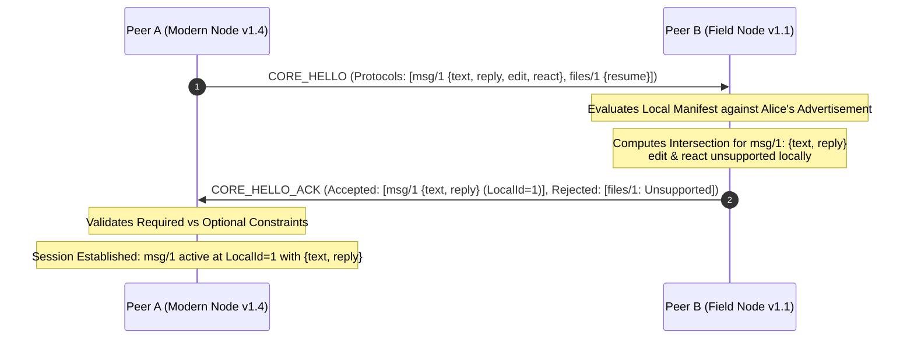

# Architecting a Zero-Monolith P2P Protocol: How SIAR Solves Versioning, Capabilities, and Backpressure in Rust

*By the SIAR Engineering Team*  
*Target Platforms: Substack / Dev.to | Technical Deep-Dive Series: Part 1 of 24*  
*Focus: Spec 01 — Protocol Extension System Architecture (`crates/siar-protocol-ext`)*

---

```
                       +---------------------------------------+
                       |           Application Layer           |
                       |  (Messaging, Files, ERP, Emergency)   |
                       +-------------------+-------------------+
                                           |
                                           v
                       +---------------------------------------+
                       |       Extension Protocol Layer        |
                       |   (Independently Versioned Specs)     |
                       +-------------------+-------------------+
                                           |
                                           v
                       +---------------------------------------+
                       |      Session Multiplexer Engine       |
                       |    (Fair Weighted Round-Robin + WFQ)   |
                       +-------------------+-------------------+
                                           |
                                           v
                       +---------------------------------------+
                       |          Core Control Protocol        |
                       |    (Identity, Handshake, Capability)  |
                       +-------------------+-------------------+
                                           |
                                           v
                       +---------------------------------------+
                       |     Transport Abstraction (Multi)     |
                       |   (Iroh QUIC / BLE / Wi-Fi / DTN)     |
                       +---------------------------------------+
```

---

## Table of Contents

1. [Introduction: The Monolithic Protocol Trap](#1-introduction-the-monolithic-protocol-trap)
2. [The Architectural Axioms of SIAR](#2-the-architectural-axioms-of-siar)
3. [The Anatomy of Spec 01: Core vs. Extension Separation](#3-the-anatomy-of-spec-01-core-vs-extension-separation)
4. [Namespaces, Identifiers, and Session-Local Translation](#4-namespaces-identifiers-and-session-local-translation)
5. [The Mathematics of Capability Negotiation](#5-the-mathematics-of-capability-negotiation)
6. [Defensive Data Plane: Safe Framing and Zero Memory Exhaustion](#6-defensive-data-plane-safe-framing-and-zero-memory-exhaustion)
7. [Flow Control, Backpressure, and Weighted Fair Scheduling](#7-flow-control-backpressure-and-weighted-fair-scheduling)
8. [Lifecycle State Machines, Lazy Opening, and Mobile Energy Discipline](#8-lifecycle-state-machines-lazy-opening-and-mobile-energy-discipline)
9. [Cross-Subsystem Integration: Grounding Spec 01 in the Real World](#9-cross-subsystem-integration-grounding-spec-01-in-the-real-world)
   - [9.1 Transport Neutrality & Multipath Routing (Specs 03 & 12)](#91-transport-neutrality--multipath-routing-specs-03--12)
   - [9.2 Delay-Tolerant Networking & Asynchronous Bundles (Specs 04 & 06)](#92-delay-tolerant-networking--asynchronous-bundles-specs-04--06)
   - [9.3 Multi-Device Identity & MLS E2EE Boundaries (Specs 02 & 28)](#93-multi-device-identity--mls-e2ee-boundaries-specs-02--28)
   - [9.4 Headless Daemons & Embedded Linux Repeaters (Specs 16 & 20)](#94-headless-daemons--embedded-linux-repeaters-specs-16--20)
10. [Rust Implementation Deep-Dive: A Tour of `siar-protocol-ext`](#10-rust-implementation-deep-dive-a-tour-of-siar-protocol-ext)
11. [Verification, Property Testing, and Golden Wire Invariants](#11-verification-property-testing-and-golden-wire-invariants)
12. [Ten Golden Rules for Distributed Protocol Designers](#12-ten-golden-rules-for-distributed-protocol-designers)
13. [Conclusion & Next Steps in the Series](#13-conclusion--next-steps-in-the-series)

---

## 1. Introduction: The Monolithic Protocol Trap

Every ambitious peer-to-peer (P2P), local-first, or decentralized protocol begins with clean intentions and a simple wire layout. You define a message enum in your favorite systems language, write a serializer, spin up a socket, and send packets between two nodes. It feels effortless:

```rust
// The seductive, fatal trap of early P2P protocol design
pub enum ProtocolMessage {
    Hello { peer_id: [u8; 32], version: u32 },
    TextMessage { id: u64, content: String },
    FileChunk { file_id: u64, offset: u64, data: Vec<u8> },
    Heartbeat,
}
```

This works delightfully in a staging environment. But six months later, reality strikes:

1. **Feature Coupling & Version Bloat**: Your team adds audio calls. Then reactions. Then group metadata synchronization. Then emergency disaster alerts. Your simple enum swells to seventy variants. Suddenly, every micro-embedded sensor, solar-powered field repeater, and headless storage daemon running your codebase is forced to pull in cryptographic libraries, multimedia codecs, and complex group ratchet engines just to deserialize incoming packets.
2. **The Fragile Wire Cascade**: A developer modifies the payload of `TextMessage` to support rich formatting or read receipts. Two clients running different minor releases connect over an ad-hoc Wi-Fi link. The older client encounters an unknown tag or deserialization error, panics, drops the connection, and the entire peer session collapses.
3. **The Central Governance Bottleneck**: A partner company or third-party engineering team wishes to deploy an enterprise-specific inventory sync workflow over your mesh. Under the centralized enum model, they cannot do this without submitting a pull request to your core repository, modifying your enum, and convincing you to release a new global protocol version.
4. **Memory and Head-of-Line Starvation**: A node initiates a 200 MB file transfer over a low-bandwidth Bluetooth Low Energy (BLE) link while another node broadcasts a time-sensitive emergency SOS alert. Because the protocol treats all variants as equal members of a flat pipeline, the multi-megabyte file chunks flood the socket queues, exhausting memory buffers and starving life-critical beacons.

This architectural failure mode is the **Monolithic Protocol Trap**. It has crippled dozens of P2P and distributed systems, transforming modular software into brittle, unmaintainable monoliths where protocol evolution grinds to a halt.

When we set out to build **SIAR** (*Survivable Identity & Autonomous Routing*)—a zero-infrastructure, multi-transport, offline-first mesh communications system designed to survive total internet blackouts, natural disasters, and hostile network partitions—we made a foundational commitment:

> **The protocol must evolve through independently versioned, capability-negotiated extensions, never through an ever-growing central enum.**

This principle forms the basis of **Spec 01: Protocol Extension System Architecture**, realized in the pure-Rust `siar-protocol-ext` crate. In this technical deep-dive, we break down how Spec 01 achieves true zero-coupling modularity, how capability negotiation prevents session failures across disparate node generations, how we enforce hard byte-level backpressure at the data plane, and how this architecture scales seamlessly from 4MB embedded Linux repeaters to modern Android and desktop clients.

---

## 2. The Architectural Axioms of SIAR

To understand the mechanics of Spec 01, one must understand the operating environment for which SIAR is engineered. SIAR is not another centralized messenger wrapping a cloud server in an Electron shell. It is a multi-bearer, delay-tolerant networking (DTN) platform operating across four strict physical and logical layers:

```text
+-------------------------------------------------------------------------+
|                  SIAR Platform Architecture Axioms                      |
+-------------------------------------------------------------------------+
|  1. Rust-First Bare-Metal Core: Deterministic memory, zero garbage      |
|     collection pauses, compile-time thread safety, and cross-platform   |
|     hermeticity (Linux, Android NDK, macOS, Windows, Embedded).         |
|                                                                         |
|  2. Zero Central Infrastructure: Identity is cryptographic (Ed25519     |
|     keypairs, X25519 DH). No central directory, no cloud authorization.  |
|                                                                         |
|  3. Multi-Bearer Opportunistic Transport: Dynamic switching between     |
|     Iroh QUIC (direct WAN/LAN), Wi-Fi Direct, Wi-Fi Aware (NAN), BLE,   |
|     and Bluetooth Classic without dropping active sessions.             |
|                                                                         |
|  4. Asynchronous Store-Carry-Forward (DTN): Physical data ferrying      |
|     across severed networks via solar field repeaters and moving nodes.  |
|                                                                         |
|  5. Hard Memory & Battery Boundaries: Mobile devices must not burn      |
|     battery initializing unneeded subsystems; embedded nodes must never |
|     panic from unbounded allocation under malicious traffic.            |
+-------------------------------------------------------------------------+
```

Under these axioms, any design pattern that forces tight coupling between product features (such as chat, file distribution, and presence) and transport or network machinery is strictly fatal. 

If a disaster-relief team deploys a battery-powered Raspberry Pi headless daemon (`siar-emergency-node`) on a mountaintop, that node needs to forward DTN storage bundles, negotiate peer capabilities over Wi-Fi, and route emergency beacons. It must never know what a user avatar is, how markdown chat messages are parsed, or what codec a video call requires.

Spec 01 provides the rigorous architectural blueprint that makes this strict modularity mathematically and programmatically enforceable.

---

## 3. The Anatomy of Spec 01: Core vs. Extension Separation

The central breakthrough of Spec 01 is an uncompromising separation of concerns between the **Core Control Protocol** and **Extension Protocols**.

```text
                                  +------------------------------+
                                  |     Communication Session    |
                                  +--------------+---------------+
                                                 |
         +-----------------------+---------------+-----------------------+
         |                       |                                       |
         v                       v                                       v
+-----------------+     +-----------------+                     +-----------------+
|  Core Control   |     |    Messaging    |                     | File Subsystem  |
|    Protocol     |     |    Extension    |                     |    Extension    |
| (Always Present)|     | (org.siar/msg/1)|                     |(org.siar/file/1)|
+-----------------+     +-----------------+                     +-----------------+
| • Hello         |     | • Text payload  |                     | • Chunk payload |
| • Peer Auth     |     | • Reactions     |                     | • Hash manifest |
| • Capabilities  |     | • Read receipts |                     | • Resumption    |
| • Extension Mux |     | • Outbox sync   |                     | • Stream window |
| • Flow Metadata |     +-----------------+                     +-----------------+
| • Error Framing |
+-----------------+
```

### 3.1 What the Core Protocol Knows

The Core Protocol is the minimal set of semantics required for any two nodes to establish a secure, authenticated, and bounded conversation. It is intentionally small, invariant, and universally implemented by every peer in the SIAR ecosystem.

Its responsibilities are strictly limited to:
- **Session Handshake (`Hello` / `HelloAck`)**: Authenticating peer identities via cryptographic signatures and agreeing upon the core framing version.
- **Peer Identity Binding**: Cryptographically proving that the transport link corresponds to the claimed public key (`DeviceIdentity`).
- **Extension Advertisement**: Exchanging the inventory of protocol extensions supported by each node.
- **Capability Negotiation**: Performing deterministic mathematical intersection over the capability sets of mutually supported extensions.
- **Extension Lifecycle Management**: Opening, closing, pausing, and resuming logical extension channels (`ExtensionOpen`, `ExtensionClose`).
- **Session-Level Flow Control**: Exchanging window updates, queue pressure signals, and keep-alive pings.
- **Error Framing**: Emitting deterministic error codes when wire semantics are violated.

### 3.2 What the Core Protocol Never Knows

By specification, the Core Protocol has **zero knowledge** of:
- The structure of a chat message or whether text is UTF-8 or encrypted ciphertext.
- File transfer chunk sizes, ranges, hashes, or storage paths.
- Presence states, typing indicators, or read receipts.
- Group membership lists or MLS cryptographic epoch trees.
- Emergency SOS coordinate layouts or disaster medical telemetry.
- Enterprise-specific business objects or ERP forms.

All application logic lives entirely within self-contained **Extension Protocols**. If an unknown extension frame arrives, the core protocol multiplexer does not drop the session or trigger a deserialization fault. It routes it according to established forward-compatibility rules: optional extensions are cleanly ignored; required extensions fail gracefully with structured wire diagnostics.

---

## 4. Namespaces, Identifiers, and Session-Local Translation

How do nodes refer to protocol extensions without collisions, centralized registries, or string parsing bottlenecks? Spec 01 establishes a two-phase identifier model: **Globally Unique Canonical Identifiers** on the outside, and **Session-Local Numeric Identifiers** on the wire.

### 4.1 Hierarchical Global Namespaces

Every protocol extension is uniquely identified across the universe by a three-part canonical identifier:

$$\text{ProtocolId} = \langle\text{NamespaceId}\rangle \,/\, \langle\text{ProtocolName}\rangle \,/\, \langle\text{ProtocolMajor}\rangle$$

Examples:
- `org.siar.comm/messaging/1`
- `org.siar.comm/files/1`
- `org.siar.comm/presence/1`
- `org.siar.emergency/sos/1`
- `com.acme.logistics/pallet-telemetry/2`

In `crates/siar-protocol-ext/src/identifier.rs`, this is enforced through strongly typed structs that prevent loose string manipulation:

```rust
#[derive(Debug, Clone, PartialEq, Eq, Hash)]
pub struct ProtocolId {
    pub namespace: NamespaceId,
    pub protocol: ProtocolName,
    pub major: ProtocolMajor,
}

impl ProtocolId {
    pub fn new(namespace: &str, protocol: &str, major: u32) -> Result<Self, ProtocolIdError> {
        let namespace = NamespaceId::parse(namespace)?;
        let protocol = ProtocolName::parse(protocol)?;
        Ok(Self {
            namespace,
            protocol,
            major: ProtocolMajor(major),
        })
    }

    /// Returns the canonical RFC-style wire representation
    pub fn to_canonical_string(&self) -> String {
        format!("{}/{}/{}", self.namespace.as_str(), self.protocol.as_str(), self.major.0)
    }
}
```

Notice the inclusion of `major` directly in the protocol identity. Under Spec 01, a bump in the major version signifies an inherently wire-incompatible change. Therefore, `org.siar.comm/messaging/1` and `org.siar.comm/messaging/2` are treated by the runtime as two completely distinct protocols that happen to share a namespace. A node can advertise support for both simultaneously, allowing clean backward compatibility during multi-year network transitions.

### 4.2 Ephemeral Session-Local IDs

While canonical strings like `org.siar.comm/messaging/1` are vital for debugging, logging, and third-party developer clarity, sending a 30-byte string in the header of every single data frame over a 20 kbps BLE connection would impose unacceptable protocol overhead.

Spec 01 resolves this through **Session-Local ID Translation**:

```text
Negotiation Phase (Handshake):
  Peer A -> Peer B: "I support 'org.siar.comm/messaging/1' and 'org.siar.comm/files/1'"
  Peer B -> Peer A: "Agreed. For this session:
                     'org.siar.comm/messaging/1' => SessionLocalExtensionId(1)
                     'org.siar.comm/files/1'     => SessionLocalExtensionId(2)"

Data Plane Phase (Streaming):
  [Frame Header: StreamId(1) | LocalExtId: 0x0001 | Len: 256 | Payload: ...]
  [Frame Header: StreamId(2) | LocalExtId: 0x0002 | Len: 1024| Payload: ...]
```

The wire framing uses a fixed-width `u16` (`SessionLocalExtensionId`). The mapping is negotiated dynamically during session initialization, stored in a fast contiguous lookup array on both peers, and discarded when the transport disconnects. We achieve the diagnostic power of human-readable namespaces with the wire density of hand-optimized binary protocols.

---

## 5. The Mathematics of Capability Negotiation

In distributed networks, version numbers are notoriously deceptive. Suppose two nodes both claim to support `org.siar.comm/messaging/1`. Does that mean they can exchange inline images? Can they edit messages after transmission? Can they process reaction emojis or read receipts?

If you rely solely on version numbers, you enter "version matrix hell," where engineers write fragile conditional logic:

```rust
// The wrong way: version check spaghetti
if peer.minor_version >= 4 && peer.patch_version != 2 {
    send_reaction();
}
```

Spec 01 replaces this with **Explicit Set-Theoretic Capability Negotiation**.

### 5.1 Capabilities as Independent Bitsets

Within an extension, features are modeled as discrete capabilities identified by a fixed-width `CapabilityId(u32)`:

```rust
#[derive(Debug, Clone, Copy, PartialEq, Eq, Hash, PartialOrd, Ord)]
pub struct CapabilityId(pub u32);

#[derive(Debug, Clone, Default, PartialEq, Eq)]
pub struct CapabilitySet {
    values: BTreeSet<CapabilityId>,
}

impl CapabilitySet {
    /// Compute the negotiated feature subset: Local ∩ Remote
    pub fn intersect(&self, remote: &CapabilitySet) -> CapabilitySet {
        let intersection: BTreeSet<CapabilityId> = self
            .values
            .intersection(&remote.values)
            .copied()
            .collect();
        CapabilitySet { values: intersection }
    }

    pub fn contains(&self, id: CapabilityId) -> bool {
        self.values.contains(&id)
    }
}
```

When defining an extension, developers assign stable numeric IDs to concrete capabilities. For example, in SIAR's messaging extension:

```rust
pub mod messaging_caps {
    use super::CapabilityId;
    pub const TEXT: CapabilityId          = CapabilityId(1);
    pub const REPLY: CapabilityId         = CapabilityId(2);
    pub const EDIT: CapabilityId          = CapabilityId(3);
    pub const REACTION: CapabilityId      = CapabilityId(4);
    pub const READ_RECEIPT: CapabilityId  = CapabilityId(5);
    pub const TYPING: CapabilityId        = CapabilityId(6);
    pub const GROUP_MESSAGING: CapabilityId = CapabilityId(7);
}
```

### 5.2 The Two-Phase Negotiation Flow

When two peers connect, they execute a strictly sequenced negotiation handshake:



The mathematical rule governing the session is absolute:

$$\mathcal{C}_{\text{active}} = \mathcal{C}_{\text{local}} \cap \mathcal{C}_{\text{remote}}$$

No node is ever allowed to transmit an operation on the wire unless its required capability exists within $\mathcal{C}_{\text{active}}$. If a user taps "React with ❤️" on a modern smartphone, but the peer on the other end of the mesh is a legacy node lacking `messaging_caps::REACTION`, the local UI gracefully disables the action or displays a subtle fallback indicator. Not a single invalid byte is sent over the radio.

### 5.3 Mandatory vs. Optional Extension Semantics

Not all extensions are created equal. A specialized desktop file-transfer utility requires `files/1` to be useful, whereas a general-purpose messenger considers `files/1` an optional luxury:

```rust
#[derive(Debug, Clone, Copy, PartialEq, Eq)]
pub enum ExtensionRequirement {
    Required,
    Optional,
}
```

Spec 01 enforces two invariant safety rules during negotiation:
1. **The Optional Extension Rule**: If Peer A advertises an optional extension that Peer B does not support (or whose major versions do not overlap), the negotiation engine simply omits that extension from the active session. **An unsupported optional extension must never tear down the peer connection.**
2. **The Required Extension Rule**: If Peer A requires an extension that Peer B cannot satisfy, the negotiation fails deterministically with `NegotiationError::MissingRequiredExtension`. The session is halted before any application data can be corrupted or misinterpreted.

---

## 6. Defensive Data Plane: Safe Framing and Zero Memory Exhaustion

P2P networks are inherently adversarial. A peer connection might be a trusted family member's phone, an untrusted passerby's Bluetooth radio, or a malicious actor intentionally injecting malformed frames to trigger buffer overflows and crash mesh repeaters.

The golden rule of systems programming in P2P is: **Never trust remote length fields.**

### 6.1 The 4-Step Framing Sequence

In `crates/siar-protocol-ext/src/framing.rs`, we mandate that frame deserialization occur through a four-step, non-collapsible verification barrier:

```text
[ Incoming Byte Stream ]
          |
          v
+-------------------------------------------------------------+
| Step 1: Read Exactly Bounded Header (FRAME_HEADER_BYTES=10) |
+-------------------------------------------------------------+
          |
          v
+-------------------------------------------------------------+
| Step 2: Validate Wire Length Against Absolute Protocol Max  |
|         (frame_length <= ABSOLUTE_MAX_FRAME_SIZE: 16 MB)    |
+-------------------------------------------------------------+
          |
          v
+-------------------------------------------------------------+
| Step 3: Check Against Negotiated Extension Limits           |
|         (frame_length <= extension_limits.max_frame_size)   |
|         e.g., Messaging = 64 KB, Files = 1 MB               |
+-------------------------------------------------------------+
          |
          v
+-------------------------------------------------------------+
| Step 4: Allocate Buffer Safely & Read Payload Bytes         |
+-------------------------------------------------------------+
```

Many vulnerable network daemons collapse these steps into one: they read a length integer from the wire and immediately invoke `Vec::with_capacity(remote_length)`. If a malicious peer transmits a header claiming a payload of `0xFFFFFFFF` (4 GB), the receiving node attempts to allocate 4 gigabytes of memory and panics via an out-of-memory (OOM) abort.

In SIAR, step 3 intercepts the frame before allocation takes place:

```rust
pub const FRAME_HEADER_BYTES: usize = 10;
pub const ABSOLUTE_MAX_FRAME_SIZE: u32 = 16 * 1024 * 1024; // 16 MB ceiling

#[derive(Debug, Clone, PartialEq, Eq)]
pub struct FrameHeader {
    pub frame_length: u32,
    pub session_extension_id: SessionLocalExtensionId,
    pub frame_type: u8,
    pub flags: u8,
}

pub fn parse_frame_header(buf: &[u8]) -> Result<FrameHeader, FramingError> {
    if buf.len() < FRAME_HEADER_BYTES {
        return Err(FramingError::IncompleteHeader);
    }
    let frame_length = u32::from_be_bytes([buf[0], buf[1], buf[2], buf[3]]);
    let ext_id = u16::from_be_bytes([buf[4], buf[5]]);
    let frame_type = buf[6];
    let flags = buf[7];

    if frame_length > ABSOLUTE_MAX_FRAME_SIZE {
        return Err(FramingError::OversizedFrame(frame_length));
    }

    Ok(FrameHeader {
        frame_length,
        session_extension_id: SessionLocalExtensionId(ext_id),
        frame_type,
        flags,
    })
}

pub fn validate_frame_length(
    header: &FrameHeader,
    limits: &ExtensionLimits,
) -> Result<(), FramingError> {
    if header.frame_length as usize > limits.max_frame_size {
        return Err(FramingError::ExceedsExtensionLimit {
            requested: header.frame_length,
            limit: limits.max_frame_size,
        });
    }
    Ok(())
}
```

If a peer sends a 512 KB frame on the `messaging` extension (which declares a strict 64 KB limit), the frame is rejected at Step 3 with zero heap allocations performed. The node classifies this violation, closes the abusive channel, and remains fully operational.

### 6.2 Serialization Discipline: Separation of Wire and Domain Models

Spec 01 establishes strict rules regarding serialization:

1. **Domain Types Are Never Wire Types**: You must never attach `#[derive(Serialize, Deserialize)]` to an internal database or UI struct and blast it over the network. Domain models change as features evolve; wire formats must remain immortal. Every extension maintains a dedicated `wire` module containing explicit, versioned schema representations.
2. **Fixed-Width Integers Only**: The Rust `usize` type is strictly forbidden on the wire. A `usize` is 4 bytes on a 32-bit ARM Cortex-M micro-controller and 8 bytes on an x86_64 server. Using `usize` on the wire destroys cross-architecture interoperability. Wire structs exclusively use `u8`, `u16`, `u32`, `u64`, and fixed-length byte arrays.
3. **Rust Is the Reference Implementation, Not the Wire Specification**: The wire protocol must be fully specifiable without referencing the Rust compiler's internal memory layout. No `#[repr(C)]` struct dumps, no native endianness assumptions (big-endian network order is strictly enforced), and no compiler-generated enum discriminant assumptions.

---

## 7. Flow Control, Backpressure, and Weighted Fair Scheduling

When devices communicate over heterogeneous, intermittent paths, transmission speeds diverge by multiple orders of magnitude. A local Wi-Fi 6 link can easily move 500 megabits per second. A Bluetooth Low Energy (BLE) link struggles to deliver 40 kilobits per second. A multi-hop DTN mesh route across field repeaters might transmit in sporadic 10-kilobyte bursts spaced minutes apart.

If a local desktop client begins streaming a 50 MB video file while connected to a phone over BLE, what happens if the phone's receiver cannot write to disk or drain its network socket as fast as the desktop pumps bytes?

Without hard backpressure, the desktop's outgoing buffers explode in memory, the phone's incoming buffers overflow, packets drop, radios thrash in retransmission storms, and the device overheats.

### 7.1 True Backpressure via Ownership Rejection

In `crates/siar-protocol-ext/src/backpressure.rs`, backpressure is not an optional advisory flag—it is a physical gate. Queues are strictly bounded in both item count and aggregate byte capacity:

```rust
pub struct BoundedQueue<T> {
    items: VecDeque<T>,
    max_items: usize,
    current_bytes: usize,
    max_bytes: usize,
}

impl<T: Measurable> BoundedQueue<T> {
    pub fn push(&mut self, item: T) -> Result<(), BackpressureRejection<T>> {
        let item_size = item.byte_size();
        if self.items.len() >= self.max_items || self.current_bytes + item_size > self.max_bytes {
            // Hand the item back to the caller! Zero allocations, no silent drops.
            return Err(BackpressureRejection {
                rejected_item: item,
                current_depth: self.items.len(),
                current_bytes: self.current_bytes,
            });
        }
        self.current_bytes += item_size;
        self.items.push_back(item);
        Ok(())
    }
}
```

Notice the return signature: `Result<(), BackpressureRejection<T>>`. If the queue is at capacity, the queue does not drop the item into the void, nor does it block the thread indefinitely. It **returns ownership of the item back to the caller**. The calling subsystem immediately senses backpressure and must throttle its own upstream producer, pausing file-chunk reads from disk until socket drain events fire.

### 7.2 Multi-Tier Traffic Priorities

Different categories of protocol traffic have radically different urgency profiles. Spec 01 formalizes a 6-tier priority hierarchy:

```rust
#[derive(Debug, Clone, Copy, PartialEq, Eq, PartialOrd, Ord)]
pub enum TrafficPriority {
    Critical,     // Life-safety SOS alerts, disaster beacons, route failure notices
    Control,      // Flow control windows, ping/pong, capability re-negotiation
    Interactive,  // Direct human typing, ephemeral text messages, voice signaling
    Normal,       // Message delivery receipts, contact card updates, avatars
    Bulk,         // Media attachments, encrypted file chunks, database backups
    Background,   // Diagnostic sync, DHT gossip maintenance, log exports
}
```

### 7.3 Weighted Fair Scheduling with Bounded Emergency Override

A naive scheduler would simply serve traffic using a strict priority queue: always send `Critical` first, then `Control`, down to `Background`.

This naive approach is disastrous in distributed systems because it introduces **Perpetual Starvation**. If an aggressive background sync routine or a steady stream of interactive text messages saturates a slow BLE link, bulk file transfers will never send a single byte. Worse, if an errant node or bug generates continuous high-priority traffic, the entire communication pipeline deadlocks.

Spec 01 implements **Weighted Fair Round-Robin (WFRR) with a Bounded Emergency Override** in `crates/siar-protocol-ext/src/scheduler.rs`:

```text
Priority Tier Weights:
  Interactive  ===> Weight: 8 packets / round
  Normal       ===> Weight: 4 packets / round
  Bulk         ===> Weight: 2 packets / round
  Background   ===> Weight: 1 packet  / round

Emergency Override Gate:
  Critical / Control packets bypass the round-robin schedule immediately,
  BUT are capped at MAX_CONSECUTIVE_CRITICAL (e.g., 16 packets).
  Once the burst cap is reached, the scheduler forcibly yields at least
  one time-slice to lower-tier queues to prevent total channel starvation.
```

This guarantees two mathematical invariants:
1. **Bounded Latency for Emergencies**: An incoming emergency SOS message is guaranteed immediate transmission ahead of all queued file chunks.
2. **Starvation Freedom**: Bulk and background queues are mathematically guaranteed forward progress over any sustained time window.

---

## 8. Lifecycle State Machines, Lazy Opening, and Mobile Energy Discipline

On mobile operating systems (Android and iOS), background execution is an unforgiving environment. If an app awakens in the background to handle an incoming push or mesh ping, and immediately spins up camera drivers, audio resampling pipelines, SQLite databases, and cryptography ratchets, the operating system's battery monitor will terminate the process within milliseconds.

Spec 01 mandates an explicit **Extension Lifecycle State Machine** combined with **Lazy Extension Opening**.

```text
+--------------+        Peer Advertisement        +--------------+
|  Registered  | -------------------------------> |  Advertised  |
+--------------+                                  +--------------+
                                                         |
                                                         | Core Negotiation
                                                         v
+--------------+         Close Signal             +--------------+
|    Closed    | <------------------------------- |  Negotiated  |
+--------------+                                  +--------------+
       ^                                                 |
       |                                                 | User Triggers Feature
       |                                                 | (OPEN_EXTENSION)
       |                                                 v
+--------------+        Unrecoverable Fault       +--------------+
|   Closing    | <------------------------------- |   Active     |
+--------------+                                  +--------------+
```

### 8.1 The Power of Dormant Negotiation

Under Spec 01, negotiating an extension during the initial handshake **does not initialize that extension**.

Consider this real-world scenario:
1. Two SIAR nodes pair over BLE. They negotiate support for:
   - `org.siar.comm/messaging/1`
   - `org.siar.comm/files/1`
   - `org.siar.media/calls/1`
2. The core session enters the `SessionEstablished` state.
3. The `messaging` extension transitions to `Active` because text messaging is the primary interactive service.
4. The `files` and `calls` extensions remain in the `Negotiated` (dormant) state.
   - Zero file transfer threads are spawned.
   - Zero audio DSP pipelines or Opus codecs are allocated in memory.
   - Zero storage handles are opened.

Only when a user taps "Send 50MB PDF" or "Call Contact" does the runtime transmit a lightweight `ExtensionOpen` control frame across the wire. Both peers transition that specific extension from `Negotiated` to `Active`, spin up the necessary machinery, and begin data exchange. When the transfer completes or the call ends, an `ExtensionClose` frame returns the extension to dormant status, releasing system buffers and allowing mobile CPUs to drop back into deep sleep.

### 8.2 Graceful vs. Abrupt Shutdown Semantics

Mobile and mesh nodes do not live in polite data centers. A user walks out of Bluetooth range, a battery dies, or an Android task killer strikes. The protocol must guarantee data integrity under sudden disconnection.

Spec 01 divides shutdown into two cleanly separated pipelines:

```rust
pub const GRACEFUL_SHUTDOWN_STEPS: &[&str] = &[
    "stop_accepting_new_work",
    "flush_outbox_buffers",
    "persist_session_state",
    "send_close_frame",
    "release_network_handles",
];

pub const ABRUPT_SHUTDOWN_STEPS: &[&str] = &[
    "detect_transport_drop",
    "mark_in_flight_operations_recoverable",
    "persist_resumable_byte_offsets",
    "release_transient_buffers",
];
```

By distinguishing graceful flushing from abrupt failure handling, SIAR guarantees that a sudden radio disconnect never leaves SQLite state corrupted or partial file chunks orphaned without resumption markers.

---

## 9. Cross-Subsystem Integration: Grounding Spec 01 in the Real World

While Spec 01 is implemented cleanly as a standalone crate (`crates/siar-protocol-ext`), its true architectural brilliance emerges when you observe how it seamlessly integrates with the rest of the SIAR platform specifications.

```text
+------------------------------------------------------------------------------------+
|                         SIAR System Specifications Matrix                          |
+------------------------------------------------------------------------------------+
| Spec 01: Protocol Extension System (Foundation)                                    |
|   |---> Spec 02: Multi-Device Identity   ===> Authenticated Identity Binding       |
|   |---> Spec 03: Transport Routing       ===> DeliveryClass-based link selection   |
|   |---> Spec 04/06: Offline Event Log/DTN===> Store-Carry-Forward persistence      |
|   |---> Spec 08: Resource Limits         ===> Per-peer memory & quota enforcement   |
|   |---> Spec 16/20: Headless & Embedded  ===> Zero-UI headless repeater binaries   |
|   |---> Spec 19: C-ABI / FFI             ===> JNI bindings to Android Kotlin UI    |
+------------------------------------------------------------------------------------+
```

Let us examine these cross-cutting connections in technical detail.

### 9.1 Transport Neutrality & Multipath Routing (Specs 03 & 12)

A common mistake in modern P2P protocols is coupling application logic directly to transport primitives—such as assuming every node has an IP address, relying on libp2p multiaddrs, or hardcoding Iroh Node IDs into chat messages.

Spec 01 strictly enforces **Transport Neutrality**. Notice the signature of `RoutingRequirements` declared by an extension operation:

```rust
#[derive(Debug, Clone, PartialEq, Eq)]
pub struct RoutingRequirements {
    pub delivery_class: DeliveryClass,
    pub max_age_seconds: Option<u64>,
    pub durable: bool,
    pub allow_forwarding: bool,
    pub priority: TrafficPriority,
}

#[derive(Debug, Clone, Copy, PartialEq, Eq)]
pub enum DeliveryClass {
    Realtime,            // VoIP audio, live typing indicators (Drop if delayed)
    ReliableInteractive,// 1:1 chat text, read receipts (Direct path preferred)
    Durable,            // Group state updates, document sync (Must be acknowledged)
    DelayTolerant,      // Disaster SOS, offline relay bundles (Store-Carry-Forward)
}
```

Notice what is missing: **There are no IP addresses, port numbers, MAC addresses, or QUIC connection handles anywhere in this struct.**

When an extension produces an operation, it merely declares its semantic intent: *"I need Durable delivery with Interactive priority."* It passes this down to **Spec 03 (Transport & Routing Policy Engine)** and **Spec 12 (Multipath Networking)**.

The routing engine inspects the current physical links:
- If a high-speed Iroh QUIC direct connection over Wi-Fi is active, it routes the bytes across QUIC stream multiplexers.
- If Wi-Fi drops and only a BLE link is alive, the routing engine automatically re-routes the operation across Bluetooth, fragmenting the frames into MTU-sized chunks without the extension ever realizing the underlying physical medium shifted.
- If all physical links drop, the routing engine routes `Durable` and `DelayTolerant` operations directly to the local disk outbox for later transmission.

### 9.2 Delay-Tolerant Networking & Asynchronous Bundles (Specs 04 & 06)

Traditional client-server protocols assume end-to-end synchronous connectivity: Client A connects to Server S, which connects to Client B. If Client B is offline, the message waits on Server S.

In an off-grid disaster mesh, there is no Server S. Alice might be in a valley with no connectivity, while Bob is three kilometers away behind a mountain ridge.

Spec 01 interfaces directly with **Spec 04 (Offline Event Log)** and **Spec 06 (DTN Store-Carry-Forward Architecture)**:
1. When Alice sends a message, her local `messaging` extension generates a standard wire payload.
2. Because Bob is currently unreachable over real-time transports, the runtime encapsulates the negotiated extension frame into an encrypted **DTN Bundle** (`crates/siar-dtn-bundle`).
3. A mobile emergency vehicle or a pedestrian with a battery-powered headless node walks past Alice. Alice's node opportunistically establishes a short-range Wi-Fi Aware link, completes a Spec 01 handshake, negotiates `dtn/1`, and offloads the bundle.
4. Two hours later, the vehicle drives into Bob's physical proximity. The node discovers Bob, executes a Spec 01 handshake, verifies Bob's cryptographic identity, and transfers the bundle.
5. Bob's node unpacks the DTN bundle, hands the inner frame directly to his local `messaging/1` extension handler, and the message appears in his timeline as if they were directly connected.

Spec 01's separation of wire framing from immediate session lifetime makes asynchronous store-carry-forward networking a native capability rather than an afterthought.

### 9.3 Multi-Device Identity & MLS E2EE Boundaries (Specs 02 & 28)

Under **Spec 02 (Multi-Device Identity Architecture)** and **Spec 28 (End-to-End Encryption & Key Management)**, identity in SIAR is strictly cryptographic. A user identity (`IdentityKey`) is an Ed25519 signing key that anchors a dynamic group of individual `DeviceIdentity` instances (smartphones, laptops, field repeaters).

Spec 01 connects to this identity layer through the `ExtensionContext`:

```rust
pub struct ExtensionContext {
    pub peer_identity: PeerIdentity,     // 32-byte verified public key
    pub session_id: SessionId,           // Ephemeral session entropy
    pub security_level: SecurityPolicy,  // Cleartext, Transport-Encrypted, or E2EE
}
```

Extensions declare their required security invariants in their `ExtensionDescriptor`:

```rust
pub struct SecurityRequirements {
    pub authenticated_peer: bool,       // Must prove possession of Ed25519 key
    pub e2ee_required: bool,            // Must be encapsulated in MLS payload
    pub authorization_required: bool,   // Must satisfy local contact whitelist
    pub allow_anonymous: bool,          // Permitted for public emergency SOS
}
```

For standard messaging, `e2ee_required` is set to `true`. The core protocol ensures that cleartext message frames cannot be dispatched across unencrypted sessions. Conversely, for `emergency/1` broadcast beacons, `allow_anonymous` is permitted so that unidentified survivors can broadcast distress signals across the mesh to any listening node.

### 9.4 Headless Daemons & Embedded Linux Repeaters (Specs 16 & 20)

One of the greatest triumphs of Spec 01 is how it enables heterogeneous binary distributions. In the SIAR codebase, Cargo feature flags cleanly decouple crates:

```toml
# In siar Cargo workspace
[features]
default = ["messaging", "files", "desktop-ui"]
headless-relay = ["siar-protocol-ext", "siar-dtn", "siar-transport-ble"]
```

When compiling the **Headless Emergency Repeater Daemon** (`siar-emergency-node`) for a 32-bit MIPS or ARM embedded router with 16 megabytes of RAM:
- We compile `siar-protocol-ext` with only `dtn` and `emergency` extensions enabled.
- The entire Dioxus desktop UI engine, Jetpack Compose Android bindings, Opus audio resampling libraries, AV1 video decoders, and user contact management databases are stripped completely from the compiled binary.
- The resulting daemon compiles to a lean 4 MB ELF executable that boots in 120 milliseconds, uses 9 megabytes of RSS RAM, and can run continuously for three weeks on a small 12-volt solar panel and motorcycle battery.

Because Spec 01 uses typed descriptors and clean runtime registries rather than static central enums, the headless repeater participates in the exact same mesh sessions as high-end Android flagships, happily forwarding encrypted DTN packets and routing SOS beacons without missing a beat.

---

## 10. Rust Implementation Deep-Dive: A Tour of `siar-protocol-ext`

To appreciate how clean architecture translates into concrete systems code, let us look inside the actual `crates/siar-protocol-ext` implementation.

### 10.1 The Extension Descriptor

Every extension self-describes its capabilities, resource limits, and security constraints through an immutable descriptor:

```rust
pub struct ExtensionDescriptor {
    pub id: ProtocolId,
    pub requirement: ExtensionRequirement,
    pub supported_capabilities: CapabilitySet,
    pub required_capabilities: CapabilitySet,
    pub limits: ExtensionLimits,
    pub security: SecurityRequirements,
    pub stability: ExtensionStability,
}
```

Notice the crucial distinction between `supported_capabilities` (everything this binary knows how to do) and `required_capabilities` (the baseline subset without which this extension refuses to run). This distinction allows a single protocol version to span multiple hardware tiers.

### 10.2 The Protocol Extension Trait

The interface between the core runtime multiplexer and an extension is governed by the `ProtocolExtension` trait:

```rust
#[async_trait::async_trait]
pub trait ProtocolExtension: Send + Sync + 'static {
    /// Return the static descriptor for negotiation
    fn descriptor(&self) -> ExtensionDescriptor;

    /// Called when the session establishes and this extension is negotiated
    async fn on_negotiated(
        &self,
        context: &ExtensionContext,
        negotiated_caps: CapabilitySet,
    ) -> Result<Box<dyn ExtensionHandler>, ExtensionError>;
}

#[async_trait::async_trait]
pub trait ExtensionHandler: Send + Sync + 'static {
    /// Handle an incoming validated data frame
    async fn handle_frame(
        &mut self,
        frame_type: u8,
        payload: &[u8],
    ) -> Result<(), ExtensionError>;

    /// Poll for outgoing frames to send across the multiplexer
    async fn poll_outgoing(
        &mut self,
    ) -> Option<OutgoingFrame>;

    /// Lifecycle transition: shutdown signal
    async fn shutdown(&mut self) -> Result<(), ExtensionError>;
}
```

Notice how `ExtensionHandler` receives a pre-validated `&[u8]` slice. It never parses raw wire frame headers, never checks remote length bounds, and never manages TCP or QUIC socket streams. All framing safety, length validation, and multiplexing are handled upstream by the core protocol engine before the handler is invoked.

### 10.3 The Runtime Builder Pattern

Assembling a node runtime is completely decoupled and declarative:

```rust
let runtime = CommunicationRuntime::builder()
    .with_identity(local_device_identity)
    .with_transport(iroh_transport)
    .register_extension(MessagingExtension::new(messaging_config))
    .register_extension(FileTransferExtension::new(file_config))
    .register_extension(EmergencyAlertExtension::new(emergency_config))
    .build()
    .await?;
```

If you are writing a dedicated CLI backup tool, you simply omit `MessagingExtension` and `EmergencyAlertExtension`. The compiler will not include them in the binary, and the node will seamlessly negotiate only file capabilities when pairing with other peers.

---

## 11. Verification, Property Testing, and Golden Wire Invariants

Software engineering is what happens when code must survive years of maintenance by dozens of developers across multiple release cycles. How do we guarantee that an optimization in 2027 does not break compatibility with a field node deployed in 2026?

Spec 01 establishes a rigorous three-tiered verification discipline:

```text
+--------------------------------------------------------------------------+
|                  Verification & Testing Architecture                     |
+--------------------------------------------------------------------------+
|  Tier 1: Unit & Matrix Compatibility Tests                               |
|          Verifies that v1.0 ↔ v1.0, v1.0 ↔ v1.2, and subset ↔ superset   |
|          negotiations produce mathematically exact CapabilitySets.       |
|                                                                          |
|  Tier 2: Golden Wire Invariant Tests                                     |
|          Serializes concrete Rust types and compares against raw byte    |
|          arrays byte-for-byte to prevent unintended wire layout shifts.  |
|                                                                          |
|  Tier 3: Hostile Input & Property-Based Fuzzing                          |
|          Injects random bit flips, truncated headers, and hostile        |
|          lengths (0xFFFFFFFF) to mathematically prove panic-freedom.     |
+--------------------------------------------------------------------------+
```

### 11.1 Golden Wire Invariant Tests

In `crates/siar-protocol-ext/src/framing.rs`, we maintain byte-level golden tests. Here is an actual test case verifying header serialization:

```rust
#[test]
fn test_golden_frame_header_layout() {
    let header = FrameHeader {
        frame_length: 1024,
        session_extension_id: SessionLocalExtensionId(7),
        frame_type: 0x01,
        flags: 0x80,
    };

    let encoded = encode_frame_header(&header);
    
    // Exact byte-by-byte layout expectation:
    // [0..4]  Length = 1024 (0x00000400 in big-endian)
    // [4..6]  SessionLocalExtensionId = 7 (0x0007 in big-endian)
    // [6]     FrameType = 1
    // [7]     Flags = 128 (0x80)
    // [8..10] Reserved bytes (0x0000)
    let expected_bytes: [u8; 10] = [
        0x00, 0x00, 0x04, 0x00, // Length
        0x00, 0x07,             // Extension ID
        0x01,                   // Type
        0x80,                   // Flags
        0x00, 0x00,             // Reserved
    ];

    assert_eq!(encoded, expected_bytes);

    // Verify round-trip decode
    let decoded = parse_frame_header(&encoded).expect("Decode must succeed");
    assert_eq!(decoded, header);
}
```

If an engineer inadvertently changes a field type from `u16` to `u32`, or alters endianness, the golden test immediately fails in CI with an exact diff of the violated byte indices.

### 11.2 The 16-Item Definition of Done Self-Audit

Spec 01 concludes with an explicit **Definition of Done (DoD)** checklist containing sixteen rigorous criteria. In `crates/siar-protocol-ext/src/definition_of_done.rs`, we turned this checklist into a machine-checkable Rust test that audits the crate:

```rust
#[test]
fn test_definition_of_done_audit() {
    let audit = audit_part_01_definition_of_done();
    
    // We enforce that every single DoD item is explicitly accounted for:
    assert_eq!(audit.total_items(), 16);
    
    // An audit that cannot report honest gaps is useless theater.
    // We assert that the 4 known architectural follow-ups are honestly tracked!
    assert_eq!(audit.satisfied_count(), 12);
    assert_eq!(audit.honest_gaps_count(), 4);
}
```

By embedding the specification's completion criteria directly into the executable test suite, we ensure that technical debt cannot be swept under the rug.

---

## 12. Ten Golden Rules for Distributed Protocol Designers

Drawing from the design and implementation of SIAR Spec 01, here are ten battle-tested rules for systems engineers architecting P2P, local-first, or decentralized protocols:

1. **Kill the Central Message Enum Early**: Once your protocol spans more than three distinct features, replace your flat `enum Message` with independently versioned extension channels. You will save yourself months of refactoring later.
2. **Never Trust Remote Length Fields**: Always parse a fixed-size header first, validate the claimed length against both global and subsystem-specific limits, and only then allocate memory buffers.
3. **Represent Capabilities as Mathematical Sets**: Do not rely on version numbers to imply feature availability. Use explicit, compact capability IDs and compute $\text{Local} \cap \text{Remote}$ during the handshake.
4. **Enforce Hard Memory Backpressure**: Queues must be strictly bounded in both item count and aggregate byte capacity. When full, return the item to the caller to force upstream throttling.
5. **Separate Domain Types from Wire Schemas**: Never derive serialization directly on internal business models or database entities. Keep your wire schemas isolated and versioned.
6. **Ban `usize` on the Wire**: Always use explicit, fixed-width integers (`u8`, `u16`, `u32`, `u64`) with documented big-endian byte order to guarantee interoperability across 32-bit and 64-bit platforms.
7. **Schedule Traffic with Fairness, Not Just Priority**: Pure priority queues lead to bulk traffic starvation under sustained load. Implement weighted round-robin scheduling with bounded emergency overrides.
8. **Never Let Optional Extensions Break Sessions**: If a peer advertises an unknown optional extension, ignore it cleanly. Forward compatibility is the lifeblood of decentralized systems.
9. **Negotiate Lazily for Mobile Runtimes**: Capability agreement must not trigger heavy subsystem initialization. Keep extensions dormant until explicitly opened by user action.
10. **Maintain Byte-Level Golden Tests in CI**: Never rely on unit tests alone. Test your serializers against hardcoded byte arrays to catch unintended wire format drift before it hits production.

---

## 13. Conclusion & Next Steps in the Series

Decentralized protocol design is often treated as an exercise in cryptography and transport plumbing. But as systems grow, the greatest risks to longevity are not broken ciphers—they are architectural rot, brittle coupling, unbounded memory consumption, and backwards-incompatible wire upgrades.

**Spec 01: Protocol Extension System Architecture** demonstrates that you do not have to compromise between rapid feature iteration and bulletproof stability. By treating protocol capabilities as independently versioned, set-theoretically negotiated extensions governed by strict backpressure and memory boundaries, SIAR provides a robust foundation for resilient, zero-infrastructure communications.

In **Part 2 of this series**, we will dive into **Spec 02: Multi-Device Identity Architecture**, examining how SIAR synchronizes cryptographic state, manages device revocations, and anchors autonomous decentralized trust across phones, laptops, and field repeaters without relying on a central server.

---

### Resources & Further Exploration

- 🌐 **[Official SIAR Website](https://irshadali5.github.io/siar-site/)** — Architecture portals, downloads, and interactive labs.
- 📚 **[SIAR Technical Wiki (26 Chapters)](file:///home/irshad/Projects/siar/wiki/Home.md)** — Comprehensive deep-dive into the entire system stack.
- 📑 **[System Architecture Specifications (sys-arch)](file:///home/irshad/Projects/siar/sys-arch/)** — All 33 core specifications and 27 UI/UX architecture documents.
- 📦 **[crates/siar-protocol-ext](file:///home/irshad/Projects/siar/crates/siar-protocol-ext)** — Pure-Rust reference implementation of Spec 01.

*Have thoughts, critiques, or war stories from your own distributed systems? Drop a comment below or join the discussion on our developer hub!*
