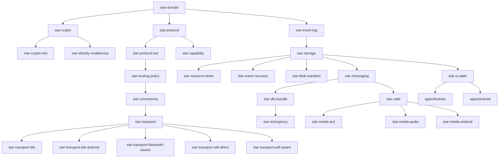

# 01 — System Overview & Architecture

> **Authoritative Specification:** [`sys-arch/`](../sys-arch/), [`SIAR_SYSTEM_ARCHITECTURE_DESIGN_RATIONALE.md`](../SIAR_SYSTEM_ARCHITECTURE_DESIGN_RATIONALE.md), [`SIAR_SYSTEM_CAPABILITIES_AND_COMPARISON.md`](../SIAR_SYSTEM_CAPABILITIES_AND_COMPARISON.md)  
> **Corpus Scope:** 176 Architecture Specifications (Parts 01–33, UI-UX 01–27, Parts 34–150; 514k+ lines, 875k+ words)  
> **Key Crates:** [`crates/siar-domain`](../crates/siar-domain), [`crates/siar-protocol`](../crates/siar-protocol), [`crates/siar-protocol-ext`](../crates/siar-protocol-ext), [`crates/siar-capability`](../crates/siar-capability), [`crates/siar-routing-policy`](../crates/siar-routing-policy)

---

## 1. Architectural Philosophy & The 4 Communication Paradigms

Traditional modern messengers (WhatsApp, Signal, Telegram) fundamentally assume an always-on infrastructure: centralized server clusters, public DNS, public key infrastructures (PKI), and continuous cellular/broadband Internet access. When natural disasters strike, telecommunications infrastructure collapses, or state-level censorship severs external backhauls, these apps completely fail.

**SIAR** (Survivable Identity & Autonomous Routing) is engineered from first principles to represent **Paradigm 4: The Post-Infrastructure Unified Operating System**:

```text
┌─────────────────────────────────────────────────────────────────────────────────────────────────────────────────┐
│                                     THE FOUR COMMUNICATION PARADIGMS                                            │
├───────────────────────────────────────┬─────────────────────────────────────────────────────────────────────────┤
│ PARADIGM 1: Internet-Required Non-P2P │ Centralized / Federated Cloud Silos                                     │
│ (WhatsApp, Telegram, Signal, Matrix)  │ • Complete reliance on data centers, DNS, BGP, and ISP infrastructure.  │
│                                       │ • Zero survivability during blackouts, censorship, or off-grid zones.   │
├───────────────────────────────────────┼─────────────────────────────────────────────────────────────────────────┤
│ PARADIGM 2: Internet-Required P2P     │ P2P over IP Networks (DHT / Direct UDP Hole-Punching)                   │
│ (Keet / Holepunch, Tox, Jami)         │ • Eliminates central servers over the Internet via DHT & hole punching. │
│                                       │ • Fatal Blindspot: Completely inoperable without IP / WAN routing.      │
│                                       │ • Zero offline radio mesh, zero BLE/NAN discovery, zero DTN data mules. │
├───────────────────────────────────────┼─────────────────────────────────────────────────────────────────────────┤
│ PARADIGM 3: Offline-Mesh / P2P-Only   │ Radio-Constrained or Network-Isolated Mesh                              │
│ (Briar, BitChat, Bridgefy, Meshtastic)│ • Operates off-grid via local Bluetooth / Wi-Fi mesh.                   │
│                                       │ • Cannot seamlessly utilize the Internet; forced through slow Tor (Briar│
│                                       │   5–30s latency, no VoIP), or isolated to local-only BLE/LoRa radios.  │
│                                       │ • Lacks dynamic multipath bonding, hardware zero-copy media & MLS trees.│
├───────────────────────────────────────┼─────────────────────────────────────────────────────────────────────────┤
│ PARADIGM 4: SIAR Post-Infrastructure  │ Unified Multi-Transport Hybrid Operating System                         │
│ (Survivable Identity & Autonomous     │ • 100% Parity across Global Internet AND Zero-Infrastructure Mesh.      │
│  Routing)                             │ • Simultaneous Multipath Link Aggregation (5G + Wi-Fi + BLE bonded).    │
│                                       │ • Delay-Tolerant Networking (DTN) Store-Carry-Forward via Data Mules.   │
│                                       │ • Sovereign Ed25519/MLS Tree-KEM Cryptography (No Phone Numbers/Emails).│
│                                       │ • Zero-Copy Native Hardware Media Pipelines & 5-Tier Emergency QoS.     │
│                                       │ • Pure Rust 2021 Memory-Safe Core with sub-30MB RAM and <45ms boot.    │
└───────────────────────────────────────┴─────────────────────────────────────────────────────────────────────────┘
```

### Core Invariants of SIAR
1. **Zero-Infrastructure Invariant**: The system operates seamlessly when zero external servers, DNS nodes, or Internet gateways are reachable.
2. **Cryptographic Sovereignty**: Identities are root Ed25519 signing pairs owned exclusively by local devices—no phone numbers, email addresses, or centralized registries.
3. **Opportunistic Dissemination**: Messages and files are delay-tolerant bundles that travel over any available medium (BLE, Wi-Fi Direct, Wi-Fi Aware, Bluetooth Classic, LAN, Internet relays) through store-carry-forward physical mules.
4. **Unified Memory-Safe Core**: A 100% memory-safe Rust workspace powers CLI daemons, solar-powered mesh repeaters, Android apps, and desktop interfaces.

---

## 2. The 3 Tiers of Architecture (176 Specifications)

The complete SIAR specification corpus in [`sys-arch/`](../sys-arch/) and [`ui-ux/`](../ui-ux/) spans **176 specification documents** totaling **514,448 lines** across three distinct tiers:

```text
sys-arch/ & ui-ux/ (176 Specifications · 514k+ lines)
│
├── 1. Core Mesh & Local-First Engine (Parts 01 – 33)
│      105,732 lines · 33 Specs
│      Execution: Sequenced per spec-order.md (Milestones 1, 2, 5, 6, 7).
│      Focus: P2P wire framing, multi-device MLS keys, dynamic routing policy,
│      resumable BLAKE3 blobs, DTN data mules, emergency QoS, lock-free audio DSP.
│
├── 2. UI/UX & Cross-Platform Shells (Parts ui-ux-01 – ui-ux-27)
│      72,610 lines · 27 Specs
│      Execution: Parallel vertical slices with backend engines (Milestones 3, 4, 5).
│      Focus: Dioxus 0.7 desktop shells, Android Compose shells, design tokens,
│      virtualized message lists, composer, call surfaces, pairing, security center.
│
└── 3. The Anonymous Network & Cloud Operating Ecosystem (Parts 34 – 150)
       336,106 lines · 116 Specs (Parts 34–138, 140–150; 139 reserved)
       Focus: Global Loopix mixnet, Sphinx onion packetization, zero-trust cloud servers,
       TPM measured boot, physical datacenter tamper detection, PIR search, WASM sandboxes.
```

---

## 3. The 8 Layers of the Anonymous Network (Parts 34–150)

In Parts 01–33, SIAR solves **local-first survivability**. When traffic leaves local radios and traverses the public Internet, **pure End-to-End Encryption (E2EE) alone fails**: it protects *what* is said, but leaks *who* speaks to whom, *when*, and *how much data* flows. Passive network observers can reconstruct social graphs through packet timing and volume analysis.

Part 34 establishes the governing axiom:
> *"SIAR must treat anonymity as an explicit routing and security property, not as a side effect of encryption or relaying."*

```text
┌───────────────────────────────────────────────────────────────────────────────────────────────────────┐
│                                 THE 8 ANONYMOUS NETWORK LAYERS (34–150)                               │
├────────────────────────────────┬─────────────────┬────────────────────────────────────────────────────┤
│ Architectural Layer            │ Specs           │ Core Focus & Systems Engineered                    │
├────────────────────────────────┼─────────────────┼────────────────────────────────────────────────────┤
│ 1. Core Mixnet Mechanics       │ Parts 34 – 42   │ Sphinx onion packetization, Loopix Poisson delays, │
│                                │                 │ cover traffic, Sybil-proof directories, bridges.   │
├────────────────────────────────┼─────────────────┼────────────────────────────────────────────────────┤
│ 2. Anonymous App Primitives    │ Parts 43 – 49   │ Metadata-private groups, anonymous VoIP/video      │
│                                │                 │ signaling, private presence, blind reputation.     │
├────────────────────────────────┼─────────────────┼────────────────────────────────────────────────────┤
│ 3. Sovereign Protocol Policies │ Parts 50 – 70   │ Cross-border data sovereignty, multi-authority     │
│                                │                 │ governance, anti-enumeration naming, agility.      │
├────────────────────────────────┼─────────────────┼────────────────────────────────────────────────────┤
│ 4. Zero-Trust Infrastructure   │ Parts 71 – 81   │ TPM measured boot, HSM key custody, SBOM lineage,  │
│                                │                 │ Raft consensus, secretless runtimes, mTLS.         │
├────────────────────────────────┼─────────────────┼────────────────────────────────────────────────────┤
│ 5. Private Cloud Services      │ Parts 82 – 94   │ Passkey auth, private contact graphs, PIR search,  │
│                                │                 │ Differential Privacy metrics, audit logs.          │
├────────────────────────────────┼─────────────────┼────────────────────────────────────────────────────┤
│ 6. Defense & SecOps            │ Parts 95 – 100  │ Continuous control compliance, privacy-safe SOC/IR,│
│                                │                 │ threat intelligence, rollback protection.          │
├────────────────────────────────┼─────────────────┼────────────────────────────────────────────────────┤
│ 7. SRE, Fleet & Physical Site  │ Parts 101 – 121 │ Fair load-shedding, FinOps, SRE error budgets/SLOs,│
│                                │                 │ rack tamper detection, disaster evacuation.        │
├────────────────────────────────┼─────────────────┼────────────────────────────────────────────────────┤
│ 8. Governance, SDK & Plugins   │ Parts 122 – 150 │ Requirements knowledge graph, SDKs, sandboxed WASM │
│                                │                 │ plugins, Information Flow Control, marketplace.    │
└────────────────────────────────┴─────────────────┴────────────────────────────────────────────────────┘
```

---

## 4. Master Architecture Dependency Flow

```text
               ┌────────────────────────────────────────────────────────┐
               │    Tier 0 Core Engine (Specs 01-09)                    │
               │    Envelopes, Multi-Device Keys, Routing, DTN, Blobs   │
               └───────────────────────────┬────────────────────────────┘
                                           │
                                           ▼
               ┌────────────────────────────────────────────────────────┐
               │    Tier 1 Security Backbone (Spec 28)                  │
               │    Double Ratchet, OpenMLS, AEAD                       │
               └───────────────────────────┬────────────────────────────┘
                                           │
                                           ▼
               ┌────────────────────────────────────────────────────────┐
               │    High-Anonymity Mixnet Plane (Specs 34-42)           │
               │    Sphinx Framing, Poisson Delays, Cover Loops, Nym    │
               └───────────────────────────┬────────────────────────────┘
                                           │
                   ┌───────────────────────┴───────────────────────┐
                   ▼                                               ▼
┌──────────────────────────────────────┐       ┌──────────────────────────────────────┐
│ Anonymous App Layer (Specs 43-49)    │       │ Zero-Trust Infrastructure (50-81)    │
│ Private Groups, Calls, Presence      │       │ Attestation, HSM, Consensus, mTLS    │
└──────────────────┬───────────────────┘       └──────────────────┬───────────────────┘
                   │                                               │
                   └───────────────────────┬───────────────────────┘
                                           ▼
               ┌────────────────────────────────────────────────────────┐
               │ Private Cloud & Social Surfaces (Specs 82-94)          │
               │ Feeds, Channels, PIR Search, Differential Privacy      │
               └───────────────────────────┬────────────────────────────┘
                                           │
                                           ▼
               ┌────────────────────────────────────────────────────────┐
               │ SRE, Physical Fleet & Threat Defense (Specs 95-121)    │
               │ Tamper Detection, Error Budgets, Incident Command      │
               └───────────────────────────┬────────────────────────────┘
                                           │
                                           ▼
               ┌────────────────────────────────────────────────────────┐
               │ Developer Platform & Sandboxed WASM Plugins (122-150)  │
               │ SDKs, Capability Brokers, IFC Governance, Marketplace  │
               └────────────────────────────────────────────────────────┘
```

---

## 5. Implementation Feasibility: Concrete Product vs. North Star

- **The Concrete Product (Specs 01–33 + UI-UX 01–27 = 60 Specs)**:  
  **Fully feasible, actionable, and substantially implemented.** 31 workspace crates already exist. Specs 01, 02, and 03 are completely closed and passing hundreds of automated unit, integration, and fuzz tests.
- **The Extended Network Ecosystem (Specs 34–150 = 116 Specs)**:  
  This is a **North Star Architecture**. It outlines how a sovereign, metadata-private internet ecosystem functions over a multi-year horizon. Having these specifications written ensures that early decisions (packet headers, storage abstractions, capability matrices) never conflict with future requirements like mixnets or WASM sandboxing.

---

## 6. User Superpowers Unlocked at Every Milestone

```text
┌────────────────────────────────────────────────────────────────────────────────────────┐
│                        USER SUPERPOWERS UNLOCKED AT EVERY STAGE                        │
├─────────────────────────┬──────────────────────────────────────────────────────────────┤
│ Milestone               │ Concrete Real-World User Capability                          │
├─────────────────────────┼──────────────────────────────────────────────────────────────┤
│ Milestone 1–2           │ Total Data Durability: Zero loss on battery pull; no phone   │
│ (Core & Identity)       │ numbers or central accounts; multi-device revocation.        │
├─────────────────────────┼──────────────────────────────────────────────────────────────┤
│ Milestone 3–4           │ Sovereign Daily Messenger: Fluid 120Hz native desktop and    │
│ (App Shells & Chat UI)  │ Android UI running local-first with zero cloud dependencies. │
├─────────────────────────┼──────────────────────────────────────────────────────────────┤
│ Milestone 5             │ Zero-Lag Calls & Local Swarms: Sub-10ms VoIP; 300MB/s file   │
│ (Media & Multipath)     │ transfers via Wi-Fi Direct; calls survive network switches.  │
├─────────────────────────┼──────────────────────────────────────────────────────────────┤
│ Milestone 6             │ Blackout Survival: Mesh messaging over BLE/Wi-Fi Direct;     │
│ (DTN & Emergency Mesh)  │ store-carry-forward data mules; life-saving SOS beaconing.   │
├─────────────────────────┼──────────────────────────────────────────────────────────────┤
│ Milestone 7             │ Metadata Invisibility: Loopix mixnet & Sphinx onion packets  │
│ (Mixnet Anonymity)      │ defeat ISP-level passive traffic analysis and correlation.   │
├─────────────────────────┼──────────────────────────────────────────────────────────────┤
│ Milestone 8             │ Private Cloud & Sandboxed Apps: PIR search, differential     │
│ (Ecosystem & WASM)      │ privacy metrics, and WASM plugins provably unable to spy.    │
└─────────────────────────┴──────────────────────────────────────────────────────────────┘
```

---

## 7. The Server Database Architecture: "No One-Database Dogma"

In [`sys-arch/74`](../sys-arch/74-anonymous-network-database-persistent-state-transaction-boundaries-schema-evolution-storage-engine-architecture.md), SIAR establishes a **"No One-Database Dogma"** (§22). Persistence is decoupled across 4 storage classes: SQL, Key-Value, Object Storage, and Append-Only Log.

### The Cloud Reference Baseline vs. 100% Pure-Rust Sovereign Stack

| Subsystem | Cloud Baseline in Specs | Pure-Rust Sovereign Alternative |
| :--- | :--- | :--- |
| **Server Relational DB** | PostgreSQL (`SQLx`/`Diesel`) | **Stoolap** (standalone) or Rust-embedded RDBMS |
| **Mailbox Ciphertext** | SQL Partition / Redis | **`redb`** or **`fjall`** (Pure-Rust embedded ACID KV) |
| **Large Media & Backups** | AWS S3 / MinIO | **Garage** (Pure-Rust distributed S3) or native BLAKE3 CAS |
| **Anti-Replay Nonces** | Redis Cluster | **Pure-Rust Cuckoo Filters** + `DashMap` / `redb` |
| **Message Bus / PubSub** | Apache Kafka / NATS | **Fluvio** / **Iggy.rs** or Tokio Broadcast Channels |

**Key Invariant:** No plaintext user content is ever stored on server databases. Mailboxes store blind ciphertext with short TTLs.

---

## 8. The Engineering Crucible: Why SIAR Rejects Easy Compromises

Developing SIAR requires overcoming five notoriously difficult engineering hurdles:
1. **The "Zero Infrastructure" Tax**: No DNS, no NTP, no APNs/FCM push servers, and no central STUN/TURN relays. Every foundational service must be implemented in Rust.
2. **Peer-to-Peer MLS Without a Delivery Service**: Implementing IETF MLS (RFC 9420) where devices advance ratchets offline and merge concurrent tree forks across ad-hoc Bluetooth links without a central sequencer.
3. **Hostile Mobile Operating Systems**: Bypassing Android Doze mode background socket limits, mitigating chip antenna contention between BLE and Wi-Fi Direct, and maintaining zero-copy memory safety across Kotlin/JNI boundaries.
4. **Pure-Rust DSP Under Lock-Free Deadlines**: Writing acoustic echo cancellation (AEC), noise suppression (NS), and sample-rate resamplers in pure Rust with sub-10ms frame latencies, where a single memory allocation causes audio dropouts.
5. **The Specification Invariant Burden**: Fulfilling 12,893+ numbered sections across 176 architecture documents with zero compiler warnings and strict crash-recovery validation.

---

## 9. Workspace Crate Taxonomy (31 Domain Crates)

The Rust workspace is partitioned into 31 specialized, single-responsibility domain crates alongside application binaries and platform drivers:



---

## 10. Survivability Invariants & Operational Modes

SIAR automatically shifts between three distinct operational modes based on real-time link connectivity and energy budgets:

| Operational Mode | Available Networks | Transport Selection | Data Delivery Mechanism |
| :--- | :--- | :--- | :--- |
| **Connected Online** | Internet Relays, LAN, Wi-Fi | Iroh / QUIC, WebSockets | Direct end-to-end QUIC streams, real-time ACKs |
| **Local Tactical Mesh** | Wi-Fi Direct, Wi-Fi Aware, LAN | Direct P2P sockets, multicast | Hop-by-hop local mesh forwarding (sub-10ms latency) |
| **Air-Gapped / Off-Grid** | BLE GATT, Bluetooth Classic | Proximity beaconing, DTN bundles | Physical mule store-carry-forward with Spray-and-Wait |
