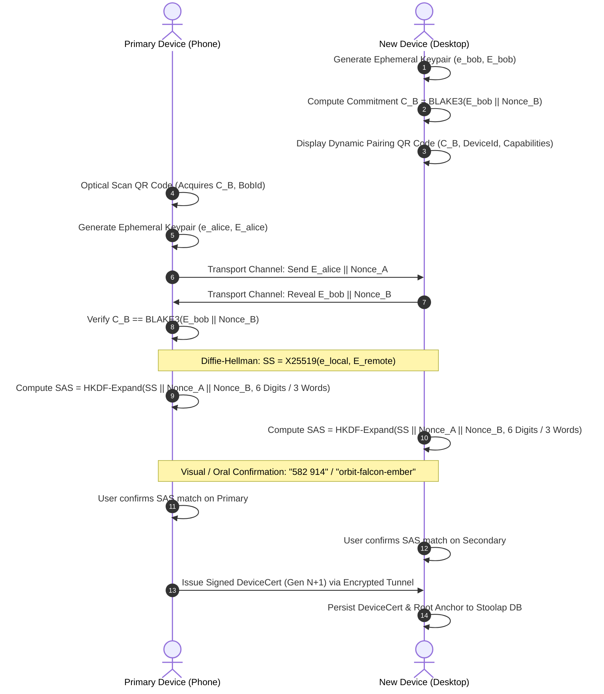
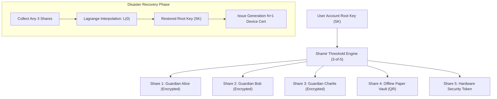

# 02 — Multi-Device Identity & Trust

> **Corresponding Specifications:** [`sys-arch/02-multi-device-identity-architecture.md`](../sys-arch/02-multi-device-identity-architecture.md), [`sys-arch/15-qr-nfc-bootstrap-pairing-architecture.md`](../sys-arch/15-qr-nfc-bootstrap-pairing-architecture.md), [`sys-arch/ui-ux-15-security-center-devices-keys-recovery-architecture.md`](../ui-ux/ui-ux-15-security-center-devices-keys-recovery-architecture.md)  
> **Key Crates:** [`crates/siar-identity-multidevice`](../crates/siar-identity-multidevice), [`crates/siar-crypto`](../crates/siar-crypto), [`crates/siar-domain`](../crates/siar-domain)  
> **Complements:** [`SIAR_SYSTEM_ARCHITECTURE_DESIGN_RATIONALE.md`](../SIAR_SYSTEM_ARCHITECTURE_DESIGN_RATIONALE.md) (§2.1, §2.12), [`SIAR_SYSTEM_CAPABILITIES_AND_COMPARISON.md`](../SIAR_SYSTEM_CAPABILITIES_AND_COMPARISON.md) (§3.1)

---

## 1. Architectural Philosophy: Sovereign Identity Without Central Authorities

Traditional modern messengers tether cryptographic identity to telephone numbers (MSISDN), email addresses, or centralized public key directories (e.g., Apple ID, Google Identity, Signal Directory Service). This centralized anchoring introduces critical vulnerabilities:
1. **SIM-Swapping & SS7 Interception**: Malicious actors or state surveillance entities hijack phone numbers via compromised telecom operators.
2. **Directory Censorship & Sybil Infiltration**: Central servers can alter directory mappings, withhold public keys, or serve forged certificates to targeted dissidents.
3. **Account Seizure**: A centralized provider can unilaterally terminate or reassign identity anchors without user consent.

SIAR establishes a **strictly sovereign, decentralized multi-device identity model**. An account is defined exclusively by a master cryptographic keypair generated locally on physical hardware. Physical devices (smartphones, laptops, desktop workstations, ruggedized tactical nodes) are granted delegated cryptographic authority through signed device certificates forming a cryptographically verifiable trust tree.

```
                       +-----------------------------------+
                       |      Account Root Keypair         |
                       |     Ed25519 (Private / Public)    |
                       |  (Hardware Keystore / Offline PKI)|
                       +-----------------+-----------------+
                                         | Signs
           +-----------------------------+-----------------------------+
           |                                                           |
+----------v-----------+                                   +-----------v-----------+
| Primary Phone        |                                   | Desktop Workstation   |
| Device Key & Cert    |                                   | Device Key & Cert     |
| (Gen 1, Active)      |                                   | (Gen 2, Active)       |
+----------+-----------+                                   +-----------+-----------+
           | Signs Provisioning                                        |
+----------v-----------+                                               |
| Field Tablet         |                                               |
| Device Key & Cert    |                                               |
| (Gen 3, Active)      |                                               |
+----------------------+                                               |
           |                                                           |
           X [Revocation Tombstone: Gen 2 Stolen] ---------------------+
```

---

## 2. Threat Model & Security Boundaries

The multi-device identity system operates under a rigorous Byzantine threat model:

| Threat Vector | Attacker Capability | Mitigation Mechanism |
| :--- | :--- | :--- |
| **Physical Theft of Secondary Device** | Attacker extracts local storage, reads flash chips | Hardware-backed keystores, instantaneous tombstone gossip, remote forward secrecy ratchet destruction. |
| **Relay Man-in-the-Middle (MITM)** | Malicious mesh relay or cloud relay modifies certificates | Mutual SAS out-of-band verification, strict Ed25519 root signature validation over all device certificates. |
| **State Rollback & Replay Attack** | Network adversary captures and replays older valid device certs | Strictly monotonic generation counters (`u64`); peers reject any cert with $\text{generation} \le \text{last\_seen}$. |
| **Silent Device Injection** | Compromised relay attempts to append an unauthorized eavesdropping device | Account tree changes require cryptographic signature from an authorized provisioning key; safety fingerprints update instantly. |
| **Long-Term Root Compromise** | Root key leaked via cold-boot or compromised backup | $k$-of-$n$ Shamir Secret Sharing social recovery with threshold guardian verification and certificate revocation epochs. |

---

## 3. Cryptographic Identity Model & Monotonic Generations

### Root Key & Hardware Roots of Trust
The account identity is anchored by an **Ed25519 Root Keypair** ($SK_{\text{root}}, PK_{\text{root}}$) generated using OS-level secure hardware entropy:
- **Android**: Android `KeyStore` with StrongBox Keymaster isolation (`MasterKeyProvider`).
- **iOS / macOS**: Apple Secure Enclave (`kSecAttrAccessibleAfterFirstUnlockThisDeviceOnly`).
- **Linux / Tactical Terminals**: TPM 2.0 via PKCS#11 or hardware security tokens (YubiKey / Nitrokey).

### Monotonic Device Generation Counters
To permanently prevent replay attacks and state rollback, every device certificate carries a strictly increasing generation counter:

$$\text{Generation}(D) \in \mathbb{N}, \quad \text{Invariant: } \text{Gen}_{t+1} > \text{Gen}_t$$

```rust
pub struct DeviceCert {
    pub account_id: AccountId,
    pub device_id: DeviceId,
    pub device_public_key: PublicKey,
    pub generation: u64,
    pub capabilities: CapabilityBitmask,
    pub issued_at: Timestamp,
    pub expires_at: Option<Timestamp>,
    pub signature: Signature, // Signed by Account RootKey or Authorised Provisioning Device
}

#[derive(Clone, Debug, PartialEq, Eq)]
pub struct DeviceTrustStore {
    account_root: PublicKey,
    active_devices: HashMap<DeviceId, DeviceCert>,
    revocation_tombstones: HashMap<DeviceId, RevocationTombstone>,
    highest_generation: u64,
}
```

### Certificate Validation Rules
Upon receiving any `DeviceCert` over mesh or relay links:
1. **Signature Verification**: Verify $\text{Verify}_{PK_{\text{root}}}(\text{Payload}, \sigma) == \text{True}$.
2. **Generation Monotonicity**: Ensure $\text{generation} > \text{store.highest\_generation}(D)$.
3. **Tombstone Check**: If $\exists T \in \text{tombstones}$ where $T.\text{device\_id} == D.\text{device\_id}$ and $T.\text{generation} \ge D.\text{generation}$, the certificate is unconditionally rejected.
4. **Temporal Bounds**: If $\text{expires\_at}$ is specified, ensure $\text{current\_time} < \text{expires\_at}$.

---

## 4. Short Authentication String (SAS) & Out-of-Band Pairing

When a user links a secondary device (e.g., adding a desktop app to an existing phone account), they execute a zero-knowledge, out-of-band mutual authentication protocol designed to eliminate MITM vectors even if the transport channel is controlled by an active adversary.



### Mathematical SAS Derivation
The Short Authentication String derivation ensures that an active attacker intercepting the key exchange has a negligible probability of collision ($P \le 10^{-6}$ for 6 decimal digits):

$$SS = \text{X25519}(e_{\text{alice}}, E_{\text{bob}}) = \text{X25519}(e_{\text{bob}}, E_{\text{alice}})$$

$$\text{PRK} = \text{HKDF-Extract}(\text{salt}=\text{Nonce}_A \parallel \text{Nonce}_B, \text{IKM}=SS)$$

$$\text{OKM} = \text{HKDF-Expand}(\text{PRK}, \text{info}=\text{"SIAR-SAS-v1"}, \text{len}=32)$$

$$\text{SAS}_{\text{numeric}} = (\text{u32::from\_be\_bytes}(\text{OKM}[0..4])) \pmod{10^6}$$

For oral verification during voice calls or proximity tactical operations, the first 6 bytes of OKM map onto a standardized 3-word mnemonic derived from a curated phonetically distinct 2048-word dictionary:

$$\text{Index}_i = \text{u16::from\_be\_bytes}(\text{OKM}[2i..2i+2]) \pmod{2048}, \quad i \in \{0, 1, 2\}$$

---

## 5. Safety Fingerprints & Asynchronous Contact Verification

To defend against man-in-the-middle attacks across asynchronous contacts, SIAR computes a canonical `SafetyFingerprint`. Because peer identities may be compared across disparate networks and timeframes, the fingerprint calculation is strictly symmetric and deterministic:

$$F(A, B) = \text{BLAKE3-DeriveKey}\left(\text{"SIAR-SafetyFingerprint-v1"}, \min(PK_A, PK_B) \parallel \max(PK_A, PK_B)\right)$$

Where $\min$ and $\max$ denote lexicographical byte-order comparison, ensuring:

$$F(A, B) \equiv F(B, A), \quad \forall A, B$$

```rust
pub struct SafetyFingerprint {
    pub raw_bytes: [u8; 32],
}

impl SafetyFingerprint {
    pub fn compute(local_root: &PublicKey, remote_root: &PublicKey) -> Self {
        let (first, second) = if local_root.as_bytes() < remote_root.as_bytes() {
            (local_root.as_bytes(), remote_root.as_bytes())
        } else {
            (remote_root.as_bytes(), local_root.as_bytes())
        };

        let mut hasher = blake3::Hasher::new_derive_key("SIAR-SafetyFingerprint-v1");
        hasher.update(first);
        hasher.update(second);
        let hash = hasher.finalize();

        Self { raw_bytes: *hash.as_bytes() }
    }

    /// Formats as 12 groups of 5 decimal digits (60 digits total)
    pub fn format_blocks(&self) -> String {
        let mut digits = String::with_capacity(71);
        for chunk in self.raw_bytes.chunks_exact(5) {
            let val = ((chunk[0] as u64) << 32)
                | ((chunk[1] as u64) << 24)
                | ((chunk[2] as u64) << 16)
                | ((chunk[3] as u64) << 8)
                | (chunk[4] as u64);
            digits.push_str(&format!("{:05} ", val % 100_000));
        }
        digits.trim_end().to_string()
    }
}
```

### Safety State Machine & Visual Warnings
In [`siar-ui-state`](../crates/siar-ui-state), each contact is tracked via a strict state machine:

```
[Unverified] ---> (User Confirms SAS / QR Scan) ---> [Verified]
      |                                                    |
      |                                             (Contact Adds Device)
      |                                                    |
      +-------------------------------------------> [ChangedUnverified]
                                                           |
                                                (Re-Verification Prompt)
```

If a contact provisions a new secondary device or rotates keys, the state transitions immediately to `ChangedUnverified`. Outgoing message dispatch displays a persistent inline warning banner blocking transmission until explicitly acknowledged or re-verified.

---

## 6. Revocation Architecture & Tombstone Gossip Mechanics

When a physical device is lost, stolen, or decommissioned, the account root key issues a signed `RevocationTombstone`:

```rust
pub struct RevocationTombstone {
    pub account_id: AccountId,
    pub device_id: DeviceId,
    pub revoked_generation: u64,
    pub reason: RevocationReason,
    pub timestamp: Timestamp,
    pub signature: Signature, // Signed by RootKey
}

#[derive(Copy, Clone, Debug, PartialEq, Eq)]
pub enum RevocationReason {
    UserInitiated,
    DeviceCompromised,
    Decommissioned,
    SuspectedTheft,
}
```

### Epidemic Tombstone Gossip Protocol
Revocation tombstones are marked with the highest transport priority (`Priority::Urgent`) and propagated through epidemic gossip:
1. **Immediate Ingest**: Any node receiving a valid tombstone stores it in Stoolap DB (`revocation_tombstones` table).
2. **Session Eviction**: The node immediately terminates all active WireGuard tunnels, QUIC streams, Iroh connections, and pairwise Double Ratchet sessions associated with that `DeviceId`.
3. **TreeKEM Pruning**: In group chats, an automated MLS Commit proposal is broadcast, evicting the revoked leaf from the TreeKEM ratchet tree and ratcheting the group epoch to guarantee Post-Compromise Security (PCS).
4. **Epidemic Propagation Bounds**: With $N$ nodes in a connected mesh cluster and infection parameter $\beta$, tombstone spread time follows:
   $$T_{\text{convergence}} \le \frac{\ln(N) + \gamma}{\beta}$$
   Ensuring network-wide quarantine within seconds over active radio clusters.

---

## 7. Social & Threshold Disaster Recovery (Shamir Secret Sharing)

To ensure account recoverability if a user loses all active physical devices without relying on centralized phone numbers or cloud backup servers, SIAR implements a sovereign **Threshold Social Recovery Scheme** using Shamir's Secret Sharing ($k$-of-$n$):

$$f(x) = S + \sum_{j=1}^{k-1} a_j x^j \pmod p$$

Where $S$ is the serialized 32-byte Root Private Key scalar, $p = 2^{255} - 19$, and $a_j \xleftarrow{R} \mathbb{Z}_p$ are random coefficients.



### Guardian Delegation & Privacy Protection
1. Each share $s_i = (i, f(i))$ is encrypted under the respective Guardian's public key using HPKE (ChaCha20-Poly1305).
2. Guardians store only blind ciphertext; they have zero visibility into the underlying key material.
3. During recovery, the user authenticates out-of-band with any $k$ guardians (e.g., 3 out of 5), requests their decrypted share packets, and reconstructs $S$ locally via Lagrange interpolation:
   $$S = f(0) = \sum_{j=1}^k s_{i_j} \prod_{m \ne j} \frac{-i_m}{i_j - i_m} \pmod p$$
4. Once restored, the newly provisioned device immediately increments the generation counter ($\text{Gen}_{\text{new}} = \text{Gen}_{\text{old}} + 100$) and issues revocation tombstones for all previous lost hardware devices.

---

## 8. Guided Loss & Security Center Integration (`ui-ux-15`)

SIAR integrates a dedicated **Security Center** client subsystem ([`ui-ux/ui-ux-15-security-center-devices-keys-recovery-architecture.md`](../ui-ux/ui-ux-15-security-center-devices-keys-recovery-architecture.md)):
- **Granular Revocation Capabilities** (`RevocationCapabilities`): Evaluates whether a target device can be remotely signed out (`sign_out_copy`), explicitly informing the user that remote revocation invalidates cryptographic trust and network access but cannot physically scrub offline plaintext if the disk is unencrypted.
- **Duress PIN & Panic Wipe**: Entering a secondary panic PIN zeroizes all local private keys, purges SQLite/Stoolap databases, and transmits a silent `DeviceCompromised` tombstone to the mesh network before terminating the process.
- **Compromise Response Playbook**: A guided, step-by-step wizard prompting the user to re-verify affected contacts (`ReVerifyAffectedContacts`), rotate shared group TreeKEM epochs, and export a fresh encrypted disaster recovery vault.
