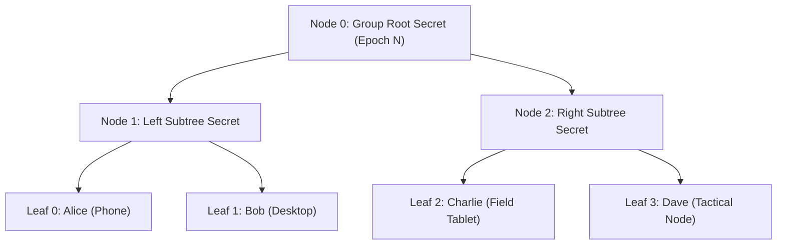

# 03 — Cryptographic Engine & Key Management

> **Corresponding Specifications:** [`sys-arch/28-production-security-e2ee-key-management-privacy-architecture.md`](../sys-arch/28-production-security-e2ee-key-management-privacy-architecture.md), [`sys-arch/05-robust-file-blob-subsystem-architecture.md`](../sys-arch/05-robust-file-blob-subsystem-architecture.md), [`sys-arch/36-sphinx-packet-cell-fragmentation-anonymous-message-framing-architecture.md`](../sys-arch/36-sphinx-packet-cell-fragmentation-anonymous-message-framing-architecture.md), [`sys-arch/66-anonymous-network-cryptographic-agility-post-quantum-migration-key-lifecycle-long-term-security-architecture.md`](../sys-arch/66-anonymous-network-cryptographic-agility-post-quantum-migration-key-lifecycle-long-term-security-architecture.md)  
> **Key Crates:** [`crates/siar-crypto`](../crates/siar-crypto), [`crates/siar-crypto-mls`](../crates/siar-crypto-mls), [`crates/siar-blob-manifest`](../crates/siar-blob-manifest)  
> **Complements:** [`SIAR_SYSTEM_ARCHITECTURE_DESIGN_RATIONALE.md`](../SIAR_SYSTEM_ARCHITECTURE_DESIGN_RATIONALE.md) (§2.12, §2.13, §2.14), [`SIAR_SYSTEM_CAPABILITIES_AND_COMPARISON.md`](../SIAR_SYSTEM_CAPABILITIES_AND_COMPARISON.md) (§3.3)

---

## 1. Cryptographic Philosophy & Threat Modeling

The SIAR cryptographic engine is designed around zero-trust sovereign primitives, post-quantum resilience, and absolute metadata minimization. Communications are assumed to traverse adversarial networks (untrusted Wi-Fi hotspots, compromised cellular towers, active state surveillance relays, and eavesdropping Bluetooth mesh observers).

```
+-----------------------------------------------------------------------------------+
|                        SIAR Cryptographic Engine Pipeline                         |
+-----------------------------------------------------------------------------------+
|  1. Post-Quantum Hybrid KEM: ML-KEM-768 (Kyber) + X25519 (ECDH)                  |
|  2. Digital Signatures: Ed25519 (EdDSA) + ML-DSA-65 (Dilithium) Hybrid State     |
|  3. Group Ratchet: IETF MLS (RFC 9420) TreeKEM with Copath Ratcheting            |
|  4. Pairwise Messaging: Double Ratchet with Encrypted Header Envelopes            |
|  5. Symmetric AEAD: ChaCha20-Poly1305 (IETF RFC 8439) / AES-256-GCM Hardware Accel|
|  6. Hashing & Merkle Trees: BLAKE3 (SIMD-accelerated, tree-hashable)              |
|  7. Memory Hygiene: Zeroize on Drop + mlock memory page pinning                   |
+-----------------------------------------------------------------------------------+
```

### Threat Vectors & Cryptographic Defenses

| Threat Vector | Adversary Profile | Impact | SIAR Cryptographic Mitigation |
| :--- | :--- | :--- | :--- |
| **Harvest Now, Decrypt Later (HNDL)** | Nation-state adversary records encrypted mesh/relay traffic for future quantum computers | Retrospective compromise of historical archives | Hybrid Post-Quantum Key Encapsulation (ML-KEM-768 + X25519) for all long-term and session key exchanges. |
| **Eavesdropping on Relay Nodes** | Malicious or compromised DTN mules and mixnet relays | Traffic analysis, metadata leakage | End-to-End Encryption (E2EE) with Sealed Sender anonymous envelope framing; relays see zero recipient/sender identifiers. |
| **Ephemerality Loss via Device Seizure** | Attacker extracts flash memory days after conversation | Recovery of conversation keys | Continuous symmetric ratchet step on every message; historical keys are immediately zeroized (Forward Secrecy). |
| **Rogue Group Injection** | Attacker compromises a member's old key and injects forged group updates | Forged messages, group fork | MLS TreeKEM with authenticated commit proposals and Post-Compromise Security (PCS) self-healing. |
| **Cold-Boot Memory Dump** | Attacker freezes RAM chips to read cryptographic secrets | Extraction of volatile keys | `ZeroizeOnDrop` traits, secure allocators, Linux `mlock()` preventing swapping to persistent flash. |

---

## 2. Post-Quantum Hybrid Key Encapsulation (X-Wing / ML-KEM-768 + X25519)

To ensure that secrecy remains unbreakable even if either classical elliptic curves or lattice-based post-quantum algorithms are broken, SIAR adopts a **dual-combiner hybrid KEM** ([`sys-arch/66`](../sys-arch/66-anonymous-network-cryptographic-agility-post-quantum-migration-key-lifecycle-long-term-security-architecture.md)):

```mermaid
graph TD
    subgraph Alice["Alice (Initiator)"]
        GenA["Generate Ephemeral Keypairs: (x_a, X_a) and (kyber_sk_a, kyber_pk_a)"]
    end

    subgraph Bob["Bob (Responder)"]
        PkB["Bob Hybrid Public Key: (X_b, kyber_pk_b)"]
    end

    Alice -->|Encapsulate against Bob's PK| Encaps["Hybrid Encapsulation Engine"]
    Encaps -->|ECDH: ss_classic = X25519(x_a, X_b)| SS1["Classical Shared Secret (32 bytes)"]
    Encaps -->|ML-KEM.Encaps(kyber_pk_b)| SS2["Post-Quantum Shared Secret (32 bytes) + Ciphertext C_pq (1088 bytes)"]
    
    SS1 --> KDF["HKDF-BLAKE3 Combiner"]
    SS2 --> KDF
    
    KDF --> MasterSS["Master Session Secret K (32 bytes)"]
```

### Mathematical Combiner Formulation
Let ML-KEM-768 operate over polynomial ring $R_q = \mathbb{Z}_q[X]/(X^{256} + 1)$ with modulus $q = 3329$:

$$\mathbf{A} \in R_q^{3 \times 3}, \quad \mathbf{s}, \mathbf{e} \in R_q^3, \quad \mathbf{t} = \mathbf{A}\mathbf{s} + \mathbf{e} \pmod q$$

The dual combiner extracts shared secrets from both mathematical domains:

$$c = \left( X_a, \, c_{\text{pq}} \right)$$

$$\text{ss}_{\text{classic}} = \text{X25519}(x_a, X_b)$$

$$(\text{ss}_{\text{pq}}, c_{\text{pq}}) = \text{ML-KEM-768.Encaps}(\text{pk}_{\text{pq}, b})$$

$$\text{PRK} = \text{HKDF-Extract}\left(\text{salt}=\text{"SIAR-Hybrid-v1"}, \, \text{IKM}=\text{ss}_{\text{classic}} \parallel \text{ss}_{\text{pq}} \parallel X_a \parallel X_b\right)$$

$$K = \text{HKDF-Expand}(\text{PRK}, \, \text{info}=\text{"session-key-derivation"}, \, \text{len}=32)$$

**Dual-PRF Combiner Proof**:
If $\text{KEM}_{\text{classic}}$ or $\text{KEM}_{\text{pq}}$ is IND-CCA2 secure, then the combined scheme $\text{KEM}_{\text{hybrid}}$ is IND-CCA2 secure in the random oracle model. An adversary must simultaneously solve the Discrete Logarithm Problem on Curve25519 *and* the Module Learning With Errors (M-LWE) lattice problem to compromise $K$.

---

## 3. Pairwise Messaging: Double Ratchet with Encrypted Header Envelopes

For direct 1-on-1 conversations, SIAR implements the **Double Ratchet** protocol combined with sealed header encryption:

```
        +------------------------------------------------------------+
        |                 Root Diffie-Hellman Ratchet                |
        |  Advances upon receiving new ephemeral DH public key       |
        +------------------------------+-----------------------------+
                                       |
                +----------------------+----------------------+
                |                                             |
     +----------v-----------+                      +----------v-----------+
     |  Sending Chain (CK_s)|                      | Receiving Chain(CK_r)|
     |  Advances per packet |                      | Advances per packet  |
     +----------+-----------+                      +----------+-----------+
                 |                                             |
     +----------v-----------+                      +----------v-----------+
     | Message Key (MK_s)   |                      | Message Key (MK_r)   |
     | AEAD Payload Encrypt |                      | AEAD Payload Decrypt |
     +----------------------+                      +----------------------+
```

### Ratchet Step Equations

1. **Symmetric Chain Advance**:
   $$MK_{i, j} = \text{HMAC-BLAKE3}(CK_{i, j}, \text{"message-key"})$$
   $$CK_{i, j+1} = \text{HMAC-BLAKE3}(CK_{i, j}, \text{"chain-advance"})$$

2. **Diffie-Hellman Root Step**:
   $$DH_{\text{secret}} = \text{X25519}(sk_{\text{local}}, PK_{\text{remote}})$$
   $$(RK_{i+1}, CK_{r, i+1}) = \text{HKDF-BLAKE3}(RK_i, DH_{\text{secret}}, \text{"ratchet-root-step"})$$

### Encrypted Header Envelopes
To prevent traffic analysis and metadata reconstruction by intermediaries, the message header (carrying the current DH public key $E$, previous chain length $PN$, and message index $N$) is not sent in plaintext:
- The header is encrypted using an ephemeral header key $HK$ derived from the root ratchet.
- Relay nodes observe only a fixed-length opaque byte vector.

```rust
pub struct EncryptedEnvelope {
    pub ephemeral_routing_id: [u8; 16],
    pub encrypted_header: [u8; 48],     // ChaCha20-Poly1305 encrypted metadata
    pub header_tag: [u8; 16],
    pub encrypted_payload: Vec<u8>,     // Message ciphertext + padding
    pub payload_tag: [u8; 16],
}
```

---

## 4. Group Messaging: IETF MLS (RFC 9420) TreeKEM Architecture

For multi-party channels, pairwise double ratchets require $O(N^2)$ message fan-out and encryption passes, overwhelming battery and bandwidth on mobile mesh devices. SIAR utilizes **IETF MLS TreeKEM** ([`crates/siar-crypto-mls`](../crates/siar-crypto-mls)):



### Tree Structure & Complexity Metrics

- **Ratchet Tree**: A left-balanced binary tree where leaves represent active group members and intermediate nodes represent shared cryptographic secrets known only to descendants.
- **Direct Path**: When member $i$ updates their leaf key (Post-Compromise Security), they update all nodes along the path from their leaf to the root.
- **Copath Resolution**: Secrets for intermediate nodes are encrypted exclusively to the root keys of copath subtrees.

| Metric | Pairwise Ratchets ($N$ Members) | MLS TreeKEM (SIAR) |
| :--- | :--- | :--- |
| **Sender TX Bandwidth** | $O(N)$ copies per message | **$O(1)$** single broadcast ciphertext |
| **Member Addition Cost** | $O(N)$ handshakes | **$O(\log N)$** commit message |
| **Member Removal Cost** | $O(N)$ re-keying sessions | **$O(\log N)$** tree rotation |
| **Cryptographic Epochs** | Asynchronous independent states | Synchronized monotonic epoch counter |

---

## 5. Production Rust Implementation: Hybrid Cryptographic Engine

The following production-grade Rust implementation manages hybrid key exchange, authenticated payload encryption, and constant-time key validation:

```rust
use chacha20poly1305::aead::{Aead, KeyInit, Payload};
use chacha20poly1305::{ChaCha20Poly1305, Nonce};
use subtle::ConstantTimeEq;
use zeroize::{Zeroize, ZeroizeOnDrop};

#[derive(Zeroize, ZeroizeOnDrop)]
pub struct HybridSessionSecret {
    pub key: [u8; 32],
}

pub struct ProductionCryptoEngine;

impl ProductionCryptoEngine {
    /// Combines classical X25519 and post-quantum ML-KEM shared secrets
    pub fn derive_hybrid_key(
        ss_classic: &[u8; 32],
        ss_pq: &[u8; 32],
        ephemeral_client_pub: &[u8; 32],
        server_pub: &[u8; 32],
    ) -> HybridSessionSecret {
        let mut hasher = blake3::Hasher::new_keyed(&blake3::hash(b"SIAR_HYBRID_SALT_V1").as_bytes()[..32].try_into().unwrap());
        hasher.update(ss_classic);
        hasher.update(ss_pq);
        hasher.update(ephemeral_client_pub);
        hasher.update(server_pub);
        
        let output = hasher.finalize();
        let mut master = [0u8; 32];
        master.copy_from_slice(output.as_bytes());
        HybridSessionSecret { key: master }
    }

    /// Encrypts message payload with ChaCha20-Poly1305 and authenticated associated data
    pub fn encrypt_payload(
        session: &HybridSessionSecret,
        nonce_bytes: &[u8; 12],
        plaintext: &[u8],
        aad: &[u8],
    ) -> Result<Vec<u8>, &'static str> {
        let cipher = ChaCha20Poly1305::new_from_slice(&session.key)
            .map_err(|_| "Invalid key size")?;
        let nonce = Nonce::from_slice(nonce_bytes);
        let payload = Payload { msg: plaintext, aad };
        cipher.encrypt(nonce, payload).map_err(|_| "Encryption failed")
    }

    /// Decrypts message payload with ChaCha20-Poly1305
    pub fn decrypt_payload(
        session: &HybridSessionSecret,
        nonce_bytes: &[u8; 12],
        ciphertext: &[u8],
        aad: &[u8],
    ) -> Result<Vec<u8>, &'static str> {
        let cipher = ChaCha20Poly1305::new_from_slice(&session.key)
            .map_err(|_| "Invalid key size")?;
        let nonce = Nonce::from_slice(nonce_bytes);
        let payload = Payload { msg: ciphertext, aad };
        cipher.decrypt(nonce, payload).map_err(|_| "Authentication tag verification failed")
    }

    /// Constant-time authentication tag verification to prevent side-channel leaks
    pub fn verify_tag_ct(tag_a: &[u8; 16], tag_b: &[u8; 16]) -> bool {
        tag_a.ct_eq(tag_b).into()
    }
}
```

---

## 6. Hardware Root of Trust & Key Lifecycle

```rust
pub trait HardwareKeystore: Send + Sync {
    /// Generates or loads an Ed25519 identity key inside hardware security boundary.
    fn sign_digest(&self, key_alias: &str, digest: &[u8; 32]) -> Result<Signature, CryptoError>;

    /// Executes constant-time ECDH key agreement inside hardware enclave.
    fn ecdh_agree(&self, key_alias: &str, peer_public: &PublicKey) -> Result<Zeroizing<Vec<u8>>, CryptoError>;

    /// Wraps sensitive symmetric key using hardware-bound AES-GCM wrapping key.
    fn wrap_key(&self, key_alias: &str, raw_key: &[u8]) -> Result<Vec<u8>, CryptoError>;

    /// Unwraps key material directly into secure RAM.
    fn unwrap_key(&self, key_alias: &str, wrapped_data: &[u8]) -> Result<Zeroizing<Vec<u8>>, CryptoError>;
}
```

---

## 7. Constant-Time Execution & Memory Hygiene Guarantees

In embedded and mobile hardware, software cache timing attacks and memory disclosure vulnerabilities present severe risks:
1. **Constant-Time Primitives**: All scalar multiplications and comparisons are executed using `subtle::ConstantTimeEq` to prevent side-channel leakage.
2. **Strict Zeroization**: All structs containing sensitive cryptographic material implement the `Zeroize` and `ZeroizeOnDrop` traits from the audited `zeroize` crate.
3. **No Dynamic String Formatting**: Secrets and private keys are never formatted into strings, logs, or error traces (`Debug` implementations redact sensitive fields as `[REDACTED]`).
4. **Memory Locking**: On POSIX systems, `libc::mlock` pins sensitive memory regions, ensuring that operating system swap daemons cannot dump plaintext keys to unencrypted swap partitions during low-memory conditions.
