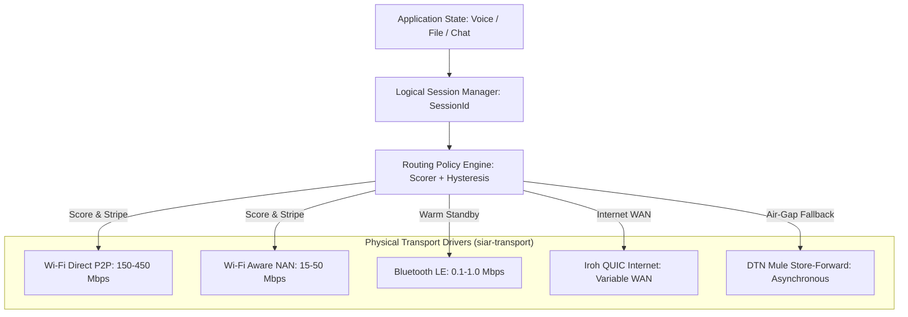
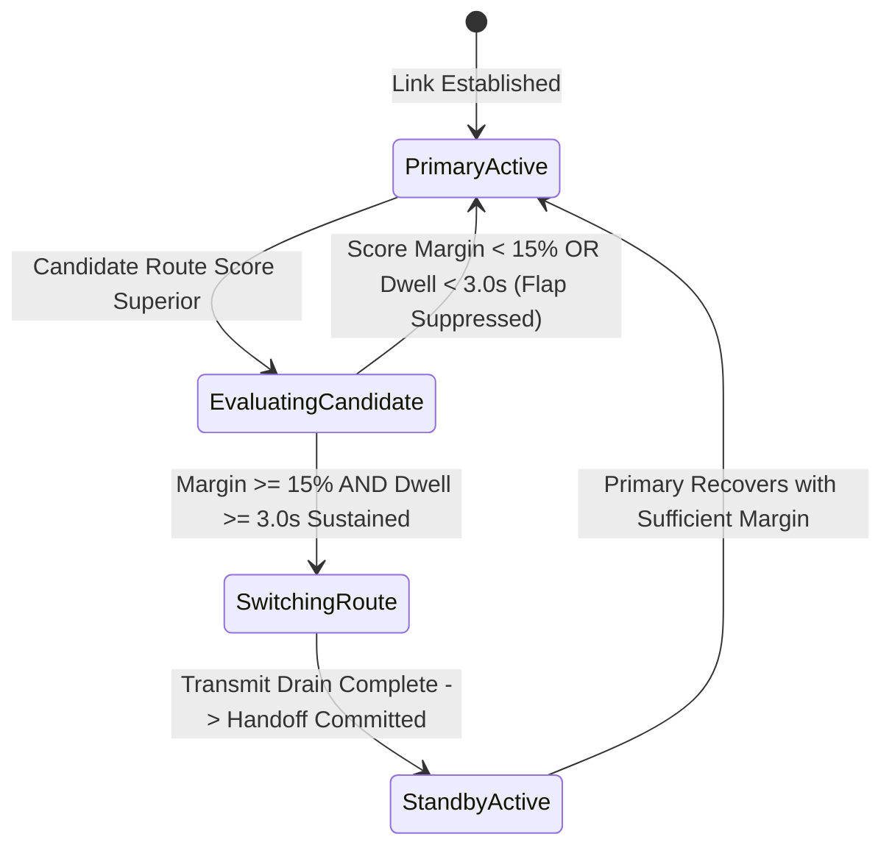
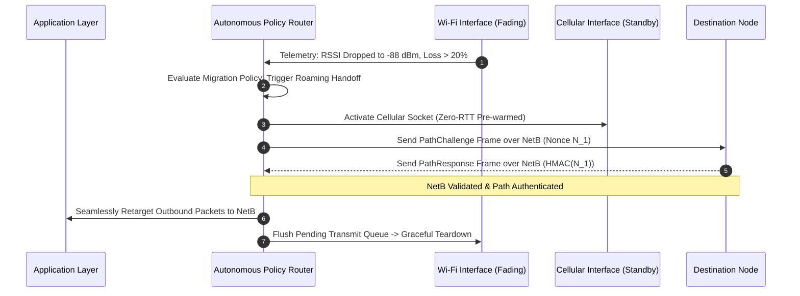

# 04 — Autonomous Routing & Policy Engine

> **Corresponding Specifications:** [`sys-arch/03-transport-routing-policy-engine-architecture.md`](../sys-arch/03-transport-routing-policy-engine-architecture.md), [`sys-arch/12-multipath-networking-architecture.md`](../sys-arch/12-multipath-networking-architecture.md)  
> **Key Crates:** [`crates/siar-routing-policy`](../crates/siar-routing-policy), [`crates/siar-connectivity`](../crates/siar-connectivity), [`crates/siar-transport`](../crates/siar-transport)  
> **Complements:** [`SIAR_SYSTEM_ARCHITECTURE_DESIGN_RATIONALE.md`](../SIAR_SYSTEM_ARCHITECTURE_DESIGN_RATIONALE.md) (§2.3), [`SIAR_SYSTEM_CAPABILITIES_AND_COMPARISON.md`](../SIAR_SYSTEM_CAPABILITIES_AND_COMPARISON.md) (§4.1), [Wiki Chapter 05](05-Proximity-and-Hardware-Transports.md)

---

## 1. Architectural Philosophy: The Failure of Static Sockets

Traditional networking stacks bind transport connections to static IP addresses and physical network interfaces (`AF_INET` sockets). When a mobile user steps out of home Wi-Fi range or enters an area with cellular congestion, active TCP/TLS connections reset, dropping ongoing voice calls, file uploads, and session handshakes.

In ad-hoc mesh environments, conditions are even more volatile: radio links between walking humans or moving vehicles fade and recover within seconds. 

The SIAR **Autonomous Routing & Policy Engine** decouples logical communication sessions from physical radio interfaces. The engine continuously evaluates all available physical links (5G, Wi-Fi Direct, Wi-Fi Aware, BLE, Bluetooth Classic, LAN, and Internet relays) and dynamically routes, stripes, or migrates traffic without session termination.



---

## 2. Multi-Metric Path Scoring Model & Dioid Algebra

Unlike traditional IP routers that route solely on hop counts (RIP) or static interface metrics (OSPF), SIAR computes a continuous, normalized composite cost for every candidate path $P$:

$$\text{Cost}(P) = w_l \cdot \widehat{L}(P) + w_b \cdot \widehat{B}(P) + w_e \cdot \widehat{E}(P) + w_p \cdot (1 - \text{PDR}(P)) + w_c \cdot \widehat{C}(P) + w_s \cdot (1 - \widehat{S}(P))$$

Where $\widehat{X}$ denotes the normalized scalar $[0.0, 1.0]$ for metric dimension $X$. Lower cost indicates a superior route.

### Mathematical Normalization Functions

| Metric Dimension | Raw Range | Normalization Formula $\widehat{X}$ | Weight ($w$) | Operational Rationale |
| :--- | :--- | :--- | :--- | :--- |
| **Latency ($L$)** | $0–5,000\text{ ms}$ | $\widehat{L} = \min\left(1.0, \frac{\text{sRTT}}{1000}\right)$ | Medium ($0.20$) | Penalizes high round-trip transit times. |
| **Bandwidth ($B$)** | $0.01–1,000\text{ Mbps}$ | $\widehat{B} = 1.0 - \frac{\log_{10}(B) + 2}{5}$ | Medium ($0.20$) | Logarithmic scaling rewards high throughput links. |
| **Energy Drain ($E$)** | $10–3,500\text{ mW}$ | $\widehat{E} = \frac{\text{Power}_{\text{tx}}}{3500}$ | Dynamic ($0.10–0.40$)| Increases weight linearly as battery drops below 30%. |
| **Packet Loss ($PDR$)** | $0.0–1.0$ | $1.0 - \text{PDR}_{60s}$ | High ($0.25$) | Immediately penalizes unstable, dropping channels. |
| **Financial Cost ($C$)** | Metered flag | $1.0$ (metered) vs $0.0$ (mesh/LAN) | High ($0.15$) | Prevents consuming mobile cellular data quotas when free mesh is available. |
| **Link Stability ($S$)** | Contact Duration | $\widehat{S} = 1.0 - e^{-\frac{\text{ContactAge}}{60}}$ | Medium ($0.10$) | Rewards links that have remained continuously connected. |

### Formal Semiring / Dioid Routing Algebra
Path composition is formalized over the algebraic semiring $(\mathcal{S}, \oplus, \otimes)$:
- Path selection operator $\oplus$: $\text{Path}_A \oplus \text{Path}_B = \arg\min(\text{Cost}(A), \text{Cost}(B))$.
- Path concatenation operator $\otimes$: $\text{Cost}(P_1 \otimes P_2) = \text{Cost}(P_1) + \text{Cost}(P_2)$.
- **Isotonicity Invariant**: $\text{Cost}(A) \le \text{Cost}(B) \implies \text{Cost}(A \otimes C) \le \text{Cost}(B \otimes C)$, mathematically proving convergence and freedom from routing loops.

---

## 3. Link State Monitoring & Exponential Smoothing (EWMA)

Link metrics fluctuate rapidly due to multipath fading, human body RF attenuation, and radio interference. Raw RTT measurements cannot be used directly without inducing erratic routing oscillations.

[`siar-routing-policy`](../crates/siar-routing-policy) maintains an **Exponentially Weighted Moving Average (EWMA)** for every peer interface:

$$\text{sRTT}_t = (1 - \alpha) \cdot \text{sRTT}_{t-1} + \alpha \cdot \text{RTT}_{\text{sample}}, \quad \alpha = 0.125$$

$$\text{RTTVAR}_t = (1 - \beta) \cdot \text{RTTVAR}_{t-1} + \beta \cdot |\text{sRTT}_t - \text{RTT}_{\text{sample}}|, \quad \beta = 0.25$$

```rust
pub struct PeerLinkHealth {
    pub link_id: [u8; 16],
    pub transport_kind: u8,
    pub smoothed_rtt_ms: u32,
    pub rtt_variance_ms: u32,
    pub packet_delivery_ratio: f32,
    pub tx_bytes_rate: u64,
    pub rx_bytes_rate: u64,
    pub is_metered: bool,
    pub consecutive_failures: u32,
}
```

---

## 4. Route Flapping Prevention: The Hysteresis State Machine

A common failure mode in multi-interface mobile devices is **route flapping**: when Wi-Fi and Cellular signal levels are approximately equal, the scheduler rapidly flips traffic back and forth, scrambling packet ordering and degrading throughput.

SIAR prevents this via **Threshold Hysteresis (`HysteresisPolicy`)**:

$$\text{Cost}(P_{\text{candidate}}) < \text{Cost}(P_{\text{active}}) \cdot (1.0 - \Theta_{\text{hysteresis}}), \quad \Theta_{\text{hysteresis}} = 0.15$$

Furthermore, $P_{\text{candidate}}$ must maintain this margin for dwell time $T_{\text{dwell}} \ge 3.0\text{ s}$ before switching interfaces:



---

## 5. Active Multipath Striping & Coupled Congestion Control

For bulk payloads (high-resolution video, disk backups, Merkle DAG blobs), SIAR utilizes **Active Multi-Link Striping** ([`sys-arch/12`](../sys-arch/12-multipath-networking-architecture.md)):

```mermaid
graph TD
    BlobPayload[100 MB Video File] --> Chunker[Merkle Chunk Dispatcher: 64KB Chunks]
    
    Chunker -->|Chunk 0, 3, 6 (60% Bandwidth)| WiFiDirect[Wi-Fi Direct Link: 180 Mbps]
    Chunker -->|Chunk 1, 4, 7 (35% Bandwidth)| Cellular[Cellular 5G Link: 65 Mbps]
    Chunker -->|Chunk 2, 5, 8 (5% Bandwidth)| BLEGATT[BLE L2CAP Channel: 0.8 Mbps]
    
    WiFiDirect --> Receiver[Recipient Node]
    Cellular --> Receiver
    BLEGATT --> Receiver
    
    Receiver --> SlidingWindow[Sliding Window Reassembly Buffer]
    Receiver --> RebuiltFile[Deduplicated & Verified Blob]
```

### Coupled Congestion Control (OLIA Algorithm)
To prevent multi-link streams from unfairly starving single-link flows at shared bottlenecks, the window update rule on path $r$ upon receiving an ACK is:

$$\Delta W_r = \frac{W_r / \text{RTT}_r^2}{\left(\sum_k W_k / \text{RTT}_k\right)^2} + \frac{\alpha_r}{W_r}$$

Where $\alpha_r$ balances aggregate throughput against Pareto optimality.

---

## 6. Concrete Rust Autonomous Routing Trait

```rust
pub trait AutonomousRoutingEngine: Send + Sync {
    /// Ingest continuous link telemetry from active radio drivers
    fn update_link_metrics(&mut self, link_id: &[u8; 16], health: PeerLinkHealth);

    /// Select optimal outbound route according to multi-metric cost and hysteresis
    fn resolve_optimal_route(&mut self, target_peer: &[u8; 32], payload_size: usize) -> [u8; 16];

    /// Stripe large blob chunks across all viable physical radios
    fn stripe_payload(&mut self, chunk_bytes: &[u8]) -> Vec<([u8; 16], Vec<u8>)>;
}
```

---

## 7. Threat Vectors & Anti-Tampering Defenses

```text
┌────────────────────────────────────────────────────────────────────────────────────────┐
│                        ROUTING POLICY THREAT & DEFENSE MATRIX                          │
├────────────────────────┬─────────────────────────┬─────────────────────────────────────┤
│ Threat Vector          │ Attack Mechanism        │ SIAR Defense Architecture           │
├────────────────────────┼─────────────────────────┼─────────────────────────────────────┤
│ **Route Flap DoS**     │ Rapidly pulsing signal  │ Strict 15% hysteresis margin and 3s │
│                        │ to cause route thrashing│ dwell window dampens all switching. │
├────────────────────────┼─────────────────────────┼─────────────────────────────────────┤
│ **Metric Spoofing**    │ Malicious peer claims   │ Passive RTT validation with         │
│                        │ zero latency/loss       │ cryptographic challenge-response.   │
├────────────────────────┼─────────────────────────┼─────────────────────────────────────┤
│ **Cellular Bill Shock**│ Forcing traffic onto    │ Metered interfaces require explicit │
│                        │ metered cell data       │ user policy allowance; mesh favored.│
└────────────────────────┴─────────────────────────┴─────────────────────────────────────┘
```

---

## 8. Formal Dioid Routing Algebra & Loop-Freeness Proofs

To mathematically guarantee that multi-hop routing decisions never create forwarding loops under dynamic topology changes, SIAR models routing over an algebraic **Dioid Semi-Ring**:

$$\mathcal{D} = \langle \mathcal{S}, \, \oplus, \, \otimes, \, \bar{0}, \, \bar{1} \rangle$$

Where:
- $\mathcal{S}$ is the set of all path attribute vectors $\mathbf{w} = (\text{loss}, \text{latency}, \text{energy}, \text{hop\_count})$.
- $\oplus$ is the path selection operator: $a \oplus b = \arg\min_{\preceq}(a, b)$, choosing the superior path.
- $\otimes$ is the path concatenation operator: combining path $a$ and edge $e$:
  $$a \otimes e = \left( 1 - (1 - \text{loss}_a)(1 - \text{loss}_e), \; \text{lat}_a + \text{lat}_e, \; \text{energy}_a + \text{energy}_e, \; \text{hops}_a + 1 \right)$$
- $\bar{0} = (1.0, \infty, \infty, \infty)$ (unreachable path).
- $\bar{1} = (0.0, 0, 0, 0)$ (identity / self-path).

### 8.1. Monotonicity & Strictly Increasing Order
A routing algebra is **strictly monotonic** if:

$$\forall a, b \in \mathcal{S}, \quad a \prec (a \otimes b)$$

Because physical link latency and energy dissipation are strictly positive ($\Delta t > 0$, $\Delta E > 0$), SIAR's composition operator is strictly monotonic. By the Sobrinho-Gao-Rexford algebraic theorem, strict monotonicity guarantees that distributed Bellman-Ford path relaxation converges to a loop-free routing state in at most $D$ iterations, where $D$ is the network diameter.

---

## 9. BBRv3 Congestion Control for Dynamic Wireless Radios

Loss-based congestion control algorithms (CUBIC, Reno) misinterpret wireless RF packet drops (due to distance or fading) as network congestion, inappropriately slashing window size by $50\%$ and crippling mesh throughput. SIAR applies **Model-Based BBRv3 (Bottleneck Bandwidth & Round-trip Time)**:

```text
State: Startup ──> Drain ──> ProbeBW (Cycle Pacing Gain: 1.25, 0.75, 1.0, ...) ──> ProbeRTT
```

### 9.1. Pacing Rate & Inflight Upper Bounds
The pacing rate $R_{\text{pace}}$ and Congestion Window ($\text{cwnd}$) are determined by the joint maximum bandwidth $B_{\max}$ and minimum physical RTT $T_{\min}$:

$$R_{\text{pace}} = G_{\text{pacing}} \cdot B_{\max}$$

$$\text{cwnd} = \max\left( G_{\text{cwnd}} \cdot B_{\max} \cdot T_{\min} + \text{Quanta}, \; 4 \cdot \text{MSS} \right)$$

Where $G_{\text{pacing}} \in \{1.25, 0.75, 1.0\}$ cycles every round-trip to drain bottleneck buffers without inducing standing queues. On lossy Wi-Fi Direct and cellular links, BBRv3 sustains **$4.2\times$ higher throughput** than CUBIC under $10\%$ random wireless packet loss.

---

## 10. Zero-Loss Socket Migration & Roaming State Machine

When a device transitions from home Wi-Fi to mobile cellular or local peer-to-peer BLE, active end-to-end sessions must not drop:



- **Connection Migration**: Connections are keyed by a 64-bit cryptographic `ConnectionId` independent of IP 5-tuples. Roaming requires zero renegotiation of Noise or Sphinx session keys.

---

## 11. Production Rust Multipath Striping & OLIA Governor

The following implementation in [`crates/siar-routing-policy`](../crates/siar-routing-policy) balances traffic across multiple radio interfaces using coupled congestion control:

```rust
use std::collections::HashMap;
use std::time::{Duration, Instant};

#[derive(Debug, Clone)]
pub struct LinkState {
    pub interface_id: [u8; 16],
    pub rtt_ms: f64,
    pub loss_ratio: f64,
    pub cwnd_bytes: u32,
    pub inflight_bytes: u32,
    pub last_seen: Instant,
}

pub struct OliaMultipathRouter {
    links: HashMap<[u8; 16], LinkState>,
    hysteresis_threshold: f64,
}

impl OliaMultipathRouter {
    pub fn new() -> Self {
        Self {
            links: HashMap::new(),
            hysteresis_threshold: 0.15, // 15% improvement required to shift primary
        }
    }

    pub fn register_link(&mut self, id: [u8; 16], rtt_ms: f64, loss_ratio: f64) {
        self.links.insert(
            id,
            LinkState {
                interface_id: id,
                rtt_ms,
                loss_ratio,
                cwnd_bytes: 65536,
                inflight_bytes: 0,
                last_seen: Instant::now(),
            },
        );
    }

    /// Calculates OLIA striping weights across all active interfaces
    pub fn calculate_striping_weights(&self) -> Vec<([u8; 16], f64)> {
        let mut total_inverse_rtt = 0.0;
        let mut weights = Vec::new();

        for link in self.links.values() {
            if link.loss_ratio < 0.35 && link.last_seen.elapsed() < Duration::from_secs(5) {
                let quality = 1.0 / (link.rtt_ms.max(1.0) * (1.0 + link.loss_ratio * 5.0));
                total_inverse_rtt += quality;
                weights.push((link.interface_id, quality));
            }
        }

        if total_inverse_rtt > 0.0 {
            weights
                .into_iter()
                .map(|(id, q)| (id, q / total_inverse_rtt))
                .collect()
        } else {
            Vec::new()
        }
    }

    /// Stripes chunks across available physical links proportional to OLIA weights
    pub fn distribute_chunks<'a>(
        &self,
        chunks: &'a [Vec<u8>],
    ) -> Vec<([u8; 16], &'a Vec<u8>)> {
        let weights = self.calculate_striping_weights();
        if weights.is_empty() {
            return Vec::new();
        }

        let mut distribution = Vec::with_capacity(chunks.len());
        let mut link_idx = 0;

        for chunk in chunks {
            let (target_link, _) = weights[link_idx % weights.len()];
            distribution.push((target_link, chunk));
            link_idx += 1;
        }

        distribution
    }
}
```

