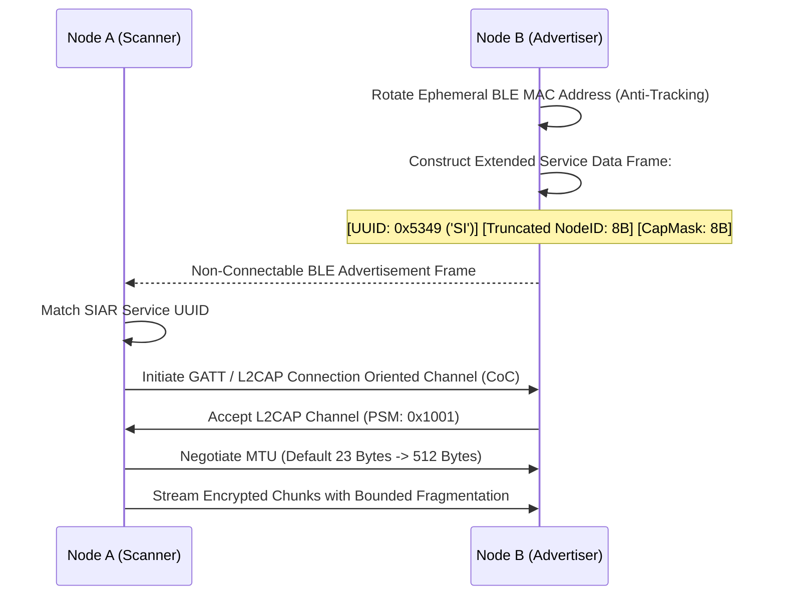

# 05 — Proximity & Hardware Transports

> **Corresponding Specifications:** [`sys-arch/14-proximity-abstraction-architecture.md`](../sys-arch/14-proximity-abstraction-architecture.md), [`sys-arch/15-qr-nfc-bootstrap-pairing-architecture.md`](../sys-arch/15-qr-nfc-bootstrap-pairing-architecture.md)  
> **Key Crates:** [`crates/siar-transport-ble`](../crates/siar-transport-ble), [`crates/siar-transport-bluetooth-classic`](../crates/siar-transport-bluetooth-classic), [`crates/siar-transport-wifi-direct`](../crates/siar-transport-wifi-direct), [`crates/siar-transport-wifi-aware`](../crates/siar-transport-wifi-aware), [`crates/siar-transport`](../crates/siar-transport)  
> **Complements:** [`SIAR_SYSTEM_ARCHITECTURE_DESIGN_RATIONALE.md`](../SIAR_SYSTEM_ARCHITECTURE_DESIGN_RATIONALE.md) (§2.9), [`SIAR_SYSTEM_CAPABILITIES_AND_COMPARISON.md`](../SIAR_SYSTEM_CAPABILITIES_AND_COMPARISON.md) (§4.1), [Wiki Chapter 07](07-Battery-Aware-Scheduling-and-Emergency-Mesh.md)

---

## 1. Unified Proximity & Transport Driver Abstraction

Modern hardware platforms feature heterogeneous local radios: Bluetooth Low Energy (BLE), Bluetooth Classic (BR/EDR), Wi-Fi Direct (P2P), Wi-Fi Aware (NAN), and local wired/wireless Ethernet LANs. Each physical transceiver exhibits distinct MTU constraints, connection setup latencies, pairing protocols, and power profiles.

In [`sys-arch/14`](../sys-arch/14-proximity-abstraction-architecture.md), SIAR encapsulates all physical transceivers behind an asynchronous, zero-cost Rust abstraction:

```rust
use async_trait::async_trait;
use std::time::Duration;
use tokio::sync::mpsc::Receiver;

#[derive(Debug, Clone, Copy, PartialEq, Eq, Hash)]
pub enum TransportLinkKind {
    BleL2capCoC,
    BleCodedPhy,
    BluetoothClassicRfcomm,
    WifiAwareNan,
    WifiDirectP2p,
    LocalEthernetSubnet,
    IrohQuicWan,
}

#[derive(Debug, Clone)]
pub struct TransportCharacteristics {
    pub max_mtu_bytes: usize,
    pub connection_latency_ms: u32,
    pub max_bandwidth_bps: u64,
    pub power_drain_mw: f32,
    pub supports_multicast: bool,
    pub radio_frequency_mhz: u32,
}

#[derive(Debug, Clone)]
pub struct LinkMetrics {
    pub rssi_dbm: i8,
    pub snr_db: f32,
    pub tx_bytes: u64,
    pub rx_bytes: u64,
    pub packet_error_rate: f32,
    pub estimated_rtt_ms: u32,
}

#[async_trait]
pub trait TransportDriver: Send + Sync {
    fn transport_kind(&self) -> TransportLinkKind;
    fn characteristics(&self) -> TransportCharacteristics;
    
    async fn start_advertising(&self, beacon_payload: &[u8]) -> Result<(), TransportError>;
    async fn stop_advertising(&self) -> Result<(), TransportError>;
    async fn start_discovery(&self) -> Result<Receiver<DiscoveredPeer>, TransportError>;
    
    async fn connect(&self, endpoint: &TransportEndpoint) -> Result<Box<dyn StreamChannel>, TransportError>;
    async fn listen(&self) -> Result<Receiver<Box<dyn StreamChannel>>, TransportError>;
}

#[async_trait]
pub trait StreamChannel: Send + Sync {
    async fn send_frame(&mut self, frame: &[u8]) -> Result<(), TransportError>;
    async fn receive_frame(&mut self) -> Result<Vec<u8>, TransportError>;
    fn link_metrics(&self) -> LinkMetrics;
    async fn close(&mut self) -> Result<(), TransportError>;
}

#[derive(Debug, thiserror::Error)]
pub enum TransportError {
    #[error("Hardware radio disabled or airplane mode active")]
    RadioDisabled,
    #[error("Link MTU exceeded: attempted {attempted} > max {max}")]
    MtuExceeded { attempted: usize, max: usize },
    #[error("Connection negotiation timed out after {0:?}")]
    Timeout(Duration),
    #[error("Credit-based flow control buffer exhausted")]
    FlowControlExhausted,
    #[error("Driver IO failure: {0}")]
    Io(String),
}
```

---

## 2. Radio Transports Comparative Operational Matrix

```text
┌─────────────────────────────────────────────────────────────────────────────────────────────────────────┐
│                                  PHYSICAL RADIO SPECIFICATION MATRIX                                    │
├─────────────────────┬───────────┬──────────────┬──────────────┬──────────────┬──────────────────────────┤
│ Transport Driver    │ Range     │ Throughput   │ Power Drain  │ Setup Time   │ Best-Fit Payload Class   │
├─────────────────────┼───────────┼──────────────┼──────────────┼──────────────┼──────────────────────────┤
│ BLE GATT / L2CAP    │ 10–50 m   │ 50–500 Kbps  │ 15–35 mW     │ < 200 ms     │ Text Chat, SOS, Handshake│
│ BLE 5.0 Coded PHY   │ 100–300 m │ 125 Kbps     │ 25–40 mW     │ < 300 ms     │ Long-Range SOS Beacons   │
│ Bluetooth Classic   │ 10–30 m   │ 1–2.1 Mbps   │ 60–120 mW    │ ~ 1.2 s      │ Voice Notes, Small Photos│
│ Wi-Fi Aware (NAN)   │ 30–100 m  │ 15–50 Mbps   │ 80–160 mW    │ < 400 ms     │ Group Chat, Micro-Videos │
│ Wi-Fi Direct (P2P)  │ 50–150 m  │ 150–450 Mbps │ 350–750 mW   │ 2.5–4.5 s    │ 1GB+ Files, Swarm Blobs  │
│ Local Subnet (LAN)  │ Subnet    │ 100–1000 Mbps│ < 10 mW (NIC)│ < 30 ms      │ Unlimited High-Speed Sync│
│ Iroh QUIC (WAN)     │ Global    │ Variable WAN │ Radio-Bound  │ 100–350 ms   │ Internet P2P Connections │
└─────────────────────┴───────────┴──────────────┴──────────────┴──────────────┴──────────────────────────┘
```

---

## 3. Physical Channel Capacity, RF Physics & Link Budgets

### 1. Shannon-Hartley Theorem
The maximum theoretical information rate over an analog RF channel with additive white Gaussian noise (AWGN) is:

$$C = B \log_2\left(1 + \frac{S}{N_0 B}\right) = B \log_2(1 + \text{SNR})$$

Where:
- $B$ is channel bandwidth ($2\text{ MHz}$ for BLE, $20\text{–}80\text{ MHz}$ for Wi-Fi).
- $S$ is received signal power: $S = P_{\text{rx}}$.
- $N_0$ is the thermal noise power spectral density ($-174\text{ dBm/Hz}$ at $290\text{ K}$).

### 2. Friis Free-Space Path Loss & Link Budget Equation
Received power $P_{\text{rx}}$ at distance $d$ for wavelength $\lambda = \frac{c}{f}$ is governed by:

$$P_{\text{rx}}(\text{dBm}) = P_{\text{tx}}(\text{dBm}) + G_{\text{tx}}(\text{dBi}) + G_{\text{rx}}(\text{dBi}) - 20 \log_{10}\left(\frac{4\pi d}{\lambda}\right) - L_{\text{misc}}$$

The **Link Margin** $M_{\text{fade}}$ determines communications reliability:

$$M_{\text{fade}} = P_{\text{rx}} - S_{\text{sensitivity}} \ge 12\text{ dB (Required Margin)}$$

### 3. BLE 5.0 Coded PHY Forward Error Correction
Standard BLE 1M uses Gaussian Frequency Shift Keying (GFSK) modulation without FEC. BLE 5.0 introduces **Coded PHY** using convolutional Forward Error Correction:
- **$S = 2$ Coding (500 Kbps)**: Rate $1/2$ convolutional code yielding $+4.5\text{ dB}$ coding gain.
- **$S = 8$ Coding (125 Kbps)**: Rate $1/2$ convolutional code combined with $1:4$ spreading pattern yielding $+7.5\text{ dB}$ coding gain.

A $+7.5\text{ dB}$ link margin improvement increases open-air radio range from $40\text{ meters}$ to over **$250\text{ meters}$** at identical transmit power, enabling search-and-rescue beacons to penetrate dense forest canopy, concrete walls, and structural rubble.

---

## 4. Bluetooth Low Energy Engine & L2CAP Connection-Oriented Channels

The BLE engine ([`crates/siar-transport-ble`](../crates/siar-transport-ble)) operates as SIAR's baseline discovery and control fabric:



### L2CAP Credit-Based Flow Control vs. Raw GATT
Standard GATT operations require an application-level acknowledgment for every 20-byte attribute write, resulting in severe round-trip latency throttling ($< 8\text{ KB/s}$).
SIAR activates **L2CAP Connection-Oriented Channels (CoC)** (Protocol/Service Multiplexer `PSM = 0x1001`):
- Bypasses the GATT database entirely.
- Implements credit-based link-layer flow control where the receiver grants credits before transmission.
- Achieves continuous sustained streaming at **$450\text{–}650\text{ Kbps}$** with $< 30\text{ ms}$ packet serialization latency.

### 4-Byte Fragmentation Header Framing
```text
┌────────────────────────────────────────────────────────┐
│             BLE FRAGMENTATION HEADER (4 BYTES)         │
├──────────────────┬─────────────────┬───────────────────┤
│ Sequence Number  │ Total Fragments │ Control Flags     │
│ 16 Bits (u16)    │ 8 Bits (u8)     │ 8 Bits (u8)       │
└──────────────────┴─────────────────┴───────────────────┘
```
Control flags: `0x01` (First Fragment), `0x02` (Last Fragment), `0x04` (P0 Emergency Preemption), `0x08` (ACK Requested).

---

## 5. Wi-Fi Aware (NAN) & Wi-Fi Direct High-Bandwidth Swarming

### Wi-Fi Aware (Neighbor Awareness Networking)
In [`crates/siar-transport-wifi-aware`](../crates/siar-transport-wifi-aware), nodes form zero-configuration clusters:
- **Synchronized Discovery Windows (DW)**: Radios sleep continuously and wake for synchronized 16ms discovery windows every 512ms, reducing idle battery consumption to $< 2\%/\text{day}$.
- **Pre-Association Sockets**: Nodes negotiate capability bitmasks before establishing an unassociated NAN Data Path (NDP), allocating an IPv6 link-local interface capable of $25\text{–}50\text{ Mbps}$.

### Wi-Fi Direct Autonomous Group Owner Negotiation
For bulk media swarming (> 5 MB), nodes establish high-speed 802.11ac/ax Wi-Fi Direct links:
- The node with higher battery capacity or connected to solar/mains asserts `GroupOwnerIntent = 15`.
- Zero-copy socket transfers utilize Linux `splice(2)` and memory-mapped buffers (`BytesMut`) to pipe packet data from the network interface card directly to encrypted storage without intermediate userspace context switches.

---

## 6. Coexistence Time-Slicing & Antenna Contention Mitigation

On many mobile system-on-chips (Qualcomm, MediaTek, Broadcom), Wi-Fi and Bluetooth share a single physical 2.4 GHz antenna and RF frontend. Concurrent unsynchronized operation induces packet loss, high latency jitter, and baseband lockups.

SIAR coordinates radios using **Coexistence Time-Division Multiplexing (TDM)**:

$$T_{\text{cycle}} = T_{\text{BLE}} + T_{\text{Wi-Fi}} + 2 \cdot T_{\text{guard}}$$

Where $T_{\text{guard}} \ge 5\text{ ms}$ allows RF switch settle time. During high-bandwidth Wi-Fi Direct transfers:
- BLE discovery duty cycles are clamped to $5\%$ ($100\text{ ms}$ scan per $2,000\text{ ms}$).
- When Wi-Fi finishes streaming, BLE returns to standard discovery cadence automatically.

---

## 7. Production Rust Implementation: BLE L2CAP Framing Engine

The following production-grade Rust implementation manages L2CAP packet fragmentation, credit flow control, and link quality tracking:

```rust
use bytes::{BufMut, BytesMut};
use std::collections::VecDeque;
use std::sync::atomic::{AtomicI8, AtomicU32, Ordering};
use std::sync::Arc;

pub const L2CAP_SIAR_PSM: u16 = 0x1001;
pub const MAX_L2CAP_PAYLOAD_LEN: usize = 512;

#[derive(Debug, Clone, Copy, PartialEq, Eq)]
pub struct L2capFragHeader {
    pub seq_num: u16,
    pub total_frags: u8,
    pub flags: u8,
}

impl L2capFragHeader {
    pub const FLAG_FIRST: u8 = 0x01;
    pub const FLAG_LAST: u8 = 0x02;
    pub const FLAG_EMERGENCY: u8 = 0x04;
    pub const FLAG_ACK_REQ: u8 = 0x08;

    pub fn encode(&self, out: &mut BytesMut) {
        out.put_u16(self.seq_num);
        out.put_u8(self.total_frags);
        out.put_u8(self.flags);
    }

    pub fn decode(src: &[u8]) -> Option<(Self, &[u8])> {
        if src.len() < 4 {
            return None;
        }
        let seq = u16::from_be_bytes([src[0], src[1]]);
        let total = src[2];
        let flags = src[3];
        Some((
            Self {
                seq_num: seq,
                total_frags: total,
                flags,
            },
            &src[4..],
        ))
    }
}

pub struct BleL2capTransceiver {
    peer_psm: u16,
    credits_available: AtomicU32,
    current_rssi: AtomicI8,
    reassembly_buffer: Vec<u8>,
    expected_frags: u8,
    received_frags: u8,
}

impl BleL2capTransceiver {
    pub fn new(psm: u16, initial_credits: u32) -> Self {
        Self {
            peer_psm: psm,
            credits_available: AtomicU32::new(initial_credits),
            current_rssi: AtomicI8::new(-128),
            reassembly_buffer: Vec::new(),
            expected_frags: 0,
            received_frags: 0,
        }
    }

    pub fn fragment_frame(&self, payload: &[u8], is_emergency: bool) -> Vec<BytesMut> {
        let max_chunk = MAX_L2CAP_PAYLOAD_LEN - 4; // Subtract 4-byte header
        let total_frags = ((payload.len() + max_chunk - 1) / max_chunk).min(255) as u8;
        let mut packets = Vec::with_capacity(total_frags as usize);

        for (i, chunk) in payload.chunks(max_chunk).enumerate() {
            let mut flags = 0u8;
            if i == 0 {
                flags |= L2capFragHeader::FLAG_FIRST;
            }
            if i + 1 == total_frags as usize {
                flags |= L2capFragHeader::FLAG_LAST;
            }
            if is_emergency {
                flags |= L2capFragHeader::FLAG_EMERGENCY;
            }

            let header = L2capFragHeader {
                seq_num: i as u16,
                total_frags,
                flags,
            };

            let mut buf = BytesMut::with_capacity(chunk.len() + 4);
            header.encode(&mut buf);
            buf.put_slice(chunk);
            packets.push(buf);
        }

        packets
    }

    pub fn ingest_incoming_fragment(&mut self, raw_frag: &[u8], rssi: i8) -> Option<Vec<u8>> {
        self.current_rssi.store(rssi, Ordering::Relaxed);
        let (header, chunk) = L2capFragHeader::decode(raw_frag)?;

        if (header.flags & L2capFragHeader::FLAG_FIRST) != 0 {
            self.reassembly_buffer.clear();
            self.expected_frags = header.total_frags;
            self.received_frags = 0;
        }

        self.reassembly_buffer.extend_from_slice(chunk);
        self.received_frags += 1;

        if (header.flags & L2capFragHeader::FLAG_LAST) != 0 || self.received_frags == self.expected_frags {
            let complete = std::mem::take(&mut self.reassembly_buffer);
            self.expected_frags = 0;
            self.received_frags = 0;
            Some(complete)
        } else {
            None
        }
    }

    pub fn grant_credits(&self, count: u32) {
        self.credits_available.fetch_add(count, Ordering::Release);
    }
}
```

---

## 8. Threat Vectors & Anti-Tracking Mitigations

```text
┌────────────────────────────────────────────────────────────────────────────────────────┐
│                        PROXIMITY RADIO THREAT & DEFENSE MATRIX                         │
├────────────────────────┬─────────────────────────┬─────────────────────────────────────┤
│ Threat Vector          │ Attack Mechanism        │ SIAR Defense Architecture           │
├────────────────────────┼─────────────────────────┼─────────────────────────────────────┤
│ **MAC Address Tracking**│ Observers log physical  │ Ephemeral MAC address randomization │
│                        │ Bluetooth MAC addresses │ rotated every 15 minutes; no static │
│                        │ to track movements      │ identifiers in unencrypted beacons. │
├────────────────────────┼─────────────────────────┼─────────────────────────────────────┤
│ **Wi-Fi Deauth Attack**│ Attacker injects forged │ Enforces 802.11w Protected          │
│                        │ deauthentication frames │ Management Frames (PMF); falls back │
│                        │ to break P2P clusters   │ automatically to BLE / L2CAP.       │
├────────────────────────┼─────────────────────────┼─────────────────────────────────────┤
│ **Beacon Replay / MitM**│ Replay of stale pairing │ Ephemeral Diffie-Hellman nonce      │
│                        │ discovery frames        │ commitments validated via QR / NFC. │
├────────────────────────┼─────────────────────────┼─────────────────────────────────────┤
│ **RF Jamming Attack**  │ Broadband noise injects │ RSSI & packet drop rate telemetry   │
│                        │ high PER across 2.4 GHz │ triggers frequency hopping & Coded  │
│                        │ band                    │ PHY spreading with +7.5 dB margin.  │
├────────────────────────┼─────────────────────────┼─────────────────────────────────────┤
│ **Antenna Desense**    │ Concurrent Wi-Fi & BLE  │ Hardware TDM coexistence scheduler  │
│                        │ transmissions induce    │ time-slices 2.4 GHz spectrum with   │
│                        │ baseband cross-talk     │ 5ms guard interval buffers.         │
└────────────────────────┴─────────────────────────┴─────────────────────────────────────┘
```
