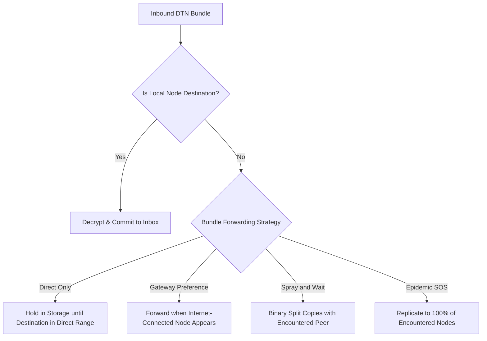

# 06 — Delay-Tolerant Networking & Bundle Forwarding

> **Corresponding Specifications:** [`sys-arch/06-dtn-store-carry-forward-architecture.md`](../sys-arch/06-dtn-store-carry-forward-architecture.md)  
> **Key Crates:** [`crates/siar-dtn-bundle`](../crates/siar-dtn-bundle), [`crates/siar-dtn`](../crates/siar-dtn), [`crates/siar-storage`](../crates/siar-storage)

---

## 1. Store-Carry-Forward Dissemination Model

When two nodes are physically partitioned with no direct radio path and no Internet relay, SIAR utilizes **Delay-Tolerant Networking (DTN)**. Any participating device (or solar-powered repeater) acts as a physical data mule:

```
[Sender Alice] 
      |  (BLE / Wi-Fi direct transfer)
      v
[Carrier Mule Bob]  ==== (Bob walks/drives 5 km) ====> [Carrier Mule Bob]
                                                               |  (Radio transfer)
                                                               v
                                                      [Recipient Charlie]
```

---

## 2. Bundle Wire Structure

Bundles are immutable, self-contained protocol units encapsulated with forwarding metadata:

```rust
pub struct DtnBundle {
    pub bundle_id: BundleId,               // BLAKE3 hash of payload + header
    pub source: AccountId,                 // Originating identity
    pub destination: BundleDestination,    // Unicast(AccountId) or Broadcast(TopicId)
    pub created_at: Timestamp,             // Unix timestamp
    pub expires_at: Timestamp,             // TTL expiration time
    pub hop_limit: u8,                     // Decremented at each hop
    pub spray_copies: u8,                  // Remaining spray copies for binary spray
    pub custody_requested: bool,           // Hop-by-hop custody transfer flag
    pub priority: BundlePriority,          // Emergency, High, Normal, Background
    pub payload_blob_id: BlobId,           // Encrypted Merkle root
    pub signature: Signature,              // Originator Ed25519 signature
}
```

---

## 3. Forwarding Strategy Engine

Implemented in [`siar-dtn-bundle`](../crates/siar-dtn-bundle), the forwarding engine selects the optimal routing policy based on bundle priority and network density:



### Spray-and-Wait Algorithm (Binary Spraying)
1. **Spray Phase**: The sender initializes the bundle with $L$ copies (e.g., $L = 8$).
2. When the carrier encounters a new node $M$ that does not have the bundle:
   - The carrier gives $\lfloor L / 2 \rfloor$ copies to node $M$.
   - The carrier retains $\lceil L / 2 \rceil$ copies.
3. **Wait Phase**: When $L = 1$, the node will only transmit the bundle directly to the final destination.
4. **Outcome**: Achieves delivery delays comparable to Epidemic routing while consuming only a tiny fraction of total network transmissions.

---

## 4. Custody Transfer & Anti-Entropy Receipts

To guarantee delivery without accumulating unbounded bundle duplicates across the mesh:
1. **Custody Acceptance**: When an intermediate mule accepts custody of a bundle, it sends a signed `CustodyReceipt` back to the forwarder.
2. **Release of Responsibility**: The forwarder can now safely prune the bundle from its high-priority storage.
3. **Delivery Tombstones**: When the destination node receives and decrypts the bundle, it emits a `DeliveryTombstone`. As the tombstone gossips across the mesh, mules purge the corresponding bundle from local cache.
