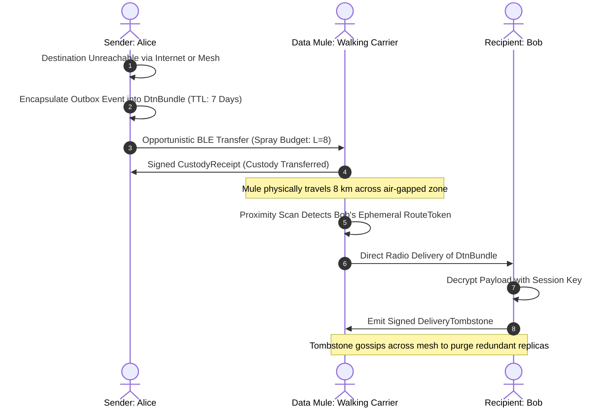
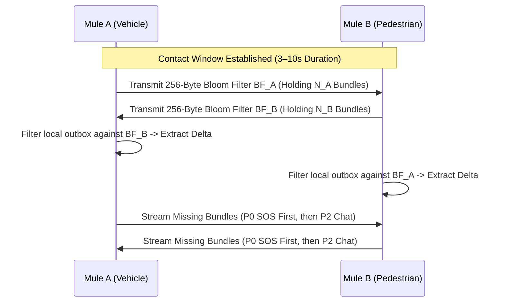

# 06 — Delay-Tolerant Networking & Bundle Forwarding

> **Corresponding Specifications:** [`sys-arch/06-dtn-store-carry-forward-architecture.md`](../sys-arch/06-dtn-store-carry-forward-architecture.md), [`sys-arch/08-resource-limits-backpressure-architecture.md`](../sys-arch/08-resource-limits-backpressure-architecture.md)  
> **Key Crates:** [`crates/siar-dtn-bundle`](../crates/siar-dtn-bundle), [`crates/siar-storage`](../crates/siar-storage)  
> **Complements:** [`SIAR_SYSTEM_ARCHITECTURE_DESIGN_RATIONALE.md`](../SIAR_SYSTEM_ARCHITECTURE_DESIGN_RATIONALE.md) (§2.6), [`SIAR_SYSTEM_CAPABILITIES_AND_COMPARISON.md`](../SIAR_SYSTEM_CAPABILITIES_AND_COMPARISON.md) (§4.1), [Wiki Chapter 07](07-Battery-Aware-Scheduling-and-Emergency-Mesh.md)

---

## 1. Store-Carry-Forward Dissemination Model

In catastrophic blackouts, off-grid expeditions, or maritime operations, a continuous end-to-end network path between sender and receiver may never exist concurrently. Two devices may be separated by kilometers of wilderness, collapsed cellular infrastructure, or strict physical air gaps.

SIAR solves this through **Delay-Tolerant Networking (DTN)** ([`sys-arch/06`](../sys-arch/06-dtn-store-carry-forward-architecture.md)):
- Messages, encrypted voice notes, and emergency beacons are packaged into autonomous, immutable **DTN Bundles**.
- Any participating smartphone, solar repeater box ([`apps/emergency-node`](../apps/emergency-node)), or vehicle acts as a **Data Mule**: storing encrypted bundles in flash storage, physically carrying them across geographic space, and opportunistically transferring them to encountered nodes over Bluetooth LE or Wi-Fi Direct.


```mermaid
sequenceDiagram
    autonumber
    actor Alice as Sender: Alice
    actor Mule as Data Mule: Walking Carrier
    actor Bob as Recipient: Bob

    Alice->>Alice: Destination Unreachable via Internet or Mesh
    Alice->>Alice: Encapsulate Outbox Event into DtnBundle (TTL: 7 Days)
    Alice->>Mule: Opportunistic BLE Transfer (Spray Budget: L=8)
    Mule->>Alice: Signed CustodyReceipt (Custody Transferred)
    Note over Mule: Mule physically travels 8 km across air-gapped zone
    Mule->>Mule: Proximity Scan Detects Bob's Ephemeral RouteToken
    Mule->>Bob: Direct Radio Delivery of DtnBundle
    Bob->>Bob: Decrypt Payload with Session Key
    Bob->>Mule: Emit Signed DeliveryTombstone
    Note over Mule,Bob: Tombstone gossips across mesh to purge redundant replicas
```

---

## 2. Bundle Wire Structure & Zero-Copy Framing

To protect metadata privacy while traversing untrusted intermediate mules, bundles mask author and recipient identities using rotating, unlinkable route tokens derived from ephemeral VRF tags. Payloads are mapped into zero-copy rkyv storage:

```rust
use zeroize::Zeroize;

#[repr(C)]
#[derive(Debug, Clone, PartialEq, Eq)]
pub struct DtnBundleHeader {
    pub bundle_id: [u8; 32],              // Deterministic BLAKE3 hash of (envelope || payload)
    pub source_route_token: [u8; 32],     // Ephemeral rotating VRF route token
    pub destination_token: [u8; 32],      // Ephemeral destination commitment or MulticastTopic
    pub created_at_sec: u64,              // Monotonic physical wall-clock timestamp
    pub expires_at_sec: u64,              // Monotonic TTL expiration deadline
    pub hop_limit: u8,                    // Decremented at each hop (default: 32)
    pub replication_budget: u8,           // Remaining spray copies (L)
    pub priority: u8,                     // 0=SOS (P0), 1=Interactive (P2), 2=Bulk (P3)
    pub storage_tier: u8,                 // 0=Flash Persistent, 1=RAM Ephemeral
    pub payload_len: u32,                 // Byte length of payload
    pub payload_blake3_hash: [u8; 32],    // Merkle integrity hash of payload
    pub sender_signature: [u8; 64],       // Ed25519 signature covering header fields
}
```

---

## 3. Dissemination Mathematics: Spray-and-Wait vs. PRoPHET vs. Epidemic

Routing in disconnected networks presents a mathematical trade-off between delivery latency, network congestion, and storage exhaustion:

```text
┌────────────────────────────────────────────────────────────────────────────────────────┐
│                        DTN ROUTING ALGORITHM COMPARISON                                │
├───────────────────┬────────────────────┬────────────────────┬──────────────────────────┤
│ Routing Algorithm │ Delivery Latency   │ Network Replicas   │ Buffer Exhaustion Risk   │
├───────────────────┼────────────────────┼────────────────────┼──────────────────────────┤
│ Epidemic Flooding │ Lowest Latency     │ Unbounded: O(N)    │ Extreme (Buffer Crashes) │
│ Single-Copy Direct│ Highest Latency    │ Bounded: Exactly 1 │ Minimal                  │
│ PRoPHET           │ Adaptive Medium    │ Probability-Bound  │ Controlled               │
│ Spray-and-Wait    │ Near-Optimal       │ Strictly Bounded: L│ Minimal (Guaranteed Cap) │
└───────────────────┴────────────────────┴────────────────────┴──────────────────────────┘
```

### 3.1 Epidemic Flooding Growth Calculus
In pure epidemic routing, the number of infected nodes $I(t)$ over time satisfies the logistic differential equation:

$$\frac{dI(t)}{dt} = \beta \cdot I(t) \cdot (N - I(t)) \implies I(t) = \frac{N I_0 e^{\beta N t}}{N - I_0 + I_0 e^{\beta N t}}$$

Where $\beta$ is contact probability. While delivery latency is minimal, buffer consumption explodes exponentially to $\mathcal{O}(N)$, exhausting RAM and flash storage across all nodes within minutes.

### 3.2 Binary Spray-and-Wait Mathematical Derivation
SIAR utilizes **Binary Spray-and-Wait** to bound total resource usage.
Let $M$ be the total number of nodes in the network, $L$ be the initial replication budget, and $\lambda$ be the pairwise contact rate under a Poisson encounter process.

1. **Spray Phase**: The source node starts with $L$ copies. Upon encountering an uninfected node:
   - Node $A$ retains $\lceil L_A / 2 \rceil$ copies.
   - Node $B$ is granted $\lfloor L_A / 2 \rfloor$ copies.
   - Once a carrier holds $L = 1$, it enters the **Wait Phase** and only delivers directly to the destination.
2. **Expected Delivery Latency**:
   The expected delay $E[D_{\text{spray}}]$ across an $M$-node network is bounded by:

   $$E[D_{\text{spray}}] = \frac{1}{\lambda M} \sum_{i=1}^{L-1} \frac{1}{i(M - i)} + \frac{M - L}{L \cdot \lambda \cdot M}$$

3. **Replication Invariant**: The total number of copies circulating in the universe is strictly bounded by $L$:
   $$\sum_{i=1}^M \text{held\_copies}_i(t) \le L \quad \forall t$$
   This prevents the exponential storage explosion characteristic of epidemic routing.

### 3.3 PRoPHET Delivery Predictability Equations
When historical contact schedules are available, SIAR activates **PRoPHET Routing**:
- **Contact Update**: When node $a$ encounters node $b$:
  $$P_{(a,b)} = P_{(a,b)\text{old}} + (1 - P_{(a,b)\text{old}}) \times P_{\text{encounter}}$$
- **Exponential Aging**: With elapsed time units $k$:
  $$P_{(a,b)} = P_{(a,b)\text{old}} \times \gamma^k \quad (\gamma = 0.98)$$
- **Transitivity**: If $a$ frequently meets $b$, and $b$ frequently meets $c$:
  $$P_{(a,c)} = P_{(a,c)\text{old}} + (1 - P_{(a,c)\text{old}}) \times P_{(a,b)} \times P_{(b,c)} \times \beta \quad (\beta = 0.25)$$

Intermediate carriers forward bundles only if $P_{(b, \text{dest})} > P_{(a, \text{dest})}$.

---

## 4. Anti-Entropy Bloom Filter Exchange Mathematics

When two mobile data mules encounter each other on a road or trail, the radio contact window is brief ($3\text{–}10\text{ seconds}$). Devices cannot query hundreds of bundle IDs sequentially over high-latency radio links.

Instead, nodes exchange compact **Bloom Filters** encoding held bundle IDs:


```mermaid
sequenceDiagram
    participant MuleA as Mule A (Vehicle)
    participant MuleB as Mule B (Pedestrian)

    Note over MuleA,MuleB: Contact Window Established (3–10s Duration)
    MuleA->>MuleB: Transmit 256-Byte Bloom Filter BF_A (Holding N_A Bundles)
    MuleB->>MuleA: Transmit 256-Byte Bloom Filter BF_B (Holding N_B Bundles)
    MuleA->>MuleA: Filter local outbox against BF_B -> Extract Delta
    MuleB->>MuleB: Filter local outbox against BF_A -> Extract Delta
    MuleA->>MuleB: Stream Missing Bundles (P0 SOS First, then P2 Chat)
    MuleB->>MuleA: Stream Missing Bundles (P0 SOS First, then P2 Chat)
```

### Bloom Filter Parameter Derivation
For filter bit length $m = 2,048\text{ bits}$ ($256\text{ bytes}$), $n$ held bundles, and $k$ independent hash functions (derived from BLAKE3):

$$p_{\text{fp}} \approx \left( 1 - e^{-kn/m} \right)^k$$

The optimal number of hash functions minimizing false positives is:

$$k = \frac{m}{n} \ln 2$$

For $n = 150$ bundles and $m = 2,048$:
$$k = \frac{2,048}{150} \cdot 0.693 \approx 9.46 \implies k = 9$$
$$p_{\text{fp}} \approx \left(1 - e^{-9 \times 150 / 2,048}\right)^9 \approx (1 - 0.517)^9 \approx 0.0016 \quad (0.16\%)$$

Over $99.8\%$ of contact window airtime is dedicated directly to transferring missing payloads rather than exchanging redundant metadata.

---

## 5. Production Rust Implementation: Binary Spray-and-Wait Router

The following production-grade Rust implementation manages the Binary Spray-and-Wait custody lifecycle, replication budget halving, and storage eviction:

```rust
use std::collections::HashMap;

#[derive(Debug, Clone)]
pub struct HeldBundle {
    pub header: DtnBundleHeader,
    pub payload: Vec<u8>,
    pub local_ingest_time: u64,
}

pub struct BinarySprayAndWaitEngine {
    bundles: HashMap<[u8; 32], HeldBundle>,
    storage_capacity_bytes: u64,
    current_storage_bytes: u64,
}

impl BinarySprayAndWaitEngine {
    pub fn new(capacity_bytes: u64) -> Self {
        Self {
            bundles: HashMap::new(),
            storage_capacity_bytes: capacity_bytes,
            current_storage_bytes: 0,
        }
    }

    /// Evaluates custody transfer during an opportunistic peer contact
    pub fn transfer_split(&mut self, bundle_id: &[u8; 32]) -> Option<(DtnBundleHeader, Vec<u8>)> {
        let bundle = self.bundles.get_mut(bundle_id)?;
        
        if bundle.header.replication_budget <= 1 {
            // In Wait phase: Only deliver if peer is explicit destination
            return None;
        }

        // Halve the replication budget
        let total_copies = bundle.header.replication_budget;
        let local_kept = (total_copies + 1) / 2;
        let peer_granted = total_copies / 2;

        bundle.header.replication_budget = local_kept;

        let mut peer_header = bundle.header.clone();
        peer_header.replication_budget = peer_granted;

        Some((peer_header, bundle.payload.clone()))
    }

    /// Ingest bundle from peer link, enforcing priority drop-tail backpressure
    pub fn ingest_bundle(&mut self, header: DtnBundleHeader, payload: Vec<u8>) -> Result<(), &'static str> {
        let incoming_size = payload.len() as u64;

        while self.current_storage_bytes + incoming_size > self.storage_capacity_bytes {
            // Find lowest priority and oldest bundle to evict
            let lowest_key = self.bundles.iter()
                .filter(|(_, b)| b.header.priority > 0) // Never evict P0 SOS frames
                .max_by_key(|(_, b)| (b.header.priority, std::cmp::Reverse(b.local_ingest_time)))
                .map(|(k, _)| *k);

            if let Some(key) = lowest_key {
                if let Some(removed) = self.bundles.remove(&key) {
                    self.current_storage_bytes -= removed.payload.len() as u64;
                }
            } else {
                return Err("Storage capacity exhausted by emergency SOS frames");
            }
        }

        self.current_storage_bytes += incoming_size;
        self.bundles.insert(header.bundle_id, HeldBundle {
            header,
            payload,
            local_ingest_time: 0,
        });

        Ok(())
    }

    /// Purge bundle upon receiving verified cryptographic delivery tombstone
    pub fn purge_tombstoned_bundle(&mut self, bundle_id: &[u8; 32]) -> bool {
        if let Some(removed) = self.bundles.remove(bundle_id) {
            self.current_storage_bytes -= removed.payload.len() as u64;
            true
        } else {
            false
        }
    }
}
```

---

## 6. Threat Vectors & Resource Exhaustion Mitigations

```text
┌────────────────────────────────────────────────────────────────────────────────────────┐
│                        DTN ADVERSARY ATTACK & DEFENSE MATRIX                           │
├────────────────────────┬─────────────────────────┬─────────────────────────────────────┤
│ Threat Vector          │ Attack Mechanism        │ SIAR Defense Architecture           │
├────────────────────────┼─────────────────────────┼─────────────────────────────────────┤
│ **Black Hole Mule**    │ Malicious mule accepts  │ Binary Spray guarantees redundant   │
│                        │ bundles and discards    │ replicas ($L > 1$) across multiple  │
│                        │ them without forwarding │ independent carriers.               │
├────────────────────────┼─────────────────────────┼─────────────────────────────────────┤
│ **Buffer Satiation**   │ Attacker floods gigabytes│ Non-authoritative bundles strictly  │
│                        │ of garbage bundles to   │ bounded by strict priority queues   │
│                        │ evict legitimate data   │ (P0 SOS immune from eviction).      │
├────────────────────────┼─────────────────────────┼─────────────────────────────────────┤
│ **Fake Tombstone DoS** │ Attacker generates fake │ Tombstones require valid Ed25519    │
│                        │ delivery tombstones to  │ recipient signatures; invalid       │
│                        │ kill in-flight messages │ tombstones are dropped immediately. │
├────────────────────────┼─────────────────────────┼─────────────────────────────────────┤
│ **Bundle Tampering**   │ Mule alters payload or  │ BLAKE3 Merkle roots signed by origin│
│                        │ hop limits in flight    │ fail verification and drop silently.│
└────────────────────────┴─────────────────────────┴─────────────────────────────────────┘
```
