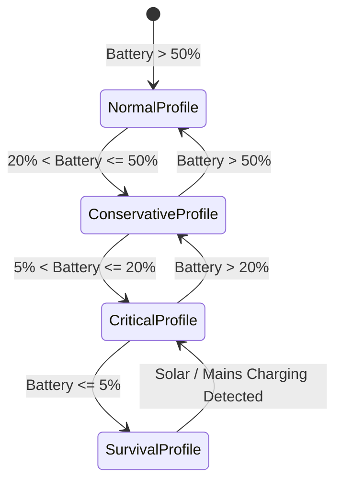
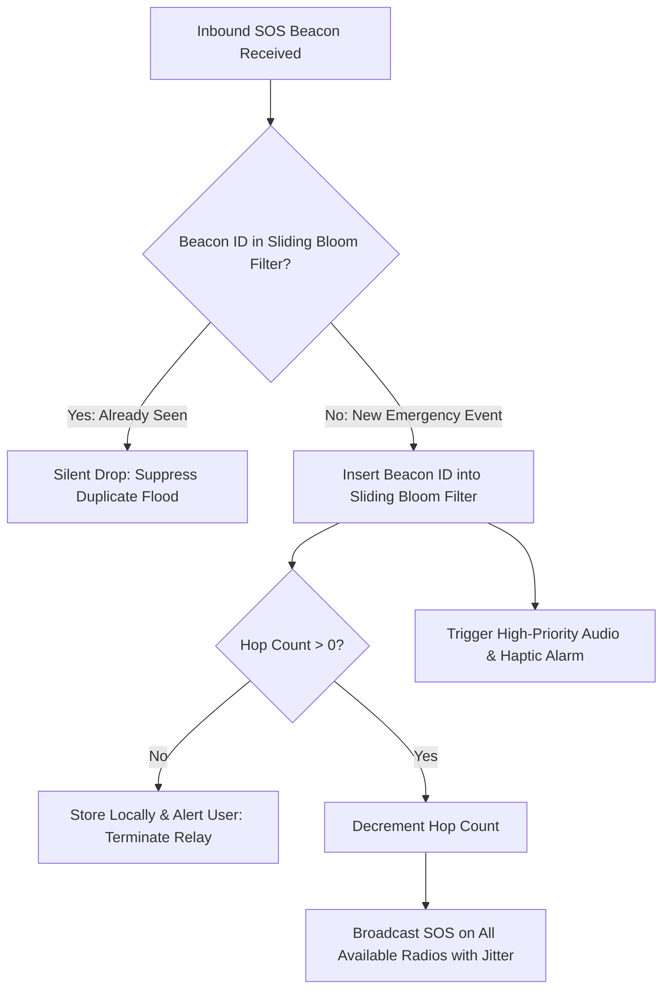

# 07 — Battery-Aware Scheduling & Emergency Mesh

> **Corresponding Specifications:** [`sys-arch/13-battery-aware-scheduling-architecture.md`](../sys-arch/13-battery-aware-scheduling-architecture.md), [`sys-arch/17-emergency-priority-classes-architecture.md`](../sys-arch/17-emergency-priority-classes-architecture.md), [`ui-ux/ui-ux-17-emergency-sos-offline-mesh-architecture.md`](../ui-ux/ui-ux-17-emergency-sos-offline-mesh-architecture.md)  
> **Key Crates:** [`crates/siar-emergency`](../crates/siar-emergency), [`crates/siar-routing-policy`](../crates/siar-routing-policy), [`crates/siar-protocol-ext`](../crates/siar-protocol-ext)  
> **Complements:** [`SIAR_SYSTEM_ARCHITECTURE_DESIGN_RATIONALE.md`](../SIAR_SYSTEM_ARCHITECTURE_DESIGN_RATIONALE.md) (§2.8, §2.9), [`SIAR_SYSTEM_CAPABILITIES_AND_COMPARISON.md`](../SIAR_SYSTEM_CAPABILITIES_AND_COMPARISON.md) (§4.5, §4.6)

---

## 1. The Classic Mesh Failure: Battery Depletion

The fatal flaw of almost all historical peer-to-peer and mesh messaging systems (Briar, Berty, early Serval mesh) is catastrophic battery consumption:
- Continuous Bluetooth Low Energy (BLE) discovery and background Wi-Fi scanning hold mobile application processor (AP) cores awake and keep radio baseband chipsets in high-power active receive (RX) states.
- A standard commercial smartphone running continuous uncoordinated ad-hoc mesh discovery typically depletes its entire lithium-ion battery within **4 to 8 hours**, rendering the device completely useless during real disasters or multi-day power outages.

SIAR eliminates this failure mode through **Synchronized Radio Duty-Cycling & Low-Power Listening (LPL)** ([`sys-arch/13`](../sys-arch/13-battery-aware-scheduling-architecture.md)) combined with an **Electro-Chemical State-Aware Scheduler** and a **Preemptive Five-Tier Quality-of-Service Engine** ([`sys-arch/17`](../sys-arch/17-emergency-priority-classes-architecture.md)).

---

## 2. Radio Power Consumption Model & Electro-Chemical Depletion

### Power Consumption Across Physical Transceiver States

Power consumption across mobile transceivers varies by up to five orders of magnitude:

```text
┌────────────────────────────────────────────────────────────────────────────────────────┐
│                              RADIO POWER DRAW COMPARISON                               │
├────────────────────────┬───────────────────────┬───────────────────────────────────────┤
│ Physical Radio State   │ Average Power Draw    │ Operational Notes                     │
├────────────────────────┼───────────────────────┼───────────────────────────────────────┤
│ Deep Sleep / Standby   │ 0.05 – 0.2 mW         │ CPU suspended, clocks gated           │
│ BLE Active RX/Scan     │ 15 – 35 mW            │ Low-power listening window            │
│ BLE Active TX Burst    │ 25 – 45 mW            │ 0 dBm to +4 dBm transmit power        │
│ Wi-Fi Aware Discovery  │ 80 – 160 mW           │ 512ms synchronized discovery window   │
│ Wi-Fi Direct RX/TX     │ 350 – 750 mW          │ Active 802.11ac high-bandwidth stream │
│ Cellular 5G Active TX  │ 1,200 – 3,200 mW      │ Power amplifier active during uplink  │
└────────────────────────┴───────────────────────┴───────────────────────────────────────┘
```

The average continuous power consumption $\bar{P}$ for a duty-cycled radio transceiver is modeled by:

$$\bar{P} = D \cdot P_{\text{active}} + (1 - D) \cdot P_{\text{sleep}} + E_{\text{trans}} \cdot f_{\text{switch}}$$

Where:
- $D$ is the dimensionless duty cycle ratio:
  $$D = \frac{T_{\text{active}}}{T_{\text{active}} + T_{\text{sleep}}}$$
- $E_{\text{trans}}$ is the transient energy dissipated during PLL frequency lock and radio state transition ($\approx 15\ \mu\text{J}$).
- $f_{\text{switch}}$ is the wake-up frequency: $f_{\text{switch}} = (T_{\text{active}} + T_{\text{sleep}})^{-1}$.

### Electro-Chemical Battery Model (Peukert's Law & Joule Losses)

Battery discharge time is non-linear with respect to discharge current due to internal impedance and electrochemical ion diffusion limits. Under Peukert's Law:

$$t = \frac{H}{\left(\frac{I \cdot H}{C}\right)^k}$$

Where:
- $C$ is the rated capacity at discharge hour rating $H$ (typically $H = 20\text{ h}$).
- $I$ is the continuous discharge current in amperes: $I = \frac{\bar{P}}{V_{\text{batt}}(t)}$.
- $k$ is Peukert's coefficient for Lithium-Cobalt-Oxide ($\text{LiCoO}_2$) or $\text{LiFePO}_4$ cells ($1.05 \le k \le 1.25$).

Furthermore, instantaneous internal resistive heating $P_{\text{loss}} = I^2 R_{\text{int}}$ reduces effective usable capacity during sustained high-power Wi-Fi Direct bursts ($R_{\text{int}} \approx 80\text{–}150\text{ m}\Omega$). SIAR's scheduler bounds peak continuous burst duration to $T_{\text{burst}} \le 400\text{ ms}$ to prevent battery thermal throttling and internal voltage sag below the Low-Voltage Disconnect (LVD) threshold.

---

## 3. Synchronized Rendezvous & Slotted ALOHA Discovery

Rather than scanning unsynchronized channels indefinitely, SIAR nodes synchronize their active radio windows using **Epoch Rendezvous Hashing**:

```text
Time Epoch: t0                     t0 + T_slot               t0 + 2*T_slot
┌──────────────┬────────────────────────┬──────────────┬────────────────────────┐
│ Active (LPL) │ Sleep / Low-Power AP   │ Active (LPL) │ Sleep / Low-Power AP   │
│ T_active     │ T_sleep                │ T_active     │ T_sleep                │
└──────────────┴────────────────────────┴──────────────┴────────────────────────┘
▲                                       ▲
│ Synchronized Rendezvous Beacon        │ Next Common Channel Scan
```

Channel rendezvous selection uses a cryptographic hash of the current epoch:

$$\text{Channel}_{\text{rendezvous}} = \text{BLAKE3}\left(\text{"SIAR-RADIO-SLOT"} \,\|\, \lfloor t / T_{\text{epoch}} \rfloor\right) \pmod{N_{\text{channels}}}$$

Channel throughput under Slotted ALOHA contention with Poisson arrival rate $G$ attempts per slot follows:

$$S = G \cdot e^{-G}$$

Maximum stable channel capacity $S_{\max} = e^{-1} \approx 0.368$ occurs at $G = 1.0$. To maintain stability under disaster-density conditions ($> 500$ devices/hectare), SIAR dynamically injects uniform random backoff jitter $t_{\text{jitter}} \sim \mathcal{U}(0, \tau_{\text{backoff}})$.

---

## 4. Four Dynamic Battery Operational Profiles

In [`sys-arch/13`](../sys-arch/13-battery-aware-scheduling-architecture.md), SIAR nodes transition between four discrete energy profiles based on battery State of Charge (SoC):



| Operational Profile | Battery Threshold ($\text{SoC}$) | BLE Duty Cycle ($D$) | Wi-Fi Direct Policy | Media Sync & Transfer Policy | Target Device Autonomy |
| :--- | :--- | :--- | :--- | :--- | :--- |
| **Normal** | $\text{SoC} > 50\%$ | $25\%$ ($250\text{ms}$ scan / $750\text{ms}$ sleep) | Always enabled | Immediate blob download, full 60fps video calls allowed. | $48\text{–}72\text{ hours}$ |
| **Conservative** | $20\% < \text{SoC} \le 50\%$ | $10\%$ ($100\text{ms}$ scan / $900\text{ms}$ sleep) | On-demand for payloads $> 5\text{MB}$ | Defer large attachments until external power; audio calls only. | $96\text{–}120\text{ hours}$ |
| **Critical** | $5\% < \text{SoC} \le 20\%$ | $2\%$ ($100\text{ms}$ scan / $4,900\text{ms}$ sleep) | **Disabled** | Text-only messaging; all background metadata gossip suspended. | $140\text{–}180\text{ hours}$ |
| **Survival** | $\text{SoC} \le 5\%$ | **$0.1\%$** ($100\text{ms}$ burst / $60\text{s}$ sleep) | **Disabled** | **Life-Safety SOS Only**: CPU suspended in hardware deep-sleep. | **$240+\text{ hours}$** |

---

## 5. Five-Tier Preemptive Priority Scheduling Engine

In [`sys-arch/17`](../sys-arch/17-emergency-priority-classes-architecture.md), every frame entering the link layer is governed by a strict, non-blocking five-tier priority queue:

```text
┌────────────────────────────────────────────────────────────────────────────────────────┐
│                        FIVE-TIER TRAFFIC PRIORITY CLASSIFICATION                       │
├────────┬───────────────────────────┬──────────────┬──────────────┬─────────────────────┤
│ Tier   │ Traffic Classification    │ Preemption   │ Eviction Rule│ Transport Affinity  │
├────────┼───────────────────────────┼──────────────┼──────────────┼─────────────────────┤
│ **P0** │ Life-Safety Emergency SOS │ Hard (<2ms)  │ NEVER EVICTED│ All Active Radios   │
│ **P1** │ Real-Time Voice / Call Sig│ High         │ Drop on TTL  │ Lowest RTT Path     │
│ **P2** │ Interactive Text Chat     │ Medium       │ Spool to DTN │ Any Radio           │
│ **P3** │ Merkle Media Chunks       │ Low          │ Evict First  │ Unmetered High-Speed│
│ **P4** │ Decoy Traffic & Sync      │ None         │ Evict 100%   │ Idle Capacity Only  │
└────────┴───────────────────────────┴──────────────┴──────────────┴─────────────────────┘
```

### Hard Preemption Execution Sequence
When an outbound frame arrives with priority `P0_EMERGENCY`:
1. **Physical Layer Transmit Abort**: If a low-priority transfer (e.g., P3 Merkle chunk) is currently occupying the radio hardware, the driver asserts an abort signal, flushing the transmit DMA buffer in $< 2\text{ms}$.
2. **Head-of-Line Insertion**: The P0 frame jumps directly to the hardware transmit register without traversing intermediate operating system sockets.
3. **Multi-Radio Flood**: The beacon broadcasts concurrently across BLE Extended Advertising, Wi-Fi Direct probes, and ultrasonic acoustic audio modems.

---

## 6. Concrete Rust Scheduler Traits & State Engine

```rust
use std::time::Duration;
use zeroize::Zeroize;

#[derive(Debug, Clone, Copy, PartialEq, Eq, PartialOrd, Ord)]
pub enum TrafficPriority {
    P4DecoySync = 0,
    P3MediaChunk = 1,
    P2InteractiveText = 2,
    P1RealtimeVoice = 3,
    P0LifeSafetySos = 4,
}

#[derive(Debug, Clone, Copy, PartialEq, Eq)]
pub enum BatteryProfile {
    Normal,       // SoC > 50%
    Conservative, // 20% < SoC <= 50%
    Critical,     // 5% < SoC <= 20%
    Survival,     // SoC <= 5%
}

impl BatteryProfile {
    pub fn from_soc(soc_percent: u8) -> Self {
        match soc_percent {
            0..=5 => BatteryProfile::Survival,
            6..=20 => BatteryProfile::Critical,
            21..=50 => BatteryProfile::Conservative,
            _ => BatteryProfile::Normal,
        }
    }

    pub fn ble_duty_cycle(&self) -> (Duration, Duration) {
        match self {
            BatteryProfile::Normal => (Duration::from_millis(250), Duration::from_millis(750)),
            BatteryProfile::Conservative => (Duration::from_millis(100), Duration::from_millis(900)),
            BatteryProfile::Critical => (Duration::from_millis(100), Duration::from_millis(4900)),
            BatteryProfile::Survival => (Duration::from_millis(100), Duration::from_secs(60)),
        }
    }

    pub fn allows_wifi_direct(&self) -> bool {
        matches!(self, BatteryProfile::Normal | BatteryProfile::Conservative)
    }
}

pub trait BatteryAwareScheduler: Send + Sync {
    /// Inspect current battery state and enforce active profile transitions
    fn refresh_power_governor(&mut self, soc_percent: u8, is_charging: bool) -> BatteryProfile;

    /// Enqueue an outbound frame, triggering immediate hard preemption if P0
    fn enqueue_frame(
        &mut self,
        priority: TrafficPriority,
        payload: Vec<u8>,
    ) -> Result<(), SchedulerError>;

    /// Extract next dispatchable frame according to strict priority ordering
    fn dequeue_next_frame(&mut self) -> Option<(TrafficPriority, Vec<u8>)>;
}

#[derive(Debug, thiserror::Error)]
pub enum SchedulerError {
    #[error("Queue buffer saturated: lower priority packets evicted")]
    BufferSaturated,
    #[error("Hardware transmit abort failed during P0 preemption: {0}")]
    HardwareAbortFailed(String),
    #[error("Radio sleep-lock prevented profile transition")]
    WakeLockConflict,
}
```

---

## 7. Emergency SOS Packet Structure & Bloom Flood Suppression

To prevent broadcast storms from exhausting mesh airtime when thousands of nodes relay an SOS beacon in a disaster camp:

```rust
#[repr(C)]
#[derive(Debug, Clone, PartialEq, Eq)]
pub struct EmergencySosBeacon {
    pub beacon_id: [u8; 32],              // BLAKE3 hash of (originator || timestamp || nonce)
    pub originator_pubkey: [u8; 32],      // Victim Ed25519 account identifier
    pub timestamp_sec: u64,               // Physical wall-clock UNIX epoch
    pub latitude_packed: i32,             // 28-bit micro-degrees fixed-point
    pub longitude_packed: i32,            // 28-bit micro-degrees fixed-point
    pub altitude_m: i16,                  // Meters above sea level (-1000m to +9000m)
    pub casualty_severity: u8,            // 0=Minor, 1=Delayed, 2=Immediate, 3=Expectant
    pub vitals_heart_rate: u8,            // Paired BLE sensor telemetry (0 = unavailable)
    pub vitals_spo2: u8,                  // Paired BLE sensor telemetry (0 = unavailable)
    pub battery_soc: u8,                  // Originator device battery level (0-100%)
    pub hop_limit: u8,                    // Decremented at each hop (initial max: 16)
    pub signature: [u8; 64],              // Ed25519 signature covering beacon fields
}
```



- **Sliding Bloom Filter**: Intermediate repeaters store seen `beacon_id` hashes in a 1,024-byte double-buffered Bloom filter with a 15-minute sliding window ($P_{\text{false\_positive}} < 0.001$). Duplicate packets are discarded in $< 50\ \mu\text{s}$ with zero cryptographic processing.
- **Randomized Jitter**: Re-broadcasts include a random delay $\tau \sim \mathcal{U}(50\text{ms}, 250\text{ms})$ to prevent destructive RF packet collisions when multiple nearby phones relay the same SOS simultaneously.

---

## 8. Threat Vectors & Resource Exhaustion Defenses

```text
┌────────────────────────────────────────────────────────────────────────────────────────┐
│                        BATTERY ADVERSARY ATTACK & DEFENSE MATRIX                       │
├────────────────────────┬─────────────────────────┬─────────────────────────────────────┤
│ Threat Vector          │ Attack Mechanism        │ SIAR Defense Architecture           │
├────────────────────────┼─────────────────────────┼─────────────────────────────────────┤
│ **Vampire Routing**    │ Injecting malformed     │ Strict source routing proof verification│
│                        │ loops to drain relays   │ and monotonic hop limits.           │
├────────────────────────┼─────────────────────────┼─────────────────────────────────────┤
│ **Sleep Deprivation**  │ Continuous BLE beaconing│ Hardware wake-lock gating; ignore   │
│                        │ to prevent deep-sleep   │ non-whitelisted discovery probes.   │
├────────────────────────┼─────────────────────────┼─────────────────────────────────────┤
│ **SOS Flood DoS**      │ Forged high-priority    │ Cryptographic Ed25519 signature     │
│                        │ P0 packets across city  │ verification before relay; rate-limit│
│                        │                         │ max 1 beacon per originator/minute. │
└────────────────────────┴─────────────────────────┴─────────────────────────────────────┘
```

1. **Vampire Routing Attacks**: An attacker constructs routing payloads with synthetic forwarding loops designed to keep intermediary nodes transmitting until their batteries deplete. SIAR enforces cryptographic path verification and strict loop-check invariants.
2. **Sleep Deprivation Attacks**: An attacker transmits continuous BLE advertisement bursts to force nearby phones to remain awake. SIAR applies hardware-level scanning quotas: after 5 consecutive unauthenticated discovery probes, the interface enters a 5-minute radio quiet backoff.
3. **SOS Flood Attacks**: Malicious actors broadcast millions of forged P0 packets to jam the airwaves. SIAR nodes verify the Ed25519 signature before forwarding. If signature verification fails, the transmitter's MAC address is blacklisted for 30 minutes.
