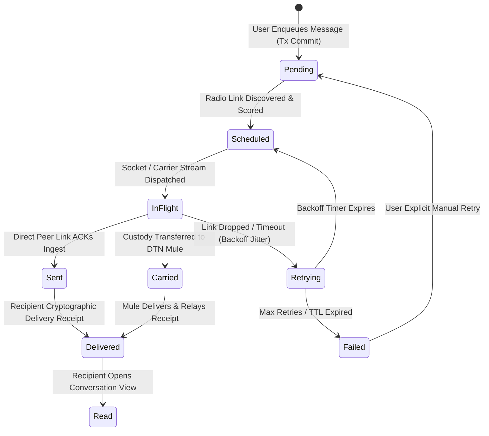

# 08 — Offline Event Log & Outbox Engine

> **Corresponding Specifications:** [`sys-arch/04-offline-event-log-architecture.md`](../sys-arch/04-offline-event-log-architecture.md), [`sys-arch/08-resource-limits-backpressure-architecture.md`](../sys-arch/08-resource-limits-backpressure-architecture.md), [`sys-arch/74-anonymous-network-database-persistent-state-transaction-boundaries-schema-evolution-storage-engine-architecture.md`](../sys-arch/74-anonymous-network-database-persistent-state-transaction-boundaries-schema-evolution-storage-engine-architecture.md)  
> **Key Crates:** [`crates/siar-event-log`](../crates/siar-event-log), [`crates/siar-storage`](../crates/siar-storage), [`crates/siar-messaging`](../crates/siar-messaging)  
> **Complements:** [`SIAR_SYSTEM_ARCHITECTURE_DESIGN_RATIONALE.md`](../SIAR_SYSTEM_ARCHITECTURE_DESIGN_RATIONALE.md) (§1.4, §2.4, §2.19), [`SIAR_SYSTEM_CAPABILITIES_AND_COMPARISON.md`](../SIAR_SYSTEM_CAPABILITIES_AND_COMPARISON.md) (§4.2)

---

## 1. Architectural Philosophy: Event Sourcing & Offline-First Invariants

Traditional networked applications rely on active CRUD (Create, Read, Update, Delete) mutations against a remote centralized database. In contested, ad-hoc, or disaster mesh environments, network connectivity is intermittent, non-deterministic, and frequently absent for days. An application that treats disconnection as an exception inevitably suffers from UI freezes, lost user input, state corruption, and catastrophic sync conflicts.

SIAR models all application state as a **purely deterministic projection over an immutable, append-only event stream**:

```
+-------------------------------------------------------------------------------+
|                       Local Append-Only Event Log                             |
|  [Seq 1: AccountInit] -> [Seq 2: MsgSent] -> [Seq 3: ReadReceipt] -> [Seq 4]  |
+-------------------------------------------------------------------------------+
         |                                  |
         v (Indexed by Cursors)             v (Transactional SQL Projections)
  [P2P Sync Engine to Peer]          [Stoolap Embedded SQL Read Views]
         |                                  |
         v                                  v
  (BLE / Wi-Fi / DTN Mule)           (Virtualised Timeline UI: <8.3ms 120 FPS)
```

### Core Invariants
1. **Local Durability First**: No user mutation is ever acknowledged in the UI without first being durably committed to the local append-only event log and Write-Ahead Log (WAL).
2. **Causal Determinism**: Events from different devices converge to identical application state regardless of network delivery order.
3. **No Phantom Loss**: Unsent messages reside in a persistent transactional Outbox until cryptographic delivery receipts or DTN custody acknowledgments are durably recorded.
4. **Crash-Consistent Atomicity**: Power failure during mid-write cannot corrupt previous log entries or leave dangling foreign keys.

---

## 2. Event Sourcing, Vector Clocks & CRDT Conflict Resolution

### Mathematical Causal Ordering Model
Because physical wall clocks drift significantly on disconnected mobile hardware, SIAR couples physical timestamps with **Lamport Logical Clocks** and **Vector Clocks**:

Lamport Logical Clock update:
$$L(e') = \max(L(e), L_{\text{msg}}) + 1$$

Soundness of Lamport Clocks:
$$\forall e_1, e_2: \quad e_1 \prec e_2 \implies L(e_1) < L(e_2)$$

However, the converse does not hold ($L(e_1) < L(e_2) \not\implies e_1 \prec e_2$). To achieve bidirectional causal completeness, SIAR attaches **Vector Clocks**:

For multi-device accounts, a vector clock $V$ tracks the event counts known across all physical devices $D = \{d_1, d_2, \dots, d_k\}$:

$$V(e) = \langle c_1, c_2, \dots, c_k \rangle$$

Event $e_1$ causally precedes $e_2$ ($e_1 \prec e_2$) if and only if:

$$e_1 \prec e_2 \iff \left(\forall i \in [1, k], \, V_1[i] \le V_2[i]\right) \land \left(\exists j \in [1, k], \, V_1[j] < V_2[j]\right)$$

If neither $e_1 \prec e_2$ nor $e_2 \prec e_1$, the events are **concurrent** ($e_1 \parallel e_2$) and resolved deterministically via Join-Semilattice Conflict-Free Replicated Data Types (CRDTs):

$$(S, \sqcup), \quad A \sqcup B = B \sqcup A \ (\text{Commutativity}), \quad (A \sqcup B) \sqcup C = A \sqcup (B \sqcup C) \ (\text{Associativity}), \quad A \sqcup A = A \ (\text{Idempotency})$$

```rust
pub struct EventEnvelope {
    pub sequence_number: u64,            // Strictly monotonic per-device sequence
    pub event_id: [u8; 32],              // BLAKE3 hash of (payload + metadata + prev_hash)
    pub previous_hash: Option<[u8; 32]>, // Cryptographic hash-chain link
    pub account_id: [u8; 32],            // Originating author
    pub device_id: [u8; 32],             // Originating physical device
    pub timestamp_ms: u64,               // Physical wall-clock time
    pub lamport_clock: u64,              // Logical causal ordering
    pub vector_clock: Vec<u64>,          // Multi-device causal tracking
    pub payload: Vec<u8>,                // Serialized protobuf/rkyv payload
    pub signature: [u8; 64],             // Device Ed25519 signature
}
```

### CRDT Conflict Resolution Strategies

| Data Entity | CRDT Type | Conflict Resolution Semantics |
| :--- | :--- | :--- |
| **Profile Metadata (Name, Status)** | **LWW-Register** (Last-Write-Wins) | Highest physical timestamp wins. Ties broken deterministically by $\text{BLAKE3}(\text{device\_id})$. |
| **Group Membership & Blocklists** | **OR-Set** (Observed-Remove Set) | Adds take precedence over concurrent removes unless a higher monotonic epoch commit is observed. |
| **Message Thread History** | **RGA / Causal Graph** | Total causal ordering: unread indicators and edits link explicitly to prior target message hash. |
| **Contact Trust Verification** | **Monotonic Latch** | A cryptographically verified safety state can only be superseded by a verified re-key or explicit tombstone. |

---

## 3. Transactional Outbox Engine & State Machine

When a user dispatches a message, media file, or reaction while offline, the payload is committed transactionally to the `OutboxRepo` inside [`siar-storage`](../crates/siar-storage):



### Outbox States & Transition Invariants

- **`Pending`**: Durably committed in local storage. Survives power loss or process termination.
- **`Scheduled`**: Selected by the Autonomous Policy Engine ([Chapter 04](04-Autonomous-Routing-and-Policy-Engine.md)) for transmission on the best available interface (Wi-Fi Direct, BLE, Iroh QUIC).
- **`InFlight`**: Actively writing frames to physical transport buffers.
- **`Carried`**: Transferred to an intermediate DTN mule node with a signed custody receipt; the local node retains the ciphertext until an end-to-end receipt arrives.
- **`Delivered`**: Recipient hardware has authenticated the payload, decrypted headers, and signed a cryptographic delivery receipt.
- **`Failed`**: Reached max retries or TTL expiration; marked with red error indicator in UI without silent data loss.

---

## 4. Adaptive Exponential Backoff with Decorrelated Jitter

To prevent "thundering herd" packet collisions when a network partition heals or multiple mesh nodes discover each other simultaneously, [`siar-messaging`](../crates/siar-messaging) calculates delay intervals using **Decorrelated Jitter**:

$$T_{0} = T_{\text{base}}$$
$$T_{i} = \min\left(T_{\max}, \, \text{Uniform}(T_{\text{base}}, \, T_{i-1} \cdot 3)\right)$$

```rust
pub struct OutboxRetryEngine {
    base_delay_ms: u64,    // Default: 500 ms
    max_delay_ms: u64,     // Default: 60,000 ms (1 min)
    max_attempts: u32,     // Default: 12 attempts before fallback to DTN
    last_sleep_ms: u64,
}

impl OutboxRetryEngine {
    pub fn new() -> Self {
        Self {
            base_delay_ms: 500,
            max_delay_ms: 60_000,
            max_attempts: 12,
            last_sleep_ms: 500,
        }
    }

    pub fn compute_decorrelated_delay(&mut self) -> std::time::Duration {
        let high = (self.last_sleep_ms.saturating_mul(3)).min(self.max_delay_ms);
        let low = self.base_delay_ms.min(high);
        let jittered = fastrand::u64(low..=high);
        self.last_sleep_ms = jittered;
        std::time::Duration::from_millis(jittered)
    }
}
```

---

## 5. Stoolap Embedded SQL Engine & Relational Schema

SIAR utilizes **Stoolap**—a high-performance, 100% pure-Rust embedded SQL storage engine with zero external C library dependencies:

```sql
-- Core Messages Relational Projection
CREATE TABLE IF NOT EXISTS messages (
    id TEXT PRIMARY KEY,
    conversation_id TEXT NOT NULL,
    sender_id TEXT NOT NULL,
    recipient_id TEXT,
    content_payload BLOB NOT NULL,
    media_blob_id TEXT,
    delivery_status TEXT NOT NULL,
    created_at_ms INTEGER NOT NULL,
    sequence_no INTEGER NOT NULL,
    lamport_clock INTEGER NOT NULL,
    is_deleted INTEGER DEFAULT 0
);

-- Transactional Outbox Queue
CREATE TABLE IF NOT EXISTS outbox_queue (
    ticket_id TEXT PRIMARY KEY,
    message_id TEXT NOT NULL REFERENCES messages(id),
    destination_account TEXT NOT NULL,
    priority INTEGER NOT NULL, -- 0: SOS, 1: Text, 2: Media
    retry_count INTEGER DEFAULT 0,
    next_retry_at_ms INTEGER NOT NULL,
    created_at_ms INTEGER NOT NULL,
    status TEXT NOT NULL
);

-- Append-Only Causal Event Stream
CREATE TABLE IF NOT EXISTS event_log (
    sequence_no INTEGER PRIMARY KEY AUTOINCREMENT,
    event_id TEXT NOT NULL UNIQUE,
    event_type TEXT NOT NULL,
    payload BLOB NOT NULL,
    signature BLOB NOT NULL,
    created_at_ms INTEGER NOT NULL
);

CREATE INDEX IF NOT EXISTS idx_messages_conv_date ON messages(conversation_id, created_at_ms DESC);
CREATE INDEX IF NOT EXISTS idx_outbox_retry ON outbox_queue(status, next_retry_at_ms);
```

---

## 6. Production Rust Implementation: Transactional Outbox Manager

The following production-grade Rust implementation manages transactional enqueuing, priority scheduling, and state transitions within the outbox engine:

```rust
use std::collections::VecDeque;
use std::time::{Duration, Instant};

#[derive(Debug, Clone, Copy, PartialEq, Eq, PartialOrd, Ord)]
pub enum PriorityTier {
    P0EmergencySos = 0,
    P1TextMessage = 1,
    P2MediaBlob = 2,
}

#[derive(Debug, Clone, PartialEq, Eq)]
pub enum TicketStatus {
    Pending,
    Scheduled,
    InFlight,
    Delivered,
    Failed,
}

#[derive(Debug, Clone)]
pub struct OutboxTicket {
    pub ticket_id: String,
    pub recipient: [u8; 32],
    pub payload: Vec<u8>,
    pub priority: PriorityTier,
    pub status: TicketStatus,
    pub retry_count: u32,
    pub next_attempt: Instant,
}

pub struct TransactionalOutboxManager {
    queue: VecDeque<OutboxTicket>,
    max_queue_depth: usize,
    retry_engine: OutboxRetryEngine,
}

impl TransactionalOutboxManager {
    pub fn new(max_depth: usize) -> Self {
        Self {
            queue: VecDeque::new(),
            max_queue_depth: max_depth,
            retry_engine: OutboxRetryEngine::new(),
        }
    }

    /// Enqueue a message with priority-based drop-tail backpressure
    pub fn enqueue(
        &mut self,
        ticket_id: String,
        recipient: [u8; 32],
        payload: Vec<u8>,
        priority: PriorityTier,
    ) -> Result<(), &'static str> {
        if self.queue.len() >= self.max_queue_depth {
            // Drop lowest priority item if new item is higher priority
            if let Some(pos) = self.queue.iter().rposition(|t| t.priority > priority) {
                self.queue.remove(pos);
            } else {
                return Err("Outbox buffer capacity exhausted (drop-tail backpressure)");
            }
        }

        let ticket = OutboxTicket {
            ticket_id,
            recipient,
            payload,
            priority,
            status: TicketStatus::Pending,
            retry_count: 0,
            next_attempt: Instant::now(),
        };

        // Insert sorted by priority
        let idx = self.queue.partition_point(|t| t.priority <= priority);
        self.queue.insert(idx, ticket);
        Ok(())
    }

    /// Drain tickets that are ready for immediate transmission
    pub fn drain_ready_tickets(&mut self, now: Instant) -> Vec<OutboxTicket> {
        let mut ready = Vec::new();
        for ticket in self.queue.iter_mut() {
            if ticket.status == TicketStatus::Pending && ticket.next_attempt <= now {
                ticket.status = TicketStatus::InFlight;
                ready.push(ticket.clone());
            }
        }
        ready
    }

    /// Mark ticket as delivered upon receiving cryptographic acknowledgment
    pub fn acknowledge_delivery(&mut self, ticket_id: &str) {
        if let Some(pos) = self.queue.iter().position(|t| t.ticket_id == ticket_id) {
            self.queue.remove(pos);
        }
    }

    /// Schedule retry with decorrelated jitter upon transmission failure
    pub fn record_failure(&mut self, ticket_id: &str) {
        if let Some(ticket) = self.queue.iter_mut().find(|t| t.ticket_id == ticket_id) {
            ticket.retry_count += 1;
            if ticket.retry_count > 12 {
                ticket.status = TicketStatus::Failed;
            } else {
                ticket.status = TicketStatus::Pending;
                let delay = self.retry_engine.compute_decorrelated_delay();
                ticket.next_attempt = Instant::now() + delay;
            }
        }
    }
}
```

---

## 7. Threat Vectors & Persistence Defense Matrix

```text
┌────────────────────────────────────────────────────────────────────────────────────────┐
│                        PERSISTENCE & OUTBOX THREAT MATRIX                              │
├────────────────────────┬─────────────────────────┬─────────────────────────────────────┤
│ Threat Vector          │ Attack Mechanism        │ SIAR Defense Architecture           │
├────────────────────────┼─────────────────────────┼─────────────────────────────────────┤
│ **Split-Brain Desync** │ Partitioned nodes apply │ Join-semilattice CRDTs with vector  │
│                        │ concurrent state edits  │ clocks resolve concurrent mutations │
│                        │ to message history      │ deterministically without data loss.│
├────────────────────────┼─────────────────────────┼─────────────────────────────────────┤
│ **Outbox Flood DoS**   │ Rogue app floods local  │ Strict drop-tail backpressure keeps │
│                        │ queue with junk entries │ P0 SOS messages; evicts P2 blobs.   │
├────────────────────────┼─────────────────────────┼─────────────────────────────────────┤
│ **Brownout Corruption**│ Battery dies mid-write  │ Pure-Rust Stoolap WAL writes with   │
│                        │ on raw flash storage    │ fsync barriers and checksum checks. │
├────────────────────────┼─────────────────────────┼─────────────────────────────────────┤
│ **Replay of Stale Log**│ Adversary re-injects    │ Ed25519 signatures and monotonic    │
│                        │ historic event packets  │ sequence numbers drop stale duplicates│
└────────────────────────┴─────────────────────────┴─────────────────────────────────────┘
```
