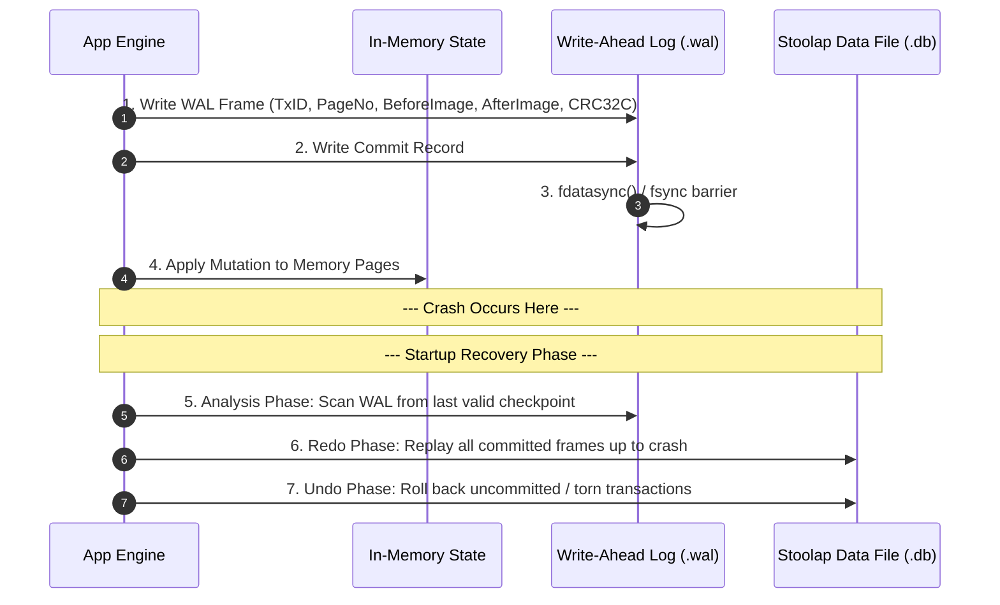
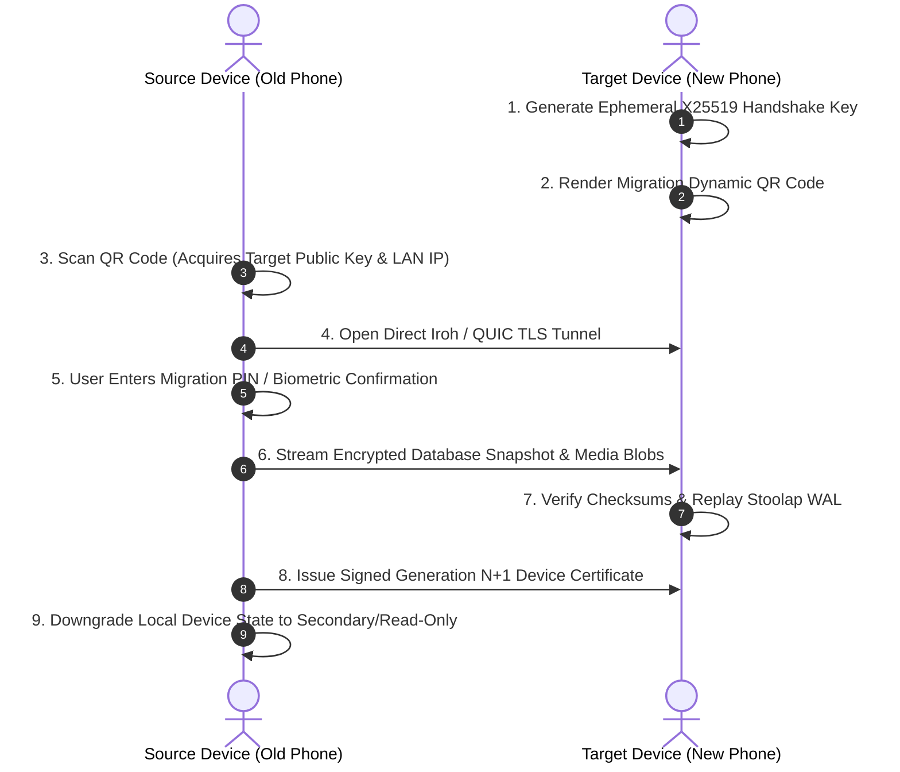

# 10 — Crash Recovery & Data Portability

> **Corresponding Specifications:** [`sys-arch/09-crash-recovery-architecture.md`](../sys-arch/09-crash-recovery-architecture.md), [`sys-arch/33-backup-restore-export-import-archival-portability-architecture.md`](../sys-arch/33-backup-restore-export-import-archival-portability-architecture.md), [`sys-arch/67-anonymous-network-data-lifecycle-storage-minimization-secure-deletion-retention-archival-cryptographic-erasure-architecture.md`](../sys-arch/67-anonymous-network-data-lifecycle-storage-minimization-secure-deletion-retention-archival-cryptographic-erasure-architecture.md), [`sys-arch/ui-ux-16-backup-restore-export-migration-architecture.md`](../ui-ux/ui-ux-16-backup-restore-export-migration-architecture.md)  
> **Key Crates:** [`crates/siar-storage`](../crates/siar-storage), [`crates/siar-crash-recovery`](../crates/siar-crash-recovery), [`crates/siar-crypto`](../crates)  
> **Complements:** [`SIAR_SYSTEM_ARCHITECTURE_DESIGN_RATIONALE.md`](../SIAR_SYSTEM_ARCHITECTURE_DESIGN_RATIONALE.md) (§2.4, §2.14, §2.19), [`SIAR_SYSTEM_CAPABILITIES_AND_COMPARISON.md`](../SIAR_SYSTEM_CAPABILITIES_AND_COMPARISON.md) (§4.3)

---

## 1. Threat Model & Failure Invariants

In tactical field operations, disaster zones, and volatile mobile environments, nodes do not enjoy graceful OS shutdowns. Devices experience battery starvation, physical drops, forced battery extractions, kernel panics, and aggressive operating system terminations (Android Low Memory Killer `lmkd`, iOS Jetsam).

```
+------------------------------------------------------------------------------------+
|                         Volatile Operational Failure Modes                         |
+------------------------------------+-----------------------------------------------+
| Failure Mode                       | Impact Without SIAR Architecture              |
+------------------------------------+-----------------------------------------------+
| Sudden Power Loss (Battery Pull)   | Torn page writes, corrupted database headers  |
| Operating System LMK Termination   | Interrupted multi-step outbox transactions    |
| Flash Memory FTL Wear & Bit Rot    | Silent chunk bitflips, unreadable blobs       |
| Hardware Device Seizure            | Forensic recovery of "deleted" flash blocks   |
| Disk Full (Zero Free Storage)      | Database lockups, sync deadlocks              |
+------------------------------------+-----------------------------------------------+
```

### Core Recovery Invariants
1. **Atomicity**: A transaction either completely commits or is completely rolled back; partial writes never contaminate application state.
2. **Durability via fsync Barriers**: No transaction is reported as committed to user interfaces until the WAL frame has been flushed through kernel page caches to physical storage media.
3. **Automatic Self-Healing Boot**: The storage engine detects interrupted transactions during startup and restores consistent state in $< 150\text{ ms}$ without requiring user intervention.
4. **Information-Theoretic Deletion**: Shredding a cryptographic partition key guarantees that ciphertext blocks remaining on wear-leveled flash media leak zero information.

---

## 2. Write-Ahead Logging (WAL) & ARIES Crash Recovery

The Stoolap embedded storage engine maintains consistency using a **Write-Ahead Log (WAL)** operating under an ARIES-style recovery protocol (Analysis, Redo, Undo):



### ARIES LSN State Invariant Equations
Every log record is assigned a monotonic Log Sequence Number ($\text{LSN}$). Each database page on disk stores a $\text{PageLSN}$:

$$\text{FlushedLSN} \ge \text{PageLSN} \quad (\text{WAL Rule: Log record must hit disk BEFORE page is written})$$

During recovery:
1. **Analysis Phase**: Reconstructs the Dirty Page Table (DPT) and Transaction Table (TT) from the last checkpoint record $\text{LSN}_{\text{ckpt}}$:
   $$\text{RedoLSN} = \min_{p \in \text{DPT}} (\text{RecLSN}(p))$$
2. **Redo Phase (Repeating History)**: Replays log records forward from $\text{RedoLSN}$ to the crash point. A page modification is re-applied if and only if:
   $$\text{LSN}_{\text{record}} > \text{PageLSN}$$
3. **Undo Phase**: Rolls back active uncommitted transactions in reverse order, writing Compensation Log Records (CLRs) to prevent infinite loops during recurring crashes.

---

## 3. Sovereign Encrypted Backup Specification (`.siarbackup`)

SIAR features an audited, zero-knowledge archival backup format that encapsulates identity keys, local conversation history, contact verification records, and blob manifests into a portable, encrypted single-file container:

```
+-------------------------------------------------------------------------------+
|                       SIAR Encrypted Archive Header                           |
|  - Magic Identifier: "SIAR_BAK_V2" (11 bytes)                                 |
|  - Version: 0x0002 (2 bytes)                                                  |
|  - Argon2id Salt: 16 bytes cryptographically secure random bytes              |
|  - Argon2id Parameters: Memory = 65,536 KiB (64 MiB), Iterations = 4, Lanes = 4|
|  - AEAD Nonce: 12 bytes random initialization vector                          |
|  - Epoch Timestamp: 8 bytes (Big-Endian u64)                                  |
+-------------------------------------------------------------------------------+
|                 Authenticated Ciphertext Stream (ChaCha20-Poly1305)           |
|  - Embedded Stoolap DB SQL Snapshot (Zstandard compressed)                   |
|  - Merkle Blob Manifest Index & File Chunk Metadata                           |
|  - Identity Root Certificates & Encrypted Keystore Tokens                     |
|  - Verified Safety Fingerprints & Contact Trust Store                         |
+-------------------------------------------------------------------------------+
|                 Poly1305 Authentication Tag (16 bytes)                        |
+-------------------------------------------------------------------------------+
```

### Key Derivation & Encryption Pipeline
The master backup encryption key is derived using **Argon2id** (memory-hard, resistant to GPU/ASIC cracking):

$$K_{\text{backup}} = \text{Argon2id}(\text{Passphrase}, \text{Salt}, \text{Memory}=64\text{MB}, \text{Iterations}=4, \text{Parallelism}=4)$$

$$\text{Ciphertext}, \, \text{Tag} = \text{ChaCha20-Poly1305-Encrypt}(K_{\text{backup}}, \text{Nonce}, \text{ZstdCompress}(\text{DataStream}))$$

---

## 4. Direct Peer-to-Peer Device Migration Protocol

When upgrading hardware, SIAR provides a zero-cloud, direct device-to-device migration protocol operating over high-speed local links (Wi-Fi Direct, Local LAN, or USB-C tethering):



---

## 5. Cryptographic Erasure & Secure Deletion Mechanics

Standard filesystem deletion primitives (`unlink()`, `rm`) do not physically erase bits from flash storage due to **Flash Translation Layers (FTL)**:

```
+------------------------------------------------------------------------------------+
|                         Envelope Cryptographic Erasure Architecture                |
+------------------------------------------------------------------------------------+
| 1. Per-Partition Ephemeral Keys:                                                   |
|    Each conversation, media cache, or profile partition is encrypted under an      |
|    independent 256-bit symmetric key (K_partition) stored in hardware secure RAM. |
|                                                                                    |
| 2. Instant Mathematical Shredding:                                                 |
|    To securely delete a thread or wipe the app:                                    |
|    a. Overwrite K_partition with cryptographically secure random bytes.            |
|    b. Zeroize RAM structures using the ZeroizeOnDrop trait.                        |
|    c. Flush secure hardware storage via sync barriers.                             |
|                                                                                    |
| 3. Forensic Result:                                                                |
|    Remaining data blocks on physical flash chips are mathematically indistinguishable|
|    from pure entropy (Shannon Entropy H ≈ 8.0 bits/byte). Decryption without the   |
|    shredded K_partition is computationally infeasible.                             |
+------------------------------------------------------------------------------------+
```

### Mathematical Proof of Information-Theoretic Erasure
Let ciphertext $\mathcal{C} = \text{Enc}_K(\mathcal{M})$ be stored on physical NAND flash blocks. When $K$ is zeroized from non-volatile storage:

$$\mathcal{I}(\mathcal{M}; \mathcal{C} \mid K = \emptyset) = H(\mathcal{M}) - H(\mathcal{M} \mid \mathcal{C}) = 0$$

The mutual information between message plaintext and retained ciphertext drops strictly to zero, rendering forensic recovery impossible regardless of physical chip-off extraction.

---

## 6. Production Rust Implementation: ARIES Crash Recovery Engine

The following production-grade Rust implementation manages WAL frame verification, dirty transaction detection, and startup recovery playback:

```rust
use std::collections::HashMap;

#[derive(Debug, Clone, Copy, PartialEq, Eq)]
pub enum FrameType {
    PageUpdate = 1,
    CommitRecord = 2,
    RollbackRecord = 3,
}

#[derive(Debug, Clone)]
pub struct WalRecord {
    pub lsn: u64,
    pub tx_id: u64,
    pub page_no: u32,
    pub frame_type: FrameType,
    pub payload: Vec<u8>,
}

pub struct AriesRecoveryEngine {
    dirty_pages: HashMap<u32, u64>,      // page_no -> rec_lsn
    active_transactions: HashMap<u64, Vec<u64>>, // tx_id -> [lsn list]
    committed_transactions: HashMap<u64, bool>,
}

impl AriesRecoveryEngine {
    pub fn new() -> Self {
        Self {
            dirty_pages: HashMap::new(),
            active_transactions: HashMap::new(),
            committed_transactions: HashMap::new(),
        }
    }

    /// Analysis Phase: Scan WAL log records to identify active and committed transactions
    pub fn execute_analysis_phase(&mut self, log_records: &[WalRecord]) -> u64 {
        let mut min_rec_lsn = u64::MAX;

        for record in log_records {
            match record.frame_type {
                FrameType::PageUpdate => {
                    self.active_transactions.entry(record.tx_id).or_default().push(record.lsn);
                    self.dirty_pages.entry(record.page_no).or_insert(record.lsn);
                    min_rec_lsn = min_rec_lsn.min(record.lsn);
                }
                FrameType::CommitRecord => {
                    self.active_transactions.remove(&record.tx_id);
                    self.committed_transactions.insert(record.tx_id, true);
                }
                FrameType::RollbackRecord => {
                    self.active_transactions.remove(&record.tx_id);
                }
            }
        }

        if min_rec_lsn == u64::MAX { 0 } else { min_rec_lsn }
    }

    /// Redo Phase: Replay all modifications from min_rec_lsn for committed transactions
    pub fn execute_redo_phase<F>(&self, log_records: &[WalRecord], mut apply_page: F)
    where
        F: FnMut(u32, &[u8]),
    {
        for record in log_records {
            if record.frame_type == FrameType::PageUpdate {
                // Apply page mutation if transaction committed
                if self.committed_transactions.get(&record.tx_id).copied().unwrap_or(false) {
                    apply_page(record.page_no, &record.payload);
                }
            }
        }
    }

    /// Undo Phase: Roll back uncommitted transactions active at time of crash
    pub fn execute_undo_phase(&self) -> Vec<u64> {
        self.active_transactions.keys().copied().collect()
    }
}
```

---

## 7. Threat Vectors & Recovery Defense Matrix

```text
┌────────────────────────────────────────────────────────────────────────────────────────┐
│                        CRASH & RECOVERY THREAT MATRIX                                  │
├────────────────────────┬─────────────────────────┬─────────────────────────────────────┤
│ Threat Vector          │ Attack Mechanism        │ SIAR Defense Architecture           │
├────────────────────────┼─────────────────────────┼─────────────────────────────────────┤
│ **Torn Page Corruption**| Battery pulled during   │ CRC32C / BLAKE3 frame checksums;   │
│                        │ physical flash write    │ torn pages rejected during Redo.    │
├────────────────────────┼─────────────────────────┼─────────────────────────────────────┤
│ **FTL Forensic Dump**  │ Adversary desolders     │ Envelope cryptographic erasure;     │
│                        │ flash chip to find data │ keys zeroized; mutual info = 0.     │
├────────────────────────┼─────────────────────────┼─────────────────────────────────────┤
│ **Backup Brute-Force** │ Offline dictionary      │ Argon2id (64MB memory, 4 passes)    │
│                        │ attack against archive  │ resists GPU/ASIC acceleration.      │
├────────────────────────┼─────────────────────────┼─────────────────────────────────────┤
│ **Migration MitM**     │ Rogue peer intercepts   │ Mutual ephemeral X25519 handshake   │
│                        │ migration Wi-Fi tunnel  │ authenticated via out-of-band QR.   │
└────────────────────────┴─────────────────────────┴─────────────────────────────────────┘
```
