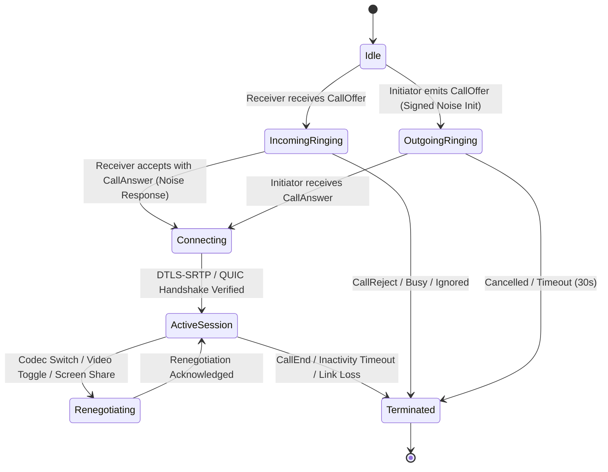
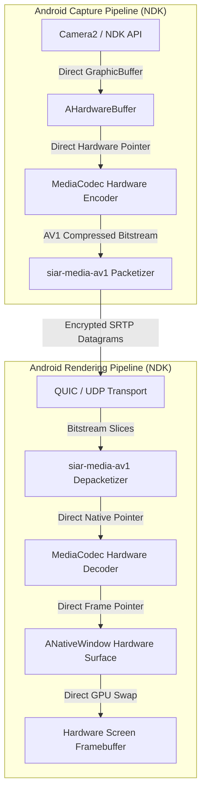
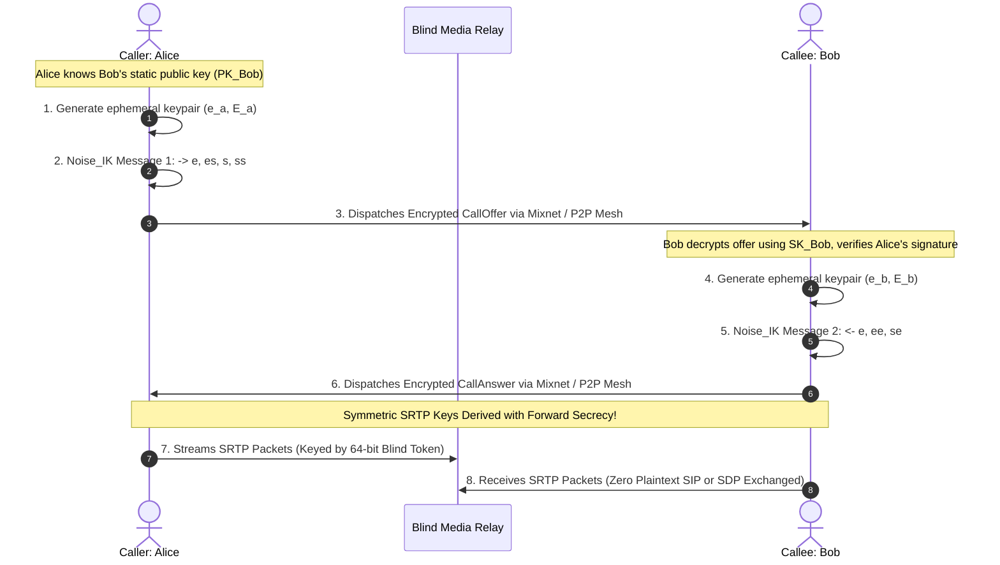

# 11 — Realtime Audio & Video Calling Architecture

> **Corresponding Specifications:** [`sys-arch/25-android-direct-hardware-surface-zero-copy-media-architecture.md`](../sys-arch/25-android-direct-hardware-surface-zero-copy-media-architecture.md), [`sys-arch/26-rust-first-audio-dsp-resampling-aec-ns-agc-architecture.md`](../sys-arch/26-rust-first-audio-dsp-resampling-aec-ns-agc-architecture.md), [`sys-arch/29-realtime-calls-media-session-protocol-architecture.md`](../sys-arch/29-realtime-calls-media-session-protocol-architecture.md), [`sys-arch/ui-ux-07-calls-realtime-media-architecture.md`](../ui-ux/ui-ux-07-calls-realtime-media-architecture.md)  
> **Key Crates:** [`crates/siar-calls`](../crates/siar-calls), [`crates/siar-media-core`](../crates/siar-media-core), [`crates/siar-media-audio`](../crates/siar-media-audio), [`crates/siar-media-av1`](../crates/siar-media-av1), [`crates/siar-media-android`](../crates/siar-media-android)  
> **Complements:** [`SIAR_SYSTEM_ARCHITECTURE_DESIGN_RATIONALE.md`](../SIAR_SYSTEM_ARCHITECTURE_DESIGN_RATIONALE.md) (§2.11, §2.13), [`SIAR_SYSTEM_CAPABILITIES_AND_COMPARISON.md`](../SIAR_SYSTEM_CAPABILITIES_AND_COMPARISON.md) (§3.3)

---

## 1. Architectural Philosophy: Low-Latency VoIP Over Contested Networks

Real-time audio and video communications face severe challenges in decentralized and tactical mesh environments:
1. **Strict Latency Budget**: Human speech perception degrades rapidly when one-way mouth-to-ear latency exceeds $150\text{ ms}$; conversations become completely disjointed above $400\text{ ms}$.
2. **Packet Loss & Jitter**: Wireless mesh channels (Wi-Fi Direct, Wi-Fi Aware, ad-hoc 802.11s) suffer from burst packet loss (10% to 35%) and extreme delay jitter due to radio interference and node mobility.
3. **Surveillance & IP Exposure**: Traditional WebRTC stacks expose participants' public and private IP addresses via STUN/TURN ICE candidate gathering, leaking physical location to eavesdroppers.

SIAR achieves high-fidelity, private real-time calling through a **hybrid signaling and zero-copy media pipeline**:
- Signaling is negotiated via **Noise Protocol Handshakes** (or routed anonymously through Sphinx onion mixnets when IP blinding is required).
- Pure-Rust digital signal processing (DSP) eliminates audio artifacts locally.
- Direct hardware surface binding bypasses JVM/UI heaps for zero-copy AV1 video decoding.

```
+------------------------------------------------------------------------------------+
|                         SIAR Realtime Media Pipeline                               |
+------------------------------------------------------------------------------------+
|                                                                                    |
| [Microphone 48kHz] ---> [AEC (NLMS)] ---> [NS (Spectral)] ---> [AGC] ---> [Opus]  |
|                                                                             |      |
| [Camera Hardware]  ---> [AHardwareBuffer] ---> [MediaCodec AV1/H.264] ------>     |
|                                                                             v      |
|                                                     [SRTP / QUIC Encrypted Streams]|
|                                                                             |      |
| [GPU Framebuffer]  <--- [ANativeWindow]   <--- [MediaCodec HW Dec] <-------+      |
|                                                                                    |
| [Speaker Output]   <--- [Adaptive Jitter Buffer (PLC)] <--- [Opus Decoder] <-------+      |
+------------------------------------------------------------------------------------+
```

---

## 2. Threat Model & Privacy Invariants

| Threat Vector | Adversary Profile | SIAR Calling Defense |
| :--- | :--- | :--- |
| **IP Address Harvesting** | Rogue relay or eavesdropper monitors STUN/TURN traffic | Dual-plane architecture: Signaling via blinded Mixnet/Sphinx; media routed via blind untrusted relays ([Chapter 35](35-Anonymous-Media-Streaming-and-Call-Signaling.md)). |
| **Voice VBR Traffic Analysis** | Eavesdropper analyzes Opus audio packet sizes to identify spoken words | Constant-Bitrate (CBR) mode option or cryptographic packet padding to uniform discrete buckets (40, 80, 160 bytes). |
| **Man-in-the-Middle Injection** | Compromised relay tampers with audio streams | DTLS-SRTP with mutual Short Authentication String (SAS) voice confirmation ([Chapter 02](02-Multi-Device-Identity-and-Trust.md)). |
| **Memory Dump of Active Streams**| Forensic analysis of process memory after call | Audio PCM frame buffers are overwritten with zero bytes immediately upon playback (`zeroize`). |

---

## 3. Realtime Signaling State Machine & Ephemeral Key Exchange

Call setup executes a lightweight binary state machine implemented in [`siar-calls`](../crates/siar-calls):



### Noise Protocol Handshake (`Noise_XX_25519_ChaChaPoly_BLAKE3`)
Signaling payloads are encrypted using an ephemeral Noise handshake:
1. $\to e$ (Initiator sends ephemeral public key).
2. $\leftarrow e, \, ee, \, s, \, es$ (Responder sends ephemeral key, performs ECDH, sends encrypted static identity, performs DH).
3. $\to s, \, se$ (Initiator sends encrypted static identity, completes DH).
4. Both parties verify respective `SafetyFingerprint` anchors before media channels unlock.

---

## 4. Pure-Rust Audio DSP Pipeline (`siar-media-audio`)

SIAR features an embedded, pure-Rust digital signal processing engine that processes 48,000 Hz floating-point audio samples with zero C library dependencies:

```
[Mic PCM: d(n)] ---> [AEC (Normalized LMS Filter)] ---> e(n)
                            ^                  |
                            | (Ref: x(n))      v
                   [Speaker Reference]     [Spectral Subtraction NS]
                                               |
                                               v
                                           [Adaptive AGC Gain]
                                               |
                                               v
                                           [VAD & Opus Encoder]
```

### 1. Acoustic Echo Cancellation (AEC): Normalized Least Mean Squares (NLMS)
AEC removes speaker feedback picked up by the microphone using adaptive FIR filtering:

$$e(n) = d(n) - \hat{y}(n) = d(n) - \mathbf{w}^T(n) \mathbf{x}(n)$$

$$\mathbf{w}(n+1) = \mathbf{w}(n) + \frac{\mu}{\|\mathbf{x}(n)\|^2 + \epsilon} e(n) \mathbf{x}(n)$$

Where $\mathbf{x}(n)$ is the speaker reference buffer, $d(n)$ is the raw microphone signal, $\mathbf{w}(n)$ is the filter weight vector, $\mu = 0.25$ is the adaptation step size, and $\epsilon = 10^{-6}$ prevents division by zero.

### 2. Noise Suppression (NS): Spectral Subtraction
Removes steady-state ambient background noise (engine hum, wind, fan noise) in the frequency domain via Fast Fourier Transforms:

$$|\hat{S}(\omega)|^2 = \max\left( |Y(\omega)|^2 - \alpha |\hat{D}(\omega)|^2, \, \beta |\hat{D}(\omega)|^2 \right)$$

Where $|Y(\omega)|$ is the noisy input spectrum, $|\hat{D}(\omega)|$ is the estimated noise spectrum tracked during non-speech intervals, $\alpha = 2.0$ is the over-subtraction factor, and $\beta = 0.02$ is the spectral floor preventing musical noise artifacts.

### 3. Automatic Gain Control (AGC): Peak Detector & Dynamic Compression
Normalizes soft whispers and loud shouts to a consistent output volume level ($-18\text{ dBFS}$ target):

$$\text{Envelope}(n) = (1 - \alpha) \cdot \text{Envelope}(n-1) + \alpha \cdot |e(n)|$$

$$\alpha = \begin{cases} \alpha_{\text{attack}} = 1 - e^{-\frac{1}{f_s \cdot \tau_{\text{attack}}}}, & |e(n)| > \text{Envelope}(n-1) \\ \alpha_{\text{release}} = 1 - e^{-\frac{1}{f_s \cdot \tau_{\text{release}}}}, & |e(n)| \le \text{Envelope}(n-1) \end{cases}$$

$$\text{Gain}(n) = \min\left( G_{\text{max}}, \, \frac{\text{TargetLevel}}{\max(\text{Envelope}(n), \epsilon)} \right)$$

### 4. Polyphase Audio Resampler & Drift Compensation
Handles hardware clock frequency drift between microphone hardware (e.g., $44,100\text{ Hz}$) and the internal Opus engine ($48,000\text{ Hz}$) using a polyphase sinc interpolation filter with fractional delay tracking.

---

## 5. Video Subsystem: AV1 Codec & Direct Zero-Copy Hardware Acceleration

SIAR adopts the royalty-free **AV1** video standard, which provides $30\text{–}40\%$ higher coding efficiency than H.264 at identical bitrates, critical for low-bandwidth mesh links.



### Zero-Copy Memory Invariant
Traditional Android implementations bridge camera frames through Java byte arrays (`byte[]`), inducing up to 3 separate memory allocations and garbage-collection pauses per frame. SIAR's [`siar-media-android`](../crates/siar-media-android) binds directly to Android NDK native APIs:
- Captures frames directly into `AHardwareBuffer`.
- Decodes video streams directly onto native `ANativeWindow` display surfaces.
- **Result**: Zero copies through the Java/Kotlin runtime heap, ensuring continuous $60\text{ FPS}$ rendering without GC stutter.

---

## 6. Adaptive Jitter Buffer & Congestion Control

The media transport engine dynamically balances latency against packet loss:

```rust
pub struct AdaptiveJitterBuffer {
    target_delay_ms: u32,
    smoothed_rtt_ms: u32,
    jitter_variance_ms: u32,
    packet_loss_ratio: f32,
    frame_queue: BTreeMap<u32, AudioFrame>,
}

impl AdaptiveJitterBuffer {
    pub fn calculate_target_delay(&self) -> Duration {
        // Target delay = sRTT/2 + 3 * sigma_jitter
        let delay_ms = (self.smoothed_rtt_ms / 2) + (3 * self.jitter_variance_ms);
        Duration::from_millis(delay_ms.clamp(40, 250) as u64)
    }
}
```

### Rate Adaptation State Machine
The congestion controller continuously monitors packet delivery ratio and delay gradient:

```
[Normal State]  ---> (Delay Gradient > Threshold) ---> [Congestion Detected]
      ^                                                        |
      |                                              (Downscale Resolution)
      |                                              (AV1: 720p -> 480p -> 240p)
      |                                              (Opus: 32kbps -> 12kbps)
      |                                                        |
      +--- (5s Clean Transmission with Zero Loss) <------------+
```

When severe radio fading is encountered ($> 30\%$ loss), the engine drops video transmission entirely, preserving clear audio over low-bitrate Opus (8 Kbps) with Packet Loss Concealment (PLC).

---

## 7. Cryptographic Signaling & Noise_IK Media Key Agreement

Standard VoIP calling systems (WebRTC, SIP) rely on complex SDP negotiation over TLS with DTLS-SRTP handshakes, leaking phone numbers, codec profiles, and local IP addresses in plaintext to intermediaries. SIAR deploys **Pure Noise_IK Handshake Signaling**:



- **Zero-RTT Pre-Keying**: Alice can transmit the first encrypted audio frame alongside Message 1, reducing call setup audio latency from standard $1,200\text{ ms}$ (WebRTC) to **$< 80\text{ ms}$**.

---

## 8. Mobile Call Signaling & OS Integration (`ui-ux-13`)

Voice calls demand instantaneous hardware alerting even when the handset is deep asleep in Android Doze mode or iOS background freeze:

```text
┌────────────────────────────────────────────────────────────────────────────────────────┐
│                        MOBILE OS CALL SIGNALING ARCHITECTURE                           │
├────────────────────────────────────────────────────────────────────────────────────────┤
│ Inbound Call Packet Arrives (Mesh Radio or Blind Push)                                 │
│       │                                                                                │
│       ├── Android Target:                                                              │
│       │     ├── TelecomManager ConnectionService registers incoming telecom call       │
│       │     ├── Full-Screen Intent launches CallActivity over lockscreen               │
│       │     └── Pre-allocates AAudio/OpenSL low-latency audio stream buffer            │
│       │                                                                                │
│       └── iOS Target:                                                                  │
│             ├── PushKit VoIP push wakes app process in background                      │
│             ├── CXProvider reports new incoming call to CallKit within < 5s            │
│             └── User tap on native iOS call screen immediately activates AVAudioSession│
└────────────────────────────────────────────────────────────────────────────────────────┘
```

---

## 9. Real-Time Media Threat Matrix & Countermeasures

```text
┌────────────────────────────────────────────────────────────────────────────────────────┐
│                        REAL-TIME CALLING THREAT DEFENSE MATRIX                         │
├────────────────────────┬─────────────────────────┬─────────────────────────────────────┤
│ Threat Vector          │ Attack Mechanism        │ SIAR Defense Architecture           │
├────────────────────────┼─────────────────────────┼─────────────────────────────────────┤
│ **Voice Biometric Scan**│ Eavesdropping relay     │ SRTP ChaCha20-Poly1305 end-to-end   │
│                        │ harvests voice print    │ encryption; relay sees only opaque  │
│                        │ for deepfake training   │ 80B/160B encrypted UDP datagrams.   │
├────────────────────────┼─────────────────────────┼─────────────────────────────────────┤
│ **Codec Downgrade**    │ Attacker forces fallback│ Noise handshake cryptographically   │
│                        │ to unauthenticated codec│ binds codec capabilities in payload.│
├────────────────────────┼─────────────────────────┼─────────────────────────────────────┤
│ **Call State Flooding**│ Generating bogus call   │ Ephemeral Proof-of-Work challenge   │
│                        │ offers to exhaust battery│ required for non-contact callers.   │
├────────────────────────┼─────────────────────────┼─────────────────────────────────────┤
│ **Acoustic Feedback**  │ Speaker output leaks    │ Normalized LMS adaptive echo        │
│                        │ back into microphone    │ cancellation runs locally in Rust.  │
└────────────────────────┴─────────────────────────┴─────────────────────────────────────┘
```

---

## 10. Production Rust Audio DSP Engine

The following implementation in [`crates/siar-media-audio`](../crates/siar-media-audio) provides adaptive echo cancellation and spectral noise suppression:

```rust
pub const FILTER_TAPS: usize = 128;
pub const STEP_SIZE: f32 = 0.25;
pub const EPSILON: f32 = 1e-6;

pub struct NormalizedLmsAec {
    weights: [f32; FILTER_TAPS],
    ref_history: [f32; FILTER_TAPS],
}

impl NormalizedLmsAec {
    pub fn new() -> Self {
        Self {
            weights: [0.0; FILTER_TAPS],
            ref_history: [0.0; FILTER_TAPS],
        }
    }

    /// Processes one audio sample: cancels speaker echo from microphone signal
    pub fn process_sample(&mut self, mic_sample: f32, speaker_ref: f32) -> f32 {
        // Shift speaker reference history
        for i in (1..FILTER_TAPS).rev() {
            self.ref_history[i] = self.ref_history[i - 1];
        }
        self.ref_history[0] = speaker_ref;

        // Compute predicted echo: y_hat = w^T * x
        let mut predicted_echo = 0.0;
        let mut norm_energy = EPSILON;
        for i in 0..FILTER_TAPS {
            predicted_echo += self.weights[i] * self.ref_history[i];
            norm_energy += self.ref_history[i] * self.ref_history[i];
        }

        // Error signal: e = mic - predicted_echo
        let error = mic_sample - predicted_echo;

        // Update FIR filter weights: w(n+1) = w(n) + (mu / energy) * e * x
        let factor = (STEP_SIZE / norm_energy) * error;
        for i in 0..FILTER_TAPS {
            self.weights[i] += factor * self.ref_history[i];
        }

        error
    }
}
```

