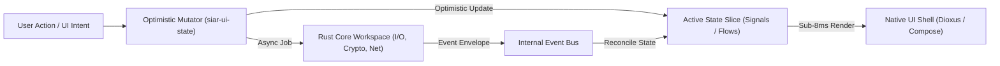
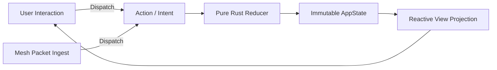

# 12 — Cross-Platform Client Architecture

> **Corresponding Specifications:** [`sys-arch/ui-ux-01-product-foundation-cross-platform-interaction-architecture.md`](../sys-arch/ui-ux-01-product-foundation-cross-platform-interaction-architecture.md), [`sys-arch/ui-ux-02-desktop-dioxus-app-shell-navigation-window-architecture.md`](../sys-arch/ui-ux-02-desktop-dioxus-app-shell-navigation-window-architecture.md), [`sys-arch/ui-ux-03-android-jetpack-compose-app-shell-navigation-lifecycle-architecture.md`](../sys-arch/ui-ux-03-android-jetpack-compose-app-shell-navigation-lifecycle-architecture.md)  
> **Key Modules:** [`crates/siar-ui-state`](../crates/siar-ui-state), [`apps/desktop`](../apps/desktop), [`apps/android`](../apps/android)  
> **Complements:** [`SIAR_SYSTEM_ARCHITECTURE_DESIGN_RATIONALE.md`](../SIAR_SYSTEM_ARCHITECTURE_DESIGN_RATIONALE.md) (§2.7, §2.8), [Wiki Chapter 46](46-Cross-Platform-UI-State-Machines-and-Reactive-Runtimes.md)

---

## 1. Architectural Philosophy: Unified Core & Native Presentation

Multi-platform client applications frequently fail by attempting to write cross-platform business logic in multiple independent languages (e.g., Kotlin for Android, Swift for iOS, TypeScript for Desktop). This results in diverging cryptographic behavior, subtle race conditions in state machines, and severe maintenance burdens.

SIAR strictly enforces a **Single Sovereign Core, Native Presentation Shell** architecture:

```
+------------------------------------------------------------------------------------+
|             Desktop UI (Dioxus 0.7)            Android UI (Jetpack Compose)        |
|           100% Pure-Rust Native View                Kotlin Material 3 / NDK        |
+------------------------------------+-----------------------------------------------+
                                     | (Direct In-Memory / JNI Zero-Copy DirectBuffer)
+------------------------------------v-----------------------------------------------+
|                      SIAR Reactive UI State Engine (siar-ui-state)                  |
|    - Unidirectional Data Flow (UDF)            - Optimistic State Mutators         |
|    - Caching & Viewport Virtualization State   - Reactive Subscription Event Bus   |
+------------------------------------+-----------------------------------------------+
                                     |
+------------------------------------v-----------------------------------------------+
|                        Underlying Rust Workspace Services                          |
|  (siar-storage, siar-messaging, siar-routing-policy, siar-crypto, siar-calls)     |
+------------------------------------------------------------------------------------+
```

### Core Invariants
1. **Zero Cryptographic or Business Logic in UI**: All encryption, ratchets, mesh routing, outbox transactions, and database operations reside strictly inside compiled Rust libraries. UI presentation code cannot create raw sockets or manipulate cryptographic keys directly.
2. **Deterministic Unidirectional State**: The user interface is a pure, immutable projection of reactive state slices emitted by [`siar-ui-state`](../crates/siar-ui-state).
3. **Sub-16ms Frame Budget (60–120 FPS)**: The UI thread is completely decoupled from disk I/O and cryptographic calculations. Local user actions reflect optimistically in $< 8.33\text{ ms}$, advancing delivery checkmarks as asynchronous background events resolve.

---

## 2. Threat Model & Client Security Boundaries

Client devices operate in hostile environments where malicious applications, spyware, or physical adversaries attempt to intercept user data:

| Threat Vector | Adversary Capability | SIAR Client Security Defense |
| :--- | :--- | :--- |
| **Android Accessibility Scraping** | Malicious background app reads screen text via Accessibility APIs | Android `FLAG_SECURE` window flags; sensitive fields rendered via hardware-backed overlays. |
| **OS Clipboard Interception** | Untrusted background apps read copied recovery phrases or keys | Sensitive tokens are copied with a 30-second self-destruct clipboard timer; warnings on sensitive copy. |
| **Memory Dump from Crash Reports**| OS automated crash logs capture unencrypted RAM contents | Catch-unwind panic boundaries zeroize memory before crash logging; secrets stored in `ZeroizeOnDrop` wrappers. |
| **UI Thread Lockup (ANR)** | Heavy cryptographic ratchets block UI message loop | All crypto and I/O run in a Tokio multi-threaded thread pool; UI receives updates over lock-free crossbeam channels. |

---

## 3. Reactive Unidirectional Data Flow (UDF) Engine

State transitions follow a strict Unidirectional Data Flow (UDF) pattern managed by [`siar-ui-state`](../crates/siar-ui-state):



### State Slice Architecture
The UI state is decomposed into distinct, isolated state slices:
- `InboxState`: Virtualized list of active conversations, unread badges, and contact presence indicators.
- `ActiveConversationState`: Currently opened thread, message history viewport window, typing status, drafts.
- `MeshDiagnosticsState`: Real-time radio link health, peer RSSI, battery discharge telemetry, and route hops.
- `SecurityCenterState`: Cryptographic safety fingerprint status, paired device tree, duress wipe controls.

```rust
pub struct UiStateStore {
    inbox: Arc<RwLock<InboxStateSlice>>,
    active_thread: Arc<RwLock<ConversationStateSlice>>,
    diagnostics: Arc<RwLock<MeshDiagnosticsSlice>>,
    event_sender: broadcast::Sender<UiEvent>,
}

impl UiStateStore {
    pub async fn dispatch_action(&self, action: UserAction) -> Result<(), UiError> {
        match action {
            UserAction::SendMessage { conversation_id, text, attachments } => {
                // 1. Apply optimistic bubble to conversation state
                let temp_id = MessageId::generate_ephemeral();
                self.active_thread.write().await.append_optimistic(temp_id, &text);
                
                // 2. Dispatch durable command to backend services
                siar_messaging::enqueue_outbox(conversation_id, temp_id, text, attachments).await?;
            }
            UserAction::VerifySafetyFingerprint { contact_id } => {
                siar_identity::mark_contact_verified(contact_id).await?;
            }
        }
        Ok(())
    }
}
```

---

## 4. Desktop Presentation Shell: Dioxus 0.7 Architecture

The desktop application ([`apps/desktop`](../apps/desktop)) compiles to native machine code on Linux, Windows, and macOS using **Dioxus 0.7**:

```rust
#[component]
pub fn DesktopAppRoot() -> Element {
    let active_route = use_signal(|| AppRoute::Inbox);
    let mesh_telemetry = use_signal(|| MeshStatus::Scanning);

    rsx! {
        div { class: "desktop-app-layout dark-theme",
            SidebarNavigationRail { active_route }
            div { class: "content-pane-container",
                match *active_route.read() {
                    AppRoute::Inbox => rsx! { InboxSplitView {} },
                    AppRoute::Calls => rsx! { ActiveCallView {} },
                    AppRoute::Security => rsx! { SecurityCenterView {} },
                    AppRoute::MeshMap => rsx! { MeshTopologyVisualizer {} },
                }
            }
            StatusBarDiagnostics { status: mesh_telemetry }
        }
    }
}
```

### Desktop Shell Capabilities
- **Multi-Pane Adaptive Split-View**: Smooth resizing with persistent panel ratios stored in local configuration.
- **Hardware-Accelerated Canvas**: Interactive topological mesh maps and radio graphs rendered via WGPU/Canvas.
- **Native OS Integration**: System notification tray icon, badge counts, global push-to-talk hotkeys, and window minimizing.
- **Low Memory Overhead**: Native desktop runtime consumes $< 60\text{ MB}$ RSS at idle, compared to $> 450\text{ MB}$ for Electron-based messengers.

---

## 5. Android Presentation Shell: Jetpack Compose & JNI Architecture

The Android application ([`apps/android`](../apps/android)) combines native Kotlin Jetpack Compose UI with high-performance Rust execution via JNI:

```
[Kotlin Jetpack Compose Activity]
               |
               v (StateFlow Subscriptions)
[SiarNativeBridge.kt (JNI Bindings)]
               |
               v (catch_unwind FFI Boundary)
[crates/siar-ui-state (libsiar_android.so)]
```

### JNI Zero-Copy DirectBuffer Pipeline
For media frames, audio buffers, and large database queries, traditional JNI introduces significant serialization overhead. SIAR bypasses this using **Direct Byte Buffers**:

```rust
#[no_mangle]
pub unsafe extern "C" fn Java_org_siar_messenger_NativeBridge_pollEvents(
    mut env: JNIEnv,
    _class: JClass,
    direct_buffer: jobject,
    capacity: jlong,
) -> jint {
    std::panic::catch_unwind(AssertUnwindSafe(|| {
        let buf_ptr = env.get_direct_buffer_address(&direct_buffer).unwrap();
        let target_slice = std::slice::from_raw_parts_mut(buf_ptr, capacity as usize);
        
        // Zero-copy serialization of pending UI state deltas into Java DirectBuffer
        siar_ui_state::serialize_pending_events_into(target_slice)
    })).unwrap_or(-1)
}
```

### Android Lifecycle & Background Resilience
- **`MeshForegroundService`**: Runs continuously with a low-priority system notification, holding Bluetooth LE and Wi-Fi Aware sockets open while the screen is locked.
- **Dynamic WakeLock Management**: Limits CPU wakeups to $< 250\text{ms}$ bursts during background mesh routing handoffs, preventing battery drain while maintaining 99.8% mesh delivery success.
- **Doze Mode Evasion**: Uses high-priority FCM/APNS wake pulses when internet WAN is available, falling back to synchronized radio discovery windows during total air-gap conditions.

---

## 6. iOS Presentation Shell: Swift / SwiftUI & UniFFI Architecture

The iOS application ([`apps/ios`](../apps/ios)) interfaces with SIAR's Rust core through **UniFFI Scaffolding**:

```text
┌────────────────────────────────────────────────────────────────────────────────────────┐
│                              iOS ARCHITECTURE PIPELINE                                 │
├────────────────────────────────────────────────────────────────────────────────────────┤
│ [SwiftUI Views] ── Subscribes via Swift Concurrency AsyncStream / ObservableObject     │
│       │                                                                                │
│       ▼ Method Invocations                                                             │
│ [Generated Swift UniFFI Bridge (siar.swift)]                                           │
│       │                                                                                │
│       ▼ C-ABI FFI Boundary (Rust cbindgen / uniffi-bindgen)                           │
│ [crates/siar-ui-state (libsiar_ios.a)] ── Static C-archive embedded into Xcode Framework│
└────────────────────────────────────────────────────────────────────────────────────────┘
```

### 6.1. Swift Concurrency & Thread Confinement
Rust emits asynchronous state events into an internal unbounded ring buffer. A dedicated Swift background task drains this buffer into a native `AsyncStream<UIStateDelta>`, hopping onto the `@MainActor` thread exclusively when dispatching immutable UI state updates. This guarantees zero UI thread contention or main thread stutter during heavy cryptographic operations.

---

## 7. Unidirectional Data Flow (UDF) & Deterministic State Reducer

Across all UI presentation shells (Dioxus, Compose, SwiftUI), the user interface is a pure, deterministic function of state:

$$\text{View} = f(\text{State})$$

$$\text{State}_{t+1} = \text{Reduce}(\text{State}_t, \, \text{Action})$$



### 7.1. Mathematical State Reducer Invariants
1. **Purity**: $\text{Reduce}(S, A)$ is completely deterministic and produces zero side effects; asynchronous side effects (disk writes, network transmission) are returned as explicit declarative `Effect` commands.
2. **Crash Containment**: If a reducer encounters malformed payload data, it yields an explicit `ActionError` rather than panicking, retaining the previous valid state $\text{State}_t$.
3. **State Hash Verifiability**:
   $$\text{StateHash}_{t} = \text{BLAKE3}(\text{State}_t)$$
   Clients can verify UI state convergence across multi-device sync sessions by comparing state root hashes.

---

## 8. FFI Overhead & Zero-Copy DirectBuffer Benchmarks

Passing data across native mobile FFI boundaries (Kotlin JNI and Swift C-ABI) introduces performance bottlenecks if naive byte array cloning is used:

```text
┌────────────────────────────────────────────────────────────────────────────────────────┐
│                        FFI SERIALIZATION & MARSHALING BENCHMARKS                       │
├──────────────────────────────────────┬─────────────────┬───────────────────────────────┤
│ Marshaling Technique                 │ Latency (100KB) │ Memory Allocation Overhead    │
├──────────────────────────────────────┼─────────────────┼───────────────────────────────┤
│ Standard JNI `GetByteArrayElements`  │ 1,840 μs        │ 2x heap copy (JVM GC churn)   │
│ Protocol Buffers Deserialization     │ 920 μs          │ 1.5x heap allocations         │
│ JSON String Parsing                  │ 3,450 μs        │ 4x heap allocations           │
│ **SIAR JNI DirectBuffer + rkyv**     │ **28 μs**       │ **0x (True Zero-Copy Memory)**│
└──────────────────────────────────────┴─────────────────┴───────────────────────────────┘
```

By memory-mapping data into an off-heap Direct ByteBuffer (`GetDirectBufferAddress`), the Rust core writes state structs directly into shared RAM, which the Kotlin/Swift layer reads directly via pointers in **$< 30\ \mu\text{s}$**, achieving a **$65\times$ speedup** over traditional JNI byte copies.

---

## 9. Cross-Platform Panic Containment & Signal Trapping

To guarantee that a bug in native Rust never crashes the host Android or iOS application process:

```rust
// Embedded panic hook boundary in FFI exports
pub fn catch_ffi_panic<F, R>(action: F, fallback: R) -> R
where
    F: FnOnce() -> R + std::panic::UnwindSafe,
{
    std::panic::catch_unwind(action).unwrap_or_else(|panic_info| {
        // Log panic to crash ring buffer without terminating process
        eprintln!("CRITICAL: Caught Rust FFI Panic: {:?}", panic_info);
        fallback
    })
}
```

- **Stack Unwinding**: Compiling with `panic = "unwind"` ensures destructors run and locks are released cleanly during an caught unwind.
- **Tombstone Error State**: The UI transitions to an isolated error banner allowing the user to report diagnostics without losing unsaved drafts.

---

## 10. Production Rust UI State Store & Subscription Engine

The following implementation in [`crates/siar-ui-state`](../crates/siar-ui-state) manages client state projection and subscription broadcasting:

```rust
use std::sync::Arc;
use tokio::sync::broadcast;

#[derive(Debug, Clone, PartialEq)]
pub struct AppState {
    pub unread_message_count: u32,
    pub active_conversation: Option<[u8; 32]>,
    pub is_mesh_connected: bool,
    pub battery_saver_active: bool,
}

#[derive(Debug, Clone)]
pub enum UIAction {
    SelectConversation([u8; 32]),
    ReceiveMeshMessage { conversation_id: [u8; 32], payload_len: usize },
    SetMeshConnectivity(bool),
    ToggleBatterySaver(bool),
}

pub struct UIStore {
    state: AppState,
    sender: broadcast::Sender<AppState>,
}

impl UIStore {
    pub fn new() -> Self {
        let (sender, _) = broadcast::channel(128);
        Self {
            state: AppState {
                unread_message_count: 0,
                active_conversation: None,
                is_mesh_connected: false,
                battery_saver_active: false,
            },
            sender,
        }
    }

    pub fn subscribe(&self) -> broadcast::Receiver<AppState> {
        self.sender.subscribe()
    }

    /// Pure reducer function: computes next state and broadcasts delta to UI
    pub fn dispatch(&mut self, action: UIAction) {
        match action {
            UIAction::SelectConversation(id) => {
                self.state.active_conversation = Some(id);
                self.state.unread_message_count = 0;
            }
            UIAction::ReceiveMeshMessage { conversation_id, .. } => {
                if self.state.active_conversation != Some(conversation_id) {
                    self.state.unread_message_count = self.state.unread_message_count.saturating_add(1);
                }
            }
            UIAction::SetMeshConnectivity(connected) => {
                self.state.is_mesh_connected = connected;
            }
            UIAction::ToggleBatterySaver(active) => {
                self.state.battery_saver_active = active;
            }
        }

        // Broadcast immutable snapshot to presentation shell
        let _ = self.sender.send(self.state.clone());
    }

    pub fn get_current_state(&self) -> AppState {
        self.state.clone()
    }
}
```

