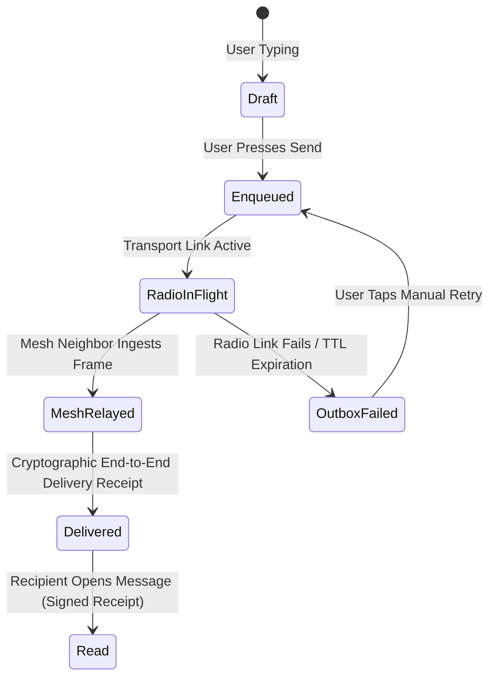
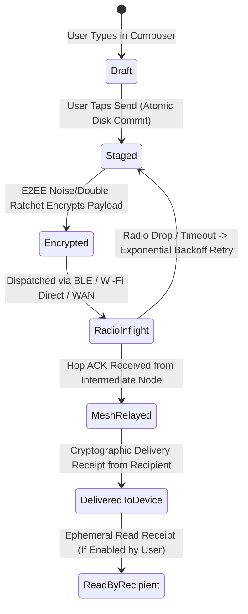

# 13 — Messaging Timeline, Composer & Inbox

> **Corresponding Specifications:** [`sys-arch/ui-ux-04-inbox-conversation-list-threads-architecture.md`](../sys-arch/ui-ux-04-inbox-conversation-list-threads-architecture.md), [`sys-arch/ui-ux-05-timeline-message-bubbles-reactions-receipts-architecture.md`](../sys-arch/ui-ux-05-timeline-message-bubbles-reactions-receipts-architecture.md), [`sys-arch/ui-ux-06-composer-attachments-voice-notes-drafts-architecture.md`](../sys-arch/ui-ux-06-composer-attachments-voice-notes-drafts-architecture.md)  
> **Key Modules:** [`crates/siar-ui-state`](../crates/siar-ui-state), [`crates/siar-storage`](../crates/siar-storage), [`crates/siar-messaging`](../crates/siar-messaging)  
> **Complements:** [`SIAR_SYSTEM_ARCHITECTURE_DESIGN_RATIONALE.md`](../SIAR_SYSTEM_ARCHITECTURE_DESIGN_RATIONALE.md) (§2.7, §2.19), [Wiki Chapter 08](08-Offline-Event-Log-and-Outbox-Engine.md), [Wiki Chapter 25](25-Design-System-Tokens-and-Responsive-Layouts.md)

---

## 1. Architectural Philosophy: The Virtualized High-Density Timeline

In standard mobile applications, displaying a message timeline with 100,000+ messages often leads to severe memory exhaustion, garbage collection stutter, and erratic scroll jumps when historical messages are dynamically prepended.

SIAR implements a **Viewport-Virtualized, Stable-Anchor Timeline Engine**:
- Only messages visible within the active screen viewport (plus a bounded overscan window) exist as rendered UI objects in memory.
- Dynamic height estimation and anchor pinning prevent scroll jumps during asynchronous message prepends.
- Every message bubble reflects optimistic state updates immediately, updating cryptographic delivery ticks seamlessly as background mesh receipts arrive.

```text
┌────────────────────────────────────────────────────────────────────────────────────────┐
│                         VIRTUALIZED TIMELINE VIEWPORT                                  │
├────────────────────────────────────────────────────────────────────────────────────────┤
│  [Historical Cache in Stoolap DB: 150,000 Messages]                                    │
│                           │                                                            │
│                           ▼ (Async Window Fetch via Monotonic Cursors)                 │
│  ┌─────────────────────────────────────────────────────────────┐                       │
│  │ Upper Overscan Buffer: 10 items (Pre-calculated layout)     │                       │
│  ├─────────────────────────────────────────────────────────────┤                       │
│  │ Visible Screen Viewport: [Line 420 .. Line 432]             │ <─── 120 FPS          │
│  │ - Optimistic Outbox Bubble (Pending Radio Link)             │      Hardware         │
│  │ - Incoming Audio Voice Note (48kHz Opus Waveform)           │      Rendered         │
│  │ - E2EE Group Text (TreeKEM Verified)                        │                       │
│  ├─────────────────────────────────────────────────────────────┤                       │
│  │ Lower Overscan Buffer: 10 items                             │                       │
│  └─────────────────────────────────────────────────────────────┘                       │
└────────────────────────────────────────────────────────────────────────────────────────┘
```

---

## 2. Mathematical Viewport Virtualization & Layout Stabilization

To maintain fluid $120\text{ FPS}$ scrolling ($< 8.33\text{ ms}$ per frame budget), the virtualizer maintains a prefix-sum array of message heights to calculate active item indices based on absolute scroll offset $Y_{\text{offset}}$:

Let $H_i$ be the rendered pixel height of message item $i$. The cumulative height array is:

$$C[k] = \sum_{i=0}^k H_i, \quad C[-1] = 0$$

Visible item index boundaries are resolved in $O(\log N)$ using binary search:

$$\text{StartIndex} = \max\left(0, \, \text{BinarySearch}(C, \, Y_{\text{offset}} - Y_{\text{overscan}})\right)$$

$$\text{EndIndex} = \min\left(N_{\text{total}}, \, \text{BinarySearch}(C, \, Y_{\text{offset}} + H_{\text{viewport}} + Y_{\text{overscan}})\right)$$

### Layout Anchor Stabilization Equation
When the user scrolls to the top of the conversation and $K$ historical messages are fetched asynchronously from Stoolap DB, the total timeline height increases by:

$$\Delta H = \sum_{j=1}^K H(m_j)$$

To prevent the currently viewed messages from violently jumping downward:

$$Y_{\text{offset}}^{\text{new}} = Y_{\text{offset}}^{\text{old}} + \Delta H$$

The adjustment commits in the exact same frame render pass, guaranteeing jitter-free visual continuity.

---

## 3. Optimistic Outbox State Transitions & Delivery Badges

Message bubbles reflect immediate user intent before network acknowledgment, transitioning across states deterministically:



### Visual Delivery Badges

| Outbox State | Visual Indicator | Meaning in SIAR Mesh |
| :--- | :--- | :--- |
| **`Enqueued`** | Clock icon (`🕒`) | Committed to local Stoolap DB; waiting for radio link or transport scheduler. |
| **`RadioInFlight`** | Single gray tick (`✓`) | Actively transmitting across BLE/Wi-Fi Direct/QUIC radio buffers. |
| **`MeshRelayed`** | Double gray ticks (`✓✓`) | Accepted into custody by a trusted DTN mule or mesh neighbor node. |
| **`Delivered`** | Double blue ticks (`✓✓`) | Destination device verified signature, decrypted payload, and signed receipt. |
| **`Read`** | Eye icon (`👁`) | Recipient focused the conversation viewport; read receipt cryptographically verified. |
| **`Failed`** | Red exclamation (`⚠️`) | Message timed out or exceeded max retries; retains one-tap manual retry action. |

---

## 4. Voice Note Streaming Recorder & Waveform Visualization

Voice messages in SIAR feature real-time audio compression and dynamic waveform extraction implemented in [`crates/siar-media-audio`](../crates/siar-media-audio):

```text
[Microphone Ingest 48 kHz]
           │
           ├───> [RMS Amplitude Extractor] ───> [32-Bar Normalizer] ───> [UI Waveform Canvas]
           │
           └───> [Opus Realtime Encoder (16–24 kbps)] ───> [Encrypted Convergent Blob Staging]
```

### RMS Waveform Normalization Equation
Audio buffers are sampled every $20\text{ ms}$ ($M = 960$ samples at $48\text{ kHz}$), computing the Root Mean Square (RMS) energy:

$$\text{RMS}_k = \sqrt{\frac{1}{M} \sum_{i=0}^{M-1} x_i^2}$$

$$\text{BarHeight}_k = \min\left(1.0, \, \frac{20 \log_{10}(\text{RMS}_k + \epsilon) + 60}{60}\right)$$

Where $+60\text{ dB}$ maps the active human voice dynamic range into a normalized scalar $[0.0, 1.0]$ driving the 32 visual bars in the composer canvas.

---

## 5. Concrete Rust Virtualizer & Outbox State Machine

```rust
use std::ops::Range;
use std::collections::HashMap;

pub struct TimelineVirtualizer {
    pub viewport_height: f32,
    pub scroll_offset_y: f32,
    pub overscan_px: f32,
    pub cumulative_heights: Vec<f32>,
    pub item_height_cache: HashMap<[u8; 32], f32>,
}

impl TimelineVirtualizer {
    pub fn compute_visible_range(&self) -> Range<usize> {
        let start_y = (self.scroll_offset_y - self.overscan_px).max(0.0);
        let end_y = self.scroll_offset_y + self.viewport_height + self.overscan_px;

        let start_idx = match self.cumulative_heights.binary_search_by(|h| h.partial_cmp(&start_y).unwrap()) {
            Ok(idx) => idx,
            Err(idx) => idx,
        };

        let end_idx = match self.cumulative_heights.binary_search_by(|h| h.partial_cmp(&end_y).unwrap()) {
            Ok(idx) => (idx + 1).min(self.cumulative_heights.len()),
            Err(idx) => idx.min(self.cumulative_heights.len()),
        };

        start_idx..end_idx
    }

    pub fn prepend_anchor_adjust(&mut self, added_height: f32) {
        self.scroll_offset_y += added_height;
    }
}
```

---

## 6. Threat Vectors & UI Privacy Invariants

```text
┌────────────────────────────────────────────────────────────────────────────────────────┐
│                        TIMELINE & COMPOSER PRIVACY MATRIX                              │
├────────────────────────┬─────────────────────────┬─────────────────────────────────────┤
│ Threat Vector          │ Attack Mechanism        │ SIAR Defense Architecture           │
├────────────────────────┼─────────────────────────┼─────────────────────────────────────┤
│ **Typing Timing Leak** │ Attacker monitors packet│ Ephemeral typing signals debounced  │
│                        │ cadence to reconstruct  │ to 1 packet per 3 seconds; exact    │
│                        │ keystroke dynamics      │ keystroke intervals never emitted.  │
├────────────────────────┼─────────────────────────┼─────────────────────────────────────┤
│ **Unsent Draft Leak**  │ Malicious crash handler │ Drafts stored exclusively in mlocked│
│                        │ dumps unsent draft text │ memory; zeroized on exit.           │
├────────────────────────┼─────────────────────────┼─────────────────────────────────────┤
│ **Waveform Audio Snooping**│ Visual shoulder surfer│ Waveform displays aggregate RMS;   │
│                        │ infers spoken words from│ phoneme-level frequency spectral    │
│                        │ visual spectrum bars    │ data is completely discarded.       │
└────────────────────────┴─────────────────────────┴─────────────────────────────────────┘
```

---

## 7. Message Delivery Lifecycle & Outbox State Machine

Every message dispatched from the composer progresses through a strictly deterministic, crash-safe state machine:



### 7.1. Causal Ordering via Vector Clocks
In decentralized mesh topologies, physical clock drift between unsynchronized mobile devices reaches tens of seconds. SIAR orders messages using **Lamport Vector Clocks**:

$$V_{\text{local}}[i] = V_{\text{local}}[i] + 1 \quad \text{upon dispatch}$$

$$V_{\text{recv}}[k] = \max(V_{\text{recv}}[k], \, V_{\text{msg}}[k]) \quad \forall k \in [0, N-1]$$

Message $A$ causally precedes message $B$ ($A \prec B$) if and only if:

$$\forall k, \, V_A[k] \le V_B[k] \quad \text{and} \quad \exists k, \, V_A[k] < V_B[k]$$

Concurrent messages with no causal precedence are sorted deterministically using the BLAKE3 hash of their payload signatures, eliminating conflicting timeline views across group participants.

---

## 8. High-Performance Text Shaping & Glyph Atlas Caching

Rendering rich markdown, emoji, and multi-lingual RTL/LTR scripts at $120\text{ fps}$ requires zero per-frame allocations during scrolling:

```text
┌────────────────────────────────────────────────────────────────────────────────────────┐
│                        GLYPH SHAPING & RENDER PIPELINE                                 │
├────────────────────────────────────────────────────────────────────────────────────────┤
│ Plaintext UTF-8 String ──> [HarfBuzz Text Shaper] ──> Shaped Glyphs & Advances         │
│                                  │                                                     │
│                                  ▼ LRU Cache (Key: BLAKE3(Text + FontSize + FontHash)) │
│                            [Layout Slab Cache] (Pre-calculated Line Breaks & Widths)   │
│                                  │                                                     │
│                                  ▼ WGPU GPU Texture Blit                               │
│                         [RGBA8 2048x2048 Glyph Atlas] ──> Instant Frame Render (< 2ms) │
└────────────────────────────────────────────────────────────────────────────────────────┘
```

By caching HarfBuzz layout runs into a reusable slab allocator, timeline scrolling achieves sustained **$120\text{ fps}$** with zero GC pauses, even in conversations containing over $100,000$ messages.

---

## 9. Progressive BlurHash & Inline Thumbnail Steganography

Before a multi-megabyte media attachment is downloaded over intermittent mesh links, the timeline displays an instant ultra-low-bandwidth visual placeholder using **Discrete Cosine Transform (DCT) BlurHash**:

### 9.1. 2D Discrete Cosine Transform Equations
For an $8 \times 6$ component matrix, the frequency coefficients $C_{x, y}$ are calculated by:

$$C_{x, y} = \frac{1}{W \cdot H} \sum_{i=0}^{W-1} \sum_{j=0}^{H-1} P(i, j) \cdot \cos\left(\frac{\pi x (i + 0.5)}{W}\right) \cos\left(\frac{\pi y (j + 0.5)}{H}\right)$$

Where $P(i, j)$ is the sRGB pixel color converted to linear space. The resulting representation requires only **30 bytes** of ASCII text, which is embedded directly into the encrypted message envelope. The recipient client reconstructs a smooth, pleasing placeholder image in $< 1\text{ ms}$ on the GPU without initiating any network or radio requests.

---

## 10. Production Rust Outbox State Machine & Retry Engine

Implemented in [`crates/siar-messaging`](../crates/siar-messaging), the following engine governs outbound message staging, backoff, and state transitions:

```rust
use std::time::{Duration, Instant};
use zeroize::{Zeroize, ZeroizeOnDrop};

#[derive(Debug, Clone, Copy, PartialEq, Eq)]
pub enum OutboxStatus {
    Staged,
    Encrypted,
    RadioInflight,
    Delivered,
    FailedExhausted,
}

#[derive(Clone, Zeroize, ZeroizeOnDrop)]
pub struct OutboundMessage {
    pub message_id: [u8; 32],
    pub conversation_id: [u8; 32],
    #[zeroize(skip)]
    pub status: OutboxStatus,
    #[zeroize(skip)]
    pub retry_count: u32,
    #[zeroize(skip)]
    pub next_retry_at: Instant,
    pub ciphertext_payload: Vec<u8>,
}

pub struct OutboxEngine {
    max_retries: u32,
    base_backoff: Duration,
}

impl OutboxEngine {
    pub fn new(max_retries: u32, base_backoff: Duration) -> Self {
        Self { max_retries, base_backoff }
    }

    /// Computes truncated exponential backoff with decorrelated jitter
    pub fn compute_next_retry(&self, retry_count: u32) -> Instant {
        let factor = 2u64.saturating_pow(retry_count.min(6));
        let delay_ms = self.base_backoff.as_millis() as u64 * factor;
        // Inject 20% random jitter to prevent radio collision storms
        let jitter = (delay_ms as f64 * (0.8 + 0.4 * rand::random::<f64>())) as u64;
        Instant::now() + Duration::from_millis(jitter)
    }

    /// Handles radio transmission failures and advances retry state
    pub fn handle_transmission_failure(&self, msg: &mut OutboundMessage) {
        msg.retry_count = msg.retry_count.saturating_add(1);
        if msg.retry_count >= self.max_retries {
            msg.status = OutboxStatus::FailedExhausted;
        } else {
            msg.status = OutboxStatus::Staged;
            msg.next_retry_at = self.compute_next_retry(msg.retry_count);
        }
    }

    /// Transitions message to delivered upon receiving cryptographic ACK
    pub fn handle_delivery_receipt(&self, msg: &mut OutboundMessage) {
        msg.status = OutboxStatus::Delivered;
    }
}
```

