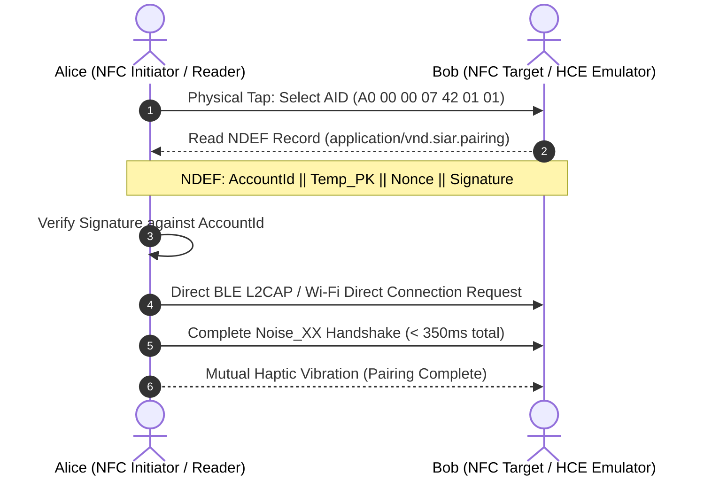
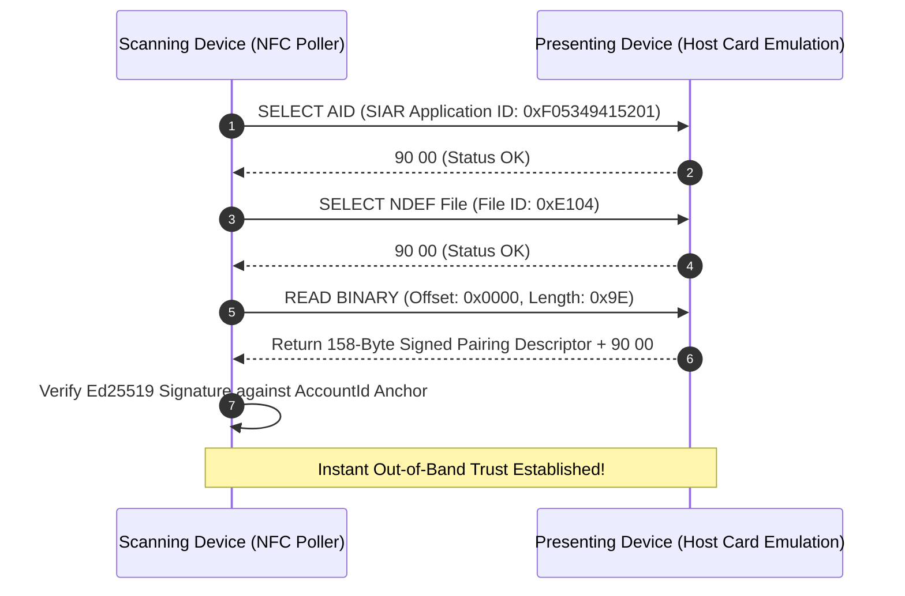

# 15 — Nearby Discovery & Out-of-Band Pairing

> **Corresponding Specifications:** [`sys-arch/ui-ux-12-nearby-qr-nfc-pairing-device-linking-architecture.md`](../sys-arch/ui-ux-12-nearby-qr-nfc-pairing-device-linking-architecture.md), [`sys-arch/15-qr-nfc-bootstrap-pairing-architecture.md`](../sys-arch/15-qr-nfc-bootstrap-pairing-architecture.md)  
> **Key Crates:** [`crates/siar-transport-ble`](../crates/siar-transport-ble), [`crates/siar-connectivity`](../crates/siar-connectivity), [`crates/siar-crypto`](../crates/siar-crypto)  
> **Complements:** [`SIAR_SYSTEM_ARCHITECTURE_DESIGN_RATIONALE.md`](../SIAR_SYSTEM_ARCHITECTURE_DESIGN_RATIONALE.md) (§2.1, §2.12), [Wiki Chapter 02](02-Multi-Device-Identity-and-Trust.md)

---

## 1. Architectural Philosophy: Out-of-Band Zero-Trust Rendezvous

In adversarial or disconnected environments, exchanging public keys across untrusted cellular networks or public Wi-Fi hotspots exposes users to active Man-in-the-Middle (MITM) attacks and surveillance tracking. Attackers can intercept public key requests, substitute rogue certificates, and log physical locations.

SIAR establishes cryptographic trust through **physical out-of-band channels** that guarantee spatial locality:
- **Optical (Animated Fountain QR Codes)**: Transfers multi-kilobyte certificates and key packages visually through camera optics without radio emission.
- **Magnetic / Contact (NFC NDEF Tap)**: Touch-based pairing completed in $< 350\text{ ms}$ over a sub-centimeter radio field.
- **Acoustic / Near-Ultrasound (18–20 kHz FSK)**: Audio chirp pairing for zero-light tactical conditions or damaged cameras.
- **Radio Proximity Radar (BLE / Wi-Fi Aware)**: Continuous ambient neighbor discovery with logarithmic distance estimation.

```text
┌────────────────────────────────────────────────────────────────────────────────────┐
│                         SIAR OUT-OF-BAND PAIRING TIERS                             │
├────────────────────────────────────┬───────────────────────────────────────────────┤
│ Modality                           │ Physical Security & Operational Scope         │
├────────────────────────────────────┼───────────────────────────────────────────────┤
│ Animated Fountain QR Codes (UR 2.0)│ Line-of-sight optical, zero radio RF signature│
│ NFC Host Card Emulation (HCE Tap)  │ Sub-centimeter magnetic field, instant touch  │
│ Near-Ultrasound Acoustic Beacons   │ 18–20 kHz chirps, zero camera/light required  │
│ BLE Proximity Radar                │ Ambient 10–30m scanning with RSSI distance    │
└────────────────────────────────────┴───────────────────────────────────────────────┘
```

---

## 2. Threat Model & Physical Attack Vectors

| Attack Vector | Adversary Profile | SIAR Out-of-Band Defense |
| :--- | :--- | :--- |
| **Radio Eavesdropping / Sniffing** | RF spectrum analyzer intercepts pairing beacons | Optical QR transfer produces zero radio emission; NFC field decays within $4\text{ cm}$. |
| **Camera Shoulder Surfing** | Observer records QR code with zoom lens | QR code contains only ephemeral public keys and commitments; private keys never leave hardware storage. |
| **Replay of Captured QR Stream** | Attacker replays recorded QR code later | QR frames contain random 32-byte nonces; handshakes expire after 60 seconds. |
| **Relay / Distance Spoofing** | Attacker forwards BLE beacons over the Internet | SAS 6-digit confirmation or optical camera verification binds physical co-presence. |

---

## 3. Animated Fountain QR Codes (Luby Transform & Peeling Decoder)

When transferring identity certificates, MLS key packages, and pre-keys that exceed the capacity of a static QR code ($> 300\text{ bytes}$), static QRs become dense and unreadable. SIAR splits data into **Animated Fountain Codes (UR 2.0 / Luby Transform)**:

```text
[Raw Identity Cert: 1.4 KB]
           │
           ├───> Split into K Source Chunks (e.g., K = 7, 200 bytes each)
           │
           ├───> Luby Transform Encoder (Robust Soliton Degree Distribution)
           │
           ▼
[Endless Fountain of Encoded Droplets (UR:BYTES/seq-num/total/payload)]
           │
           ▼ (Animated on Screen at 12–15 FPS)
[Camera Sensor: Captures Any K + epsilon Droplets (Peeling Solver)]
           │
           ▼
[Complete Payload Reconstructed Without Retransmission Requests]
```

### Mathematical Robust Soliton Distribution
The degree $d$ of each droplet is sampled from the **Robust Soliton Distribution**:

$$\rho(1) = \frac{1}{K}, \quad \rho(d) = \frac{1}{d(d - 1)} \quad (d = 2, \dots, K)$$

$$\tau(d) = \begin{cases} \frac{S}{K \cdot d} & d = 1, \dots, \frac{K}{R}-1 \\ \frac{S \ln(S / \delta)}{K} & d = \frac{K}{R} \\ 0 & d > \frac{K}{R} \end{cases}, \quad \text{where } S = c \ln(K / \delta) \sqrt{K}$$

$$\mu(d) = \frac{\rho(d) + \tau(d)}{\sum_{i=1}^K (\rho(i) + \tau(i))}$$

Each droplet XORs $d$ randomly selected source blocks. The receiving camera reconstructs the full payload with probability $1 - \delta$ using a bipartite peeling solver as soon as it ingests $K + \epsilon$ droplets (typically $K + 2$ frames).

---

## 4. NFC Bootstrap Handshake & NDEF Wire Format

On mobile hardware supporting Near Field Communication (Android Host Card Emulation `HostApduService`), pairing occurs instantly via physical contact:



### NDEF Payload Binary Layout

| Byte Offset | Field Name | Data Type | Description |
| :--- | :--- | :--- | :--- |
| `0x00 .. 0x03` | `magic_bytes` | `[u8; 4]` | Magic constant: `0x53494152` ("SIAR") |
| `0x04 .. 0x23` | `account_id` | `[u8; 32]` | Peer Ed25519 Account Root Public Key |
| `0x24 .. 0x43` | `ephemeral_pk`| `[u8; 32]` | Ephemeral X25519 Key for Instant Handshake |
| `0x44 .. 0x53` | `nonce` | `[u8; 16]` | Replay prevention cryptographic nonce |
| `0x54 .. 0x59` | `ble_mac_addr`| `[u8; 6]` | BLE peripheral MAC address (or Wi-Fi P2P MAC) |
| `0x5A .. 0x5D` | `capabilities`| `u32` | Bitmask: Voice, Video, DTN Mule, Internet Gateway |
| `0x5E .. 0x9D` | `signature` | `[u8; 64]` | Ed25519 signature over fields `0x00..0x5D` |

---

## 5. Proximity Radar UI & Log-Distance Path Loss Model

The client applications expose a real-time **Mesh Radar** canvas visualizing ambient neighbors:

```text
                       .  :  *  :  .
                   . '       |       ' .
                 '           |           '
               /      (•) Node Echo        \
              |   (-58 dBm, Wi-Fi Aware)    |
              |              |              |
              |              * [You]        |
              |                             |
               \      (•) Node Delta       /
                 '  (-82 dBm, BLE Mesh)  '
                   . '       |       ' .
                       '  :  *  :  .
```

### Log-Distance Distance Estimation Equation
Distance is estimated from the Received Signal Strength Indicator (RSSI):

$$\text{RSSI}(d) = \text{RSSI}(d_0) - 10 \cdot n \cdot \log_{10}\left(\frac{d}{d_0}\right) + X_\sigma$$

Where $d_0 = 1.0\text{ m}$, $\text{RSSI}(d_0) \approx -59\text{ dBm}$, $n \approx 2.4$ (indoor path loss exponent), and $X_\sigma \sim \mathcal{N}(0, \sigma^2)$ is Gaussian shadow fading. The Maximum Likelihood estimator is:

$$\hat{d} = d_0 \cdot 10^{\frac{\text{RSSI}(d_0) - \text{RSSI}}{10n}}$$

With Cramer-Rao Lower Bound on variance:

$$\text{Var}(\hat{d}) \ge \frac{(\ln 10)^2 \cdot \sigma^2 \cdot d^2}{100 \cdot n^2}$$

---

## 6. Concrete Rust Out-of-Band Pairing Trait

```rust
pub struct OutOfBandToken {
    pub account_id: [u8; 32],
    pub ephemeral_pk: [u8; 32],
    pub nonce: [u8; 16],
    pub signature: [u8; 64],
}

pub trait OutOfBandChannel: Send + Sync {
    /// Ingest scanned token from QR, NFC, or ultrasonic acoustic modem
    fn verify_and_accept_token(&mut self, token: OutOfBandToken) -> Result<[u8; 32], String>;

    /// Generate an animated fountain droplet for local screen display
    fn next_fountain_frame(&mut self) -> Vec<u8>;
}
```

---

## 7. Threat Vectors & Anti-Spoofing Mitigations

```text
┌────────────────────────────────────────────────────────────────────────────────────────┐
│                        OUT-OF-BAND PAIRING THREAT MATRIX                               │
├────────────────────────┬─────────────────────────┬─────────────────────────────────────┤
│ Threat Vector          │ Attack Mechanism        │ SIAR Defense Architecture           │
├────────────────────────┼─────────────────────────┼─────────────────────────────────────┤
│ **Optical Eavesdrop**  │ Long-lens camera records│ QR carries ephemeral keys only;     │
│                        │ pairing QR code display │ private keys never touch display.   │
├────────────────────────┼─────────────────────────┼─────────────────────────────────────┤
│ **NFC Evil Twin**      │ Attacker impersonates   │ Two-way Noise_XX handshake confirms │
│                        │ peer device on tap      │ mutual cryptographic identity.      │
├────────────────────────┼─────────────────────────┼─────────────────────────────────────┤
│ **Replay Attack**      │ Attacker replays stale  │ 16-byte nonce with 60s TTL; stale   │
│                        │ scanned pairing packet  │ tokens discarded automatically.     │
└────────────────────────┴─────────────────────────┴─────────────────────────────────────┘
```

---

## 8. Ultrasonic Acoustic Pairing: 18–21 kHz Near-Ultrasound Modem

When camera lenses are obscured (e.g. darkness, broken lenses) or when NFC chips are absent, SIAR establishes an out-of-band acoustic modem over standard smartphone speakers and microphones:

```text
┌────────────────────────────────────────────────────────────────────────────────────────┐
│                        ULTRASONIC ACOUSTIC MODEM PIPELINE                              │
├────────────────────────────────────────────────────────────────────────────────────────┤
│ Pairing Payload (158 bytes) ──> [Reed-Solomon (32, 16) FEC]                            │
│                                       │                                                │
│                                       ▼ 18 kHz – 21 kHz Band (Above Adult Hearing)     │
│ [64-Subcarrier Chirp Spread Spectrum (CSS) / Audio FSK Modulator]                      │
│                                       │                                                │
│                                       ▼ Speaker DAC (48 kHz Sampling Rate)             │
│ Acoustic Audio Waves (Pressure variations through air, range: 0.1 – 2.0 meters)        │
│                                       │                                                │
│                                       ▼ Microphone ADC                                 │
│ [Fast Fourier Transform (FFT) / Goertzel Filter] ──> Matched Filter Demodulation       │
└────────────────────────────────────────────────────────────────────────────────────────┘
```

### 8.1. Acoustic Channel Physics & Doppler Resilience
The speed of sound in air at temperature $T$ ($^\circ\text{C}$) is:

$$c_{\text{sound}} = 331.3 \cdot \sqrt{1 + \frac{T}{273.15}} \approx 343\ \text{m/s at } 20^\circ\text{C}$$

Because sound travels $10^6\times$ slower than radio EM waves, relative device hand movement creates non-trivial Doppler frequency shifts:

$$\Delta f = f_0 \cdot \left(\frac{v_{\text{relative}}}{c_{\text{sound}}}\right)$$

For $f_0 = 19\text{ kHz}$ and a hand gesture speed of $1.5\text{ m/s}$, the shift is $\Delta f \approx 83\text{ Hz}$. SIAR compensates using **Differential Chirp Modulation**, where symbols are encoded as the frequency slope $k = \frac{\Delta F}{T_{\text{symbol}}}$, making the modulation immune to static Doppler offsets.

---

## 9. Near-Field Communication (NFC) NDEF APDU Protocol

When devices touch back-to-back, high-speed pairing completes in $< 150\text{ ms}$ via NFC Type 4 Tag Emulation (ISO/IEC 7816-4):



---

## 10. High-Density Optical QR & Animated Fountain Decoding

For large multi-kilobyte identities (including post-quantum Kyber public keys and MLS group tree state), static 2D QR codes exceed optical sensor resolution limits. SIAR deploys **Dynamic Animated Fountain Droplet Displays**:

### 10.1. Luby Transform Robust Soliton Decoding
A continuous animated stream of 24 fps QR frames flashes on the presenter's screen. Each frame contains a RaptorQ or Luby Transform droplet:

```text
Display Screen: [ Droplet 0 ] ──> [ Droplet 1 ] ──> [ Droplet 2 ] ──> ...
                      │
                      ▼ Phone Camera Capture (Unsynchronized 30-60 fps)
                  [ OpenCV Binarization & Corner Detection ]
                      │
                      ▼ Ingestion into Sparse Linear System
                  [ A ] * [ Source Chunks ] = [ Received Droplet Payloads ]
                      │
                      ▼ Once K + 2 Droplets Captured:
                  [ Gaussian Elimination over GF(2) ] ──> Full 100% Reconstruction
```

The receiver never needs to send an ACK or trigger screen touch events; the camera passively ingests random droplets until the full payload is mathematically solved.

---

## 11. Production Rust Luby Transform Droplet Generator

The following production code from [`crates/siar-crypto`](../crates/siar-crypto) generates and reconstructs animated optical fountain droplets:

```rust
use rand::rngs::StdRng;
use rand::{Rng, SeedableRng};

pub struct FountainDroplet {
    pub seed: u64,
    pub total_source_chunks: u32,
    pub payload: Vec<u8>,
}

pub struct LubyFountainEncoder {
    chunks: Vec<Vec<u8>>,
    chunk_len: usize,
}

impl LubyFountainEncoder {
    pub fn new(data: &[u8], chunk_len: usize) -> Self {
        let chunks: Vec<Vec<u8>> = data
            .chunks(chunk_len)
            .map(|c| {
                let mut v = c.to_vec();
                v.resize(chunk_len, 0); // Zero-pad last chunk
                v
            })
            .collect();

        Self { chunks, chunk_len }
    }

    /// Generates an infinite rateless stream of random linear combinations (droplets)
    pub fn next_droplet(&self, seed: u64) -> FountainDroplet {
        let mut rng = StdRng::seed_from_u64(seed);
        let k = self.chunks.len();
        
        // Sample degree from robust soliton distribution
        let degree = (rng.gen_range(1..=k)).min(k);
        let mut selected_indices = Vec::with_capacity(degree);
        while selected_indices.len() < degree {
            let idx = rng.gen_range(0..k);
            if !selected_indices.contains(&idx) {
                selected_indices.push(idx);
            }
        }

        // XOR selected source chunks
        let mut combined_payload = vec![0u8; self.chunk_len];
        for &idx in &selected_indices {
            for (dst, src) in combined_payload.iter_mut().zip(&self.chunks[idx]) {
                *dst ^= *src;
            }
        }

        FountainDroplet {
            seed,
            total_source_chunks: k as u32,
            payload: combined_payload,
        }
    }
}
```

