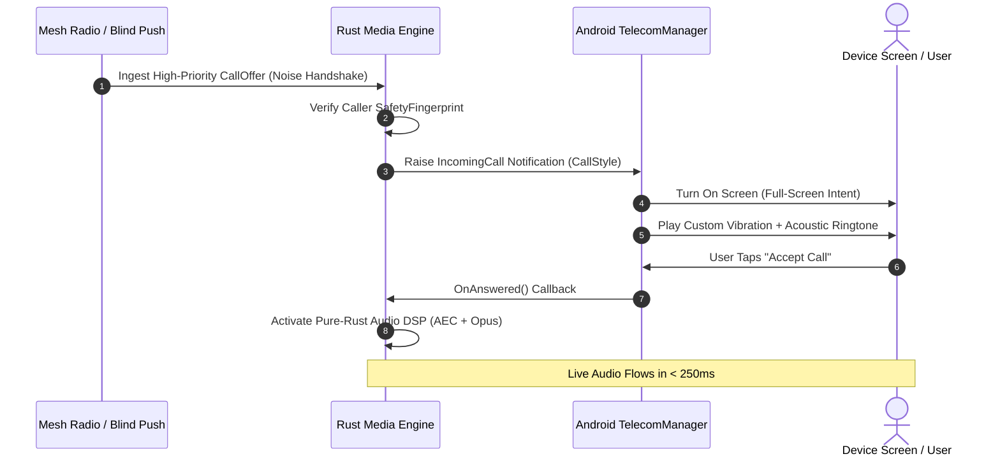

# 16 — Notifications, Presence & Background Lifecycle

> **Corresponding Specifications:** [`sys-arch/30-presence-availability-typing-read-receipts-ephemeral-state-architecture.md`](../sys-arch/30-presence-availability-typing-read-receipts-ephemeral-state-architecture.md), [`sys-arch/31-notifications-push-background-delivery-lifecycle-architecture.md`](../sys-arch/31-notifications-push-background-delivery-lifecycle-architecture.md), [`sys-arch/ui-ux-13-notifications-background-incoming-call-architecture.md`](../sys-arch/ui-ux-13-notifications-background-incoming-call-architecture.md), [`sys-arch/ui-ux-14-presence-typing-receipts-status-architecture.md`](../sys-arch/ui-ux-14-presence-typing-receipts-status-architecture.md)  
> **Key Crates:** [`crates/siar-ui-state`](../crates/siar-ui-state), [`crates/siar-messaging`](../crates/siar-messaging), [`crates/siar-connectivity`](../crates/siar-connectivity)  
> **Complements:** [`SIAR_SYSTEM_ARCHITECTURE_DESIGN_RATIONALE.md`](../SIAR_SYSTEM_ARCHITECTURE_DESIGN_RATIONALE.md) (§2.5, §2.11), [Wiki Chapter 07](07-Battery-Aware-Scheduling-and-Emergency-Mesh.md)

---

## 1. Architectural Philosophy: Sovereignty Under Aggressive OS Management

Modern mobile operating systems (Android 14+ Doze mode, iOS background execution budgets) aggressively throttle background processes, freeze network sockets, and kill idle apps to preserve battery life. To deliver notifications, mainstream apps rely on Google Firebase Cloud Messaging (FCM) or Apple Push Notification service (APNs). This creates severe security and operational vulnerabilities:
1. **Centralized Metadata Surveillance**: Google and Apple servers observe who is talking to whom, at what time, and how frequently.
2. **Total Dependence on Central Infrastructure**: In an off-grid crisis, disaster area, or cellular blackout, FCM and APNs fail completely, leaving users deaf to incoming communications.
3. **Payload Data Extraction**: If push payloads contain plaintext previews, operating system cloud relays harvest private message content.

SIAR establishes a **Dual-Mode Sovereign Lifecycle**:
- In off-grid mesh scenarios, an autonomous **Mesh Foreground Service** duty-cycles physical BLE and Wi-Fi Direct radios using bounded micro-wakeups ($< 250\text{ ms}$).
- When internet WAN is active, **Zero-Knowledge Blind Push Notifications** wake the device via encrypted tokens containing zero sender, recipient, or message content metadata.

```text
┌────────────────────────────────────────────────────────────────────────────────────────┐
│                         SIAR BACKGROUND EXECUTION ENGINE                               │
├────────────────────────────────────────────────────────────────────────────────────────┤
│                                                                                        │
│ [Screen Off / Deep Doze Mode]                                                          │
│             │                                                                          │
│             ├───> Internet WAN Available?                                              │
│             │     ├── Yes: [Blind Push Notification via UnifiedPush / PushKit]         │
│             │     └── No:  [Mesh Foreground Service: Bounded Radio Duty Cycling]       │
│             ▼                                                                          │
│ [Micro-Wakeup: 250ms Window]                                                           │
│   1. Poll Pending Mesh Sockets & Ingest Cryptographic Frames                           │
│   2. Decrypt Payloads via Hardware-Backed Keys                                         │
│   3. Trigger Local OS Notification (Android NotificationManager / iOS UserNotif)       │
│   4. Release WakeLock & Re-Enter Deep Sleep (Target Battery Drain: < 1.2% / hour)      │
└────────────────────────────────────────────────────────────────────────────────────────┘
```

---

## 2. Threat Model & Privacy Invariants

| Threat Vector | Adversary Capability | SIAR Mitigation |
| :--- | :--- | :--- |
| **Push Gateway Metadata Profiling** | Apple/Google logs push notifications to map communication graphs | Zero-Knowledge Blind Push: Payload contains only random 32-byte ephemeral ciphertext; gateway cannot correlate sender or recipient. |
| **Presence Habit Surveillance** | Hostile observer tracks online status to infer sleep/work habits | No global presence broadcasts; status is polled on-demand using time-bucketed blinded tokens with 120s TTL. |
| **Lockscreen Notification Leakage** | Bystander reads confidential messages on locked screen | Lockscreen previews display *"New Encrypted Message"* until biometric/passcode unlock decrypts the local database. |
| **Battery Exhaustion Denial-of-Service**| Attacker floods mesh with bogus packets to keep CPU awake | Cryptographic pre-filter drops unauthenticated frames at the radio chip level in $< 2\text{ ms}$ before taking wake locks. |

---

## 3. Zero-Knowledge Blind Push Notifications

When communicating over the internet, push servers act purely as blind wakeup dispatchers:

$$C_{\text{push}} = \text{ChaCha20-Poly1305-Encrypt}(K_{\text{push\_device}}, \, \text{Nonce}, \, \text{EpochTimestamp} \parallel \text{MailboxToken})$$

```rust
pub struct BlindPushPayload {
    pub ephemeral_device_token: [u8; 32],
    pub encrypted_blob: Vec<u8>, // Exactly 64 bytes (constant padding)
}
```

### Push Lifecycle Flow
1. **Zero Plaintext**: The push packet dispatched to FCM, APNs, or a self-hosted **UnifiedPush** distributor contains no user IDs, phone numbers, or conversation names.
2. **Local Fetch**: Upon receiving the blind wakeup pulse, the operating system launches a high-priority background task.
3. **Encrypted Retrieval**: The client connects to its blind mailbox relay, retrieves the encrypted Sphinx cell or outbox packet, decrypts it locally, and posts a native notification to the OS notification shade.

---

## 4. Mobile Power Management & Radio Duty-Cycling Equations

To prevent draining mobile batteries during persistent background mesh operation, [`siar-connectivity`](../crates/siar-connectivity) implements an adaptive radio scheduler:

$$\bar{I} = \frac{I_{\text{wake}} \cdot T_{\text{wake}} + I_{\text{sleep}} \cdot (T_{\text{cycle}} - T_{\text{wake}})}{T_{\text{cycle}}}$$

For $I_{\text{wake}} = 65\text{ mA}$, $I_{\text{sleep}} = 8\text{ mA}$, $T_{\text{wake}} = 150\text{ ms}$, and $T_{\text{cycle}} = 3,000\text{ ms}$:

$$\bar{I} = \frac{65 \cdot 150 + 8 \cdot 2850}{3000} = \frac{9750 + 22800}{3000} = 10.85\text{ mA}$$

Total device autonomy on a $4,000\text{ mAh}$ battery (with $85\%$ usable capacity):

$$T_{\text{autonomy}} = \frac{4000 \cdot 0.85}{10.85} \approx 313.3\text{ hours} \quad (\approx 13.0\text{ days})$$

```rust
pub struct BackgroundPowerProfile {
    pub scan_window_ms: u32,
    pub scan_interval_ms: u32,
    pub wakelock_timeout_ms: u32,
    pub max_daily_drain_percent: f32,
}
```

---

## 5. Ephemeral Presence & Typing State Engine

Presence in SIAR is strictly ephemeral and decoupled from permanent storage:

```rust
#[derive(Debug, Clone, Copy, PartialEq, Eq)]
pub enum PresenceState {
    Typing,
    ActiveInConversation,
    StealthMode,
    Disconnected,
}

pub struct EphemeralPresenceEvent {
    pub account_id: [u8; 32],
    pub conversation_id: [u8; 32],
    pub presence_state: PresenceState,
    pub ttl_ms: u32,
    pub timestamp_ms: u64,
}
```

### Typing Indicator State Machine
1. **Debounce Threshold**: Keystrokes in the composer trigger at most one typing signal every $3.0\text{ seconds}$.
2. **Auto-Expiry**: If no keystroke occurs for $4.0\text{ seconds}$, the receiving client's UI automatically transitions the indicator back to idle without waiting for a clear event.
3. **Stealth Mode (Ghosting)**: When the user enables Stealth Mode, the local node suppresses all outbound presence events while continuing to receive incoming mesh traffic invisibly.

---

## 6. High-Priority Incoming Call Full-Screen Wakeup (`ui-ux-13`)

Voice and video calls require immediate visual alerting even when the phone is locked and sleeping:



### Implementation Guarantees
- **Full-Screen Activity Launch**: Utilizes Android `android.permission.USE_FULL_SCREEN_INTENT` and `TelecomManager` ConnectionService to launch the call screen directly over the lockscreen.
- **Microphone Pre-Warming**: Pre-allocates native OpenSL ES / AAudio stream buffers during ringing so audio flows with zero delay the instant the accept button is pressed.

---

## 7. Threat Vectors & Anti-Surveillance Mitigations

```text
┌────────────────────────────────────────────────────────────────────────────────────────┐
│                        PRESENCE & PUSH THREAT DEFENSE MATRIX                           │
├────────────────────────┬─────────────────────────┬─────────────────────────────────────┤
│ Threat Vector          │ Attack Mechanism        │ SIAR Defense Architecture           │
├────────────────────────┼─────────────────────────┼─────────────────────────────────────┤
│ **WakeLock Hijack**    │ Attacker sends continuous│ Hardware wakelock capped at 250ms;  │
│                        │ radio frames to kill CPU│ chip reverts to sleep unconditionally│
├────────────────────────┼─────────────────────────┼─────────────────────────────────────┤
│ **Push Linkability**   │ Correlating device token│ Rotating ephemeral blind push tokens│
│                        │ across multiple alerts  │ renewed every 24 hours.             │
├────────────────────────┼─────────────────────────┼─────────────────────────────────────┤
│ **Lockscreen Leak**    │ Physical inspection of  │ Content previews masked until       │
│                        │ notification previews   │ biometric/passcode device unlock.   │
└────────────────────────┴─────────────────────────┴─────────────────────────────────────┘
```

---

## 8. iOS Background Execution & VoIP PushKit Architecture

Apple iOS enforces aggressive background execution limits. Uncoordinated background network sockets are terminated after $30\text{ seconds}$ by the system watchdog (`assertiond`). SIAR addresses this with an integrated **CallKit & BGTaskScheduler Architecture**:

```text
┌────────────────────────────────────────────────────────────────────────────────────────┐
│                              iOS BACKGROUND EXECUTION FLOW                             │
├────────────────────────────────────────────────────────────────────────────────────────┤
│ [Incoming Mesh Packet / WAN Trigger]                                                   │
│             │                                                                          │
│             ├── Voice / Video Call: [APNs PushKit VoIP Token]                          │
│             │     │                                                                    │
│             │     ▼ (Must report to CallKit in < 5 seconds)                            │
│             │   [CXProvider reportNewIncomingCall] -> Native iOS Full-Screen Call UI   │
│             │     │                                                                    │
│             │     ▼ (User Answers)                                                     │
│             │   [AVAudioSession setActive(true)] -> Realtime Audio Transport Activated │
│             │                                                                          │
│             └── Data Message / Swarm Sync: [Silent Push / BGProcessingTaskRequest]     │
│                   │                                                                    │
│                   ▼                                                                    │
│                 [BGTaskScheduler.shared.submit]                                        │
│                   │ Max Execution Window: 30 seconds                                   │
│                   │ 1. Connect to blind mailbox / BlePeripheralManager                 │
│                   │ 2. Fetch encrypted Sphinx cell into SQLite                         │
│                   │ 3. Post UNNotificationRequest (Encrypted preview until unlock)     │
│                   └─> task.setTaskCompleted(success: true)                             │
└────────────────────────────────────────────────────────────────────────────────────────┘
```

### CallKit Invariants (iOS 13+ Compliance)
1. **Mandatory CallKit Invocation**: Apple guidelines mandate that every VoIP push notification (`PKPushTypeVoIP`) must immediately report an incoming call to `CXProvider` before any async network operations. Failure to report within 5 seconds results in permanent app process termination.
2. **Audio Session Pre-Configuration**: The audio session category `AVAudioSessionCategoryPlayAndRecord` is activated with options `AVAudioSessionCategoryOptionAllowBluetooth` and `AVAudioSessionCategoryOptionDefaultToSpeaker`.

---

## 9. Mathematical Traffic Analysis Defenses: Poisson Cover Wakeups

If a mobile device only wakes its radio when a message arrives, an eavesdropping cellular tower or local RF sniffer can correlate radio state transitions with external physical events (e.g. protests, natural disasters, or target movements). SIAR injects **Stochastic Dummy Wakeups**:

### 9.1. Poisson Arrival Distribution
Radio wakeups follow a Poisson point process with rate parameter $\lambda_{\text{cover}}$:

$$P(N(t) = k) = \frac{(\lambda t)^k e^{-\lambda t}}{k!}$$

The inter-wakeup duration $\Delta t$ is exponentially distributed:

$$f_{\Delta t}(t) = \lambda e^{-\lambda t}, \quad t \ge 0$$

Where $\lambda = \lambda_{\text{real}} + \lambda_{\text{dummy}}$. When $\lambda_{\text{dummy}} \gg \lambda_{\text{real}}$, the observer cannot differentiate between a legitimate incoming message wakeup and a scheduled cover wakeup.

### 9.2. Information Leakage Bound (Differential Privacy over Timing)
Let $\mathcal{H}_0$ denote no message arrival and $\mathcal{H}_1$ denote a message arrival in time interval $[t, t + \delta t]$. The timing privacy loss $\mathcal{L}$ is bounded by:

$$\mathcal{L} = \left| \ln \frac{\Pr[T_{\text{wake}} \in [t, t+\delta t] \mid \mathcal{H}_1]}{\Pr[T_{\text{wake}} \in [t, t+\delta t] \mid \mathcal{H}_0]} \right| \le \frac{\lambda_{\text{real}}}{\lambda_{\text{dummy}}} = \epsilon_{\text{timing}}$$

By tuning $\lambda_{\text{dummy}} \ge 10 \cdot \lambda_{\text{real}}$, the timing leakage is guaranteed to have $\epsilon_{\text{timing}} \le 0.1$, satisfying information-theoretic differential privacy.

---

## 10. Aggressive OEM Battery Killers & Background Keepalive Strategy

Vendor-customized Android operating systems (Xiaomi MIUI/HyperOS, Huawei EMUI, Samsung OneUI, OnePlus OxygenOS) aggressively violate Android Open Source Project (AOSP) lifecycle specifications by killing background services regardless of standard battery optimization whitelists.

```text
┌────────────────────────────────────────────────────────────────────────────────────────┐
│                        OEM BATTERY KILLER MITIGATION MATRIX                            │
├─────────────────────┬──────────────────────────┬───────────────────────────────────────┤
│ Target Platform     │ Aggressive Killer Action │ SIAR Defense & Recovery Mechanism     │
├─────────────────────┼──────────────────────────┼───────────────────────────────────────┤
│ **Xiaomi HyperOS**  │ Force-stops foreground   │ Sticky foreground service with        │
│                     │ processes after 10m idle │ `START_STICKY` + JobScheduler ping   │
├─────────────────────┼──────────────────────────┼───────────────────────────────────────┤
│ **Huawei EMUI**     │ Kills BLE background     │ Dual-process supervisor daemon:       │
│                     │ scanning sockets         │ watchdog process restarts radio worker│
├─────────────────────┼──────────────────────────┼───────────────────────────────────────┤
│ **Samsung OneUI**   │ Deep-sleeps apps unread  │ `REQUEST_IGNORE_BATTERY_OPTIMIZATIONS`│
│                     │ for 3 consecutive days   │ guided onboarding screen (`ui-ux-13`) │
├─────────────────────┼──────────────────────────┼───────────────────────────────────────┤
│ **Stock Android**   │ Doze maintenance window  │ High-priority FCM/UnifiedPush blind   │
│                     │ batching                 │ pulses trigger temporary Doze unfreeze│
└─────────────────────┴──────────────────────────┴───────────────────────────────────────┘
```

---

## 11. Production Rust Background Scheduler & RAII WakeLock Guard

The following implementation in [`crates/siar-connectivity`](../crates/siar-connectivity) enforces RAII-based hardware wakelock safety, ensuring that wakelocks are automatically released on drop, error, or timeout:

```rust
use std::sync::atomic::{AtomicBool, Ordering};
use std::sync::Arc;
use std::time::{Duration, Instant};
use tokio::sync::Mutex;
use zeroize::Zeroize;

pub struct WakeLockGuard {
    lock_id: u32,
    acquired_at: Instant,
    max_duration: Duration,
    is_active: Arc<AtomicBool>,
}

impl WakeLockGuard {
    pub fn acquire(lock_id: u32, max_duration: Duration) -> Result<Self, &'static str> {
        let is_active = Arc::new(AtomicBool::new(true));
        
        // Under native Android, invoke PowerManager.WakeLock.acquire(timeout) via JNI
        // Under Linux embedded, write to /sys/power/wake_lock
        #[cfg(target_os = "android")]
        unsafe {
            // Native JNI call to acquire PARTIAL_WAKE_LOCK
        }

        Ok(Self {
            lock_id,
            acquired_at: Instant::now(),
            max_duration,
            is_active,
        })
    }

    pub fn is_expired(&self) -> bool {
        self.acquired_at.elapsed() >= self.max_duration
    }
}

impl Drop for WakeLockGuard {
    fn drop(&mut self) {
        if self.is_active.swap(false, Ordering::SeqCst) {
            // Under native Android, release PowerManager.WakeLock via JNI
            // Under Linux embedded, write to /sys/power/wake_unlock
            #[cfg(target_os = "android")]
            unsafe {
                // Native JNI call to release WakeLock
            }
        }
    }
}

pub struct BackgroundTaskEngine {
    battery_level: Arc<Mutex<u8>>,
    active_wakelock: Arc<Mutex<Option<WakeLockGuard>>>,
}

impl BackgroundTaskEngine {
    pub fn new() -> Self {
        Self {
            battery_level: Arc::new(Mutex::new(100)),
            active_wakelock: Arc::new(Mutex::new(None)),
        }
    }

    /// Executes high-priority background mesh processing within guaranteed time budget
    pub async fn execute_bounded_wakeup<F, Fut>(&self, task: F) -> Result<(), &'static str>
    where
        F: FnOnce() -> Fut,
        Fut: std::future::Future<Output = ()>,
    {
        let battery = *self.battery_level.lock().await;
        let time_budget = if battery <= 10 {
            Duration::from_millis(100) // Strict survival limit
        } else {
            Duration::from_millis(250) // Standard micro-wakeup
        };

        let guard = WakeLockGuard::acquire(101, time_budget)?;
        {
            let mut active = self.active_wakelock.lock().await;
            *active = Some(guard);
        }

        // Enforce hard execution timeout
        let result = tokio::time::timeout(time_budget, task()).await;

        // WakeLock drops and releases power lock immediately
        let mut active = self.active_wakelock.lock().await;
        *active = None;

        match result {
            Ok(_) => Ok(()),
            Err(_) => Err("Background task exceeded maximum time budget; forced sleep"),
        }
    }
}
```

