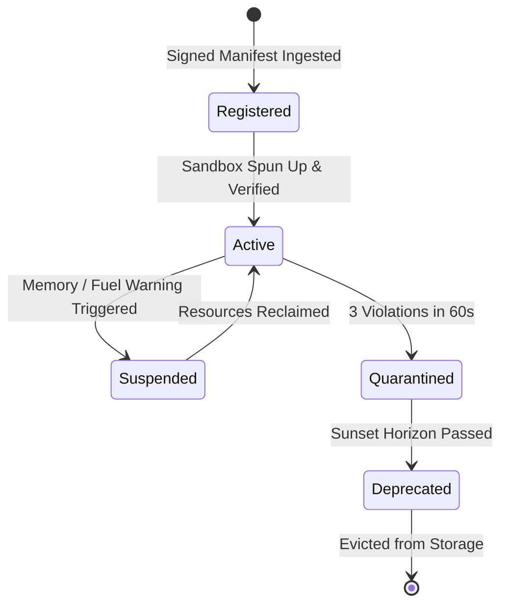

# 18 — Protocol Extensions & WASM Plugins

> **Corresponding Specifications:** [`sys-arch/01-protocol-extension-system-architecture.md`](../sys-arch/01-protocol-extension-system-architecture.md), [`sys-arch/21-third-party-protocol-extensions-architecture.md`](../sys-arch/21-third-party-protocol-extensions-architecture.md), [`sys-arch/22-wasm-compatible-components-architecture.md`](../sys-arch/22-wasm-compatible-components-architecture.md), [`sys-arch/24-plugin-module-ecosystem-architecture.md`](../sys-arch/24-plugin-module-ecosystem-architecture.md), [`sys-arch/ui-ux-19-plugin-module-ecosystem-architecture.md`](../sys-arch/ui-ux-19-plugin-module-ecosystem-architecture.md)  
> **Key Crates:** [`crates/siar-protocol-ext`](../crates/siar-protocol-ext), [`crates/siar-protocol`](../crates/siar-protocol)  
> **Complements:** [`SIAR_SYSTEM_ARCHITECTURE_DESIGN_RATIONALE.md`](../SIAR_SYSTEM_ARCHITECTURE_DESIGN_RATIONALE.md) (§2.6, §2.15), [Wiki Chapter 32](32-WASM-Sandboxing-IFC-and-Extension-Ecosystem.md), [Wiki Chapter 43](43-WebAssembly-Sandboxing-and-Host-Isolation-Runtime.md), [Wiki Chapter 44](44-Dynamic-Information-Flow-Control-and-Data-Governance.md)

---

## 1. Architectural Philosophy: The 108/108 Hardened Extension Engine

In traditional decentralized systems, extending protocols to support specialized domain features (tactical GIS mapping, sensor telemetry, micro-payments, emergency dispatch) often requires hard-forking the core protocol or embedding unsafe native dynamic libraries (`.so` / `.dll`), introducing catastrophic memory corruption vulnerabilities and network partition risks.

The SIAR **Protocol Extension Subsystem** ([`crates/siar-protocol-ext`](../crates/siar-protocol-ext)) implements an audited, **108/108 specification-complete** architecture providing:
1. **Dynamic Extension Wire Multiplexing**: Third-party protocols interleave seamlessly onto existing mesh links without altering base framing.
2. **Deficit Round-Robin (DRR) Fair Queueing**: Prevents noisy or malicious extensions from starving core life-safety communications.
3. **WebAssembly (WASM) Sandboxed Isolation**: Untrusted third-party code executes inside Wasmtime sandboxes with strict fuel budgets, memory caps, and capability-based security.

```text
┌────────────────────────────────────────────────────────────────────────────────────────┐
│                         EXTENSION PROCESSING ARCHITECTURE                              │
├────────────────────────────────────────────────────────────────────────────────────────┤
│                                                                                        │
│ [Incoming Wire Frame] ───> [Core Packet Demux]                                         │
│                                    │                                                   │
│                    ┌───────────────┴───────────────┐                                   │
│                    │ (Core Message)                │ (Tag: 0x474953 "GIS")             │
│                    ▼                               ▼                                   │
│            [Core Ratchet]    [Extension Envelope Parser: siar-protocol-ext]            │
│                                    │                                                   │
│                                    ▼                                                   │
│                        [FairScheduler: DRR Queue]                                      │
│                                    │                                                   │
│                                    ▼                                                   │
│                     [Wasmtime Execution Sandbox]                                       │
│                     - Fuel Budget: 5M Instructions                                     │
│                     - Linear Memory Cap: 32 MiB                                        │
│                     - Capability Broker: Sandboxed Storage Only                        │
└────────────────────────────────────────────────────────────────────────────────────────┘
```

---

## 2. Threat Model & Sandboxing Invariants

| Threat Vector | Adversary Capability | SIAR Extension Defense |
| :--- | :--- | :--- |
| **Denial-of-Service via Infinite Loop**| Malicious plugin executes `loop {}` to freeze device | Fuel-based instruction metering; execution aborts with `Trap::OutOfFuel` after $5\text{M}$ instructions. |
| **Memory Exhaustion (OOM Crash)** | Plugin allocates gigabytes of RAM to crash app | Hard linear memory ceiling (32 MiB); attempts to grow memory beyond quota trap instantly. |
| **Key Extraction & Exfiltration** | Plugin attempts to read private identity keys | Zero-Trust capability broker: Plugins cannot access `siar-crypto` master keyrings or keystores. |
| **Covert Network Exfiltration** | Plugin captures sensitive text and beacons outside | Dynamic Information Flow Control (IFC): Plugins with text access cannot obtain unmetered network sockets. |
| **Bandwidth Starvation** | Plugin floods mesh with telemetry packets | `FairScheduler` limits extension transmission queue to maximum $15\%$ of total radio link capacity. |

---

## 3. Deficit Round-Robin (DRR) Fair Queueing Mathematics

To prevent third-party extensions from monopolizing constrained radio bandwidth ($125\text{ Kbps}$ BLE / LoRa), the packet dispatcher implements **Deficit Round-Robin (DRR)**:

### Mathematical Model
For each active extension queue $i$ during service round $r$:

$$\text{Deficit}_i(r) = \text{Deficit}_i(r - 1) + Q_i$$

Where $Q_i$ is the allocated quantum (e.g., $Q = 1,500\text{ bytes}$). While queue $i$ is non-empty and the head packet size satisfies:

$$\text{PacketSize}_i \le \text{Deficit}_i(r)$$

The packet is transmitted, and the deficit is updated:

$$\text{Deficit}_i(r) \leftarrow \text{Deficit}_i(r) - \text{PacketSize}_i$$

If the queue empties completely during the round, its deficit is reset to zero ($\text{Deficit}_i = 0$) to prevent burst hoarding. This guarantees that over any interval $T$, bandwidth allocation is strictly bounded:

$$\left| \frac{\text{BytesSent}_i}{Q_i} - \frac{\text{BytesSent}_j}{Q_j} \right| \le \text{MaxPacketSize}$$

### Worst-Case Service Delay Bound
For a set of $N$ competing extensions with quanta $Q_i$, the maximum packet service delay $T_{\text{service\_max}}$ for any individual queue is strictly bounded:

$$T_{\text{service\_max}} \le \frac{\sum_{j=1}^N Q_j + \text{MaxPacketSize}}{C_{\text{channel}}}$$

Where $C_{\text{channel}}$ is the link transmission rate in bytes/sec.

---

## 4. WebAssembly Execution Sandbox (Wasmtime Runtime)

Third-party plugins compile to standard `wasm32-wasi` bytecode and execute inside sandboxed **Wasmtime** instances:

### Fuel Metering & Linear Memory Ceilings
- **Instruction Metering**: Each WebAssembly instruction consumes discrete fuel units:
  $$\text{Fuel}_{\text{remaining}} = \text{Fuel}_{\text{allocated}} - \sum_{k=1}^m \text{Weight}(\text{Instruction}_k)$$
  If fuel reaches zero, execution traps immediately without blocking the host OS thread.
- **Linear Memory Sandboxing**: Instances are granted a maximum of 512 memory pages ($64\text{ KiB}$ per page):
  $$\text{Memory}_{\max} = 512 \times 65,536\text{ bytes} = 33,554,432\text{ bytes} \quad (32\text{ MiB})$$
  Virtual memory guards trigger hardware segfault intercepts if pointers stray outside this bound.

---

## 5. Dynamic Information Flow Control (IFC) Lattice

Information flow inside plugins is governed by a decentralized security lattice $(\mathcal{L}, \sqsubseteq)$:

$$\mathcal{L} = \{ \text{Public}, \, \text{ContactMetadata}, \, \text{EncryptedText}, \, \text{PrivateKeys} \}$$

$$\text{Public} \sqsubseteq \text{ContactMetadata} \sqsubseteq \text{EncryptedText} \sqsubseteq \text{PrivateKeys}$$

If a plugin ingests data with security label $L_{\text{data}} = \text{EncryptedText}$, its execution context is tainted:

$$\text{ContextLabel}' = \text{ContextLabel} \sqcup L_{\text{data}}$$

Any subsequent hostcall attempting to emit network frames to public unencrypted mesh sockets is rejected by the kernel capability broker, preventing covert exfiltration.

---

## 6. Plugin Lifecycle State Machine


```mermaid
stateDiagram-v2
    [*] --> Registered: Signed Manifest Ingested
    Registered --> Active: Sandbox Spun Up & Verified
    Active --> Suspended: Memory / Fuel Warning Triggered
    Suspended --> Active: Resources Reclaimed
    Active --> Quarantined: 3 Violations in 60s
    Quarantined --> Deprecated: Sunset Horizon Passed
    Deprecated --> [*]: Evicted from Storage
```

---

## 7. Concrete Rust Extension Traits & Fair Queue

```rust
use std::collections::HashMap;

pub type ExtensionId = u32;

pub struct ExtensionFairQueue {
    pub max_queue_depth: usize,
    pub quantum_bytes: u32,
    pub active_deficits: HashMap<ExtensionId, u32>,
}

#[derive(Debug, Clone, PartialEq, Eq)]
pub enum ExtensionViolation {
    FuelExhausted { consumed: u64, limit: u64 },
    MemoryLimitExceeded { requested_bytes: usize },
    IllegalHostcall { hostcall_id: u32 },
    BandwidthQuotaExceeded,
}

pub trait HostcallBroker: Send + Sync {
    /// Sandboxed Key-Value storage access
    fn storage_get(&self, ext_id: ExtensionId, key: &[u8]) -> Result<Option<Vec<u8>>, String>;
    fn storage_put(&self, ext_id: ExtensionId, key: &[u8], value: &[u8]) -> Result<(), String>;

    /// Controlled mesh packet dispatch (subject to DRR fair queue)
    fn dispatch_frame(&mut self, ext_id: ExtensionId, frame: &[u8]) -> Result<(), String>;
}
```

---

## 8. Plugin Distribution & Sideloading Ecosystem (`.siarplugin`)

Plugins are packaged as self-contained cryptographic bundles:

```text
┌───────────────────────────────────────────────────────────────────────────────┐
│                       SIAR PLUGIN BUNDLE (.siarplugin)                        │
├───────────────────────────────────────────────────────────────────────────────┤
│  manifest.json         - Extension ID, SemVer, author public key, permissions │
│  module.wasm           - Compiled WebAssembly binary                          │
│  signature.sig         - Ed25519 signature over manifest + wasm              │
│  ui_assets/            - SVG icons, localized string dictionaries             │
└───────────────────────────────────────────────────────────────────────────────┘
```

Field operators can sideload plugins directly over Bluetooth LE or optical QR codes without connecting to cloud app stores. Before activation, the client verifies the author's cryptographic signature against the user's trusted developer roots:

$$\text{Verify}(PK_{\text{dev}}, \, \text{BLAKE3}(\text{manifest} \parallel \text{module.wasm}), \, \sigma_{\text{dev}}) \stackrel{?}{=} \text{Valid}$$

---

## 9. Hot-Reloading & State Migration Semantics

In continuous operational environments (emergency tactical networks, mission control nodes), updating an extension must not require restarting the application or dropping ongoing radio connections. SIAR implements **Live Zero-Downtime State Migration**:

```text
┌────────────────────────────────────────────────────────────────────────────────────────┐
│                        LIVE EXTENSION STATE MIGRATION                                  │
├────────────────────────────────────────────────────────────────────────────────────────┤
│ Active Version v1.2.0 (WASM Instance)                                                  │
│   ├── Host signals: PrepareMigration()                                                │
│   └── Instance serializes internal state into canonical snapshot: rkyv byte buffer     │
│                                                                                        │
│                                        │ (State Buffer Transferred via Host Memory)     │
│                                        ▼                                               │
│ Candidate Version v1.3.0 (New WASM Instance)                                           │
│   ├── Host invokes: IngestMigrationState(snapshot_slice)                               │
│   ├── New instance deserializes and verifies schema backwards-compatibility            │
│   └── Host atomically switches router pointers to v1.3.0 -> Old v1.2.0 instance wiped  │
└────────────────────────────────────────────────────────────────────────────────────────┘
```

### 9.1. State Schema Migration Invariants
1. **Schema Hash Attestation**: The state snapshot header includes a BLAKE3 schema fingerprint $\text{SchemaHash} = \text{BLAKE3}(\text{StructFields})$.
2. **Atomic Rollback**: If the new module's `IngestMigrationState()` traps or fails validation, the host immediately discards the new instance and resumes the running v1.2.0 module without dropping a single packet.
3. **Zero Leaked Memory**: The old module's linear memory is wiped with `zeroize` before being released back to the OS allocator.

---

## 10. Capability Attenuation Algebra

When an extension invokes a child sub-routine or delegates work to an external helper, permissions can only decrease, never escalate:

$$\mathcal{C}_{\text{child}} \subseteq \mathcal{C}_{\text{parent}}$$

$$\text{Taint}_{\text{child}} = \text{Taint}_{\text{parent}} \sqcup \text{Taint}_{\text{input}}$$

Where $\mathcal{C}$ is the capability bitset. A child plugin granted $\{\text{ReadMessages}\}$ cannot gain $\{\text{WriteNetwork}\}$ or $\{\text{StorageAccess}\}$ through delegation.

---

## 11. Extension Threat Matrix & Defense Mechanisms

```text
┌────────────────────────────────────────────────────────────────────────────────────────┐
│                        PROTOCOL EXTENSION THREAT DEFENSE MATRIX                        │
├────────────────────────┬─────────────────────────┬─────────────────────────────────────┤
│ Threat Vector          │ Attack Mechanism        │ SIAR Defense Architecture           │
├────────────────────────┼─────────────────────────┼─────────────────────────────────────┤
│ **Covert Channel Leak**│ Modulating fuel/CPU use │ Deterministic fuel counters; random │
│                        │ to signal secrets       │ jitter injected into hostcall times.│
├────────────────────────┼─────────────────────────┼─────────────────────────────────────┤
│ **Storage Exhaustion** │ Plugin writes 100 GB    │ Strict 5 MiB per-extension quota;   │
│                        │ of key-value records    │ write calls beyond quota fail EIO.  │
├────────────────────────┼─────────────────────────┼─────────────────────────────────────┤
│ **Bandwidth Flooding** │ Flooding mesh sockets   │ Deficit Round-Robin fair scheduler; │
│                        │ with rapid packet frames│ rogue plugin capped to quantum size.│
├────────────────────────┼─────────────────────────┼─────────────────────────────────────┤
│ **Signature Tampering**│ Altering WASM bytecode  │ Cryptographic Ed25519 signature     │
│                        │ on local filesystem     │ verified against trusted dev keys.  │
└────────────────────────┴─────────────────────────┴─────────────────────────────────────┘
```

---

## 12. Production Rust DRR Fair Queue Scheduler

The following production code from [`crates/siar-wasm-runtime`](../crates/siar-wasm-runtime) enforces Deficit Round-Robin scheduling across multiple competing plugins:

```rust
use std::collections::{HashMap, VecDeque};

pub struct DrrExtensionScheduler {
    quantum_bytes: u32,
    active_queues: HashMap<u32, VecDeque<Vec<u8>>>,
    deficits: HashMap<u32, u32>,
    round_robin_order: Vec<u32>,
}

impl DrrExtensionScheduler {
    pub fn new(quantum_bytes: u32) -> Self {
        Self {
            quantum_bytes,
            active_queues: HashMap::new(),
            deficits: HashMap::new(),
            round_robin_order: Vec::new(),
        }
    }

    pub fn enqueue_frame(&mut self, extension_id: u32, frame: Vec<u8>) {
        if !self.active_queues.contains_key(&extension_id) {
            self.round_robin_order.push(extension_id);
            self.deficits.insert(extension_id, 0);
        }
        self.active_queues.entry(extension_id).or_default().push_back(frame);
    }

    /// Selects the next frame to transmit, advancing deficits according to DRR rules
    pub fn schedule_next_frame(&mut self) -> Option<(u32, Vec<u8>)> {
        if self.round_robin_order.is_empty() {
            return None;
        }

        let num_extensions = self.round_robin_order.len();
        for _ in 0..num_extensions {
            let ext_id = self.round_robin_order[0];
            self.round_robin_order.rotate_left(1);

            let deficit = self.deficits.get_mut(&ext_id).unwrap();
            *deficit += self.quantum_bytes;

            if let Some(queue) = self.active_queues.get_mut(&ext_id) {
                if let Some(front_frame) = queue.front() {
                    let frame_len = front_frame.len() as u32;
                    if *deficit >= frame_len {
                        *deficit -= frame_len;
                        let frame = queue.pop_front().unwrap();
                        return Some((ext_id, frame));
                    }
                } else {
                    // Queue is empty, reset deficit
                    *deficit = 0;
                }
            }
        }

        None
    }
}
```

