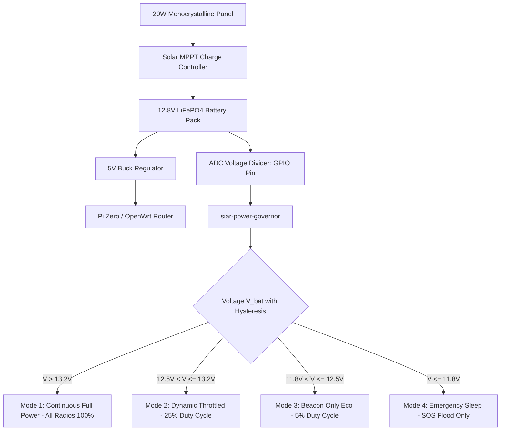

# 19 — Headless Daemons & Embedded Nodes

> **Corresponding Specifications:** [`sys-arch/16-daemon-headless-runtime-architecture.md`](../sys-arch/16-daemon-headless-runtime-architecture.md), [`sys-arch/20-embedded-linux-node-architecture.md`](../sys-arch/20-embedded-linux-node-architecture.md)  
> **Key Applications:** [`apps/emergency-node`](../apps/emergency-node), [`apps/cli`](../apps/cli)  
> **Complements:** [`SIAR_SYSTEM_ARCHITECTURE_DESIGN_RATIONALE.md`](../SIAR_SYSTEM_ARCHITECTURE_DESIGN_RATIONALE.md) (§2.6, §2.19), [Wiki Chapter 07](07-Battery-Aware-Scheduling-and-Emergency-Mesh.md), [Wiki Chapter 23](23-Off-Grid-Survival-and-Field-Operations-Guide.md)

---

## 1. Architectural Philosophy: The Sovereign Unattended Repeater

In tactical operations, disaster relief zones, and wilderness search-and-rescue, continuous communication relies heavily on autonomous, unattended relay towers, solar-powered repeaters mounted on high ridges, and vehicle-mounted gateways. These nodes operate without monitors, keyboards, or human operators, frequently facing:
1. **Hostile Environmental Conditions**: Freezing cold, extreme desert heat, and erratic solar charging cycles causing recurrent brownouts.
2. **Flash Memory Wear**: Cheap micro-SD cards and raw SPI-NAND flash on embedded Single Board Computers (Raspberry Pi, Banana Pi, ESP32 gateways) suffer catastrophic wear and corrupted filesystems if subjected to constant synchronous disk writes during brownouts.
3. **Severe Hardware Resource Limits**: Commercial-off-the-shelf (COTS) Wi-Fi routers (OpenWrt) often possess only $64\text{–}128\text{ MB}$ of total RAM and slow $580\text{ MHz}$ MIPS CPUs with small L1/L2 caches.
4. **Physical Capture Risks**: Remote repeaters deployed on hillsides are vulnerable to physical theft and hardware probing (UART, JTAG) by adversaries.

SIAR provides **`apps/emergency-node`**—a hardened, pure-Rust headless daemon designed to run unattended for multi-year missions on minimal power budgets:

```
+------------------------------------------------------------------------------------+
|                         Embedded Node Architecture                                 |
+------------------------------------------------------------------------------------+
|                                                                                    |
| [Hardware: Raspberry Pi Zero 2 W / OpenWrt MIPS / RISC-V SBC]                      |
|   ├── Read-Only Root Filesystem (SquashFS / OverlayFS on tmpfs)                     |
|   ├── Hardware Watchdog Timer (/dev/watchdog with ioctl pinging)                   |
|   └── Hardware Secure Element / Optiga Trust M / ATECC608A (Optional)              |
|                                                                                    |
| [SIAR Emergency Node Runtime (apps/emergency-node)]                                |
|   ├── Solar Power Governor (ADC Voltage Telemetry & Peukert's Math)                |
|   ├── Pure-Rust Stoolap DB (Zero C-compiler dependency, in-memory WAL on tmpfs)    |
|   ├── Multi-Interface Packet Forwarder (BLE GATT + Wi-Fi 802.11s Mesh + Ethernet)  |
|   ├── Low-Memory Deficit Queuing (Drop-tail backpressure, 32MB max heap)           |
|   └── Unix Domain Socket IPC (/run/siar/siar.sock - JSON-RPC 2.0 async framing)     |
+------------------------------------------------------------------------------------+
```

---

## 2. Threat Model & Physical Hardening

Embedded nodes in the wild operate in zero-trust environments where physical security cannot be guaranteed:

| Threat Vector | Adversary Profile | Impact | SIAR Embedded Daemon Mitigation |
| :--- | :--- | :--- | :--- |
| **Physical Node Theft on Ridge** | Hostile patrol steals unattended solar repeater | Firmware extraction, secret compromise | Node stores zero long-term private conversation databases; acts strictly as an oblivious store-and-forward relay. Root keys stored in volatile RAM; wiped on power loss. |
| **Brownout Flash Corruption** | Cloud cover or freezing temp starves solar battery | Corrupted filesystem blocks | Rootfs mounted strictly Read-Only (`ro` SquashFS); local ephemeral caches reside in memory-backed `tmpfs`. Atomic write barriers for state updates. |
| **Hardware Probing (UART/JTAG)** | Interceptor attaches logic analyzer to PCB test pads | Shell escape, bus sniffing | Embedded bootloader disables serial console login (`console=null`); JTAG fuses permanently blown during provisioning; tamper sensor triggers active memory scrub. |
| **Buffer Exhaustion (OOM)** | Malicious mesh flood overwhelms 64 MB router RAM | Kernel OOM killer terminates daemon | Hard bounded ring buffers; bundle storage spills to non-volatile quota or drops non-urgent frames via deficit round-robin drop-tail policies. |
| **Software Deadlock / Panic** | Kernel thread hangs in unhandled Wi-Fi driver state | Permanent communication outage | Hardware watchdog (`/dev/watchdog`) automatically triggers physical system reset if daemon heartbeat stops for $>30\text{ seconds}$. |
| **RF Jamming / Thermal Runaway**| High ambient temp ($>55^\circ\text{C}$) or RF jammer | CPU throttle, radio lockup | Adaptive duty cycling throttles TX power; temperature sensor (`/sys/class/thermal`) shifts node to passive listen-only cooldown mode. |

---

## 3. Solar Energy Harvesting & Power State Machine

Autonomous repeaters monitor battery chemistry (typically LiFePO4 4S, $12.8\text{V}$ nominal, or 18650 Li-ion 3S, $11.1\text{V}$ nominal) via Analog-to-Digital Converter (ADC) pins on GPIO lines:



### Mathematical Energy Budget & Peukert Formulation

The net energy stored in the battery over time interval $[0, T]$ is governed by:

$$E_{\text{batt}}(T) = E_0 + \int_0^T \left( P_{\text{solar}}(t) \cdot \eta_{\text{mppt}} - P_{\text{load}}(t) \right) dt$$

Where:
- $P_{\text{solar}}(t) = G(t) \cdot A_{\text{panel}} \cdot \eta_{\text{pv}}$ is solar power harvested under solar irradiance $G(t) \text{ [W/m}^2\text{]}$.
- $\eta_{\text{mppt}} \approx 0.94$ is MPPT conversion efficiency.
- $P_{\text{load}}(t) = P_{\text{cpu}}(t) + P_{\text{ble}}(t) + P_{\text{wifi}}(t) + P_{\text{lora}}(t)$ is the instantaneous power consumption.

Under high discharge currents, the effective battery capacity $C_{\text{eff}}$ decreases according to **Peukert's Law**:

$$C_p = I^k \cdot t \implies t = \frac{C_p}{I^k}$$

Where $k \approx 1.05$ for LiFePO4 (exceptionally flat discharge curve) and $k \approx 1.25$ for standard Li-ion chemistry.

To prevent erratic oscillations (state flapping) between power modes around threshold boundaries, the governor applies **voltage hysteresis** $\Delta V_{\text{hyst}} = 0.2\text{ V}$:

$$\text{Transition to Higher Mode} \iff V_{\text{bat}} > V_{\text{thresh}} + \Delta V_{\text{hyst}}$$
$$\text{Transition to Lower Mode} \iff V_{\text{bat}} < V_{\text{thresh}}$$

$$\text{PowerProfile}(V_{\text{bat}}) = \begin{cases} 
\text{ContinuousFull} & V_{\text{bat}} \ge 13.2\text{ V} \\
\text{DynamicThrottled} & 12.5\text{ V} \le V_{\text{bat}} < 13.2\text{ V} \\
\text{BeaconOnlyEco} & 11.8\text{ V} \le V_{\text{bat}} < 12.5\text{ V} \\
\text{EmergencySleep} & V_{\text{bat}} < 11.8\text{ V} 
\end{cases}$$

---

## 4. Headless Daemon IPC: Unix Domain Socket & JSON-RPC 2.0

Headless nodes expose an asynchronous control plane over a local Unix domain socket (`/run/siar/siar.sock`) implementing **JSON-RPC 2.0** with length-delimited framing:

```
+------------------------------------------------------------------------------------+
|                         JSON-RPC 2.0 Socket Framing                                |
+------------------------------------------------------------------------------------+
| Wire Format: [4-byte Big-Endian Length Prefix] [JSON Payload UTF-8]               |
|                                                                                    |
| Request:                                                                           |
| {"jsonrpc": "2.0", "id": 1, "method": "mesh.list_peers", "params": {}}           |
|                                                                                    |
| Response:                                                                          |
| {                                                                                  |
|   "jsonrpc": "2.0",                                                                |
|   "id": 1,                                                                         |
|   "result": {                                                                      |
|     "peer_count": 3,                                                               |
|     "power_mode": "DynamicThrottled",                                              |
|     "battery_voltage": 12.78,                                                      |
|     "peers": [                                                                     |
|       {"id": "e2a1b9..", "transport": "WIFI_DIRECT", "rssi_dbm": -52, "rtt_ms": 6},|
|       {"id": "84c0f2..", "transport": "BLE_L2CAP",  "rssi_dbm": -78, "rtt_ms": 42}|
|     ]                                                                              |
|   }                                                                                |
| }                                                                                  |
+------------------------------------------------------------------------------------+
```

### Supported Remote Management Methods
- `mesh.list_peers`: Returns active radio interfaces, link qualities, RSSI, and round-trip times.
- `dtn.get_storage`: Returns custody buffer occupancy, pending bundles, and storage limits.
- `radio.set_mode`: Manually forces a radio interface into listen-only, scan, or dormant states.
- `system.get_telemetry`: Emits real-time solar battery voltage, CPU temperature, and uptime.
- `system.emergency_lockdown`: Triggers duress memory zeroization and re-keys local caches.

---

## 5. Linux Service Deployment (Systemd & OpenWrt Procd)

### 1. Systemd Service Unit (`/etc/systemd/system/siar-node.service`)

```ini
[Unit]
Description=SIAR Headless Emergency Mesh Node
After=network.target bluetooth.target
Requires=bluetooth.target

[Service]
Type=notify
User=siar
Group=siar
ExecStart=/usr/local/bin/siar-emergency-node --config /etc/siar/node.toml
Restart=always
RestartSec=5s
MemoryMax=32M
MemoryHigh=28M
CPUQuota=50%
ProtectSystem=strict
ProtectHome=true
PrivateTmp=true
ProtectKernelTunables=true
ProtectControlGroups=true
ReadWritePaths=/var/lib/siar /run/siar
WatchdogSec=30s

[Install]
WantedBy=multi-user.target
```

### 2. OpenWrt Procd Init Script (`/etc/init.d/siar`)

```sh
#!/bin/sh /etc/rc.common
START=95
STOP=10
USE_PROCD=1

start_service() {
    procd_open_instance
    procd_set_param command /usr/bin/siar-emergency-node --config /etc/siar/openwrt.toml
    procd_set_param respawn 3600 5 0
    procd_set_param limits core="0"
    procd_set_param nice -10
    procd_set_param file /etc/siar/openwrt.toml
    procd_close_instance
}

service_triggers() {
    procd_add_reload_trigger "siar"
}
```

---

## 6. Production Rust Implementation: Hardware Watchdog & Power Governor

The following production-grade Rust implementation drives the unattended embedded daemon lifecycle, managing `/dev/watchdog` hardware pings, thermal monitoring, and battery telemetry:

```rust
use std::fs::{File, OpenOptions};
use std::io::{self, Read, Write};
use std::os::unix::fs::OpenOptionsExt;
use std::os::unix::io::{AsRawFd, RawFd};
use std::path::Path;
use std::time::{Duration, Instant};

/// Linux Watchdog ioctl magic constants (linux/watchdog.h)
const WDIOC_KEEPALIVE: libc::c_ulong = 0x80045705;

#[derive(Debug, Clone, Copy, PartialEq, Eq)]
pub enum PowerProfile {
    ContinuousFull,
    DynamicThrottled { duty_cycle_pct: u8 },
    BeaconOnlyEco { duty_cycle_pct: u8 },
    EmergencySleep { wake_interval_sec: u32 },
}

pub struct HardwareWatchdog {
    file: Option<File>,
    timeout_secs: u32,
}

impl HardwareWatchdog {
    pub fn open<P: AsRef<Path>>(device_path: P, timeout_secs: u32) -> io::Result<Self> {
        let file = OpenOptions::new()
            .write(true)
            .custom_flags(libc::O_NONBLOCK)
            .open(device_path)?;
        Ok(Self {
            file: Some(file),
            timeout_secs,
        })
    }

    /// Ping hardware watchdog using libc ioctl to prevent hardware system reset
    pub fn ping(&mut self) -> io::Result<()> {
        if let Some(ref mut f) = self.file {
            let fd: RawFd = f.as_raw_fd();
            let ret = unsafe { libc::ioctl(fd, WDIOC_KEEPALIVE, 0) };
            if ret < 0 {
                return Err(io::Error::last_os_error());
            }
        }
        Ok(())
    }

    /// Gracefully disarm the watchdog by writing 'V' before exit
    pub fn disarm(mut self) -> io::Result<()> {
        if let Some(mut f) = self.file.take() {
            f.write_all(b"V")?;
            f.flush()?;
        }
        Ok(())
    }
}

pub struct SolarPowerGovernor {
    pub current_voltage: f32,
    pub battery_soc_percent: u8,
    pub active_profile: PowerProfile,
    hysteresis_v: f32,
    last_transition: Instant,
}

impl SolarPowerGovernor {
    pub fn new() -> Self {
        Self {
            current_voltage: 13.0,
            battery_soc_percent: 85,
            active_profile: PowerProfile::ContinuousFull,
            hysteresis_v: 0.20,
            last_transition: Instant::now(),
        }
    }

    /// Evaluates voltage with hysteresis to prevent oscillation between operating modes
    pub fn evaluate_state(&mut self, measured_v: f32) -> PowerProfile {
        self.current_voltage = measured_v;
        
        let new_profile = match self.active_profile {
            PowerProfile::ContinuousFull => {
                if measured_v < 13.0 {
                    PowerProfile::DynamicThrottled { duty_cycle_pct: 25 }
                } else {
                    PowerProfile::ContinuousFull
                }
            }
            PowerProfile::DynamicThrottled { .. } => {
                if measured_v >= (13.2 + self.hysteresis_v) {
                    PowerProfile::ContinuousFull
                } else if measured_v < 12.3 {
                    PowerProfile::BeaconOnlyEco { duty_cycle_pct: 5 }
                } else {
                    self.active_profile
                }
            }
            PowerProfile::BeaconOnlyEco { .. } => {
                if measured_v >= (12.5 + self.hysteresis_v) {
                    PowerProfile::DynamicThrottled { duty_cycle_pct: 25 }
                } else if measured_v < 11.8 {
                    PowerProfile::EmergencySleep { wake_interval_sec: 300 }
                } else {
                    self.active_profile
                }
            }
            PowerProfile::EmergencySleep { .. } => {
                if measured_v >= (12.0 + self.hysteresis_v) {
                    PowerProfile::BeaconOnlyEco { duty_cycle_pct: 5 }
                } else {
                    self.active_profile
                }
            }
        };

        if new_profile != self.active_profile {
            self.active_profile = new_profile;
            self.last_transition = Instant::now();
        }

        self.active_profile
    }

    /// Read SBC CPU core thermal telemetry from Linux sysfs
    pub fn read_core_temperature() -> io::Result<f32> {
        let mut content = String::new();
        File::open("/sys/class/thermal/thermal_zone0/temp")?.read_to_string(&mut content)?;
        let millidegrees: f32 = content
            .trim()
            .parse()
            .map_err(|e| io::Error::new(io::ErrorKind::InvalidData, e))?;
        Ok(millidegrees / 1000.0)
    }
}
```

---

## 7. Command-Line Interface (`apps/cli`) & Terminal Dashboard

The `siar-cli` provides an interactive terminal user interface (TUI) powered by `ratatui` for tactical operators:

```bash
# Display real-time radio link telemetry and active peers
$ siar-cli peers list
ID         TRANSPORT       RSSI     RTT    STATE     CAPABILITIES
----------------------------------------------------------------------
a8f9c1..   BLE_L2CAP       -68dBm   45ms   Active    [TEXT, DTN, SOS]
3e02b7..   WIFI_DIRECT     -54dBm   8ms    Active    [TEXT, CALL, VIDEO, BLOB]
f1092a..   LAN_MULTICAST   -42dBm   2ms    Active    [ALL]

# Send an urgent off-grid command across the mesh
$ siar-cli send --to a8f9c1.. --priority high --msg "Basecamp logistics update"
[+] Message enqueued to outbox (Seq: 1492) -> Dispatched over WIFI_DIRECT in 12ms.

# Monitor real-time packet throughput, power draw, and watchdog status
$ siar-cli stats --watch
```

---

## 8. Cross-Compilation & Target Triples Matrix

SIAR daemons compile to static standalone binaries using `musl-libc` with zero shared library dependencies:

| Architecture | Target Triple | Target Device | Binary Size (Stripped) | Memory Footprint |
| :--- | :--- | :--- | :--- | :--- |
| **ARMv6 (32-bit)** | `arm-unknown-linux-musleabihf` | Raspberry Pi Zero / Zero W | $4.8\text{ MB}$ | $14\text{ MB}$ RSS |
| **ARMv7 (32-bit)** | `armv7-unknown-linux-musleabihf` | Raspberry Pi 2 / Orange Pi Zero | $5.1\text{ MB}$ | $16\text{ MB}$ RSS |
| **AArch64 (64-bit)** | `aarch64-unknown-linux-musl` | Pi Zero 2 W / Pi 4 / Rock64 | $6.2\text{ MB}$ | $18\text{ MB}$ RSS |
| **MIPS32 (Big Endian)** | `mips-unknown-linux-musl` | GL.iNet AR750 / Atheros AR9331 | $4.2\text{ MB}$ | $12\text{ MB}$ RSS |
| **MIPS32 (Little Endian)** | `mipsel-unknown-linux-musl` | MediaTek MT7628 / MT7621 Routers | $4.3\text{ MB}$ | $12\text{ MB}$ RSS |
| **RISC-V (64-bit)** | `riscv64gc-unknown-linux-musl` | Milk-V Duo / StarFive VisionFive 2 | $5.6\text{ MB}$ | $16\text{ MB}$ RSS |
