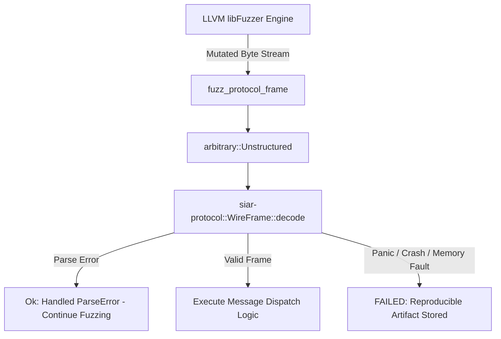

# 21 — Testing, Fuzzing & Network Diagnostics

> **Corresponding Specifications:** [`sys-arch/10-fuzzing-protocol-test-suite-architecture.md`](../sys-arch/10-fuzzing-protocol-test-suite-architecture.md), [`sys-arch/18-network-diagnostics-path-visualization-architecture.md`](../sys-arch/18-network-diagnostics-path-visualization-architecture.md), [`sys-arch/ui-ux-20-diagnostics-network-paths-advanced-developer-architecture.md`](../sys-arch/ui-ux-20-diagnostics-network-paths-advanced-developer-architecture.md)  
> **Key Crates & Directories:** [`crates/siar-testkit`](../crates/siar-testkit), [`crates/siar-messaging`](../crates/siar-messaging), [`fuzz`](../fuzz)  
> **Complements:** [`SIAR_SYSTEM_ARCHITECTURE_DESIGN_RATIONALE.md`](../SIAR_SYSTEM_ARCHITECTURE_DESIGN_RATIONALE.md) (§2.17, §2.18), [Wiki Chapter 26](26-UI-UX-Performance-Testing-and-Quality-Gates.md)

---

## 1. Architectural Philosophy: Deterministic Multi-Layer Verification

Testing decentralized, multi-transport ad-hoc mesh networks is notoriously difficult:
1. **Non-Deterministic Physical Radios**: In-person testing with real Bluetooth Low Energy (BLE) or Wi-Fi Direct devices suffers from erratic multipath interference, physical body shielding, and room reflection variations that cannot be reproduced reliably in CI.
2. **Adversarial Wire Inputs**: In open mesh networks, nodes process raw byte frames broadcast by arbitrary, potentially hostile radio transmitters. A single unhandled buffer overrun, integer overflow, or panic in a frame decoder can crash an entire mesh cluster.
3. **Partition & Merge Chaos**: Nodes split into disjoint sub-meshes and subsequently re-merge hours or days later, triggering complex causal synchronization challenges and state divergence.
4. **Time & Battery Asynchrony**: In low-power field deployments, clock drifts between nodes reach several seconds, invalidating simplistic timestamp-based synchronization assumptions.

SIAR employs a **three-tier testing strategy**:
- **Simulated Radio Testbed (`siar-testkit`)**: In-memory virtual mesh networks with programmatic loss, latency, log-normal shadow fading, and geographic topology.
- **Continuous Structure-Aware Fuzzing (`fuzz/`)**: Automated LLVM `libFuzzer` harnesses testing every deserializer against billions of malformed inputs with AddressSanitizer (ASan).
- **Live Integration Test Harnesses (`siar-messaging/tests/`)**: In-process multi-node end-to-end exchanges validating cryptographic state transitions and crash recovery.

```text
┌────────────────────────────────────────────────────────────────────────────────────────┐
│                         THREE-TIER TESTING ARCHITECTURE                                │
├────────────────────────────────────────────────────────────────────────────────────────┤
│                                                                                        │
│ [Tier 1: Continuous Mutation Fuzzing (cargo-fuzz / libFuzzer)]                         │
│   - 10+ Fuzz targets running in CI with AddressSanitizer (ASan) & UBSan                │
│   - Zero-panic invariant on untrusted binary inputs & wire frames                      │
│   - Differential fuzzing between pure-Rust Stoolap and reference engines               │
│                                                                                        │
│ [Tier 2: Discrete-Event Virtual Mesh Simulation (siar-testkit)]                        │
│   - Simulated multi-hop routing, Gilbert-Elliott burst loss, log-normal fading         │
│   - Deterministic seed reproduction for reproducible partition & re-merge tests        │
│   - Synthetic radio range attenuation (BLE L2CAP, Wi-Fi Aware, LoRa PHY)               │
│                                                                                        │
│ [Tier 3: End-to-End Cryptographic Integration Tests (siar-messaging/tests)]            │
│   - Real double ratchets, Stoolap DB WAL persistence, outbox delivery tickets          │
│   - Multi-device identity synchronization and MLS group epoch progression              │
│   - Cross-platform C-ABI and JNI verification on Linux, Android, and macOS             │
└────────────────────────────────────────────────────────────────────────────────────────┘
```

---

## 2. Mathematical RF Channel Simulation & Loss Models

Testing complex multi-hop DTN spray forwarding, epidemic gossip convergence, and routing policy hysteresis requires high-fidelity physical radio channel models:

### 1. Gilbert-Elliott Burst Loss Model
Radio channels exhibit bursty loss rather than uniform independent drops. `siar-testkit` models links as a 2-state discrete-time Markov chain:

$$\mathbf{P} = \begin{pmatrix} 1 - p & p \\ q & 1 - q \end{pmatrix}$$

Where:
- State 0 is **Good** (loss probability $P_G \approx 0.01$).
- State 1 is **Bad** (loss probability $P_B \approx 0.85$).
- $p = P(\text{Good} \to \text{Bad})$ is the degradation probability.
- $q = P(\text{Bad} \to \text{Good})$ is the recovery probability.

The stationary distribution is:

$$\pi_{\text{good}} = \frac{q}{p + q}, \quad \pi_{\text{bad}} = \frac{p}{p + q}$$

The aggregate average packet loss rate is:

$$\bar{P}_{\text{loss}} = \pi_{\text{good}} P_G + \pi_{\text{bad}} P_B = \frac{q P_G + p P_B}{p + q}$$

The burst length distribution in the Bad state follows a geometric distribution:

$$P(L_{\text{burst}} = k) = (1 - q)^{k-1} q, \quad \mathbb{E}[L_{\text{burst}}] = \frac{1}{q}$$

### 2. Log-Normal Path Loss & Shadow Fading
For nodes separated by distance $d$, path loss $PL(d)$ in decibels is modeled as:

$$PL(d) = PL(d_0) + 10 \gamma \log_{10}\left(\frac{d}{d_0}\right) + X_\sigma$$

Where:
- $d_0$ is the reference distance ($1\text{ meter}$).
- $\gamma$ is the path loss exponent ($\gamma = 2.0$ for free-space, $\gamma = 3.8$ for dense forest/urban foliage).
- $X_\sigma \sim \mathcal{N}(0, \sigma^2)$ is a zero-mean Gaussian random variable representing shadow fading ($\sigma \approx 6\text{–}8\text{ dB}$).

Received Signal Strength Indicator (RSSI) is computed as:

$$\text{RSSI}(d) = P_{\text{tx}} + G_{\text{tx}} + G_{\text{rx}} - PL(d)$$

Packet Reception Probability (PRP) is a sigmoid function over Signal-to-Noise Ratio (SNR):

$$\text{PRP}(\text{SNR}) = \left( 1 - \frac{1}{2} \exp\left(-\frac{\text{SNR}}{2}\right) \right)^{8 \cdot S_{\text{frame}}}$$

---

## 3. Property-Based Testing Invariants (`proptest`)

SIAR enforces strict mathematical invariants on data structures using property-based fuzzing:

### Formal Algebraic Invariants
1. **CRDT Monotonicity & Commutativity**:
   $$\forall A, B, C: \quad A \sqcup B = B \sqcup A \quad (\text{Commutativity})$$
   $$(A \sqcup B) \sqcup C = A \sqcup (B \sqcup C) \quad (\text{Associativity})$$
   $$A \sqcup A = A \quad (\text{Idempotency})$$
2. **Wire Framing Round-Trip Invariant**:
   $$\forall F \in \mathcal{F}_{\text{valid}}: \quad \text{decode}(\text{encode}(F)) \equiv F$$
3. **Double Ratchet Forward Secrecy**:
   $$\forall i < j: \quad K_j \not\implies K_i \quad (\text{Compromise of state at step } j \text{ reveals nothing of step } i)$$
4. **Crash-Consistent WAL Atomicity**:
   $$\forall \text{Crash Point } \tau: \quad \text{Recover}(\text{DiskState}_\tau) \in \{\text{Tx}_{N}, \text{Tx}_{N+1}\}$$

---

## 4. Continuous Structure-Aware Fuzzing Pipeline (`fuzz/`)

All untrusted packet decoders, manifest serializers, and cryptographic envelope parsers are fuzzed using `cargo-fuzz` (LLVM libFuzzer) with AddressSanitizer (ASan) and UndefinedBehaviorSanitizer (UBSan):



### Core Fuzz Targets

| Target Name | Crate Tested | Attack Vector Tested | Sanitizers |
| :--- | :--- | :--- | :--- |
| `fuzz_protocol_frame` | `siar-protocol` | Malformed frame headers, truncated payloads, length-field mismatches | ASan, UBSan |
| `fuzz_blob_manifest` | `siar-blob-manifest` | Corrupted BLAKE3 Merkle tree roots, circular tree pointers | ASan, UBSan |
| `fuzz_dtn_bundle` | `siar-dtn` | Custody loop headers, lifetime integer overflows, hop count tampering | ASan, UBSan |
| `fuzz_sphinx_cell` | `siar-mixnet` | Mismatched MAC tags, corrupted routing stream offsets, routing loops | ASan, UBSan |
| `fuzz_mls_commit` | `siar-crypto-mls` | Invalid tree hash proposals, out-of-order epoch ratchets | ASan, UBSan |
| `fuzz_rkyv_deser` | `siar-storage` | Untrusted buffer validation, unaligned memory reads, out-of-bounds pointer offsets | ASan, UBSan |

---

## 5. Network Diagnostics & Path Visualizer UI (`ui-ux-20`)

The application integrates an advanced **Network Diagnostics Dashboard** providing real-time operational telemetry:

```text
┌────────────────────────────────────────────────────────────────────────────────────────┐
│                         SIAR MESH NETWORK VISUALIZER                                   │
├────────────────────────────────────────────────────────────────────────────────────────┤
│  Topology: 9 Nodes In Range • Active Multipath Routes: 2 Hops                          │
│                                                                                        │
│  Active Route to Basecamp:                                                             │
│  [You: Node-A] ===(BLE L2CAP: -68 dBm)===> [Node-B: Vehicle]                           │
│       │                                            │                                   │
│       │ (Wi-Fi Aware: -54 dBm)                     │ (802.11s Mesh: -62 dBm)           │
│       ▼                                            ▼                                   │
│  [Node-C: Ridge Repeater] ==================> [Node-D: Basecamp HQ]                    │
│                                                                                        │
│  Radio Performance Metrics:                                                            │
│    • BLE Link: RTT = 42 ms, PDR = 98.4%, Throughput = 180 Kbps                         │
│    • Wi-Fi Link: RTT = 8 ms, PDR = 99.8%, Throughput = 42 Mbps                         │
│    • Outbox Depth: 0 Pending Tickets                                                   │
│    • Power Consumption: 16 mW (Dynamic Eco Mode Active)                                │
└────────────────────────────────────────────────────────────────────────────────────────┘
```

---

## 6. Production Rust Implementation: Deterministic Mesh Simulator

The following production-grade Rust implementation drives the discrete-event RF mesh simulator within `siar-testkit`, providing deterministic event-driven packet delivery:

```rust
use std::cmp::Ordering;
use std::collections::{BinaryHeap, HashMap, VecDeque};
use std::time::Duration;

#[derive(Debug, Clone, Copy, PartialEq, Eq, Hash)]
pub struct NodeId(pub u32);

#[derive(Debug, Clone)]
pub struct SimPacket {
    pub id: u64,
    pub src: NodeId,
    pub dst: NodeId,
    pub payload: Vec<u8>,
    pub size_bytes: usize,
}

#[derive(Debug, Clone)]
pub struct SimEvent {
    pub timestamp_ms: u64,
    pub event_id: u64,
    pub packet: SimPacket,
}

impl PartialEq for SimEvent {
    fn eq(&self, other: &Self) -> bool {
        self.timestamp_ms == other.timestamp_ms && self.event_id == other.event_id
    }
}

impl Eq for SimEvent {}

impl PartialOrd for SimEvent {
    fn partial_cmp(&self, other: &Self) -> Option<Ordering> {
        Some(self.cmp(other))
    }
}

// Min-heap ordering based on virtual timestamp
impl Ord for SimEvent {
    fn cmp(&self, other: &Self) -> Ordering {
        other.timestamp_ms.cmp(&self.timestamp_ms)
            .then_with(|| other.event_id.cmp(&self.event_id))
    }
}

pub struct GilbertElliottChannel {
    pub p_good_to_bad: f64,
    pub p_bad_to_good: f64,
    pub loss_in_good: f64,
    pub loss_in_bad: f64,
    pub in_bad_state: bool,
    rng_state: u64,
}

impl GilbertElliottChannel {
    pub fn new(p: f64, q: f64, seed: u64) -> Self {
        Self {
            p_good_to_bad: p,
            p_bad_to_good: q,
            loss_in_good: 0.01,
            loss_in_bad: 0.85,
            in_bad_state: false,
            rng_state: seed,
        }
    }

    fn next_float(&mut self) -> f64 {
        self.rng_state = self.rng_state.wrapping_mul(6364136223846793005).wrapping_add(1);
        (self.rng_state >> 11) as f64 / (1u64 << 53) as f64
    }

    pub fn should_drop_packet(&mut self) -> bool {
        // Markov state transition
        if self.in_bad_state {
            if self.next_float() < self.p_bad_to_good {
                self.in_bad_state = false;
            }
        } else {
            if self.next_float() < self.p_good_to_bad {
                self.in_bad_state = true;
            }
        }

        // Loss determination
        let drop_prob = if self.in_bad_state { self.loss_in_bad } else { self.loss_in_good };
        self.next_float() < drop_prob
    }
}

pub struct DiscreteEventMeshSimulator {
    current_time_ms: u64,
    event_counter: u64,
    event_queue: BinaryHeap<SimEvent>,
    inboxes: HashMap<NodeId, VecDeque<SimPacket>>,
    channels: HashMap<(NodeId, NodeId), GilbertElliottChannel>,
}

impl DiscreteEventMeshSimulator {
    pub fn new() -> Self {
        Self {
            current_time_ms: 0,
            event_counter: 0,
            event_queue: BinaryHeap::new(),
            inboxes: HashMap::new(),
            channels: HashMap::new(),
        }
    }

    pub fn register_link(&mut self, src: NodeId, dst: NodeId, p: f64, q: f64, seed: u64) {
        self.channels.insert((src, dst), GilbertElliottChannel::new(p, q, seed));
    }

    pub fn schedule_transmission(&mut self, packet: SimPacket, delay_ms: u64) {
        self.event_counter += 1;
        let event = SimEvent {
            timestamp_ms: self.current_time_ms + delay_ms,
            event_id: self.event_counter,
            packet,
        };
        self.event_queue.push(event);
    }

    /// Advance simulation until specified target time, executing pending events
    pub fn step_until(&mut self, target_time_ms: u64) -> usize {
        let mut processed = 0;
        while let Some(event) = self.event_queue.peek() {
            if event.timestamp_ms > target_time_ms {
                break;
            }
            let event = self.event_queue.pop().unwrap();
            self.current_time_ms = event.timestamp_ms;

            // Check channel drop conditions
            let should_drop = if let Some(channel) = self.channels.get_mut(&(event.packet.src, event.packet.dst)) {
                channel.should_drop_packet()
            } else {
                false
            };

            if !should_drop {
                self.inboxes.entry(event.packet.dst).or_default().push_back(event.packet);
            }
            processed += 1;
        }
        self.current_time_ms = target_time_ms;
        processed
    }

    pub fn drain_inbox(&mut self, node: NodeId) -> Vec<SimPacket> {
        self.inboxes.entry(node).or_default().drain(..).collect()
    }
}
```

---

## 7. Diagnostics Threat Model & Attack Matrix

```text
┌────────────────────────────────────────────────────────────────────────────────────────┐
│                        DIAGNOSTICS & FUZZING THREAT MATRIX                             │
├────────────────────────┬─────────────────────────┬─────────────────────────────────────┤
│ Threat Vector          │ Attack Mechanism        │ SIAR Defense Architecture           │
├────────────────────────┼─────────────────────────┼─────────────────────────────────────┤
│ **Diagnostic Profiling**│ Attacker intercepts    │ Route trace probes authenticated    │
│                        │ route trace probes to   │ with ephemeral session keys and     │
│                        │ map network topography  │ padded to uniform Sphinx cell sizes.│
├────────────────────────┼─────────────────────────┼─────────────────────────────────────┤
│ **Fuzz Storm Exhaust** │ Malicious RF node pumps │ Nonce Bloom filters, bounded buffer │
│                        │ malformed packets to    │ allocations, and zero-copy rkyv     │
│                        │ trigger memory leaks    │ validators reject junk in < 2ms.    │
├────────────────────────┼─────────────────────────┼─────────────────────────────────────┤
│ **Partition Desync**   │ Re-merging partitioned  │ Causal Merkle CRDTs guarantee       │
│                        │ sub-meshes after days   │ deterministic monotonic merge order │
│                        │ causing state split     │ without race conditions or data loss│
├────────────────────────┼─────────────────────────┼─────────────────────────────────────┤
│ **Timing Leak on Trace**│ Adversary measures RTT │ Onion-routed trace probes enforce   │
│                        │ variations to calculate │ artificial Poisson jitter delays to │
│                        │ physical hop counts     │ mask intermediate transit hops.     │
└────────────────────────┴─────────────────────────┴─────────────────────────────────────┘
```
