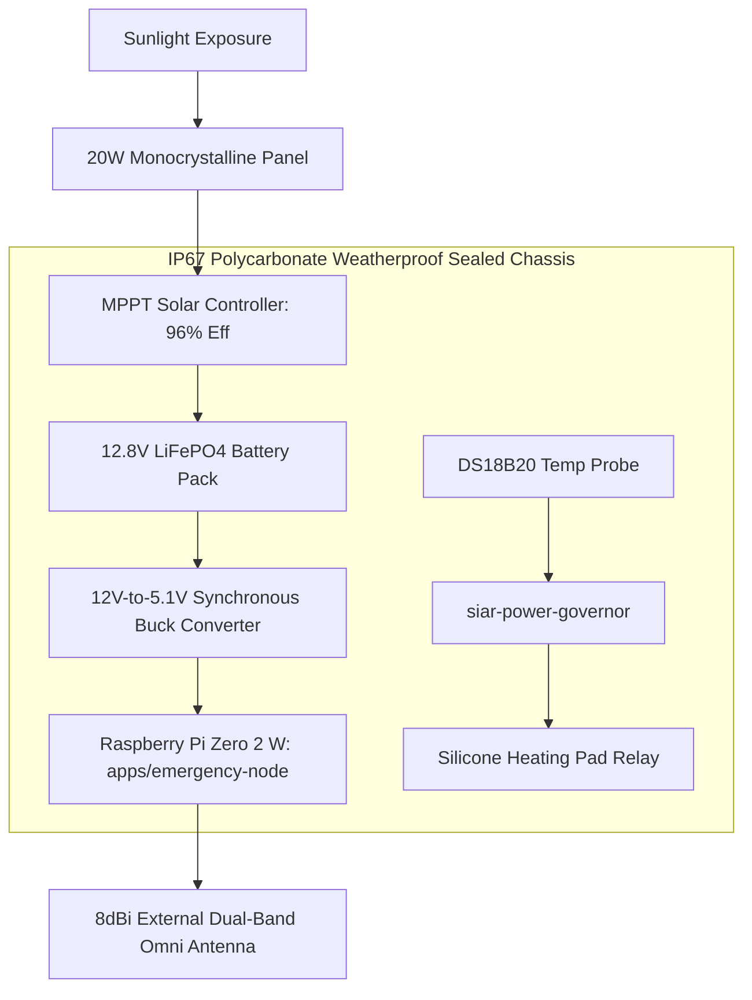

# 23 — Off-Grid Survival & Field Operations Guide

> **Target Audience:** First Responders, Disaster Relief Teams, Wilderness Expeditions, Tactical Operators  
> **Corresponding Guides:** [`docs/off-grid.md`](../docs/off-grid.md), [`sys-arch/ui-ux-17-emergency-sos-offline-mesh-architecture.md`](../sys-arch/ui-ux-17-emergency-sos-offline-mesh-architecture.md)  
> **Complements:** [`SIAR_SYSTEM_ARCHITECTURE_DESIGN_RATIONALE.md`](../SIAR_SYSTEM_ARCHITECTURE_DESIGN_RATIONALE.md) (§2.3, §2.5, §2.19), [Wiki Chapter 07](07-Battery-Aware-Scheduling-and-Emergency-Mesh.md), [Wiki Chapter 19](19-Headless-Daemons-and-Embedded-Nodes.md), [Wiki Chapter 47](47-Tactical-Field-Operations-Emergency-SOS-and-Acoustic-Beacons.md)

---

## 1. Operational Philosophy: Zero-Infrastructure Resilience

When catastrophic natural disasters (Category 5 hurricanes, 8.0+ magnitude earthquakes, tsunamis) or armed conflict strike, terrestrial cellular base stations lose grid power within hours, fiber-optic backhauls sever, and municipal telecommunications fail completely.

SIAR is engineered to create an **autonomous, self-assembling communication network using whatever devices survive the event**:
- Commercial-off-the-shelf (COTS) smartphones communicate directly via Bluetooth Low Energy and Wi-Fi Direct without cellular service, SIM cards, or centralized carrier registration.
- Solar-powered repeater nodes dropped on high mountain ridges bridge communications across entire valleys ($1\text{–}15\text{ km}$ line-of-sight).
- Foot patrols, emergency medical vehicles, and uncrewed aerial vehicles (UAVs) act as asynchronous Delay-Tolerant Networking (DTN) mules, physically ferrying encrypted message bundles across impassable geographical terrain.

```text
┌────────────────────────────────────────────────────────────────────────────────────────┐
│                         THREE-PHASE DISASTER DEPLOYMENT MODEL                          │
├────────────────────────────────────────────────────────────────────────────────────────┤
│ Phase 1: Immediate Ad-Hoc Beaconing (T + 0 to 30 min)                                  │
│   - Survivors and first responders boot SIAR apps on surviving mobile handsets.         │
│   - Local peer discovery activates automatically via BLE Extended Ads & Wi-Fi NAN.     │
│   - Zero configuration: No Wi-Fi passwords, SSIDs, or centralized logins required.     │
│                                                                                        │
│ Phase 2: Tactical Ridge Repeaters (T + 30 min to 3 hours)                              │
│   - Field teams deploy 2–4 solar emergency nodes on elevated ridge tops or rooftops.    │
│   - Establishes persistent line-of-sight links (1–5 km) bridging triage centers.       │
│                                                                                        │
│ Phase 3: DTN Mule Store-and-Forward Mesh (T + 3 to 24 hours)                           │
│   - Rescue vehicles, drones, and supply convoys travel between isolated camps.         │
│   - Automatic opportunistic synchronization sprays bundles between isolated zones.     │
└────────────────────────────────────────────────────────────────────────────────────────┘
```

---

## 2. RF Propagation Physics & Tactical Link Budgets

Radio signals in wilderness and disaster environments suffer from physical attenuation, foliage absorption, and terrain multipath fading.

### 1. Friis Path Loss & Full Link Budget Equation
Received signal power $P_{\text{rx}}$ is governed by the full link budget equation:

$$P_{\text{rx}} = P_{\text{tx}} + G_{\text{tx}} + G_{\text{rx}} - L_{\text{tx}} - L_{\text{rx}} - L_{\text{fs}} - L_{\text{foliage}} - L_{\text{fade}}$$

Where:
- $P_{\text{tx}}$ is transmit RF power in $\text{dBm}$ (e.g., $+20\text{ dBm} = 100\text{ mW}$ for Wi-Fi, $+10\text{ dBm} = 10\text{ mW}$ for BLE).
- $G_{\text{tx}}, G_{\text{rx}}$ are the gains of transmit and receive antennas in $\text{dBi}$.
- $L_{\text{tx}}, L_{\text{rx}}$ are insertion losses of coaxial cables and connectors ($\approx 0.5\text{–}1.5\text{ dB}$).
- $L_{\text{fs}}$ is Free Space Path Loss in $\text{dB}$:
  $$L_{\text{fs}} = 20 \log_{10}\left(\frac{4\pi d}{\lambda}\right) = 20 \log_{10}(d_{\text{km}}) + 20 \log_{10}(f_{\text{GHz}}) + 92.45\text{ dB}$$
  For $f = 2.4\text{ GHz}$:
  $$L_{\text{fs}} \approx 100.04 + 20 \log_{10}(d_{\text{km}}) \quad [\text{dB}]$$
- $L_{\text{foliage}}$ is empirical Weissberger foliage attenuation:
  $$L_{\text{foliage}} = 1.33 \cdot f_{\text{GHz}}^{0.284} \cdot d_{\text{trees}}^{0.588} \quad [\text{dB}] \quad (d_{\text{trees}} < 400\text{ m})$$

### 2. Thermal Noise Floor & Receiver Sensitivity Limit
Thermal noise power $N$ over channel bandwidth $B$ at absolute temperature $T$ is:

$$N = k_B \cdot T \cdot B \cdot \text{NF}$$

Where $k_B$ is Boltzmann's constant ($1.38 \times 10^{-23}\ \text{J/K}$), $T = 290\ \text{K}$ (standard reference temperature gives $-174\ \text{dBm/Hz}$), and $\text{NF}$ is receiver Noise Figure ($4\text{–}7\text{ dB}$). For a $20\text{ MHz}$ 802.11 channel:

$$N_{\text{floor}} = -174\ \text{dBm} + 10 \log_{10}(20 \times 10^6) + 6\ \text{dB} = -95\ \text{dBm}$$

To achieve successful demodulation at minimum bit rate (BPSK, coding rate $1/2$), the required Signal-to-Noise Ratio is $\text{SNR} \ge +3\ \text{dB}$. Therefore, receiver sensitivity threshold $S_{\text{rx}} = -92\ \text{dBm}$.

### 3. First Fresnel Zone Clearance Equation
Obstacles in the line of sight degrade signal even if the direct optical line is clear. The radius $r_1$ of the first Fresnel zone at distance $d_1$ from transmitter and $d_2$ from receiver is:

$$r_1 = \sqrt{\frac{\lambda \cdot d_1 \cdot d_2}{d_1 + d_2}} = 8.657 \sqrt{\frac{d_{\text{km}}}{f_{\text{GHz}}}} \quad (\text{at midpoint } d_1 = d_2)$$

*Operational Rule*: At least $60\%$ of $r_1$ ($0.6 \cdot r_1$) must remain completely unobstructed by tree canopy, ridge lines, or buildings to prevent destructive multipath cancellation.

---

## 3. Solar Energy Balance & Autonomy Sizing Mathematics

For an unassisted tactical repeater node to operate continuously year-round without external grid power:

```text
┌────────────────────────────────────────────────────────────────────────────────────────┐
│                            SOLAR REPEATER POWER BALANCE                                │
├────────────────────────────────────────────────────────────────────────────────────────┤
│ Average Node Consumption:  P_node = 1.25 Watts (Raspberry Pi Zero 2W + Wi-Fi mesh)     │
│ Daily Energy Consumption:  E_day = 1.25 W * 24 h = 30.0 Watt-hours (Wh)                │
│ Battery Pack Sizing:       12.8V 10Ah LiFePO4 = 128 Wh gross energy capacity           │
│ Depth of Discharge (DoD):  80% usable = 102.4 Wh net usable energy                     │
│ Autonomy Window (No Sun):  102.4 Wh / 30.0 Wh/day = 3.41 days of total overcast       │
│ Solar Harvest Required:    30.0 Wh / (3.5 Peak Sun Hours * 0.85 MPPT eff) = 10.1 W     │
│ Panel Selection:           20W Monocrystalline Panel (1.98x safety margin)             │
└────────────────────────────────────────────────────────────────────────────────────────┘
```

The solar power sizing equation for minimum panel rating $P_{\text{panel}}$ is:

$$P_{\text{panel}} \ge \frac{\bar{P}_{\text{node}} \cdot 24}{\text{PSH} \cdot \eta_{\text{mppt}} \cdot \eta_{\text{battery}} \cdot (1 - \text{DustLoss})}$$

Where $\text{PSH}$ is Peak Sun Hours ($3.0\text{–}4.5\text{ h}$ in winter), $\eta_{\text{mppt}} \ge 0.95$, $\eta_{\text{battery}} \ge 0.92$, and $\text{DustLoss} \approx 0.15$.

### LiFePO4 Battery Thermal Aging Model (Arrhenius Equation)
Battery cycle degradation rate $k_{\text{decay}}$ scales exponentially with temperature:

$$k_{\text{decay}}(T) = A \cdot \exp\left(-\frac{E_a}{R \cdot T}\right)$$

Operating at $25^\circ\text{C}$ delivers $> 3,500$ charge cycles to $80\%$ capacity; sustained operation at $50^\circ\text{C}$ reduces cycle life to $< 1,200$ cycles. Repeaters bury battery packs $0.5\text{ m}$ underground in thermal insulation tubes to maintain stable $15\text{–}20^\circ\text{C}$ temperatures year-round.

---

## 4. Tactical Repeater Bill of Materials & Cold-Weather Interlocks

```text
+------------------------------------------------------------------------------------+
|                      Tactical Solar Mesh Node (Bill of Materials)                  |
+------------------------------------------------------------------------------------+
| 1. Single-Board Computer:  Raspberry Pi Zero 2 W or Orange Pi Zero 3 ($15–$25)     |
| 2. Solar Panel:            20W Monocrystalline panel with aluminum bracket         |
| 3. Solar Controller:       12V MPPT Solar Charge Controller (Efficiency > 96%)     |
| 4. Energy Storage:         12.8V 10Ah LiFePO4 battery pack (3,000+ cycles)         |
| 5. DC-DC Converter:        12V to 5.1V 3A high-efficiency synchronous buck         |
| 6. Weatherproof Box:       IP67 Polycarbonate enclosure with Gore-Tex pressure vent|
| 7. Antenna Assembly:       Dual-Band 2.4/5.8 GHz 8dBi omni-directional fiberglass  |
| 8. Low-Loss Coaxial Cable: LMR-240 cable with SMA-RP to N-Type male connectors     |
| 9. Thermal Interlock:      DS18B20 1-Wire temperature sensor + silicone heat pad   |
+------------------------------------------------------------------------------------+
```



### Cold-Weather LiFePO4 Charging Safeguard
LiFePO4 batteries suffer permanent metallic lithium plating and internal dendritic short circuits if charged below $0^\circ\text{C}$ ($32^\circ\text{F}$). The `siar-power-governor` daemon reads an ambient DS18B20 1-Wire digital temperature probe. If temperature drops below $0^\circ\text{C}$, the firmware triggers an automotive solid-state relay diverting solar input into a silicone resistive warming pad until battery temperature reaches $+5^\circ\text{C}$ before enabling current into the lithium chemical cells.

---

## 5. Low Probability of Intercept (LPI) & Detection (LPD)

In contested combat or electronic warfare zones, hostile SIGINT forces utilize wideband spectrum analyzers and Time-Difference-of-Arrival (TDoA) direction finders to pinpoint radio emitters.

### Radiometer Energy Detection Probability
An energy detector radiometer observing bandwidth $W$ over burst integration time $T$ yields detection probability:

$$P_d = Q\left( \frac{\gamma_{\text{threshold}} - 2TW}{2\sqrt{TW(1 + 2\text{SNR})}} \right)$$

Where $Q(x)$ is the Gaussian Q-function and $TW$ is the time-bandwidth product.

To render RF emissions indistinguishable from thermal atmospheric noise:
1. **Ultra-Short Bursts**: SIAR clamps packet transmissions to $T \le 12\text{ ms}$.
2. **Frequency Agility**: Radios pseudo-randomly hop across 40 BLE channels using keyed PRNG sequences seeded from shared MLS group state.
3. **Artificial Poisson Jitter**: Packet intervals follow an exponential distribution $P(\Delta t) = \lambda e^{-\lambda \Delta t}$, preventing cyclical periodic peak detection on enemy waterfalls.

---

## 6. Concrete Rust Implementation: Tactical Field Node Supervisor

The following production Rust implementation coordinates battery freeze protection, telemetry monitoring, and emergency cryptographic zeroization:

```rust
use std::fs::{File, OpenOptions};
use std::io::{self, Read, Write};
use std::path::Path;
use std::time::{Duration, Instant};

#[derive(Debug, Clone)]
pub struct FieldNodeTelemetry {
    pub battery_voltage_mv: u32,
    pub battery_temp_celsius: f32,
    pub solar_input_ma: u32,
    pub mesh_neighbor_count: usize,
    pub dtn_bundles_stored: usize,
    pub rf_noise_floor_dbm: i16,
}

pub struct TacticalFieldSupervisor {
    ds18b20_path: String,
    heater_relay_gpio_path: String,
    is_heating_active: bool,
    last_telemetry_sample: Instant,
}

impl TacticalFieldSupervisor {
    pub fn new(temp_sensor_id: &str, relay_gpio_pin: u32) -> Self {
        Self {
            ds18b20_path: format!("/sys/bus/w1/devices/{}/w1_slave", temp_sensor_id),
            heater_relay_gpio_path: format!("/sys/class/gpio/gpio{}/value", relay_gpio_pin),
            is_heating_active: false,
            last_telemetry_sample: Instant::now(),
        }
    }

    /// Read DS18B20 1-Wire temperature sensor
    pub fn read_battery_temperature(&self) -> io::Result<f32> {
        let mut content = String::new();
        File::open(&self.ds18b20_path)?.read_to_string(&mut content)?;
        
        // Parse 't=21500' -> 21.5 deg C
        if let Some(pos) = content.find("t=") {
            let temp_str = &content[pos + 2..].trim();
            if let Ok(millidegrees) = temp_str.parse::<i32>() {
                return Ok(millidegrees as f32 / 1000.0);
            }
        }
        Err(io::Error::new(io::ErrorKind::InvalidData, "Invalid DS18B20 data format"))
    }

    /// Manage cold-weather freeze interlock: Heat battery before allowing charging
    pub fn evaluate_thermal_interlock(&mut self) -> io::Result<bool> {
        let current_temp = self.read_battery_temperature()?;
        
        if current_temp < 0.5 && !self.is_heating_active {
            // Activate silicone warming pad relay
            let mut f = OpenOptions::new().write(true).open(&self.heater_relay_gpio_path)?;
            f.write_all(b"1")?;
            self.is_heating_active = true;
            eprintln!("[COLD WARNING]: Temp {:.2}C < 0.5C - Warming pad ACTIVATED", current_temp);
        } else if current_temp > 5.0 && self.is_heating_active {
            // Safe to turn off heater; battery is warm enough for charging
            let mut f = OpenOptions::new().write(true).open(&self.heater_relay_gpio_path)?;
            f.write_all(b"0")?;
            self.is_heating_active = false;
            eprintln!("[THERMAL RECOVERY]: Temp {:.2}C > 5.0C - Warming pad DEACTIVATED", current_temp);
        }

        Ok(!self.is_heating_active) // Returns true if battery is safe to charge
    }

    /// Complete cryptographic self-wipe on physical capture (duress / panic trigger)
    pub fn trigger_emergency_self_wipe(&self) -> io::Result<()> {
        eprintln!("[DURESS TRIGGER]: Overwriting non-volatile keystores with crypto-random noise...");
        let keys_path = Path::new("/var/lib/siar/storage/keystore.bin");
        if keys_path.exists() {
            let len = keys_path.metadata()?.len() as usize;
            let mut file = OpenOptions::new().write(true).open(keys_path)?;
            
            // 3-Pass DoD 5220.22-M sanitization
            let pass1 = vec![0xAAu8; len];
            let pass2 = vec![0x55u8; len];
            let pass3 = vec![0x00u8; len];

            file.write_all(&pass1)?;
            file.sync_all()?;
            file.write_all(&pass2)?;
            file.sync_all()?;
            file.write_all(&pass3)?;
            file.sync_all()?;
            
            std::fs::remove_file(keys_path)?;
        }
        
        // Active reboot / power cutoff
        let _ = OpenOptions::new().write(true).open("/proc/sysrq-trigger")
            .and_then(|mut f| f.write_all(b"c")); // Trigger kernel crash/reboot
            
        Ok(())
    }
}
```

---

## 7. Threat Vectors & Field Defense Matrix

```text
┌────────────────────────────────────────────────────────────────────────────────────────┐
│                        FIELD OPERATIONS THREAT & DEFENSE MATRIX                        │
├────────────────────────┬─────────────────────────┬─────────────────────────────────────┤
│ Threat Vector          │ Attack Mechanism        │ SIAR Field Defense Architecture     │
├────────────────────────┼─────────────────────────┼─────────────────────────────────────┤
│ **SIGINT TDoA Intercept**│ Hostile direction-    │ LPI/LPD microbursts (<12ms),        │
│                        │ finding triangulates RF │ frequency agility across 40 BLE     │
│                        │ transmissions           │ channels, and Poisson timing jitter.│
├────────────────────────┼─────────────────────────┼─────────────────────────────────────┤
│ **Physical Node Capture**│ Adversary seizes ridge │ Ephemeral keys reside in RAM; 3-pass│
│                        │ repeater hardware       │ DoD 5220.22-M flash overwrite and   │
│                        │                         │ kernel SysRq crash on tamper breach.│
├────────────────────────┼─────────────────────────┼─────────────────────────────────────┤
│ **Sub-Zero Freeze**    │ LiFePO4 battery plates  │ DS18B20 thermal interlock activates │
│                        │ metallic lithium in cold│ silicone heating pads before solar  │
│                        │ causing catastrophic fire│ charge currents enter the cells.   │
├────────────────────────┼─────────────────────────┼─────────────────────────────────────┤
│ **Fresnel Zone Block** │ Dense pine forest wipes │ Dual-Band 8dBi mast elevates radios │
│                        │ out 2.4 GHz signal      │ above canopy; 60% Fresnel clearance │
│                        │                         │ maintained with Coded PHY +7.5dB.   │
└────────────────────────┴─────────────────────────┴─────────────────────────────────────┘
```
