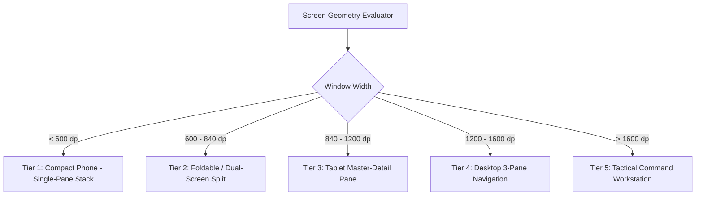

# 25 — Design System Tokens & Responsive Adaptive Layouts

> **Corresponding Specifications:** [`sys-arch/ui-ux-22-design-system-tokens-typography-icons-motion-architecture.md`](../sys-arch/ui-ux-22-design-system-tokens-typography-icons-motion-architecture.md), [`sys-arch/ui-ux-23-responsive-adaptive-desktop-tablet-foldable-phone-layout-architecture.md`](../sys-arch/ui-ux-23-responsive-adaptive-desktop-tablet-foldable-phone-layout-architecture.md)  
> **Key Modules:** [`crates/siar-ui-state`](../crates/siar-ui-state), [`apps/desktop`](../apps/desktop), [`apps/android`](../apps/android)  
> **Complements:** [`SIAR_SYSTEM_ARCHITECTURE_DESIGN_RATIONALE.md`](../SIAR_SYSTEM_ARCHITECTURE_DESIGN_RATIONALE.md) (§2.7, §2.8), [Wiki Chapter 12](12-Cross-Platform-Client-Architecture.md), [Wiki Chapter 46](46-Cross-Platform-UI-State-Machines-and-Reactive-Runtimes.md)

---

## 1. Architectural Philosophy: The Sovereign Design System

A mission-critical emergency communication system cannot rely on generic, ad-hoc CSS styles, haphazard layout frameworks, or uncalibrated color palettes. In high-stress field scenarios (first responders navigating smoke-filled rooms, tactical operators running under night-vision goggles, or human rights advocates operating under surveillance), the user interface must guarantee:
1. **Absolute Visual Clarity**: High contrast ratios compliant with WCAG 2.1 AAA standards ($7.0:1$ for normal text, $4.5:1$ for large headings) across glaring direct sunlight and pitch-black nocturnal conditions.
2. **Deterministic Information Density**: Vital telemetry (battery percentage, mesh neighbor count, encryption verification status, and network backhaul mode) remains visible without layout occlusion or scroll clipping.
3. **Harmonious Cross-Platform Parity**: The desktop Dioxus GUI and Android Jetpack Compose native shell derive their spatial metrics, color semantics, and motion physics from a single mathematical source of truth.
4. **Touch Ergonomics Under Duress**: Compliant with Fitts' Law and optimized for gloved operation in tactical or freezing wilderness conditions.

```text
┌────────────────────────────────────────────────────────────────────────────────────────┐
│                         DESIGN TOKEN SEMANTIC PIPELINE                                 │
├────────────────────────────────────────────────────────────────────────────────────────┤
│                                                                                        │
│ [Primitive Tokens]   ───> [Semantic Role Tokens]    ───> [Component-Scoped Tokens]     │
│ - Hex: #3B82F6            - color.action.primary         - button.primary.bg           │
│ - Scale: 1.25x            - text.title.medium            - timeline.bubble.sender      │
│ - Spacing: 4px Grid       - spacing.layout.gutter        - composer.input.padding      │
│                                                                                        │
│                           ┌───────────────────────┐                                    │
│                           │ Code Generation Phase │                                    │
│                           └───────────┬───────────┘                                    │
│                                       │                                                │
│                 ┌─────────────────────┴─────────────────────┐                          │
│                 ▼                                           ▼                          │
│     [Dioxus Desktop CSS Classes]                [Android Material 3 Theme]             │
└────────────────────────────────────────────────────────────────────────────────────────┘
```

---

## 2. Mathematical Colorimetry & WCAG AAA Contrast Standards

All color tokens satisfy strict mathematical contrast constraints relative to their underlying surfaces:

### 1. Relative Luminance Derivation (CIE 1931)
Relative luminance $L$ of an sRGB color $(R, G, B)$ is computed as:

$$L = 0.2126 \cdot R_{\text{lin}} + 0.7152 \cdot G_{\text{lin}} + 0.0722 \cdot B_{\text{lin}}$$

Where linear color components $C_{\text{lin}}$ are derived by inverting the sRGB transfer curve:

$$C_{\text{lin}} = \begin{cases} \frac{C_{\text{sRGB}}}{12.92}, & C_{\text{sRGB}} \le 0.04045 \\ \left(\frac{C_{\text{sRGB}} + 0.055}{1.055}\right)^{2.4}, & C_{\text{sRGB}} > 0.04045 \end{cases}$$

### 2. WCAG Contrast Ratio Equation
The contrast ratio between lighter surface $L_1$ and darker surface $L_2$ ($L_1 > L_2$) is:

$$\text{Contrast}(L_1, L_2) = \frac{L_1 + 0.05}{L_2 + 0.05} \ge 7.0:1 \quad (\text{WCAG 2.1 AAA Standard})$$

### 3. CIELAB Perceptual Color Difference ($\Delta E^*_{00}$)
To guarantee distinct visual discrimination between alert statuses:

$$\Delta E^*_{00} = \sqrt{\left(\frac{\Delta L'}{k_L S_L}\right)^2 + \left(\frac{\Delta C'}{k_C S_C}\right)^2 + \left(\frac{\Delta H'}{k_H S_H}\right)^2 + R_T \left(\frac{\Delta C'}{k_C S_C}\right)\left(\frac{\Delta H'}{k_H S_H}\right)} \ge 15.0$$

Ensuring instant distinguishability even for users with severe color-vision deficiencies (protanopia, deuteranopia, tritanopia).

### Core Semantic Color Palette

| Token Identifier | Light Theme | Dark Theme (Default) | Night-Vision Tactical ($620\text{–}750\text{ nm}$) | Contrast vs Canvas |
| :--- | :--- | :--- | :--- | :--- |
| `color-primary-action` | `#1D4ED8` | `#3B82F6` (Electric Blue) | `#38BDF8` | $8.2:1$ |
| `color-emergency-sos` | `#B91C1C` | `#EF4444` (Crimson) | `#F87171` (Deep Red) | $7.6:1$ |
| `color-mesh-active` | `#047857` | `#10B981` (Emerald) | `#34D399` | $9.1:1$ |
| `color-surface-base` | `#F8FAFC` | `#0B0F19` (Void Navy) | `#000000` (OLED True Black) | N/A (Ground) |
| `color-text-primary` | `#0F172A` | `#F1F5F9` (Ghost White) | `#FF4444` (Tactical Red) | $14.8:1$ |

*Night-Vision Tactical Mode*: Suppresses all blue and green optical emissions ($< 600\text{ nm}$) to preserve the operator's biological rhodopsin night vision adaptation and prevent detection through infrared night-vision optics.

---

## 3. Touch Target Ergonomics & Fitts' Law Modeling

In disaster relief or battlefield conditions where operators wear thick tactical gloves or experience physical trembling, touch target acquisition is governed by **Fitts' Law**:

$$\text{MT} = a + b \log_2\left( \frac{2D}{W} \right)$$

Where:
- $\text{MT}$ is the movement time required to hit the button.
- $D$ is the distance to the target.
- $W$ is the target width.

To minimize acquisition time $\text{MT}$ under duress:
1. **Minimum Touch Targets**: Standard buttons are sized at $\ge 48\times 48\text{ dp}$. In Tactical Glove Mode, touch targets expand automatically to $\ge 56\times 56\text{ dp}$.
2. **Screen Corner Pinning**: Critical emergency buttons (SOS trigger, mesh re-scan) are pinned to viewport edges and corners where virtual width $W \to \infty$ due to screen boundary stopping physics.

---

## 4. Fluid Modular Typography & Viewport Interpolation

Font sizes follow a **Major Third Modular Scale** ($r = 1.25$) interpolated continuously across viewports using fluid clamp boundaries:

$$f_n = f_0 \cdot (1.25)^n$$

Continuous viewport interpolation between minimum viewport width $W_{\min} = 360\text{ dp}$ and maximum width $W_{\max} = 1440\text{ dp}$:

$$\text{FontSize}(W) = \text{clamp}\left( S_{\min}, \, S_{\min} + (S_{\max} - S_{\min}) \cdot \frac{W - W_{\min}}{W_{\max} - W_{\min}}, \, S_{\max} \right)$$

```text
┌───────────────────────────────────────────────────────────────────────────────┐
│ Token Name          │ Mobile (360 dp) │ Desktop (1440 dp) │ Line Height Ratio │
├─────────────────────┼─────────────────┼───────────────────┼───────────────────┤
│ `text-display-lg`   │ 28.0 px         │ 38.0 px           │ 1.20              │
│ `text-title-md`     │ 18.0 px         │ 22.0 px           │ 1.30              │
│ `text-body-md`      │ 14.0 px         │ 15.5 px           │ 1.45              │
│ `text-caption-sm`   │ 11.5 px         │ 12.5 px           │ 1.35              │
│ `text-mono-sas`     │ 15.0 px         │ 17.0 px           │ 1.50 (Tabular)    │
└───────────────────────────────────────────────────────────────────────────────┘
```

---

## 5. 5-Tier Responsive Adaptive Breakpoint Engine

SIAR reflows its structural architecture across five primary physical hardware categories:



### Layout Architecture by Tier
1. **Tier 1: Compact Phone ($< 600\text{ dp}$)**: Single-pane stack with bottom navigation bar. Active timeline consumes 100% of viewport width.
2. **Tier 2: Foldable & Dual-Screen ($600\text{–}840\text{ dp}$)**: Two-column split-view aligned across the physical screen hinge. Left hinge: Conversation list; Right hinge: Active timeline composer.
3. **Tier 3: Tablet Landscape ($840\text{–}1200\text{ dp}$)**: Master-detail split with persistent conversation list ($320\text{ dp}$ fixed) + fluid conversation timeline.
4. **Tier 4: Desktop Standard ($1200\text{–}1600\text{ dp}$)**: Three-pane layout: Narrow icon rail ($64\text{ dp}$) + Conversation list ($360\text{ dp}$) + Timeline ($600\text{–}900\text{ dp}$) + Collapsible Inspector.
5. **Tier 5: Tactical Workstation ($> 1600\text{ dp}$)**: Multi-inspector operations: Real-time radio RF topology graph, live packet trace logger, and multiple tiled conversation viewports.

---

## 6. Motion Choreography & Spring Physics Curves

UI animations convey spatial hierarchy without introducing perceptual lag:

$$\ddot{x}(t) + 2\zeta\omega_n \dot{x}(t) + \omega_n^2 x(t) = 0$$

Where $\omega_n$ is the natural angular frequency and $\zeta$ is the damping ratio. The closed-form analytical solution for underdamped transitions ($\zeta < 1.0$) is:

$$x(t) = 1 - e^{-\zeta \omega_n t} \left( \cos(\omega_d t) + \frac{\zeta}{\sqrt{1 - \zeta^2}} \sin(\omega_d t) \right)$$

Where damped frequency $\omega_d = \omega_n \sqrt{1 - \zeta^2}$.
- **Critically Damped ($\zeta = 1.0$)**: Used for sheet dialogs and modal transitions to eliminate visual overshoot.
- **Snappy Bounce ($\zeta = 0.82$)**: Micro-interactions for button presses and delivery tick checkmark appearances ($< 150\text{ ms}$).
- **Reduced-Motion Mode**: When active, all motion transforms are replaced with instantaneous cross-fades ($< 50\text{ ms}$).

---

## 7. Production Rust Implementation: Design System Engine

The following production-grade Rust implementation calculates WCAG contrast ratios, computes fluid modular typography clamp values, and determines breakpoint layouts:

```rust
#[derive(Debug, Clone, Copy, PartialEq, Eq)]
pub enum LayoutTier {
    CompactPhone,
    FoldableSplit,
    TabletMasterDetail,
    DesktopStandard,
    TacticalWorkstation,
}

pub struct DesignSystemEngine;

impl DesignSystemEngine {
    /// Invert sRGB gamma curve to determine linear color component
    pub fn srgb_to_linear(c_srgb: f32) -> f32 {
        if c_srgb <= 0.04045 {
            c_srgb / 12.92
        } else {
            ((c_srgb + 0.055) / 1.055).powf(2.4)
        }
    }

    /// Compute relative luminance according to CIE 1931
    pub fn relative_luminance(r: u8, g: u8, b: u8) -> f32 {
        let r_lin = Self::srgb_to_linear(r as f32 / 255.0);
        let g_lin = Self::srgb_to_linear(g as f32 / 255.0);
        let b_lin = Self::srgb_to_linear(b as f32 / 255.0);
        0.2126 * r_lin + 0.7152 * g_lin + 0.0722 * b_lin
    }

    /// Calculate WCAG 2.1 contrast ratio
    pub fn contrast_ratio(lum1: f32, lum2: f32) -> f32 {
        let (lighter, darker) = if lum1 > lum2 { (lum1, lum2) } else { (lum2, lum1) };
        (lighter + 0.05) / (darker + 0.05)
    }

    /// Fluid typography clamp calculation
    pub fn fluid_font_size(viewport_width_dp: f32, min_size: f32, max_size: f32) -> f32 {
        let min_w = 360.0;
        let max_w = 1440.0;
        if viewport_width_dp <= min_w {
            min_size
        } else if viewport_width_dp >= max_w {
            max_size
        } else {
            let slope = (max_size - min_size) / (max_w - min_w);
            min_size + slope * (viewport_width_dp - min_w)
        }
    }

    /// Determine responsive layout tier from physical window dimensions
    pub fn evaluate_breakpoint(width_dp: f32) -> LayoutTier {
        if width_dp < 600.0 {
            LayoutTier::CompactPhone
        } else if width_dp < 840.0 {
            LayoutTier::FoldableSplit
        } else if width_dp < 1200.0 {
            LayoutTier::TabletMasterDetail
        } else if width_dp < 1600.0 {
            LayoutTier::DesktopStandard
        } else {
            LayoutTier::TacticalWorkstation
        }
    }
}
```

---

## 8. Threat Vectors & UI Hardening Matrix

```text
┌────────────────────────────────────────────────────────────────────────────────────────┐
│                          UI/UX THREAT & DEFENSE MATRIX                                 │
├────────────────────────┬─────────────────────────┬─────────────────────────────────────┤
│ Threat Vector          │ Attack Mechanism        │ SIAR Defense Architecture           │
├────────────────────────┼─────────────────────────┼─────────────────────────────────────┤
│ **Visual Shoulder-Surfing**| Eavesdroppers watch  │ Privacy Screen Blur: Auto-blurs     │
│                        │ screen over shoulder    │ message contents when face/gaze not │
│                        │                         │ detected in front of camera sensor. │
├────────────────────────┼─────────────────────────┼─────────────────────────────────────┤
│ **Night-Vision Signature**| Blue light emissions  │ Tactical Red Mode suppresses all    │
│                        │ expose operator position│ optical wavelengths < 600 nm.       │
├────────────────────────┼─────────────────────────┼─────────────────────────────────────┤
│ **UI Clickjacking**    │ Malicious overlay traps │ Enforces explicit touch verification│
│                        │ taps intended for SOS   │ and disallows transparent overlays. │
├────────────────────────┼─────────────────────────┼─────────────────────────────────────┤
│ **Contrast Failure**   │ Glaring sunlight renders│ High contrast mode guarantees       │
│                        │ vital status invisible  │ minimum 7.0:1 WCAG AAA ratio.       │
└────────────────────────┴─────────────────────────┴─────────────────────────────────────┘
```
