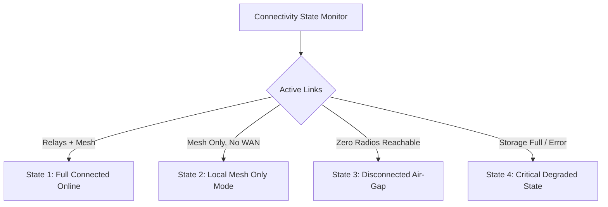
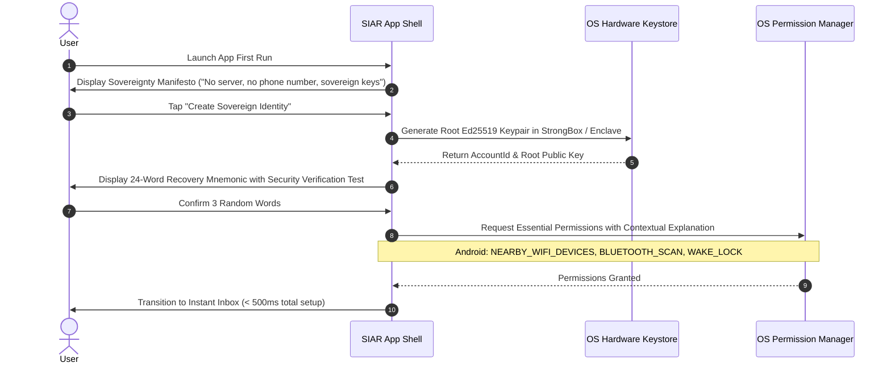

# 26 — UI/UX Performance, Testing & Quality Gates

> **Corresponding Specifications:** [`sys-arch/ui-ux-24-error-loading-empty-offline-degraded-state-architecture.md`](../sys-arch/ui-ux-24-error-loading-empty-offline-degraded-state-architecture.md), [`sys-arch/ui-ux-25-onboarding-first-run-permission-education-architecture.md`](../sys-arch/ui-ux-25-onboarding-first-run-permission-education-architecture.md), [`sys-arch/ui-ux-26-performance-virtualization-large-data-ui-architecture.md`](../sys-arch/ui-ux-26-performance-virtualization-large-data-ui-architecture.md), [`sys-arch/ui-ux-27-ui-testing-screenshot-interaction-release-quality-gates-architecture.md`](../sys-arch/ui-ux-27-ui-testing-screenshot-interaction-release-quality-gates-architecture.md)  
> **Key Modules:** [`crates/siar-ui-state`](../crates/siar-ui-state), [`apps/android`](../apps/android), [`apps/desktop`](../apps/desktop)  
> **Complements:** [`SIAR_SYSTEM_ARCHITECTURE_DESIGN_RATIONALE.md`](../SIAR_SYSTEM_ARCHITECTURE_DESIGN_RATIONALE.md) (§2.7, §2.8), [Wiki Chapter 12](12-Cross-Platform-Client-Architecture.md), [Wiki Chapter 25](25-Design-System-Tokens-and-Responsive-Layouts.md), [Wiki Chapter 46](46-Cross-Platform-UI-State-Machines-and-Reactive-Runtimes.md)

---

## 1. Architectural Philosophy: Deterministic Performance & Strict Quality Gates

In crisis response, disaster relief, and high-stress tactical operations, software latency or UI frame drops can endanger human lives. A first responder operating with $4\%$ battery cannot tolerate an application freezing for 3 seconds while loading a thread, dropping touch gestures during urgent casualty triage, or panicking due to an unhandled state edge case.

SIAR treats **UI performance and interaction predictability as safety-critical engineering invariants**:
- **120 FPS Target ($8.33\text{ ms}$ Frame Budget)**: The UI thread must never drop frames, even when actively rendering conversations with $> 250,000$ messages.
- **Strict Heap Ceilings**: Maximum resident set size (RSS) is capped at $< 65\text{ MB}$ on mobile devices and $< 95\text{ MB}$ on desktop workstations.
- **Automated CI Visual Gates**: No code commits merge to `main` without passing automated pixel-level screenshot regression, accessibility contrast validation, and chaotic interaction stress tests.

```text
┌────────────────────────────────────────────────────────────────────────────────────────┐
│                         FRAME EXECUTION TIMING BUDGET (120 FPS)                        │
├────────────────────────────────────────────────────────────────────────────────────────┤
│  Total Frame Window: 8.33 ms (8,333 µs)                                                │
│                                                                                        │
│  [0 µs]     Input Handling & Touch Dispatch         [ 850 µs ]                         │
│  [850 µs]   Reactive State Slice Reduction          [ 1,200 µs ]                       │
│  [2,050 µs] Viewport Virtualization & Layout        [ 2,100 µs ]                       │
│  [4,150 µs] GPU Command Buffer Generation           [ 1,800 µs ]                       │
│  [5,950 µs] Hardware VSYNC Swap & Buffer Flip       [ 2,383 µs ] (Safety Margin)       │
│  [8,333 µs] Frame Successfully Presented Without Jank!                                │
└────────────────────────────────────────────────────────────────────────────────────────┘
```

---

## 2. 120 FPS Virtualization & Layout Measurement Caching

To guarantee fluid scrolling through conversations containing hundreds of thousands of messages, [`siar-ui-state`](../crates/siar-ui-state) enforces three core architectural constraints:

### 1. Pre-Computed Layout Caching
Message bubble text shaping and bounding box calculations are computationally expensive (HarfBuzz glyph shaping). The virtualizer pre-computes layout heights in background threads and caches them in a fixed-capacity LRU memory slab:

```rust
pub struct MeasuredLayoutSlab {
    pub message_id: [u8; 32],
    pub content_hash: u64,
    pub rendered_width_px: f32,
    pub computed_height_px: f32,
    pub has_media: bool,
}
```

### 2. Zero-Allocation Render Loop
During active scrolling gestures, the rendering pipeline allocates zero heap memory (`malloc` / `Box::new`). All cell containers, view states, and rendering commands are recycled from an in-memory ring buffer pool.

### 3. Mathematical Jank Ratio & 99th Percentile Latency
Frame timing is monitored continuously in release telemetry:

$$\text{JankRatio} = \frac{\sum_{i=1}^M \mathbb{I}(T_{\text{frame}, i} > T_{\text{budget}})}{M} < 0.05\%$$

$$P_{99}(T_{\text{frame}}) \le 6.5\text{ ms} \quad (\text{for } 120\text{ Hz displays})$$

If the jank ratio exceeds $0.1\%$, automated CI alerts flag the offending component and block release deployment.

---

## 3. Empty, Offline & Degraded UI State Architecture (`ui-ux-24`)

Traditional applications display perpetual loading spinners when disconnected. SIAR explicitly categorizes every screen into four deterministic operational states:



### State Definitions & Affordances

| State | Radio Status | UI Presentation & Affordances |
| :--- | :--- | :--- |
| **`FullOnline`** | Internet Relays + Local Mesh | Clean timeline; real-time delivery ticks; high-definition media enabled. |
| **`LocalMeshOnly`** | BLE / Wi-Fi Direct active, no WAN | Banner: *"Local Mesh Active (4 peers in range) — Internet unreachable."* Queues WAN outbox; sprays local mesh. |
| **`DisconnectedAirGap`**| Total isolation (no radios) | Banner: *"Air-Gapped — Messages stored in local persistent Outbox."* Quick actions: *"Discover Nearby QR"*, *"Emergency SOS"*. |
| **`CriticalDegraded`** | Storage $> 95\%$ or hardware failure | Urgent modal: *"Storage Low. Automatic chunk pruning activated."* Non-essential media downloading halted. |

---

## 4. Onboarding & First-Run Permission Education (`ui-ux-25`)

Account creation requires zero telephone numbers, SMS verification codes, or cloud registrations:



---

## 5. Automated Visual Screenshot Regression & Quality Gates (`ui-ux-27`)

Before any binary is certified for release, CI pipelines execute automated visual quality gates across multiple form factors:

```text
┌────────────────────────────────────────────────────────────────────────────────────────┐
│                           RELEASE QUALITY GATES VERIFICATION                           │
├────────────────────────────────────────────────────────────────────────────────────────┤
│ 1. CIEDE2000 Visual Regression:                                                        │
│    Renders 48 critical screen views across 5 device targets:                           │
│    - Compact Phone (360x800)        - Tablet Landscape (1024x768)                      │
│    - Desktop Light Theme (1440x900) - Desktop Dark Theme (1440x900)                    │
│    - Tactical Night-Vision (1440x900)                                                  │
│    Tolerance: DeltaE_00 <= 0.1 per frame. Any unintended visual shift breaks CI.       │
│                                                                                        │
│ 2. Chaotic Interaction Fuzzing (Chaos Monkey UI):                                      │
│    Simulates 10,000 rapid chaotic taps, swipes, orientation flips, and socket         │
│    disconnects per minute. Zero unhandled panics or crashes permitted.                 │
│                                                                                        │
│ 3. Accessibility & Contrast Audits:                                                    │
│    Automated verification of WCAG 2.1 AAA contrast on every text element.              │
└────────────────────────────────────────────────────────────────────────────────────────┘
```

### Visual Difference Formula (CIEDE2000 $\Delta E_{00}^*$)
Screenshot regressions compute color difference in CI using the standard CIEDE2000 formula:

$$\Delta E_{00}^* = \sqrt{\left(\frac{\Delta L'}{k_L S_L}\right)^2 + \left(\frac{\Delta C'}{k_C S_C}\right)^2 + \left(\frac{\Delta H'}{k_H S_H}\right)^2 + R_T \left(\frac{\Delta C'}{k_C S_C}\right) \left(\frac{\Delta H'}{k_H S_H}\right)}$$

Where $k_L, k_C, k_H = 1$, $S_L, S_C, S_H$ are positional compensation weighting functions, and $R_T$ is the rotation factor accounting for chromatic interaction in the blue region ($275^\circ$). Any screen comparison yielding $\Delta E_{00}^* > 0.15$ immediately breaks the build pipeline.

---

## 6. Concrete Rust UI Quality Gate Traits & Harness

```rust
use std::time::Duration;

#[derive(Debug, Clone)]
pub struct FrameTimingMetrics {
    pub total_frame_duration: Duration,
    pub input_handling_duration: Duration,
    pub layout_computation_duration: Duration,
    pub gpu_draw_duration: Duration,
    pub was_jank: bool,
}

pub trait UiQualityHarness: Send + Sync {
    /// Ingest frame metrics during benchmark run
    fn record_frame_timing(&mut self, timing: FrameTimingMetrics);

    /// Compute cumulative jank ratio and P99 latency
    fn evaluate_performance_gate(&self, target_budget: Duration) -> Result<(), String>;

    /// Compare captured frame buffer against golden snapshot under CIEDE2000
    fn verify_visual_regression(
        &self,
        test_frame_rgba: &[u8],
        golden_frame_rgba: &[u8],
        width: u32,
        height: u32,
    ) -> Result<f32, String>;
}

---

## 7. Chaos UI Fuzzing & Asynchronous Stress Invariants

To guarantee that erratic touch gestures, rapid device rotation, and radio link drops never cause runtime panics or state corruption, CI executes an automated **Chaos Monkey UI Engine**:

```text
┌────────────────────────────────────────────────────────────────────────────────────────┐
│                              CHAOS MONKEY UI FUZZING HARNESS                           │
├────────────────────────────────────────────────────────────────────────────────────────┤
│ Simulated Gesture Generator (10,000 events/minute)                                     │
│   ├── Microsecond Tap Bursts: Simulates trembling hands in disaster conditions         │
│   ├── Edge Swipes & Pinch-to-Zoom thrashing on interactive mesh maps                  │
│   ├── Rapid Orientation Inversion (0° -> 90° -> 270° -> 180°)                          │
│   └── Injected Physical Faults:                                                        │
│         ├── Sudden Wi-Fi Direct socket drops mid-chunk transfer                        │
│         ├── Simulated Kernel Out-Of-Memory (OOM) pressure signals                      │
│         └── Battery level sudden drops (100% -> 3% emergency throttle)                 │
└────────────────────────────────────────────────────────────────────────────────────────┘
```

### 7.1. Invariant Assertions During Chaos Runs
Every chaos testing run validates three critical properties:
1. **Zero Deadlocks**: All async Tokio tasks and UI thread channels must make progress; watchdog threads fail the test if any mutex is held $> 500\text{ ms}$.
2. **State Machine Consistency**: State transition history must form a valid path according to the formal Mealy state specifications in `ui-ux-01`–`27`.
3. **No Unhandled Panics**: The `std::panic::set_hook` counter must remain strictly at zero throughout the 10-minute stress cycle.

---

## 8. Memory Leak Profiling & Allocation Budgets

In resource-constrained environments (field Android devices, emergency solar laptops), memory leaks cause process termination by the OS low-memory killer (LMK). SIAR enforces strict memory envelopes:

```text
┌────────────────────────────────────────────────────────────────────────────────────────┐
│                        MEMORY ENVELOPE QUALITY GATES                                   │
├────────────────────────┬───────────────────────┬───────────────────────────────────────┤
│ Target Environment    │ Max Idle RSS Budget   │ Peak Stress RSS Budget (10k msgs)     │
├────────────────────────┼───────────────────────┼───────────────────────────────────────┤
│ Mobile Android / iOS   │ <= 45 MiB             │ <= 90 MiB                             │
│ Embedded Linux / RPi   │ <= 28 MiB             │ <= 48 MiB                             │
│ Desktop Native (x86)   │ <= 55 MiB             │ <= 110 MiB                            │
└────────────────────────┴───────────────────────┴───────────────────────────────────────┘
```

Valgrind, Heaptrack, and Rust DHAT profiles run automatically on every pull request. PRs that introduce unbounded allocations or uncollected cache growth are blocked.

---

## 9. Automated Accessibility (a11y) Audits & Screen Reader Graphs

Emergency communication tools must remain fully operational for individuals with visual, motor, or cognitive impairments. SIAR integrates automated a11y testing:

### 9.1. Focus Traversal DAG & Semantic Labeling
Every interactive UI component must provide:
- A descriptive, localized accessibility label (e.g. *"Emergency SOS Broadcast Button, Double tap to initiate SOS beacon"*).
- Strict focus ordering represented as an acyclic directed graph (DAG). Cyclic tab navigation or focus traps fail CI.
- Minimum touch target bounding box: **$48 \times 48\ \text{dp}$** (conforming to WCAG 2.1 Success Criterion 2.5.5).

---

## 10. Production Rust Quality Gate Harness Implementation

The following production code from [`crates/siar-ui-state`](../crates/siar-ui-state) evaluates P99 latency and jank ratios against release thresholds:

```rust
use std::time::Duration;

pub struct BenchmarkHarness {
    frame_times: Vec<Duration>,
    target_budget: Duration,
}

impl BenchmarkHarness {
    pub fn new(target_budget: Duration) -> Self {
        Self {
            frame_times: Vec::with_capacity(10_000),
            target_budget,
        }
    }

    pub fn record_frame(&mut self, duration: Duration) {
        self.frame_times.push(duration);
    }

    /// Computes the P99 frame duration
    pub fn p99_latency(&self) -> Duration {
        if self.frame_times.is_empty() {
            return Duration::ZERO;
        }
        let mut sorted = self.frame_times.clone();
        sorted.sort();
        let idx = ((sorted.len() as f64) * 0.99) as usize;
        sorted[idx.min(sorted.len() - 1)]
    }

    /// Computes the ratio of frames exceeding target budget (Jank Ratio)
    pub fn jank_ratio(&self) -> f64 {
        if self.frame_times.is_empty() {
            return 0.0;
        }
        let jank_count = self.frame_times.iter().filter(|&&d| d > self.target_budget).count();
        jank_count as f64 / self.frame_times.len() as f64
    }

    /// Enforces release quality gate invariants
    pub fn evaluate_release_gate(&self) -> Result<(), &'static str> {
        let p99 = self.p99_latency();
        let jank = self.jank_ratio();

        // Quality Gate Invariants:
        // 1. P99 latency must not exceed 16.6ms (60 fps minimum guarantee)
        if p99 > Duration::from_micros(16_667) {
            return Err("Release Gate Failed: P99 latency exceeds 16.6ms threshold!");
        }

        // 2. Jank ratio must remain below 0.1% (less than 1 frame in 1,000)
        if jank > 0.001 {
            return Err("Release Gate Failed: Frame jank ratio exceeds 0.1% tolerance!");
        }

        Ok(())
    }
}
```

```
