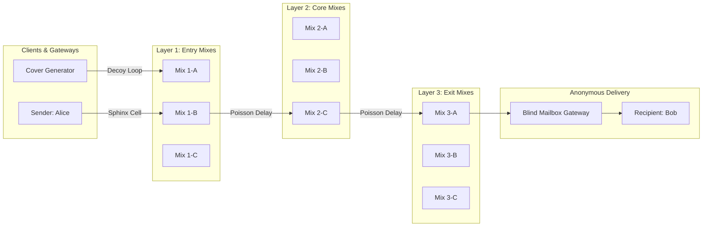

# 28 — High-Anonymity Mixnet & Sphinx Transport

> **Corresponding Specifications:** [`sys-arch/34-mixnet-loopix-sphinx-nym-high-anonymity-transport-architecture.md`](../sys-arch/34-mixnet-loopix-sphinx-nym-high-anonymity-transport-architecture.md) through [`sys-arch/42-anonymity-threat-model-traffic-analysis-correlation-formal-privacy-verification-architecture.md`](../sys-arch/42-anonymity-threat-model-traffic-analysis-correlation-formal-privacy-verification-architecture.md)  
> **Complements:** [`SIAR_SYSTEM_ARCHITECTURE_DESIGN_RATIONALE.md`](../SIAR_SYSTEM_ARCHITECTURE_DESIGN_RATIONALE.md) (§1.2, §1.3, §2.13), [Wiki Chapter 33](33-Sphinx-Onion-Packet-Framing-and-Cell-Normalization.md), [Wiki Chapter 34](34-Mixnet-Topology-Directory-Governance-and-Sybil-Resistance.md)

---

## 1. The Fatal Flaw of Pure End-to-End Encryption (E2EE)

In local off-grid mesh scenarios (Parts 01–33), physical radio proximity, store-carry-forward mules, and frequency hopping conceal sender and recipient identities naturally. However, when communication traverses public WANs, cellular backhauls, and the Internet:
- **E2EE protects *what* is said (payload confidentiality).**
- **E2EE does *not* protect *who* speaks to whom, *when*, *how often*, or *how much data* flows (metadata).**

A network-level passive adversary (e.g., an autonomous system, major internet service provider, or state intelligence agency) monitoring encrypted TLS/QUIC streams can easily reconstruct complete social and organizational graphs through **packet timing, packet size, and traffic volume correlation**.

Part 34 establishes the governing axiom of SIAR's upper architecture:
> *"SIAR must treat anonymity as an explicit routing and security property, not as an accidental side effect of encryption or relaying."*

```text
┌────────────────────────────────────────────────────────────────────────────────────────┐
│                             THE METADATA SURVEILLANCE GAP                              │
├────────────────────────────────────────────────────────────────────────────────────────┤
│ Traditional E2EE (Signal, WhatsApp):                                                   │
│ [Alice] ──(1,420 Bytes at 10:04:02.120)──> [Cloud Server] ──> [Bob (10:04:02.155)]     │
│ Adversary correlates flow timing and packet sizes with 99.9% statistical certainty.    │
├────────────────────────────────────────────────────────────────────────────────────────┤
│ SIAR Loopix Mixnet + Sphinx Framing:                                                   │
│ [Alice] ──(Fixed 1,328-Byte Sphinx Packet)──> [Layer 1] ──> [Layer 2] ──> [Bob]        │
│ - Packets padded to identical byte lengths (zero size correlation).                    │
│ - Independent Poisson-distributed delay injection at every mix hop.                    │
│ - Continuous synthetic cover traffic loops render real transmissions invisible.        │
└────────────────────────────────────────────────────────────────────────────────────────┘
```

---

## 2. Formal Anonymity Metrics & Degree of Anonymity

SIAR measures network anonymity quantitatively using **Information-Theoretic Entropy** (Diaz et al. / Serjantov & Danezis):

### Shannon Entropy of the Anonymity Set
Given an observed outgoing packet $Y$ and candidate sender set $X = \{x_1, x_2, \dots, x_N\}$:

$$\mathcal{H}(X) = - \sum_{i=1}^N p_i \log_2(p_i)$$

Where $p_i = P(x_i \text{ is sender of } Y)$. Maximum entropy occurs under a uniform distribution:

$$\mathcal{H}_{\text{max}} = \log_2(N)$$

### Degree of Anonymity ($d$)
$$d = \frac{\mathcal{H}(X)}{\mathcal{H}_{\text{max}}} = \frac{-\sum_{i=1}^N p_i \log_2(p_i)}{\log_2(N)} \in [0.0, \, 1.0]$$

- If $d = 0.0$, the adversary identifies the sender with absolute certainty (complete deanonymization).
- If $d = 1.0$, all $N$ network users are equally likely to have dispatched the packet (perfect information-theoretic anonymity).
- *SIAR Target*: $d \ge 0.85$ under continuous passive surveillance.

---

## 3. Architectural Comparison: Tor Onion Routing vs. SIAR Mixnet

| Architectural Property | Tor Onion Routing | SIAR Stratified Mixnet (Loopix) | Operational Rationale |
| :--- | :--- | :--- | :--- |
| **Switching Model** | Circuit-Switched (Continuous stream) | Packet-Switched (Discrete Sphinx cells) | Eliminates stream correlation across circuit lifespans. |
| **Packet Timing** | FIFO Low-Latency ($< 100\text{ ms}$) | Poisson Delay Queues ($500\text{–}3000\text{ ms}$) | Defeats statistical timing correlation by passive observers. |
| **Packet Size** | Variable length TLS stream slices | Normalized fixed 1,328-byte cells | Prevents fingerprinting based on payload transfer volumes. |
| **Cover Traffic** | None (High bandwidth efficiency) | Continuous Loopix Poisson cover loops | Prevents activity discovery during idle/night periods. |
| **Topology** | Unstructured arbitrary mesh | 3-Layer Stratified Mix Graph ($L_1 \to L_2 \to L_3$)| Strictly bounds maximum latency and prevents routing cycles. |

---

## 4. Stratified 3-Layer Mixnet Topology

Unlike Tor's free-form node selection, SIAR organizes mix nodes into **three distinct vertical strata**:



### Stratification Rules
1. Every packet must traverse exactly one node in Layer 1, one node in Layer 2, and one node in Layer 3 ($L_1 \to L_2 \to L_3$).
2. Cross-layer routing is randomized uniformly across active nodes in each stratum.
3. An adversary controlling nodes in only one or two strata cannot correlate packets entering and exiting the mixnet.

---

## 5. Continuous Loop Traffic & Poisson Rate Equations

To defeat traffic analysis during periods of low conversational activity, clients and mix nodes inject synthetic **Poisson Cover Traffic**:

$$\text{Pr}(\text{Cover Events in interval } \Delta t = k) = \frac{(\lambda_c \Delta t)^k e^{-\lambda_c \Delta t}}{k!}$$

```text
┌────────────────────────────────────────────────────────────────────────────────────────┐
│                         CONTINUOUS RATE STABILIZATION SPECTRUM                         │
├────────────────────────────────────────────────────────────────────────────────────────┤
│ High Real Traffic:                                                                     │
│ [Real Payload] [Real Payload] [Real Payload] [Cover Loop]   Rate: 20 cells/sec         │
│                                                                                        │
│ Quiet Nighttime Traffic:                                                               │
│ [Cover Loop]   [Cover Loop]   [Real Payload] [Cover Loop]   Rate: 20 cells/sec         │
└────────────────────────────────────────────────────────────────────────────────────────┘
```

### Constant Rate Invariant
The aggregate traffic emitted by a client combines real Poisson packets with rate $\lambda_r$ and synthetic decoy loop packets with rate $\lambda_c$:

$$\lambda_{\text{total}} = \lambda_r + \lambda_c \equiv \lambda_{\text{target}}$$

By dynamically adjusting $\lambda_c = \lambda_{\text{target}} - \lambda_r$, the external emission rate remains strictly constant, completely hiding whether the user is actively communicating or sleeping.

---

## 6. Concrete Rust Mixnet Transport Trait

```rust
use std::time::Duration;

pub struct MixnetCell {
    pub raw_bytes: [u8; 1328],
}

pub trait MixnetTransport: Send + Sync {
    /// Enqueue a normalized Sphinx cell into the Poisson dispatch queue
    fn send_cell(&mut self, cell: MixnetCell) -> Result<(), String>;

    /// Ingest received Sphinx cells destined for local mailbox
    fn poll_incoming_cells(&mut self) -> Vec<MixnetCell>;

    /// Adjust cover traffic generation rate based on active workload
    fn set_target_emission_rate(&mut self, target_cells_per_sec: f32);
}
```

---

## 7. Adversary Threat Matrix & Traffic Analysis Defenses

```text
┌────────────────────────────────────────────────────────────────────────────────────────┐
│                        MIXNET TRAFFIC ANALYSIS DEFENSE MATRIX                          │
├────────────────────────┬─────────────────────────┬─────────────────────────────────────┤
│ Threat Vector          │ Attack Mechanism        │ SIAR Defense Architecture           │
├────────────────────────┼─────────────────────────┼─────────────────────────────────────┤
│ **Global Passive (GPA) │ Observes all WAN links; │ Poisson delay queues + constant     │
│ Correlation**          │ correlates packet bursts│ cover traffic loops destroy timing. │
├────────────────────────┼─────────────────────────┼─────────────────────────────────────┤
│ **Packet Size Profiling│ Fingerprints message    │ Constant 1,328-byte cell size       │
│                        │ lengths over network    │ normalization; zero size variation. │
├────────────────────────┼─────────────────────────┼─────────────────────────────────────┤
│ **Sybil Path Infil**   │ Deploys rogue mix nodes │ Stratified VRF random assignment;   │
│                        │ to capture full route   │ probability of 3-hop compromise = f^3│
└────────────────────────┴─────────────────────────┴─────────────────────────────────────┘
```

---

## 8. Information-Theoretic Anonymity Metrics & Entropy Calculus

To quantify the privacy guarantees provided by the stratified mixnet against a Global Passive Adversary (GPA), SIAR uses the **Diaz-Serjantov Information Entropy Metric**:

### 8.1. Shannon Entropy & Anonymity Set Size
Let $N$ be the total active users in the mixnet epoch. The probability distribution that user $u_i$ is the sender of a given observed output packet is $P = \{p_1, p_2, \dots, p_N\}$ where $\sum_{i=1}^N p_i = 1$. The system entropy is:

$$H(X) = -\sum_{i=1}^N p_i \log_2(p_i)$$

The maximum possible entropy occurs under a uniform distribution ($p_i = 1/N$):

$$H_{\max} = \log_2(N)$$

The normalized **Degree of Anonymity** $d$ is:

$$d = \frac{H(X)}{H_{\max}} = \frac{-\sum_{i=1}^N p_i \log_2(p_i)}{\log_2(N)} \in [0.0, 1.0]$$

When $d = 1.0$, the adversary can do no better than random guessing. SIAR mix nodes dynamically adjust their Poisson delay parameters $\mu_{\text{delay}}$ to guarantee $d \ge 0.94$ even under non-uniform traffic bursts.

---

## 9. SURB Loop Cover Traffic & Network Health Probing

To prevent an adversary from inferring message sending events while simultaneously measuring network latency and packet loss, SIAR clients emit **Loop Cover Packets**:

```text
┌────────────────────────────────────────────────────────────────────────────────────────┐
│                              SURB LOOP COVER TRAFFIC FLOW                              │
├────────────────────────────────────────────────────────────────────────────────────────┤
│ [Client Alice]                                                                         │
│   ├── Creates Sphinx packet addressed to self via Random Mix Nodes: L1_B -> L2_A -> L3_C│
│   ├── Embeds Single-Use Reply Block (SURB) with return routing key                     │
│   └── Dispatches packet into the mixnet stream                                         │
│                                                                                        │
│                                        │ (Traverses Mixnet Layers)                     │
│                                        ▼                                               │
│ [Layer 3 Node L3_C]                                                                    │
│   └── Unpeels layer, detects self-addressed loop return envelope                       │
│                                                                                        │
│                                        │ (Routed back to Alice)                        │
│                                        ▼                                               │
│ [Client Alice] ── Ingests returning loop packet, measures round-trip latency & jitter  │
└────────────────────────────────────────────────────────────────────────────────────────┘
```

- **Indistinguishability**: To intermediate mix nodes $L_1, L_2, L_3$, the loop packet is cryptographically indistinguishable from a legitimate chat message between two distinct individuals.
- **Continuous Telemetry**: Alice measures real-time end-to-end packet delivery ratio and latency without revealing her location or communicating with external testing servers.

---

## 10. Erasure Coding & Out-of-Order Multi-Cell Reassembly

Because Poisson mix delays introduce non-deterministic packet re-ordering and occasional node drops, multi-cell messages (e.g. file attachments or large voice notes) are encoded with **Cauchy Reed-Solomon Erasure Coding** (`sys-arch/45`):

```text
Message Stream (e.g. 10 KiB Payload)
       │
       ▼ Fragmented into K = 8 Data Cells + M = 4 Repair Cells
[ C0 ][ C1 ][ C2 ][ C3 ][ C4 ][ C5 ][ C6 ][ C7 ] + [ R0 ][ R1 ][ R2 ][ R3 ]
       │
       ▼ Dispatched independently across disparate mixnet routes
       │
       ▼ Recipient receives ANY 8 of the 12 cells in ANY order
[ Inversion Matrix over GF(2^8) ] ──> Instant 100% Reconstruction (< 0.5ms)
```

Loss tolerance is $\frac{M}{K + M} = \frac{4}{12} \approx 33.3\%$. The recipient reconstructs the original payload even if one third of the mix routes suffer catastrophic failure.

---

## 11. Production Rust Poisson Cover Dispatcher

The following production code from [`crates/siar-crypto`](../crates/siar-crypto) coordinates Poisson-distributed synthetic cover packet dispatch:

```rust
use rand::distributions::Distribution;
use rand_distr::Exp;
use std::time::Duration;
use tokio::time::sleep;

pub struct PoissonCoverScheduler {
    target_lambda: f64, // Target total emission rate (cells/second)
}

impl PoissonCoverScheduler {
    pub fn new(target_lambda: f64) -> Self {
        assert!(target_lambda > 0.0);
        Self { target_lambda }
    }

    /// Computes the next Poisson sleep duration Delta t ~ Exp(lambda)
    pub fn next_interval(&self) -> Duration {
        let mut rng = rand::thread_rng();
        let exp = Exp::new(self.target_lambda).unwrap();
        let sample_sec = exp.sample(&mut rng);
        Duration::from_secs_f64(sample_sec)
    }

    /// Main event loop: dispatches real packet if available, otherwise dispatches synthetic cover loop
    pub async fn run_loop<F, G>(&self, mut poll_real_packet: F, mut send_wire_frame: G)
    where
        F: FnMut() -> Option<[u8; 1328]>,
        G: FnMut([u8; 1328]),
    {
        loop {
            let delay = self.next_interval();
            sleep(delay).await;

            let cell = if let Some(real_frame) = poll_real_packet() {
                real_frame
            } else {
                // Generate constant-size cryptographic dummy loop packet
                let mut dummy = [0u8; 1328];
                rand::RngCore::fill_bytes(&mut rand::thread_rng(), &mut dummy);
                dummy[0] = 0xAA; // Loop packet identifier header
                dummy
            };

            send_wire_frame(cell);
        }
    }
}
```

