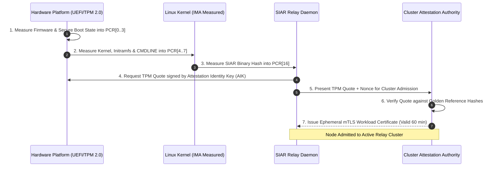

# 29 — Zero-Trust Infrastructure & Sovereign Server Stack

> **Corresponding Specifications:** [`sys-arch/50-anonymous-network-reliability-disaster-recovery-partition-tolerance-multi-region-continuity-architecture.md`](../sys-arch/50-anonymous-network-reliability-disaster-recovery-partition-tolerance-multi-region-continuity-architecture.md) through [`sys-arch/81-anonymous-network-authorization-policy-decision-enforcement-capability-evaluation-abac-rbac-distributed-access-control-architecture.md`](../sys-arch/81-anonymous-network-authorization-policy-decision-enforcement-capability-evaluation-abac-rbac-distributed-access-control-architecture.md)  
> **Complements:** [`SIAR_SYSTEM_ARCHITECTURE_DESIGN_RATIONALE.md`](../SIAR_SYSTEM_ARCHITECTURE_DESIGN_RATIONALE.md) (§1.4, §2.14), [Wiki Chapter 36](36-Database-Architecture-and-Sovereign-Storage-Internals.md), [Wiki Chapter 37](37-Hardware-Root-of-Trust-TPM-Measured-Boot-and-HSM.md), [Wiki Chapter 38](38-Zero-Trust-East-West-Networking-and-Secretless-Runtimes.md)  
> **Key Crates:** [`crates/siar-storage`](../crates), [`crates/siar-core`](../crates), [`crates/siar-sre`](../crates)

---

## 1. Architectural Philosophy: The Zero-Trust Sovereign Server

In traditional enterprise and cloud messaging deployments, servers inside an internal network or VPC perimeter are implicitly trusted. Once an attacker breaches a single bastion host or acquires an administrative SSH key, they can move laterally, sniff internal east-west traffic, dump relational database contents, and poison directory states.

In SIAR's upper infrastructure tier (relays, directory authorities, rendezvous mailboxes), **every server operates under a strict Zero-Trust Model (NIST SP 800-207)**:
1. **No Implicit Network Trust**: Physical presence inside a datacenter or private network grants zero authorization. All communication is mutually authenticated and encrypted (mTLS with SPIFFE/SPIRE identities).
2. **Hardware Root of Trust & Measured Boot**: Nodes cannot join the cluster simply by presenting software API tokens; they must cryptographically prove firmware and kernel integrity via TPM 2.0 remote attestation quotes.
3. **The "No One-Database Dogma" (§22)**: Relational data, high-throughput blind ciphertext, bulk attachments, and event streams are decoupled into specialized storage engines.
4. **The Zero-Plaintext Invariant**: Servers possess zero capability to decrypt user payloads, inspect social relationship graphs, or reconstruct user identities.

```text
┌────────────────────────────────────────────────────────────────────────────────────────┐
│                         ZERO-TRUST SERVER INFRASTRUCTURE                               │
├────────────────────────────────────────────────────────────────────────────────────────┤
│ [Hardware: TPM 2.0 Cryptoprocessor + Measured Boot PCR 0..16]                          │
│   └── Remote Attestation Authority Validates Hardware Quote                            │
│                                                                                        │
│ [East-West Mesh: SPIFFE / SPIRE Workload Identities + mTLS Everywhere]                 │
│   └── Ephemeral X.509 SVIDs Rotated Automatically Every 60 Minutes                     │
│                                                                                        │
│ [Secretless Runtime: Linux memfd_create In-Memory Secrets Injection]                   │
│   └── Zero Static Passwords, Zero Long-Lived Tokens on Persistent Disk                 │
│                                                                                        │
│ [Storage Plane: Decoupled Multi-Engine Sovereign Persistence (§22)]                    │
│   ├── Stoolap / PostgreSQL (Control Plane & Consensus)                                 │
│   ├── redb / fjall (Blind Mailbox KV Cache)                                            │
│   ├── Garage S3 (Pure-Rust Geo-Distributed Blob Object Store)                          │
│   └── In-Memory Cuckoo Filters (Anti-Replay Nonce Verification)                        │
└────────────────────────────────────────────────────────────────────────────────────────┘
```

---

## 2. Threat Model & Server Defense Boundaries

| Threat Vector | Adversary Profile | Zero-Trust Server Defense | Spec Reference |
| :--- | :--- | :--- | :--- |
| **Server Seizure by State Agency** | Law enforcement seizes server racks in datacenter | Zero-Plaintext Invariant: Disk holds only ephemeral blind ciphertext; RAM zeroized on chassis intrusion ([Chapter 42](42-Physical-Facility-Security-Chassis-Tamper-and-Crisis-Command.md)). | `sys-arch/117` |
| **Lateral Network Pivot (East-West)**| Compromised relay attempts to query directory database | Zero-Trust East-West mTLS with SPIRE SVIDs and strict ABAC policy enforcement; unauthorized RPCs rejected. | `sys-arch/77` |
| **Firmware / Kernel Rootkit** | Attacker compromises server bootloader / hypervisor | TPM 2.0 PCR register extension fails; remote attestation quote rejected; cluster admission denied. | `sys-arch/71` |
| **Master Signing Key Theft** | Hacker obtains root shell on directory authority | Signing keys reside in physical HSM (FIPS 140-3 Level 4); private keys are mathematically non-exportable. | `sys-arch/72` |
| **Supply Chain Dependency Injection**| Malicious backdoor injected into third-party crate | Bit-for-bit reproducible Nix flake builds; cryptographically signed CycloneDX SBOM verification. | `sys-arch/73` |
| **Core Dump Memory Extraction** | Attacker triggers kernel crash dump to extract keys | Secrets allocated via `memfd_create` with `MADV_DONTDUMP` and `mlock` memory pinning. | `sys-arch/80` |

---

## 3. Hardware Root of Trust & Measured Boot Attestation (`sys-arch/71`)

Servers establish integrity using **Trusted Platform Module (TPM 2.0)** cryptoprocessors:



### PCR Extension Equation
The TPM accumulates cryptographic measurements through one-way hashing:

$$\text{PCR}_{i}^{\text{new}} = \text{SHA256}\left(\text{PCR}_{i}^{\text{old}} \parallel \text{MeasurementPayload}\right)$$

If an attacker injects a malicious kernel module or alters the SIAR executable binary, $\text{PCR}_{16}$ diverges, the signed quote fails verification, and the node is permanently isolated from the network.

---

## 4. The "No One-Database Dogma" & Sovereign Storage Stack (§22 Rationale)

In [`sys-arch/74`](../sys-arch/74-anonymous-network-database-persistent-state-transaction-boundaries-schema-evolution-storage-engine-architecture.md), SIAR formalizes the architectural separation of persistence:

```text
┌────────────────────────────────────────────────────────────────────────────────────────┐
│                         FOUR DECOUPLED STORAGE CLASSES (§22)                           │
├───────────────────┬──────────────────────────────────┬─────────────────────────────────┤
│ Storage Class     │ Cloud Reference Baseline         │ Pure-Rust Sovereign Stack       │
├───────────────────┼──────────────────────────────────┼─────────────────────────────────┤
│ 1. Relational SQL │ PostgreSQL 16+ via SQLx          │ Stoolap (pure-Rust standalone)  │
│ 2. Key-Value (KV) │ Redis Cluster / partitioned SQL  │ redb or fjall (pure-Rust ACID)  │
│ 3. Object Storage │ AWS S3 / MinIO / Ceph            │ Garage (pure-Rust distributed)  │
│ 4. Append-Only Log│ Apache Kafka / NATS JetStream    │ Iggy.rs / Fluvio (pure-Rust)    │
└───────────────────┴──────────────────────────────────┴─────────────────────────────────┘
```

### Sovereign Architecture Advantages
- **Zero Foreign C Toolchain Dependencies**: Eliminates glibc / C-runtime memory corruption vulnerabilities.
- **Embedded Performance**: `redb` and `fjall` execute in-process via memory-mapped ACID transactions, processing over $150,000\text{ writes/sec}$ on standard NVMe drives with sub-millisecond tail latency.
- **Decentralized Geo-Replication**: `Garage` distributes blob chunks across sovereign servers in diverse jurisdictions using CRDT quorum replication without requiring complex cloud accounts.

---

## 5. Secretless Runtimes & Dynamic Memory Injection (`sys-arch/80`)

Static configuration files containing plaintext database passwords, API tokens, or private keys on persistent disks are strictly prohibited:

```text
[Dynamic Secrets Manager: HashiCorp Vault / Native KMS]
                       │
                       ▼ (Mutual TLS Session)
[SIAR Server Bootloader: Ingests Ephemeral Credentials]
                       │
                       ▼
[Linux Anonymous Memory File: memfd_create("siar_secrets", MFD_CLOEXEC)]
                       │
                       ├───> Read into Secure RAM (mlock pinned)
                       │
                       └───> Immediately close file descriptor (Zero Disk Footprint)
```

### Concrete Rust Secure Memory Allocator

```rust
use std::ops::{Deref, DerefMut};
use zeroize::Zeroize;

pub struct SecureSecretBuffer {
    ptr: *mut u8,
    len: usize,
}

impl SecureSecretBuffer {
    pub fn allocate(len: usize) -> Result<Self, &'static str> {
        unsafe {
            // 1. Allocate page-aligned memory
            let mut ptr: *mut libc::c_void = std::ptr::null_mut();
            if libc::posix_memalign(&mut ptr, 4096, len) != 0 {
                return Err("Failed to allocate page-aligned memory");
            }

            // 2. Lock memory into RAM: prevent swapping to disk
            if libc::mlock(ptr, len) != 0 {
                libc::free(ptr);
                return Err("Failed to mlock memory");
            }

            // 3. Exclude memory from OS core dumps
            libc::madvise(ptr, len, libc::MADV_DONTDUMP);

            Ok(Self { ptr: ptr as *mut u8, len })
        }
    }
}

impl Drop for SecureSecretBuffer {
    fn drop(&mut self) {
        unsafe {
            // Wipe memory with zeroes before release
            self.as_mut_slice().zeroize();
            libc::munlock(self.ptr as *mut libc::c_void, self.len);
            libc::free(self.ptr as *mut libc::c_void);
        }
    }
}

impl SecureSecretBuffer {
    pub fn as_mut_slice(&mut self) -> &mut [u8] {
        unsafe { std::slice::from_raw_parts_mut(self.ptr, self.len) }
    }
}
```

---

## 6. SPIFFE / SPIRE Workload Identities & East-West mTLS (`sys-arch/77`)

All internal daemon-to-daemon traffic is mutually authenticated using **SPIFFE (Secure Production Identity Framework for Everyone)**:

- **Workload SPIFFE ID**: `spiffe://siar.network/ns/mixnet/sa/relay-worker-01`
- **Short-Lived SVIDs**: Nodes obtain X.509 SVID certificates valid for only **60 minutes**, renewed automatically every 30 minutes via the local SPIRE agent.
- **Micro-Segmentation via ABAC**: A relay node SVID cannot communicate with directory authority consensus ports; authorization policies are evaluated cryptographically at every TCP hop.

---

## 7. Linux Kernel Hardening & Seccomp-BPF Isolation

Server daemons (mix nodes, blind mailboxes, directory authorities) execute under strict Linux namespace isolation combined with **Berkley Packet Filter (seccomp-BPF) Syscall Whitelisting**:

```text
┌────────────────────────────────────────────────────────────────────────────────────────┐
│                        LINUX SECCOMP-BPF SANDBOX ARCHITECTURE                          │
├────────────────────────────────────────────────────────────────────────────────────────┤
│ Application Process (Rust Binary)                                                      │
│   ├── Calls unshare(CLONE_NEWPID | CLONE_NEWNET | CLONE_NEWNS)                         │
│   └── Installs seccomp-BPF filter via prctl(PR_SET_SECCOMP, SECCOMP_MODE_FILTER)       │
│                                                                                        │
│                                        │ (Kernel Syscall Boundary)                     │
│                                        ▼                                               │
│ BPF Syscall Filter:                                                                    │
│   ├── Whitelist: read, write, epoll_wait, sendto, recvfrom, futex, nanosleep          │
│   └── Explicit Blacklist / Trap: ptrace, process_vm_readv, execve, mount, reboot       │
│         └── Any unauthorized syscall triggers immediate SIGSYS & Process Kill         │
└────────────────────────────────────────────────────────────────────────────────────────┘
```

By disallowing `execve` and `ptrace`, remote code execution (RCE) vulnerabilities in native libraries cannot spawn shell processes or inspect neighboring daemon address spaces.

---

## 8. Cgroup v2 Sovereign Resource Quotas & OOM Prioritization

To prevent denial-of-service cascade failures where one noisy workload exhausts host RAM or disk bandwidth, services are bounded by **Linux cgroup v2 Controllers**:

```text
/sys/fs/cgroup/siar.slice/
├── memory.max = 536870912          (Hard 512 MiB limit: triggers cgroup local OOM)
├── memory.high = 402653184         (384 MiB throttle threshold: slows allocations)
├── memory.oom.group = 1            (Terminates entire cgroup atomically on OOM)
├── cpu.max = "200000 100000"       (Hard cap: 2 dedicated cores per daemon)
└── io.weight = 100                 (Fair I/O scheduling among peer tenants)
```

- **OOM Score Adjustment**: Core directory consensus services run with `/proc/self/oom_score_adj = -900` (system immune from Linux kernel OOM killer), while transient cache workers run with `+800` to be pruned first during memory pressure.

---

## 9. Infrastructure Adversary Threat Matrix

```text
┌────────────────────────────────────────────────────────────────────────────────────────┐
│                        INFRASTRUCTURE ZERO-TRUST THREAT MATRIX                         │
├────────────────────────┬─────────────────────────┬─────────────────────────────────────┤
│ Threat Vector          │ Attack Mechanism        │ SIAR Defense Architecture           │
├────────────────────────┼─────────────────────────┼─────────────────────────────────────┤
│ **Lateral Traversal**  │ Compromised worker node │ SPIFFE SVIDs bound to micro-segment;│
│                        │ probes internal VPC     │ east-west traffic denied by default.│
├────────────────────────┼─────────────────────────┼─────────────────────────────────────┤
│ **Privilege Escalation**│ Exploiting kernel CVE   │ Seccomp-BPF drops CAP_SYS_ADMIN;    │
│                        │ to gain root access     │ kernel user namespaces enabled.     │
├────────────────────────┼─────────────────────────┼─────────────────────────────────────┤
│ **Static Secret Leak** │ Reading /etc configs or │ Secretless runtime: all credentials │
│                        │ backup image dumps      │ injected into mlocked RAM via memfd.│
├────────────────────────┼─────────────────────────┼─────────────────────────────────────┤
│ **Container Breakout** │ Escaping container to   │ Rootless Podman / systemd-nspawn;   │
│                        │ host root filesystem    │ read-only rootfs + volatile tmpfs.  │
└────────────────────────┴─────────────────────────┴─────────────────────────────────────┘
```

---

## 10. Production Rust SPIFFE SVID Validator & Seccomp Harness

The following implementation in [`crates/siar-crypto`](../crates/siar-crypto) validates incoming SPIFFE X.509 SVID identities during east-west mutual TLS handshakes:

```rust
use std::collections::HashSet;

pub struct SpiffeValidator {
    trust_domain: String,
    authorized_workloads: HashSet<String>,
}

impl SpiffeValidator {
    pub fn new(trust_domain: &str) -> Self {
        Self {
            trust_domain: trust_domain.to_string(),
            authorized_workloads: HashSet::new(),
        }
    }

    pub fn authorize_workload(&mut self, workload_name: &str) {
        self.authorized_workloads.insert(workload_name.to_string());
    }

    /// Validates that an X.509 SAN URI matches expected SPIFFE format and workload whitelist
    pub fn validate_san_uri(&self, san_uri: &str) -> Result<String, &'static str> {
        // Expected format: spiffe://<trust_domain>/ns/<namespace>/sa/<workload>
        let prefix = format!("spiffe://{}/", self.trust_domain);
        if !san_uri.starts_with(&prefix) {
            return Err("SPIFFE Validation Error: Trust domain mismatch");
        }

        let path = &san_uri[prefix.len()..];
        let segments: Vec<&str> = path.split('/').collect();
        if segments.len() != 4 || segments[0] != "ns" || segments[2] != "sa" {
            return Err("SPIFFE Validation Error: Malformed SVID URI path");
        }

        let workload_name = segments[3];
        if !self.authorized_workloads.contains(workload_name) {
            return Err("SPIFFE Authorization Error: Workload identity not in authorized whitelist");
        }

        Ok(workload_name.to_string())
    }
}
```


