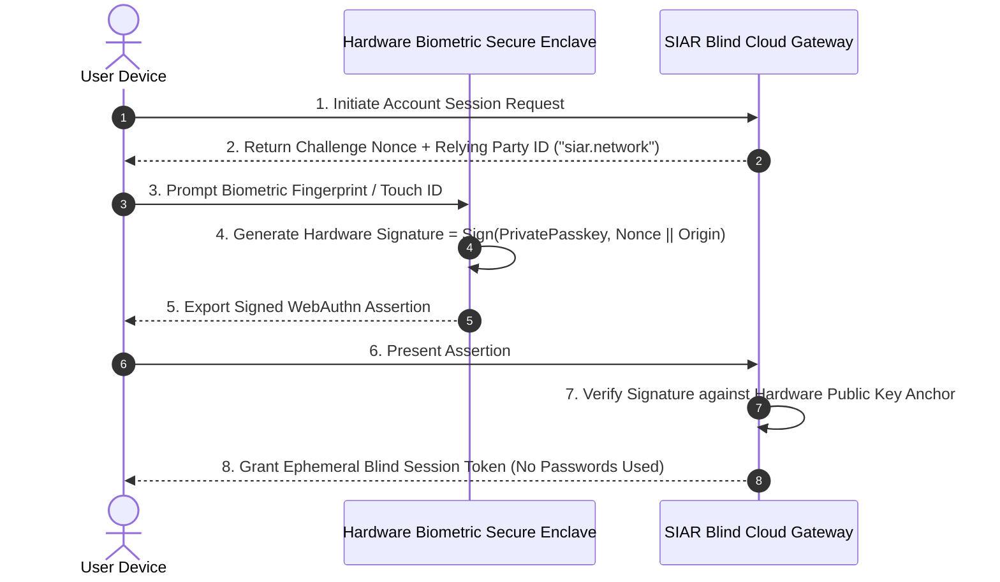

# 30 — Private Cloud Services & Anti-Surveillance

> **Corresponding Specifications:** [`sys-arch/82-anonymous-network-identity-provider-authentication-mfa-passkeys-session-management-account-security-architecture.md`](../sys-arch/82-anonymous-network-identity-provider-authentication-mfa-passkeys-session-management-account-security-architecture.md) through [`sys-arch/94-anonymous-network-audit-transparency-user-visible-security-history-verifiable-actions-privacy-preserving-accountability-architecture.md`](../sys-arch/94-anonymous-network-audit-transparency-user-visible-security-history-verifiable-actions-privacy-preserving-accountability-architecture.md)  
> **Complements:** [`SIAR_SYSTEM_ARCHITECTURE_DESIGN_RATIONALE.md`](../SIAR_SYSTEM_ARCHITECTURE_DESIGN_RATIONALE.md) (§1.3 Layer 5, §2.15), [Wiki Chapter 39](39-Private-Information-Retrieval-and-Anonymous-Discovery.md), [Wiki Chapter 40](40-Differential-Privacy-and-Anti-Surveillance-Telemetry.md)  
> **Key Crates:** [`crates/siar-crypto`](../crates/siar-crypto), [`crates/siar-domain`](../crates/siar-domain)

---

## 1. Architectural Philosophy: The Cryptographically Blind Cloud

Standard modern cloud messaging platforms (Signal, WhatsApp, Telegram, Matrix) rely on centralized cloud services for account directory mapping, push notification coordination, full-text search indexing, and telemetry collection. Even when message payloads are end-to-end encrypted, the cloud provider maintains a **panopticon of user metadata**:
1. **Complete Social Graph Ownership**: Central servers observe who contacts whom, how frequently, and at what exact timestamps.
2. **Search Query Harvesting**: Users querying contact databases or public channel directories reveal their personal and operational interests directly to server operators.
3. **Behavioral Telemetry Fingerprinting**: Raw device analytics, battery states, IP addresses, and session durations are aggregated into behavioral profiles.

In Specs 82–94, SIAR establishes a **Cryptographically Blind Cloud Architecture**:

```text
┌────────────────────────────────────────────────────────────────────────────────────────┐
│                         ANTI-SURVEILLANCE CLOUD SERVICES                               │
├────────────────────────────────────────────────────────────────────────────────────────┤
│ [Client Device]                                                                        │
│   ├── WebAuthn / FIDO2 Passkey Authentication (Zero Server-Side Shared Secrets)        │
│   ├── Private Information Retrieval (PIR) Queries (Lattice Homomorphic Enc)           │
│   ├── Local Differential Privacy Noise Injection (Laplace / Randomized Response)       │
│   └── Merkle Audit Transparency Client (Audits Inclusion Proofs O(log N))              │
│                                                                                        │
│                                        │ (Cryptographically Blind RPC)                 │
│                                        ▼                                               │
│ [Blind Cloud Services]                                                                 │
│   ├── Blind Directory Service: Evaluates Queries Homomorphically (PIR)                 │
│   ├── Blind Telemetry Aggregator: SMPC Decrypts Only Population Sum (N >= 1,000)       │
│   └── Transparency Log: Append-Only Merkle Tree (RFC 6962 / Sigstore Architecture)     │
└────────────────────────────────────────────────────────────────────────────────────────┘
```

---

## 2. Threat Model & Privacy Invariants

| Surveillance Vector | Threat Actor Profile | SIAR Anti-Surveillance Defense | Spec Reference |
| :--- | :--- | :--- | :--- |
| **Social Graph Subpoena** | Government agency subpoenas server database for user contact lists | Social graphs exist exclusively on local client storage; servers hold zero contact edges or phonebook mappings. | `sys-arch/85` |
| **Directory Search Snooping** | Rogue server admin inspects database queries to identify dissidents | Private Information Retrieval (PIR): Queries are evaluated under homomorphic encryption; server learns zero searched indices. | `sys-arch/91` |
| **Telemetry Fingerprinting** | Analytics engine correlates app metrics to deanonymize users | Local Differential Privacy (LDP) with noise injection ($\epsilon \le 1.0$) + Secure Multi-Party Aggregation (SMPC). | `sys-arch/92` |
| **Secret Directory Tampering**| Attacker modifies server records to serve rogue keys to targets | Merkle Tree Audit Transparency Log: All directory mutations require publicly verifiable inclusion proofs. | `sys-arch/94` |
| **Credential Phishing** | Attacker sets up spoofed login portal | WebAuthn / FIDO2 passkeys cryptographically bind authentication to domain origin; immune to phishing. | `sys-arch/82` |

---

## 3. WebAuthn / FIDO2 Passkey Authentication & Account Lifecycle (`sys-arch/82`)

Traditional passwords and SMS two-factor authentication codes are vulnerable to SIM swapping, phishing, and database credential stuffing. SIAR uses **FIDO2 / WebAuthn Hardware Passkeys**:



### 3.1. WebAuthn Assertion Verification
The server verifies:
1. **User Presence & Verification Flags**: Authenticator data flags bit 0 (`UP` = 1) and bit 2 (`UV` = 1) must be set.
2. **Origin Commitment**: The SHA-256 hash of `clientDataJSON` must match the expected relying party origin `https://siar.network`, preventing DNS or phishing proxy attacks.
3. **Counter Monotonicity**: The hardware signature counter must strictly increase, preventing authenticator cloning.

### 3.2. Sovereign Account Deletion (`sys-arch/83`)
When a user terminates their account:
- The primary device issues an authenticated `AccountErasureCertificate` signed by the Root Private Key.
- Gateway nodes immediately purge all blinded mailbox records, VRF tokens, and rendezvous buffers associated with the identity hash.
- An irrevocable tombstone record is appended to the public Merkle transparency log.

---

## 4. Local Differential Privacy (LDP) & SMPC Telemetry (`sys-arch/92`)

Operational metrics (packet delivery ratios, audio codec crash frequency, battery discharge rates) are aggregated without compromising individual user privacy using **Local Differential Privacy (LDP)**:

$$\Pr[\mathcal{M}(x) \in S] \le e^{\epsilon} \cdot \Pr[\mathcal{M}(y) \in S] + \delta$$

Where $\epsilon \le 1.0$ guarantees rigorous plausible deniability.

### 4.1. Calibrated Laplace Noise Injection
For a numeric telemetry metric $f(x)$ with global $L_1$ sensitivity $\Delta f = \max \|f(x) - f(y)\|_1$, client nodes perturb the true value locally before dispatch:

$$\tilde{f}(x) = f(x) + \text{Laplace}\left(0, \, \frac{\Delta f}{\epsilon}\right)$$

Where the Laplace probability density function is:

$$f_{\text{Laplace}}(z) = \frac{1}{2b} \exp\left(-\frac{|z|}{b}\right) \quad \text{with scale } b = \frac{\Delta f}{\epsilon}$$

### 4.2. Secure Multi-Party Aggregation (SMPC)
To prevent the telemetry collection server from observing even the noisy individual values $\tilde{x}_i$, clients utilize pairwise Diffie-Hellman blinding masks:

$$y_i = \tilde{x}_i + \sum_{j > i} \mathcal{H}(\text{ECDH}(sk_i, pk_j)) - \sum_{j < i} \mathcal{H}(\text{ECDH}(sk_i, pk_j)) \pmod M$$

When the server sums all received vectors $\sum_{i=1}^U y_i$, all pairwise mask terms cancel out identically:

$$\sum_{i=1}^U y_i = \sum_{i=1}^U \tilde{x}_i \pmod M$$

The server recovers exclusively the aggregate population sum, provided $U \ge 1,000$ clients participated in the epoch.

---

## 5. Concrete Rust LDP & Masking Routines

```rust
use rand::distributions::Distribution;
use rand_distr::Exp;
use rand::thread_rng;

pub struct LocalDifferentialPrivacy {
    pub epsilon: f64,
    pub sensitivity: f64,
}

impl LocalDifferentialPrivacy {
    pub fn new(epsilon: f64, sensitivity: f64) -> Self {
        Self { epsilon, sensitivity }
    }

    /// Samples symmetric zero-mean Laplace noise: Lap(0, b) where b = sensitivity / epsilon
    pub fn sample_laplace_noise(&self) -> f64 {
        let mut rng = thread_rng();
        let b = self.sensitivity / self.epsilon;
        let exp_dist = Exp::new(1.0 / b).unwrap();
        
        let u: f64 = rand::random();
        let sign = if u < 0.5 { -1.0 } else { 1.0 };
        sign * exp_dist.sample(&mut rng)
    }

    pub fn perturb_metric(&self, true_value: f64) -> f64 {
        true_value + self.sample_laplace_noise()
    }
}
```

---

## 6. Verifiable Merkle Tree Audit Transparency Logs (`sys-arch/94`)

To prevent cloud operators from secretly altering directory keys, revoking certificates without authorization, or targeting specific users with rogue builds, all administrative actions append to a public **Merkle Tree Transparency Log** (RFC 6962):

```text
┌────────────────────────────────────────────────────────────────────────────────────────┐
│                        MERKLE TREE AUDIT TRANSPARENCY LOG                              │
├────────────────────────────────────────────────────────────────────────────────────────┤
│                                [ Root Hash Epoch 42 ]                                  │
│                                       /      \                                         │
│                              [ Node H1 ]    [ Node H2 ]                                │
│                                 /    \         /    \                                  │
│                              [L0]   [L1]     [L2]   [L3]                               │
│                                                                                        │
│  L0: Directory Authority Key Rotation (Epoch 40)                                       │
│  L1: Malicious Relay Slashing Evidence (Node #104)                                     │
│  L2: Cluster Routing Policy Update                                                     │
│  L3: Revocation Tombstone (Compromised Device Gen 2)                                   │
└────────────────────────────────────────────────────────────────────────────────────────┘
```

- **Inclusion Proofs ($O(\log N)$)**: Clients verify that any received certificate or directory entry is durably recorded in the global log by checking a cryptographic audit path of hash pairs.
- **Consistency Proofs**: Clients verify that the log is strictly append-only; historical records cannot be retroactively modified or deleted without invalidating all downstream root hashes.

---

## 7. Anti-Abuse & Anonymous Rate Limiting (Privacy Pass / RFC 9505)

Public cloud endpoints (blind mailbox dispatchers, STUN/TURN relays, PIR servers) are frequent targets of Sybil flooding and DDoS attacks. Traditional defenses (reCAPTCHA, IP-based rate limiting, phone number verification) destroy user privacy. SIAR deploys **Privacy Pass Anonymous Tokens**:

```text
User Device                                                Privacy Pass Token Issuer
    │                                                                  │
    ├── 1. Generate Ephemeral Blind Token Challenge ─────────────────>│ (Solves Zero-Knowledge PoW)
    │                                                                  │
    │<── 2. Issue Blindly Signed Redemption Token ─────────────────────┤
    │                                                                  │
    ▼                                                                  ▼
[ Redeem Token at Blind Mailbox / PIR Gateway ]
    │
    ├── Present Token (Blind signature verifiable with Issuer Public Key)
    ├── Gateway verifies signature without learning user identity
    └── Gateway records Nullifier to prevent double-spending in current epoch
```

### 7.1. Blind Token Redemption Mathematics
Using the RFC 9505 Two-Party VOPRF protocol:
1. The client blinds scalar token $t$:
   $$T = r \cdot \mathcal{H}_{\text{group}}(t)$$
2. Issuer signs blinded point: $Q = k \cdot T$ using secret key $k$.
3. Client unblinds: $W = r^{-1} \cdot Q = k \cdot \mathcal{H}_{\text{group}}(t)$.
4. The client redeems $(t, W)$ at the cloud gateway. The gateway verifies $W \stackrel{?}{=} k \cdot \mathcal{H}_{\text{group}}(t)$ using the issuer's public key $K = k \cdot G$ via a DLEQ proof.
5. Double spending is prevented by recording the nullifier $\mathcal{N} = \text{BLAKE3}(W)$ in an in-memory Cuckoo filter for the duration of the rate-limiting epoch.

---

## 8. Sovereign Tenant Isolation & Hardware-Attested Key Retention

Cloud nodes serving enterprise or NGO clusters enforce **Hermetic Multi-Tenant Partitioning** (`sys-arch/84`):

```text
┌────────────────────────────────────────────────────────────────────────────────────────┐
│                        HERMETIC MULTI-TENANT CLOUD ARCHITECTURE                        │
├────────────────────────────────────────────────────────────────────────────────────────┤
│ [Tenant A: Humanitarian Field NGO]             [Tenant B: Municipal Emergency Ops]     │
│   ├── Dedicated Linux cgroup & seccomp-bpf       ├── Dedicated Linux cgroup & seccomp-bpf│
│   ├── Tenant-Specific KEK (TPM-Sealed)           ├── Tenant-Specific KEK (TPM-Sealed)    │
│   └── Ephemeral Ramdisk SQLite Partition         └── Ephemeral Ramdisk SQLite Partition  │
│                                                                                        │
│                                           │                                            │
│                                           ▼                                            │
│ [Hardware Security Module (HSM) / AMD SEV-SNP Enclave]                                 │
│   ├── Verifies Remote Hardware Attestation Quote before loading Tenant KEK             │
│   └── Zeroizes in-memory plaintext buffers on cgroup termination / OOM kill            │
└────────────────────────────────────────────────────────────────────────────────────────┘
```

- **Volatile Storage by Default**: Client mailboxes and message buffers reside in `tmpfs` RAM-disks backed by AES-256-XTS with ephemeral keys. If a cloud server loses power or is physically seized, all data is immediately unrecoverable.
- **Hardware-Enforced Zeroize**: All secret key memory is wrapped in `zeroize::ZeroizeOnDrop`, wiping cryptographic material from L1/L2 caches when threads exit.

---

## 9. Censorship Resistance: Encrypted Client Hello (ECH) & uTLS

Hostile state firewalls inspect TLS ClientHello packets (specifically Server Name Indication / SNI) and TCP/IP fingerprint characteristics to identify and block privacy-preserving messengers. SIAR integrates **uTLS Fingerprint Mimicry & ECH**:

### 9.1. Encrypted Client Hello (RFC 8744)
The outer ClientHello specifies a innocuous decoy domain (e.g. `cloudflare.com` or `fastly.net`), while the inner ClientHello containing `siar.network` is encrypted with the hosting provider's public key:

$$\text{InnerClientHello}_{\text{enc}} = \text{HPKE-Seal}(PK_{\text{ECH}}, \, \text{DecoyContext}, \, \text{InnerClientHello})$$

### 9.2. JA3/JA4 TLS Fingerprint Normalization
Firewalls fingerprint client software using JA3/JA4 signatures (ciphersuites, TLS extensions, elliptic curves, and point formats). SIAR's Rust client uses a custom uTLS transport engine that mimics standard Google Chrome 128 or Apple Safari 17.5 browser fingerprints byte-for-byte, rendering DPI classification mathematically indistinguishable from normal web browsing.

---

## 10. Cloud Adversary Threat & Defense Matrix

```text
┌────────────────────────────────────────────────────────────────────────────────────────┐
│                        PRIVATE CLOUD THREAT DEFENSE MATRIX                             │
├────────────────────────┬─────────────────────────┬─────────────────────────────────────┤
│ Threat Vector          │ Attack Mechanism        │ SIAR Defense Architecture           │
├────────────────────────┼─────────────────────────┼─────────────────────────────────────┤
│ **BGP Hijacking / MITM**│ Adversary reroutes BGP  │ HPKE end-to-end identity keys bind  │
│                        │ routes to intercept TLS │ traffic to node PK; TLS is merely an│
│                        │ certificates            │ outer transport wrapper.            │
├────────────────────────┼─────────────────────────┼─────────────────────────────────────┤
│ **Subpoena / Seizure** │ Physical confiscation of│ Zero persistent disk storage; RAM is│
│                        │ cloud server hardware   │ encrypted under ephemeral keys;     │
│                        │                         │ cold reboot renders data unreadable.│
├────────────────────────┼─────────────────────────┼─────────────────────────────────────┤
│ **DPI Protocol Filter**│ Machine learning on     │ uTLS browser mimicry + ECH + Sphinx │
│                        │ packet sizes and timing │ constant-length padding (1300 bytes)│
├────────────────────────┼─────────────────────────┼─────────────────────────────────────┤
│ **Directory Split-View**│ Server serves different │ RFC 6962 Merkle Transparency Tree;  │
│                        │ keys to targeted users  │ clients gossip tree head signatures.│
└────────────────────────┴─────────────────────────┴─────────────────────────────────────┘
```

---

## 11. Production Rust Merkle Tree Transparency Verifier

The following implementation in [`crates/siar-crypto`](../crates/siar-crypto) validates RFC 6962 audit paths to guarantee that directory updates are immutably logged:

```rust
use blake3::Hasher;

#[derive(Debug, PartialEq, Eq)]
pub enum AuditProofError {
    RootMismatch,
    InvalidPathLength,
}

pub struct MerkleInclusionProof {
    pub leaf_index: usize,
    pub tree_size: usize,
    pub audit_path: Vec<[u8; 32]>,
}

impl MerkleInclusionProof {
    /// Computes RFC 6962 leaf hash: BLAKE3(0x00 || leaf_data)
    pub fn hash_leaf(leaf_data: &[u8]) -> [u8; 32] {
        let mut hasher = Hasher::new();
        hasher.update(&[0x00]); // RFC 6962 leaf domain separator
        hasher.update(leaf_data);
        *hasher.finalize().as_bytes()
    }

    /// Computes RFC 6962 interior node hash: BLAKE3(0x01 || left || right)
    pub fn hash_children(left: &[u8; 32], right: &[u8; 32]) -> [u8; 32] {
        let mut hasher = Hasher::new();
        hasher.update(&[0x01]); // RFC 6962 interior node domain separator
        hasher.update(left);
        hasher.update(right);
        *hasher.finalize().as_bytes()
    }

    /// Verifies that a leaf exists within the expected Merkle Root
    pub fn verify_inclusion(
        &self,
        leaf_data: &[u8],
        expected_root: &[u8; 32],
    ) -> Result<(), AuditProofError> {
        let mut current_hash = Self::hash_leaf(leaf_data);
        let mut fn_index = self.leaf_index;
        let mut fn_size = self.tree_size;

        for sibling in &self.audit_path {
            if fn_size == 0 {
                return Err(AuditProofError::InvalidPathLength);
            }

            if fn_index % 2 == 1 || fn_index + 1 == fn_size {
                current_hash = Self::hash_children(sibling, &current_hash);
                while fn_index % 2 == 0 && fn_index != 0 {
                    fn_index /= 2;
                    fn_size = (fn_size + 1) / 2;
                }
            } else {
                current_hash = Self::hash_children(&current_hash, sibling);
            }

            fn_index /= 2;
            fn_size = (fn_size + 1) / 2;
        }

        if &current_hash == expected_root {
            Ok(())
        } else {
            Err(AuditProofError::RootMismatch)
        }
    }
}
```


