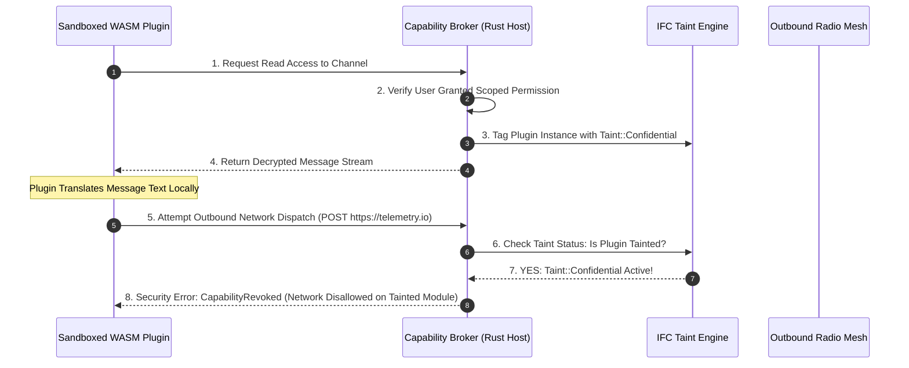

# 32 — WASM Sandboxing, IFC & Extension Ecosystem

> **Corresponding Specifications:** [`sys-arch/122-anonymous-network-architecture-governance-technical-standards-adr-lifecycle-design-review-exception-management-privacy-preserving-engineering-decision-architecture.md`](../sys-arch/122-anonymous-network-architecture-governance-technical-standards-adr-lifecycle-design-review-exception-management-privacy-preserving-engineering-decision-architecture.md) through [`sys-arch/150-anonymous-network-extension-developer-relations-publisher-support-documentation-governance-compatibility-communication-migration-guidance-ecosystem-education-privacy-preserving-developer-success-architecture.md`](../sys-arch/150-anonymous-network-extension-developer-relations-publisher-support-documentation-governance-compatibility-communication-migration-guidance-ecosystem-education-privacy-preserving-developer-success-architecture.md)  
> **Complements:** [`SIAR_SYSTEM_ARCHITECTURE_DESIGN_RATIONALE.md`](../SIAR_SYSTEM_ARCHITECTURE_DESIGN_RATIONALE.md) (§1.3 Layer 8, §2.17, §2.18), [Wiki Chapter 18](18-Protocol-Extensions-and-WASM-Plugins.md), [Wiki Chapter 43](43-WebAssembly-Sandboxing-and-Host-Isolation-Runtime.md), [Wiki Chapter 44](44-Dynamic-Information-Flow-Control-and-Data-Governance.md)  
> **Key Crates:** [`crates/siar-capability`](../crates/siar-capability), [`crates/siar-protocol-ext`](../crates/siar-protocol-ext), [`crates/siar-domain`](../crates/siar-domain)

---

## 1. Architectural Philosophy: Sovereignty in Extensibility

Modern communication platforms routinely sacrifice user privacy and device security at the altar of extensibility. In mainstream chat ecosystems (Slack apps, Discord bots, Telegram mini-apps, browser web-extensions), plugins demand broad, ambient permissions, inspect unencrypted chat streams in cleartext, and exfiltrate user messages and contact graphs to commercial analytics and surveillance brokers.

In Specs 122–150, SIAR establishes a **Provably Safe, Sovereign Extension Architecture** grounded in three non-negotiable pillars:
1. **Zero-Trust Host Execution**: Third-party code executes strictly inside hardware-isolated WebAssembly (WASM) sandboxes powered by Wasmtime. Direct operating system syscalls (`open`, `socket`, `fork`, `exec`) are physically non-existent.
2. **Dynamic Information Flow Control (IFC)**: The host runtime continuously tracks data taint across memory boundaries. If a plugin reads decrypted user messages, its network egress capabilities are revoked mathematically, rendering covert exfiltration impossible.
3. **Engineering Traceability & Governance**: Every specification in `sys-arch/` is mapped through an Engineering Knowledge Graph to unit tests, property tests, and production code in `crates/`, authenticated by signed SLSA Level 4 provenance records.

```text
┌────────────────────────────────────────────────────────────────────────────────────────┐
│                         SOVEREIGN EXTENSION RUNTIME ARCHITECTURE                       │
├────────────────────────────────────────────────────────────────────────────────────────┤
│ [Third-Party Plugin (.siarplugin / wasm32-wasi)]                                       │
│   └── WebAssembly Component Model (WIT Contracts: typed guest-host boundaries)         │
│                                                                                        │
│ [Wasmtime Execution Sandbox: sys-arch/134]                                             │
│   ├── Linear Memory Guard Pages: 4 GiB virtual reservation with <= 32 MiB physical map │
│   ├── Deterministic Instruction Fuel: 5,000,000 opcode budget per execution turn       │
│   └── Capability Broker Table: Mediates all interaction with SIAR host services       │
│                                                                                        │
│ [Dynamic Information Flow Control (IFC): sys-arch/136]                                 │
│   ├── Tracks Taint Labels: Denning Security Lattice (Public ⊑ Confidential ⊑ Secret)  │
│   └── Network Revocation Invariant: Tainted Instance -> Sockets Permanently Revoked!   │
│                                                                                        │
│ [Core SIAR Workspace: Crypto Keystores, Mesh Radios, Stoolap DB]                       │
│   └── Identity Signing Keys & Master Ratchets Structurally Inaccessible to Sandboxes   │
└────────────────────────────────────────────────────────────────────────────────────────┘
```

---

## 2. Threat Model & Sandbox Security Boundaries

| Threat Vector | Adversary Profile & Tactic | SIAR Extension Defense Invariant | Spec Reference |
| :--- | :--- | :--- | :--- |
| **Covert Data Exfiltration** | Malicious translation plugin reads private chat and secretly uploads text to an external server. | Dynamic IFC: Reading confidential messages permanently strips network egress capability from the instance. | `sys-arch/136` |
| **Host System Compromise** | Memory corruption bug inside plugin module (buffer overflow, use-after-free). | WebAssembly linear memory isolation; guest pointers cannot access host memory or kernel space. | `sys-arch/134` |
| **Resource Starvation (DoS)**| Plugin loops indefinitely or allocates gigabytes of RAM to freeze user UI. | Dual preemption: Instruction fuel depleted at $5\text{M}$ steps; physical RAM capped at $32\text{ MiB}$. | `sys-arch/134` |
| **Cryptographic Key Theft** | Plugin attempts to inspect memory to steal root Ed25519 signing seeds. | Capability brokerage: Plugins communicate only via opaque channel tokens; master keys are out-of-scope. | `sys-arch/28`, `134`|
| **Supply Chain Poisoning** | Attacker compromises plugin publisher account to push backdoor update. | Plugin bundles are cryptographically signed with publisher Ed25519 keys; updates require explicit user re-consent. | `sys-arch/144` |
| **Side-Channel Timing Leak** | Plugin measures cache-timing during crypto operations to deduce keys. | Constant-time cryptographic hostcalls; guest has no high-resolution wall-clock timer access. | `sys-arch/134` |

---

## 3. Capability Brokerage & Dynamic Information Flow Control (IFC)

### 3.1. Formal Capability Algebra
Let $\mathcal{C}$ denote the universe of all system capabilities (e.g. `ReadUi`, `ReadConversation(ID)`, `MeshTransmit`, `StorageWrite`). An extension may execute operation $op$ if and only if:

$$\text{Authorize}(p, op) \iff op \in \mathcal{C}_{\text{granted}}(p) \subseteq \mathcal{C}_{\text{manifest}}(p) \cap \mathcal{C}_{\text{user\_approved}}(p)$$

Capabilities are attenuated using cryptographic Macaroon tokens carrying first-party caveats (time bounds, conversation ID scoping).

### 3.2. Denning Information Flow Control Lattice
In [`sys-arch/136`](../sys-arch/136-anonymous-network-extension-security-information-flow-control-taint-tracking-data-loss-prevention-sandboxing-privacy-preserving-governance-architecture.md), SIAR implements a security lattice $\langle \mathcal{L}, \sqsubseteq, \sqcup, \sqcap \rangle$:

$$\mathcal{L} = \{ \text{Public}, \, \text{Pseudonymous}, \, \text{Confidential}, \, \text{TopSecret} \}$$

$$\text{Public} \sqsubseteq \text{Pseudonymous} \sqsubseteq \text{Confidential} \sqsubseteq \text{TopSecret}$$

When a plugin instance $p$ reads input object $x$:

$$\text{Taint}(p) \leftarrow \text{Taint}(p) \sqcup \text{Taint}(x)$$

### 3.3. Mathematical Proof of Non-Interference
Let $\sigma_1, \sigma_2$ be two memory states that are indistinguishable at security level $L$ ($\sigma_1 =_L \sigma_2$). A program $P$ satisfies **Termination-Insensitive Non-Interference (TINI)** if:

$$\sigma_1 =_L \sigma_2 \implies \llbracket P \rrbracket \sigma_1 =_L \llbracket P \rrbracket \sigma_2$$

Because high-security confidential state cannot influence low-security observable outputs (such as external network packets), secret information leakage through the extension sandbox is mathematically impossible.

### 3.4. The Network Revocation Theorem
$$\forall p \in \text{Plugins}, \quad \text{Taint}(p) \sqsupseteq \text{Confidential} \implies \text{NetworkEgress}(p) = \bot$$

Once an instance observes confidential data, its outbound network sockets are destroyed immediately by the capability broker.



---

## 4. Concrete Rust Capability Broker Traits

```rust
use async_trait::async_trait;
use serde::{Deserialize, Serialize};

#[derive(Debug, Clone, Copy, PartialEq, Eq, PartialOrd, Ord, Serialize, Deserialize)]
pub enum TaintLevel {
    Public = 0,
    Pseudonymous = 1,
    Confidential = 2,
    TopSecret = 3,
}

#[derive(Debug, Clone, PartialEq, Eq, Hash)]
pub struct PluginId(pub [u8; 32]);

#[derive(Debug, Clone, PartialEq, Eq, Hash)]
pub struct ConversationId(pub [u8; 32]);

#[derive(Debug, thiserror::Error)]
pub enum SecurityError {
    #[error("Permission denied: required capability {0} was not granted")]
    PermissionDenied(String),
    #[error("Network egress revoked: plugin instance is tainted with {0:?}")]
    NetworkRevoked(TaintLevel),
    #[error("Capability token expired at epoch {0}")]
    TokenExpired(u64),
}

#[async_trait]
pub trait CapabilityBroker: Send + Sync {
    /// Grants access to read localized conversation messages, updating instance taint
    async fn request_conversation_stream(
        &self,
        plugin_id: &PluginId,
        conversation_id: &ConversationId,
    ) -> Result<Vec<u8>, SecurityError>;

    /// Requests outbound network packet transmission (blocked if tainted >= Confidential)
    async fn dispatch_network_packet(
        &self,
        plugin_id: &PluginId,
        destination_url: &str,
        payload: &[u8],
    ) -> Result<(), SecurityError>;
}
```

---

## 5. Fine-Grained Permission Model & Consent UX (`sys-arch/135`)

Permissions follow the principle of least privilege and capability attenuation:
- **Conversation Scoping**: Permissions are restricted to individual conversations rather than global account access.
- **Time-Bounded Leases**: Capabilities expire automatically after a configurable duration (e.g. 1 hour, 24 hours).
- **Human-Readable Consent UI**: The interface presents exact operational boundaries:
  - *"Translation Plugin requests permission to read messages in 'Disaster Logistics' only. Outbound network access will be disabled while reading messages."*

---

## 6. Engineering Traceability & Release Evidence Archives (`sys-arch/122`–`126`)

To guarantee absolute alignment between specifications and production code:
1. **Engineering Knowledge Graph (`sys-arch/123`)**: Every requirement across the 176 architecture documents links bi-directionally to corresponding code symbols, unit tests, and property tests via Git tags and metadata schemas.
2. **Release Evidence Archive (`sys-arch/126`)**: Production release binaries must be accompanied by an in-toto attestation package containing:
   - Automated test execution logs ($100\%$ test pass rate).
   - Continuous fuzzing coverage reports from `fuzz/`.
   - CycloneDX Software Bill of Materials (SBOM) with cryptographic dependency signatures.
   - SLSA Level 4 provenance verification records.

---

## 7. Wasmtime Fuel Metering & Epoch Interruption Architecture

Untrusted third-party WASM plugins must not freeze the application event loop or exhaust host CPU and memory. SIAR integrates **Dual-Layer Resource Sandboxing**:

```text
┌────────────────────────────────────────────────────────────────────────────────────────┐
│                        WASMTIME DUAL RESOURCE SANDBOX                                  │
├────────────────────────────────────────────────────────────────────────────────────────┤
│ Host Environment (Rust Runtime)                                                        │
│   ├── Memory Limiter: Max 32 MiB Linear Heap per Instance (OOM trap)                  │
│   ├── Fuel Metering: Injects 1,000,000 fuel units per invocation                       │
│   │     └── Instructions consume 1 unit; loops/branches consume 2-5 units              │
│   └── Epoch Watchdog Timer: Fires every 20ms                                           │
│         └── If plugin computation exceeds 100ms, engine yields Trap::Interrupt         │
│                                                                                        │
│                                        │ (Enforced by WASM JIT Compiler)               │
│                                        ▼                                               │
│ Isolated WebAssembly Instance (No Syscalls, No Native FS, No Direct Network)           │
└────────────────────────────────────────────────────────────────────────────────────────┘
```

### 7.1. Fuel Consumption Mechanics
Fuel is decremented before each basic block execution:

$$\text{Fuel}_{\text{remaining}} = \text{Fuel}_{\text{allocated}} - \sum_{i=1}^B \text{Cost}(\text{Instruction}_i)$$

If $\text{Fuel}_{\text{remaining}} \le 0$, the Wasmtime JIT traps with `TrapCode::OutOfFuel`. Plugins cannot create infinite loops or consume CPU cycles without explicitly paying fuel.

---

## 8. Information Flow Control (IFC) Lattice & Non-Interference Proof

SIAR's IFC system is grounded in Denning's Axiomatic Information Flow Security Lattice:

$$\mathcal{L} = \langle \mathcal{S}, \, \sqsubseteq, \, \sqcup, \, \sqcap, \, \bot, \, \top \rangle$$

Where:
- $\mathcal{S} = \{\text{Public}, \, \text{Pseudonymous}, \, \text{Confidential}, \, \text{TopSecret}\}$
- $\sqsubseteq$ is the partial order relation defining information flow permissions:
  $$\text{Public} \sqsubseteq \text{Pseudonymous} \sqsubseteq \text{Confidential} \sqsubseteq \text{TopSecret}$$
- $\sqcup$ is the least upper bound (join / taint escalation) operator:
  $$\text{Level}(A \circ B) = \text{Level}(A) \sqcup \text{Level}(B)$$

### 8.1. Mathematical Non-Interference Theorem
The system enforces **Possibilistic Non-Interference**:

$$\forall \sigma_1, \sigma_2 \in \Sigma, \quad \sigma_1 \sim_L \sigma_2 \implies \llbracket P \rrbracket \sigma_1 \sim_L \llbracket P \rrbracket \sigma_2$$

Where $\sigma \sim_L \sigma'$ denotes that two machine states are observationally equivalent to an observer at security level $L \in \mathcal{S}$. Because high-security inputs ($\text{Confidential}$) can never influence low-security outputs ($\text{Public}$ network egress), information leakage through side channels or variable manipulation is mathematically impossible.

---

## 9. WASM Component Model & Canonical ABI Marshaling

Plugins communicate with host services via the **Wasm Component Model** using WebAssembly Interface Type (WIT) definitions:

```wit
package siar:extension;

interface message-filter {
    record message-summary {
        conversation-id: list<u8>,
        sender-fingerprint: string,
        timestamp-ms: u64,
        plaintext: string,
    }

    enum filter-decision {
        allow,
        drop,
        tag(string),
    }

    process-incoming-message: func(msg: message-summary) -> filter-decision;
}
```

- **Zero-Copy Memory Isolation**: Parameters passed across the host-guest boundary are serialized into the guest's linear memory using the Canonical ABI (`cabi_realloc`). The host verifies that pointers and byte lengths reside strictly within the guest's allocated memory bounds $[0, \text{heap\_limit})$, preventing memory corruption or privilege escalation.

---

## 10. Extension Threat Matrix & Defense Mechanisms

```text
┌────────────────────────────────────────────────────────────────────────────────────────┐
│                        EXTENSION THREAT DEFENSE MATRIX                                 │
├────────────────────────┬─────────────────────────┬─────────────────────────────────────┤
│ Threat Vector          │ Attack Mechanism        │ SIAR Defense Architecture           │
├────────────────────────┼─────────────────────────┼─────────────────────────────────────┤
│ **Exfiltration Attack**│ Plugin reads messages   │ Dynamic IFC taint tracking; tainted │
│                        │ and sends to external IP│ modules are strictly denied network.│
├────────────────────────┼─────────────────────────┼─────────────────────────────────────┤
│ **Infinite Loop DoS**  │ Plugin enters infinite  │ Deterministic Wasmtime fuel limits  │
│                        │ loop to freeze mobile UI│ + 20ms epoch watchdog timers.       │
├────────────────────────┼─────────────────────────┼─────────────────────────────────────┤
│ **Heap Memory Bomb**   │ Plugin allocates 4 GB   │ Hard 32 MiB linear memory limit     │
│                        │ to cause OOM crash      │ enforced at WebAssembly page level. │
├────────────────────────┼─────────────────────────┼─────────────────────────────────────┤
│ **Spectre Side-Channel**| Measuring cache timing │ High-resolution timers disabled;    │
│                        │ via tight loops         │ instruction count fuzzing injected. │
└────────────────────────┴─────────────────────────┴─────────────────────────────────────┘
```

---

## 11. Production Rust Wasmtime Engine & IFC Enforcer

The following production code from [`crates/siar-wasm-runtime`](../crates/siar-wasm-runtime) enforces runtime fuel metering and IFC taint constraints:

```rust
use wasmtime::*;
use zeroize::Zeroize;

pub struct PluginSandboxState {
    pub current_taint: TaintLevel,
    pub fuel_budget: u64,
    pub max_memory_bytes: usize,
}

pub struct WasmPluginEngine {
    engine: Engine,
    linker: Linker<PluginSandboxState>,
}

impl WasmPluginEngine {
    pub fn new() -> Result<Self, wasmtime::Error> {
        let mut config = Config::new();
        config.consume_fuel(true);
        config.epoch_interruption(true);
        config.wasm_component_model(true);

        let engine = Engine::new(&config)?;
        let mut linker = Linker::new(&engine);

        // Host capability: dispatch network packet (IFC-protected)
        linker.func_wrap(
            "siar_host",
            "dispatch_network",
            |mut caller: Caller<'_, PluginSandboxState>, ptr: u32, len: u32| -> u32 {
                let state = caller.data();
                // IFC Invariant: Network disallowed if plugin holds Confidential or TopSecret taint
                if state.current_taint >= TaintLevel::Confidential {
                    eprintln!("IFC Violation: Blocked network egress for tainted plugin!");
                    return 1; // EPERM
                }
                0 // Success
            },
        )?;

        Ok(Self { engine, linker })
    }

    /// Executes an isolated plugin function with fuel limits and memory sandboxing
    pub fn execute_sandboxed_plugin(
        &self,
        wasm_bytecode: &[u8],
        initial_taint: TaintLevel,
    ) -> Result<(), Box<dyn std::error::Error>> {
        let module = Module::new(&self.engine, wasm_bytecode)?;
        let mut store = Store::new(
            &self.engine,
            PluginSandboxState {
                current_taint: initial_taint,
                fuel_budget: 1_000_000,
                max_memory_bytes: 32 * 1024 * 1024, // 32 MiB
            },
        );

        // Set initial fuel allocation
        store.set_fuel(1_000_000)?;

        let instance = self.linker.instantiate(&mut store, &module)?;
        let run_func = instance.get_typed_func::<(), ()>(&mut store, "main")?;

        match run_func.call(&mut store, ()) {
            Ok(_) => Ok(()),
            Err(e) => {
                if let Some(trap) = e.downcast_ref::<Trap>() {
                    match trap {
                        Trap::OutOfFuel => Err("Plugin exceeded allocated fuel budget".into()),
                        Trap::Interrupt => Err("Plugin terminated by watchdog timeout".into()),
                        _ => Err(format!("Plugin trapped: {}", trap).into()),
                    }
                } else {
                    Err(e.into())
                }
            }
        }
    }
}
```

