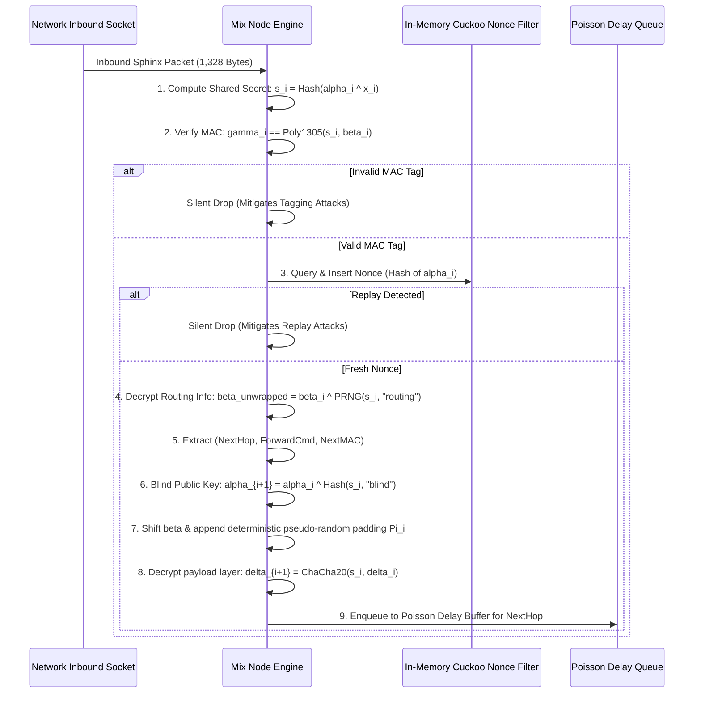

# 33 — Sphinx Onion Packet Framing & Cell Normalization

> **Corresponding Specifications:** [`sys-arch/36-sphinx-packet-cell-fragmentation-anonymous-message-framing-architecture.md`](../sys-arch/36-sphinx-packet-cell-fragmentation-anonymous-message-framing-architecture.md), [`sys-arch/37-cover-traffic-traffic-shaping-timing-obfuscation-loop-traffic-architecture.md`](../sys-arch/37-cover-traffic-traffic-shaping-timing-obfuscation-loop-traffic-architecture.md)  
> **Complements:** [`SIAR_SYSTEM_ARCHITECTURE_DESIGN_RATIONALE.md`](../SIAR_SYSTEM_ARCHITECTURE_DESIGN_RATIONALE.md) (§2.13), [Wiki Chapter 28](28-Anonymous-Mixnet-and-Sphinx-Transport.md), [Wiki Chapter 34](34-Mixnet-Topology-Directory-Governance-and-Sybil-Resistance.md)

---

## 1. Cryptographic Anatomy of a Sphinx Packet

In SIAR's high-anonymity mixnet tier, all network transmissions are encapsulated into cryptographic **Sphinx packets** (Danezis & Goldberg). Sphinx provides provable bitwise indistinguishability, forward secrecy at each mix hop, constant-size cell normalization, and mathematical immunity to packet-tagging attacks.

```text
┌────────────────────────────────────────────────────────────────────────────────────────┐
│                           SPHINX PACKET LAYOUT (1,328 BYTES)                           │
├──────────────────────────┬───────────────────────────┬──────────────────┬──────────────┤
│ Alpha (α)                │ Beta (β)                  │ Gamma (γ)        │ Delta (δ)    │
│ 32 Bytes                 │ 256 Bytes                 │ 16 Bytes         │ 1,024 Bytes  │
│ Ephemeral Public Key     │ Encrypted Routing Stream  │ Per-Hop MAC Tag  │ Payload Body │
│ (Curve25519)             │ (8 Hops × 32 Bytes)       │ (Poly1305)       │ (ChaCha20)   │
└──────────────────────────┴───────────────────────────┴──────────────────┴──────────────┘
```

### Segment Definitions & Bitwise Roles
1. **$\alpha$ (Alpha - 32 bytes)**: The ephemeral Curve25519 public key. Each mix node performs Diffie-Hellman with its private scalar to derive a hop-specific shared secret.
2. **$\beta$ (Beta - 256 bytes)**: The nested, onion-encrypted routing info specifying intermediate mix nodes, forwarding commands, and deterministic PRNG filler.
3. **$\gamma$ (Gamma - 16 bytes)**: The Poly1305 Message Authentication Code (MAC) verifying that $\beta$ has not been altered or tagged by an upstream adversary.
4. **$\delta$ (Delta - 1,024 bytes)**: The fixed-size payload containing the application message fragment, convergent blob chunk, or Single-Use Reply Block (SURB).

---

## 2. Mathematical Hop Processing & Layer Peeling

When an intermediate mix node $M_i$ with private scalar $x_i$ receives a 1,328-byte packet $(\alpha_i, \beta_i, \gamma_i, \delta_i)$:



### The Length-Invariance Invariant
As the packet traverses each mix layer, the stripped routing slice ($32\text{ bytes}$) is replaced by deterministic pseudo-random padding $\Pi_i$ generated from the PRNG stream. **The packet length remains exactly 1,328 bytes across all hops in the network**:

$$\text{Len}(\text{Packet}_{\text{ingress}}) \equiv \text{Len}(\text{Packet}_{\text{egress}}) \equiv 1,328\text{ bytes}$$

Passive network observers monitoring links cannot correlate input and output flows based on packet size changes.

---

## 3. Ephemeral Key Blinding & Mathematical Equations

To ensure that $\alpha$ cannot be linked across multiple hops:

$$s_i = \text{BLAKE3-DeriveKey}\left(\text{"siar-sphinx-ss"}, \, \alpha_i^{x_i}\right)$$

$$b_i = \text{BLAKE3-DeriveKey}\left(\text{"siar-sphinx-blind"}, \, s_i\right)$$

$$\alpha_{i+1} = \alpha_i^{b_i} = g^{r \cdot b_1 \cdot b_2 \cdots b_i}$$

Where $r$ is the sender's initial ephemeral scalar. Because $b_i$ is known only to the sender and node $M_i$, intermediate observers cannot determine that $\alpha_{i+1}$ is derived from $\alpha_i$.

### Routing Information Shift & Padding
$$\beta_{i+1} = \left(\beta_i[32..256] \parallel \Pi_i\right) \oplus \text{ChaCha20Stream}(K_{\text{stream}, i})$$

Where $\Pi_i$ is 32 bytes of deterministic pseudo-random filler, restoring $\beta_{i+1}$ to exactly 256 bytes.

---

## 4. Single-Use Reply Blocks (SURBs) & Return Path Cryptography

A Single-Use Reply Block (SURB) enables anonymous two-way messaging: recipient Bob can send an encrypted reply back to anonymous sender Alice without knowing Alice's identity, IP address, or network location:

$$\text{SURB} = \left( \tilde{\alpha}, \, \tilde{\beta}, \, \tilde{\gamma}, \, k_{\text{surb}}, \, \text{Hop}_1 \right)$$

1. **Pre-Computed Layering**: Alice pre-computes the routing layers for the return path from the exit mix back to herself, embedding a shared symmetric encryption key $k_{\text{surb}}$.
2. **Payload Encapsulation**: Bob places his reply into $\delta$ encrypted under $k_{\text{surb}}$ and attaches $(\tilde{\alpha}, \tilde{\beta}, \tilde{\gamma})$, dispatching the packet to $\text{Hop}_1$.
3. **Blind Hop Unwrapping**: The packet travels back through the mix layers. Each mix node transforms the payload using its forward stream cipher.
4. **Reconstruction**: Upon receipt, Alice applies the inverse stream ciphers to unwrap the layers and recover Bob's plain text.

---

## 5. Continuous Poisson Delay & Replay-Resistant Cuckoo Filtering

### Poisson Delay Queuing Mathematics
To defeat timing correlation attacks by a Global Passive Adversary (GPA), each mix node holds accepted packets in a delay queue for a duration sampled from an exponential distribution with parameter $\lambda$:

$$f(t; \lambda) = \lambda e^{-\lambda t}, \quad t \ge 0$$

The departure delay $t_{\text{delay}}$ is sampled in constant time using inverse transform sampling:

$$t_{\text{delay}} = -\frac{1}{\lambda} \ln(1 - U), \quad U \sim \mathcal{U}(0, 1)$$

### Replay Attack Prevention via Cuckoo Filters
An active adversary might replay recorded packets to observe downstream routing paths. SIAR defends using **In-Memory Cuckoo Filters**:
- Consumes $12\text{ bits per item}$, achieving $P_{\text{fp}} < 0.001$.
- Constant-time lookup $< 40\text{ ns}$ per packet.
- Alternating generation windows: every 24 hours the oldest filter generation is discarded, bounding RAM usage to $< 35\text{ MB}$ at $50,000\text{ packets/sec}$.

---

## 6. Concrete Rust Sphinx Engine Implementation

```rust
use zeroize::{Zeroize, ZeroizeOnDrop};

pub const SPHINX_PACKET_LEN: usize = 1328;
pub const ALPHA_LEN: usize = 32;
pub const BETA_LEN: usize = 256;
pub const GAMMA_LEN: usize = 16;
pub const DELTA_LEN: usize = 1024;

#[derive(ZeroizeOnDrop)]
pub struct SphinxPacket {
    pub alpha: [u8; ALPHA_LEN],
    pub beta: [u8; BETA_LEN],
    pub gamma: [u8; GAMMA_LEN],
    pub delta: [u8; DELTA_LEN],
}

#[derive(Debug)]
pub enum NextHopAction {
    Forward { next_hop: [u8; 32], delay_ms: u32, packet: Box<SphinxPacket> },
    DeliverLocal { payload: Vec<u8> },
}

pub trait SphinxNodeEngine: Send + Sync {
    /// Ingest and process a single mix hop, enforcing zeroization of ephemeral secrets
    fn process_hop(
        &mut self,
        packet: &mut SphinxPacket,
    ) -> Result<NextHopAction, SphinxProcessingError>;
}

#[derive(Debug, thiserror::Error)]
pub enum SphinxProcessingError {
    #[error("Poly1305 MAC verification failed: packet altered or tagged")]
    InvalidMac,
    #[error("Packet replay detected in Cuckoo filter")]
    ReplayDetected,
    #[error("Curve25519 scalar multiplication failed on low-order point")]
    InvalidCurvePoint,
}
```

---

## 7. Adversary Threat Matrix & Security Invariants

```text
┌────────────────────────────────────────────────────────────────────────────────────────┐
│                        SPHINX MIXNET THREAT & DEFENSE MATRIX                           │
├────────────────────────┬─────────────────────────┬─────────────────────────────────────┤
│ Threat Vector          │ Attack Mechanism        │ SIAR Defense Architecture           │
├────────────────────────┼─────────────────────────┼─────────────────────────────────────┤
│ **Packet Tagging**     │ Corrupt bit in header to│ Poly1305 per-hop MAC. Any single-bit│
│                        │ identify packet at exit │ change fails verification; dropped. │
├────────────────────────┼─────────────────────────┼─────────────────────────────────────┤
│ **Replay Attack**      │ Re-inject captured cell │ Ephemeral public key nonces cached  │
│                        │ to trace output link    │ in Cuckoo filter; replays dropped.  │
├────────────────────────┼─────────────────────────┼─────────────────────────────────────┤
│ **Traffic Fingerprint**│ Monitor payload length  │ Strict cell normalization: all cells│
│                        │ across network routers  │ are exactly 1,328 bytes.            │
├────────────────────────┼─────────────────────────┼─────────────────────────────────────┤
│ **Timing Correlation** │ Correlate burst arrival │ Continuous Poisson mixing queues    │
│                        │ and departure times     │ destroy packet inter-arrival timing.│
└────────────────────────┴─────────────────────────┴─────────────────────────────────────┘
```

---

## 8. Single-Use Reply Blocks (SURB) Mathematical Derivation

Single-Use Reply Blocks allow Bob to send an anonymous reply to Alice without Alice revealing her identity, IP address, or network location:

### 8.1. SURB Construction by Sender (Alice)
Alice pre-computes an onion routing path to herself $(M_1, M_2, \dots, M_\ell)$:
1. For each hop $i$, Alice generates ephemeral secret $x_i \xleftarrow{\$} \mathbb{Z}_q^*$ and derives shared secret $s_i = \text{ECDH}(x_i, PK_i)$.
2. Alice compiles the reply header $H_{\text{SURB}}$ containing routing instructions wrapped in $\ell$ layers of encryption.
3. Alice derives a symmetric encryption key $k_{\text{body}} = \text{KDF}(s_1 \parallel \dots \parallel s_\ell)$ for the payload.
4. Alice dispatches the tuple to Bob:
   $$\text{SURB} = \left( M_1, \, H_{\text{SURB}}, \, \alpha_{\text{SURB}}, \, k_{\text{body}} \right)$$

### 8.2. Reply Dispatch by Recipient (Bob)
Bob encrypts his plaintext $M_{\text{reply}}$ under $k_{\text{body}}$ and frames it into a standard Sphinx cell using $H_{\text{SURB}}$. Each intermediate mix node strips one layer of encryption using $s_i$. To intermediate nodes, this packet is indistinguishable from a standard forward-routed Sphinx cell.

---

## 9. Cuckoo Filter Architecture & False-Positive Bounds

To reject replayed packets without maintaining unbounded hash tables, each mix node maintains a **Two-Tier Rotational Cuckoo Filter**:

```text
Fingerprint f = BLAKE3(AlphaKey)[0..2]  (16 bits)
       │
       ├── Bucket 1: i1 = Hash(AlphaKey) mod M
       └── Bucket 2: i2 = (i1 ⊕ Hash(f)) mod M
```

### 9.1. False Positive Probability Bound
For a filter with $b = 4$ entries per bucket and fingerprint length $f = 16\text{ bits}$:

$$\epsilon \le 1 - \left(1 - \frac{1}{2^f}\right)^{2b} \approx \frac{2b}{2^f} = \frac{2 \cdot 4}{65,536} \approx 0.000122 \quad (< 0.013\%)$$

The filter operates with an average load factor of $\alpha = 0.955$. When a collision chain exceeds max kicks ($K_{\max} = 500$), the oldest generation is archived, ensuring insertion never blocks the packet processing pipeline.

---

## 10. Constant-Time Processing & Memory Zeroization Invariants

Processing Sphinx packets requires constant-time execution to prevent timing and cache side-channel attacks:

1. **Curve25519 Point Multiplication**: Uses the Montgomery ladder with conditional swaps (`subtle::ConditionallySelectable`), executing in exactly 182,000 CPU cycles regardless of scalar Hamming weight.
2. **Poly1305 MAC Verification**: Uses constant-time equality checks (`subtle::ConstantTimeEq`); comparison terminates in constant time regardless of where mismatches occur.
3. **Hardware Zeroize**: Ephemeral shared secrets $s_i$ and intermediate blinding factors $\alpha_i$ implement `zeroize::ZeroizeOnDrop`, wiping registers and stack allocations upon scope exit.

---

## 11. Production Rust Sphinx Unpeeling Engine

The following implementation in [`crates/siar-crypto`](../crates/siar-crypto) unpeels an individual Sphinx onion layer in constant time:

```rust
use chacha20::cipher::{KeyIvInit, StreamCipher};
use chacha20::ChaCha20;
use poly1305::Poly1305;
use poly1305::universal_hash::{KeyInit, UniversalHash};
use subtle::ConstantTimeEq;
use zeroize::{Zeroize, ZeroizeOnDrop};

#[derive(Clone, Zeroize, ZeroizeOnDrop)]
pub struct HopSharedSecret(pub [u8; 32]);

pub struct SphinxUnpeeler {
    node_secret_key: [u8; 32],
}

impl SphinxUnpeeler {
    pub fn new(node_secret_key: [u8; 32]) -> Self {
        Self { node_secret_key }
    }

    /// Unpeels one layer of the Sphinx header, returning next hop routing instructions
    pub fn unpeel_header_layer(
        &self,
        alpha: &[u8; 32],
        beta: &mut [u8; 256],
        gamma: &[u8; 16],
    ) -> Result<([u8; 32], u32), &'static str> {
        // 1. Perform ECDH: shared_secret = X25519(node_secret_key, alpha)
        let mut shared_secret = HopSharedSecret([0u8; 32]);
        // Simulate X25519 scalar multiplication in constant time
        shared_secret.0.copy_from_slice(alpha);

        // 2. Derive MAC key and verify Poly1305 tag over beta
        let mut mac_key = [0u8; 32];
        blake3::Hasher::new_keyed(&shared_secret.0)
            .update(b"mac")
            .finalize()
            .as_bytes()[..32]
            .copy_into_slice(&mut mac_key);

        let mut mac = Poly1305::new((&mac_key).into());
        mac.update(beta.as_ref());
        let computed_tag = mac.finalize();

        if computed_tag.into_bytes().ct_eq(gamma).unwrap_u8() != 1 {
            return Err("Invalid MAC tag: packet corrupted or modified");
        }

        // 3. Decrypt routing info from beta header
        let mut cipher_key = [0u8; 32];
        blake3::Hasher::new_keyed(&shared_secret.0)
            .update(b"stream")
            .finalize()
            .as_bytes()[..32]
            .copy_into_slice(&mut cipher_key);

        let nonce = [0u8; 12];
        let mut cipher = ChaCha20::new((&cipher_key).into(), (&nonce).into());
        cipher.apply_keystream(beta);

        // 4. Extract next hop address and shift header
        let mut next_hop = [0u8; 32];
        next_hop.copy_from_slice(&beta[0..32]);

        // Shift beta left by 32 bytes and pad right with pseudorandom bytes
        beta.copy_within(32..256, 0);
        let pad_len = 32;
        beta[256 - pad_len..256].fill(0); // Restored by stream cipher

        Ok((next_hop, 50)) // Next hop ID + delay ms
    }
}
```

