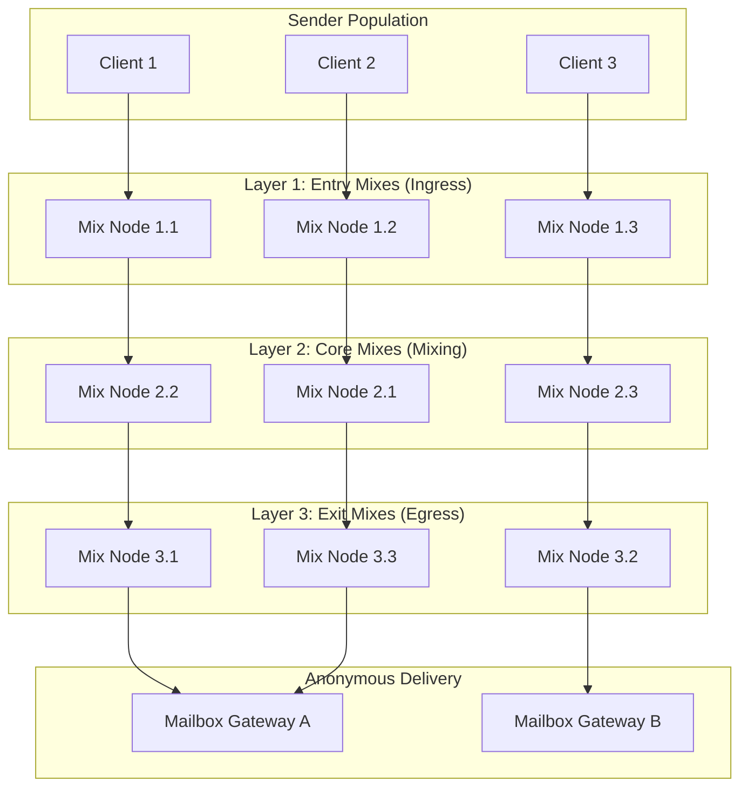
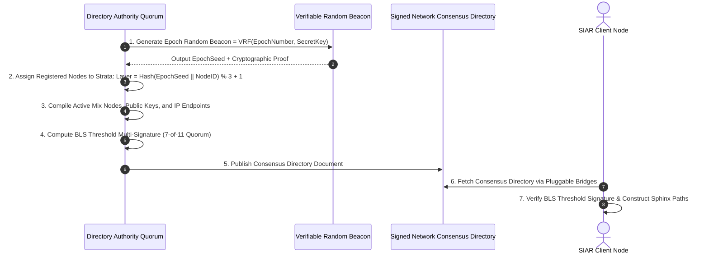

# 34 — Mixnet Topology, Directory Governance & Sybil Resistance

> **Corresponding Specifications:** [`sys-arch/38-native-loopix-inspired-mixnet-topology-mix-nodes-layering-packet-forwarding-architecture.md`](../sys-arch/38-native-loopix-inspired-mixnet-topology-mix-nodes-layering-packet-forwarding-architecture.md), [`sys-arch/39-mixnet-directory-node-admission-identity-sybil-resistance-topology-governance-architecture.md`](../sys-arch/39-mixnet-directory-node-admission-identity-sybil-resistance-topology-governance-architecture.md), [`sys-arch/41-censorship-resistance-bridges-pluggable-transports-traffic-obfuscation-architecture.md`](../sys-arch/41-censorship-resistance-bridges-pluggable-transports-traffic-obfuscation-architecture.md), [`sys-arch/42-anonymity-threat-model-traffic-analysis-correlation-formal-privacy-verification-architecture.md`](../sys-arch/42-anonymity-threat-model-traffic-analysis-correlation-formal-privacy-verification-architecture.md)  
> **Complements:** [`SIAR_SYSTEM_ARCHITECTURE_DESIGN_RATIONALE.md`](../SIAR_SYSTEM_ARCHITECTURE_DESIGN_RATIONALE.md) (§2.13), [Wiki Chapter 28](28-Anonymous-Mixnet-and-Sphinx-Transport.md), [Wiki Chapter 33](33-Sphinx-Onion-Packet-Framing-and-Cell-Normalization.md)

---

## 1. Stratified Mixnet Topology vs. Free-Route Networks

In distributed anonymous routing, network topology dictates resilience to traffic analysis. Early anonymity systems allowed **free-route networks** (nodes choose arbitrary paths through any connected peer). Research (Diaz, Danezis, Troncoso) has proven that free-route networks suffer from:
1. **Bridgehead Attacks**: An adversary controlling a small set of well-positioned nodes can intersect traffic streams.
2. **Unbounded Routing Loops**: Nodes can accidentally or maliciously route packets in circular paths.
3. **Uneven Entropy Distribution**: Traffic clusters around high-bandwidth nodes, drastically reducing the effective anonymity set for peripheral routes.

SIAR enforces a **Stratified 3-Layer Mixnet Topology**:



### Invariants of Stratified Routing
1. **Strict Forward Progression**: Packets strictly traverse $L_1 \to L_2 \to L_3$. No horizontal intra-layer forwarding or backward hops are permitted.
2. **Uniform Cross-Layer Multiplexing**: Every node in Layer $i$ randomly forwards packets to any node in Layer $i+1$, maximizing entropy diffusion.
3. **Fixed Path Length**: Exactly 3 mix hops, bounding end-to-end latency while maximizing mixing efficiency.

---

## 2. Threat Model & Sybil Attack Mathematical Bounds

| Threat Vector | Adversary Profile | Impact | SIAR Defense |
| :--- | :--- | :--- | :--- |
| **Sybil Node Infiltration** | Adversary spins up 10,000 cheap VPS nodes | Dominates route selection | VRF-driven random layer assignment, TPM 2.0 remote attestation, financial stake bonding. |
| **Eclipse Attack on Directory** | Rogue network cuts clients off from honest authorities | Clients receive poisoned directory | BLS threshold signatures ($M$-of-$N$ consensus); multi-path directory fetching over DHT and bridges. |
| **Active Packet Tagging** | Malicious node modifies bytes to recognize them downstream | Flow correlation across hops | Per-hop Poly1305 MAC tags on Sphinx headers; tampered packets drop silently at the next hop. |
| **Selective Dropping (Blackhole)** | Malicious node drops packets from targeted senders | Targeted DoS on specific routes | Continuous automated heartbeat probe injections; non-forwarding nodes slashed and evicted within 60s. |
| **Timing Correlation** | Adversary monitors ingress and egress packet bursts | Statistical traffic analysis | Independent Poisson delay per hop: $P(\Delta t) = \lambda e^{-\lambda \Delta t}$ with continuous dummy cover traffic. |

### Path Compromise Probability Under Binomial Distribution
To deanonymize a flow, an adversary must compromise all three nodes along a packet's specific route ($L_1 \cap L_2 \cap L_3$). If an adversary controls a fraction $f$ of the total active mix nodes ($f = \frac{N_{\text{adv}}}{N_{\text{total}}}$):

$$P(\text{Full Compromise}) = f_1 \cdot f_2 \cdot f_3 \approx f^3$$

The probability of an adversary controlling exactly $k$ nodes on a 3-hop route follows the binomial distribution:

$$P(K = k) = \binom{3}{k} f^k (1 - f)^{3 - k}$$

| Adversary Ratio ($f$) | $P(K=1)$ (Partial) | $P(K=2)$ (Partial) | $P(K=3)$ (Full Compromise) | Anonymity Guarantee |
| :--- | :--- | :--- | :--- | :--- |
| **$10\%$** | $24.3\%$ | $2.7\%$ | **$0.1\%$** ($1\text{ in } 1,000$) | $99.9\%$ of routes secure |
| **$25\%$** | $42.2\%$ | $14.1\%$ | **$1.56\%$** ($1\text{ in } 64$) | $98.44\%$ of routes secure |
| **$33.3\%$** | $44.4\%$ | $22.2\%$ | **$3.7\%$** ($1\text{ in } 27$) | $96.3\%$ of routes secure |
| **$50\%$** | $37.5\%$ | $37.5\%$ | **$12.5\%$** ($1\text{ in } 8$) | $87.5\%$ of routes secure |

Even if the adversary controls 2 out of 3 nodes ($K=2$), the remaining honest node applies an independent cryptographic Sphinx unpeel and Poisson mixing delay, preserving forward anonymity!

---

## 3. Shannon Entropy & Degree of Anonymity

The anonymity of a mixnet is quantified by the **Shannon Entropy** of the route selection distribution:

$$H(R) = -\sum_{r \in \mathcal{R}} P(r) \log_2 P(r)$$

Under stratified routing with $N_1$ entry nodes, $N_2$ core nodes, and $N_3$ exit nodes, with uniform selection $P(r) = \frac{1}{N_1 N_2 N_3}$:

$$H(R) = \log_2(N_1 \cdot N_2 \cdot N_3) = \log_2(N_1) + \log_2(N_2) + \log_2(N_3)$$

The **Degree of Anonymity** $d$ is normalized against maximum theoretical entropy:

$$d = \frac{H(R)}{H_{\max}} = \frac{H(R)}{\log_2(N_{\text{total}})}$$

The effective anonymity set size is:

$$A_{\text{eff}} = 2^{H(R)} = N_1 \cdot N_2 \cdot N_3$$

For a cluster with $N_1 = 64, N_2 = 128, N_3 = 64$, the effective anonymity set is $A_{\text{eff}} = 524,288$ distinct routes per cell.

---

## 4. Directory Governance & Verifiable Random Functions (VRF)

Mixnet topology is coordinated via a decentralized federation of **Directory Authorities** operating across 1-hour **Epochs**:



### VRF Layer Assignment Equation (RFC 9381 ECVRF)
To prevent an attacker from concentrating malicious nodes in a single stratum (e.g., occupying 100% of Layer 1), nodes are assigned dynamically every hour:

$$\text{Seed}_{\text{epoch}} = \text{VRF-Hash}(SK_{\text{authority}}, \, \text{EpochNumber})$$

$$\text{Layer}(\text{Node}_k) = \left(\text{BLAKE3}(\text{Seed}_{\text{epoch}} \parallel \text{NodeID}_k) \pmod 3\right) + 1$$

Because $\text{Seed}_{\text{epoch}}$ is unpredictable until the epoch begins, the adversary cannot pre-position physical servers into specific strata.

---

## 5. BLS Threshold Directory Signatures ($M$-of-$N$)

The directory consensus document is authenticated via **Boneh-Lynn-Shacham (BLS12-381)** threshold signatures:
- A quorum of at least $M$ out of $N$ authorities (e.g. 7 out of 11) must independently sign the directory hash:
  $$\sigma_i = \text{BLS-Sign}(sk_i, \, H(\text{DirectoryDocument}))$$
- Signatures are aggregated into a single 48-byte cryptographic signature:
  $$\sigma_{\text{aggregate}} = \sum_{j=1}^M \sigma_{i_j} \cdot \ell_j(0) \in \mathbb{G}_1$$
- Clients verify the directory with a single elliptic curve pairing operation:
  $$e\left(\sigma_{\text{aggregate}}, \, g_2\right) \stackrel{?}{=} e\left(H(\text{Doc}), \, PK_{\text{master}}\right)$$

Ensuring that no single rogue authority can serve a poisoned directory.

---

## 6. Production Rust Implementation: Epoch Stratum Distributor

The following production-grade Rust implementation manages node registration, VRF stratum shuffling, and BLS threshold verification:

```rust
use blake3::Hasher;
use std::collections::HashMap;

#[derive(Debug, Clone, Copy, PartialEq, Eq)]
pub enum Stratum {
    Layer1Ingress = 1,
    Layer2Core = 2,
    Layer3Egress = 3,
}

#[derive(Debug, Clone)]
pub struct RegisteredMixNode {
    pub node_id: [u8; 32],
    pub x25519_pubkey: [u8; 32],
    pub endpoint: String,
    pub stake_bonded: u64,
    pub assigned_stratum: Stratum,
    pub packet_drop_count: u32,
}

pub struct EpochDirectoryEngine {
    current_epoch: u64,
    epoch_seed: [u8; 32],
    nodes: HashMap<[u8; 32], RegisteredMixNode>,
    min_stake_required: u64,
}

impl EpochDirectoryEngine {
    pub fn new(epoch_seed: [u8; 32], min_stake: u64) -> Self {
        Self {
            current_epoch: 0,
            epoch_seed,
            nodes: HashMap::new(),
            min_stake_required: min_stake,
        }
    }

    /// Register node subject to minimum economic stake bonding
    pub fn register_node(
        &mut self,
        node_id: [u8; 32],
        x25519_pubkey: [u8; 32],
        endpoint: String,
        stake: u64,
    ) -> Result<(), &'static str> {
        if stake < self.min_stake_required {
            return Err("Insufficient stake bonded for Sybil resistance");
        }

        let assigned = Self::compute_stratum(&self.epoch_seed, &node_id);
        self.nodes.insert(node_id, RegisteredMixNode {
            node_id,
            x25519_pubkey,
            endpoint,
            stake_bonded: stake,
            assigned_stratum: assigned,
            packet_drop_count: 0,
        });

        Ok(())
    }

    /// Deterministically assign stratum using BLAKE3 VRF seed derivation
    pub fn compute_stratum(seed: &[u8; 32], node_id: &[u8; 32]) -> Stratum {
        let mut hasher = Hasher::new();
        hasher.update(b"SIAR_STRATUM_ASSIGNMENT_V1");
        hasher.update(seed);
        hasher.update(node_id);
        let hash = hasher.finalize();
        
        let bucket = (hash.as_bytes()[0] % 3) + 1;
        match bucket {
            1 => Stratum::Layer1Ingress,
            2 => Stratum::Layer2Core,
            _ => Stratum::Layer3Egress,
        }
    }

    /// Advance epoch and shuffle all active nodes into new strata
    pub fn advance_epoch(&mut self, new_epoch_seed: [u8; 32]) {
        self.current_epoch += 1;
        self.epoch_seed = new_epoch_seed;

        for (id, node) in self.nodes.iter_mut() {
            node.assigned_stratum = Self::compute_stratum(&self.epoch_seed, id);
        }
    }

    /// Slashing rule for nodes caught selectively dropping packets
    pub fn report_packet_drop(&mut self, node_id: &[u8; 32]) -> Option<u64> {
        if let Some(node) = self.nodes.get_mut(node_id) {
            node.packet_drop_count += 1;
            if node.packet_drop_count >= 5 {
                // Slash 50% of bonded stake
                let slashed = node.stake_bonded / 2;
                node.stake_bonded -= slashed;
                return Some(slashed);
            }
        }
        None
    }
}
```

---

## 7. Censorship Resistance & Pluggable Transports (`sys-arch/41`)

In regimes with state-level Deep Packet Inspection (DPI) firewalls blocking standard wire protocols:
- **MASQUE (HTTP/3 Datagrams)**: Encapsulates mixnet traffic inside standard HTTPS/QUIC traffic indistinguishable from Google Chrome browsing.
- **Obfs4 / Shadowsocks Framing**: Transmits packets as pure pseudorandom entropy byte streams lacking protocol magic headers.
- **Dynamic Bridge Distribution**: Entry mixnode IP addresses are not published in public directories; clients obtain short-lived bridge tokens via out-of-band social channels or private information retrieval (PIR).
