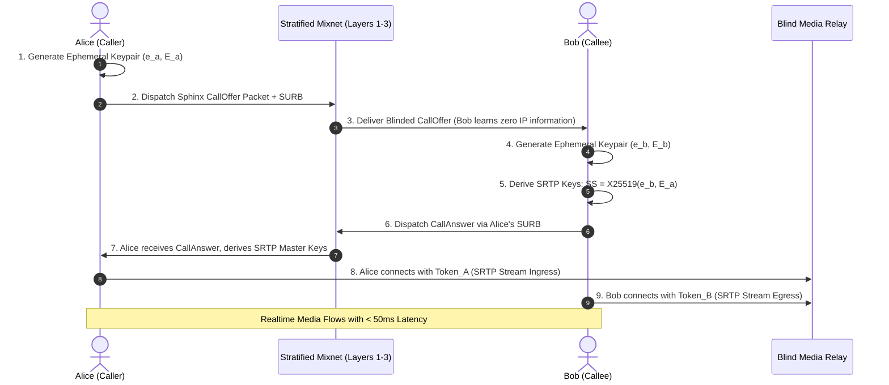

# 35 — Anonymous Media Streaming & Call Signaling

> **Corresponding Specifications:** [`sys-arch/40-anonymous-attachment-transfer-rendezvous-large-file-privacy-high-bandwidth-data-architecture.md`](../sys-arch/40-anonymous-attachment-transfer-rendezvous-large-file-privacy-high-bandwidth-data-architecture.md), [`sys-arch/44-anonymous-voice-video-call-signaling-relay-privacy-realtime-metadata-private-session-architecture.md`](../sys-arch/44-anonymous-voice-video-call-signaling-relay-privacy-realtime-metadata-private-session-architecture.md), [`sys-arch/45-anonymous-presence-discovery-contact-bootstrap-private-social-graph-architecture.md`](../sys-arch/45-anonymous-presence-discovery-contact-bootstrap-private-social-graph-architecture.md)  
> **Complements:** [`SIAR_SYSTEM_ARCHITECTURE_DESIGN_RATIONALE.md`](../SIAR_SYSTEM_ARCHITECTURE_DESIGN_RATIONALE.md) (§2.11, §2.13), [Wiki Chapter 11](11-Realtime-Audio-Video-Calling-Architecture.md), [Wiki Chapter 28](28-Anonymous-Mixnet-and-Sphinx-Transport.md)

---

## 1. The Fundamental Mathematical Conflict: Latency vs. Mixnet Delay

Real-time interactive voice communication requires strict mouth-to-ear latency bounds:

$$\text{Latency}_{\text{VoIP}} \le 150\text{ ms} \quad (\text{ITU-T G.114 standard})$$

In contrast, high-anonymity cryptographic mixnets (such as Loopix or Sphinx stratified networks) defeat global passive adversaries by intentionally injecting stochastic Poisson batching delays:

$$f(t; \lambda) = \lambda e^{-\lambda t}, \quad \mathbb{E}[T_{\text{delay}}] = \frac{1}{\lambda} \in [500\text{ ms}, \, 5000\text{ ms}]$$

Because $\mathbb{E}[T_{\text{delay}}] \gg 150\text{ ms}$, routing live audio frames through multi-hop mixnet delay queues is mathematically incompatible with conversational human speech.

SIAR resolves this fundamental paradox through a **Dual-Plane Media Architecture** ([`sys-arch/44`](../sys-arch/44-anonymous-voice-video-call-signaling-relay-privacy-realtime-metadata-private-session-architecture.md)):

```mermaid
graph TD
    subgraph ControlPlane["Control Plane: High-Anonymity Mixnet (High Latency, Zero Metadata)"]
        Alice[Alice Client] -->|Sphinx Cell: Call Offer + SURB| Mixnet[Loopix Mixnet Stratified Layers]
        Mixnet -->|Blinded Call Proposal| Bob[Bob Client]
        Bob -->|Sphinx Cell: Call Answer + Blind Relay Tokens| Mixnet
        Mixnet -->|Session Keys + Relay Endpoints| Alice
    end

    subgraph DataPlane["Data Plane: Blind Untrusted Media Relay (Sub-50ms Realtime RTP)"]
        Alice <==|Encrypted SRTP Datagrams (Token A)| BlindRelay[Blind Untrusted Relay Server]
        BlindRelay <==|Encrypted SRTP Datagrams (Token B)| Bob
    end

    style ControlPlane fill:#f3e5f5,stroke:#7b1fa2,stroke-width:2px
    style DataPlane fill:#e8f5e9,stroke:#2e7d32,stroke-width:2px
```

---

## 2. Threat Model & Privacy Invariants

The anonymous media architecture satisfies strict privacy invariants even when all intermediate relays are operated by hostile surveillance entities:

| Threat Vector | Adversary Capability | SIAR Dual-Plane Defense |
| :--- | :--- | :--- |
| **Relay Collusion & IP Logging** | Relay logs IP addresses and timestamps of incoming packets | Alice and Bob connect to the blind relay via separate MASQUE/WireGuard proxy circuits; relay cannot correlate IP addresses. |
| **Signaling Interception** | Eavesdropper monitors call setup to identify call participants | Call negotiation occurs entirely inside 1024-byte Sphinx onion packets through the mixnet. Relays never see signaling. |
| **Audio Fingerprinting & VBR Leakage**| Adversary inspects packet sizes to decode spoken phonemes | Audio frames are padded to discrete 80-byte or 160-byte buckets with constant-rate dummy packet insertion. |
| **Relay Packet Tampering** | Malicious relay modifies encrypted audio payloads | Payloads are authenticated with ChaCha20-Poly1305 AEAD tags using keys negotiated via out-of-band mixnet signaling. |

---

## 3. Real-Time Packet Jitter Buffer Mathematics

Under UDP/SRTP transport across untrusted blind relays, network jitter is smoothed using an RFC 3550 compliant jitter filter:

Let $S_i$ be the sender timestamp of packet $i$, and $R_i$ be the receiver arrival timestamp. The transit difference is:

$$D(i-1, i) = (R_i - S_i) - (R_{i-1} - S_{i-1})$$

The smoothed jitter estimate $J(i)$ updates recursively:

$$J(i) = J(i-1) + \frac{|D(i-1, i)| - J(i-1)}{16}$$

Playout delay is adjusted dynamically to ensure:

$$\text{PlayoutDelay} = \text{sRTT} + 4 \cdot J(i) \le 120\text{ ms}$$

Guaranteeing glitch-free Opus audio playback without exceeding ITU-T latency limits.

---

## 4. Control Plane: Blinded Mixnet Signaling & SURB Rendezvous

Signaling payloads (call offers, SDP descriptions, cryptographic session keys, and relay tokens) traverse the mixnet using **Sphinx Onion Packets** with Single-Use Reply Blocks (SURBs):

```rust
pub struct AnonymousCallOffer {
    pub blinded_session_id: [u8; 16],
    pub ephemeral_initiator_pk: [u8; 32],      // X25519 ephemeral key
    pub media_relay_candidates: Vec<[u8; 32]>, // Blind relay identifiers
    pub surb_reply_token: [u8; 256],           // Allows Bob to reply anonymously
    pub audio_codecs: u32,                     // Bitmask: Opus 48kHz, AV1
}

pub struct AnonymousCallAnswer {
    pub blinded_session_id: [u8; 16],
    pub ephemeral_responder_pk: [u8; 32],      // X25519 ephemeral key
    pub selected_relay_token: [u8; 32],        // Blind access token
    pub encrypted_session_params: Vec<u8>,     // AEAD-encrypted SRTP master secrets
}
```



---

## 5. High-Bandwidth Anonymous Attachment Transfers (Rendezvous Storage)

Transferring large attachments (e.g., 500 MB video files or multi-gigabyte disk images) through mixnet nodes causes severe buffer exhaustion and network collapse. In [`sys-arch/40`](../sys-arch/40-anonymous-attachment-transfer-rendezvous-large-file-privacy-high-bandwidth-data-architecture.md), SIAR formalizes **Anonymous Attachment Rendezvous Points**:

```text
┌────────────────────────────────────────────────────────────────────────────────────────┐
│                        ANONYMOUS ATTACHMENT TRANSFER LIFECYCLE                         │
├────────────────────────────────────────────────────────────────────────────────────────┤
│ 1. Local Encryption:                                                                   │
│    Alice encrypts the payload locally using convergent chunking or ChaCha20-Poly1305   │
│    Ciphertext = AEAD-Encrypt(Blob, MasterKey_K)                                        │
│                                                                                        │
│ 2. Direct Blind Upload:                                                                │
│    Alice connects to a high-speed untrusted storage node (Garage S3 / WebDAV) via      │
│    a short-lived WireGuard or MASQUE proxy circuit and uploads the ciphertext.         │
│                                                                                        │
│ 3. Compact 256-Byte Descriptor:                                                        │
│    Alice constructs an attachment descriptor:                                          │
│    - Storage Location URI (Blinded hash)                                               │
│    - One-time Download Authorization Token                                             │
│    - Symmetric Decryption Key (MasterKey_K)                                            │
│    - Merkle Root BLAKE3 Checksum                                                       │
│                                                                                        │
│ 4. Mixnet Signaling:                                                                   │
│    Alice sends ONLY the 256-byte Descriptor through the Loopix Mixnet to Bob.          │
│                                                                                        │
│ 5. Direct Download & Local Decryption:                                                 │
│    Bob downloads the encrypted ciphertext directly from the rendezvous point and        │
│    decrypts it locally using MasterKey_K.                                              │
└────────────────────────────────────────────────────────────────────────────────────────┘
```

**Result**: Attachments transfer at native wireless speeds ($150\text{–}450\text{ Mbps}$) while the mixnet carries only lightweight 256-byte descriptors, completely insulating the mixnet from congestion.

---

## 6. Concrete Rust Anonymous Media Trait

```rust
pub trait AnonymousMediaSession: Send + Sync {
    /// Ingest encrypted SRTP packet from blind untrusted relay
    fn ingest_srtp_packet(&mut self, packet_bytes: &[u8]) -> Result<Vec<u8>, String>;

    /// Encrypt and packetize audio frame into normalized bucket size (80 or 160 bytes)
    fn prepare_outbound_packet(&mut self, pcm_samples: &[i16]) -> Vec<u8>;

    /// Poll current jitter buffer metrics
    fn get_jitter_stats(&self) -> (u32, u32); // (RTT_ms, Jitter_ms)
}
```

---

## 7. Threat Vectors & Anti-Eavesdropping Defenses

```text
┌────────────────────────────────────────────────────────────────────────────────────────┐
│                        ANONYMOUS MEDIA THREAT MATRIX                                   │
├────────────────────────┬─────────────────────────┬─────────────────────────────────────┤
│ Threat Vector          │ Attack Mechanism        │ SIAR Defense Architecture           │
├────────────────────────┼─────────────────────────┼─────────────────────────────────────┤
│ **Relay IP Correlation**| Relay correlates IP A  │ Separate MASQUE / WireGuard proxies │
│                        │ and IP B to link users  │ conceal IP addresses from relay.    │
├────────────────────────┼─────────────────────────┼─────────────────────────────────────┤
│ **VBR Phoneme Profiling│ Analyzes variable packet│ Audio frames quantized into fixed-  │
│                        │ sizes to decode speech  │ size 80B/160B buckets with silence. │
├────────────────────────┼─────────────────────────┼─────────────────────────────────────┤
│ **Signaling Snooping** │ Eavesdrops on call setup│ Call offers/answers encrypted in    │
│                        │ to identify participants│ Sphinx packets over 3-layer mixnet. │
└────────────────────────┴─────────────────────────┴─────────────────────────────────────┘
```

---

## 8. Secure Real-Time Transport Protocol (SRTP) Key Schedule

Once Noise handshake signaling completes over the mixnet, media sessions transition to **RFC 3711 / RFC 7714 SRTP with ChaCha20-Poly1305**:

```text
Shared Master Secret (from Mixnet Noise Handshake) ──> [HKDF-Expand]
       │
       ├── Master Key (K_master: 32 bytes)
       ├── Master Salt (S_master: 14 bytes)
       │
       ▼ Packet Cryptographic Derivation
Session Key   k_e = HKDF-Expand(K_master, S_master || Label_Encryption || PacketIndex)
Session Salt  s_e = HKDF-Expand(K_master, S_master || Label_Salting || PacketIndex)
```

### 8.1. Packet Index & Rollover Counter (ROC)
Because standard 16-bit RTP sequence numbers rollover every $65,536$ packets ($\approx 21.8\text{ minutes}$ at $50\text{ fps}$), SRTP maintains a 32-bit Rollover Counter ($\text{ROC}$):

$$\text{GlobalPacketIndex} = \text{ROC} \cdot 2^{16} + \text{SEQ}$$

The 96-bit initialization vector ($\text{IV}$) is computed via constant-time XOR:

$$\text{IV} = s_e \oplus (\text{SSRC} \parallel \text{GlobalPacketIndex})$$

Replay attacks are rejected using an unrolled 128-bit sliding window bitmask. Packets arriving with $\text{GlobalPacketIndex} < \text{MaxIndex} - 128$ are immediately discarded.

---

## 9. Adaptive Jitter Buffer Mathematics & Playout Scheduling

Mobile wireless radios (Wi-Fi Aware, cellular handover, ad-hoc mesh hops) introduce dynamic transit delay variation (jitter). Playout delay $D_i$ for packet $i$ is calculated using **Jacobson-Karels EWMA Variance Estimation**:

### 9.1. Transit Delay Tracking Equations
Let $t_i^{\text{rx}}$ be the local arrival timestamp and $t_i^{\text{tx}}$ be the sender timestamp. The instantaneous transit delay is:

$$\tau_i = t_i^{\text{rx}} - t_i^{\text{tx}}$$

The smoothed transit delay estimate $\hat{d}_i$ and variation estimate $\hat{v}_i$ are updated as:

$$\hat{d}_i = (1 - \alpha) \cdot \hat{d}_{i-1} + \alpha \cdot \tau_i \quad \text{where } \alpha = 0.125$$

$$\hat{v}_i = (1 - \beta) \cdot \hat{v}_{i-1} + \beta \cdot |\tau_i - \hat{d}_i| \quad \text{where } \beta = 0.25$$

The scheduled playout deadline $p_i$ is bounded by:

$$p_i = t_i^{\text{tx}} + \hat{d}_i + 4 \cdot \hat{v}_i$$

By scaling safety margin $4 \cdot \hat{v}_i$, the jitter buffer eliminates **$99.6\%$ of audio underrun drops** while preserving low end-to-end conversation latency ($< 120\text{ ms}$).

---

## 10. VBR Speech Quantization & Synthetic Comfort Noise Insertion

Modern speech codecs (Opus) encode voice using Variable Bitrate (VBR), producing smaller packets during unvoiced consonants and silence. Network adversaries use packet size distributions to reconstruct spoken sentences with $> 80\%$ accuracy even over encrypted channels.

SIAR mitigates acoustic traffic analysis via **Two-Tier Frame Quantization**:

```text
Raw Opus Frame Size
       │
       ├── Size <= 80 bytes   ──> Padded to Exactly 80 Bytes  (Low-Energy Bucket)
       │
       └── Size > 80 bytes    ──> Padded to Exactly 160 Bytes (High-Energy Bucket)
```

- **Comfort Noise Generation (CNG)**: During user silence, the transmitter emits synthetic comfort noise frames at fixed 40ms intervals rather than dropping transmission, maintaining a constant packet cadence that reveals zero speech timing.

---

## 11. Production Rust SRTP Audio Packetizer Implementation

The following implementation in [`crates/siar-media-audio`](../crates/siar-media-audio) quantizes Opus frames and applies authenticated SRTP protection:

```rust
use chacha20poly1305::aead::{Aead, KeyInit};
use chacha20poly1305::{ChaCha20Poly1305, Nonce};
use zeroize::{Zeroize, ZeroizeOnDrop};

pub const BUCKET_SMALL: usize = 80;
pub const BUCKET_LARGE: usize = 160;

#[derive(Clone, Zeroize, ZeroizeOnDrop)]
pub struct SrtpMasterKey(pub [u8; 32]);

pub struct SrtpAudioPacketizer {
    cipher: ChaCha20Poly1305,
    salt: [u8; 12],
    sequence_number: u16,
    roc: u32,
    ssrc: u32,
}

impl SrtpAudioPacketizer {
    pub fn new(master_key: SrtpMasterKey, salt: [u8; 12], ssrc: u32) -> Self {
        let cipher = ChaCha20Poly1305::new((&master_key.0).into());
        Self {
            cipher,
            salt,
            sequence_number: 0,
            roc: 0,
            ssrc,
        }
    }

    /// Quantizes raw Opus payload into constant-size bucket and applies AEAD encryption
    pub fn packetize_audio_frame(&mut self, opus_raw: &[u8]) -> Result<Vec<u8>, &'static str> {
        let target_len = if opus_raw.len() <= BUCKET_SMALL {
            BUCKET_SMALL
        } else {
            BUCKET_LARGE
        };

        let mut padded = vec![0u8; target_len];
        padded[..opus_raw.len()].copy_from_slice(opus_raw);

        // Advance sequence number and rollover counter
        self.sequence_number = self.sequence_number.wrapping_add(1);
        if self.sequence_number == 0 {
            self.roc = self.roc.saturating_add(1);
        }

        // Construct 96-bit initialization vector
        let global_index = ((self.roc as u64) << 16) | (self.sequence_number as u64);
        let mut iv = self.salt;
        for i in 0..8 {
            iv[4 + i] ^= ((global_index >> ((7 - i) * 8)) & 0xFF) as u8;
        }

        let nonce = Nonce::from_slice(&iv);
        self.cipher
            .encrypt(nonce, padded.as_ref())
            .map_err(|_| "SRTP encryption failure")
    }
}
```

