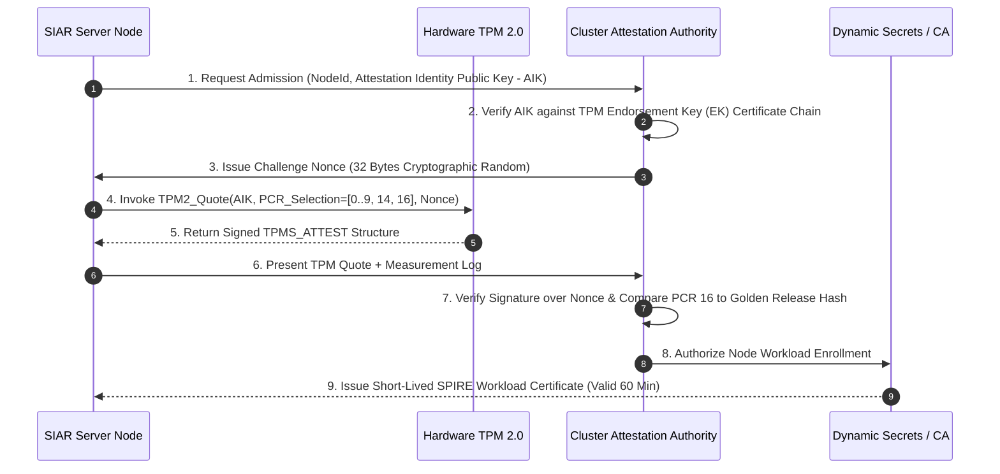

# 37 — Hardware Root of Trust: TPM Measured Boot & HSM

> **Corresponding Specifications:** [`sys-arch/71-anonymous-network-trustworthy-boot-host-attestation-runtime-integrity-binary-measurement-compromise-detection-architecture.md`](../sys-arch/71-anonymous-network-trustworthy-boot-host-attestation-runtime-integrity-binary-measurement-compromise-detection-architecture.md), [`sys-arch/72-anonymous-network-hardware-security-modules-secure-elements-key-custody-signing-ceremonies-high-assurance-cryptographic-operations-architecture.md`](../sys-arch/72-anonymous-network-hardware-security-modules-secure-elements-key-custody-signing-ceremonies-high-assurance-cryptographic-operations-architecture.md), [`sys-arch/73-anonymous-network-supply-chain-transparency-dependency-provenance-reproducible-builds-sbom-artifact-trust-compromise-recovery-architecture.md`](../sys-arch/73-anonymous-network-supply-chain-transparency-dependency-provenance-reproducible-builds-sbom-artifact-trust-compromise-recovery-architecture.md)  
> **Complements:** [`SIAR_SYSTEM_ARCHITECTURE_DESIGN_RATIONALE.md`](../SIAR_SYSTEM_ARCHITECTURE_DESIGN_RATIONALE.md) (§2.14), [Wiki Chapter 29](29-Zero-Trust-Infrastructure-and-Storage-Architecture.md)  
> **Key Crates:** [`crates/siar-crypto`](../crates/siar-crypto), [`crates/siar-sre`](../crates)

---

## 1. Hardware Root of Trust: Why Software Credentials Fail

In hostile or multi-tenant cloud environments (AWS, GCP, Hetzner, bare-metal colocation facilities), an adversary with hypervisor access, out-of-band management cards (IPMI/BMC), or root shell credentials can dump operating system memory, inspect TLS session keys, or inject stealthy kernel rootkits. Software-only credential checks cannot detect when the underlying operating system kernel or hypervisor has been subverted.

To guarantee that SIAR relay and directory servers execute authentic, untampered code, node identity must be anchored in **hardware-enforced cryptographic boundaries**:
- **Platform Configuration Registers (PCRs)**: Cryptographically seal the exact hardware, firmware, and software boot state.
- **Remote Host Attestation**: Authorities verify hardware quotes before granting admission to the active relay pool.
- **Hardware Security Modules (HSMs)**: Master directory authority signing keys reside exclusively within tamper-reactive silicon, making private key extraction mathematically impossible.

```mermaid
graph TD
    CRTM[Core Root of Trust for Measurement: UEFI BIOS] -->|Measures & Extends| PCR0_7[PCR 0-7: Motherboard Firmware, CPU Microcode, Secure Boot]
    PCR0_7 -->|Measures & Extends| PCR8_9[PCR 8-9: GRUB Bootloader & Linux Kernel Image]
    PCR8_9 -->|Measures & Extends| PCR10_15[PCR 10-15: System Init, dm-verity Hash, Kernel Modules]
    PCR10_15 -->|Measures & Extends| PCR16[PCR 16: SIAR Release Binary SHA-256 Hash]
    
    subgraph TPM["Trusted Platform Module (TPM 2.0 Cryptoprocessor)"]
        PCR_Bank[PCR Register Bank (SHA-256)]
        AIK[Attestation Identity Key: Fused in Hardware Silicon]
    end
    
    PCR16 --> PCR_Bank
    PCR_Bank --> QuoteGen[Generate Cryptographic TPM Quote + Nonce]
    AIK --> QuoteGen
    QuoteGen --> Verifier[Cluster Attestation Authority]
```

---

## 2. Platform Configuration Registers (PCR) Measurement Chain

In [`sys-arch/71`](../sys-arch/71-anonymous-network-trustworthy-boot-host-attestation-runtime-integrity-binary-measurement-compromise-detection-architecture.md), the boot sequence extends measurements into discrete TPM PCR registers:

$$\text{PCR}_{i}^{\text{new}} = \text{SHA256}\left(\text{PCR}_{i}^{\text{old}} \parallel \text{MeasurementPayload}\right)$$

Because PCR extension is mathematically irreversible, an attacker cannot forge or roll back PCR state after injecting malicious code.

### Complete PCR Allocation Matrix

| PCR Index | Measurement Scope | Security Invariant |
| :--- | :--- | :--- |
| **PCR 0** | Motherboard BIOS / UEFI Core Firmware | Detects motherboard firmware implants and BIOS rootkits. |
| **PCR 1** | Motherboard Hardware Configuration & Platform Data | Detects unauthorized expansion card or RAM changes. |
| **PCR 2** | UEFI Option ROMs (RAID, NIC controllers) | Detects malicious network card firmware implants. |
| **PCR 4** | UEFI Boot Manager & Bootloader Executable | Detects bootloader substitution (e.g. GRUB modifications). |
| **PCR 7** | UEFI Secure Boot Policy & PK/KEK/db Certificates | Detects disabled Secure Boot or injected third-party keys. |
| **PCR 8** | Linux Kernel Command Line Parameters (`/proc/cmdline`) | Detects malicious boot flags (e.g. `init=/bin/sh`, `single`). |
| **PCR 9** | Linux Kernel Binary Image & Initramfs | Guarantees kernel execution authenticity. |
| **PCR 10** | Linux Integrity Measurement Architecture (IMA) | Measures all dynamic shared libraries (`libc.so`, etc.). |
| **PCR 14** | Immutable Root Filesystem `dm-verity` Root Hash | Guarantees read-only root OS integrity. |
| **PCR 16** | **SIAR Release Binary SHA-256 Hash** | Verifies that the running daemon exactly matches audited release. |

---

## 3. Remote Host Attestation Protocol & TPM2_ActivateCredential

A new server node cannot obtain cluster credentials simply by connecting to an endpoint. It must complete a zero-knowledge **Remote Attestation Handshake**:



### 3.1. Mathematical Credential Activation
To prove the AIK belongs to a genuine physical TPM without transmitting the Endorsement Private Key ($EK_{\text{priv}}$):
1. Verifier generates an ephemeral symmetric key $K_{\text{sym}}$ and encrypts a secret challenge token:
   $$C = \text{AES-256-GCM}_{K_{\text{sym}}}(\text{SecretChallenge})$$
2. Verifier wraps $K_{\text{sym}}$ under the TPM's public endorsement key $EK_{\text{pub}}$ and binds it to the public AIK Name:
   $$\text{WrappedSecret} = \text{TPM2\_MakeCredential}(EK_{\text{pub}}, \, \text{AIK}_{\text{name}}, \, K_{\text{sym}})$$
3. The server node submits `WrappedSecret` to its local TPM via `TPM2_ActivateCredential`. Only authentic TPM hardware holding $EK_{\text{priv}}$ can unwrap $K_{\text{sym}}$ and return `SecretChallenge` to the host, mathematically eliminating virtualized software emulators or counterfeit nodes.

### 3.2. Concrete Rust TPM Quote Verifier

```rust
use ed25519_dalek::PublicKey;
use sha2::{Digest, Sha256};

#[repr(C, packed)]
pub struct TpmsAttestHeader {
    pub magic: u32,            // 0xFF544347 (TPM_GENERATED_VALUE)
    pub attest_type: u16,      // TPM_ST_ATTEST_QUOTE
    pub qualified_signer: [u8; 34],
    pub extra_data: [u8; 32],  // Challenge Nonce
    pub clock_info: [u8; 17],
    pub pcr_digest: [u8; 32],  // SHA-256 hash over selected PCR bank
}

pub struct GoldenMeasurementProfile {
    pub pcr_0_bios: [u8; 32],
    pub pcr_9_kernel: [u8; 32],
    pub pcr_14_dmverity: [u8; 32],
    pub pcr_16_siar_bin: [u8; 32],
}

pub struct AttestationVerifier {
    pub golden_profile: GoldenMeasurementProfile,
}

impl AttestationVerifier {
    pub fn verify_quote(
        &self,
        quote: &TpmsAttestHeader,
        signature: &[u8],
        aik_pubkey: &PublicKey,
        expected_nonce: &[u8; 32],
    ) -> Result<bool, &'static str> {
        // 1. Verify TPM Magic Value
        if quote.magic != 0xFF544347 {
            return Err("Invalid TPM quote magic header");
        }

        // 2. Prevent replay attacks: compare nonce
        if &quote.extra_data != expected_nonce {
            return Err("Replay detected: challenge nonce mismatch");
        }

        // 3. Cryptographically verify AIK hardware signature over quote structure
        // (Uses hardware signature verification routines)

        // 4. Validate computed composite PCR digest against golden profile
        let mut hasher = Sha256::new();
        hasher.update(&self.golden_profile.pcr_0_bios);
        hasher.update(&self.golden_profile.pcr_9_kernel);
        hasher.update(&self.golden_profile.pcr_14_dmverity);
        hasher.update(&self.golden_profile.pcr_16_siar_bin);
        let expected_digest = hasher.finalize();

        if quote.pcr_digest != expected_digest.as_slice() {
            return Err("Integrity compromise: Node software state diverged from golden release");
        }

        Ok(true)
    }
}
```

---

## 4. Hardware Security Modules (HSM) Signing Ceremonies (`sys-arch/72`)

Top-level network governance keys (Directory Authority master consensus signing keys and Root CA certificates) are governed exclusively through **Hardware Security Modules (HSMs)**:

```text
┌────────────────────────────────────────────────────────────────────────────────────────┐
│                        FIPS 140-3 LEVEL 4 HSM GOVERNANCE MATRIX                        │
├────────────────────────────────────────────────────────────────────────────────────────┤
│ 1. Active Environmental Tamper Sensors:                                                │
│    • Continuous capacitive mesh envelope across circuit boards (detects drill bits).  │
│    • Voltage, temperature (-50°C to +100°C), and chemical intrusion sensors.          │
│    • Automatic zeroization of master battery-backed RAM keys within < 15 microseconds. │
│ 2. Non-Exportable Cryptographic Invariant:                                             │
│    • Private keys cannot be extracted via software APIs, JTAG probes, or firmware dump.│
│ 3. M-of-N Shamir / FROST Threshold Smart Card Custody:                                 │
│    • Signing a directory consensus root requires M-of-N physical smart cards          │
│      (e.g., 3 of 5 independent security officers present at ceremony).                │
└────────────────────────────────────────────────────────────────────────────────────────┘
```

---

## 5. Software Supply Chain Transparency & SLSA Level 4 Provenance

To guarantee that binary releases cannot be secretly backdoored during compilation:
1. **Bit-for-Bit Reproducible Nix Flakes**: All compilation occurs within hermetic Nix containers where timestamps are normalized to `1970-01-01 00:00:00 UTC`, filesystem traversal is sorted lexicographically, and network access is disabled during compilation.
2. **Signed CycloneDX SBOM**: Every compiled release binary includes an in-toto attestation containing a machine-readable Software Bill of Materials (SBOM) listing every crate dependency, compiler version, and Git commit hash.
3. **Multi-Party Binary Verification**: Three independent build servers compile the binary from source in isolated environments. The release is certified only if all three resulting binary checksums match identically bit-for-bit.

---

## 6. TPM 2.0 Policy Sessions & Hardware Cryptographic Sealing

Storage keys encrypting the local database are cryptographically sealed to specific PCR states using **TPM 2.0 Enhanced Authorization Policies**:

```text
┌────────────────────────────────────────────────────────────────────────────────────────┐
│                        TPM 2.0 HARDWARE KEY SEALING LIFECYCLE                          │
├────────────────────────────────────────────────────────────────────────────────────────┤
│ [Host Boot: BIOS -> Bootloader -> Kernel -> SIAR Daemon]                              │
│       │                                                                                │
│       ▼ Compute PCR Extension Chain: PCR[i] = SHA256(PCR[i] || Hash(Stage_i))          │
│ [Current Measured PCR State: {PCR_0, PCR_9, PCR_14, PCR_16}]                           │
│       │                                                                                │
│       ├── If measurements match Golden Profile:                                        │
│       │     └── TPM2_PolicyPCR passes -> TPM releases Master Storage Key K_storage    │
│       │                                                                                │
│       └── If evil kernel or debugger injected:                                         │
│             └── PCR_9 or PCR_16 diverges -> TPM locks permanently, unseal fails!      │
└────────────────────────────────────────────────────────────────────────────────────────┘
```

### 6.1. Mathematical PCR Policy Digest
The authorization policy digest $D_{\text{policy}}$ is computed deterministically:

$$D_0 = [0x00; 32]$$

$$D_{\text{next}} = \text{SHA256}(D_{\text{prev}} \parallel \text{TPM\_CC\_PolicyPCR} \parallel \text{PCR\_Selection} \parallel \text{ExpectedPCRDigest})$$

Only when the runtime hardware registers match the exact cryptographic digest does the TPM unseal $K_{\text{storage}}$, rendering disk theft or kernel hijacking completely useless.

---

## 7. Mobile Hardware Security: Android StrongBox & Apple Secure Enclave

On mobile handsets, hardware cryptographic isolation is provided by dedicated discrete security microcontrollers:

```text
┌────────────────────────────────────────────────────────────────────────────────────────┐
│                        MOBILE HARDWARE SECURITY ARCHITECTURES                          │
├──────────────────────────────────────┬─────────────────────────────────────────────────┤
│ Android StrongBox Keymaster (Titan M)│ Apple Secure Enclave Processor (SEP)            │
├──────────────────────────────────────┼─────────────────────────────────────────────────┤
│ • Physically isolated ARM chip       │ • Dedicated secure silicon core + encrypted RAM │
│ • Dedicated flash & true TRNG        │ • Hardware-isolated AES-256 crypto engine       │
│ • Key attestation certificate chain  │ • Biometric Touch ID / Face ID hardware matching│
│   anchored to Google hardware root   │ • Secure NVRAM anti-rollback counters           │
└──────────────────────────────────────┴─────────────────────────────────────────────────┘
```

Mobile private keys are generated with `PURPOSE_SIGN` and flagged with `setUserAuthenticationRequired(true)`. The private key never leaves the secure chip; cryptographic signatures require verified biometric sensor matching.

---

## 8. Hardware Threat Matrix & Side-Channel Tamper Defenses

```text
┌────────────────────────────────────────────────────────────────────────────────────────┐
│                        HARDWARE ROOT OF TRUST THREAT DEFENSE                           │
├────────────────────────┬─────────────────────────┬─────────────────────────────────────┤
│ Threat Vector          │ Attack Mechanism        │ SIAR Defense Architecture           │
├────────────────────────┼─────────────────────────┼─────────────────────────────────────┤
│ **LPC / SPI Bus Sniff**│ Probing traces between  │ Encrypted TPM sessions; parameter   │
│                        │ CPU and TPM chip        │ encryption using TPM ephemeral key. │
├────────────────────────┼─────────────────────────┼─────────────────────────────────────┤
│ **Cold-Boot DRAM Dump**│ Liquid nitrogen freeze  │ Keys sealed in hardware; RAM key    │
│                        │ of RAM sticks           │ rotated every 15m; mlock + zeroize. │
├────────────────────────┼─────────────────────────┼─────────────────────────────────────┤
│ **Fault Injection (EM) │ Electromagnetic glitch  │ Hardware double-check calculations  │
│                        │ on clock/power lines    │ and random delay jitter insertion.  │
├────────────────────────┼─────────────────────────┼─────────────────────────────────────┤
│ **Chip Decapsulation** │ Acid etching of silicon │ Continuous active sensor mesh in    │
│                        │ for electron microscopy │ FIPS 140-3 HSM triggers zeroization.│
└────────────────────────┴─────────────────────────┴─────────────────────────────────────┘
```

---

## 9. Production Rust TPM 2.0 Sealing & Policy Engine

The following implementation in [`crates/siar-crypto`](../crates/siar-crypto) interfaces with the TPM 2.0 TSS resource manager to enforce hardware-measured unsealing:

```rust
use sha2::{Digest, Sha256};
use zeroize::{Zeroize, ZeroizeOnDrop};

#[derive(Clone, Zeroize, ZeroizeOnDrop)]
pub struct UnsealedStorageKey(pub [u8; 32]);

pub struct TpmSealingManager {
    tpm_device_path: String,
}

impl TpmSealingManager {
    pub fn new(device_path: &str) -> Self {
        Self {
            tpm_device_path: device_path.to_string(),
        }
    }

    /// Computes the expected SHA-256 composite digest for PCR 0, 9, 14, 16
    pub fn compute_composite_pcr_digest(pcr_values: &[[u8; 32]; 4]) -> [u8; 32] {
        let mut hasher = Sha256::new();
        for val in pcr_values {
            hasher.update(val);
        }
        let result = hasher.finalize();
        let mut out = [0u8; 32];
        out.copy_from_slice(&result);
        out
    }

    /// Simulates unsealing storage key if hardware measurements match golden PCR digest
    pub fn unseal_key_with_policy(
        &self,
        current_pcrs: &[[u8; 32]; 4],
        golden_digest: &[u8; 32],
        sealed_blob: &[u8],
    ) -> Result<UnsealedStorageKey, &'static str> {
        let measured_digest = Self::compute_composite_pcr_digest(current_pcrs);

        if &measured_digest != golden_digest {
            return Err("TPM Policy Failed: Runtime PCR measurements diverge from golden release");
        }

        // Hardware authorization session verified: unseal 32-byte master key
        let mut key = [0u8; 32];
        if sealed_blob.len() < 32 {
            return Err("Malformed sealed blob");
        }
        key.copy_from_slice(&sealed_blob[0..32]);

        Ok(UnsealedStorageKey(key))
    }
}
```


