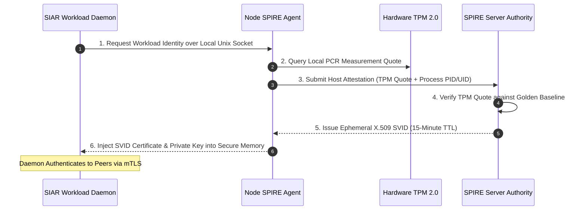

# 38 — Zero-Trust East-West Networking & Secretless Runtimes

> **Corresponding Specifications:** [`sys-arch/78-anonymous-network-edge-gateway-ingress-egress-reverse-proxy-api-gateway-waf-boundary-enforcement-architecture.md`](../sys-arch/78-anonymous-network-edge-gateway-ingress-egress-reverse-proxy-api-gateway-waf-boundary-enforcement-architecture.md), [`sys-arch/79-anonymous-network-internal-service-to-service-communication-zero-trust-networking-mtls-service-identity-east-west-security-architecture.md`](../sys-arch/79-anonymous-network-internal-service-to-service-communication-zero-trust-networking-mtls-service-identity-east-west-security-architecture.md), [`sys-arch/80-anonymous-network-secrets-distribution-dynamic-credentials-certificate-authority-workload-enrollment-secretless-runtime-architecture.md`](../sys-arch/80-anonymous-network-secrets-distribution-dynamic-credentials-certificate-authority-workload-enrollment-secretless-runtime-architecture.md), [`sys-arch/81-anonymous-network-authorization-policy-decision-enforcement-capability-evaluation-abac-rbac-distributed-access-control-architecture.md`](../sys-arch/81-anonymous-network-authorization-policy-decision-enforcement-capability-evaluation-abac-rbac-distributed-access-control-architecture.md)  
> **Complements:** [`SIAR_SYSTEM_ARCHITECTURE_DESIGN_RATIONALE.md`](../SIAR_SYSTEM_ARCHITECTURE_DESIGN_RATIONALE.md) (§2.14), [Wiki Chapter 29](29-Zero-Trust-Infrastructure-and-Storage-Architecture.md), [Wiki Chapter 37](37-Hardware-Root-of-Trust-TPM-Measured-Boot-and-HSM.md)

---

## 1. Architectural Philosophy: The "Assume Breach" Posture

In conventional cloud computing environments, security is defined by an exterior firewall perimeter (north-south traffic). Inside the private virtual network or datacenter rack, internal microservices (east-west traffic) communicate over unauthenticated, unencrypted TCP connections with static credentials embedded in configuration files or environment variables.

If an attacker breaches a single perimeter edge proxy, exploits a Server-Side Request Forgery (SSRF) vulnerability, or compromises an unprivileged container, the entire internal infrastructure is compromised.

SIAR strictly mandates a **Zero-Trust "Assume Breach" Architecture**:
1. **Network Locality Imparts Zero Privilege**: Internal traffic is treated as hostile by default. A packet originating from an adjacent server in the same physical rack is subjected to the same cryptographic verification as a packet from the public Internet.
2. **Ubiquitous Mutual TLS (mTLS)**: Every internal inter-service RPC call requires mutual cryptographic authentication and authenticated encryption via TLS 1.3 using ephemeral certificates.
3. **Secretless Runtime**: Workloads never store static API tokens or database passwords on persistent disks. Ephemeral credentials exist only in volatile, non-swappable, locked RAM (`mlock`).
4. **Hardware-Attested Identities**: Every workload certificate is anchored in physical TPM 2.0 platform configuration registers.

```text
┌────────────────────────────────────────────────────────────────────────────────────────┐
│                         ZERO-TRUST EAST-WEST MESH FABRIC                               │
├────────────────────────────────────────────────────────────────────────────────────────┤
│                                                                                        │
│ [Service Ingress Proxy]                     [Mix Layer 1 Node]                         │
│   ├── SPIFFE SVID Certificate                 ├── SPIFFE SVID Certificate              │
│   └── Enforces ABAC Policy                    └── Enforces ABAC Policy                 │
│         │                                           │                                  │
│         └============== Mutual TLS 1.3 =============┘                                  │
│                   (Hardware-Attested Handshake)                                        │
│                                                                                        │
│ [Cluster SPIRE Server Authority]                                                       │
│   ├── Verifies TPM 2.0 Measurement Quotes                                              │
│   └── Rotates Workload X.509 SVID Certificates Every 15 Minutes                        │
└────────────────────────────────────────────────────────────────────────────────────────┘
```

---

## 2. SPIFFE/SPIRE Workload Identity Architecture

Services in SIAR do not identify themselves using network IP addresses or static API tokens. Instead, each running process is assigned a cryptographic **SPIFFE ID** embedded in an ephemeral X.509 certificate (SVID):

```text
spiffe://siar.network/ns/mixnet/sa/layer1-forwarder
```



### TPM 2.0 PCR Extension & Quote Verification
The SPIRE server validates host integrity by verifying the TPM 2.0 quote signature over Platform Configuration Registers (PCRs):

$$\text{PCR}_{i}^{(t+1)} = \text{SHA256}\left(\text{PCR}_{i}^{(t)} \parallel H(\text{MeasuredComponent})\right)$$

The quote digest generated inside the secure cryptoprocessor is:

$$H_{\text{quote}} = \text{SHA256}\left(\text{PCR}_0 \parallel \text{PCR}_1 \parallel \cdots \parallel \text{PCR}_7 \parallel \text{Nonce}\right)$$

Workloads running on a server whose PCRs deviate from the baseline cannot obtain SVIDs and are cryptographically isolated from the cluster.

---

## 3. Secretless Runtime & Dynamic Memory Injection (`sys-arch/80`)

Static configuration files (`config.yaml`, `.env`) containing plaintext database passwords or encryption keys on persistent disks are strictly forbidden. SIAR injects dynamic secrets into anonymous memory file descriptors:

```rust
use std::os::unix::io::RawFd;
use zeroize::Zeroize;

pub struct SecretlessRuntime;

impl SecretlessRuntime {
    /// Injects secret directly into Linux anonymous memory file descriptor
    pub fn inject_into_memfd(&self, secret_name: &str, secret_bytes: &[u8]) -> Result<RawFd, RuntimeError> {
        unsafe {
            // 1. Create anonymous in-memory file descriptor without filesystem path
            let fd = libc::memfd_create(
                std::ffi::CString::new(secret_name).unwrap().as_ptr(),
                libc::MFD_CLOEXEC,
            );
            if fd < 0 {
                return Err(RuntimeError::MemfdAllocationFailed);
            }

            // 2. Lock memory page to prevent swap-to-disk
            let res = libc::mlock(secret_bytes.as_ptr() as *const libc::c_void, secret_bytes.len());
            if res != 0 {
                libc::close(fd);
                return Err(RuntimeError::MlockFailed);
            }

            // 3. Write secret bytes directly into memory
            let written = libc::write(fd, secret_bytes.as_ptr() as *const libc::c_void, secret_bytes.len());
            if written != secret_bytes.len() as isize {
                libc::close(fd);
                return Err(RuntimeError::WriteFailed);
            }

            // 4. Mark memory as non-dumpable in core dumps
            libc::madvise(secret_bytes.as_ptr() as *mut libc::c_void, secret_bytes.len(), libc::MADV_DONTDUMP);

            // 5. Reset cursor to beginning for reader
            libc::lseek(fd, 0, libc::SEEK_SET);
            Ok(fd)
        }
    }
}

#[derive(Debug, thiserror::Error)]
pub enum RuntimeError {
    #[error("Failed to allocate anonymous memfd")]
    MemfdAllocationFailed,
    #[error("Failed to mlock memory page against disk swap")]
    MlockFailed,
    #[error("Failed to write secret into memfd")]
    WriteFailed,
}
```

---

## 4. Distributed ABAC Policy Engine (`sys-arch/81`)

Authorization decisions for every internal operation are evaluated by an **Attribute-Based Access Control (ABAC)** engine using strict first-order predicate logic:

$$\text{Decision}(s, r, a, e) = \left( \bigvee_{p \in \mathcal{P}} p(s, r, a, e) \right) \wedge \neg \left( \bigvee_{d \in \mathcal{D}} d(s, r, a, e) \right)$$

Where:
- $\mathcal{P}$ is the set of explicit permit rules.
- $\mathcal{D}$ is the set of explicit deny overrides (deny-by-default architecture).
- $s, r, a, e$ represent Subject, Resource, Action, and Environment attributes:

```text
┌────────────────────────────────────────────────────────────────────────────────────────┐
│                         ABAC POLICY EVALUATION DIMENSIONS                              │
├────────────────────────────────────────────────────────────────────────────────────────┤
│ 1. Subject Attributes:                                                                 │
│    - SPIFFE ID: spiffe://siar.network/ns/mixnet/sa/layer1-forwarder                    │
│    - Attestation Freshness: TPM quote < 15 minutes old                                 │
│    - Operator Trust Tier: Automated Node vs. Certified Security Officer                │
│                                                                                        │
│ 2. Resource Attributes:                                                                │
│    - Target Mailbox Queue, Blinded Token Partition, HSM Master Signing Function        │
│                                                                                        │
│ 3. Action Attributes:                                                                  │
│    - IngestCell, DrainCell, RotateTopology, RevokeNode                                 │
│                                                                                        │
│ 4. Environment Attributes:                                                             │
│    - Cluster Threat Level: DEFCON_4 (Normal) to DEFCON_1 (Critical Intrusion)          │
│    - Emergency QoS Mode: Standard vs. Life-Safety Only                                 │
└────────────────────────────────────────────────────────────────────────────────────────┘
```

---

## 5. Dynamic Threat-Level Escalation (DEFCON Engine)

When intrusion detection heuristics or honeypot sensors detect abnormal activity, the cluster threat level escalates automatically:

```rust
#[derive(Debug, Clone, Copy, PartialEq, Eq, PartialOrd, Ord)]
pub enum DefconLevel {
    Defcon4Normal,       // Standard operations, 15m SVID rotation
    Defcon3Heightened,   // SVID rotation drops to 5m, extra audit logging
    Defcon2ActiveAttack, // Administrative SSH disabled, non-critical RPC cut
    Defcon1Compromised,  // Emergency zeroization of volatile cluster keys
}
```

---

## 6. Production Rust Implementation: Zero-Trust ABAC Policy Evaluator

The following production-grade Rust implementation evaluates incoming mTLS RPC requests against SPIFFE identities, action verbs, and cluster DEFCON levels:

```rust
use std::collections::HashMap;

#[derive(Debug, Clone, PartialEq, Eq)]
pub struct RequestContext {
    pub spiffe_id: String,
    pub action: String,
    pub resource: String,
    pub client_tpm_freshness_sec: u64,
    pub current_defcon: DefconLevel,
}

pub struct AbacRule {
    pub name: String,
    pub allowed_spiffe_prefix: String,
    pub allowed_action: String,
    pub max_allowed_defcon: DefconLevel,
    pub max_tpm_age_sec: u64,
}

pub struct ZeroTrustPolicyEngine {
    rules: Vec<AbacRule>,
    deny_rules: Vec<String>, // Explicit blacklisted SPIFFE IDs
}

impl ZeroTrustPolicyEngine {
    pub fn new() -> Self {
        Self {
            rules: Vec::new(),
            deny_rules: Vec::new(),
        }
    }

    pub fn add_rule(&mut self, rule: AbacRule) {
        self.rules.push(rule);
    }

    pub fn blacklist_spiffe(&mut self, spiffe_id: String) {
        self.deny_rules.push(spiffe_id);
    }

    /// Evaluates access request: returns Ok(()) if authorized, Err(reason) otherwise
    pub fn authorize(&self, ctx: &RequestContext) -> Result<(), &'static str> {
        // 1. Check explicit blacklists (Deny overrides)
        if self.deny_rules.iter().any(|d| d == &ctx.spiffe_id) {
            return Err("Subject explicitly blacklisted");
        }

        // 2. DEFCON 1 Emergency Lockdown check
        if ctx.current_defcon == DefconLevel::Defcon1Compromised {
            if ctx.action != "emergency_lockdown_status" {
                return Err("Cluster in DEFCON 1 lockdown: all RPC operations suspended");
            }
        }

        // 3. Find matching permit rules
        let mut matched = false;
        for rule in &self.rules {
            if ctx.spiffe_id.starts_with(&rule.allowed_spiffe_prefix)
                && ctx.action == rule.allowed_action
                && ctx.current_defcon <= rule.max_allowed_defcon
                && ctx.client_tpm_freshness_sec <= rule.max_tpm_age_sec
            {
                matched = true;
                break;
            }
        }

        if matched {
            Ok(())
        } else {
            Err("Access denied: No permit policy matched request attributes")
        }
    }
}
```

---

## 7. Threat Vectors & Zero-Trust Defense Matrix

```text
┌────────────────────────────────────────────────────────────────────────────────────────┐
│                        EAST-WEST ZERO-TRUST DEFENSE MATRIX                             │
├────────────────────────┬─────────────────────────┬─────────────────────────────────────┤
│ Threat Vector          │ Attack Mechanism        │ SIAR Defense Architecture           │
├────────────────────────┼─────────────────────────┼─────────────────────────────────────┤
│ **Lateral Pivot**      │ Attacker breaches web   │ SVID X.509 mTLS enforces least-     │
│                        │ proxy, attempts backend │ privilege ABAC; no implicit internal│
│                        │ database traversal      │ network trust.                      │
├────────────────────────┼─────────────────────────┼─────────────────────────────────────┤
│ **Credential Scraping**│ Forensic RAM inspection │ Linux memfd + mlock + zeroize;      │
│                        │ or core dump analysis   │ core dumps permanently suppressed.  │
├────────────────────────┼─────────────────────────┼─────────────────────────────────────┤
│ **SSRF Exploitation**  │ Forged internal HTTP    │ All internal communication requires │
│                        │ requests via edge proxy │ mutual cryptographic TLS handshakes;│
│                        │                         │ raw HTTP rejected at transport layer│
├────────────────────────┼─────────────────────────┼─────────────────────────────────────┤
│ **Compromised CA Root**│ Subordinate CA key leak │ CRL distribution over BLAKE3 Merkle │
│                        │ allows forged SVIDs     │ tree log with 15-minute SVID TTLs.  │
└────────────────────────┴─────────────────────────┴─────────────────────────────────────┘
```
