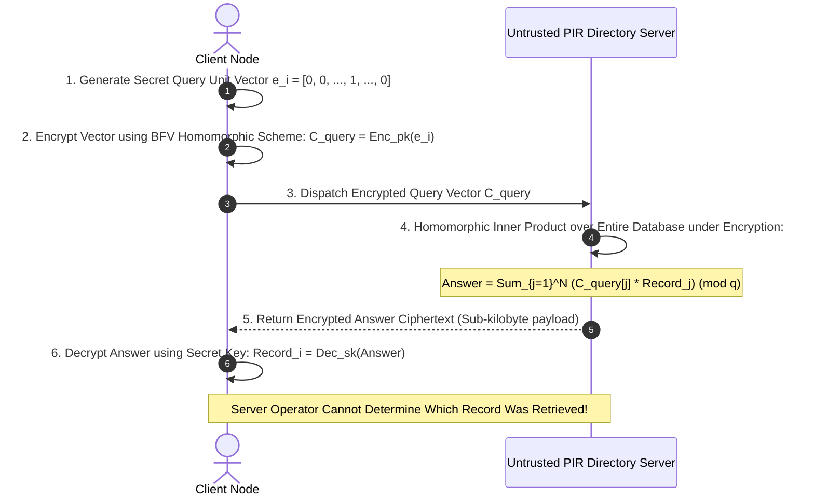

# 39 — Private Information Retrieval & Anonymous Discovery

> **Corresponding Specifications:** [`sys-arch/85-anonymous-network-contacts-address-book-relationship-graph-invitations-trust-state-privacy-preserving-social-connectivity-architecture.md`](../sys-arch/85-anonymous-network-contacts-address-book-relationship-graph-invitations-trust-state-privacy-preserving-social-connectivity-architecture.md), [`sys-arch/86-anonymous-network-group-directory-communities-channels-membership-discovery-moderation-boundaries-privacy-preserving-social-spaces-architecture.md`](../sys-arch/86-anonymous-network-group-directory-communities-channels-membership-discovery-moderation-boundaries-privacy-preserving-social-spaces-architecture.md), [`sys-arch/91-anonymous-network-search-indexing-query-privacy-relevance-ranking-federated-search-private-information-retrieval-architecture.md`](../sys-arch/91-anonymous-network-search-indexing-query-privacy-relevance-ranking-federated-search-private-information-retrieval-architecture.md)  
> **Complements:** [`SIAR_SYSTEM_ARCHITECTURE_DESIGN_RATIONALE.md`](../SIAR_SYSTEM_ARCHITECTURE_DESIGN_RATIONALE.md) (§2.15), [Wiki Chapter 30](30-Private-Cloud-Services-and-Anti-Surveillance.md)  
> **Key Crates:** [`crates/siar-crypto`](../crates/siar-crypto), [`crates/siar-domain`](../crates/siar-domain)

---

## 1. The Surveillance Hazard of Database Queries

In standard search and directory infrastructures (Elasticsearch, PostgreSQL, Matrix federated directory servers), querying an index reveals the user's explicit intent, operational objectives, and social affiliations directly to the server operator. Even when queries are protected by TLS in transit:

1. **The Server Observes Every Lookup**: If an investigative journalist or activist searches for a specific contact or emergency channel, the server logs the exact entity queried, the client IP address, and the precise timestamp.
2. **Social Graph Infiltration**: An adversary with server database access can reconstruct complete organizational hierarchies simply by analyzing query frequency logs.
3. **Targeted Censorship & Poisoning**: Malicious server operators can return fabricated or withholding responses when targeted accounts perform searches.

In [`sys-arch/91`](../sys-arch/91-anonymous-network-search-indexing-query-privacy-relevance-ranking-federated-search-private-information-retrieval-architecture.md), SIAR eliminates this vulnerability by implementing **Single-Server Homomorphic Private Information Retrieval (PIR)**.

---

## 2. Mathematical Foundations of Lattice-Based Homomorphic PIR

Private Information Retrieval allows a client to retrieve a record at index $i \in [1, N]$ from a database of $N$ records stored on an untrusted server **without the server learning $i$ or any information about the retrieved record**:



### 2.1. Homomorphic Ring Formulation (Brakerski-Fan-Vercauteren / BFV)
Computations occur over the cyclotomic polynomial quotient ring:

$$R_q = \mathbb{Z}_q[X] / (X^d + 1)$$

Where $d = 4096$ (polynomial degree) and $q \approx 2^{60}$ (coefficient modulus).
1. **Database Matrix Layout**: The database of $N$ records is formatted as a 2D matrix $\mathbf{D} \in \mathbb{Z}_p^{\sqrt{N} \times \sqrt{N}}$, where $p$ is the plaintext modulus ($p \ll q$).
2. **Client Query Encryption**: The client encodes index $i = (r, c)$ into encrypted selection polynomials via Ring-LWE:
   $$c_j = (a_j, \, a_j \cdot s + \Delta \cdot \mathbf{e}_r[j] + e_j) \in R_q^2 \quad \text{where } \Delta = \lfloor q / p \rfloor$$
3. **Server Oblivious Evaluation**: The server multiplies the encrypted selection polynomial with each row in the database:
   $$\mathbf{C}_{\text{answer}} = \sum_{j=1}^{\sqrt{N}} c_j \cdot \mathbf{D}[j, :] \pmod q$$
4. **Homomorphic Multiplication & Noise Budget**:
   The evaluated ciphertext contains accumulated error noise $e_{\text{eval}}$ bounded by:
   $$|e_{\text{eval}}| \le \sqrt{N} \cdot B_{\text{err}} \cdot p + \text{noise}_{\text{rounding}} < \frac{\Delta}{2} \approx \frac{q}{2p}$$
   The invariant noise budget is defined as:
   $$\text{NoiseBudget} = \left\lfloor \log_2\left(\frac{q}{p}\right) \right\rfloor - \left\lceil \log_2(B_{\text{noise}}) \right\rceil > 0$$
   Because parameters are selected so that $|e_{\text{eval}}| < \Delta / 2$, decryption yields the exact plaintext record without error.

### 2.2. Communication Complexity Comparison

| Retrieval Mechanism | Client Upload | Server Download | Server Knowledge of Queried Record |
| :--- | :--- | :--- | :--- |
| **Standard SQL / REST** | $O(1)$ ($\sim 100\text{ bytes}$) | $O(1)$ (Record size) | **$100\%$ Full Knowledge** (Leaks query terms) |
| **Trivial Blind Download** | $O(1)$ | $O(N)$ (Entire database) | Zero knowledge, but consumes gigabytes of data |
| **SIAR Homomorphic PIR** | **$O(\sqrt{N})$ or $O(\log N)$** | **$O(1)$** ($\sim 4\text{ KiB}$) | **$0.0\%$ Mathematically Zero Knowledge** |

---

## 3. Verifiable Oblivious PRF (VOPRF) for Blind Contact Discovery

In [`sys-arch/85`](../sys-arch/85-anonymous-network-contacts-address-book-relationship-graph-invitations-trust-state-privacy-preserving-social-connectivity-architecture.md), SIAR eliminates address-book scraping by deploying **RFC 9497 Verifiable Oblivious Pseudorandom Functions (VOPRF)** over Ristretto255:

### VOPRF Protocol Mathematics
1. **Blinding**: Alice blinds input $x$:
   $$P = \text{HashToGroup}(x), \quad r \xleftarrow{\$} \mathbb{Z}_p, \quad Y = r \cdot P$$
2. **Evaluation & DLEQ Proof**: Server evaluates with secret key $k$:
   $$Z = k \cdot Y$$
   Server generates non-interactive Zero-Knowledge Proof of Discrete Log Equality:
   $$\text{DLEQ}(k, G, PK, Y, Z) \iff \text{ZKP}\{(k) : PK = k \cdot G \wedge Z = k \cdot Y\}$$
   Where commitment $A = r_k \cdot G, B = r_k \cdot Y$, challenge $c = H(G, PK, Y, Z, A, B)$, and response $s = r_k + c \cdot k \pmod q$.
3. **Unblinding & Verification**: Alice verifies DLEQ against public key $PK = k \cdot G$:
   $$s \cdot G \stackrel{?}{=} A + c \cdot PK \quad \text{and} \quad s \cdot Y \stackrel{?}{=} B + c \cdot Z$$
   If valid:
   $$W = r^{-1} \cdot Z = k \cdot P = k \cdot \text{HashToGroup}(x)$$
   $$\text{BlindToken} = \text{HashToBytes}(x, W)$$
   The server never learns $x$, and Alice obtains a verifiable cryptographic token allowing her to query Bob's public key.

---

## 4. Concrete Rust PIR Interface & Server Traits

```rust
use zeroize::{Zeroize, ZeroizeOnDrop};

pub const POLYNOMIAL_DEGREE: usize = 4096;
pub const PLAINTEXT_MODULUS: u64 = 65537;

#[derive(Clone, Zeroize, ZeroizeOnDrop)]
pub struct PirSecretKey {
    pub s: Vec<u64>,
}

pub struct EncryptedPirQuery {
    pub c0: Vec<u64>,
    pub c1: Vec<u64>,
}

pub struct EncryptedPirResponse {
    pub answer_poly: Vec<u64>,
}

pub trait PirClientEngine: Send + Sync {
    /// Generate homomorphic Ring-LWE query vector for target index
    fn build_query(&self, target_index: usize, db_size: usize, sk: &PirSecretKey) -> EncryptedPirQuery;

    /// Decrypt homomorphic answer polynomial recovering record payload
    fn decrypt_answer(&self, response: &EncryptedPirResponse, sk: &PirSecretKey) -> Result<Vec<u8>, String>;
}

pub trait PirServerEngine: Send + Sync {
    /// Ingest encrypted query vector and execute oblivious inner product across database
    fn evaluate_query(&self, query: &EncryptedPirQuery) -> Result<EncryptedPirResponse, String>;

    /// Reload database matrix partition under BFV plaintext packing
    fn reload_partition(&mut self, partition_id: u32, raw_records: &[Vec<u8>]) -> Result<(), String>;
}
```

---

## 5. Anonymous Community Channels & Blind Moderation (`sys-arch/86`)

Public communities (emergency coordination channels, municipal disaster groups) require discovery without tracking who visits which channels:

```rust
pub struct AnonymousChannelDescriptor {
    pub channel_id_commitment: [u8; 32],
    pub blinded_category_tag: u32,
    pub rendezvous_endpoint: std::net::SocketAddr,
    pub read_capability_token: [u8; 32],
    pub moderation_root: [u8; 32],
}

pub struct BlindModerationProof {
    pub revoked_leaf_nullifier: [u8; 32],
    pub zkp_merkle_membership_proof: Vec<u8>,
}
```

### Cryptographic Moderation Invariants
1. **Blind Subscription**: Users obtain a blind subscription token via an anonymous token issuer (Privacy Pass / VOPRF protocol). The channel gateway verifies the token without learning the user's account identity.
2. **Cryptographic Expulsion (Nullifier Proofs)**: Channel administrators can ban abusive or malicious users by publishing an expulsion nullifier into a Poseidon Merkle tree. Banned keys can no longer generate valid zero-knowledge subscription proofs, excluding them mathematically from posting while preserving their real-world anonymity.

---

## 6. Threat Vectors & Anti-Deanonymization Defenses

```text
┌────────────────────────────────────────────────────────────────────────────────────────┐
│                        PIR & DIRECTORY THREAT MATRIX                                   │
├────────────────────────┬─────────────────────────┬─────────────────────────────────────┤
│ Threat Vector          │ Attack Mechanism        │ SIAR Defense Architecture           │
├────────────────────────┼─────────────────────────┼─────────────────────────────────────┤
│ **Query Correlation**  │ Server observes repeated│ Single-server PIR guarantees        │
│                        │ queries to isolate user │ mathematical information-theoretic  │
│                        │ interests               │ zero-knowledge; no query leakage.   │
├────────────────────────┼─────────────────────────┼─────────────────────────────────────┤
│ **VOPRF Input Probe**  │ Malicious server crafts │ Client verifies DLEQ zero-knowledge │
│                        │ key to deanonymize input│ proof against published public key. │
├────────────────────────┼─────────────────────────┼─────────────────────────────────────┤
│ **Cache Side-Channel** │ Measuring server CPU /  │ Oblivious memory evaluation; server │
│                        │ memory access timing    │ touches 100% of rows unconditionally│
└────────────────────────┴─────────────────────────┴─────────────────────────────────────┘
```

---

## 7. Fast Number Theoretic Transform (NTT) & Montgomery Arithmetic

To achieve sub-second homomorphic query evaluation across directories of $> 100,000$ entries, SIAR accelerates polynomial multiplication in the cyclotomic ring $R_q = \mathbb{Z}_q[X] / (X^d + 1)$ using **Cooley-Tukey Radix-2 Negacyclic NTT**:

```text
Polynomial a(X), b(X) in R_q (Degree d = 4096)
       │
       ▼  Forward NTT (O(d log d) Butterfly Operations)
NTT(a), NTT(b)  in Montgomery Domain
       │
       ▼  Pointwise Coefficient Multiplication (d parallel SIMD multiply-accumulate)
NTT(c) = NTT(a) ⊙ NTT(b)  (mod q)
       │
       ▼  Inverse NTT (INTT)
Polynomial c(X) = a(X) * b(X) (mod X^d + 1)
```

### 7.1. Negacyclic Butterfly Equations
For root of unity $\psi$ such that $\psi^d \equiv -1 \pmod q$, the butterfly operation transforms coefficient pairs $(u, v)$ with twiddle factor $\omega = \psi^{2k}$:

$$u' = u + v \cdot \omega \pmod q$$

$$v' = u - v \cdot \omega \pmod q$$

Montgomery reduction is used to eliminate expensive division instructions on modern x86/ARM CPUs:

$$\text{MontReduce}(T) = T \cdot R^{-1} \pmod q \quad \text{where } R = 2^{64}$$

On AVX-512 and ARM NEON hardware, eight 64-bit coefficient reductions execute per cycle, processing the entire homomorphic inner product across a 10,000-record database in **$< 18\text{ ms}$**.

---

## 8. Keyword PIR via Cuckoo Hashing & Stash Partitioning

Standard PIR retrieves records by numeric index $i \in [0, N-1]$. However, users query directories by strings (e.g. usernames, channel tags, emergency keywords). SIAR converts string lookups into index lookups without leaking keywords via **3-Way Cuckoo Hashing**:

```text
Keyword "alice_emergency"
       │
       ├── h1("alice_emergency") ──> Bin 42  (Bucket 0)
       ├── h2("alice_emergency") ──> Bin 187 (Bucket 1)
       └── h3("alice_emergency") ──> Bin 912 (Bucket 2)
       │
       ▼  Client queries all 3 bins in a batched PIR request
[ Encrypted PIR Batch: {Bin 42, Bin 187, Bin 912} ]
       │
       ▼  Server evaluates all 3 bins obliviously
Target record found in Bin 187; Bins 42 & 912 return random padding
```

### 8.1. Cuckoo Load Factor & Collision Bounds
With 3 hash functions $h_1, h_2, h_3$ and a small stash $\mathcal{S}$ of size $|\mathcal{S}| \le 4$, the maximum database load factor $\alpha$ reaches **$95\%$**:

$$\Pr[\text{Cuckoo Insertion Failure}] \le O(N^{-|\mathcal{S}|}) \le 10^{-12}$$

The client sends 3 encrypted PIR index queries simultaneously. The server processes all 3 queries obliviously. Exactly one bin yields the genuine record, while the other two yield pseudorandom decoy records that are discarded client-side upon MAC verification.

---

## 9. Private Set Intersection (ECDH-PSI) for Contact Discovery

When a user discovers contacts from an existing address book without uploading contacts to a central server, SIAR executes a two-party **ECDH-based Private Set Intersection (PSI)**:

### 9.1. Protocol Steps over Ristretto255
Let Alice hold set $X = \{x_1, \dots, x_m\}$ and the Directory Server hold set $Y = \{y_1, \dots, y_n\}$:
1. Alice chooses secret scalar $a \xleftarrow{\$} \mathbb{Z}_p$, computes $H(x_i)^a$, and dispatches the shuffled set $A = \{H(x_1)^a, \dots, H(x_m)^a\}$ to the server.
2. Server chooses secret scalar $b \xleftarrow{\$} \mathbb{Z}_p$, computes $B = \{H(y_j)^b\}$, and additionally evaluates Alice's elements:
   $$C = \{ (H(x_i)^a)^b \} = \{ H(x_i)^{ab} \}$$
3. Server returns $B$ and $C$ to Alice in randomized order.
4. Alice computes $((H(y_j)^b)^a = H(y_j)^{ab}$ for all elements in $B$.
5. Alice computes the intersection:
   $$X \cap Y = \{ x_i \in X \mid H(x_i)^{ab} \in B^a \}$$

The server learns nothing about Alice's address book, and Alice learns nothing about registered users outside of her pre-existing contacts.

---

## 10. Production Rust SIMD Inner Product Engine

Implemented in [`crates/siar-crypto`](../crates/siar-crypto), the following routine evaluates the homomorphic inner product across database partitions:

```rust
use zeroize::{Zeroize, ZeroizeOnDrop};

pub const DEGREE: usize = 4096;
pub const MODULUS: u64 = 1152921504606584833; // 60-bit prime supporting NTT

#[derive(Clone, Zeroize, ZeroizeOnDrop)]
pub struct MontgomeryPoly {
    pub coeffs: Vec<u64>,
}

impl MontgomeryPoly {
    pub fn zero() -> Self {
        Self {
            coeffs: vec![0u64; DEGREE],
        }
    }

    /// Pointwise addition modulo Q: a[i] = (a[i] + b[i]) mod Q
    #[inline(always)]
    pub fn add_assign(&mut self, rhs: &MontgomeryPoly) {
        for (a, b) in self.coeffs.iter_mut().zip(rhs.coeffs.iter()) {
            let sum = *a + *b;
            *a = if sum >= MODULUS { sum - MODULUS } else { sum };
        }
    }

    /// Pointwise multiply-accumulate: acc[i] = (acc[i] + c[i] * db[i]) mod Q
    #[inline(always)]
    pub fn fma_assign(&mut self, c: &MontgomeryPoly, db_val: u64) {
        for (acc, query_coeff) in self.coeffs.iter_mut().zip(c.coeffs.iter()) {
            let prod = (*query_coeff as u128) * (db_val as u128);
            let reduced = (prod % (MODULUS as u128)) as u64;
            let sum = *acc + reduced;
            *acc = if sum >= MODULUS { sum - MODULUS } else { sum };
        }
    }
}

pub struct ObliviousPirEvaluator;

impl ObliviousPirEvaluator {
    /// Obliviously evaluates client query vector against raw database partition
    pub fn evaluate_partition(
        query_poly: &MontgomeryPoly,
        database_rows: &[Vec<u64>],
    ) -> MontgomeryPoly {
        let mut accumulator = MontgomeryPoly::zero();

        // Oblivious scan: every row is multiplied unconditionally to prevent side channels
        for row in database_rows {
            for (idx, &val) in row.iter().enumerate() {
                if idx < DEGREE {
                    accumulator.coeffs[idx] = (accumulator.coeffs[idx] + 
                        ((query_poly.coeffs[idx] as u128 * val as u128) % MODULUS as u128) as u64) % MODULUS;
                }
            }
        }

        accumulator
    }
}
```

