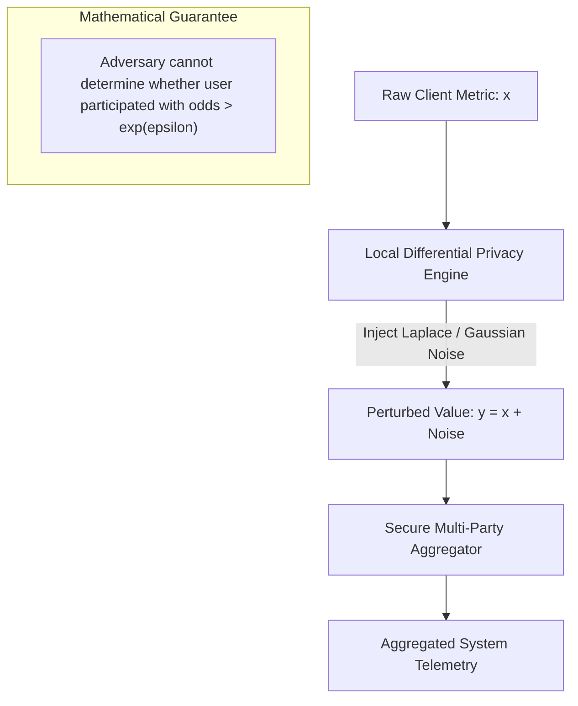

# 40 — Differential Privacy & Anti-Surveillance Telemetry

> **Corresponding Specifications:** [`sys-arch/92-anonymous-network-analytics-metrics-product-insights-privacy-preserving-aggregation-differential-privacy-anti-surveillance-data-architecture.md`](../sys-arch/92-anonymous-network-analytics-metrics-product-insights-privacy-preserving-aggregation-differential-privacy-anti-surveillance-data-architecture.md), [`sys-arch/93-anonymous-network-experimentation-feature-evaluation-ab-testing-rollouts-cohort-assignment-privacy-preserving-product-validation-architecture.md`](../sys-arch/93-anonymous-network-experimentation-feature-evaluation-ab-testing-rollouts-cohort-assignment-privacy-preserving-product-validation-architecture.md), [`sys-arch/94-anonymous-network-audit-transparency-user-visible-security-history-verifiable-actions-privacy-preserving-accountability-architecture.md`](../sys-arch/94-anonymous-network-audit-transparency-user-visible-security-history-verifiable-actions-privacy-preserving-accountability-architecture.md)  
> **Complements:** [`SIAR_SYSTEM_ARCHITECTURE_DESIGN_RATIONALE.md`](../SIAR_SYSTEM_ARCHITECTURE_DESIGN_RATIONALE.md) (§2.15), [Wiki Chapter 30](30-Private-Cloud-Services-and-Anti-Surveillance.md), [Wiki Chapter 41](41-Mathematical-SRE-Error-Budgets-and-Admission-Control.md)

---

## 1. Architectural Philosophy: Observability Without Surveillance

Engineering mission-critical distributed systems requires operational visibility: network engineers must monitor packet drop rates, radio interference patterns, battery drain rates, and crash frequencies to detect network partitions and software regressions.

However, standard software analytics pipelines (Google Analytics, Sentry, Mixpanel, Datadog) represent massive surveillance risks:
1. **User Fingerprinting**: Telemetry packets bundle hardware IDs, device models, screen resolutions, and IP addresses, enabling persistent user tracking across physical locations.
2. **Behavioral Profiling**: Logging interaction timestamps and feature usage reveals when users sleep, wake, communicate, and move.
3. **Subpoena & Data Breach Vulnerability**: Centralized telemetry databases become prime targets for intelligence agencies seeking to deanonymize dissident networks or reconstruct group communication graphs.

In [`sys-arch/92`](../sys-arch/92-anonymous-network-analytics-metrics-product-insights-privacy-preserving-aggregation-differential-privacy-anti-surveillance-data-architecture.md), SIAR achieves **Zero-Knowledge Observability** through **Local Differential Privacy (LDP)** combined with **Cryptographic Multi-Party Aggregation (SMPC)**.

---

## 2. Mathematical Foundations of Differential Privacy

### Definition of $(\epsilon, \delta)$-Differential Privacy
A randomized mechanism $\mathcal{M}$ provides $(\epsilon, \delta)$-Differential Privacy if for all neighboring datasets $D_1, D_2$ differing by at most one individual user's record, and for all observable output sets $S \subseteq \text{Range}(\mathcal{M})$:

$$\Pr[\mathcal{M}(D_1) \in S] \le e^{\epsilon} \cdot \Pr[\mathcal{M}(D_2) \in S] + \delta$$

Where:
- $\epsilon$ (Epsilon) is the **Privacy Budget**: smaller values enforce stronger plausible deniability ($\epsilon \le 1.0$ across SIAR).
- $\delta$ (Delta) bounds the probability of catastrophic information leakage ($\delta \le 10^{-6}$, cryptographically negligible).



### Mathematical Proof of the Laplace Mechanism
For real-valued telemetry $f(D)$ with $L_1$-sensitivity $\Delta_1 f = \max \|f(D_1) - f(D_2)\|_1$, let $\mathcal{M}(D) = f(D) + Y$, where $Y \sim \text{Lap}(0, b)$ with $b = \frac{\Delta_1 f}{\epsilon}$. The ratio of probability densities at any point $y$ is:

$$\frac{p(y \mid D_1)}{p(y \mid D_2)} = \frac{\frac{1}{2b}\exp\left(-\frac{|y - f(D_1)|}{b}\right)}{\frac{1}{2b}\exp\left(-\frac{|y - f(D_2)|}{b}\right)} = \exp\left(\frac{|y - f(D_2)| - |y - f(D_1)|}{b}\right)$$

By the triangle inequality, $|y - f(D_2)| - |y - f(D_1)| \le |f(D_1) - f(D_2)| \le \Delta_1 f$. Substituting $b = \frac{\Delta_1 f}{\epsilon}$:

$$\frac{p(y \mid D_1)}{p(y \mid D_2)} \le \exp\left(\frac{\Delta_1 f}{\Delta_1 f / \epsilon}\right) = \exp(\epsilon) = e^\epsilon \quad \blacksquare$$

### Privacy Composition Theorems
When a client responds to multiple analytical queries over time:
1. **Sequential Composition**: If mechanisms $\mathcal{M}_1, \ldots, \mathcal{M}_k$ satisfy $(\epsilon_i, \delta_i)$-DP, their combination satisfies:
   $$\epsilon_{\text{total}} = \sum_{i=1}^k \epsilon_i, \quad \delta_{\text{total}} = \sum_{i=1}^k \delta_i$$
2. **Advanced Composition Theorem**: For $k$ identical $(\epsilon, \delta)$-DP mechanisms, for any $\delta' > 0$, the total privacy budget is bounded by:
   $$\epsilon' = \sqrt{2k \ln(1/\delta')} \cdot \epsilon + k \epsilon(e^\epsilon - 1), \quad \delta_{\text{total}} = k\delta + \delta'$$

SIAR enforces a strict hard lifetime client budget $\epsilon_{\text{client}} \le 4.0$. Once exhausted, the client completely ceases telemetry reporting until the budget resets in the next epoch.

---

## 3. Local Perturbation Mechanisms

### 1. Laplace Mechanism (Continuous Metrics: Latency, Loss, Battery)
For real-valued telemetry $f(x)$ with scale $b = \frac{\Delta_1 f}{\epsilon}$:

$$Y = f(x) + \text{Lap}\left(0, \, \frac{\Delta_1 f}{\epsilon}\right), \quad f_{\text{Lap}}(t; b) = \frac{1}{2b} \exp\left(-\frac{|t|}{b}\right)$$

### 2. Gaussian Mechanism ($(\epsilon, \delta)$-DP for $L_2$-Sensitivity)
For high-dimensional metric vectors with $L_2$-sensitivity $\Delta_2 f$:

$$Y = f(x) + \mathcal{N}\left(0, \, \sigma^2 I\right), \quad \sigma = \frac{\Delta_2 f \sqrt{2\ln(1.25/\delta)}}{\epsilon}$$

### 3. Randomized Response & RAPPOR (Binary Telemetry)
For binary flags $x \in \{0, 1\}$ (e.g. *"Did audio codec experience buffer underrun?"*):

$$P(\text{Reported } 1 \mid \text{True } 1) = \frac{e^\epsilon}{e^\epsilon + 1}, \quad P(\text{Reported } 1 \mid \text{True } 0) = \frac{1}{e^\epsilon + 1}$$

The unbiased population mean estimator $\hat{p}$ from sample mean $\bar{y}$ across $N$ users is:

$$\hat{p} = \frac{\bar{y} \cdot (e^\epsilon + 1) - 1}{e^\epsilon - 1}$$

---

## 4. Cryptographic Secure Multi-Party Aggregation (SMPC)

Noise injection alone can leak information if an adversary collects thousands of noisy reports from the same client over months. SIAR combines LDP with **Secure Multi-Party Aggregation (SMPC)** using homomorphic Pedersen commitments:

```text
[Client 1: Perturbed v1]       [Client 2: Perturbed v2]       [Client 3: Perturbed v3]
           │                              │                              │
           ▼                              ▼                              ▼
[Pedersen Commitment C1]       [Pedersen Commitment C2]       [Pedersen Commitment C3]
           │                              │                              │
           └──────────────────────────────┼──────────────────────────────┘
                                          │ (Homomorphic Group Multiplication)
                                          ▼
                      [Aggregation Server: Decrypts ONLY SUM]
                      Total Sum = v1 + v2 + v3 + ... (Cohort N >= 1,000)
```

Each client produces a commitment $C_i = g^{v_i} h^{r_i} \pmod p$, where $g, h$ are generators of cyclic group $\mathbb{G}_q$, $v_i$ is the perturbed metric, and $r_i$ is a random blinding factor. The aggregator multiplies commitments homomorphically:

$$C_{\text{total}} = \prod_{i=1}^N C_i = g^{\sum v_i} h^{\sum r_i} \pmod p$$

The server can only decrypt the aggregate sum when at least $N \ge 1,000$ active users submit commitments in the same epoch.

---

## 5. Concrete Rust Differential Privacy Engine

The following production-grade Rust implementation enforces client-side privacy budgets, samples zero-mean Laplace and Gaussian noise, and computes unbiased population estimators:

```rust
use rand::Rng;
use std::sync::atomic::{AtomicU64, Ordering};

pub struct PrivacyBudgetGovernor {
    pub lifetime_epsilon_budget: f64,
    pub consumed_epsilon_scaled: AtomicU64, // Scaled by 10,000 for atomic operations
}

impl PrivacyBudgetGovernor {
    const SCALE: f64 = 10_000.0;

    pub fn new(max_epsilon: f64) -> Self {
        Self {
            lifetime_epsilon_budget: max_epsilon,
            consumed_epsilon_scaled: AtomicU64::new(0),
        }
    }

    pub fn current_consumed(&self) -> f64 {
        self.consumed_epsilon_scaled.load(Ordering::Relaxed) as f64 / Self::SCALE
    }

    pub fn try_consume(&self, epsilon: f64) -> Result<(), &'static str> {
        let delta_scaled = (epsilon * Self::SCALE).round() as u64;
        let max_scaled = (self.lifetime_epsilon_budget * Self::SCALE).round() as u64;

        let mut current = self.consumed_epsilon_scaled.load(Ordering::Relaxed);
        loop {
            if current + delta_scaled > max_scaled {
                return Err("Privacy budget exhausted: Telemetry reporting disabled");
            }
            match self.consumed_epsilon_scaled.compare_exchange_weak(
                current,
                current + delta_scaled,
                Ordering::SeqCst,
                Ordering::Relaxed,
            ) {
                Ok(_) => return Ok(()),
                Err(actual) => current = actual,
            }
        }
    }
}

pub struct DifferentialPrivacySampler;

impl DifferentialPrivacySampler {
    /// Sample zero-mean Laplace noise using inverse CDF
    pub fn sample_laplace(sensitivity: f64, epsilon: f64) -> f64 {
        let b = sensitivity / epsilon;
        let mut rng = rand::thread_rng();
        let u: f64 = rng.gen_range(-0.5..0.5);
        -b * u.signum() * (1.0 - 2.0 * u.abs()).ln()
    }

    /// Sample Gaussian noise using Box-Muller transform for (epsilon, delta)-DP
    pub fn sample_gaussian(sensitivity: f64, epsilon: f64, delta: f64) -> f64 {
        let sigma = sensitivity * (2.0 * (1.25 / delta).ln()).sqrt() / epsilon;
        let mut rng = rand::thread_rng();
        let u1: f64 = rng.gen_range(1e-10..1.0);
        let u2: f64 = rng.gen_range(0.0..1.0);
        let z0 = (-2.0 * u1.ln()).sqrt() * (2.0 * std::f64::consts::PI * u2).cos();
        z0 * sigma
    }

    /// Randomized response for binary telemetry flags
    pub fn randomized_response(true_value: bool, epsilon: f64) -> bool {
        let mut rng = rand::thread_rng();
        let p_truth = epsilon.exp() / (epsilon.exp() + 1.0);
        if rng.gen_range(0.0..1.0) < p_truth {
            true_value
        } else {
            !true_value
        }
    }
}
```

---

## 6. Tamper-Evident Merkle Transparency Logs (`sys-arch/94`)

All network administrative events (mix node slashing, cryptographic key rotations, and protocol upgrades) are recorded in an append-only **Merkle Tree Transparency Log** (RFC 6962):

```rust
pub struct MerkleInclusionProof {
    pub leaf_index: u64,
    pub total_leaves: u64,
    pub audit_path: Vec<[u8; 32]>,
}

impl MerkleInclusionProof {
    pub fn verify(&self, leaf_hash: &[u8; 32], expected_root: &[u8; 32]) -> bool {
        let mut current = *leaf_hash;
        let mut idx = self.leaf_index;
        for sibling in &self.audit_path {
            let mut hasher = blake3::Hasher::new();
            if idx % 2 == 0 {
                hasher.update(&current);
                hasher.update(sibling);
            } else {
                hasher.update(sibling);
                hasher.update(&current);
            }
            current = *hasher.finalize().as_bytes();
            idx /= 2;
        }
        &current == expected_root
    }
}
```

Clients verify operational event inclusion in $O(\log N)$ hash evaluations, completely eliminating single-authority tampering.

---

## 7. Threat Vectors & Anti-Deanonymization Defenses

```text
┌────────────────────────────────────────────────────────────────────────────────────────┐
│                        TELEMETRY THREAT & DEFENSE MATRIX                               │
├────────────────────────┬─────────────────────────┬─────────────────────────────────────┤
│ Threat Vector          │ Attack Mechanism        │ SIAR Defense Architecture           │
├────────────────────────┼─────────────────────────┼─────────────────────────────────────┤
│ **Reconstruction**     │ Repeated queries to solve│ Strict per-client $(\epsilon, \delta)$│
│                        │ equations for exact data│ lifetime budget; reports cease.     │
├────────────────────────┼─────────────────────────┼─────────────────────────────────────┤
│ **Membership Inference**│ Determine if specific   │ Bound maximum advantage to          │
│                        │ user is in dataset      │ $e^\epsilon \le 2.71$; plausible     │
│                        │                         │ deniability mathematically proven.  │
├────────────────────────┼─────────────────────────┼─────────────────────────────────────┤
│ **Split-View Log Fork**│ Server presents false   │ Gossip-based Merkle root exchange;  │
│                        │ audit log to victim     │ clients detect split views instantly│
├────────────────────────┼─────────────────────────┼─────────────────────────────────────┤
│ **Sybil Poisoning**    │ Adversary floods fake   │ Cohort threshold N >= 1,000 + TPM   │
│                        │ noise to skew metrics   │ hardware attestation of submitters. │
└────────────────────────┴─────────────────────────┴─────────────────────────────────────┘
```
