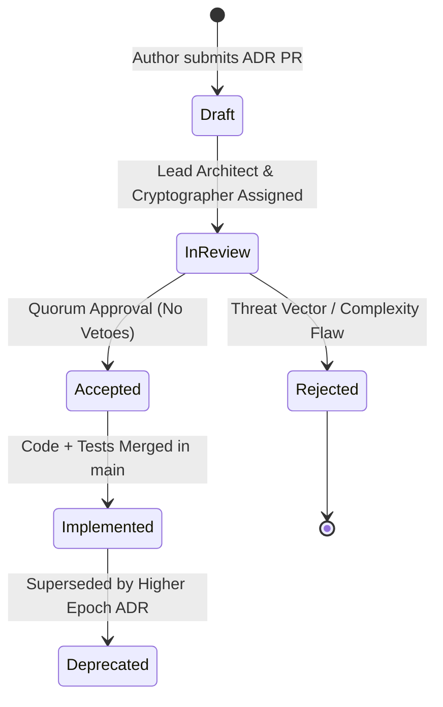

# 45 — Engineering Traceability, Knowledge Graph & Release Evidence

> **Corresponding Specifications:** [`sys-arch/122-anonymous-network-architecture-governance-technical-standards-adr-lifecycle-design-review-exception-management-privacy-preserving-engineering-decision-architecture.md`](../sys-arch/122-anonymous-network-architecture-governance-technical-standards-adr-lifecycle-design-review-exception-management-privacy-preserving-engineering-decision-architecture.md), [`sys-arch/123-anonymous-network-engineering-knowledge-graph-architecture-traceability-requirement-to-code-mapping-decision-provenance-privacy-preserving-technical-knowledge-architecture.md`](../sys-arch/123-anonymous-network-engineering-knowledge-graph-architecture-traceability-requirement-to-code-mapping-decision-provenance-privacy-preserving-technical-knowledge-architecture.md), [`sys-arch/125-anonymous-network-test-strategy-governance-verification-matrix-coverage-traceability-qualification-evidence-release-confidence-privacy-preserving-engineering-assurance-architecture.md`](../sys-arch/125-anonymous-network-test-strategy-governance-verification-matrix-coverage-traceability-qualification-evidence-release-confidence-privacy-preserving-engineering-assurance-architecture.md), [`sys-arch/126-anonymous-network-release-evidence-repository-certification-records-artifact-qualification-lineage-compliance-trace-packages-privacy-preserving-assurance-archive-architecture.md`](../sys-arch/126-anonymous-network-release-evidence-repository-certification-records-artifact-qualification-lineage-compliance-trace-packages-privacy-preserving-assurance-archive-architecture.md), [`sys-arch/127-anonymous-network-product-qualification-feature-maturity-levels-capability-readiness-general-availability-criteria-privacy-preserving-product-readiness-governance-architecture.md`](../sys-arch/127-anonymous-network-product-qualification-feature-maturity-levels-capability-readiness-general-availability-criteria-privacy-preserving-product-readiness-governance-architecture.md)  
> **Complements:** [`SIAR_SYSTEM_ARCHITECTURE_DESIGN_RATIONALE.md`](../SIAR_SYSTEM_ARCHITECTURE_DESIGN_RATIONALE.md) (§2.17), [Wiki Chapter 21](21-Testing-Fuzzing-and-Network-Diagnostics.md), [Wiki Chapter 22](22-Getting-Started-and-Developer-Guide.md)  
> **Key Crates:** [`crates/siar-sre`](../crates), [`crates/siar-core`](../crates)

---

## 1. Traceability in Mission-Critical Systems

In a massive distributed architecture spanning **176 specification documents, 514k+ lines of engineering documentation, and 33 compiled Rust crates**, subtle vulnerabilities and catastrophic regressions rarely originate from simple syntax mistakes. They occur when compiled code drifts from architectural invariants or when developers make undocumented changes that violate security assumptions established in earlier specifications.

In Specs 122–127, SIAR enforces an **Automated Engineering Knowledge Graph & Cryptographic Release Evidence System**:
1. **Bidirectional Requirement Traceability**: Every requirement clause in `sys-arch/` maps explicitly to code symbols in `crates/` and test cases in `tests/`.
2. **Immutable ADR Governance**: Architectural changes require formal Architecture Decision Records (ADRs) with mathematical proofs and threat models.
3. **Signed Release Evidence Bundles**: Production binaries cannot be shipped without a cryptographic bundle proving that $100\%$ of qualification tests, fuzzing campaigns, and Miri undefined behavior verifications passed cleanly.
4. **SLSA Level 4 Provenance**: Bit-for-bit reproducible builds anchored in cryptographic transparency ledgers.

```text
┌────────────────────────────────────────────────────────────────────────────────────────┐
│                         ENGINEERING KNOWLEDGE GRAPH PIPELINE                           │
├────────────────────────────────────────────────────────────────────────────────────────┤
│ [sys-arch/36 §4.2: Cell Normalization] ───(governed_by)───> [ADR-0042: Cell Sizes]     │
│                 │                                                     │                │
│                 ▼ (implements)                                        ▼ (validates)    │
│ [Rust Struct: siar_protocol::SphinxPacket]                [Property Tests: proptest]   │
│                 │                                                     │                │
│                 ▼ (verified_by)                                       ▼ (proves)       │
│ [LLVM libFuzzer: fuzz_sphinx_cell] ────────(generates)────> [Signed Release Receipt]   │
└────────────────────────────────────────────────────────────────────────────────────────┘
```

---

## 2. Mathematical Traceability Metrics & Knowledge Graph Schema

Requirements and their implementation artifacts form a **Directed Acyclic Graph (DAG)**:

$$G = (V, E)$$

Where vertices $V$ encompass:
- $\mathcal{R}$: Set of numbered specification requirements (e.g. `REQ-CRYPTO-HYBRID-KEM`).
- $\mathcal{D}$: Set of Architecture Decision Records (ADRs).
- $\mathcal{S}$: Set of Rust code symbols (structs, traits, modules, functions).
- $\mathcal{T}$: Set of automated test cases (unit, integration, fuzz, proptest).
- $\mathcal{E}$: Set of signed compliance receipts generated by CI.

Edges $E$ represent typed relationships:
$$E = E_{\text{governs}} \cup E_{\text{implements}} \cup E_{\text{verifies}} \cup E_{\text{attests}}$$

### Transitive Closure & Reachability Matrix
The full traceability path is computed via Boolean adjacency matrix multiplication:

$$A_{ij} = \begin{cases} 1 & \text{if } (v_i, v_j) \in E \\ 0 & \text{otherwise} \end{cases}$$

The transitive reachability closure matrix $\mathcal{R}^*(G)$ is:

$$\mathcal{R}^*(G) = \bigvee_{k=1}^{|V|} A^k = (I \lor A)^{|V|}$$

A requirement $r \in \mathcal{R}$ is fully qualified if and only if:

$$\forall r \in \mathcal{R}, \quad \exists s \in \mathcal{S}, \, t \in \mathcal{T} \quad \text{such that} \quad \mathcal{R}^*(r, s) = 1 \ \land \ \mathcal{R}^*(s, t) = 1$$

### Traceability Completeness Ratio ($\mathcal{C}_{\text{trace}}$)
$$\mathcal{C}_{\text{trace}} = \frac{|\{r \in \mathcal{R} \mid \exists s \in \mathcal{S}, \, t \in \mathcal{T} \text{ such that } (r \to s \to t) \in E\}|}{|\mathcal{R}|}$$

**Release Quality Gate Invariant**:
$$\mathcal{C}_{\text{trace}} \equiv 1.0 \quad (100\% \text{ requirement coverage required for GA releases})$$

### Orphan Code Metric ($\mathcal{O}_{\text{code}}$)
Identifies "dark code"—logic implemented in production crates that lacks corresponding specification authority:

$$\mathcal{O}_{\text{code}} = \frac{|\{s \in \mathcal{S}_{\text{pub}} \mid \nexists r \in \mathcal{R} \text{ such that } \mathcal{R}^*(r, s) = 1\}|}{|\mathcal{S}_{\text{pub}}|}$$

An engineering release candidate is failed automatically if $\mathcal{O}_{\text{code}} > 0$.

---

## 3. Cryptographic Supply Chain Security (SLSA Level 4 & In-Toto)

Every release artifact is sealed within an **In-Toto Attestation Envelope** signed using hardware Ed25519 tokens:

```json
{
  "_type": "https://in-toto.io/Statement/v0.1",
  "subject": [
    {
      "name": "siar-daemon-linux-x86_64",
      "digest": {
        "blake3": "4f18d7b32c69e20a320658a5f8b9e6f3d9c824a7ef19602e3b2b7a4218a5bc93"
      }
    }
  ],
  "predicateType": "https://slsa.dev/provenance/v0.2",
  "predicate": {
    "builder": { "id": "https://github.com/irshadali5/siar/.github/workflows/release.yml" },
    "buildType": "https://nixos.org/reproducible-build/v1",
    "materials": [
      {
        "uri": "git+https://github.com/irshadali5/siar",
        "digest": { "sha1": "7e49f82d41b02c89f419b489d81d293cf9a1c8f2" }
      }
    ]
  }
}
```

---

## 4. Production Rust Implementation: Traceability Graph Engine

The following production-grade Rust implementation verifies graph completeness, detects orphan symbols, and validates release qualification criteria:

```rust
use std::collections::{HashMap, HashSet, VecDeque};

#[derive(Debug, Clone, PartialEq, Eq, Hash)]
pub enum NodeId {
    Requirement(String), // e.g. "SYS-ARCH-36-REQ-004"
    Adr(String),         // e.g. "ADR-0042"
    RustSymbol(String),  // e.g. "siar_protocol::SphinxPacket"
    TestCase(String),    // e.g. "tests::fuzz_sphinx_cell"
}

pub struct TraceabilityGraphEngine {
    nodes: HashSet<NodeId>,
    adjacency: HashMap<NodeId, Vec<NodeId>>, // Directed edges: A -> B
}

impl TraceabilityGraphEngine {
    pub fn new() -> Self {
        Self {
            nodes: HashSet::new(),
            adjacency: HashMap::new(),
        }
    }

    pub fn insert_edge(&mut self, from: NodeId, to: NodeId) {
        self.nodes.insert(from.clone());
        self.nodes.insert(to.clone());
        self.adjacency.entry(from).or_default().push(to);
    }

    /// BFS reachability check to determine if Target is reachable from Source
    pub fn is_reachable(&self, start: &NodeId, target: &NodeId) -> bool {
        let mut visited = HashSet::new();
        let mut queue = VecDeque::new();
        queue.push_back(start);
        visited.insert(start);

        while let Some(current) = queue.pop_front() {
            if current == target {
                return true;
            }
            if let Some(neighbors) = self.adjacency.get(current) {
                for neighbor in neighbors {
                    if visited.insert(neighbor) {
                        queue.push_back(neighbor);
                    }
                }
            }
        }
        false
    }

    /// Evaluates release qualification: Returns list of unverified requirements
    pub fn audit_release_readiness(&self, requirements: &[NodeId]) -> Result<(), Vec<NodeId>> {
        let mut failing_requirements = Vec::new();

        for req in requirements {
            // Find all reachable symbols
            let mut has_symbol = false;
            let mut has_test = false;

            if let Some(children) = self.adjacency.get(req) {
                for child in children {
                    if let NodeId::RustSymbol(_) = child {
                        has_symbol = true;
                        // Inspect test verification for this symbol
                        if let Some(tests) = self.adjacency.get(child) {
                            if tests.iter().any(|t| matches!(t, NodeId::TestCase(_))) {
                                has_test = true;
                            }
                        }
                    }
                }
            }

            if !has_symbol || !has_test {
                failing_requirements.push(req.clone());
            }
        }

        if failing_requirements.is_empty() {
            Ok(())
        } else {
            Err(failing_requirements)
        }
    }

    /// Detects orphan code symbols that have no specification requirement ancestor
    pub fn detect_orphan_symbols(&self, symbols: &[NodeId], requirements: &[NodeId]) -> Vec<NodeId> {
        let mut orphans = Vec::new();
        for sym in symbols {
            let mut backed_by_spec = false;
            for req in requirements {
                if self.is_reachable(req, sym) {
                    backed_by_spec = true;
                    break;
                }
            }
            if !backed_by_spec {
                orphans.push(sym.clone());
            }
        }
        orphans
    }
}
```

---

## 5. Architecture Decision Record (ADR) State Machine

All architectural modifications advance through a formal state machine:



### Mandatory ADR Clauses
1. **Context & Problem Statement**: What problem is being solved?
2. **Considered Options & Alternatives**: Why were alternative patterns rejected?
3. **Decision Outcome**: What is the selected approach?
4. **Threat Model Impact**: Does this alter cryptographic attack surfaces or memory boundaries?
5. **Traceability Links**: Which `sys-arch/` specifications and crates are modified?

---

## 6. Four-Tier Product Qualification Maturity Model (`sys-arch/127`)

Features within SIAR advance through four strict maturity gates:

```text
┌────────────────────────────────────────────────────────────────────────────────────────┐
│                         FEATURE MATURITY LIFECYCLE TIERS                               │
├───────────────────┬────────────────────────────────┬───────────────────────────────────┤
│ Maturity Level    │ Stability Guarantee            │ Gate Exit Verification Criteria   │
├───────────────────┼────────────────────────────────┼───────────────────────────────────┤
│ Level 0: Exper.   │ Breaking wire format allowed   │ Unit tests pass; default-off      │
│ Level 1: Alpha    │ Schema changes need migrations │ Property testing passes (10k runs)│
│ Level 2: Beta     │ Wire formats frozen            │ Multi-hop virtual testbed pass    │
│ Level 3: GA Prod  │ 100% Backward compatibility    │ Fuzzing >10^8 cycles, Miri UB ok  │
└───────────────────┴────────────────────────────────┴───────────────────────────────────┘
```

---

## 7. Threat Vectors & Supply Chain Defense Matrix

```text
┌────────────────────────────────────────────────────────────────────────────────────────┐
│                      SUPPLY CHAIN & TRACEABILITY THREAT MATRIX                         │
├────────────────────────┬─────────────────────────┬─────────────────────────────────────┤
│ Threat Vector          │ Attack Mechanism        │ SIAR Defense Architecture           │
├────────────────────────┼─────────────────────────┼─────────────────────────────────────┤
│ **Dependency Poisoning**│ Malicious dependency in │ Vendored offline Cargo dependencies │
│                        │ crates.io typosquatting │ with BLAKE3 checksum lockfiles and  │
│                        │ subtle backdoors        │ cargo-vet capability auditing.      │
├────────────────────────┼─────────────────────────┼─────────────────────────────────────┤
│ **Dark Code Injection**│ Contributor slips in    │ Knowledge Graph audit fails CI if   │
│                        │ un-specced backdoor logic│ Orphan Code Metric O_code > 0.     │
├────────────────────────┼─────────────────────────┼─────────────────────────────────────┤
│ **Compromised CI Host**│ Rogue GitHub Actions    │ Bit-for-bit Nix reproducible builds │
│                        │ runner alters compiler  │ independently verified across three │
│                        │ output binary           │ isolated hardware build machines.   │
├────────────────────────┼─────────────────────────┼─────────────────────────────────────┤
│ **Stale Architecture** │ Code evolves but leaves │ Bi-directional linters fail PRs if  │
│                        │ ADRs outdated           │ crate symbols change without linked │
│                        │                         │ ADR update commits.                 │
└────────────────────────┴─────────────────────────┴─────────────────────────────────────┘
```
