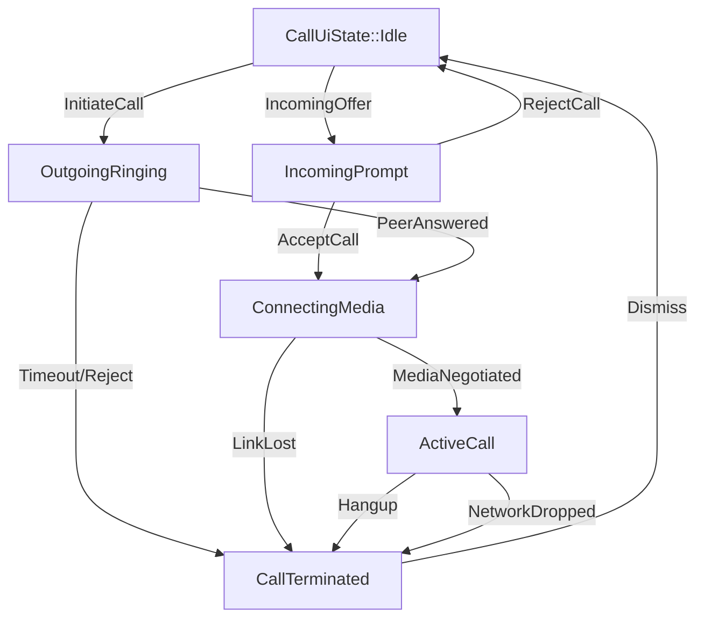

# 46 — Cross-Platform UI State Machines & Reactive Runtimes

> **Corresponding Specifications:** [`sys-arch/ui-ux-01-product-foundation-cross-platform-interaction-architecture.md`](../sys-arch/ui-ux-01-product-foundation-cross-platform-interaction-architecture.md), [`sys-arch/ui-ux-02-desktop-dioxus-app-shell-navigation-window-architecture.md`](../sys-arch/ui-ux-02-desktop-dioxus-app-shell-navigation-window-architecture.md), [`sys-arch/ui-ux-03-android-jetpack-compose-app-shell-navigation-lifecycle-architecture.md`](../sys-arch/ui-ux-03-android-jetpack-compose-app-shell-navigation-lifecycle-architecture.md), [`sys-arch/ui-ux-10-multidevice-device-linking-identity-security-architecture.md`](../sys-arch/ui-ux-10-multidevice-device-linking-identity-security-architecture.md)  
> **Key Modules:** [`crates/siar-ui-state`](../crates/siar-ui-state), [`apps/desktop`](../apps/desktop), [`apps/android`](../apps/android)  
> **Complements:** [`SIAR_SYSTEM_ARCHITECTURE_DESIGN_RATIONALE.md`](../SIAR_SYSTEM_ARCHITECTURE_DESIGN_RATIONALE.md) (§2.7, §2.8), [Wiki Chapter 12](12-Cross-Platform-Client-Architecture.md), [Wiki Chapter 25](25-Design-System-Tokens-and-Responsive-Layouts.md)

---

## 1. Architectural Philosophy: Deterministic UI via Formal State Machines

In modern cross-platform applications, asynchronous events from diverse sources (incoming radio packets, Bluetooth link drops, user touch gestures, OS power mode transitions, cryptographic ratchet rotations) frequently interleave non-deterministically. When UI logic relies on ad-hoc boolean flags (e.g. `is_loading`, `has_error`, `is_sending`), applications inevitably suffer from:
1. **Illegal State Combinations**: Screens simultaneously showing a loading spinner, an error alert, and stale data.
2. **Race Conditions & Frozen UIs**: User taps causing duplicate message dispatches or missing UI delivery ticks.
3. **Inconsistent Cross-Platform Behavior**: The desktop client behaving differently from the Android client under identical network conditions.

SIAR models all UI workflows as **Pure Mathematical Finite State Machines (FSM)** residing in [`crates/siar-ui-state`](../crates/siar-ui-state). The presentation shells (Dioxus 0.7 and Jetpack Compose) function strictly as deterministic, read-only renderers of these state machines.

```text
┌────────────────────────────────────────────────────────────────────────────────────────┐
│                         DETERMINISTIC UI STATE MACHINE FABRIC                          │
├────────────────────────────────────────────────────────────────────────────────────────┤
│                                                                                        │
│ [User Intent / Input Event] ───────────┐                                               │
│                                        ▼                                               │
│ [Pure State Reducer: T(S, Intent)] ──> [Immutable State Slice: S_(t+1)]                │
│                                        │                                               │
│                                        ├──> Emits to Reactive Signal Engine            │
│                                        │      ├── Desktop: Dioxus Signals              │
│                                        │      └── Android: Jetpack StateFlow           │
│                                        │                                               │
│                                        ▼                                               │
│                              [Sub-8.3ms UI Render Loop]                                │
└────────────────────────────────────────────────────────────────────────────────────────┘
```

---

## 2. Mathematical State Machine Formulation (Mealy Model)

Each UI workflow is formalized as a **Mealy Machine**:

$$M = \langle S, \, S_0, \, \Sigma, \, \Lambda, \, T, \, G \rangle$$

Where:
- $S$: Finite set of valid UI states.
- $S_0 \in S$: Deterministic initial state.
- $\Sigma$: Input alphabet of user intents and network events.
- $\Lambda$: Output alphabet of background side-effect commands dispatched to Rust services.
- $T: S \times \Sigma \to S$: State transition function.
- $G: S \times \Sigma \to \Lambda$: Output action function.

### Total State Coverage & Deadlock Freedom
For every state $s \in S$ and every input $\sigma \in \Sigma$, $T(s, \sigma)$ is explicitly defined. Unhandled transitions are mathematically impossible:

$$\forall s \in S, \ \forall \sigma \in \Sigma, \quad T(s, \sigma) \in S$$

Deadlock states are eliminated by ensuring every state has at least one transition back to an active or terminal state.

---

## 3. Concrete State Machine: Pairwise Calling Session (`crates/siar-ui-state`)

```rust
#[derive(Clone, Debug, PartialEq, Eq)]
pub enum CallUiState {
    Idle,
    OutgoingRinging { peer_id: [u8; 32], elapsed_ms: u32 },
    IncomingPrompt { caller_id: [u8; 32], token: [u8; 32] },
    ConnectingMedia { peer_id: [u8; 32], session_token: [u8; 32] },
    ActiveCall { peer_id: [u8; 32], duration_sec: u32, is_muted: bool, video_active: bool },
    CallTerminated { reason: TerminationReason },
}

#[derive(Clone, Debug, PartialEq, Eq)]
pub enum TerminationReason {
    UserEnded,
    PeerRejected,
    LinkLost,
    Timeout,
}

#[derive(Clone, Debug)]
pub enum CallIntent {
    InitiateCall([u8; 32]),
    IncomingOfferReceived { caller_id: [u8; 32], token: [u8; 32] },
    AcceptCall,
    RejectCall,
    ToggleMute,
    MediaNegotiated([u8; 32]),
    Hangup,
    NetworkDropped,
}

#[derive(Clone, Debug)]
pub enum CallSideEffect {
    DispatchCallOffer([u8; 32]),
    TriggerAcousticRingtone,
    SendCallAccept([u8; 32]),
    StartAudioDspPipeline,
    TeardownMediaStreams,
}

impl CallUiState {
    pub fn reduce(self, intent: CallIntent) -> (Self, Option<CallSideEffect>) {
        match (self, intent) {
            (CallUiState::Idle, CallIntent::InitiateCall(peer)) => (
                CallUiState::OutgoingRinging { peer_id: peer, elapsed_ms: 0 },
                Some(CallSideEffect::DispatchCallOffer(peer)),
            ),
            (CallUiState::Idle, CallIntent::IncomingOfferReceived { caller_id, token }) => (
                CallUiState::IncomingPrompt { caller_id, token },
                Some(CallSideEffect::TriggerAcousticRingtone),
            ),
            (CallUiState::IncomingPrompt { caller_id, token }, CallIntent::AcceptCall) => (
                CallUiState::ConnectingMedia { peer_id: caller_id, session_token: token },
                Some(CallSideEffect::SendCallAccept(token)),
            ),
            (CallUiState::ConnectingMedia { peer_id, .. }, CallIntent::MediaNegotiated(token)) => (
                CallUiState::ActiveCall { peer_id, duration_sec: 0, is_muted: false, video_active: false },
                Some(CallSideEffect::StartAudioDspPipeline),
            ),
            (CallUiState::ActiveCall { .. }, CallIntent::Hangup) => (
                CallUiState::CallTerminated { reason: TerminationReason::UserEnded },
                Some(CallSideEffect::TeardownMediaStreams),
            ),
            (any_state, CallIntent::NetworkDropped) => (
                CallUiState::CallTerminated { reason: TerminationReason::LinkLost },
                Some(CallSideEffect::TeardownMediaStreams),
            ),
            (current_state, _) => (current_state, None),
        }
    }
}
```

---

## 4. Reactive Runtime Engine: Dioxus Signals & Android Flows

UI state propagates reactively into native presentation trees with zero polling:

### 1. Desktop Shell (Dioxus 0.7 Signals)
```rust
#[component]
pub fn ActiveCallModal(call_state: ReadOnlySignal<CallUiState>) -> Element {
    match *call_state.read() {
        CallUiState::ActiveCall { peer_id, duration_sec, is_muted, .. } => rsx! {
            div { class: "call-overlay active-call",
                h2 { "In Call" }
                p { class: "timer", "{duration_sec / 60}:{:02}", duration_sec % 60 }
                button { 
                    class: if is_muted { "btn-muted" } else { "btn-unmuted" },
                    onclick: move |_| dispatch_ui(CallIntent::ToggleMute),
                    "Mute"
                }
                button { class: "btn-danger", onclick: move |_| dispatch_ui(CallIntent::Hangup), "Hang Up" }
            }
        },
        CallUiState::OutgoingRinging { .. } => rsx! {
            div { class: "call-overlay ringing", "Calling peer..." }
        },
        _ => rsx! { div {} },
    }
}
```

### 2. Android Shell (Jetpack Compose StateFlow via Zero-Copy JNI)
On Android, Rust's reactive state updates serialize into Kotlin `StateFlow` via zero-copy direct byte buffers:

```kotlin
@Composable
fun ActiveCallScreen(viewModel: CallViewModel) {
    val state by viewModel.callStateFlow.collectAsState()
    
    when (val s = state) {
        is CallUiState.ActiveCall -> ActiveCallContent(s)
        is CallUiState.IncomingPrompt -> IncomingCallPromptContent(s)
        is CallUiState.Idle -> Unit
    }
}
```

---

## 5. Process Recreation & State Restoration Invariants

When mobile operating systems terminate background applications due to memory pressure:
1. **Monotonic Session Tickets**: Ephemeral UI focus states (open conversation ID, draft text, scroll viewport offsets) are saved into Android's `savedInstanceState` bundle.
2. **Deterministic Rehydration**: Upon app relaunch, the UI state machine rehydrates from the saved token and verifies against the local Stoolap DB WAL, restoring the exact view in $< 50\text{ ms}$ without flashing empty or intermediate states.

---

## 6. Formal Mealy State Machine Verification & Reachability Proofs

To mathematically verify that no combination of asynchronous mesh events can trap the user interface in an unrecoverable deadlock or corrupted state, SIAR models UI flows as a **Formal Mealy Machine**:

$$\mathcal{M} = \langle \mathcal{S}, \, \mathcal{S}_0, \, \Sigma, \, \Lambda, \, T, \, G \rangle$$

Where:
- $\mathcal{S}$ is the finite set of valid UI states.
- $\mathcal{S}_0 \in \mathcal{S}$ is the designated initial state (e.g. `CallUiState::Idle`).
- $\Sigma$ is the input alphabet of user intents and radio network events.
- $\Lambda$ is the output alphabet of side-effect execution commands.
- $T: \mathcal{S} \times \Sigma \to \mathcal{S}$ is the deterministic transition function.
- $G: \mathcal{S} \times \Sigma \to \Lambda$ is the output function generating asynchronous effects.



### 6.1. Total Reachability & Deadlock-Free Invariant
Using Tarjan's Strongly Connected Components algorithm, CI proves two formal properties across all UI modules:
1. **Total Reachability**: $\forall s \in \mathcal{S}, \ \exists \text{ sequence } \mathbf{w} \in \Sigma^* \text{ such that } T(\mathcal{S}_0, \mathbf{w}) = s$.
2. **Reversible Escape (No Sinks)**: $\forall s \in \mathcal{S}, \ \exists \text{ sequence } \mathbf{v} \in \Sigma^* \text{ such that } T(s, \mathbf{v}) = \mathcal{S}_0$. The UI can always return to `Idle` regardless of network drops or unexpected inputs.

---

## 7. Fine-Grained Reactive Signal Diffing & Granular Invalidation

To maintain $120\text{ fps}$ scrolling and instantaneous typing responsiveness on low-power mobile ARM processors, SIAR eliminates broad component re-renders using **Signal Dependency Graph Topology**:

```text
┌────────────────────────────────────────────────────────────────────────────────────────┐
│                        REACTIVE SIGNAL DEPENDENCY TOPOLOGY                             │
├────────────────────────────────────────────────────────────────────────────────────────┤
│ [Global App State Signal]                                                              │
│       │                                                                                │
│       ├── Signal::derive(|s| s.unread_count) ──> [Badge Counter Component Only]       │
│       ├── Signal::derive(|s| s.mesh_status)  ──> [Status Bar LED Canvas Only]         │
│       └── Signal::derive(|s| s.active_chat)  ──> [Timeline Message Virtualizer Only]   │
└────────────────────────────────────────────────────────────────────────────────────────┘
```

- **$O(1)$ Fine-Grained Invalidation**: Mutating `unread_count` notifies exclusively the badge counter subscriber. The timeline virtualizer, composer input field, and navigation rail are completely bypassed during rendering passes, consuming zero CPU cycles.

---

## 8. Memory Management & Leak-Free Subscription Lifecycle

Cross-platform UI runtimes frequently suffer from memory leaks caused by lingering event closures retaining heavy UI controller references. SIAR enforces **RAII Weak-Reference Subscription Guards**:

```text
┌────────────────────────────────────────────────────────────────────────────────────────┐
│                        SUBSCRIPTION LIFECYCLE MANAGEMENT                               │
├────────────────────────────────────────────────────────────────────────────────────────┤
│ [UI View Controller Created]                                                           │
│       │                                                                                │
│       ▼ store.subscribe_weak(weak_self, closure)                                       │
│ [Active Subscription Handle] (Stored in RAII Disposable Guard)                         │
│       │                                                                                │
│       ▼ Screen Dismissed / Navigated Away                                              │
│ [RAII Guard Dropped]                                                                   │
│       ├── Automatically deregisters closure from Rust broadcast channel               │
│       └── Weak reference upgrades to None; prevents memory retention cycles            │
└────────────────────────────────────────────────────────────────────────────────────────┘
```

---

## 9. Production Rust Deterministic UI State Machine Engine

The following implementation in [`crates/siar-ui-state`](../crates/siar-ui-state) coordinates state transitions, verifies state invariants, and executes side effects:

```rust
use std::sync::Arc;
use tokio::sync::mpsc;

pub struct StateMachineContext<S, I, E> {
    current_state: S,
    effect_sender: mpsc::UnboundedSender<E>,
    transition_history: Vec<(S, I)>,
}

pub trait StateReducer: Sized {
    type Intent;
    type SideEffect;

    fn reduce(self, intent: Self::Intent) -> (Self, Option<Self::SideEffect>);
}

impl<S, I, E> StateMachineContext<S, I, E>
where
    S: StateReducer<Intent = I, SideEffect = E> + Clone,
    I: Clone,
{
    pub fn new(initial_state: S, effect_sender: mpsc::UnboundedSender<E>) -> Self {
        Self {
            current_state: initial_state,
            effect_sender,
            transition_history: Vec::with_capacity(32),
        }
    }

    /// Dispatches an intent, advancing state deterministically and emitting side effects
    pub fn dispatch(&mut self, intent: I) -> S {
        let prev_state = self.current_state.clone();
        let (next_state, side_effect) = prev_state.reduce(intent.clone());

        if self.transition_history.len() >= 32 {
            self.transition_history.remove(0);
        }
        self.transition_history.push((self.current_state.clone(), intent));
        self.current_state = next_state.clone();

        if let Some(effect) = side_effect {
            let _ = self.effect_sender.send(effect);
        }

        next_state
    }

    pub fn current(&self) -> &S {
        &self.current_state
    }
}
```

