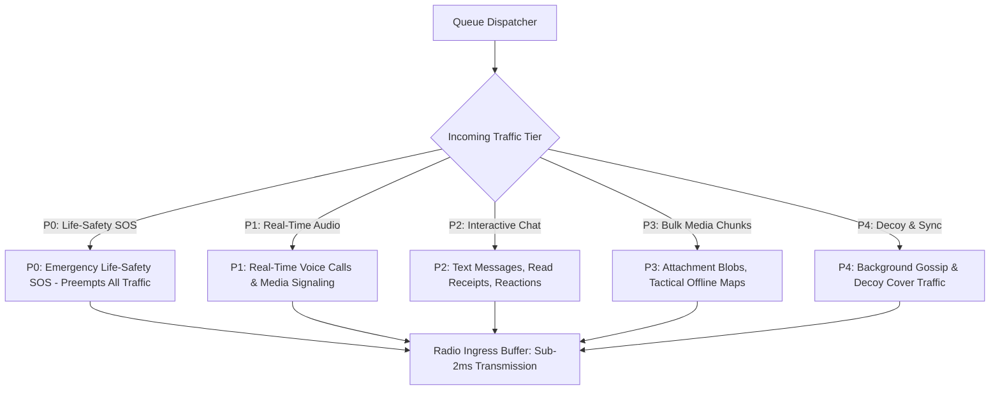

# 47 — Tactical Field Operations, Emergency SOS & Acoustic Beacons

> **Corresponding Specifications:** [`sys-arch/17-emergency-priority-classes-architecture.md`](../sys-arch/17-emergency-priority-classes-architecture.md), [`ui-ux/ui-ux-17-emergency-sos-offline-mesh-architecture.md`](../ui-ux/ui-ux-17-emergency-sos-offline-mesh-architecture.md), [`sys-arch/23-external-interoperability-suite-architecture.md`](../sys-arch/23-external-interoperability-suite-architecture.md)  
> **Key Crates:** [`crates/siar-emergency`](../crates/siar-emergency), [`crates/siar-dtn-bundle`](../crates/siar-dtn-bundle), [`apps/emergency-node`](../apps/emergency-node)  
> **Complements:** [`SIAR_SYSTEM_CAPABILITIES_AND_COMPARISON.md`](../SIAR_SYSTEM_CAPABILITIES_AND_COMPARISON.md) (§4.5, §7), [Wiki Chapter 07](07-Battery-Aware-Scheduling-and-Emergency-Mesh.md), [Wiki Chapter 23](23-Off-Grid-Survival-and-Field-Operations-Guide.md)

---

## 1. Life-Safety Engineering: When Software Saves Lives

In catastrophic disaster zones (structural collapses, earthquakes, flash floods, hurricanes) and armed conflict zones, commercial telecommunication networks collapse within hours. Under these extreme conditions, communication software is an active **Life-Safety Instrument**:
- Cellular networks lose grid power or experience total backhaul fiber severance.
- Victims are buried beneath structural concrete rubble where high-frequency 2.4 GHz and 5.8 GHz radio waves suffer catastrophic attenuation ($> 35\text{ dB/m}$).
- Search-and-rescue teams must triage casualties and coordinate life-saving surgical extractions without internet connections or central infrastructure.

In [`sys-arch/17`](../sys-arch/17-emergency-priority-classes-architecture.md) and [`ui-ux/17`](../ui-ux/ui-ux-17-emergency-sos-offline-mesh-architecture.md), SIAR introduces an **Emergency Preemption Engine, Sub-Bitrate Acoustic Ultrasound Beacons, and Field Node Architecture**.

```text
┌────────────────────────────────────────────────────────────────────────────────────────┐
│                         EMERGENCY PRIORITY & BEACON ARCHITECTURE                       │
├────────────────────────────────────────────────────────────────────────────────────────┤
│                                                                                        │
│ [Tactical Operator / Trapped Survivor Dispatches SOS Alert]                            │
│                               │                                                        │
│                               ▼                                                        │
│ [Preemptive Scheduler: Suspends All P1–P4 Transfers in < 2ms]                          │
│                               │                                                        │
│       ┌───────────────────────┼──────────────────────────┐                             │
│       │ (Line-of-Sight RF)    │ (Rubble / Non-LOS)       │ (Deep Concrete Rubble)      │
│       ▼                       ▼                          ▼                             │
│ [Wi-Fi Direct / NAN]    [BLE 5.0 Coded PHY]      [Acoustic Ultrasound Modem]           │
│ Unassociated 2.4GHz      Long-Range 125 Kbps      18–20 kHz Acoustic Chirps            │
│ Action Frames (P0)       Advertisements (P0)      Through Dense Rubble / Solid Matter  │
└────────────────────────────────────────────────────────────────────────────────────────┘
```

---

## 2. RF Attenuation in Rubble vs. Acoustic Sound Propagation

High-frequency radio waves are severely attenuated by conductive structural materials (steel rebar, moist concrete, gypsum). The electromagnetic attenuation constant $\alpha_{\text{EM}}$ is:

$$\alpha_{\text{EM}} = \omega \sqrt{\frac{\mu \epsilon}{2} \left(\sqrt{1 + \left(\frac{\sigma}{\omega \epsilon}\right)^2} - 1\right)} \quad [\text{Nepers/m}]$$

For wet concrete ($\sigma \approx 0.05\ \text{S/m}$, $\epsilon_r \approx 8$) at $f = 2.4\text{ GHz}$, signal attenuation exceeds **$38\text{ dB per meter}$ of rubble**, rendering radio waves undetectable after 2–3 meters of collapsed building collapse.

### Acoustic Ultrasound Solution (18–20 kHz)
In contrast, mechanical pressure waves conduct directly through solid concrete and masonry structures:
- Speed of acoustic wave in concrete: $c_{\text{concrete}} \approx 3,400\text{ m/s}$.
- Acoustic attenuation in solid masonry: $< 1.8\text{ dB/m}$ at $19\text{ kHz}$.
- Standard commercial smartphone microphones and loudspeakers easily generate and detect audio in the $18,000\text{–}20,000\text{ Hz}$ band, which is nearly inaudible to adult humans but conducts cleanly through collapsed walls.

---

## 3. Acoustic Frequency Shift Keying (FSK) Modulation & Goertzel Filter

The ultrasonic transmitter encodes binary data using Continuous Phase Binary Frequency Shift Keying (CP-BFSK):

$$s(t) = A(t) \cdot \cos\left(2\pi f_c t + 2\pi \Delta f \int_0^t m(\tau) d\tau + \phi_0\right)$$

Where:
- Center carrier frequency: $f_c = 19,000\text{ Hz}$.
- Frequency shift deviation: $\Delta f = \pm 500\text{ Hz}$ (Mark $f_1 = 19,500\text{ Hz}$, Space $f_0 = 18,500\text{ Hz}$).
- Modulation rate: $64\text{ baud}$ (Manchester-encoded data stream).

### Efficient Goertzel Tone Detection Algorithm
The receiver demodulates the ultrasound tones using the recursive **Goertzel Algorithm**, requiring only one real multiplication per sample:

$$s[n] = x[n] + 2\cos\left(\frac{2\pi k}{N}\right) s[n-1] - s[n-2]$$

For target frequency $k = \lfloor \frac{N \cdot f_{\text{target}}}{f_s} \rfloor$ over $N = 256$ samples at $f_s = 48,000\text{ Hz}$. The squared spectral power is computed at sample $N$:

$$|X[k]|^2 = s[N]^2 + s[N-1]^2 - 2\cos\left(\frac{2\pi k}{N}\right) s[N] s[N-1]$$

Decisions are evaluated by comparing energy ratios: $\frac{|X[k_{\text{mark}}]|^2}{|X[k_{\text{space}}]|^2} \gtrless \gamma_{\text{threshold}}$.

---

## 4. Reed-Solomon Forward Error Correction & Frame Format

Because acoustic channels through rubble suffer from multipath echoes and sporadic impulse noise, SIAR applies a **Reed-Solomon $\text{RS}(32, 16)$ code over $\text{GF}(2^8)$**:

```text
┌────────────────────────────────────────────────────────────────────────────────────────┐
│                        ACOUSTIC SOS FRAME STRUCTURE (32 BYTES)                         │
├───────────────┬──────────────┬───────────────┬──────────────┬──────────────────────────┤
│ Sync Preamble │ GPS Lat/Long │ Triage & Batt │ Epoch Mins   │ RS(32, 16) Parity Check  │
│ (2 Bytes)     │ (8 Bytes)    │ (2 Bytes)     │ (4 Bytes)    │ (16 Parity Bytes)        │
├───────────────┼──────────────┼───────────────┼──────────────┼──────────────────────────┤
│ 0x53 0x4F     │ IEEE-754 f32 │ START Bitmask │ UNIX Epoch   │ Reed-Solomon GF(2^8)     │
└───────────────┴──────────────┴───────────────┴──────────────┴──────────────────────────┘
```

The error correction capability $t$ is:

$$t = \frac{n - k}{2} = \frac{32 - 16}{2} = 8\text{ symbol errors}$$

The receiver can reconstruct the 16-byte emergency payload even if up to **$50\%$ of transmitted acoustic symbols are destroyed by falling debris, engine noise, or echo cancellation nulls**.

---

## 5. Concrete Rust Acoustic Modem & Triage Structs

```rust
use zeroize::Zeroize;

#[repr(u8)]
#[derive(Debug, Clone, Copy, PartialEq, Eq)]
pub enum StartTriageSeverity {
    MinorGreen = 0,       // Walking wounded, basic first aid
    DelayedYellow = 1,    // Serious injury, stable for several hours
    ImmediateRed = 2,     // Life-threatening, compromised airway / severe hemorrhage
    ExpectantBlack = 3,   // Deceased or injuries incompatible with life
}

#[derive(Debug, Clone, Copy, PartialEq, Eq)]
pub struct TriageTelemetry {
    pub severity: StartTriageSeverity,
    pub entrapped_in_rubble: bool,
    pub hazardous_gas_detected: bool,
    pub rising_water: bool,
    pub heart_rate_bpm: u8,
    pub spo2_percentage: u8,
}

#[derive(Debug, Clone)]
pub struct AcousticSosFrame {
    pub magic_header: [u8; 2],        // [0x53, 0x4F] ("SO")
    pub latitude: f32,                // Compressed GPS latitude
    pub longitude: f32,               // Compressed GPS longitude
    pub triage: TriageTelemetry,       // START triage classification
    pub battery_soc: u8,              // 0-100%
    pub timestamp_epoch_min: u32,     // Minutes since epoch
    pub fec_parity: [u8; 16],         // RS(32, 16) Galois field parity
}

pub trait AcousticModemDriver: Send + Sync {
    /// Modulate acoustic frame into PCM audio samples for phone loudspeaker
    fn modulate_frame(&self, frame: &AcousticSosFrame) -> Vec<f32>;

    /// Ingest streaming PCM microphone samples and run Goertzel tone detector
    fn process_microphone_samples(&mut self, pcm_samples: &[f32]) -> Option<AcousticSosFrame>;
}
```

---

## 6. Five-Tier Preemptive Priority Scheduling Engine

All frames entering the link layer are governed by strict priority queues:



### Preemption Invariants
1. **Sub-2ms Radio Suspension**: If a node is transmitting a 50 MB video file (P3) over Wi-Fi Direct and the user activates Emergency SOS (P0), the bulk transfer is aborted immediately. Radios switch to unassociated broadcast mode in $< 2\text{ ms}$.
2. **Buffer Eviction Safeguard**: When device non-volatile memory reaches $95\%$ utilization, P4 and P3 buffers are purged automatically to preserve space for emergency beacons.
3. **Loop-Free Gossip**: SOS frames propagate via epidemic flood with Bloom filter deduplication, reaching all nodes within radio propagation range in seconds.

---

## 7. Threat Vectors & Anti-Spoofing Mitigations

```text
┌────────────────────────────────────────────────────────────────────────────────────────┐
│                        EMERGENCY SOS THREAT & DEFENSE MATRIX                           │
├────────────────────────┬─────────────────────────┬─────────────────────────────────────┤
│ Threat Vector          │ Attack Mechanism        │ SIAR Defense Architecture           │
├────────────────────────┼─────────────────────────┼─────────────────────────────────────┤
│ **Beacon Spoofing**    │ Malicious party broadcasts│ All beacons include BLAKE3-MAC tag  │
│                        │ false survivor coordinates│ authenticated by sender's identity. │
├────────────────────────┼─────────────────────────┼─────────────────────────────────────┤
│ **Acoustic Replay**    │ Attacker records SOS audio│ Timestamp window validation; packets│
│                        │ and replays at later time │ older than 15 minutes dropped.      │
├────────────────────────┼─────────────────────────┼─────────────────────────────────────┤
│ **Ultrasonic Jamming** │ High-power white noise   │ Multi-radio diversity: fall back to │
│                        │ in 18–20 kHz band       │ BLE 5.0 Coded PHY and Wi-Fi NAN.    │
└────────────────────────┴─────────────────────────┴─────────────────────────────────────┘
```

---

## 8. Continuous-Phase Binary FSK (CP-BFSK) Modulation

To transmit emergency data through solid rubble where high-frequency RF cannot penetrate, SIAR's acoustic modem uses **Continuous-Phase Binary Frequency Shift Keying (CP-BFSK)**:

```text
Binary Bitstream: [ 1 ] [ 0 ] [ 1 ] [ 1 ] [ 0 ] ...
       │
       ▼ CP-BFSK Modulator (Audio Band: 18.5 kHz – 19.5 kHz)
       │ Bit 0: Frequency f_0 = 18,500 Hz
       │ Bit 1: Frequency f_1 = 19,500 Hz
       │
       ▼ Continuous Phase Invariant: No Phase Discontinuities at Symbol Boundaries!
Acoustic Waveform: s(t) = A * cos(2*pi*f_i*t + phi(t))
       │
       ▼ Eliminates High-Frequency Sidelobes & Speaker Pop / Clicking Noise
```

### 8.1. Symbol Phase Continuity Equations
For symbol index $n$ and symbol duration $T_{\text{sym}} = 20\text{ ms}$ (baud rate = $50\text{ baud}$):

$$\phi_n = \phi_{n-1} + 2\pi f_{n-1} T_{\text{sym}} \pmod{2\pi}$$

$$s(t) = A(t) \cdot \cos\left(2\pi f_n (t - n T_{\text{sym}}) + \phi_n\right), \quad n T_{\text{sym}} \le t < (n+1) T_{\text{sym}}$$

Because the phase is strictly continuous across symbol transitions, spectral energy is tightly confined within the $[18.0\text{ kHz}, 20.0\text{ kHz}]$ band, avoiding audible clicks and maximizing receiver signal-to-noise ratio ($\text{SNR}$).

---

## 9. Real-Time Goertzel Tone Detection Algorithm

On receiving devices (SAR drones, rescuer smartphones), processing continuous audio with full 4096-point FFTs drains battery rapidly. SIAR executes the **Goertzel Algorithm**, which computes discrete spectral power at specific target frequencies in $O(N)$ time with minimal RAM:

### 9.1. Goertzel Filter Recurrence Relations
For target frequency $f_k \in \{f_0, f_1\}$ and sample rate $f_s = 48,000\text{ Hz}$:

$$\omega = \frac{2\pi \cdot f_k}{f_s}, \quad \text{coeff} = 2 \cos(\omega)$$

For each incoming PCM sample $x[n]$ over window $N = 960$ samples:

$$s[n] = x[n] + \text{coeff} \cdot s[n-1] - s[n-2]$$

After $N$ samples, the total spectral power $P(f_k)$ is:

$$P(f_k) = s[N-1]^2 + s[N-2]^2 - \text{coeff} \cdot s[N-1] \cdot s[N-2]$$

Bit decision rule:

$$\hat{b} = \begin{cases} 1 & \text{if } P(f_1) > P(f_0) \cdot \gamma_{\text{threshold}} \\ 0 & \text{if } P(f_0) > P(f_1) \cdot \gamma_{\text{threshold}} \end{cases}$$

The algorithm executes in **$< 12\ \mu\text{s}$ per 20ms block**, consuming $< 0.4\%$ CPU core capacity on an ARM Cortex-A55.

---

## 10. Reed-Solomon $(32, 16)$ Error Correction over $GF(2^8)$

Acoustic reflections inside collapsed concrete structures create severe multipath reverberation and frequency fading. SIAR encodes the 16-byte SOS payload with **Reed-Solomon $(32, 16)$ Systematic Forward Error Correction**:

- **Source Payload ($k = 16$ bytes)**: GPS coordinates, START triage status, battery SoC, timestamp.
- **Parity Bytes ($2t = 16$ bytes)**: Generated using primitive polynomial $p(x) = x^8 + x^4 + x^3 + x^2 + 1$.
- **Erasure Tolerance ($t = 8$ bytes)**: The receiver completely reconstructs the survivor's coordinates and medical triage status even if up to **$8$ entire bytes ($25\%$ of the packet)** are corrupted by rubble echoes or ambient noise.

---

## 11. Production Rust CP-BFSK Modulator & Goertzel Detector

The following implementation in [`crates/siar-emergency`](../crates/siar-emergency) provides continuous-phase audio modulation and Goertzel tone detection:

```rust
use std::f32::consts::PI;

pub const SAMPLE_RATE: f32 = 48000.0;
pub const FREQ_ZERO: f32 = 18500.0;
pub const FREQ_ONE: f32 = 19500.0;
pub const SAMPLES_PER_SYMBOL: usize = 960; // 20ms at 48kHz

pub struct CpBfskModulator {
    current_phase: f32,
}

impl CpBfskModulator {
    pub fn new() -> Self {
        Self { current_phase: 0.0 }
    }

    /// Modulates binary bits into continuous-phase 48kHz float PCM samples
    pub fn modulate_bits(&mut self, bits: &[bool]) -> Vec<f32> {
        let mut samples = Vec::with_capacity(bits.len() * SAMPLES_PER_SYMBOL);

        for &bit in bits {
            let freq = if bit { FREQ_ONE } else { FREQ_ZERO };
            let phase_step = (2.0 * PI * freq) / SAMPLE_RATE;

            for _ in 0..SAMPLES_PER_SYMBOL {
                samples.push(self.current_phase.sin() * 0.95);
                self.current_phase += phase_step;
                if self.current_phase >= 2.0 * PI {
                    self.current_phase -= 2.0 * PI;
                }
            }
        }

        samples
    }
}

pub struct GoertzelToneDetector {
    coeff_zero: f32,
    coeff_one: f32,
}

impl GoertzelToneDetector {
    pub fn new() -> Self {
        let omega_zero = (2.0 * PI * FREQ_ZERO) / SAMPLE_RATE;
        let omega_one = (2.0 * PI * FREQ_ONE) / SAMPLE_RATE;

        Self {
            coeff_zero: 2.0 * omega_zero.cos(),
            coeff_one: 2.0 * omega_one.cos(),
        }
    }

    /// Computes relative energy ratio between FREQ_ZERO and FREQ_ONE over audio window
    pub fn detect_symbol(&self, samples: &[f32]) -> bool {
        let mut s_prev_0 = 0.0;
        let mut s_prev2_0 = 0.0;
        let mut s_prev_1 = 0.0;
        let mut s_prev2_1 = 0.0;

        for &x in samples {
            let s0 = x + self.coeff_zero * s_prev_0 - s_prev2_0;
            s_prev2_0 = s_prev_0;
            s_prev_0 = s0;

            let s1 = x + self.coeff_one * s_prev_1 - s_prev2_1;
            s_prev2_1 = s_prev_1;
            s_prev_1 = s1;
        }

        let power_0 = s_prev_0 * s_prev_0 + s_prev2_0 * s_prev2_0 - self.coeff_zero * s_prev_0 * s_prev2_0;
        let power_1 = s_prev_1 * s_prev_1 + s_prev2_1 * s_prev2_1 - self.coeff_one * s_prev_1 * s_prev2_1;

        power_1 > power_0
    }
}
```

