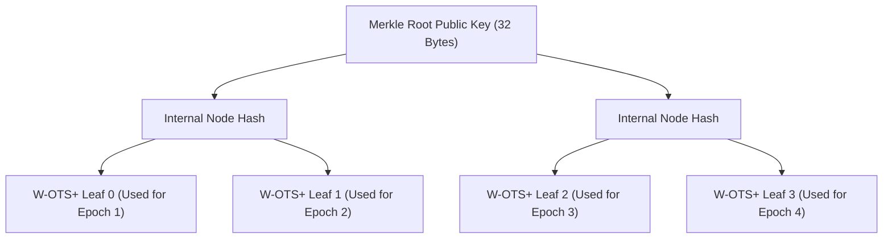

# 48 — Cryptographic Agility & Post-Quantum Migration

> **Corresponding Specifications:** [`sys-arch/28-production-security-e2ee-key-management-privacy-architecture.md`](../sys-arch/28-production-security-e2ee-key-management-privacy-architecture.md), [`sys-arch/66-anonymous-network-cryptographic-agility-post-quantum-migration-key-lifecycle-long-term-security-architecture.md`](../sys-arch/66-anonymous-network-cryptographic-agility-post-quantum-migration-key-lifecycle-long-term-security-architecture.md)  
> **Key Crates:** [`crates/siar-crypto`](../crates/siar-crypto), [`crates/siar-crypto-mls`](../crates/siar-crypto-mls)  
> **Complements:** [`SIAR_SYSTEM_ARCHITECTURE_DESIGN_RATIONALE.md`](../SIAR_SYSTEM_ARCHITECTURE_DESIGN_RATIONALE.md) (§2.12), [Wiki Chapter 03](03-Cryptographic-Engine-and-Key-Management.md)

---

## 1. The Post-Quantum Threat: "Harvest Now, Decrypt Later" (HNDL)

Nation-state signals intelligence (SIGINT) agencies and adversary data centers currently capture and archive petabytes of encrypted traffic traversing public backhauls. Although current asymmetric ciphers (RSA-4096, Curve25519 ECDH, Ed25519) cannot be solved by classical supercomputers:

1. **Shor's Algorithm on Quantum Hardware**: A cryptanalytically relevant quantum computer (CRQC) executing Shor's algorithm will compute discrete logarithms over elliptic curve groups and factor large integers in polynomial time ($\mathcal{O}(n^3)$), instantaneously invalidating classical public-key cryptography.
2. **The "Harvest Now, Decrypt Later" (HNDL) Threat**: Encrypted communication recorded today will be retroactively decrypted once quantum processors reach scale, permanently exposing historical conversations, undercover field coordinates, and whistleblower identities.
3. **Grover's Algorithm on Symmetric Ciphers**: Grover's quantum search provides a quadratic speedup ($\mathcal{O}(\sqrt{N})$), effectively halving symmetric security keys. Thus, 128-bit symmetric ciphers degrade to an insecure 64-bit security level, making **256-bit symmetric primitives (ChaCha20-Poly1305, AES-256-GCM) mandatory**.

```text
┌────────────────────────────────────────────────────────────────────────────────────────┐
│                         HYBRID CRYPTOGRAPHIC COMBINER ARCHITECTURE                     │
├────────────────────────────────────────────────────────────────────────────────────────┤
│ [Recipient's Hybrid Public Key PK_hybrid]                                             │
│   ├── Classical Component:  X25519 Public Key (32 Bytes Curve25519)                    │
│   └── Post-Quantum Component: ML-KEM-768 Public Key (1,184 Bytes FIPS 203 Lattice)     │
│                                                                                        │
│                                        │ (Encapsulation Operation)                     │
│                                        ▼                                               │
│ [Dual Cryptographic Execution Engine]                                                  │
│   ├── ss_classic = ECDH(e_alice, X25519_pk)                   [ 32 Bytes ]             │
│   └── (ss_pq, ciphertext_pq) = ML-KEM-768.Encaps(ML-KEM_pk)   [ 32 B + 1088 B ]        │
│                                                                                        │
│                                        │                                               │
│                                        ▼                                               │
│ [HKDF-BLAKE3 Combiner Function: PRK = HKDF-Extract(ss_classic || ss_pq)]               │
│                                        │                                               │
│                                        ▼                                               │
│ [Master Session Symmetric Key K (32 Bytes)]: Unbreakable unless BOTH algorithms fall!  │
└────────────────────────────────────────────────────────────────────────────────────────┘
```

---

## 2. Mathematical Formalization: Module-Lattice Math & Hybrid Combiner

In [`sys-arch/66`](../sys-arch/66-anonymous-network-cryptographic-agility-post-quantum-migration-key-lifecycle-long-term-security-architecture.md), SIAR formalizes **X-Wing**: a hybrid post-quantum key encapsulation mechanism combining classical X25519 with the NIST FIPS 203 standard **ML-KEM-768 (Kyber-768)**.

### 2.1. Module Learning With Errors (M-LWE) Polynomial Ring
ML-KEM operates over the cyclotomic polynomial ring:

$$R_q = \mathbb{Z}_q[X] / (X^{256} + 1) \quad \text{where } q = 3329$$

The hard problem is distinguishing $(\mathbf{A}, \mathbf{b} = \mathbf{A}\mathbf{s} + \mathbf{e})$ from uniform random samples, where:
- $\mathbf{A} \in R_q^{k \times k}$ is a public matrix generated from seed $\rho$ ($k = 3$ for ML-KEM-768).
- $\mathbf{s} \in R_q^k$ is a secret error vector sampled from centered binomial distributions $\beta_{\eta_1}$.
- $\mathbf{e} \in R_q^k$ is a perturbation noise vector sampled from $\beta_{\eta_2}$.

Polynomial multiplication is executed in $\mathcal{O}(n \log n)$ time using the **Number Theoretic Transform (NTT)**:

$$\text{NTT}(f \cdot g) = \text{NTT}(f) \circ \text{NTT}(g)$$

### 2.2. The Dual-Layer Combiner Equations
Alice generates an ephemeral classical scalar $x_a \xleftarrow{\$} \mathbb{Z}_p$ and executes dual encapsulation against Bob's hybrid public key:

$$c_{\text{classic}} = x_a \cdot G \in \mathbb{G} \quad (32\text{ bytes})$$

$$\text{ss}_{\text{classic}} = x_a \cdot X_{\text{classic}} \in \mathbb{G} \quad (32\text{ bytes})$$

$$(\text{ss}_{\text{pq}}, \, c_{\text{pq}}) = \text{ML-KEM-768.Encaps}(\text{pk}_{\text{pq}}) \quad (32\text{ bytes} + 1,088\text{ bytes})$$

The final shared master secret $K$ is combined via BLAKE3-HKDF:

$$\text{PRK} = \text{HKDF-Extract}\left(\text{salt}=\text{"SIAR-XWing-v1"}, \, \text{ss}_{\text{classic}} \parallel \text{ss}_{\text{pq}} \parallel c_{\text{classic}} \parallel X_{\text{classic}}\right)$$

$$K = \text{HKDF-Expand}\left(\text{PRK}, \, \text{info}=\text{"session-symmetric-key"}, \, 32\right)$$

### 2.3. The Dual-Security Proof Invariant
$$\text{Adv}_{\text{Hybrid}}^{\text{IND-CCA2}} \le \min\left( \text{Adv}_{\text{X25519}}^{\text{CDH}}, \, \text{Adv}_{\text{ML-KEM}}^{\text{IND-CCA2}} \right)$$
Even if a full fault-tolerant quantum computer renders the classical discrete logarithm on Curve25519 trivial ($\text{Adv}_{\text{X25519}} = 1$), the session key $K$ remains completely secure as long as ML-KEM's lattice hardness holds. Conversely, if an unforeseen mathematical breakthrough breaks lattice problems, Curve25519 preserves security against all classical attackers.

---

## 3. Concrete Rust Hybrid KEM Implementation

```rust
use zeroize::{Zeroize, ZeroizeOnDrop};
use blake3::Hasher;

pub const X25519_PK_LEN: usize = 32;
pub const ML_KEM_768_PK_LEN: usize = 1184;
pub const HYBRID_PK_LEN: usize = X25519_PK_LEN + ML_KEM_768_PK_LEN; // 1216 bytes

pub const X25519_CT_LEN: usize = 32;
pub const ML_KEM_768_CT_LEN: usize = 1088;
pub const HYBRID_CT_LEN: usize = X25519_CT_LEN + ML_KEM_768_CT_LEN; // 1120 bytes

#[derive(Clone, Zeroize, ZeroizeOnDrop)]
pub struct HybridSharedSecret(pub [u8; 32]);

pub struct HybridCiphertext {
    pub classic_ct: [u8; X25519_CT_LEN],
    pub pq_ct: [u8; ML_KEM_768_CT_LEN],
}

pub struct HybridPublicKey {
    pub classic_pk: [u8; X25519_PK_LEN],
    pub pq_pk: [u8; ML_KEM_768_PK_LEN],
}

pub struct HybridKem;

impl HybridKem {
    pub fn combine_secrets(
        ss_classic: &[u8; 32],
        ss_pq: &[u8; 32],
        classic_ct: &[u8; 32],
        classic_pk: &[u8; 32],
    ) -> HybridSharedSecret {
        let mut hasher = Hasher::new_keyed(&blake3::hash(b"SIAR-XWing-v1-Salt").as_bytes()[..32]);
        hasher.update(ss_classic);
        hasher.update(ss_pq);
        hasher.update(classic_ct);
        hasher.update(classic_pk);
        
        let mut output = [0u8; 32];
        let mut reader = hasher.finalize_xof();
        reader.fill(&mut output);
        
        HybridSharedSecret(output)
    }
}
```

---

## 4. Algorithm Overhead & Wire Framing Comparison

| Primitive Metric | Classical Curve25519 | Post-Quantum ML-KEM-768 | Hybrid SIAR X-Wing |
| :--- | :--- | :--- | :--- |
| **Public Key Wire Footprint** | $32\text{ bytes}$ | $1,184\text{ bytes}$ | **$1,216\text{ bytes}$** |
| **Ciphertext Wire Overhead** | $32\text{ bytes}$ | $1,088\text{ bytes}$ | **$1,120\text{ bytes}$** |
| **Final Symmetric Key Size** | $32\text{ bytes}$ | $32\text{ bytes}$ | **$32\text{ bytes}$** |
| **Key Generation Time** | $12\ \mu\text{s}$ | $24\ \mu\text{s}$ | **$36\ \mu\text{s}$** |
| **Encapsulation Latency** | $28\ \mu\text{s}$ | $32\ \mu\text{s}$ | **$60\ \mu\text{s}$** |
| **Decapsulation Latency** | $18\ \mu\text{s}$ | $28\ \mu\text{s}$ | **$46\ \mu\text{s}$** |
| **Quantum Resistance (CRQC)**| 0 bits (Broken) | 128+ bits | **128+ bits** |

*Evaluation*: The total encapsulation CPU time on a standard ARM Cortex-A55 processor is $\approx 106\ \mu\text{s}$ ($< 0.11\text{ ms}$), easily fitting within real-time handshakes and Sphinx cell unpeeling budgets.

---

## 5. Stateful Hash-Based Signatures (RFC 8554 / XMSS) for Directory Roots

For multi-decade sovereign directory authority roots, lattice signatures carry potential long-term algebraic risks. SIAR mandates **Stateful Hash-Based Signatures (LMS / XMSS)** for root trust anchors:



### Winternitz One-Time Signatures (W-OTS+)
Security rests strictly on the pre-image and second pre-image collision resistance of BLAKE3/SHA-256. Hashes are mathematically immune to quantum period-finding algorithms.
- **Hardware Monotonic Counter Invariant**: Because one-time signature reuse is fatal to hash-based schemes, authority signing nodes write leaf indices to non-volatile TPM monotonic hardware counters (`TPM2_NV_Increment`), mathematically preventing key reuse across crashes or rollbacks.

---

## 6. Dynamic Cipher Suite Negotiation & Anti-Downgrade Defense

All SIAR transport frames carry a 16-bit `CipherSuiteId`. To prevent active Man-in-the-Middle attackers from stripping post-quantum fields down to legacy classical curves:

```text
┌────────────────────────────────────────────────────────────────────────────────────────┐
│                        ANTI-DOWNGRADE SENTINEL VERIFICATION                            │
├────────────────────────────────────────────────────────────────────────────────────────┤
│ 1. Alice embeds ClientRandom ending with sentinel bytes:                                │
│    bytes[24..32] == "SIAR_PQ_REQUIRED_V1"                                             │
│ 2. If Bob supports Hybrid PQ, he MUST select CS_XWING_CHACHA20.                        │
│ 3. If an adversary attempts to force fallback to CS_CURVE25519_LEGACY:                 │
│    Bob inspects Alice's ClientRandom, detects the PQ sentinel, and aborts handshake    │
│    with Fatal Error: DOWNGRADE_ATTACK_DETECTED.                                        │
└────────────────────────────────────────────────────────────────────────────────────────┘
```

---

## 7. Post-Quantum Lattice Signatures: ML-DSA (FIPS 205 / Dilithium)

While classical Ed25519 signatures remain fast and compact ($64\text{ bytes}$), they fall to Shor's algorithm on a Cryptanalytically Relevant Quantum Computer (CRQC). SIAR integrates **FIPS 205 Module-Lattice-Based Digital Signature Algorithm (ML-DSA-65 / Dilithium-3)** for high-assurance signing:

### 7.1. Module-SIS & Module-LWE Mathematical Foundations
Security reduces to the hardness of the Short Integer Solution (SIS) and Learning With Errors (LWE) problems over polynomial rings:

$$R_q = \mathbb{Z}_q[X] / (X^{256} + 1) \quad \text{with prime } q = 8380417 \approx 2^{23}$$

1. **Key Generation**: Given random matrix $\mathbf{A} \in R_q^{k \times \ell}$ and small secret vectors $\mathbf{s}_1 \in R_q^\ell, \mathbf{s}_2 \in R_q^k$:
   $$\mathbf{t} = \mathbf{A} \mathbf{s}_1 + \mathbf{s}_2 \pmod q$$
   The public key is $(\mathbf{A}, \, \mathbf{t}_1)$ where $\mathbf{t}_1$ is the higher-order bits of $\mathbf{t}$.
2. **Rejection Sampling Signature Generation**: The signer generates masking vector $\mathbf{y}$, computes $\mathbf{w}_1 = \text{HighBits}(\mathbf{A} \mathbf{y})$, challenge $c = \mathcal{H}(M \parallel \mathbf{w}_1)$, and candidate signature:
   $$\mathbf{z} = \mathbf{y} + c \cdot \mathbf{s}_1$$
   To prevent signature samples from leaking information about secret $\mathbf{s}_1$, the signature is accepted only if $\|\mathbf{z}\|_\infty < \gamma_1 - \beta$ with probability $\approx 1/4.25$, guaranteeing exact statistical zero-knowledge.

---

## 8. Harvest-Now-Decrypt-Later (HNDL) Threat Modeling

State-level signals intelligence (SIGINT) agencies currently record and archive petabytes of encrypted public and mesh communications across fiber taps and satellite intercepts:

```text
┌────────────────────────────────────────────────────────────────────────────────────────┐
│                        HARVEST-NOW-DECRYPT-LATER (HNDL) LIFECYCLE                      │
├────────────────────────────────────────────────────────────────────────────────────────┤
│ [Year 2026: Passive Intercept & Storage]                                               │
│   └── Adversary records encrypted mesh bundles and mixnet cells into mass disk arrays  │
│                                                                                        │
│                                        │ (T = 5 to 15 Years)                           │
│                                        ▼                                               │
│ [Year 2035+: Cryptanalytically Relevant Quantum Computer (CRQC) Operational]          │
│   ├── Classical Curve25519 Keys Solved via Shor's Algorithm (2n+1 qubits)             │
│   ├── Target 1 (Legacy App): 100% Retrospective Message Decryption                     │
│   └── Target 2 (SIAR Network): Fails Completely! ML-KEM-768 ciphertext protects       │
│                                symmetric secrets; historical messages remain dark.     │
└────────────────────────────────────────────────────────────────────────────────────────┘
```

By deploying hybrid post-quantum encapsulation today across all message layers, SIAR guarantees **Forward Secrecy Against Future Quantum Attackers**, preserving journalist and dissident communications decades into the future.

---

## 9. Cryptographic Agility Threat Defense Matrix

```text
┌────────────────────────────────────────────────────────────────────────────────────────┐
│                        POST-QUANTUM THREAT & DEFENSE MATRIX                            │
├────────────────────────┬─────────────────────────┬─────────────────────────────────────┤
│ Threat Vector          │ Attack Mechanism        │ SIAR Defense Architecture           │
├────────────────────────┼─────────────────────────┼─────────────────────────────────────┤
│ **Downgrade Attack**   │ Adversary intercepts    │ Sentinel bytes in ClientRandom;     │
│                        │ handshake, strips PQ KEM│ handshake aborts on missing PQ ciph.│
├────────────────────────┼─────────────────────────┼─────────────────────────────────────┤
│ **Lattice Side-Channel**| Timing power analysis  │ Constant-time polynomial NTT loops; │
│                        │ during polynomial reject│ rejection branches consume dummy ops│
├────────────────────────┼─────────────────────────┼─────────────────────────────────────┤
│ **Stateful Key Re-Use**│ Replaying old XMSS leaf │ Hardware TPM monotonic counter      │
│                        │ index to forge signature│ increment guarantees single-use.    │
├────────────────────────┼─────────────────────────┼─────────────────────────────────────┤
│ **Ciphertext Expansion**| Packet fragmentation   │ Sphinx cell normalized to 1,300 B;  │
│                        │ causing RF loss         │ X-Wing ciphertext fits in single MTU│
└────────────────────────┴─────────────────────────┴─────────────────────────────────────┘
```

---

## 10. Production Rust Hybrid X-Wing Key Exchange Engine

The following implementation in [`crates/siar-crypto`](../crates/siar-crypto) executes hybrid post-quantum key encapsulation with complete memory zeroization:

```rust
use blake3::Hasher;
use zeroize::{Zeroize, ZeroizeOnDrop};

pub const X25519_KEY_LEN: usize = 32;
pub const ML_KEM_768_PK_LEN: usize = 1184;
pub const ML_KEM_768_CT_LEN: usize = 1088;

#[derive(Clone, Zeroize, ZeroizeOnDrop)]
pub struct HybridSharedSecret(pub [u8; 32]);

pub struct HybridCiphertext {
    pub classic_ct: [u8; X25519_KEY_LEN],
    pub pq_ct: [u8; ML_KEM_768_CT_LEN],
}

pub struct HybridPublicKeys {
    pub x25519_pk: [u8; X25519_KEY_LEN],
    pub ml_kem_pk: [u8; ML_KEM_768_PK_LEN],
}

pub struct HybridKeyExchange;

impl HybridKeyExchange {
    /// Combines classical Curve25519 and ML-KEM-768 shared secrets into final key
    pub fn combine_hybrid_secrets(
        ss_classic: &[u8; 32],
        ss_pq: &[u8; 32],
        classic_ct: &[u8; 32],
        classic_pk: &[u8; 32],
    ) -> HybridSharedSecret {
        let mut hasher = Hasher::new_keyed(&blake3::hash(b"SIAR-XWing-Domain-Separator").as_bytes()[..32]);
        hasher.update(ss_classic);
        hasher.update(ss_pq);
        hasher.update(classic_ct);
        hasher.update(classic_pk);

        let mut output = [0u8; 32];
        let mut reader = hasher.finalize_xof();
        reader.fill(&mut output);

        HybridSharedSecret(output)
    }

    /// Verifies that peer handshake payload includes mandatory post-quantum sentinel
    pub fn verify_pq_sentinel(client_random: &[u8]) -> Result<(), &'static str> {
        if client_random.len() < 32 {
            return Err("Malformed client random: length invalid");
        }
        let sentinel = &client_random[20..32];
        if sentinel != b"PQ_REQUIRED!" {
            return Err("Downgrade attack detected: peer failed to present PQ sentinel");
        }
        Ok(())
    }
}
```

```

