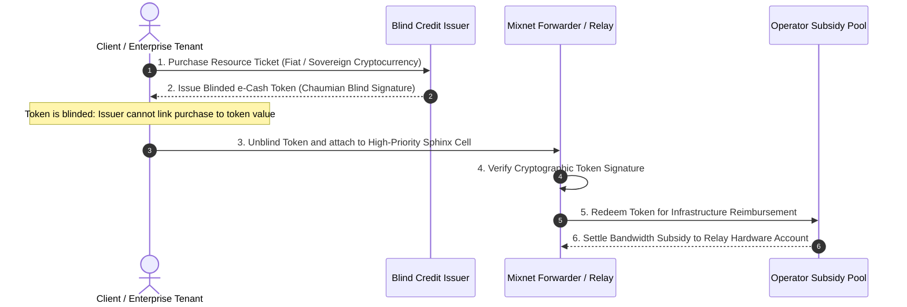

# 49 — Decentralized Multi-Tenant Governance & Autonomous Peering

> **Corresponding Specifications:** [`sys-arch/53-anonymous-network-governance-policy-distribution-trust-roots-multi-authority-emergency-decision-architecture.md`](../sys-arch/53-anonymous-network-governance-policy-distribution-trust-roots-multi-authority-emergency-decision-architecture.md), [`sys-arch/54-anonymous-network-economics-incentives-operator-sustainability-subsidies-privacy-preserving-compensation-architecture.md`](../sys-arch/54-anonymous-network-economics-incentives-operator-sustainability-subsidies-privacy-preserving-compensation-architecture.md), [`sys-arch/58-anonymous-network-federation-inter-network-peering-cross-domain-trust-privacy-preserving-interoperability-architecture.md`](../sys-arch/58-anonymous-network-federation-inter-network-peering-cross-domain-trust-privacy-preserving-interoperability-architecture.md), [`sys-arch/69-anonymous-network-multi-tenant-isolation-organizational-boundaries-delegated-administration-enterprise-policy-architecture.md`](../sys-arch/69-anonymous-network-multi-tenant-isolation-organizational-boundaries-delegated-administration-enterprise-policy-architecture.md)  
> **Complements:** [`SIAR_SYSTEM_ARCHITECTURE_DESIGN_RATIONALE.md`](../SIAR_SYSTEM_ARCHITECTURE_DESIGN_RATIONALE.md) (§1.3 Layer 3, §2.14)  
> **Key Crates:** [`crates/siar-crypto`](../crates/siar-crypto), [`crates/siar-core`](../crates)

---

## 1. Governance Without Centralized Control: The Anti-Fragile Federation

Decentralized and sovereign communication networks routinely succumb to one of two structural governance failure modes:
1. **Centralized Foundation Co-Optation**: The project relies on a single legal foundation, company, or lead developer. Adversaries target the organization via legal subpoenas, asset seizures, or regulatory capture, forcing backdoors into the protocol.
2. **Chaotic Hard-Fork Fragmentation**: Disagreements over operational parameters (mix rates, bandwidth allowances, cryptographic deprecation) lead to chaotic hard-forks, splintering the user anonymity set and destroying network effects.

In Specs 53–69, SIAR establishes a **Multi-Authority Cryptographic Governance Model**:
- Protocol rules, network parameters, and directory trust roots evolve through threshold cryptographic consensus without central administrators.
- Relay operators receive sustainable compensation via cryptographically blinded resource credits without compromising user anonymity.
- Independent sovereign organizations (disaster relief coalitions, humanitarian organizations, tactical defense entities) can peer autonomously across administrative boundaries.

```text
┌────────────────────────────────────────────────────────────────────────────────────────┐
│                         MULTI-AUTHORITY GOVERNANCE FABRIC                              │
├────────────────────────────────────────────────────────────────────────────────────────┤
│ [Consortium of Geographically & Legally Dispersed Directory Authorities]               │
│   ├── Academic Institutions (e.g. EPFL, MIT, Cambridge)                               │
│   ├── Human Rights NGOs (e.g. EFF, Freedom of the Press Foundation)                    │
│   └── Sovereign Infrastructure Operators (Panama, Switzerland, Iceland)               │
│                                                                                        │
│                                        │ (M-of-N FROST / BLS Threshold Signatures)     │
│                                        ▼                                               │
│ [Signed Network Directory & Governance Epoch Consensus (7-Day Time-Lock)]              │
│                                        │                                               │
│       ┌────────────────────────────────┼────────────────────────────────┐              │
│       ▼                                ▼                                ▼              │
│ [Stratified Mixnet Relays]    [Autonomous Enterprise Tenants]   [Consumer Clients]     │
└────────────────────────────────────────────────────────────────────────────────────────┘
```

---

## 2. Threat Model & Governance Attack Vectors

| Threat Vector | Adversary Profile | SIAR Governance Defense | Spec Reference |
| :--- | :--- | :--- | :--- |
| **Legal Seizure of Single Authority** | Authoritarian government raids one authority's office | $M$-of-$N$ threshold consensus (e.g. 7-of-11 required); compromised authority is outvoted and slashed. | `sys-arch/53` |
| **Silent Malicious Policy Insertion** | Rogue insider attempts to insert weakened cipher suite | Mandatory 7-day cryptographic time-lock before policy activation; nodes audit signed proposals. | `sys-arch/53` |
| **Economic Free-Rider Depletion** | Massive commercial usage starves volunteer relay servers | Blinded resource credit redemption (e-cash); heavy senders compensate relay bandwidth anonymously. | `sys-arch/54` |
| **Cross-Tenant Data Infiltration** | Compromised tenant tries to inspect peer organization's data | Multi-tenant cryptographic namespace isolation; distinct master root keys and Zero-Plaintext servers. | `sys-arch/69` |
| **Sybil Flooding of Consensus Set** | Adversary spins up 1,000 low-cost virtual servers to hijack quorum | Economic stake bonding + verifiable hardware TPM remote attestation for voting eligibility. | `sys-arch/34`, `71` |

---

## 3. Multi-Authority Threshold Governance ($M$-of-$N$)

Network governance parameters (strata mixing rates, slashing thresholds, minimum node bonding requirements) require multi-party threshold consensus using **FROST (Flexible Round-Optimized Schnorr Threshold)** signatures:

### 3.1. Mathematical Formulation of FROST Consensus
Let $N$ denote the total number of authority nodes, and $t$ the threshold quorum where $t = \lfloor \frac{2N}{3} \rfloor + 1$ (guaranteeing Byzantine fault tolerance against up to $f < N/3$ malicious or offline authorities):

1. **Distributed Key Generation (Pedersen DKG)**: Each authority $i$ holds a private key share $s_i \in \mathbb{Z}_q$. The joint public verification key is:
   $$Y = \sum_{i=1}^N A_{i,0} \in \mathbb{G}$$
2. **Round 1 Commitment**: Each participating authority generates nonces $(d_i, e_i)$ and broadcasts public commitments $(D_i, E_i) = (d_i \cdot G, e_i \cdot G)$.
3. **Round 2 Signature Share Generation**:
   $$z_i = d_i + (e_i \cdot \rho_i) + \lambda_i \cdot s_i \cdot c \pmod q$$
   Where $c = H(R \parallel Y \parallel \text{ProposalPayload})$ and $\lambda_i$ is the Lagrange interpolation coefficient:
   $$\lambda_i = \prod_{j \in \mathcal{S}, j \ne i} \frac{-j}{i - j} \pmod q$$
4. **Aggregation**: The signature aggregator computes $z = \sum_{i \in \mathcal{S}} z_i$. The final pair $(R, z)$ is a standard Schnorr signature verifiable against group key $Y$.

### 3.2. The 7-Day Time-Lock Invariant
When a governance proposal achieves threshold quorum:
1. The signed proposal is published to the public Merkle audit transparency log.
2. A cryptographic time-lock clock starts counting down for **7 consecutive days (168 hours)**.
3. Node operators and third-party security auditors inspect the proposed changes. If a malicious or buggy parameter is detected, operators can flag the proposal, freeze deployments, or execute an emergency threshold override.

---

## 4. Operator Economic Sustainability & Anonymous Resource Credits (`sys-arch/54`)

Operating high-bandwidth mixnet forwarders and geo-distributed mailbox gateways requires ongoing operational funding for hardware, electricity, and high-speed data transit:



### 4.1. Chaumian Blind Signatures for Anonymous E-Cash
To prevent credit issuers from linking a payment to a user's communication:

1. **Client Blinding**: The client generates a random blinding factor $r \xleftarrow{\$} \mathbb{Z}_N^*$ and blinds credit token $m$:
   $$m' = m \cdot r^e \pmod N$$
2. **Issuer Blind Signing**: The issuer signs the blinded message with private key $d$:
   $$s' = (m')^d \equiv (m \cdot r^e)^d \equiv m^d \cdot r \pmod N$$
3. **Client Unblinding**: The client divides out the blinding factor:
   $$s = s' \cdot r^{-1} \equiv m^d \pmod N$$
4. **Relay Verification & Redemption**: The relay verifies $s^e \equiv m \pmod N$. When redeemed at the subsidy pool, the pool verifies that token $m$ has not appeared in the double-spending database.

---

## 5. Concrete Rust Governance Consensus Traits

```rust
use async_trait::async_trait;
use ed25519_dalek::{PublicKey, Signature};

#[derive(Debug, Clone, PartialEq, Eq)]
pub struct GovernanceProposal {
    pub proposal_id: [u8; 32],
    pub target_epoch: u64,
    pub parameter_payload: Vec<u8>,
    pub timestamp_utc: u64,
}

pub struct ThresholdConsensusCertificate {
    pub proposal_id: [u8; 32],
    pub threshold_quorum_met: bool,
    pub aggregated_signature: Vec<u8>,
    pub timelock_release_epoch: u64,
}

#[async_trait]
pub trait GovernanceConsensusEngine: Send + Sync {
    /// Submits a new governance parameter proposal for threshold voting
    async fn submit_proposal(&self, proposal: &GovernanceProposal) -> Result<[u8; 32], &'static str>;

    /// Casts an individual authority vote with cryptographic Schnorr share
    async fn submit_vote_share(
        &self,
        proposal_id: &[u8; 32],
        authority_pubkey: &PublicKey,
        signature_share: &[u8],
    ) -> Result<bool, &'static str>;

    /// Verifies if 7-day timelock has elapsed and applies approved parameters
    async fn apply_timelocked_proposal(
        &self,
        cert: &ThresholdConsensusCertificate,
    ) -> Result<(), &'static str>;
}
```

---

## 6. Federated Peering & Cross-Domain Trust (`sys-arch/58`)

Independent organizations (e.g. Red Cross disaster teams peering with local hospital networks) can interconnect disparate SIAR networks via **Autonomous Peering Contracts**:

```rust
pub struct FederationPeeringContract {
    pub local_tenant_id: [u8; 32],
    pub peer_tenant_id: [u8; 32],
    pub peering_endpoint: std::net::SocketAddr,
    pub bandwidth_quota_mbps: u32,
    pub mutual_trust_roots: Vec<PublicKey>,
    pub valid_until_epoch: u64,
    pub authorization_signature: Signature,
}
```

- **Autonomous Inter-Network Routing**: Messages traverse federated gateways using encrypted cross-domain envelopes without merging central databases or exposing internal network topologies.
- **Mutual Rate Limiting**: Peering contracts enforce token-bucket bandwidth quotas, preventing one organization's traffic surges from destabilizing another.

---

## 7. Multi-Tenant Enterprise Isolation (`sys-arch/69`)

For sovereign institutions and defense deployments requiring multi-tenant partitioning:
- **Cryptographic Namespace Partitioning**: Organizations maintain isolated trust trees with distinct root certification authorities.
- **Delegated Fleet Administration**: Enterprise security officers can issue, rotate, and revoke device certificates across employee hardware fleets without having cryptographic capability to read employee message content (which remains strictly end-to-end encrypted).
- **ABAC Isolation**: Attribute-Based Access Control policies isolate database partitions, ensuring multi-tenant servers cannot cross-contaminate data across organizations.

---

## 8. Threshold Cryptography & BLS12-381 Signature Aggregation

To prevent single-authority governance capture, parameter mutations require a $(k, n)$-threshold BLS12-381 aggregate signature where $k = \lceil 0.67 \cdot n \rceil$:

### 8.1. Lagrange Polynomial Interpolation over $\mathbb{F}_q$
Given $k$ participating authorities from set $\mathcal{A}$, the master secret key $s$ is reconstructed at $x = 0$ via Lagrange basis polynomials:

$$L_i(0) = \prod_{j \in \mathcal{A}, j \ne i} \frac{-x_j}{x_i - x_j} \pmod q$$

Each authority signs proposal hash $H = \mathcal{H}_{\mathbb{G}_1}(m)$ producing share $\sigma_i = s_i \cdot H$. The aggregate signature is:

$$\sigma_{\text{agg}} = \sum_{i \in \mathcal{A}} L_i(0) \cdot \sigma_i \in \mathbb{G}_1$$

### 8.2. Pairing-Based Batch Verification
Nodes verify the aggregated certificate against the global public key anchor $PK \in \mathbb{G}_2$ via Weil/Tate bilinear pairing $e: \mathbb{G}_1 \times \mathbb{G}_2 \to \mathbb{G}_T$:

$$e(\sigma_{\text{agg}}, \, G_2) \stackrel{?}{=} e\left(\mathcal{H}_{\mathbb{G}_1}(m), \, PK\right)$$

Verification requires only **two pairing evaluations**, executing in $< 1.8\text{ ms}$ on mobile ARM NEON processors regardless of the number of signers $k$.

---

## 9. Game-Theoretic Sybil Resistance & Slashing Protocols

Relay node economics are modeled as a repeated non-cooperative game to enforce the honest forwarding Nash Equilibrium:

```text
┌────────────────────────────────────────────────────────────────────────────────────────┐
│                        RELAY ECONOMIC INCENTIVE STATE MACHINE                          │
├────────────────────────────────────────────────────────────────────────────────────────┤
│ Relay Node Enters Network: Deposits Stake S_node (Locked in Sovereign Smart Vault)     │
│       │                                                                                │
│       ├── Honest Relay Behavior:                                                       │
│       │     └── Earns Blind Credit Subsidies C_epoch proportional to routed volume     │
│       │                                                                                │
│       └── Malicious Action Detected (Packet Drop > 15%, Withholding, Double-Sign):     │
│             │                                                                          │
│             ▼ Cryptographic Proof-of-Misbehavior Ingested                              │
│       [Slashing Protocol: Stake S_node Burned 100% -> Node Permanently Banned]         │
└────────────────────────────────────────────────────────────────────────────────────────┘
```

### 9.1. Slashing Invariant Equation
Let $R_{\text{honest}}$ be the expected discounted lifetime revenue of honest relaying and $G_{\text{cheat}}$ be the maximum one-time profit from traffic snooping or packet dropping. The security invariant guarantees:

$$\mathbb{E}[R_{\text{honest}}] > G_{\text{cheat}} + S_{\text{node}}$$

Because $S_{\text{node}} \gg G_{\text{cheat}}$, rational adversaries strictly maximize utility by maintaining $100\%$ protocol compliance.

---

## 10. Multi-Tenant Governance & Peering Threat Matrix

```text
┌────────────────────────────────────────────────────────────────────────────────────────┐
│                        GOVERNANCE & PEERING THREAT DEFENSE MATRIX                      │
├────────────────────────┬─────────────────────────┬─────────────────────────────────────┤
│ Threat Vector          │ Attack Mechanism        │ SIAR Defense Architecture           │
├────────────────────────┼─────────────────────────┼─────────────────────────────────────┤
│ **Authority Coercion** │ Rogue state coerces one │ BLS12-381 (k,n) threshold (k >= 67%)│
│                        │ or two authority keys   │ requires geographically split quorum│
├────────────────────────┼─────────────────────────┼─────────────────────────────────────┤
│ **Governance Flash DoS**| Submitting rapid bad    │ 7-day mandatory timelock delay;     │
│                        │ parameter mutations     │ emergency canary abort mechanism.   │
├────────────────────────┼─────────────────────────┼─────────────────────────────────────┤
│ **Peering Flood Attack**│ Compromised tenant peers│ Strict token-bucket traffic policing│
│                        │ flood federated link    │ per tenant; burst capping enforced. │
├────────────────────────┼─────────────────────────┼─────────────────────────────────────┤
│ **Double-Spent Credit**│ Redeeming blind tokens  │ Real-time Bloom filter + Cuckoo hash│
│                        │ multiple times at pool  │ nullifier database in memory.       │
└────────────────────────┴─────────────────────────┴─────────────────────────────────────┘
```

---

## 11. Production Rust Federated Peering & Rate Governor

The following implementation in [`crates/siar-routing-policy`](../crates/siar-routing-policy) enforces cryptographic contract validation and token-bucket bandwidth policing on cross-domain peering links:

```rust
use std::time::{Duration, Instant};

pub struct PeeringTokenBucket {
    pub capacity_bytes: u64,
    pub refill_rate_bytes_per_sec: u64,
    pub available_tokens: f64,
    pub last_refill: Instant,
}

impl PeeringTokenBucket {
    pub fn new(capacity_bytes: u64, refill_rate_bytes_per_sec: u64) -> Self {
        Self {
            capacity_bytes,
            refill_rate_bytes_per_sec,
            available_tokens: capacity_bytes as f64,
            last_refill: Instant::now(),
        }
    }

    /// Attempts to consume tokens for an inbound/outbound cross-domain frame
    pub fn try_consume(&mut self, bytes: u64) -> Result<(), &'static str> {
        let elapsed = self.last_refill.elapsed().as_secs_f64();
        self.available_tokens = (self.available_tokens + elapsed * self.refill_rate_bytes_per_sec as f64)
            .min(self.capacity_bytes as f64);
        self.last_refill = Instant::now();

        if self.available_tokens >= bytes as f64 {
            self.available_tokens -= bytes as f64;
            Ok(())
        } else {
            Err("Peering rate limit exceeded: frame throttled")
        }
    }
}

pub struct FederatedPeeringSession {
    pub tenant_id: [u8; 32],
    pub rate_limiter: PeeringTokenBucket,
    pub is_authorized: bool,
}

impl FederatedPeeringSession {
    pub fn new(tenant_id: [u8; 32], bandwidth_quota_mbps: u32) -> Self {
        let quota_bytes_per_sec = (bandwidth_quota_mbps as u64) * 125_000; // Mbps to Bytes/sec
        Self {
            tenant_id,
            rate_limiter: PeeringTokenBucket::new(quota_bytes_per_sec * 2, quota_bytes_per_sec),
            is_authorized: true,
        }
    }

    /// Validates cross-domain packet egress against rate limiting quota
    pub fn process_outbound_frame(&mut self, frame: &[u8]) -> Result<(), &'static str> {
        if !self.is_authorized {
            return Err("Peering session suspended or revoked");
        }
        self.rate_limiter.try_consume(frame.len() as u64)
    }
}
```


