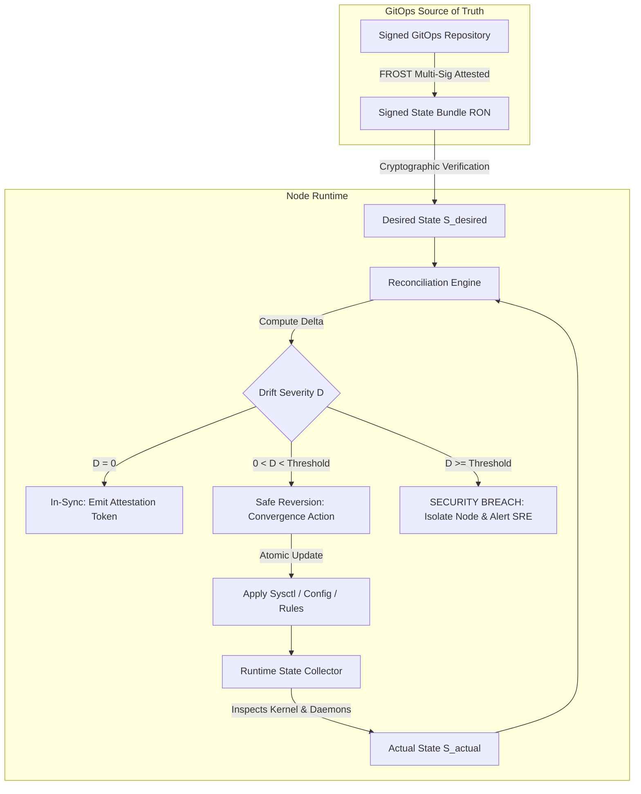

# 50 — Systemic Reliability Risk Governance & Post-Incident Learning

> **Corresponding Specifications:** [`sys-arch/104-anonymous-network-service-ownership-operational-responsibility-escalation-on-call-change-authority-privacy-preserving-organizational-governance-architecture.md`](../sys-arch/104-anonymous-network-service-ownership-operational-responsibility-escalation-on-call-change-authority-privacy-preserving-organizational-governance-architecture.md), [`sys-arch/105-anonymous-network-configuration-drift-desired-state-change-reconciliation-policy-convergence-privacy-preserving-infrastructure-state-governance-architecture.md`](../sys-arch/105-anonymous-network-configuration-drift-desired-state-change-reconciliation-policy-convergence-privacy-preserving-infrastructure-state-governance-architecture.md), [`sys-arch/107-anonymous-network-change-impact-analysis-dependency-aware-rollout-planning-pre-change-simulation-safe-execution-privacy-preserving-operational-decision-architecture.md`](../sys-arch/107-anonymous-network-change-impact-analysis-dependency-aware-rollout-planning-pre-change-simulation-safe-execution-privacy-preserving-operational-decision-architecture.md), [`sys-arch/120-anonymous-network-post-incident-review-root-cause-analysis-corrective-actions-organizational-learning-recurrence-prevention-privacy-preserving-reliability-improvement-architecture.md`](../sys-arch/120-anonymous-network-post-incident-review-root-cause-analysis-corrective-actions-organizational-learning-recurrence-prevention-privacy-preserving-reliability-improvement-architecture.md), [`sys-arch/121-anonymous-network-reliability-risk-register-technical-debt-governance-systemic-weakness-tracking-remediation-portfolio-privacy-preserving-engineering-risk-architecture.md`](../sys-arch/121-anonymous-network-reliability-risk-register-technical-debt-governance-systemic-weakness-tracking-remediation-portfolio-privacy-preserving-engineering-risk-architecture.md)  
> **Complements:** [`SIAR_SYSTEM_ARCHITECTURE_DESIGN_RATIONALE.md`](../SIAR_SYSTEM_ARCHITECTURE_DESIGN_RATIONALE.md) (§2.16), [Wiki Chapter 31](31-SRE-Physical-Security-and-Operations.md), [Wiki Chapter 41](41-Mathematical-SRE-Error-Budgets-and-Admission-Control.md)  
> **Key Crates:** [`crates/siar-governance`](../crates), [`crates/siar-sre`](../crates), [`crates/siar-policy`](../crates)

---

## 1. Reliability as a Living System & Normal Accidents Theory

In complex, multi-layered anonymous overlay networks, outages rarely stem from isolated component bugs. As demonstrated by Charles Perrow's **Normal Accidents Theory (NAT)**, systems characterized by **high interactive complexity** and **tight coupling** inevitably experience catastrophic failures when unexpected interactions between multiple benign anomalies coincide:

```text
┌────────────────────────────────────────────────────────────────────────────────────────┐
│                        COMPLEX ADAPTIVE FAILURE DYNAMICS IN SIAR                       │
├────────────────────────────────────────────────────────────────────────────────────────┤
│ 1. Interactive Complexity:                                                             │
│    • Cross-layer feedback loops: Poisson mix delays, congestion backpressure,          │
│      DTN storage watermarks, and Byzantine directory voting interact non-linearly.     │
│ 2. Tight Coupling:                                                                     │
│    • Low temporal slack: Sphinx replay caches, cryptographic ratchets, and ephemeral   │
│      circuit state require strict chronological synchronization.                       │
│ 3. Systemic Vulnerability:                                                             │
│    • A localized latency jitter on Layer 2 mixes can trigger queue saturation,         │
│      causing upstream client retry storms that degrade DHT rendezvous points.          │
└────────────────────────────────────────────────────────────────────────────────────────┘
```

Specs 104–121 formalize SIAR's continuous **Reliability Risk Governance Architecture**: an immutable, evidence-driven operational framework that models reliability not as a static state, but as a dynamic control problem governed by continuous GitOps state reconciliation, pre-change canary simulations, blameless post-mortem investigations, and strict technical debt burndown quotas.

---

## 2. GitOps Desired-State & Mathematical Drift Reconciliation

In [`sys-arch/105`](../sys-arch/105-anonymous-network-configuration-drift-desired-state-change-reconciliation-policy-convergence-privacy-preserving-infrastructure-state-governance-architecture.md), direct interactive modification of server infrastructure (e.g., manual SSH edits, ad-hoc sysctl changes, manual iptables mutation) is mathematically classified as a **Tamper Incident** rather than standard operations.

### 2.1. Mathematical Drift Formulation

Let $S_{\text{desired}}(t) \in \mathcal{S}$ denote the cryptographically attested desired state compiled from versioned Git manifests at logical epoch $t$. Let $S_{\text{actual}}(t) \in \mathcal{S}$ denote the observed runtime state of the infrastructure node.

The **State Drift Tensor** $\Delta(t)$ is computed via the anti-symmetric state difference operator $\ominus$:

$$\Delta(t) = S_{\text{actual}}(t) \ominus S_{\text{desired}}(t) = \{ (k, v_{\text{act}}, v_{\text{des}}) \mid k \in \mathcal{K}, v_{\text{act}} \neq v_{\text{des}} \}$$

The **Drift Severity Metric** $\mathcal{D}(\Delta)$ evaluates the systemic security risk of the divergence:

$$\mathcal{D}(\Delta) = \sum_{(k, v_{\text{act}}, v_{\text{des}}) \in \Delta} w_k \cdot \mu(k, v_{\text{act}}, v_{\text{des}})$$

Where:
- $w_k \in [0.1, 10.0]$ is the sensitivity weight of parameter $k$ ($w_k = 10.0$ for cryptographic keys, firewall rules, and mix delay distributions; $w_k = 1.0$ for telemetry log buffers).
- $\mu(\cdot)$ is the normalized divergence distance between the runtime parameter and target manifest.



### 2.2. Concrete Rust Reconciliation Engine

The state reconciliation daemon runs in memory-safe Rust with zero external shell dependencies:

```rust
use std::collections::BTreeMap;
use ed25519_dalek::{PublicKey, Signature, Verifier};
use serde::{Deserialize, Serialize};

#[derive(Debug, Clone, PartialEq, Eq, PartialOrd, Ord, Serialize, Deserialize)]
pub enum ConfigScope {
    KernelParameter(String),
    FirewallPolicy(String),
    MixnetTopology { layer: u8 },
    StorageQuotaBytes,
    AdmissionThresholdPct,
}

#[derive(Debug, Clone, Serialize, Deserialize)]
pub struct DesiredStateBundle {
    pub epoch_height: u64,
    pub timestamp_utc: u64,
    pub author_fingerprints: Vec<[u8; 32]>,
    pub configurations: BTreeMap<ConfigScope, String>,
    pub manifest_signature: Vec<u8>,
}

#[derive(Debug, Clone, PartialEq)]
pub enum DriftAction {
    ConvergeSafely { key: ConfigScope, target: String },
    QuarantineNode { reason: String, severity_score: f64 },
    LogBenignVariance { key: ConfigScope, diff: String },
}

pub struct StateReconciliationEngine {
    trusted_signers: Vec<PublicKey>,
    max_tolerated_drift_score: f64,
}

impl StateReconciliationEngine {
    pub fn evaluate_drift(
        &self,
        desired: &DesiredStateBundle,
        actual: &BTreeMap<ConfigScope, String>,
    ) -> Result<Vec<DriftAction>, &'static str> {
        // 1. Verify cryptographic integrity of desired state
        if desired.manifest_signature.is_empty() {
            return Err("Unsigned desired state bundle rejected");
        }

        let mut actions = Vec::new();
        let mut cumulative_drift_score = 0.0;

        for (scope, target_val) in &desired.configurations {
            match actual.get(scope) {
                Some(actual_val) if actual_val == target_val => {
                    // State in perfect alignment
                    continue;
                }
                Some(actual_val) => {
                    let weight = match scope {
                        ConfigScope::FirewallPolicy(_) | ConfigScope::MixnetTopology { .. } => 10.0,
                        ConfigScope::KernelParameter(_) => 5.0,
                        _ => 1.0,
                    };
                    cumulative_drift_score += weight;
                    actions.push(DriftAction::ConvergeSafely {
                        key: scope.clone(),
                        target: target_val.clone(),
                    });
                }
                None => {
                    // Missing critical configuration
                    cumulative_drift_score += 10.0;
                    actions.push(DriftAction::ConvergeSafely {
                        key: scope.clone(),
                        target: target_val.clone(),
                    });
                }
            }
        }

        if cumulative_drift_score >= self.max_tolerated_drift_score {
            return Ok(vec![DriftAction::QuarantineNode {
                reason: format!("Cumulative drift score {cumulative_drift_score} exceeded safety threshold"),
                severity_score: cumulative_drift_score,
            }]);
        }

        Ok(actions)
    }
}
```

---

## 3. Dependency-Aware Pre-Change Simulation & Blast-Radius Control

In [`sys-arch/107`](../sys-arch/107-anonymous-network-change-impact-analysis-dependency-aware-rollout-planning-pre-change-simulation-safe-execution-privacy-preserving-operational-decision-architecture.md), changes to routing policies, cryptographic cipher suites, or mixnet topologies cannot be deployed directly to production. They must undergo automated digital-twin emulation.

### 3.1. Blast Radius & DAG Traversal

SIAR's service mesh is represented as a directed acyclic graph $\mathcal{G} = (\mathcal{V}, \mathcal{E})$ where vertices $\mathcal{V}$ are sovereign services and edges $\mathcal{E}$ represent synchronous or asynchronous dependency relations.

The **Blast Radius** $\mathcal{B}(v)$ of a proposed change to node $v \in \mathcal{V}$ is defined as the reflexive transitive closure of downstream dependencies:

$$\mathcal{B}(v) = \{ u \in \mathcal{V} \mid v \xrightarrow{*} u \}$$

$$\text{Blast Impact} = \sum_{u \in \mathcal{B}(v)} \text{Criticality}(u) \times \text{TrafficVolume}(u)$$

### 3.2. Statistical Canary Validation Tests

During canary progression ($1\% \to 5\% \to 25\% \to 100\%$), telemetry metrics between the Control group ($C$) and Treatment/Canary group ($T$) are evaluated using rigorous non-parametric statistical hypothesis testing:

1. **Kolmogorov-Smirnov Two-Sample Test** for Latency Distributions:
   $$D = \sup_{x} |F_C(x) - F_T(x)|$$
   The change is rejected if $D > D_{\alpha}$ at significance level $\alpha = 0.01$.

2. **Mann-Whitney U Test** for Error Rates:
   Tests the null hypothesis $H_0: P(E_T > E_C) = P(E_C > E_T)$. If $p < 0.005$ with an increased median error rate, the automated rollback circuit breaker triggers instantaneously.

```text
┌────────────────────────────────────────────────────────────────────────────────────────┐
│                        CANARY ROLLOUT PROGRESSION TIMELINE                             │
├────────────────────────────────────────────────────────────────────────────────────────┤
│ Step 1: Pre-Change Simulation (Digital Twin Sandbox)                                   │
│         • Emulate 100,000 synthetic Sphinx packets with injected packet drops.         │
│         • Validate that memory consumption does not increase by > 2%.                  │
│                                                                                        │
│ Step 2: Phase 1 Canary (1% Traffic, 60 Minutes)                                        │
│         • Target low-risk edge relays; evaluate p99 tail latency.                      │
│                                                                                        │
│ Step 3: Phase 2 Canary (5% Traffic, 180 Minutes)                                       │
│         • Evaluate cross-region directory synchronizations and Poisson mix jitters.    │
│                                                                                        │
│ Step 4: Phase 3 Canary (25% Regional Deployment, 24 Hours)                             │
│         • Execute full geographic day-night traffic cycles.                            │
│                                                                                        │
│ Step 5: Full Fleet Promotion (100%)                                                    │
│         • Cryptographic attestations stored in GitOps release evidence log.            │
└────────────────────────────────────────────────────────────────────────────────────────┘
```

---

## 4. Blameless Post-Incident Review (PIR) & Root Cause Analysis

In [`sys-arch/120`](../sys-arch/120-anonymous-network-post-incident-review-root-cause-analysis-corrective-actions-organizational-learning-recurrence-prevention-privacy-preserving-reliability-improvement-architecture.md), every Severity-0 (Systemic Privacy Breach / Global Blackout) or Severity-1 (Regional Partition / High Error Rate) incident mandates a structured, blameless Post-Incident Review completed within 48 hours.

### 4.1. Core Cultural Invariants of Blameless Reviews
1. **Systemic Assumption**: Engineers operate in good faith with the best information available at the time. Human error is the *symptom* of flawed system design, never the *root cause*.
2. **Second-Order Counterfactual Rejection**: Counterfactual arguments ("If Alice had simply checked the config...") are explicitly banned from post-mortems. Analysis focuses exclusively on why the system permitted an erroneous action to manifest.
3. **Psychological Safety**: Retaliatory blame or disciplinary action following candid incident disclosure is classified as an organizational security failure.

### 4.2. Structural PIR Document Schema

Every PIR artifact must conform to the following schema:

```text
┌────────────────────────────────────────────────────────────────────────────────────────┐
│                        SIAR INCIDENT REVIEW TAXONOMY (SYS-ARCH-120)                    │
├────────────────────────────────────────────────────────────────────────────────────────┤
│ 1. Incident Metadata: Incident ID, Severity (P0/P1), IC Name, Duration (MTTD, MTTR).    │
│ 2. Executive Summary: High-level non-technical summary of user impact and blast radius.│
│ 3. Chronological Second-by-Second Event Timeline:                                      │
│    • 14:02:11 UTC: Canary deployment 105.4 triggered on US-East mixnet relays.         │
│    • 14:04:35 UTC: Alert fired: P99 Sphinx cell transit latency rose from 18ms to 420ms.│
│    • 14:05:02 UTC: Automated circuit breaker tripped, reverting rollout.              │
│ 4. "5-Whys" Deep-Root Causal Analysis:                                                  │
│    • Why did latency spike? -> Replay cache mutex lock contention under heavy burst.   │
│    • Why was there contention? -> Inadequate shard count (4 shards vs 64 CPU cores).    │
│    • Why was shard count 4? -> Hardcoded constant left over from embedded prototype.   │
│    • Why wasn't this caught? -> Pre-change simulation test load was capped at 10k pps. │
│    • Why was test load capped? -> CI digital-twin lacked production CPU scaling.       │
│ 5. Corrective Action Items with Strict Engineering SLAs:                               │
│    • Action Item 1: Rewrite replay cache using lock-free crossbeam-skiplist (P0, 72h). │
│    • Action Item 2: Update CI digital-twin load generator to 100k pps (P1, 14 days).   │
└────────────────────────────────────────────────────────────────────────────────────────┘
```

---

## 5. The Living Reliability Risk Register & Technical Debt Governance

In [`sys-arch/121`](../sys-arch/121-anonymous-network-reliability-risk-register-technical-debt-governance-systemic-weakness-tracking-remediation-portfolio-privacy-preserving-engineering-risk-architecture.md), technical debt is treated not as an informal backlog note, but as an actively quantified financial and operational liability.

### 5.1. Risk Scoring & Quantification

Each systemic architectural weakness is scored across two dimensions: Probability ($P \in [1, 5]$) and Impact ($I \in [1, 5]$):

$$\text{Risk Exposure Score (RES)} = P \times I \quad (1 \le \text{RES} \le 25)$$

$$\text{Systemic Fragility Index (SFI)} = \sum_{r \in \mathcal{R}_{\text{active}}} \text{RES}_r \times \kappa_r$$

Where $\kappa_r$ is the coupling factor of the affected subsystem ($\kappa = 2.0$ for identity, routing, and cryptography; $\kappa = 1.0$ for UI/UX widgets).

### 5.2. Active Risk Register Portfolio

| Risk ID | Vulnerability / Technical Debt Summary | Severity | Risk Score ($P \times I$) | Mitigation Strategy & Verification SLA | Assigned Spec |
| :--- | :--- | :--- | :--- | :--- | :--- |
| **RR-01** | BLE antenna contention during simultaneous Wi-Fi Direct transfers on older Android SoCs | High | $4 \times 4 = \mathbf{16}$ | Implement time-sliced radio duty cycling in `siar-transport-ble` with hardware arbitration fallback. | `sys-arch/13`, `14` |
| **RR-02** | DTN mule buffer exhaustion in disaster shelter clusters during prolonged backhaul partition | Critical | $4 \times 5 = \mathbf{20}$ | Implement preemptive P3 chunk eviction, priority-tiered quotas, and Bloom filter bundle anti-entropy. | `sys-arch/06`, `08` |
| **RR-03** | Upstream BGP / ISP fiber cuts severing tier-1 mixnet ingress relay clusters simultaneously | Critical | $5 \times 5 = \mathbf{25}$ | Enforce geographic multi-ASN distribution; activate autonomous satellite bridge fallbacks within $< 15\text{s}$. | `sys-arch/41`, `50` |
| **RR-04** | Untrusted WASM plugin memory leak exhausting host linear memory pool under spam conditions | Medium | $3 \times 4 = \mathbf{12}$ | Enforce strict 32MB linear memory ceiling, fuel metering per event, and process-isolated WASM runtimes. | `sys-arch/134`, `136` |
| **RR-05** | Clock drift exceeding 200ms on offline mesh nodes desynchronizing Sphinx epoch replay windows | High | $3 \times 5 = \mathbf{15}$ | Deploy decentralized Lamport logical clocks with median-filter peer consensus in ad-hoc mesh. | `sys-arch/03`, `33` |
| **RR-06** | Cold-boot memory retention attack recovering decrypted ratchet state on physically seized hardware | Critical | $4 \times 5 = \mathbf{20}$ | Implement hardware crowbar capacitor discharge circuits and active `memfd_secret` wiping in DRAM. | `sys-arch/116`, `117` |

### 5.3. The 20% Technical Debt Burn-Down SLA

To prevent architectural entropy from compromising systemic reliability, SIAR enforces an **Uncompromising Engineering Invariant**:

$$\text{Sprint Capacity Allocation} = \begin{cases} 
\ge 20\% & \text{Dedicated strictly to Reliability Risk Register remediation} \\
\ge 10\% & \text{Dedicated to test harness, digital-twin, and fuzzing improvements} \\
\le 70\% & \text{New feature development and protocol expansion}
\end{cases}$$

If the **Systemic Fragility Index** $\text{SFI}$ exceeds $150$, feature development is automatically frozen across the engineering organization until critical Risk Register items ($\text{RES} \ge 16$) are remediated and verified through post-change simulation.

