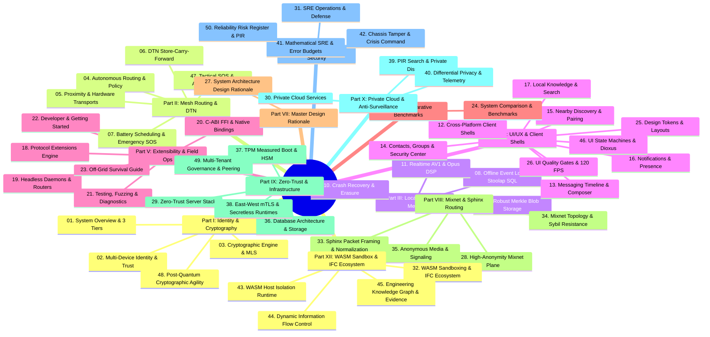

# Welcome to the SIAR Comprehensive Wiki

> **SIAR** (Survivable Identity & Autonomous Routing) is a zero-infrastructure, cryptographically sovereign communication platform engineered for mission-critical resilience, off-grid disaster recovery, and everyday private messaging.
> 
> **Architecture Scope:** 176 Exhaustive Architecture Specifications (514k+ lines, 875k+ words) documented across **50 in-depth wiki chapters in 12 specialized domains**.

> [!CAUTION]
> ### ⚠️ FOUNDATIONAL DEVELOPMENT NOTICE — NOT CURRENTLY USABLE ON ANY DEVICE
>
> * **Active Foundational Development:** SIAR is currently in pre-alpha foundational systems development. **It is NOT YET USABLE on any daily-driver mobile phone, desktop, or operational device.** End-user applications and installable packages will become operational upon the completion of the first formal milestone release (Milestone 1 / v0.1.0+).
> * **AI / LLM Development Transparency Disclosure:** SIAR's extensive architectural specifications (176 specifications across 514k+ lines), wiki documentation, and codebase are **heavily developed with the assistance of advanced Artificial Intelligence / Large Language Models (AI/LLMs)** working under human architectural direction and verification.
> * **URGENT: Security Researchers, Cryptographers & Protocol Engineers Required:** Because SIAR is designed for post-infrastructure, disaster-recovery, and high-threat environments, **independent third-party security researchers and protocol engineers are urgently needed** to perform formal mathematical verification, cryptographic audits, memory safety inspections, and fuzz testing across the cryptography (`siar-crypto`, `siar-crypto-mls`), wire framing (`siar-protocol`, `siar-protocol-ext`), transport/routing (`siar-transport`, `siar-routing-policy`), storage, and media subsystems to discover and eliminate potential vulnerabilities before real-world deployment.
>
> **DO NOT deploy SIAR in production, life-safety, high-threat, or operational environments until formal independent audits and the v0.1.0 milestone release are complete.**

---

## 🧭 Master Wiki Portal & Sitemap



---

## 🏛️ The 3 Tiers of SIAR Architecture (176 Specifications)

The entire specification corpus in [`sys-arch/`](../sys-arch/) and [`ui-ux/`](../ui-ux/) is organized into three distinct operational tiers:

```text
sys-arch/ & ui-ux/ (176 Specifications · 514k+ lines · 875k+ words)
│
├── 1. Core Mesh & Local-First Engine (Parts 01 – 33)
│      105,732 lines · 33 Specs
│      Focus: P2P wire framing, multi-device MLS keys, dynamic routing policy,
│      resumable BLAKE3 blobs, DTN data mules, emergency QoS, lock-free audio DSP.
│
├── 2. UI/UX & Cross-Platform Shells (Parts ui-ux-01 – ui-ux-27)
│      72,610 lines · 27 Specs
│      Focus: Dioxus 0.7 desktop shells, Android Compose shells, design tokens,
│      virtualized message lists, composer, call surfaces, pairing, security center.
│
└── 3. The Anonymous Network & Cloud Operating Ecosystem (Parts 34 – 150)
       336,106 lines · 116 Specs (Parts 34–138, 140–150; 139 reserved)
       Focus: Global Loopix mixnet, Sphinx onion packetization, zero-trust cloud servers,
       TPM measured boot, physical datacenter tamper detection, PIR search, WASM sandboxes.
```

---

## ⚡ The Four Communication Paradigms

```text
┌─────────────────────────────────────────────────────────────────────────────────────────────────────────────────┐
│                                     THE FOUR COMMUNICATION PARADIGMS                                            │
├───────────────────────────────────────┬─────────────────────────────────────────────────────────────────────────┤
│ PARADIGM 1: Internet-Required Non-P2P │ Centralized / Federated Cloud Silos                                     │
│ (WhatsApp, Telegram, Signal, Matrix)  │ • Complete reliance on data centers, DNS, BGP, and ISP infrastructure.  │
│                                       │ • Zero survivability during blackouts, censorship, or off-grid zones.   │
├───────────────────────────────────────┼─────────────────────────────────────────────────────────────────────────┤
│ PARADIGM 2: Internet-Required P2P     │ P2P over IP Networks (DHT / Direct UDP Hole-Punching)                   │
│ (Keet / Holepunch, Tox, Jami)         │ • Eliminates central servers over the Internet via DHT & hole punching. │
│                                       │ • Fatal Blindspot: Completely inoperable without IP / WAN routing.      │
│                                       │ • Zero offline radio mesh, zero BLE/NAN discovery, zero DTN data mules. │
├───────────────────────────────────────┼─────────────────────────────────────────────────────────────────────────┤
│ PARADIGM 3: Offline-Mesh / P2P-Only   │ Radio-Constrained or Network-Isolated Mesh                              │
│ (Briar, BitChat, Bridgefy, Meshtastic)│ • Operates off-grid via local Bluetooth / Wi-Fi mesh.                   │
│                                       │ • Cannot seamlessly utilize the Internet; forced through slow Tor (Briar│
│                                       │   5–30s latency, no VoIP), or isolated to local-only BLE/LoRa radios.  │
│                                       │ • Lacks dynamic multipath bonding, hardware zero-copy media & MLS trees.│
├───────────────────────────────────────┼─────────────────────────────────────────────────────────────────────────┤
│ PARADIGM 4: SIAR Post-Infrastructure  │ Unified Multi-Transport Hybrid Operating System                         │
│ (Survivable Identity & Autonomous     │ • 100% Parity across Global Internet AND Zero-Infrastructure Mesh.      │
│  Routing)                             │ • Simultaneous Multipath Link Aggregation (5G + Wi-Fi + BLE bonded).    │
│                                       │ • Delay-Tolerant Networking (DTN) Store-Carry-Forward via Data Mules.   │
│                                       │ • Sovereign Ed25519/MLS Tree-KEM Cryptography (No Phone Numbers/Emails).│
│                                       │ • Zero-Copy Native Hardware Media Pipelines & 5-Tier Emergency QoS.     │
│                                       │ • Pure Rust 2021 Memory-Safe Core with sub-30MB RAM and <45ms boot.    │
└───────────────────────────────────────┴─────────────────────────────────────────────────────────────────────────┘
```

---

## 📚 Complete Table of Contents by Domain (50 Chapters)

### 🏛️ Part I: Core Architecture, Identity & Cryptography
* **[[01-System-Overview-and-Architecture]]**: High-level design, survivability invariants, workspace topology (39 Rust domain crates, 4 apps, 2 Android JNI bridges), and the 3-Tier architecture.
* **[[02-Multi-Device-Identity-and-Trust]]**: Ed25519 root authority, monotonic certificates, device tree revocation, SAS out-of-band verification.
* **[[03-Cryptographic-Engine-and-Key-Management]]**: IETF MLS (RFC 9420) tree ratchets, pairwise Double Ratchet, BLAKE3 convergent chunk encryption, memory zeroization, post-quantum hybrid KEM roadmap.
* **[[48-Cryptographic-Agility-and-Post-Quantum-Migration]]**: Formal ML-KEM-768 hybrid KEM, PQXDH ratcheting, stateful hash-based signatures (XMSS/LMS), dynamic cipher suite negotiation.

### 🌐 Part II: Mesh Networking, Delay-Tolerant Networking (DTN) & Proximity
* **[[04-Autonomous-Routing-and-Policy-Engine]]**: Cost-aware multi-metric scoring, dynamic link health probes, heterogeneous path selection, hysteresis.
* **[[05-Proximity-and-Hardware-Transports]]**: Pure Rust BLE GATT, Bluetooth Classic RFCOMM, Wi-Fi Direct (P2P), Wi-Fi Aware (NAN), multicast LAN rendezvous.
* **[[06-Delay-Tolerant-Networking-and-Bundle-Forwarding]]**: Store-Carry-Forward bundles, Spray-and-Wait replication, PRoPHET routing, custody transfer receipts.
* **[[07-Battery-Aware-Scheduling-and-Emergency-Mesh]]**: Five-tier QoS priority engine, emergency broadcast flood, duty cycle throttling, sub-1 byte/sec SOS beacons.
* **[[47-Tactical-Field-Operations-Emergency-SOS-and-Acoustic-Beacons]]**: Acoustic chirp audio modems, unassociated Wi-Fi Aware NAN & BLE advertisements, solar repeater deployment.

### 💾 Part III: Storage Engine, Event Log & Media Pipeline
* **[[08-Offline-Event-Log-and-Outbox-Engine]]**: Monotonic sequence outbox queue, Stoolap SQL storage, outbox delivery state machine, causal gap detection, "No One-Database Dogma".
* **[[09-Robust-Blob-Storage-and-Chunk-Transfers]]**: Merkle DAG content addressing, ChaCha20-Poly1305 chunk encryption, resumable transfers, local swarm caching (150–450 MB/s).
* **[[10-Crash-Recovery-and-Data-Portability]]**: Write-ahead logging, transactional atomicity, encrypted backup export/import, cryptographic erasure.
* **[[11-Realtime-Audio-Video-Calling-Architecture]]**: AV1 hardware codec bridge (zero-copy surfaces), Opus DSP (AEC, NS, AGC), P2P signaling state machine.

### 📱 Part IV: UI/UX State, Client Frontends & Mobile Runtimes
* **[[12-Cross-Platform-Client-Architecture]]**: Desktop GUI (Dioxus 0.7 + Rust) and Android Mobile (Jetpack Compose + JNI glue).
* **[[13-Messaging-Timeline-Composer-and-Inbox]]**: Virtualized message timeline, rich attachments, voice note recorder, optimistic UI state.
* **[[14-Contacts-Groups-and-Security-Center]]**: Key verification, MLS group membership management, security center and recovery codes.
* **[[15-Nearby-Discovery-and-Out-of-Band-Pairing]]**: Dynamic QR exchange, NFC bootstrap, zero-configuration local mesh pairing.
* **[[16-Notifications-Presence-and-Background-Lifecycle]]**: Ephemeral presence, typing indicators, push notification triggers, OS background service management.
* **[[17-Local-Knowledge-Retrieval-and-Search]]**: Privacy-first offline BM25 full-text indexing, vector embeddings, local knowledge retrieval.
* **[[25-Design-System-Tokens-and-Responsive-Layouts]]**: Cross-platform design tokens, theme hierarchy, multi-window adaptive layouts.
* **[[26-UI-UX-Performance-Testing-and-Quality-Gates]]**: Onboarding wizards, empty states, 120 FPS virtualization, snapshot regression quality gates.
* **[[46-Cross-Platform-UI-State-Machines-and-Reactive-Runtimes]]**: `siar-ui-state` platform-agnostic business logic, Dioxus reactive desktop signals, Jetpack Compose lifecycle bridges.

### ⚙️ Part V: Extensibility, Operations & Guides
* **[[18-Protocol-Extensions-and-WASM-Plugins]]**: Capability negotiation engine, dynamic extension registry, Wasm sandboxing.
* **[[19-Headless-Daemons-and-Embedded-Nodes]]**: Command-line interface, `emergency-node` solar repeater daemon, OpenWrt/Raspberry Pi targets.
* **[[20-C-ABI-FFI-and-Native-Language-Bindings]]**: Zero-copy C-ABI headers, Android JNI glue, memory safety isolation.
* **[[21-Testing-Fuzzing-and-Network-Diagnostics]]**: Simulated multi-hop `siar-testkit`, AFL/cargo-fuzz suites, dynamic path visualizer.
* **[[22-Getting-Started-and-Developer-Guide]]**: Workspace setup, compilation, unit/property testing, coding standards.
* **[[23-Off-Grid-Survival-and-Field-Operations-Guide]]**: Tactical field deployment, solar mesh setups, emergency response playbook.

### 📊 Part VI: Deep Evaluation & Architectural Benchmarks
* **[[24-System-Comparison-and-Benchmarking]]**: Deep architectural comparison: SIAR vs WhatsApp vs Signal vs Matrix vs Briar vs Keet across 19 technical dimensions, quantitative benchmarks, and comprehensive threat model.

### 🧠 Part VII: System Architecture Master Rationale & Engineering Synthesis
* **[[27-System-Architecture-Design-Rationale]]**: Authoritative design rationale for every single architectural choice across all 176 specs, the engineering crucible, implementation feasibility, and master dependency flow.

### 🛡️ Part VIII: High-Anonymity Mixnet & Sphinx Onion Routing (Specs 34–42)
* **[[28-Anonymous-Mixnet-and-Sphinx-Transport]]**: Loopix stratified mixnet, Poisson delay injection, synthetic cover traffic, Sphinx onion packet cell normalization (Specs 34–42).
* **[[33-Sphinx-Onion-Packet-Framing-and-Cell-Normalization]]**: Mathematical Sphinx framing $(\alpha, \beta, \gamma, \delta)$, length invariance, in-memory Cuckoo anti-replay, Poisson delay sampling (Specs 36, 37).
* **[[34-Mixnet-Topology-Directory-Governance-and-Sybil-Resistance]]**: Stratified $L_1 \to L_2 \to L_3$ mix layering, VRF-based node assignment, Sybil proof-of-stake bonding, formal entropy bounds (Specs 38, 39, 41, 42).
* **[[35-Anonymous-Media-Streaming-and-Call-Signaling]]**: Dual-plane media architecture, mixnet signaling vs blind relay streaming, decoupled anonymous attachment rendezvous points (Specs 40, 44, 45).

### 🔒 Part IX: Zero-Trust Infrastructure, Hardware Security & Sovereign Storage (Specs 50–81)
* **[[29-Zero-Trust-Infrastructure-and-Storage-Architecture]]**: TPM measured boot, remote attestation, HSM ceremonies, "No One-Database Dogma" (PostgreSQL vs 100% pure-Rust sovereign stack), Raft consensus, mTLS (Specs 50–81).
* **[[36-Database-Architecture-and-Sovereign-Storage-Internals]]**: "No One-Database Dogma" (§22), pure-Rust sovereign persistence (Stoolap, redb, fjall, Garage, Fluvio), Raft quorum coordination (Specs 74, 75, 76).
* **[[37-Hardware-Root-of-Trust-TPM-Measured-Boot-and-HSM]]**: Platform Configuration Registers (PCR 0–16), remote attestation quotes, FIPS 140-2 Level 3 HSM signing ceremonies, CycloneDX SBOM (Specs 71, 72, 73).
* **[[38-Zero-Trust-East-West-Networking-and-Secretless-Runtimes]]**: SPIFFE/SPIRE mTLS service mesh, reverse proxy boundary gateways, secretless ephemeral in-memory credentials, ABAC engine (Specs 78, 79, 80, 81).
* **[[49-Decentralized-Multi-Tenant-Governance-and-Autonomous-Peering]]**: $M$-of-$N$ threshold governance signatures, anonymous bandwidth credits, federated cross-domain peering, enterprise isolation (Specs 53, 54, 58, 69).

### 👁️ Part X: Private Cloud Services, Anti-Surveillance & Social Surfaces (Specs 82–94)
* **[[30-Private-Cloud-Services-and-Anti-Surveillance]]**: Private Information Retrieval (PIR) search indexing, Local Differential Privacy telemetry, passkey IdP, private contact discovery, audit transparency (Specs 82–94).
* **[[39-Private-Information-Retrieval-and-Anonymous-Discovery]]**: Homomorphic PIR query processing, zero-knowledge contact matching with salted commitments, anonymous community channels (Specs 85, 86, 91).
* **[[40-Differential-Privacy-and-Anti-Surveillance-Telemetry]]**: Local Differential Privacy $(\epsilon, \delta)$ mathematical formulation, Laplace noise injection, Secure Multi-Party Aggregation (SMPC), Merkle audit logs (Specs 92, 93, 94).

### ⚡ Part XI: Site Reliability Engineering, Physical Security & Crisis Command (Specs 95–121)
* **[[31-SRE-Physical-Security-and-Operations]]**: Chassis tamper detection, emergency memory zeroization, mathematical SLO error budgets, fair load shedding, disaster evacuation (Specs 95–121).
* **[[41-Mathematical-SRE-Error-Budgets-and-Admission-Control]]**: Mathematical SLO formulation, multi-window multi-burn-rate alerting, priority-tiered load shedding, tail latency budgets (Specs 101, 102, 109, 110, 112).
* **[[42-Physical-Facility-Security-Chassis-Tamper-and-Crisis-Command]]**: Physical enclosure intrusion photodiode/accelerometer triggers, sub-millisecond RAM zeroization, disaster evacuation, Incident Command System (Specs 116, 117, 118, 119).
* **[[50-Systemic-Reliability-Risk-Governance-and-Post-Incident-Learning]]**: Desired-state configuration drift reconciliation, pre-change digital twin simulations, blameless PIRs, Reliability Risk Register (Specs 104, 105, 107, 120, 121).

### 🧩 Part XII: Developer Platform, WASM Sandboxing & Information Flow Control (Specs 122–150)
* **[[32-WASM-Sandboxing-IFC-and-Extension-Ecosystem]]**: WebAssembly capability sandboxing, Information Flow Control (IFC) taint tracking, permission consent UX, release evidence archive (Specs 122–150).
* **[[43-WebAssembly-Sandboxing-and-Host-Isolation-Runtime]]**: Wasmtime host boundaries, deterministic fuel metering, 32MB linear memory caps, zero-copy shared memory IPC, background execution quotas (Specs 134, 137, 138, 144).
* **[[44-Dynamic-Information-Flow-Control-and-Data-Governance]]**: Formal IFC lattice model, dynamic taint tracking (`TAINT_SENSITIVE_DATA`), Network Revocation Theorem, remote quarantine tombstones (Specs 135, 136, 146, 147).
* **[[45-Engineering-Traceability-Knowledge-Graph-and-Release-Evidence]]**: DAG requirement-to-code traceability, signed Compliance Trace Packages, 4-stage product maturity gates (Specs 122, 123, 125, 126, 127).

---

## 🚀 Key Architectural Pillars

| Pillar | Architectural Principle | Implementation in SIAR |
| :--- | :--- | :--- |
| **1. Autonomous Survivability** | Zero dependency on centralized servers, DNS, certificates authorities, or cellular backhauls. | `siar-routing-policy`, `siar-connectivity`, `siar-dtn-bundle`, `siar-transport-*` |
| **2. Multi-Transport Agility** | Seamlessly hop between Internet, LAN, Wi-Fi Direct, Wi-Fi Aware, Bluetooth Classic, and BLE. | `siar-connectivity`, `siar-routing-policy` |
| **3. Cryptographic Sovereignty** | Ed25519 master root keys with multi-device certificate trees and MLS group encryption. | `siar-crypto`, `siar-identity-multidevice`, `siar-crypto-mls` |
| **4. Delay-Tolerant Dissemination** | Messages survive complete network partitions via physical mule carry and hop-by-hop spray forwarding. | `siar-dtn-bundle`, `siar-blob-manifest` |
| **5. Native Rust Performance** | Memory-safe, high-concurrency Rust core with zero-copy JNI and Dioxus desktop UI. | `crates/`, `apps/` |
| **6. Whole-Stack Anonymity** | Anonymity treated as an explicit routing property via Loopix mixnets, Sphinx framing, and PIR search. | `sys-arch/34-150`, `crates/` |
| **7. Life-Safety Preemption** | Strict 5-tier QoS with sub-1 byte/sec acoustic chirps and unassociated beaconing. | `siar-emergency`, `sys-arch/17` |
| **8. Zero-Trust Cloud & Hardware**| TPM 2.0 measured boot, sub-millisecond chassis tamper zeroization, and "No One-Database Dogma". | `sys-arch/71-81`, `sys-arch/117` |
